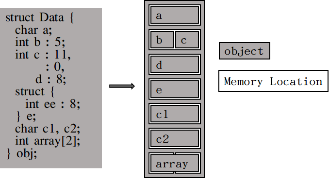

# C++11

## 目录


## 内存模型（Memory Model）
### memory locations
memory Location是C++对内存的一种抽象，它不关心底层计算机系统的寻址方式，它只强调一些对象应该占用自己储存单元，以确保修改一个对象不会影响另一个对象。

C++标准委员会给Memory Location的[定义](https://en.cppreference.com/w/cpp/language/memory_model)是
- 标量类型的对象（算术类型，指针类型，枚举类型或`std::nullptr_t`）
- 或非零长度的最大连续的位域序列

比如说，下面的类Data的对象obj包含8个分离的memory location
```
struct Data {
  char a;     // memory location #1
  int b : 5;  // memory location #2
  int c : 11, // memory location #2 (continued)
        : 0,  // 长度为0的匿名位域表示下一个位域重新开始
      d : 8;  // memory location #3
  struct {
    int ee : 8; // memory location #4
  } e;
  char c1, c2; // memory location #5-#6
  int array[2]; // memory location #7-#8
} obj;
```


需要注意的是：
- 每个变量都是一个对象，包括那些属于其他对象数据成员的变量
- 每个对象至少占用一个memory location
- 基本数据结构（int、char、double、指针等）不管其数据类型，都占一个memory location
- 连续的位域共享一个memory location

### 多线程--一切依赖于momory location
如果两个线程访问不同的memory locations不会池先竞争条件（race condition）。如果两个线程读取同一个memory location也不会产生竞争条件。两个线程同时修改同一memory location会产生竞争条件，其行为是未定义，即使是两个不同对象也不行，的例如下面的例子：
```
struct {
  char a:4, b:4;
}obj;
```
|Thread1|Thread2|-|Memory Value|
|:-:|:-:|:-:|:-:|
|-|-|-|11110001|
|Read(value: 11110001)|-|<--|11110001|
|-|Read(value: 11110001)|<--|11110001|
|Modify(new value: 10100001)|-|-|11110001|
|-|Modify(new value: 11110000)|-|11110001|
|Write|-|-->|10100001|
|-|Write|-->|11110000|

避免竞争条件的方法要么是使用互斥量，要么使用原子操作，将多线程的并发执行强制转换成串行执行。

### `std::memory_order`
C++11定义了6种memory_order
```
typedef enum memory_order {
    memory_order_relaxed,
    memory_order_consume,
    memory_order_acquire,
    memory_order_release,
    memory_order_acq_rel,
    memory_order_seq_cst
} memory_order;
```
默认情况下，`std::atomic`使用的是`memory_order_seq_cst`，是最强的一种访问顺序约束。这六种访问顺序代表三种模型
- 序列一致顺序（sequentially constisent ordering）: memory_irder_seq_cst
- 获取释放顺序（acquire-release ordering）: memory_order_consume, memory_order_acquire, memory_order_release, memory_order_acq_rel
- 宽松顺序（relaxed ordering）: memory_order_relaxed

#### 序列一致顺序
当多线程访问一个序列一致顺序约束的原子操作时，这些线程的访问行为就如同在一个线程中按照某种特定顺序被串行执行。