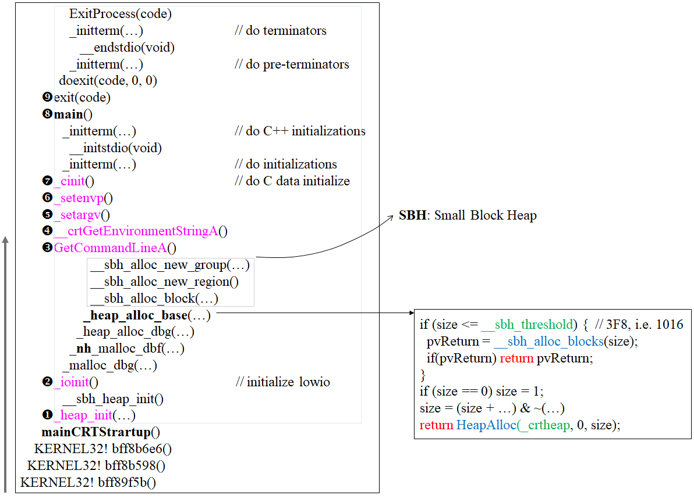

# primintives

## C++ 应用程序


## C++ memory primitives
|分配|释放|类属|可否重载|
|:-|:-|:-|:-|
|malloc()|free()|C函数|不可|
|new|delete|C++表达式|不可|
|::operator new()|::operator delete()|C++函数|可|
|allocator<T>::allocate()|allocator<T>::deallocate()|C++标准库|可自由设计并以之搭配任何容器|

```
示例
void *p1 = malloc(512); //512 bytes
free(p1);

complex<int> *p2 = new complex<int>; // one object
delete p2;
void *p3 = ::operator new(512); // 512 bytes
::operator delete(p3);

#ifdef _MSC_VER
int *p4 = allocator<int>().allocate(3, (int*)0);// 3 ints
allocator<int>().deallocator(p4, 3);
#endif
#ifdef __BOLANDC__
int *p4 = allocator<int>().allocate(5); // 5 ints
allocator<int>().deallocator(p4, 5);
#endif
#ifdef __GNUC__
void *p4 = allocator<int>().allocate(7);  // 7 ints
allocator<int>()deallocate(p4, 7);

void *p5 = __gnu_cxx::__pool_alloc<int>().allocte(9); //9 ints
__gnu_cxx::__pool_alloc<int>().deallocte(p5, 9);
#endif
```

## new expression

```
Complex *pc = new Complex(1, 2);

// 编译器转化为：
Complex *pc;
try {
  void *mem = operator new(sizeof(Complex)); //allocate
  pc = static_cast<Complex*>(mem); //cast
  pc->Complex::Complex(1, 2);  //construct, 只有编译器才可以直接调用Constructor
  // 想要直接调用constructor，可用placement new
  // 例如：new(pc)Complex(1, 2); // pc 已经分配
} catch(std::bad_alloc) {
  // 不执行constuction
}

// operator new(sizeof(Complex))的底层(vc)
void *operator new(size_t size, const std::nothrow_t&)_THROW0() {
  void *p;
  while((p==malloc(size))==0) {
    _TRY_BEGIN
      if(_callnewh(size)==0)break;
    _CATCH(std::bad_alloc) return (0);
    _CATCH_END;
  }
}
```

## delete expression

```
Complex *pc = new Complex(1, 2);
// ...
delete pc;

// 编译器转化为  
pc->~Complex(); //先析构  
operator detele(pc); //然后释放内存

// operator delete(pc)底层  
void __cdecl operator delete(void *p) _THROW0() {
  free(p);
}
```

## array new, array delete

```
Complex *pca = new Complex[3];
// 调用三次默认构造函数
// 无法传入参数给予处置
// ...
delete[] pca; // 调用3次析构函数
// 缺失[]，只会调用一次析构函数
```

delete缺失[]一定会有内存泄露吗？
- 对class without pointer member可能没影响
- 对class with pointer member通常有影响  


## placement new

- placement new允许我们将构造于allocated memory中
- 没有所谓的placement delete，因为placement new根本没有分配memory。
- 与placement new对应的operator new称为placement delete
- 重载的时候要写一个placement delete与placement new对应

例如
```
#include <new>
char *buf = new char[sizeof(Complex)*3];
Complex *pc = new(buf)Complex(1, 2);  // [1]
//...
delete[] buf;
```
编译器转化为：
```
Complex *pc;
try {
  void *mem = operator new(sizeof(Complex), buf);//[2], buf为[1]生成的
  pc = static_cast<Complex*>(mem);
  pc->Complex::Complex(1, 2);
} catch(std::bad_alloc) {
  // 若alloocation失败就不执行constructor
}
```
函数[2]的底层
- 不分配内存，只是将传入的buf返回
```
void *operator new(size_t, void* loc) {
  return loc; 
}
```

## C++应用程序，分配内存的途径


# C++容器，分配内存的途径


## 重载::operator new / ::operator delete
- 重载全局函数的影响无远弗届
```
void *myAlloc(size_t size) {
  return malloc(size);
}
void myFree(void *ptr) {
  return free(ptr);
}
// 他们不可以声明与一个namespace内
inline void *operator new(size_t size) {
  cout << "overload global new()\n";
  return myAlloc(size);
}
inline void *operator new[](size_t size) {
  cout << "overload global new[]()\n";
  return myAlloc(size);
}
inline void operator delete(void *ptr) {
  cout << "overload global delete()\n";
  return myFree(ptr);
}
inline void operator delete[](void *ptr) {
  cout << "overload global delete[]()\n";
  return myFree(ptr);
}
```

## 重载operator new/operator delete

- 在一个具体的类中重载
- 必须是静态函数，但是可以省略static，编译器自动添加
- 原因：构建对象的时候，对象不存在，没有this指针

```
class Foo {
 public:
   void *operator new(size_t);
   void *operator new[](size_t);
   void operator delete(void*, size_t); // size_t is optional
   void operator delete(void*, size_t);
}
```

## 重载placement new: new() / delete() 

- 我们可以重载class member `operator new()`，写出多个版本，前提是每一个版本的声明都必须有独特的参数列，其中第一个参数不许是`size_t`，其余参数以`new`所指定的`placement arguments`为初值。出现`new(...)`小括号内的便是所谓`placement new`。
- 我们也可以重载class member `operator delete()`，写出多个版本。但他们绝不会被`delete`调用。<u>**只有当`new`所调用的构造函数抛出exception，才会调用这些重载版本的`operator delete()`**</u>。它只可能这样被调用，主要用来<u>**归还未能完全创建成功的object所占用的内存**</u>。
- placement new和placement delete参数对应关系
  - placement new第一个参数必须是size_t；placement delete第一个参数是void*
  - 后继参数一一对应
- 即使operator(placement) delete(...)未能一一对应于operator new(...)也不会出现任何报错。没有回应的operator(placement) delete(...)表示放弃处理构造函数发出的异常。
- 示例
  ```
  class Foo {
   public:
    Foo() { cout << "Foo::Foo()" << endl; }
    Foo(int) {cout << "Foo::Foo(int)" << endl; throw Bad(); }
    // (1)这个就是一般的operator new()的重载
    void *operator new(size_t size) { return malloc(size); }
    // (2)这个就是标准库已提供placement new()的重载形式
    void *operator new(size_t size, void *start) { return start; }
    // (3)这个才是崭新的placement new
    void *operator new(size_t, long extra) { return malloc(size+extra); }
    // (4)这又是一个placement new
    void *operator new(size_t size, long extra, char init) { return malloc(size+extra); }
    // (5)这又是一个placement new，但故意写错第一参数的type（必须是size_t）
    void *operator new(long extra, char init) { return malloc(extra); }
    
    // 以下是搭配上述placement new的各个所谓placement delete
    // 当构造函数抛出异常，这儿对应的operator(placement) delete就会被调用
    // 其用途是释放对应之placement new分配的内存
    // (6)这个就是一般的operator delete()的重载
    void operator delete(void *, size_t) {cout << "operator delete(void* size_t)" << endl; }
    // (7) 对应于（2）
    void operator delete(void *, void*) {cout << "operator delete(void* void*)" << endl; }
    // (8) 对应于（3）
    void operator delete(void *, long) {cout << "operator delete(void* long)" << endl; }
    // (9) 对应于（4）
    void operator delete(void *, long char) {cout << "operator delete(void* long char)" << endl; }
  }
  ```

## Per-class allocator

- version1
  增加一个next指针用来管理内存，连接成一个链表（造成内存浪费）
  ```
  #include <cstddef>
  #include <iostream>
  using namespace std;
  class Screen {
   public:
    Screen(int x): i(x) {}
    int get() { return x; }
    void *operator new(size_t);
    void operator delete(void*, size_t);
    // ...
   private:
    Screen *next;
    static Screen* freeStore;
    static const int screenChunk;
    int i;
  };
  Screen* Screen::freeStore = NULL:
  const int Screen::screenChunk = 24;
  void *Screen::operator new(size_t size) {
    Screen *p;
    if(!freeStore) {
      size_t chunk = screenChunk * size;
      freeStore = p = static_cast<Screen*>(new char[chunk]);
      for(;p != &freeStore[screenChunk-1]; ++p)
        p->next = p+1;
      p->next = 0;
    }
    p = freeStore;
    freeStore = freeStore->next;
    return p;
  }
  void operator delere(void *p, size_t size) { // 回收，插入头部
    (static_cast<Screen*>(p))->next = freeStore;
    freeStore = static_cast<Screen*>(p);
  }
  ```

- version2  
  使用嵌入式指针来节省内存
  ```
  class Airplane {
   private:
    struct AirplaneRep {
      unsigned long miles;
      char type;
    };
    union {
      AirplaneRep rep; // 此针对使用中的object
      Airplane* next; // 此针对free list上的object
    };
   public:
    unsigned long getMiles() { return rep.miles; }
    char getType() { return rep.type; }
    void set(unsigned long m, char t) { rep.mile = m; rep.type = t; }
   public:
    static void *operator new(size_t);
    static void *operator delete(void *, size_t);
   private:
    static const int BLOCK_SIZE;
    static Airplane *headOfFreeList;
  };
  const int Airplane::BLOCK_SIZE = 512;
  Airplane* Airplane::headOfFreeList = NULL;

  void *Airplane::operator new(size_t size) {
    if(size != sizeof(Airplane))
      return ::operator new(size);
    Airplane *p = headOfFreeList;
    if(p)
      headOfFreeList = p->next;
    else {
      Airplane *newBlock = static_cast<Airplane*>(::operator new(BLOCK_SIZE*sizeof(Airplane)));
      for(int i = 1; i < BLOCK_SIZE-1; ++i)
        newBlock[i].next = &newBlock[i+1];
      p = newBlock;
      headOfFreeList = &newBlock[1];
    }
    return p;
  }
  void Airplane::operator delete(void *deadObject, size_t size) {
    if(deadObject == 0) return;
    if(size != sizeof(Airplane))
      ::operator delete(deadObject);
    Airplane *carass = static_cast<Airplane*>(deadObject);
    carass->next = headOfFreeList;
    headOfFreeList = carass;
  }
  ```

- version3-  static allocator  
  当你受困于必须为不同的classes重写一遍几乎相同的member operator new和member operator delete时，应该有方法将一个总是分配特定尺寸区块的memory allocator概念包装起来，是他容易被重复使用。一下展示一种做法，每个allocator object都是一个分配器，它维持一个free list；不同的allocator objects维持不用的free list。
  ```
  class allocator {
   public:
    void *allocate(size_t);
    void deallocate(void *, size_t);
   private:
    struct obj { struct obj* next; }; // 嵌入式指针
    obj * freeStore = nullptr;
    const int CHUNK = 4;
  };
  void *allocator::allocate(size_t size) {
    obj *p;
    if(!freeStore) { // 为空，申请一大块
      size_t chunk = CHUNK * size;
      freeStore = p = (obj*)malloc(chunk);
      // 将分配得来的一大块当做linked list
      for(int i = 0; i < CHUNK-1; ++i) {
        p->next = (obj *)((char*)p + size);
        p = p->next;
      }
      p->next = nullptr;
    }
    p = freeStore;
    freeStore = freeStore->next;
    return p;
  }
  void allocator::deallocate(void* p, size_t) {
    // 将*p收回插入free list前端
    ((obj*)p)->next = freeStore;
    freeStore = (obj *)p;
  }
  ```
  
  在其他类中应用这个allocator。不需要进行内存分配操作，让allocator去操心。
  ```
  class Foo {
   public:
    Foo(long l): L(l) {}
    static void* operator new(size_t size) { return myAlloc.allocate(size); }
    static void operator delete(void *p, size_t size) { return myAlloc.deallocate(p, size); }
   private:
    long L;
    string str;
    static allocator myAlloc;
  }
  allocator Foo::myAlloc;
  ```

## version4 - macro for static allocator  
 
将用到allocator的部分定义成宏
```
#define DECLARE_POOL_ALLOC() \
public: \
 void *operator new(size_t size) { return myAlloc.allocate(size); } \
 void operator delete(void *p, size_t size) { return myAlloc.deallocate(p, size); } \
protected: \
 static allocate myAlloc;

#define IMPLEMENT_POOL_ALLOC(classname) \
allocator class_name::myAlloc;
```

则`class Foo`可以简写为
```
class Foo {
   DECLARE_POOL_ALLOC();
   public:
    Foo(long l): L(l) {}
   private:
    long L;
    string str;
    static allocator myAlloc;
  }
  IMPLEMENT_POOL_ALLOC(Foo);
```

## global allocator (with multiple free-lists)

将前述allocator进一步发展为具有16条free-lists，并以此不再以application classes内的static呈现，而是一个global allocator -- 这就是GNU2.9的std::alloc的雏形。


## new handler
当operator new没有能力为你分配出你申请的memory，会抛出一个`std::bad_alloc exception`。某些老式编译器则是返回0--你仍然可以领编译器那么做：  
`new(nothrow) Foo;`  
此为<u>nothrow形式</u>。

抛出exception之前会先（**不只一次**）调用一个<u>可由client指定的handler</u>，以下是new handler的形式和设定方法：
```
typedef void(*new_handler)();
new_handler set_new_handler(new_handler p) throw();
```

良好设计的new handler只有两个选择：
- 让更多的memory可用
- 调用`abort()`或者`exit()`

# std::allocator

## VC6标准分配器之实现
VC6的`allocator`只以`::operator new`和`::operator delete`完成`allocate()`和`deallocate()`，**没有任何特殊的设计**。
```
#ifndef _FARQ
#define _FARQ
#define _PDFT ftrdiff_t
#define _SIZE size_t
#endif

template<class _Ty>
class allocator {
 public:
  typedef _SIZE size_type;
  typedef _PDFT difference_type;
  typedef _Ty _FARQ *pointer;
  typedef _Ty value_type;
  pointer allocate(size_type _N, const void*) {
    return (_Allocate((difference_type)_N, (pointer)0));
  }
  void deallocate(void _FARQ *_P, size_type) { operator delete(_P); }
}
```
其中用到的`_Allocate()`定义如下：
```
template<class _Ty> inline
_Ty _FARQ *_Allocate(_PDFT _N, _Ty _FARQ*) {
  if(_N < 0) _N = 0;
  return ((_Ty _FARQ*)operator new((_SIZE)_N * sizeof(_Ty)));
}
```

## G2.9标准分配器之实现
G2.9的`allocator`只以`::operator new`和`::operator delete`完成`allocate()`和`deallocate()`，**没有任何特殊的设计**。
```
template <class T>
class allocator {
 public:
  typedef T  value_type;
  typedef T* pointer;
  typedef size_t size_type;
  typedef ptrdiff_t difference_type;
  pointer allocate(size_type n) { return ::allocate((difference_type)n, (pointer)0); }
  void deallocate(pointer p) { ::deallocate(p); }
}
```
其中`::allocate`和`::deallocate`的实现为：
```
template <class T>
inline T* allocate(prtdiff_t size, T*) {
  set_new_handler(0);
  T *tmp = (T*)(::operator new((size_t)(size*sizeof(T)));
  if(tmp == 0) {
    cerr << "out of memory" << endl;
    exit(1);
  }
  return tmp;
}

template <class T>
inline void deallocate(T* buffer) { ::operator delete(buffer); }
```

**这个分配器并没有引入到任何SGI STL的容器中，用的是另外一个`std::alloc`**

```
template <class T, class Alloc=alloc>
class vector {//...}

template <class T, class Alloc=alloc>
class list {//...}

template <class T, class Alloc=alloc, size_t BufSiz=0>
class deque {//...}

template <class Key,
          class T,
          class Compare=less<Key>,
          class Alloc=alloc>
class map {//...}

template <class Key,
          class Compare=less<Key>,
          class Alloc=alloc>
class set {//...}
```

- **G2.9版本下的`std::alloc`在G4.9替换为`__gnu_cxx::__pool_alloc`**

## G4.9标准分配器之实现

G4.9的`allocator`只以`::operator new`和`::operator delete`完成`allocate()`和`deallocate()`，**没有任何特殊的设计**。

```
// .../bits/new_allocator.h
template<typename _Tp>
class new_allocator {
  // ...
  pointer allocate(size_type __n, const void* = 0) {
    if(__n > this->max_size())
      std::__throw_bad_alloc();
    return static_cast<_Tp*>(::operator new(__n*sizeof(_Tp)));
  }
  void deallocate(pointer __p, size_type) { ::operator delete(__p); }
}
```
标准分配器`std::allocator`继承的是`__allocator_base`。而`__allocator_base`就是`new_allocator`
```
#define __allocator_base __gnu_cxx::new_allocator
template<typename _Tp>
class allocator: public __allocator_base<_Tp> { //...}
```

## G2.9 std::alloc运行模式（对应于G4.9 __gnu_cxx::__pool_alloc）

- 负责[8, 128]bytes内存的分配，必须是8的倍数，不是的话，补齐。大于128bytes，直接调用`malloc`分配  
  `std::alloc`在向操作系统申请的时候，每次申请20+20个。后20个大小的内存块当做暂配池，后继申请，首先从暂配池中查找，如果有并且可以切个出一个，就切割；否者再去申请。但是每次最多切割20个。  
  

- 嵌入式指针（embedding pointers）
  当客户端获得小区块，获得的即是`char *`（指向某个union object）。此时虽然客户端没有诸如`LString`或`ZString`之类的信息可得知区块的大小，但是由于这个区块是给object所用，等于object大小，object构造函数自然不会越界。  
  

  ```
  struct obj {
    struct obj *free_list_link;
  };
  ```
- 申请32bytes，由于pool为空，故索取并成功向pool注入`32*20*2+RoundUp(0>>4)=1280`，从中切出一个区块返回给客户，19个区块给`list#3`，剩640留用。
  - 累计申请量：1280
  - pool大小：640  
  
- 申请64bytes，由于pool有余量，故取pool划分为640/64=10个区块，第一个给客户，剩9个给`list#7`
  - 累计申请量：1280
  - pool大小：0  
  
- 申请96bytes，由于pool为空，故索取并成功向pool注入`96*20*2+RoundUp(1280>>4)`，从中切出一个区块返回给客户，19个区块给`list#11`，剩2000留用。
  - 累计申请量：5200
  - pool大小：2000   
  

- 申请88bytes，由于pool有余量，故取pool划分为20个区块，从中切出一个区块返回给客户，19个区块给list#10，剩240留用。
  - 累计申请量：5200
  - pool大小：240  
  

- 申请8bytes，由于pool有余量，故取pool划分为20个区块，从中切出一个区块返回给客户，19个区块给list#0，剩80留用。
  - 累计申请量：5200
  - pool大小：80  
  

- 申请104，list#12为空，pool余量有不足供应1个，于是将pool余额分给list#9（碎片处理），然后向系统申请`104*20*2+RoundUp(5200>>4)`，从中切出一个区块返回给客户，19个区块给list#12，剩2408留用。
  - 累计申请量：9688
  - pool大小：2408  
   
- **当无法继续向系统申请的时候，于是alloc从手中资源取最接近链表中取一块（例如，申请72，从80中取出一块），从中切出目的大小的给客户，剩余的当做暂配池。**


## G2.9 `std::alloc`源码剖析
G2.9有两级分配器，G4.9只有一级
```
#include <cstddef>
#include <new>
#define __THROW_BAD_ALLOC \
    cerr << "out of memory"; exit(1)
//---------------------------------------------------
//第1级分配器
//---------------------------------------------------
template <int inst>
class __malloc_alloc_tmeplate {
 private:
  static void *oom_malloc(size_t);
  static void *oom_realloc(void*, size_t);
  static void (*__malloc_alloc_oom_handler)();
 public:
  static void *allocate(size_t n) {
    void *result = malloc(n);                       // 直接调用malloc
    if(0 == n) result = oom_malloc(n);
    return result;
  }

  static void deallocate(void *p, sizt_t) { free(p); }

  static void *reallocate(void *p, size_t old_sz, size_t new_sz) {
    void *result = remalloc(p, new_sz);
    if(0 == reslut) result = oom_realloc(p, new_sz);
    return result;
  }

  static void (*set_malloc_handler(void (*f)()))() {
    void (*old)() = __malloc_alloc_oom_handler;   // 记住原来new_handler
    __malloc_alloc_oom_handler = f;               // 把f记起来一遍后面调用
    return (old);                                 // 把原来的handler传回以便日后恢复
  }
}

template <int inst>
void (*__malloc_alloc_template<inst>::__malloc_alloc_oom_hander)() = 0;

template <int inst>
void *__malloc_alloc_template<inst>::oom_malloc(size_t n) {
  void (*my_malloc_handler)();
  void *result;
  for(;;) {  // 不断尝试释放、分配、再释放、再分配
    my_malloc_handler = malloc_allco_oom_handler;
    if(0 == my_malloc_handler) { __THROW_BAD_ALLOC; }
    (*my_malloc_hanlder)(); // 调用handler，企图释放memory
    result = malloc(n); // 再次尝试分配memory
    if(result) return(result);
  }
}

template <int inst>
void *__malloc_alloc_template<inst>::oom_realloc(void *p, size_t n) {
  void (*my_malloc_handler)();
  void *result;
  for(;;) {
    my_malloc_handler = malloc_allco_oom_handler;
    if(0 == my_malloc_handler) { __THROW_BAD_ALLOC; }
    (*my_malloc_hanlder)(); // 调用handler，企图释放memory
    result = remalloc(n); // 再次尝试分配memory
    if(result) return(result);
  }
}

typedef __malloc_alloc_template<0> malloc_alloc;

//---------------------------------------------------
//第二级分配器
//---------------------------------------------------
enum { __ALIGN = 8; }                            // 对齐，区块大小为8的倍数
enum { __MAX_BYTES = 128; }                      // 区块的上界
enum { __NFERRLISTS = __MAX_BYTES / __ALIGN; }   // free-list个数
template <bool threads, int inst>
class __default_alloc_template {
 private:
  static size_t ROUND_UP(size_t bytes) {
    return (((bytes) + __ALIGN - 1) & ~(__ALIGN - 1)); // 若bytes=13，则(13+7)&~(7)=16
  }

  union obj {
    union obj *free_list_link;
  };

  static obj *volatile free_list[__NFREELISTS];
  static size_t FREELIST_INDEX(size_t bytes) {  // 返回区块大小对于的索引
    return (((bytes) + __ALIGN - 1) / __ALIGN - 1);
  }

  // 向系统申请，第一块返回个客户，剩下的挂到对于的链表中
  static void *refill(size_t n);

  // Allocate a chunk for nobjs of size "size". nobjs may be reduced
  // if it is incovenient to allocate the requested number.
  static char *chunk_alloc(size_t size, int &nobjs);

  // Chunk allocation state
  static char* start_free;   // 指向pool的头
  static char* end_free;     // 指向pool的尾
  static size_t heap_size;   // 分配累计量

 public:
  static void *allocate(size_t n) {
    obj *volatile *my_free_list;  // obj **
    obj *result；
    if(n > (size_t)__MAX_BYTES) { //改用第一级
      return (malloc_alloc::allocate(n));
    }
    my_free_list = free_list + FREELIST_INDEX(n);
    result = *my_free_list;
    if(result == 0) { // list为空
      void *r = refill(ROUND_UP(n));
      return r;
    } // 如果list有可用区块，取头个客户
    *my_free_list = result->free_list_link;
    return (result);
  }

  static void deallocate(void *p, size_t n) {
    // 没有相应的检查，查看p所指的内存是否为此分配出去的
    obj *q = (obj*)p;
    obj *volatile *my_free_list;
    if(n > (size_t)__MAX_BYTES) {
      malloc_alloc::deallocate(p, n); // 改用第一级
      return;
    }
    my_free_list = free_list + FREELIST_INDEX(n);
    q->free_list_link = *my_free_list;
    *my_free_list = q;
  }

  static void *reallocate(void *p, size_t old_sz, size_t new_sz);  // 忽略
};

// Return an object of size n, and optionally adds to size n free list.
// We assume that n is properly aligned. We hold the allocation lock.
template <bool threads, int inst>
void *__default_alloc_template<threads, inst>::refill(size_t) {
  int nobjs = 20; // 预设一次取20个，不一定能有20个
  char *chunk = chunk_alloc(n, nobjs);  // nobjs是pass-by-reference
  obj *volatile *my_free_list;
  obj *result;
  obj *current_obj;
  obj *next_obj;
  int i;
  
  if(1 == nobjs) return(chunk);  // 实际得1，交给客户
  //以下开始讲所得的区块挂在free-list
  my_free_list = free_list + FREELIST_INDEX(n);
  // 在chunk内建立free-list
  result = (*obj)chunk;
  *my_free_list = next_obj = (*obj)(chunk + n);
  for(i = 1; ; ++i) {
    current_obj = next_obj;
    next_obj = (*obj)((char*)next_obj + n);
    if(nobjs - 1 == i) { // 最后一个
      current_obj->free_list_link = 0;
      break;
    } else {
      current_obj->free_list_link = next_obj;
    }
  }
  return (result);
}

// We allocate memory in large chunks in order to avoid fragmenting the malloc too much.
// We assume that size is properly aligned.
// We hold the allocation lock
template<bool threads, int inst>
char *__default_alloc_template<threads, inst>::chunk_alloc(size_t size, int &nobjs) {
  char *result;
  size_t = total_bytes = size * nobjs;
  size_t bytes_left = end_free - start_free;

  if(bytes_left >= total_bytes) {               // pool 空间足以满足20块需求
    result = start_free;
    start_free += total_bytes;                  // 调整pool的大小
    return (result);
  } else if (bytes_left >= size) {              // pool的空间够一个（以上，不到20）区块的需求
    nobjs = bytes_left / size;                  // 改变需求数（注意nobjs是pass-by-reference）
    total_bytes = size * nobjs;                 // 改变需求总量（bytes)
    result = start_free;
    start_free += total_bytes;                  // 调整pool的大小
    return (result);
  } else {                                      // 不足以满足一块的需求（碎片处理）
    size_t bytes_to_get =                       // 现在打算从system free-store取这么多来注入
        2 * total_bytes + ROUND_UP(heap_size >> 4);
    if(bytes_left > 0) {                        // 如果pool还有空间
      obj* volatile *my_free_list =             // 找出应该挂到第几号free-list
          free_list + FREELIST_INDEX(bytes_left)
      // 将pool空间编入第#号free-list（肯定只成1块）
      ((obj*)start_free)->free_list_link = *my_free_list;
      *my_free_list = (obj*)start_free;
    }
    start_free = (char*)malloc(bytes_to_get);  // 从system free-store取这么多，注入pool
    if(0 == start_free) {                      // 申请失败，以下试从free-list找区块
      int i = 0;
      obj* volatile *my_free_list, *p;         // my_free_list为obj**， p为obj*

      // Try to make do with what we have. That can't hurt. We do not try smaller requests,
      // since that tends to result in disaster on multi-process machines.
      for(i = size; i < __MAX_BYTES; i += __ALIGN) {
        my_free_list = free_list + FREELIST_INDEX(i);
        p = *my_free_list;
        if(0 != p) {                           // 该free-list内有可用区块，取出一块（only）给pool
          *my_free_list = p -> free_list_link;
          start_free = (char*)p;
          end_free = start_free + i;
          return (chunk_alloc(size, nobjs));   // 再试一次，此时的pool一定能够至少满足一块的需求，
                                               // 而任何残余终将被编入free-list
        }
      }
      // 至此，表示memory已经山穷水尽，改用第一级，看看new-handler能否解决
      end_free = 0;
      // 这回导致抛出异常，或导致memory不足的情况得到改善
      start_free = (char*)malloc_alloc::allocate(bytes_to_get);
    }
    // 至此，表示已从system free-store成功取得很多memory
    heap_size += bytes_to_get;                 // 改变累计分配量
    end_free = start_free + bytes_to_get;      // 注入pool
    return(chunk_alloc(size, nobjs));          // 再试一次
  }
}

//---------------------------------------------------
template <bool threads, int inst>
char *__default_alloc_template<therads, inst>::start_free = 0;

template <bool threads, int inst>
char *__default_alloc_template<therads, inst>::end_free = 0;

template <bool threads, int inst>
char *__default_alloc_template<therads, inst>::heap_size = 0;

template <bool threads, int inst>
char *__default_alloc_template<therads, inst>::obj* volatile
__default_alloc_template<therads, inst>::free_list[__NFREELISTS]
    = {0, 0, 0, 0, 0, 0, 0, 0, 0, 0, 0, 0, 0, 0, 0, 0};
//---------------------------------------------------

// 令第二级分配器的名称为alloc
typedef __default_alloc_template<false, 0> alloc;
```

# malloc/free (VC6.0)

- VC6.0 Call Stack  
  

- SBH之试 - `_heap_init()`和`__shb_heap_init()`  
  CRT会先为自己建立一个`_crtheap`，然后从中配置SBH所需的header，regions作为管理之用。
  ```
  int __cdecl _heap_init(int mftlag) {  // 分配16个header
    // Initialize the "big-block" heap first
    if((_crtheap = HeapCreate(mtflag ? 0 : HEAP_NO_SERIALIZE, BYTES_PER_PAGE, 0)) == NULL)
      retrun 0;
    // Initialize the small-block heap
    if(__sbh_heap_init() == 0) {
      HeapDestroy(_crtheap);
      return 0;
    }
    return 1;
  }
  ```
  ```
  int __cdecl __sbh_heap_init(void) {
    if(!(__sbh_pHeaderList = HeapAlloc(_crtheap, 0, 16 * sizeof(HEADER))))
      return FALSE;
    __sbh_pHeaderScan      = __sbh_pHeaderList;
    __sbh_pHeaderDefer     = NULL;
    __sbh_cntHeaderDefer   = 0;
    __sbh_sizeHeaderDefer  = 16;
    return TRUE;
  }
  ```