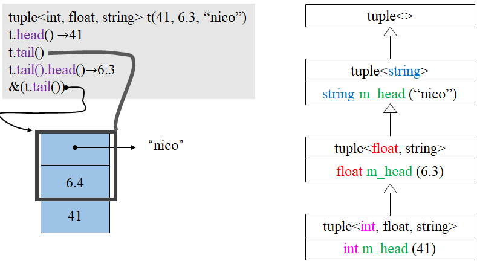

# STL内核分析

- STL六大部件
  - 容器（Containers）
  - 分配器（Allocators）
  - 算法（Algorithms）
  - 迭代器（Iterators）
  - 适配器（Adapters）
  - 仿函数（Functions）

## 容器默认分配器（GNU4.9以及以后）以vector为例

```
template<typename _Tp, typename _Alloc = std::allocator<_Tp> >
class vector: protected _Vector_base<_Tp, _Alloc> {
  // ...
}
``` 
其中，`std::allocator`的定义如下：
```
namespace std{
template<typename _Tp>
class allocator: public __allocator_base<_Tp> {
  // ...
};
}
```
`__allocator_base`是一个别名  
`#define __allocator_base __gnu_cxx::new_allocator`   
其中`__gnu_cxx::new_allocator`的定义如下：  
```
namespace __gnu_cxx {
template<typename _Tp>
class new_allocator {
  //...
  pointer allocate(size_t __n, const void* = 0) {
    if(__n > this->max_size())
    std::__throw_bad_alloc();
    return static_cast<*_Tp>(::operator new(__n *sizeof(_Tp)));  // 里面是malloc
  }

  void deallocate(pointer __p, size_type) {
    ::operator delete(__p);  // 里面是free
    // ...
  }
};
}
```
所以在默认情况下，容器使用的分配器是简单对`malloc`和`free`封装，没有多余的内存管理。

## 迭代器Iterator

- 需要遵循的原则--必须提供5种associated types
  ```
  // ----------------------------------------------------------
  // G2.9
  // ----------------------------------------------------------
  template<class T, class Ref, class Ptr>
  struct __list_iterator {
    typedef bidirectional_iterator_tag iterator_category; // (1)
    typedef T                          value_type;        // (2)
    typedef Ptr                        pointer;           // (3)
    typedef Ref                        reference;         // (4)
    typedef ptrdiff_t                  difference_type;   // (5)
    ...
  };
   // ----------------------------------------------------------
  // G4.9
  // ----------------------------------------------------------
  template<typename _Tp>
  struct _List_iterator {
    typedef bidirectional_iterator_tag iterator_category; // (1)
    typedef _Tp                        value_type;        // (2)
    typedef _Tp*                       pointer;           // (3)
    typedef _Tp&                       reference;         // (4)
    typedef ptrdiff_t                  difference_type;   // (5)
    ...
  };
  ```
  

- Traits特性
  - `Iterator Traits`用以区分`class iterators`和`non-class iterators`
  - 这个traits机器必须有能力区分它所获得的iterator是(1)`class iterator T`或是(2)`native pointer to T`。利用`partial specialization`(偏特化)可达到目标。
    
  ```
  // 完整的iterator_traits
  template <class I>
  struct iterator_traits {
    typedef typename I::iterator_category iterator_category;
    typedef typename I::value             value type;
    typedef typename I::difference_type   difference_type;
    typedef typename I::pointer           pointer;
    typedef typename I::reference         reference;
  };

  // partial specialization for regular pointers
  template <class T>
  struct iterator_traits<T*> {
    typedef random_access_iterator_tag iterator_category;
    typedef T                          value_type;
    typedef ptrdifft_t                 difference_type;
    typedef T*                         pointer;
    typedef T&                         reference;
  };

  // partial specialization for regular const pointers
  template <class T>
  struct iterator_traits<const T*> {
    typedef random_access_iterator_tag iterator_category;
    typedef T                          value_type; // 值得注意，不是const T。
    typedef ptrdifft_t                 difference_type;
    typedef const T*                   pointer;
    typedef const T&                   reference;
  };
  ```
  备注：  
  value_type主要是用来声明变量，而声明一个无法被赋值的变量没有声明用，所以iterator(即便是const iterator)的value_type不应加上const。

## 容器vector深度探索

  

```
template <class T, class Alloc=alloc>
class vector {
 public:
  typedef T           value_type;
  typedef value_type* iterator;
  typedef value_type& reference;
  typedef size_t      size_type;
 protected:
  iterator start;
  iterator finish;
  iterator end_of_storage;
 public:
  iterator begin() { return start; }
  iterator end() { return finish; }
  size_type size() const { return end() - begin(); }
  size_type capacity() const { return size_type(end_of_storage - begin()); }
  bool empty() const { return begin() == end(); }
  reference operator[](size_type n) { return *(begin() + n); }
  reference front() { return *begin(); }
  reference back() { return *(end() - 1); }
  
  // 二倍增长
  void push_back(const T& x) {
    if(finish != end_of_storage) { // 尚有空余空间
      construct(finish, x);        // 全局函数
      ++finish;                    // 调整水位高粗
    } else {                       // 已经没有空间
      insert_aux(end(), x);
    }
  }
 private:
  void insert_aux(iterator position, const T& x);
};
```
`insert_aux`定义如下：
```
template <class T, class Alloc>
void vector<T, Alloc>::insert_aux(iterator position, const T& x) {
  if(finish != end_of_storage) { // 尚有借用空间
    // 在借用空间起始处构建一个元素，并以vector最后一个元素为其初值
    construct(finish, *(finish - 1));
    ++finish;
    T x_copy x;
    copy_backward(position, finish-2, finish-1);
    *position = x_copy;
  } else { // 没有空间
    const size_type old_size = size();
    const size_type len = old_size != 0 ? 2 * old_size : 1; // 两倍增长

    iterator new_start = data_allocator::allocate(len)
    iterator new_finish = new_start;
    try {
      // 将原vector的内容拷贝到新的vector
      new_finish = uninitialized_copy(start, position, new_start);
      construct(new_finish, x); // 为新元素设初值
      ++new_finish;
      // 拷贝安插点后的原内容（因为它可可能被insert(p, x)调用）
      new_finish = unintialized_copy(position, finish, new_finish);
    } catch(...) {
      // "commit or rollback" semantics
      destory(new_start, new_finish);
      data_allocator::deallocate(new_start, len);
      throw;
    }
    // 析构并释放原vector
    destory(begin(), end());
    deallocate();
    // 调整迭代器，指向新vector
    start = new_start;
    finish = new_finish;
    end_of_storage = new_start + len;
  }
}
```

## 容器list深度探索


```
template<class T>
struct __list_node {
  typedef void* void_pointer;
  void_pointer prev;
  void_pointer newx;
  T data;
};
```
```
template<class T, class Alloc=alloc>
class list {
 protected:
  typedef __list_node<T> list_node;
 public:
  typedef list_node* link_type;
  typedef __list_iterator<T, T&, T*> iterator;
 protected:
  link_type node;
 // ...
}
```
```
template<class T, class Ref, class Ptr>
struct __list_iterator {
  typedef __list_iterator<T, Ref, Ptr> self;
  typedef bidirection_iterator_tag iterator_category;
  typedef T   value_type;
  typedef Ptr pointer;
  typedef Ref reference;
  typedef __list_node<T>* link_type;
  typedef ptrdiff_t difference_type;

  link_type node;

  reference operator*() const { return (*node).data; }
  pointer operator->() const { return &(operator*()); }
  self& operator++() { // 前置++，返回引用
    node = (link_type)((node*).next);
    return *this;
  }
  self operator++(int) { // 后置++
    self tmp = *this;
    ++*this;
    return tmp;
  }
  // ...
};
```

- 备注说明
  - 前置++返回是是引用，后置++返回的是值；--也是类似；
  - 当你对某个type实施`operator->`而该type并非build-in指针时，编译器会做一件有趣的事情：在找出user-defined `operator->`并将它实施于该type后，编译器会对执行结果再次实施`operator->`。编译器不断执行这个动作直到触及一个build-in指针，然后才进行成员存取。
  - G4.9的改进  
  

## 容器array深度探索

```
// -----------------------------------------------------------
// TR1
// -----------------------------------------------------------
template <typename _Tp, std::size_t _Nm>
struct array {
  typedef _Tp         value_type;
  typedef _Tp*        pointer;
  typedef value_type* iterator; // native pointer，G2.9vector也是如此

  // Support for zero-sized arrays mandatory
  value_type _M_instance[_Nm ? _Nm : 1];

  iterator begin() { return iterator(&_M_instance[0]); }
  iterator end() { return iterator(&_M_instance[_Nm]); }
  //...
}
```

## 容器deque深度探索


```
//G2.9
template <class T, class Ref, class Ptr, size_t BufSiz>
struct __deque_iterator {
  typedef random_access_iterator_tag iterator_category;
  typedef T                          value_type;
  typedef Ptr                        pointer;
  typedef Ref                        reference;
  typedef size_t                     size_type;
  typedef ptrdiff_t                  difference_type;
  typedef T**                        map_pointer;
  typedef __deque_iterator           self;

  T*          cur;
  T*          first;
  T*          last;
  map_pointer node;
  //...
}

template <class T, class Alloc=alloc size_t BufSiz=0>
class deque {
 public:
  typedef T                                   value_type;
  typedef value_type*                         pointer;
  typedef value_type&                         reference;
  typedef size_t                              size_type;
  typedef ptrdiff_t                           difference_type;
  typedef __deque_iterator<T, T&, T*, BufSiz> iterator;
 protected:
  typedef pointer*                            map_pointer; // T**
 protected:
  iterator    start;
  iterator    finish;
  map_pointer map;
  size_type   map_size;
 public:
  iterator begin() { return start; }
  iterator end() { return finish; }
  size_type size() const { return finish - start; }
  
  // 在position处插入一个元素，其值为x
  iterator insert(iterator position, const value_type& x) {
    if(position.cur == start.cur) {         // 如果插入点事deque最前端
      push_front(x);                        // 交给push_front()做
      return start;
    } else if(position.cur == finish.cur) { // 如果插入点是deque的最尾端
      push_back(x);                         // 交给push_back()做
      iterator tmp = finish;
      --tmp;
      return tmp;
    } else {                               // 其他插入点，交给insert_aux()做
      return insert_aux(position, x)
    }
  }
}
```
`insert_aux`定义如下：
```
template <class T, class Alloc, size_t BufSize>
typename dequee<T, Alloc, BufSize>::iterator
deque<T, Alloc, BUfSize>::insert_aux(iterator pos, const value_type& x) {
  difference_type index = pos - start;  // 插入点之前的元素个数
  value_type x_cooy = x;
  if(index < size / 2) {                // 如果插入点之前的元素个数较少
    push_front(front());                // 在最前端加入与首元素同值的元素
    //...
    copy(front2, pos1, front1);         // 元素移动
  } else {                              // 如果插入点之后的元素个数较少
    push_back(back());                  // 在最末端加入与末尾元素同值的元素
    //...
    copy_backward(pos, back2, back1);   // 元素移动
  }
  *pos = x_copy;                        // 在插入点设定新值
  return pos;
}
```
`BufSiz`的确定：
```
inline size_t __deque_buf_size(size_t n, size_t sz) {
  // sz为元素大小
  return n != 0 ? n : (sz < 512 ? size_t(512 / sz) : size_t(1));
}
```
deque如何模拟连续空间
```
// 简化，定义在deque
reference operator[](size_type n) { return start[difference_type(n)]; }

reference front() { return *start; }

reference back() {
  iterator tmp = finish;
  --tmp;
  return *tmp;
}

size_type size() const { return finish - start; }

bool empty() const { return finish == start; }

// 定义在__deque_iterator
reference operator*() const { return *cur; }

reference operator->() const { return &(operator*()); }

difference_type operator-(const self& x) const {
  return difference_type(buffer_size()) * (node - x.node - 1) + 
         (cur - first) + (x.last - x.cur);
}

void set_node(map_pointer new_node) {
  node = new_node;
  first = *new_node;
  last = first + difference_type(buffer_size());
}

self& operator++() {
  ++cur;                // 切换到下一个元素
  if(cur == node) {     // 如果到达buffer的尾端
    set_node(node + 1); // 调至下一个buffer
    cur = first;        // 的前端
  }
  return *this;
}

self operator++(int) {
  self tmp = *this;
  ++*this;
  return tmp;
}

self& operator--() {
  if (cur == first) {    // 如果目前在buffer的起点
    set_node(node - 1);  // 调至前一个buffer
    cur = last;          // 的末端
  }
  --cur;                 // 往前移一个元素
  return *this;
}

self operator--(int) {
  self tmp = *this;
  --*this;
  returm tmp;
}

self &operator+=(difference_type n) {
  difference_type offset = n + (cur + first);
  if (offset >= 0 && offset < difference_type(buffer_size())) // 目标位置在同一级buffer
    cur += n;
  else { // 目标位置不在同一级buffer
    difference_type = node_offset = offset > 0
                                    ? offset / difference_type(buffer_size())
                                    : - difference_type((- offset - 1) / buffer_size()) - 1;
    set_node(node + node_offset);  // 切换至正确的buffer
    cur = first + (offset - node_offset * difference(buffer_size())); // 切换至正确的元素
  }
  return *this;
}

self operator+(difference_type n) const {
  self tmp = *this;
  return tmp += n;
}

self& operator-=(difference_type n) { return *this += -n; }

self operator-(difference_type n) const {
  self tmp = *this;
  return tmp -= n;
}
reference operator[](difference_type n) const { return *(*this + n); }
```

## 适配器queue & stack

- queue
  ```
  template <class T, class Sequence=deque<T>>
  class queue {
  // ...
   public:
    typedef typename Sequence::value_type      value_type;
    typedef typename Sequence::size_type       size_type
    typedef typename Sequence::reference       reference
    typedef typename Sequence::const_reference const_reference
   protected:
    Sequence c;
   public:
    bool empty() { return c.empty(); }
    size_type size() const { return c.size(); }
    reference front() { return c.front(); }
    const_reference front() const { return c.front(); }
    reference back() { return c.back(); }
    const reference back() { return c.back(); }
    void push(const value_type& x) { c.push_back(x); }
    void pop() { c.pop_front(); }
  };
  ```
- stack

  ```
  template <class T, class Sequence=deque<T>>
  class stack {
  // ...
   public:
    typedef typename Sequence::value_type      value_type;
    typedef typename Sequence::size_type       size_type
    typedef typename Sequence::reference       reference
    typedef typename Sequence::const_reference const_reference
   protected:
    Sequence c;
   public:
    bool empty() const { return c.empty(); }
    size_type size() const { return c.size(); }
    reference top() { return c.back(); }
    const reference top() const { reutrn c.back(); }
    void push(const value_type& x) { c.push_back(x); }
    void pop() { c.pop_back(); }
  };
  ```
- stack和queue都不允许遍历，也不提供iterator
- stack和queue都可选择list或deque作为底层结构
- queue不可以选择vector作为底层结构
- stack可以选择vector作为底层结构
- stack和queue都不可选择set或者map作为底层结构

## rb_tree（红黑树）

- Red-Black Tree（红黑树）是平衡二叉查找树中常被使用的一种。  
  平衡二叉树的特性：排列规则有利search和insert，并保持深度平衡。
- rb_tree提供“遍历”操作及iterator  
  按正常规则（++iter）遍历，便能获得排序状态（sorted）
- 我们不应使用rb_tree的iterator改变元素值（因为元素有其遵循的排列规则）。编程层面（programming level）并未杜绝此事。如此设计是正确的，因为rb_tree即将为set和map服务（作为其底部支持），而map允许元素的data被改变，只有key才是不可以改变的。
- rb_tree提供两种insertion操作：insert_unique()和insert_equal()。前者表示结点的key一定在整个tree中独一无二，否则插入失败；后者表示结点的key可重复。

```
template <class Key,         // 键值类型
          class Value,       // key+data的类型
          class KeyOfValue,  // data的类型
          class Compare,     // key的比较函数
          class Alloc=alloc> // 分配器
class rb_tree {
 protected:
  typedef __rb_tree_node<Value> rb_tree_node;
  //...
 public:
  typedef rb_tree_node* link_type;
  //...
 protected:
  size_type node_count;  // rb_tree结点数量
  link_type header;
  Compare   key_compare; // key的大小比较规则
  //...
}
```

## 容器set，multiset深度探索

- set/multiset以rb_tree为底层结构，因此有元素自动排序的特性，排序的依据是key，而set/multiset元素的value和key合一，value就是key。
- set/multiset提供遍历操作及iterators。  
  按正常规则（++iter）遍历，便能获得排序状态（sorted）。
- 我们无法使用set/multiset的iterators改变元素值（因为key有其遵从的排列规则）。set/multiset的iterator是其底部的rb_tree的const iterator，就是为了禁止user对元素复制。
- set元素的key必须独一无二，因此其insert()用的是rb_tree的insert_unique()。  
  multiset元素的key可以重复，因此其insert()用的是rb_tree的insert_equal()。

```
// ------------------------------------------------------
// set
// ------------------------------------------------------
template <class Key
          class Compare=less<Key>,
          class Alloc=alloc>
class set {
 public:
  typedef Key      key_type;
  typedef Key      value_type;
  typedef Compare  key_compare;
  typedef Compare  value_type;
 private:
  typedef rb_tree<key_type, value_type, identity<value_type>,
                  key_compare, Alloc> rep_type;
  rep_type t;
 public:
  typedef typename rep_type::const_iterator iterator;
// ...
// set的所有操作，都调用底层t（rb_tree）的操作
};
```

## 容器map，multimap深度探索

- map/multimap以rb_tree为底层结构，因此有元素自动排序的特性，排序的依据是key，而set/multiset元素的value和key合一，value就是key。
- map/multimap提供遍历操作及iterators。  
  按正常规则（++iter）遍历，便能获得排序状态（sorted）。
- 我们无法使用map/multimap的iterators改变元素值（因为key有其遵从的排列规则），但可以用它来改变元素的data。因此map/multimap内部自动将user制定的key type设为const，如此便能禁止user对元素的key赋值。
- map元素的key必须独一无二，因此其insert()用的是rb_tree的insert_unique()。  
  multimap元素的key可以重复，因此其insert()用的是rb_tree的insert_equal()。

```
template <class Key,
          class T,
          class Compare=less<Key>,
          class Alloc=alloc>
class map {
 public:
  typedef Key                key_type;
  typedef T                  data_type;
  typedef T                  mapped_type;
  typedef pair<const Key, T> value_type;
  typedef Compare            key_compare;
 private:
  typedef rb_tree<key_type, value_type, selet1st<value_type>,
                  key_compare, Alloc> rep_type;
  rep_type t;
 public:
  typedef typename rep_type::iterator iterator;
  // ...
}
```
容器map独特的`operator[]`
```
// G4.9 /usr/include/c++/5/bits/stl_map.h
// [23.3.1.2] element access
/**
 * @brief Subscript ( @c [] ) access to %map data
 * @param __k The key for which data should be retrieved
 * @ return A reference to the data of the (key, data) % pair
 *
 * Allows for easy lookup with the subscript ( @c [] )
 * operator. Returns data associated with the key specified in
 * subscript. If the key does not exist, a pair with taht key
 * is created using default values, with is then returned.
 *
 * Lookup requires logarithmic time.
 * /
mapped_type& operator[](const key_type& __k) {
  // concept requirements
  __glibcxx_function_requires(_DefaultConstructibleConcept<mapped_type>)
  iterator __i = lower_bound(__k);
  // __i->first is greater than or equivalent to __k
  if(__i == end() || key_comp()(__k, (*__i).first))
#if __cplusplus >= 201103L
    __i = _M_t._M_emplace_hint_unique(__i, std::piecewise_construct,
                                      std::tuple<const key_type&>(__k),
                                      std::tuple<>());
#else
    __i = insert(__i, value_type(__k, mapped_type()));
#endif
    return (*__i).second;
}
```

## hashtable深度探索

- 相关概念
  - 冲突：不同的关键字得到同一哈希地址的现象。
  - 哈希表：根据设定的哈希函数H(key)和处理冲突的方法将一组关键字映像到一个有限的连续的地址集（区间）上，并以关键字在地址集中的“像”作为记录在表中的储存位置，这种表便是哈希表。
  - 哈希函数构造方法
    - 直接定址法  -- 取关键字或关键字的某个现行函数值为哈希地址；
    - 数字分析法  -- 取关键字的若干数位组成哈希地址；
    - 平方取中法  -- 取关键字平方后的中间几位为哈希地址；
    - 折叠法  -- 将关键字分割成位数相同的几部分（最后一部分的位数可以不同），然后取这几部分的叠加和（舍去进位）作为哈希地址；
    - **除留余数法** -- 取关键字被某个不大于哈希表表长m的数p除后所得余数作为哈希地址；
    - 随机数法  -- 选择一个随机函数，取关键字的随机函数值为他的哈希地址；
  - 处理冲突的方法
    - 开放定址法 $H_i = (H(key) + d_i) MOD m$
      - $d_i=1, 2, 3,..., m-1$，称为线性探测再散列；
      - $d_i=1^2, -1^2, 2^2, -2^2, ...$，称为二次探测再散列；
      - $d_i=$伪随机数序列，称为伪随机探测再散列；
    - 再哈希法 $H_i = RH_i(key)$，即在同义词产生地址冲突时计算另一个函数函数的地址，直到冲突不再发生
    - **链地址法** -- 将所有关键字为同义词的记录存储在同一线性链表中。
    - 建立公共溢出区
- stl

```
// hashtabe buckets的个数（质数，约为两倍增长）
static const unsigned long
__stl_prime_list[__stl_num_primes] = {
  53, 97, 193, 389, 769, 1543, 3079, 6151, 12289, 24593, ...
};

template <class Value>
struct __hashtable_node {
  __hashtable_node* next;
  Value             val;
};

template <class Value, class Key, class HashFcn,
          class ExtractKey, class EqualKey,
          class Alloc=alloc>
class hashtable {
 public:
  typedef HashFcn                 hasher;
  typedef EqualKey                key_equal;
  typedef size_t                  size_type;
 private:
  hasher                          hash;
  key_equal                       equals;
  ExtractKey                      get_key;
  typedef __hashtable_node<Value> node;
  vector<node* Alloc>             buckets;
  size_type                       num_elements;
 public:
  size_type bucket_count() { return buckets.size(); }
  // ...
};

template <class Value, class Key, class HashFcn,
          class ExtractKey, class EqualKey,
          class Alloc>
struct __hashtable_iterator {
  //..
  node*      cur;
  hashtable* ht;
};
```

- hash-function, hash-code

```
// #define __STL_TEMPLATE_NULL template<>

// general
template <class Key> struct hash{ };

// partial specialization
__STL_TEMPLATE_NULL stuct hash<char> {
  size_t operator()(char x) const { return x; }
}
__STL_TEMPLATE_NULL stuct hash<short> {
  size_t operator()(short x) const { return x; }
}
__STL_TEMPLATE_NULL stuct hash<unsigned short> {
  size_t operator()(unsigned short x) const { return x; }
}
__STL_TEMPLATE_NULL stuct hash<int> {
  size_t operator()(int x) const { return x; }
}
__STL_TEMPLATE_NULL stuct hash<unsigned int> {
  size_t operator()(unsigned int x) const { return x; }
}
__STL_TEMPLATE_NULL stuct hash<long> {
  size_t operator()(long x) const { return x; }
}
__STL_TEMPLATE_NULL stuct hash<unsigned long> {
  size_t operator()(unsigned long x) const { return x; }
}

inline size_t __stl_hash_string(const char* s) {
  unsigned long h = 0;
  for(; *s; ++s)
    h = 5*h + *s;
  return size_t(h);
}

__STL_TEMPLATE_NULL stuct hash<char*> {
  size_t operator()(char* s) const { return __stl_hash_string(s); }
}
__STL_TEMPLATE_NULL stuct hash<const char*> {
  size_t operator()(const char* s) const { return __stl_hash_string(s); }
}

// 没有hash<std::string>
```

- modulus（MOD）运算

```
iterator find(const key_type& key) {
  size_type n = bkt_num_key(key); // (1) 花落何家
  //...
}
size_type count(const key_type& key) const {
  const size_type n = bkt_num_key(key); // (1)
  // ...
}

tmeplate <class V, class K, class HF, class ExK, class EqK, class A>
__hashtable_iterator<V, K, HF, ExK, EqK, A>&
__hashtable_iterator<V, K, HF, ExK, EqK, A>::
operator++() {
  //...
  size_type bucket = ht->bkt_num(old->val); // (2)
  //...
}

// (1)
size_type bkt_num_key(const key_type& key) const {
  reutrn bkt_num_key(key, buckets.size()); // (3)
}

// (2)
size_type bkt_num(const value_type& obj) const {
  return bkt_num_key(get_key(obj)); // (1)
}

// (3)
size_type bkt_num_key(const key_type& key, size_t n) const {
  return hash(key) % n;
}
```

## 各种容器的`iterator`的`iterator_category`

- 五种`iterator_category`
  ```
  struct input_iterator_tag {};
  struct output_iterator_tag {};
  struct forward_iterator-tag: public input_iterator_tag {};
  struct bidirectional_iterator_tag: public forward_iterator_tag {};
  struct random_access_iterator_tag: public bidirectional_iterator_tag {};
  ```

- `iterator_category`对算法的影响
  ```
  template <class InputIterator>
  inline iterator_traits<InputIterator>::difference_type
  distance(InputIterator first, InputIterator last) {
    typedef typename iterator_traits<InputIterator>::iterator_category category;
    return __distance(first, last, category()); // 根据category()调用具体__distance(...)
  }

  template <class InputIterator>
  inline iterator_traits<InputIterator>::difference_type
  __distance(InputIterator first, InputIterator last, input_iterator_tag) {
    iterator-traits<InputIterator>::difference_type n = 0;
    while(first != last) {
      ++first; ++n;
    }
    return n;
  }

  template <class InputIterator>
  inline iterator_traits<InputIterator>::difference_type
  __distance(InputIterator first, InputIterator last, random_access_iterator_tag) {
    return last - first;
  }
  ```

## 常用算法源码剖析

- accumulate
  ```
  template <class InputIterator, class T>
  T accumulate(InputIterator first, InputIterator last, T init) {
    for(; first != last; ++first)
      init = init + *first;
    return init;
  }

  template <class InputIterator, class T, class BinaryOperator>
  T accumulate(InputIterator first, InputIterator last,
               T init, BinaryOperation binary_op) {
    for(; first != last; ++first)
      init = binary_op(init, *first);
    return init;
  }
  ```
- for_each
  ```
  template <class InputIterator, class Function>
  Function for_each(InputIterator first, InputIterator last,
                    Function f) {
    for(; first != last; ++first)
      f(*frist);
    return f;
  }
  ```

- replace, replace_if, replace_copy
  ```
  template <class ForwardIterator, class T>
  void replace(ForwardIterator first,
               ForwardIterator last,
               const T& old_value,
               const T& new_value) {
    for(; first != last; ++first)
      if(*first == old_value)
        *first = new_value;
  }

  template <class InputIterator, class OutputIterator, class T>
  OutputIterator replace_copy(InputItertor first,
                              InputIterator last,
                              OutputIterator result,
                              const T& old_value,
                              const T& new_value) {
    for(; first != last; ++first, ++result)
      *result = *first == old_value ? new_value : *first;
    return result;
  }

  template <class ForwardIterator, class Predicate, class T>
  void replace_if(ForwardIterator first,
                  ForwardIterator last,
                  Predicate pred,
                  const T& new_value) {
    for(; first != last; ++first)
      if(pred(*first))
        *first = new_value;
  }
  ```

- count, count_if
  ```
  template <class InputIterator, class T>
  typename iterator_traits<InputIterator>::difference_type
  count(InputIterator first, InputIterator last, const T& value) {
    typename iterator_traits<InputIterator>::difference_type n = 0;
    for(; first != last; ++first)
      if(*fist == value)
        ++n;
    return n;
  }

  template <class InputIterator, class Predicate>
  typename iterator_traits<InputIterator>::difference_type
  count_if(InputIterator first, InputIterator last, Predict pred) {
    typename iterator_traits<InputIterator>::difference_type n = 0;
    for(; first != last; ++first)
      if(pred(*first))
        ++n;
    return n;
  }
  ```
  容器不带成员函数`count()`：array, vector, list, forward_list, deque  
  容器不带成员函数`count()`：set/multiset, map/multimap, unordered_set/unordered_multiset, unordered_map/unordered_multimap

- find, find_if
  ```
  template <class InputIterator, class T>
  InputIterator find(InputIterator first, InputIterator last, const T& value) {
    while(first != last && *first != value)
      ++first;
    return first;
  }

  template <class InputIterator, class Predicate>
  InputIterator find_if(InputIterator first, InputIterator last,
                        Predicate pred) {
    while(first != last && !pred(*first))
      ++first;
    return first;
  }
  ```
  容器不带成员函数`find()`：array, vector, list, forward_list, deque  
  容器不带成员函数`find()`：set/multiset, map/multimap, unordered_set/unordered_multiset, unordered_map/unordered_multimap

- binary_search, lower_bound, upper_bound
  ```
  template <class ForwardIterator, class T>
  bool binary_search(ForwardIterator first, ForwardIterator last,
                     const T& val) {
    first = std::lower_bounder(first, last, val);
    return (first != last && !(val < *first>));
  }

  template <class ForwardIterator, class T>
  ForwardIterator lower_bound(ForwardIterator first,
                              ForwardIterator last,
                              const T& val) {
    ForwardIterator it;
    iterator_traits<ForwardIterator>::difference_type count, step;
    count = distance(first, last);
    while(count > 0) {
      it = first; step = count / 2; advance(it, step);
      if(*it < val) {
        first = ++it;
        count -= step + 1；
      }
      else
        count = step;
    }
    return first;
  }
  ```

## 仿函数functors

仿函数`functors`的可适配（adaptable）条件
```
template <class Arg, class Result>
struct unary_function { // 一元操作
  typedef Arg    argument_type;
  typedef Result result_type;
};
  
template <class Arg1, class Arg2, class Result>
struct binary_function { // 二元操作
  typedef Arg1   first_argument_type;
  typedef Arg2   second_argument_type;
  typedef Result result_type;
}
```

STL规定每个Adaptable Function都应该挑选适当者（unary_function或binary_function），因为Function Adapter将会提问。例如：
```
template <class Operation>
class binder2nd:
  public unary_function<typename Operation::first_argument_type
                          typename Operation::result_type> {
 protected:
  Operation op;
  typename Operation::second_argument_type value; // ***
 public:
  //constructor
  binder2nd(const Operation& x
            const typename Operation::second_argument_type& y)
    : op(x), value(y) {}
  typename Operation::result_type
  operator()(const typename Operation::first_argument_type& x) const {
    return op(x, value);
  }
};

template <class Operation, class T>
inline binder2nd<Operation> bind2nd(const Operation& op, const T& x) {
  typedef typename Operation::second_argument_type arg2_type;
  return binder2nd<Operation>(op, arg2_type(x));
}
```

## 适配器Adapter

- 容器适配器：stack，queue
- 函数适配器：binder2nd, not, bind
  ```
  // binder2nd见上面

  template <class Predicate>
  class unary_negate
    : public unary_function<typename Predicate::argument_type, bool> {
   protected:
    Predicate pred;
   public:
    explicit unary_negate(const Predicate& x): pred(x) {}
    bool operator()(const typename Predicate::argument_type& x) const {
      return !pred(x);
    }
  };

  template <class Predicate>
  inline unary_negate<Predict> not1(const Predicate& pred) {
    return unary_negate<Predict>(pred);
  }
  ```
- 迭代器适配器：reverse_iterator, inserter
  ```
  template <class Iterator>
  class reverse_iterator {
   protected:
    Iterator current;
   public:
    typedef typename iterator_traits<Iterator>::iterator_category iterator_category;
    typedef typename iterator_traits<Iterator>::value_type value_type;
    //...
    typedef Iterator iterator_type;
    typedef reverse_iterator<Iterator> self;
   pubic:
    explic reverse_iterator(iterator_type x): current(x) {}
    reverse_iterator(const self& x): current(x) {}
    iterator_type base() const { return current; }
    reference operator*() const { Iterator tmp = current; return *--tmp; }
    pointer operator->() const { return &(operator*()); }

    self& operator++() { --current; return *this; }
    self& operator--() { ++current; return *this; }
    self operator+(difference_type n) const { return self(current - n); }
    self operator-(difference_type n) const { return self(current + n); }
  };

  template <class Container>
  class insert_iterator {
   protected:
    Container* container;
    typename Container::iterator iter;
   public:
    typedef output_iterator_tag iterator_category;
    inset_iterator(Container& x, typename Container::iterator i)
      : container(&x), iter(i) {}
    insert_iterator<Container>&
    operator=(const typename Container::value_type& value) {
      iter = container->insert(iter, value);
      ++iter;
      return *this;
    }
  };

  template <class Container, class Iterator>
  inline insert_iterator<Container>
  insert(Container& x, Iterator i) {
    typedef typename Container::iterator iter;
    return insert_iterator<Container>(x, iter(i));
  }
  ```
- X适配器：ostream_iterator, istream_iterator
  ```
  template <class T, class charT=char, class traits=char_traits<charT>>
  class ostream_iterator
    : public iterator<output_iterator_tag, void, void, void, void> {
    basic_ostream<charT, traits> *out_stream;
    const charT* delim;
   public:
    typedef charT char_type;
    typedef traits traits_type;
    typedef basic_ostream<charT, traits> ostream_type;
    ostream_iterator(ostream_type& s): out_stream(s), delim(0) {}
    ostream_iterator(ostream_type& s, const charT* delimiter)
      : out_stream(s), delim(delimiter) {}
    ostream_iterator(const ostream_iterator<T, charT, traits> &x)
      : out_stream(x.out_stream), delim(x.delim) {}
    ~ostream_iterator() {}
    ostream_iterator<T, charT, traits>& operator=(const T& value) {
      *out_stream << value;
      if(delim) *out_stream << delim;
      return *this;
    }
    ostream_iterator<T, charT, traits>& operator*() { return *this; }
    ostream_iterator<T, charT, traits>& operator++() { return *this; }
    ostream_iterator<T, charT, traits>& operator++(int) { return *this; }
  };

  template <class T, class charT=char, class traits=char_traits<charT>,
            class Distance=ptrdiff_t>
  class istream_iterator
    : public iterator<input_iterator_tag, T, Distance, const T*, const T&> {
    basic_istream<charT, traits> *in_stream;
    T value;
   public:
    typedef charT char_type;
    typedef traits traits_type;
    typedef basic_istream<charT, traits> istream_type;
    istream_iterator(): in_stream(0) {}
    istream_iterator(istream_type& s): in_stream(s) { ++*this; }
    ostream_iterator(const ostream_iterator<T, charT, traits, Distance> &x)
      : in_stream(x.in_stream), value(x.value) {}
    ~ostream_iterator() {}
    const T& operator*() { return value; }
    const T& operator->() { return &value; }
    istream_iterator<T, charT, traits, Distance>& operator++() {
      if(in_stream && !(in_stream >> value))in_stream = 0;
      return *this;
    }
    istream_iterator<T, charT, traits, Distance>& operator++(int) {
      istream_iterator<T, charT, traits, Distance> tmp = *this;
      ++*this;
      return tmp;
    }
  };
  ```

## 一个万用的Hash Function

- 如何定义hash function
  例如为`class Customer {//...};`定义一个hash function
  - 形式一
    ```
    #include <functional>
    class CustomerHash {
    public:
      std::size_t operator()(const Customer& c) const {
        return ...
      }
    };

    unordered_set<Customer, CustomerHash> custset;
    ```
  - 形式二
    ```
    #incluce <functional>
    size_t customer_hash_func(const Customer& c) {
      return ...
    }

    unordered_set<Customer, size_t(*)(const Costomer&)> custset(20, customer_hash_func)
    ```
  - 形式三
    ```
    // parital specialization for your class
    namespace std {
    template<> struct hash<Customer> {
      size_t operator()(const Customer& c) {
        return hash_val(...);
      }
    };
    }
    ```
- 万用hash function
  ```
  class CustomerHash {
   public:
    std::size_t operator()(const Customer& c) {
      return hash_val(c.fname, c.lname, c.no); // hash_val结合生成hash code
    }
  };
  ```

## tuple

```
// G4.8 简化版
template<typename... Value> class tuple;
template<> class tuple<> {}

template <typename Head, typename... Tail> // typename... 任意多个模板参数
class tuple<Head, Tail...>: private tuple<Tail...> {
  typedef tuple<Tail...> inhearited;
 public:
  tuple() {}
  tuple(Head v, tail... vtail): m_head(v), inherited(vtail) {}
  
  typename Head::type head() { return m_head; }
  inherited& tail() { return *this; }
 protected:
  Head m_head;
};
```


## type traits

```
// G2.9
struct __true_type {}
struct __false_type {}

// 泛化
template <class type>
struct __type_traits {
  typedef __true_type  this_dummy_member_must_be_first;
  typedef __false_type has_trival_default_constructor;
  typedef __false_type has_trival_copy_constructor;
  typedef __false_type has_trival_assignment_operator;
  typedef __false_type has_trival_desconstor;
  typedef __false_type is_POD_type; // Plain Old Data
};

// 特化
template<> struct __type_traits<int> {
  typedef __true_type  has_trival_default_constructor;
  typedef __true_type  has_trival_copy_constructor;
  typedef __true_type  has_trival_assignment_operator;
  typedef __true_type  has_trival_desconstor;
  typedef __true_type  is_POD_type;
};
template<> struct __type_traits<double> {
  typedef __true_type  has_trival_default_constructor;
  typedef __true_type  has_trival_copy_constructor;
  typedef __true_type  has_trival_assignment_operator;
  typedef __true_type  has_trival_desconstor;
  typedef __true_type  is_POD_type;
};
// ...
```

type traits 实现

- is_void
  ```
  // remove_const
  template<typename _Tp>
  struct remove_const { typedef _Tp type; };
  
  template<typename _Tp>
  struct remove_const<_Tp const> { typedef _Tp type; };

  // remove_volatile
  template<typename _Tp>
  struct remove_volatile { typedef _Tp type; };

  template<typename _Tp>
  struct remove_volatile<_Tp volation> { typedef _Tp type; };

  // remove_cv
  template<typename _Tp>
  struct remove_cv {
    typedef typename
    remove_const<typename remove_volatile<_Tp>::type>::type type;
  };

  template<typename>
  struct __is_void_helper: public false_type {};

  template<>
  struct __is_void_helper<void>: public true_type {};

  // is_void
  template<typename _Tp>
  struct is_void: public is_void_helper<typename remove_cv<_Tp>::type>::type {};
  ```

- is_class, is_union, is_enum, is_pod
  ```
  // is_enum
  template<typename _Tp>
  struct is_enum: public integral_constant<bool, __is_enum(_Tp)> {};

  // is_unoin
  template<typename _Tp>
  struct is_union: public integral_constant<bool, __is_union(_Tp)> {};

  // is_class
  template<typename _Tp>
  struct is_class: public integral_constant<bool, __is_class(_Tp)> {};

  // is_pod
  template<typename _Tp>
  struct is_pod: public integral_constant<bool, __is_pod(_Tp)> {};
  ```
  __is_xxx(__is_enum, __is_union, __is_class, __is_pod, ...)未曾出现C++标准库源代码
