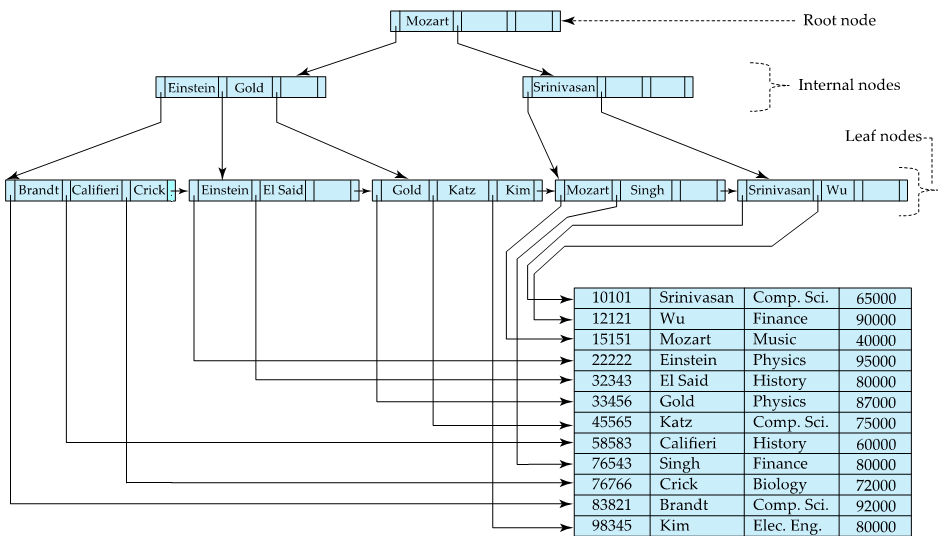
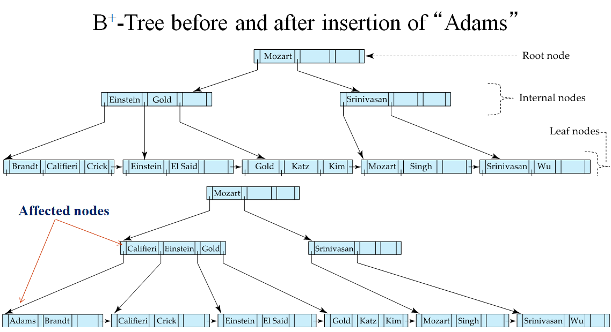
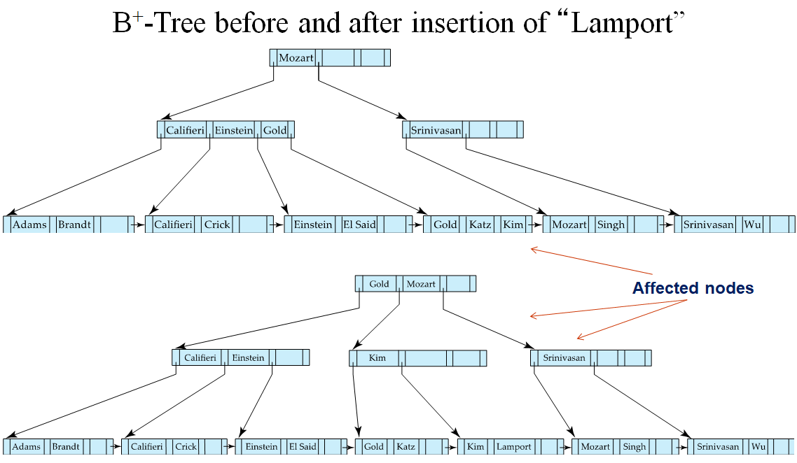
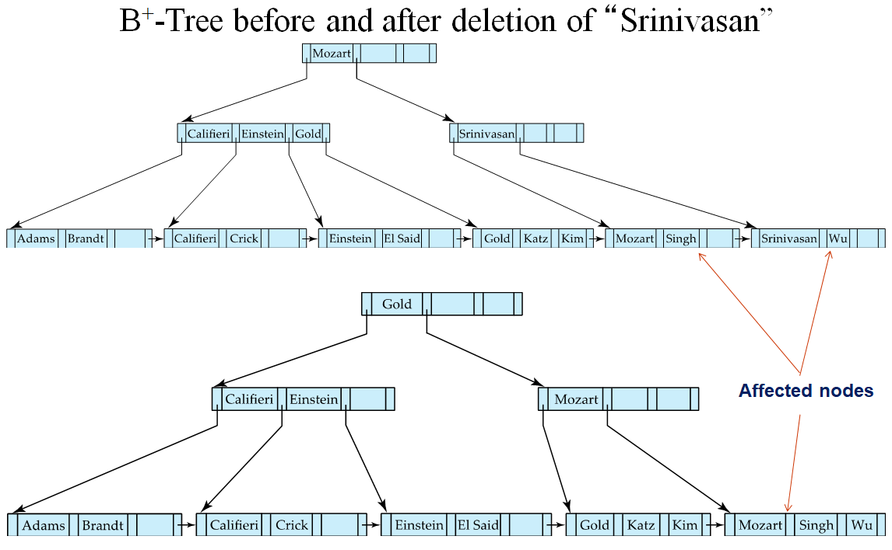
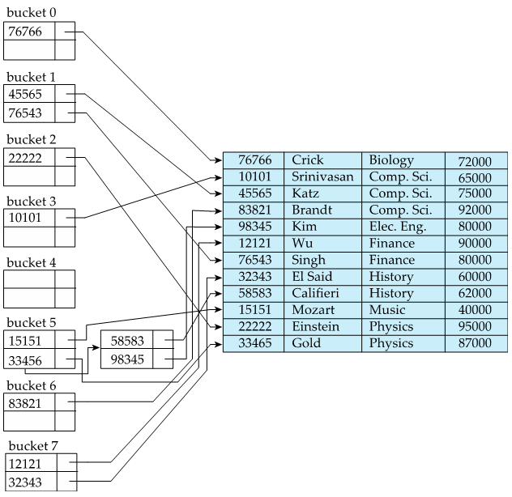
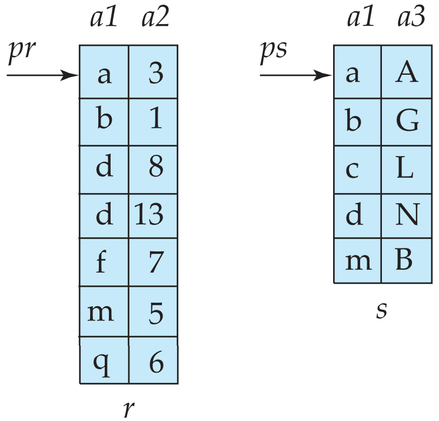
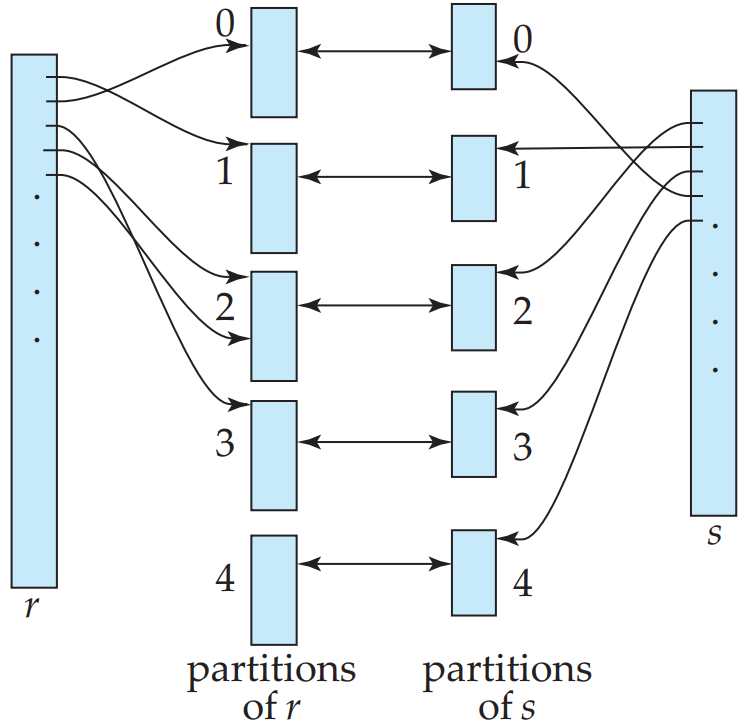

# 数据库系统概论

## 关系模型介绍
### 关系数据库的结构
- 关系数据库由表的集合构成，每个表有唯一的名字
- 表：元组的集合（无序性，通常按其第一个属性排序）
- 行：元组（一组值的序列）
- 列：属性
- 域：允许取值的集合

### 数据库模式
- 数据库模式：数据库的逻辑设计
- 数据库实例：给定时刻数据库中的一个快照

### 码（整个关系的一种性质）
- 超码：一个或多个属性的集合，可以在一个关系中唯一地标识一个元组
- 候选码：任意真子集都不能成为超码的超码
- 主码：被数据库设计者选中的，主要用来在一个关系中区分不同元组的候选码
- 外码：一个关系模式（r2）可能在它的属性中包含另一个关系模式（r2）的主码，这个属性在r1上称作参照r2的外码

## SQL

### 基本类型
- char(n)：固定长度（n）字符串
- varchar(n)：可变长度（最大长度n）字符串
- int：整型
- smallint：小整型
- numeric(p, d)：定点数，精度由用户控制；p表示位数，d表示精度（小数位数）
- real, double precision：浮点数或双精度浮点数
- float(n)：精度至少为n的浮点数

### 基本模式定义
```
create table instructor
  (ID, varchar(5),
    name varchar(20) not null,
    dept_name, varchar(15),
    salary, numeric(8, 2),
    primary key(ID),
    foreign key(dept_name) reference department);
```
以上在数据库中创建了instructor关系，选ID为主码， dept_name为外码。`create table`的通用形式是：
```
create table r  // 换行不是必须
(
  A1, D1,
  A2, D2,
  ...,
  An, Dn,
  <完整性约束1>,
  ...,
  <完整性约束2>
);
```
- 完整性约束实例
  - 主码`primary key(Aj1, Aj2, ...)`
  - 外码`foreign key(Ak1, Ak2, ...) reference 3rd_relation;`
  - `not null`，要求该属性不允许空值
- 删除`drop table`或`delete from`

### SQL查询的基本结构
```
select A1, A2, ..., An
from r1, r2, ..., rm
where condition;
```
#### 单关系查询
```
select name from instructor;
select distinct name from instructor; // 去重
select ID, name, dept_name, salary*1.1 from instructor; // + - * /运算
select name, salary from instructor where dept_name = 'Comp. Sci.' and salary > 7000; // 条件<, <=, >, >=, =, <>
```
#### 多关系查询
```
select name, instructor.dept_name, building
from instructor, department
where instructor.dept_name = department.dept_name
```
#### 自然连接
```
select A1, A2, ..., An
from r1 natural join r2 natural join ... natural join rm;
```
#### 只考虑那些在连个关系模式中都出现的属性上取值相同的元组对
```
// tabel r1              // tabel r2
id  name  code       |   id  grade  code
1   张三   20181601   |   1   55     20181601
2   李四   20181602   |   2   88     20181602
3   小红   20181603   |   3   99     20181605
4   小明   20181604   |   4   33     20181611
5   小青   20181605   |

r1 natural join r2
id  code     name  grade
1   20181601 张三   55
2   20181602 李四   88
```

#### 选定一个属性名列表
```
join...using
``` 

### 附加的基本运算
- 更名运算 `old-name as new-name`
```
// 重命名结果关系中的属性
select name as instructor_name, course_id
from instructor, teaches
where instructor.ID = teaches.ID;

// 重命名关系
select T.name, S.course_id
from instructor as T, teaches as S
where T.ID = S.ID; // 长的关系名替换为短的

selec distinct T.name
from instructor as T, instructor as S
where T.salary > S.salary and S.dept_name='Biology'; // 处理同一个关系中的元组 
```
- 字符串运算
  - `like`匹配
    - `%`：匹配任意字子串
    - `_`：匹配任意一个字符
    - `\`：转义字符
    ```
    select dept_name
    from department
    where building like `% Waston%`;
    ```

-  select子句中的属性说明
   - `*`可以在select子句中表示“所有的属性”

-  排序元组的显式次序
   - `order by`让查询结果中元组按排列顺序显式
   - 默认是升序`asc`
   - 降序`desc`
   ```
   select *
   from instructor
   order by salary desc, name asc;
   ```

- where子句谓语
  - `between ... and ...` 一个值是小于或等于
  - `not` 取反
  - `(...)`表示元组

### 集合运算
- `union` 集合并，自动去重，`union all`保留所有重复
  ```
  (select course_id from section where semester = 'Fall' and year = 2009）
  union
  (select course_id from secton where semester = 'Spring' and year = 2010);
  ```
- `interset` 集合交，自动去重，`interset all`保留所有重复
  ```
  (select course_id from section where semester = 'Fall' and year = 2009）
  interset all
  (select course_id from secton where semester = 'Spring' and year = 2010);
  ```
- `except` 集合差，从第一个输入中输出所有不出现在第二个输入中的元组，`except all`保留所有重复
  ```
  (select course_id from section where semester = 'Fall' and year = 2009）
  except
  (select course_id from secton where semester = 'Spring' and year = 2010);
  ```

### 空值 `null`
- 空值与算术运算的结果为空值
- 空值与比较运算是`unknown`（既不是谓语`is null`，也不是`is not null`）
- 空值与关系运算
  - and：`true and unknown`结果是`unknown`，`false and unknown`结果是`false`，`unknown and unknown`结果是`unknown`
  - or：`true or unknown`结果是`true`，`false or unknown`结果是`unknown`，`unknown or unknown`结果是`unknown`
  - not：`not unknown`结果是`unknown`

### 聚集函数
- 以值的一个集合（集或多重集）为输入，返回单个值的函数
  - `avg`：平均值，输入必须是数字集
  - `min`：最小值
  - `max`：最大值
  - `sum`：总和，输入必须是数字集
  - `count`：计数
- 基本聚集
  ```
  select avg(salary) as avg_salary
  from instructor
  where dept_name = 'Comp. Sci.';

  select count(distinct ID)
  from teaches
  where semester = 'Spring' and year = 2010;
  ```
- 分组聚集
  ```
  select dept_name, count(distnct ID) as instr_count
  from instructor natural join teaches
  where semester = 'Spring' and year = 2010
  group by dept_name;
  ```
- having子句：在分组后才其作用
  ```
  select dept_name, avg(salary) as avg_salary
  from instructor
  group by dept_name
  having avg(salary) > 42000;
  ```
- 对空值或布尔值的聚集
  - 除了`count(*)`外所有的聚集函数都忽略输入集合中的空值

### 嵌套子查询
- 子查询嵌套在where子句中，通常用于对集合的成员资格、集合的比较以及集合的基数进行检查
- 集合成员资格`in`或`not in`
  ```
  select distinct course_id
  from section
  where semester = 'Fall' and year = 2009 and
    course_id in (select course_id
                  from section
                  where semester = 'Spring' and year = 2010);
  ```
- 集合的比较
  ```
  // 找出工资至少比Biology系某一个教师的工资高的教师名字
  select name
  from instructor
  where salary > some (select salary  // 至少比某一个要大
                       from instructor
                       where dept_name = 'Biology');
  ```
  - `< some`，`<= some`，`> some`，`>= some`，`<> some`, `< all`，`<= all`，`> all`，`>= all`，`<> all`
  - `> all`比所有的都大
- 空关系测试
  - `exists`结构在zowie参数的子查询非空时返回`true`
  ```
  // 找出在2009年秋季学期和2010年春季学期同时开课的所有课程
  select course_id
  from section as S
  where semester = 'Fall' and year = 2009 and
      exists(select *
            from section as T
            where semester = 'Spring' and year = 2010 and S.course_id = T.course_id);
  ```
- 重复元组存在性测试
  - `unique`测试一个子查询结果是否存在重复元组
  ```
  // 找出所有在2009年最多开设一次的课程
  select T.course_id
  from course as T
  where unique(select R.course_id
              from section as R
              where T.course_id = R.course_id and R.year = 2009);
  ```
- from子句中的子查询
  ```
  // 找出系平均工资超过42000美元的那些系中教师的平均工资
  select dept_name, avg_salary
  from (select dept_name, avg(salary) as avg_salary
        from instructor
        group by dept_name)
  where avg_salary > 42000;
  ```
- with子句
  - 提供临时关系的方法，这个定义只对包含with子句的查询有效
  ```
  // 找出所有工资总额大于所有系平均工资总额的系
  with dept_total (dept_name, value) as
      (select dept_name, sum(salary)
       from instructor
       group by dept_name),
       dept_total_avg (value) as 
      (select avg(val)
       from dept_total)
  select dept_name
  from dept_total, dept_total_avg
  where dept_total_avg >= dept_total_avg.value;
  ```
- 标量子查询
  - 返回单个值的子查询
  ```
  // 所有的系以及拥有的教师的数量
  select dept_name,
      (select count(*)
       from instructor
       where department.dept_name = instructor.dept_name)
       as num_instructors
  from department;
  ```

### 数据库的修改
- 删除 `delete from r where P;`，where子句可以为空，删除整个关系
  ```
  // 从instructor关系中删除与finance系教师相关的所有元组
  delete from instructor
  where dept_name = 'Finance';

  // 从instructor关系中删除所有这样的教师元组，他们在Waston大楼的系工作
  delete from instructor
  where dept_name in (select dept_name 
                      from department
                      where building = 'Waston');
  ```
- 插入 `insert into r`
  ```
  insert into course
      value('CS-437', 'Database System', 'Comp. Sci.', 4);

  insert into instructor
      select ID, name, dept_name, 18000
      from student
      where dept_name = 'Music' and tot_cred > 144;
  ```
- 更新 `update r set`
  ```
  // 给工资低于70000美元的教师涨工资
  update instructor
  set salary = salary * 1.05
  where salary < 70000;

  // 给工资超过100000美元的教师涨3%，其余涨5%
  update instructor
  set salare = case
            when salary <= 100000 then salary * 1.05
            else salary * 1.03
      end
  ```

## 中级SQL

### 连接表达式 `join...using`
- 连接条件
  - `on`条件允许在参与连接的关系上设置通用的谓语，出现在连接表达式的末尾
    ```
    select *
    from student join takes on student.ID = takes.ID;
    ```
- 外连接
  - 左外连接：只保留出现在左外连接运算之前（左边）的关系中的元组
  - 右外连接：只保留出现在左外连接运算之后（右边）的关系中的元组
  - 全外连接：只保留出现在两个关系中的元组

### 视图
- 不是逻辑模型的一部分，但作为虚关系对用户可见的关系称为视图
- 定义 `create view v as <query expression;>`
  ```
  create view physics_fall_2009 as 
    select course.course_id, sec_id, building, room_number
    from course, section
    where course.course_id = section.course_id
      and course.dept_name = 'Physics'
      and section.semester = 'Fall'
      and section.year = '2009';
  ```
- 查询中使用视图
  ```
  select course_id
  from physics_fall_2009
  where building = 'Waston';
  ```
- 更新视图 `insert int v`

### 事务
- 由查询和（或）更新语句的序列组成
- 下列SQL语句之一会结束一个事务
  - Commit work，提交当前事务，将该事务所做的更新在数据库中持久保存（Rollback也不能撤销）
  - Rollback work，回滚当前事务，撤销该事务中所有SQL语句对数据库的更新
- 原子性
  - 一个事务或者在完成所有步骤后提交其行为，或者在不能成功完成其所有动作的情况下回滚其所有动作

### 完整性约束
- 主码
- not null
  - `name varchar(20) not null;`
- unique
  - `unique(Aj1, Aj2, ..., Ajm);`属性Aj1，Aj2,。。，Aj形成一个候选码，即在关系中没有两个元组能在所有列出的属性上取值相同
- check
  - 保证属性值满足指定的条件
  - `check (semester in ('Fall', 'Winter', 'Spring', 'Summer'));`
- 外码，参照完整性
  `foreign key(dept_name) reference department;`

### 索引
  - 在关系的属性上所创建的一种数据结构，它允许数据库系统高效地找到关系中那些在索引属性上取给定值的元组，而不同扫描关系中的所有元组

### 授权（读取`select`、插入`insert`、更新`update`、删除`delete`）
- 权限的授予`grant`
  ```
  grant <权限列表（select, insert, update, delete）>
  on <关系名或视图名>
  to <用户/角色列表>

  // 授予数据库用户Ami和Satoshi在department关系上的select权限
  grant select on department to Amit, Satoshi;
  // 授予Amit和Satoshi在department关系的budget属性上的更新权限
  grant update (budget) on department to Amit, Satoshi;
  ```
- 权限的收回`revoke`
  ```
  revoke <权限列表（select, insert, update, delete）>
  on <关系名或视图名>
  from <用户/角色列表>

  revoke select on department from Amit, Satoshi;
  revoke update (budget) on department from Amit, Satoshi;
  ```
  - 默认级联收回（`cascade`）, 在句末添加`restrict`可以防止级联收回

### 触发器
- 是一条语句，当对数据库做修改时，它自动被系统执行
- 设置触发器的条件
  - 指明什么条件下执行触发器。它被分解成一个引起触发器被检测的事件和一个触发器执行必须满足的条件
  - 指明触发器执行是的动作

## 形式化关系查询语言

### 关系代数
  - 一种过程化查询语言。它包括一个运算的集合，这些运算以一个或两个关系为输入，产生一个新的关系作为结果

### 基本运算
- 选择运算：选出满足给定谓词的元组
  - ${\sigma}_{P}(r)=\{ t|t \in r \; and \; P(t)\}$
  - 例如：${\sigma}_{dept_name="Physics" \wedge salary>9000}(instructor)$，表示选择关系instructor中属于Physics系，工资大于90000那些元组
  - 谓词支持的操作
    - 比较（$=$, $\neq$, $=$, $\leq$, $>$, $\geq$）
    - 逻辑（and($\wedge$)、or($\vee$)、not($\displaystyle \neg$)）
- 投影运算：返回作为参数的关系，但把某些属性排除在外
  - ${\Pi}_{A_1,A_2,\ldots,A_m}(r)$
  - 例如：${\Pi}_{ID,name,salary}(instructor)$，表示选出所有教师的ID、name和salary
- 关系运算的组合
  - ${\Pi}_{name}({\sigma}_{dept_name="Physics"}(instructor))$
- 并运算
  - $r \bigcup s =\{ t|t \in r \; or \; t \in s\}$
  - 关系r和s必须是同元的，即他们的属性数目必须相同
  - 对所有的i，r的第i个属性的域必须和s的第i个属性的域相同
  - 例如：${\Pi}_{couse_id}({\sigma}_{semester="Fall"\wedge year=2009}(section)) \bigcup {\Pi}_{couse_id}({\sigma}_{semester="Spring"\wedge year=2010}(section))$，表示2009年秋季和2010春季开设的课程
- 差运算
  - $r - s =\{ t|t \in r \; or \; t \notin s\}$
  - 关系r和s必须是同元的，即他们的属性数目必须相同
  - 对所有的i，r的第i个属性的域必须和s的第i个属性的域相同
  - 例如：${\Pi}_{couse_id}({\sigma}_{semester="Fall"\wedge year=2009}(section)) - {\Pi}_{couse_id}({\sigma}_{semester="Spring"\wedge year=2010}(section))$，表示在2009年秋季但步骤2010年春季开设的课程
- 笛卡儿积运算
  - $r \times s =\{ tq|t \in r \; and \; t \in s\}$
  - 例如：${\Pi}_{name,course_id}({\sigma}_{instructor.ID=teaches.ID}({\sigma}_{dept_name="Physics"}(instructor \times teaches)))$，表示物理系的所有教师，以及他们教授的所有课程
- 更名运算
  - ${\rho}_{x(A_1,A_2, \ldots, A_n)}(E)$，返回表达式E的结果，并赋予给它名字x，同时将个属性名更名为A1，A2,..., An
  - 例如：找出大学里的最高工资
    - step1 找出非最高工资构成的临时关系   
      ${\Pi}_{instructor.salary}({\sigma}_{instructor.salary<d.salary}(instructor \times {\rho}_{d}(instructor)))$
    - ste2 查找大学里最高工资  
      ${\Pi}_{salary}(instructor)-{\Pi}_{instructor.salary}({\sigma}_{instructor.salary<d.salary}(instructor \times {\rho}_{d}(instructor)))$
- 附加的关系代数运算
  - 集合交运算
    - $r \bigcap s=r-(r-s)  =\{ t|t \in r \; and \; t \in s\}$
    - ${\Pi}_{couse_id}({\sigma}_{semester="Fall"\wedge year=2009}(section)) \bigcap {\Pi}_{couse_id}({\sigma}_{semester="Spring"\wedge year=2010}(section))$
  - 自然连接运算
    - $r \bowtie s = {\Pi}_{R \bigcup S}({\sigma}_{r.A_1=s.A_1 \wedge r.A_2=s.A_2 \wedge...\wedge r.A_n=s.A_n})(r \times s))$
    - 例如
      - R = (A, B, C, D)
      - S = (E, B, D)
      - $R \bigcup S$=(A, B, C, D, E)
  - Theta连接
    - $r {\bowtie}_{\theta} s = {\sigma}_{\theta}(r \times s)$
  - 赋值运算
    - $temp \leftarrow E$
  - 外连接运算
    - 左外连接
    - 右外连接
    - 全连接
- 扩展的关系代数运算
  - 广义投影：允许在投影列表中使用算术运算和字符串函数
    - ${\Pi}_{ID,name,dept_name,salary/12}(instructor)$
  - 聚集运算${\mathcal G}$
    - ${\mathcal G}_{sum(salary)}(instructor)$
    - ${\mathcal G}_{count\_distinct(ID)}({\sigma}_{semester="Spring" \wedge year=2010}(teaches))$
    - ${_{dept_name}}{\mathcal G}_{sum(salary)}(instructor)$

## 数据库设计和E-R模型

### 实体-联系模型
  - 实体集
    - 实体：现实世界可区别于所有其他对象的一个“事务”或“对象”，通过一组属性来表示。
    - 实体集：相同类型即具有相同性质（或属性）的一个实体集合
    - 属性：实体集中每个成员所拥有的描述性性质
  - 联系集
    - 联系：多个实体间的相互关联
    - 联系集：相同类型联系的集合
  - 属性
    - 域：每个属性可能取值的集合

### 约束
  - 映射基数  
    一个实体通过一个联系集能关联的实体的个数
    - 一对一
    - 一对多
    - 多对一
    - 多对多
  - 参与约束
  - 码

### 实体-联系图（E-R图）
  - **分成两部分的矩形**代表实体集
  - **菱形**代表联系集
  - **未分割的矩形**代表联系集的属性
  - **线段**将实体集连接到联系集
  - **虚线**将联系集属性连接到联系集
  - **双线**显示实体在联系集中的参与度
  - **双菱形**代表连接到弱实体集的标志性联系集

## 关系数据库设计

### 目的
- 生成一组关系模式，使我们存储信息时避免不必要的冗余，并且让我们可以方便地获取信息

### 原子域
- 该域的元素是不可拆分的单元，不具有任何子结构

### 第一范式（First Normal Form, 1NF）
- 如果一个关系的所有属性的域都是原子的（原子域），则该关系模式属于第一范式

### 符号说明
- 希腊字母表示属性集（如 $\alpha$）
- 关系模式 $r(R)$，表示该模式是关系r的，R表示属性集，可以省略关系r，只用R
- 当属性集是一个超码时，用 $K$ 表示它
- 对关系使用小写的名字（如 $instructor$）
- 当明显在讨论一个实例时，可以仅用关系的名字（如 $r$）

### 合法实例
- 满足所有现实世界约束的关系的实例

### 函数依赖（类比$x \rightarrow y: y=f(x)$）
- 考虑一个关系模式$r(R)$，令$\alpha \subseteq R$且$\beta \subseteq R$
  - 给定$r(R)$一个的一个实例，这个实例**满足函数依赖**$\alpha \rightarrow \beta$的条件是：对实例中所有元组$t_1$和$t_2$，若$t_1[\alpha]=t_2[\alpha]$，则$t_1[\beta]=t_2[\beta]$
  - 如果$r(R)$的每个合法实例中都满足函数依赖$\alpha \rightarrow \beta$，则我们说函数依赖在模式$r(R)$上成立
- 例如： $inst\_dept(ID, name, salary, dept\_name, buidling, budget)$
  - 函数依赖 $dept\_name \rightarrow budget$ 成立
  - 属性对$(ID, dept\_name)$构成$inst\_dept$的一个超码，也就是$ID, dept\_name \rightarrow name, salary, building, budget$
- 平凡性
  - 如果一个函数依赖在所有关系中都满足，则他是平凡的
  - 一般的，如果$\beta \subseteq \alpha$，则形如$\alpha \rightarrow \beta$的函数依赖是平凡的
  - $A \rightarrow A$，$BA \rightarrow A$

### 部分函数依赖
- 函数依赖$\alpha \rightarrow \beta$称为部分函数依赖的条件是：存在一个$\alpha$的真子集$\gamma$使得$\gamma \rightarrow \beta$。称$\beta$部分函数依赖于$\alpha$

### 完全函数依赖
- 函数依赖$\alpha \rightarrow \beta$称为完全函数依赖的条件是：不存在$\alpha$的真子集$\gamma$使得$\gamma \rightarrow \beta$。称$\beta$完全函数依赖于$\alpha$

### 传递函数依赖
- 函数依赖$\alpha \rightarrow \beta$称为传递函数依赖的条件是：如果$\alpha \rightarrow \gamma$，$(\gamma \nsubseteq \alpha)$，并且$\gamma \rightarrow \beta$。称$\beta$传递函数依赖于$\alpha$

### 码：唯一表示关系中一条元组的一个或多个属性的集合（重新定义如下）
- 令$r(R)$是一个关系模型。$R$的子集$K$是$r(R)$的超码的条件是：在关系$r(R)$的任意合法实例中，对于$r$的实例的所有元组对$t_1$和$t_2$总满足，若$t_1 \neq t_2$，则$t_1[K] \neq t_2[K]$。也就是说，在关系$r(R)$的任意合法实例中没有两条元组在属性集$K$可能具有相同的值
- 如果函数依赖 $K \rightarrow R$ 在 $r(R$ 上成立，则$K$是$r(R)$的一个超码

### 候选码
- 如果完全函数依赖 $K \rightarrow R$ 在 $r(R$ 上成立，则$K$是$r(R)$的一个候选码

### 主属性
- 包含在任何候选码中的属性，称为主属性
- 不包含在任何候选码中的属性的属性称为非主属性

### 第二范式
- 关系模式$R$属于第二范式的条件是：如果$R$中的每个属性$A$都满足如下准则之一
  - 它出现在一个候选码中
  - 它没有部分依赖于一个候选码
- 也就是说每一个非主属性都完全函数依赖于$R$的候选码，不包含部分依赖候选码的非主属性

### 第三范式（Third Normal Form）
- 具有函数依赖集$F$的关系模式$R$属于第三范式的条件是：对$F^*$（从$F$推导出的所有函数依赖的集合）中所有形如$\alpha \rightarrow \beta$的函数依赖（其中，$\alpha \subseteq R$且$\beta \subseteq R$），下面**至少一项成立**
  - $\alpha \rightarrow \beta$是平凡的函数依赖（即，$\beta \subseteq \alpha$）
  - $\alpha$是模式$R$的一个超码
  - $\beta - \alpha$ 中的每个属性$A$都包含于$R$的一个候选码中（传递依赖）
- 也就是$R$中的每个非主属性既不部分函数依赖于候选码也不传递函数依赖于候选码

### Boyce-Codd范式（Boyce-Codd Normal Form, BCNF）
- 具有函数依赖集$F$的关系模式$R$属于BCNF的条件是：对$F^*$中所有形如$\alpha \rightarrow \beta$的函数依赖（其中，$\alpha \subseteq R$且$\beta \subseteq R$），下面**至少一项成立**
  - $\alpha \rightarrow \beta$是平凡的函数依赖（即，$\beta \subseteq \alpha$）
  - $\alpha$是模式$R$的一个超码
- **消除所有基于函数依赖能够发现的冗余**
- 分解不属于BCNF模式的一般规则  
  设$R$为不属于BCNF的一个模式，则存在至少一个非平凡的函数依赖$\alpha \rightarrow \beta$，其中$\alpha$不是的$R$超码，可以用以下两个模式取代$R$
  - $(\alpha \bigcup \beta)$
  - $(R-(\beta - \alpha))$  
  例如在模式 $inst\_dept(ID, name, salary, dept\_name, buidling, budget)$ 中，$\alpha=dept\_name$，$\beta=\{buiding, budget\}$，且$inst\_dept$被替代为：
  - $(\alpha \bigcup \beta)=(dept\_name, buiding, budget)$
  - $(R-(\beta - \alpha))=(ID,name,dept\_name,salary)$

### 函数依赖集的闭包
- 逻辑蕴涵
  - 给定关系模式$r(R)$，如果$r(R)$的每一个满足$F$的实例也满足$f$，则$R$上的函数依赖$f$被$r$上的函数依赖集$F$逻辑蕴涵
- 闭包
  - 令$F$为一个函数依赖集。$F$的闭包是被$F$逻辑蕴涵的所有函数依赖的集合，记作$F^*$
- Armstrong公理
  - 自反率：若$\alpha$为一属性集且$\beta \subseteq \alpha$，则$\alpha \rightarrow \beta$
  - 增补率：若$\alpha \rightarrow \beta$成立且$\gamma$为一属性集，则$\gamma\alpha \rightarrow \gamma\beta$成立
  - 传递率：若$\alpha \rightarrow \beta$和$\beta \rightarrow \gamma$成立，则$\alpha \rightarrow \gamma$
- 其他（由Armstrong导出）
  - 合并率：若$\alpha \rightarrow \beta$和$\alpha \rightarrow \gamma$成立，则$\alpha \rightarrow \beta\gamma$成立
  - 分解率：若$\alpha \rightarrow \beta\gamma$成立，则$\alpha \rightarrow \beta$和$\alpha \rightarrow \gamma$成立
  - 伪传递率：若$\alpha \rightarrow \beta$和$\gamma\beta \rightarrow \delta$成立，则$\alpha\gamma \rightarrow \delta$成立

### 数据集的闭包
- 如果$\alpha \rightarrow B$，称属性$B$被$\alpha$函数确定
- 令$\alpha$为一个属性集，将函数依赖集$F$下被$\alpha$函数确定的所有属性的集合称为$F$下$\alpha$的闭包记为$\alpha{^*}$
- 计算$F$下$\alpha$的闭包$\alpha{^*}$的算法
  ```
  result := alpha
    repeat
      for each 函数依赖 beta -> gamma in F do
        begin
          if beta 包含于 result then result := result 并 gamma;
        end
    unitl(reuslt不变)
  ```

### 无损分解
- 令$r(R)$为一个关系模式，$F$为$r(R)$上的函数依赖集。令$R_1$和$R_2$为R的分解。如果用两个关系模式$r_1(R_1)$和$r_2(R_2)$替代$r(R)$时没有信息损失，则该分解是无损分解
- 如果以下函数依赖中至少有一个属于$F^*$，则$R_1$和$R_2$为$R$的无损分解：
  - $R_1 \bigcap R_2 \rightarrow R_1$
  - $R_1 \bigcap R_2 \rightarrow R_2$
- 也就是，如果$R_1 \bigcap R_2$是$R_1$或$R_2$的超码（或，满足一个即可），$R$的分解就是无损的

### 保持依赖

## 索引与散列

### 索引
一种有助于无须检查所有记录而快速定位所需关系记录的结构
- 顺序索引：基于值的顺序排序
- 散列索引：基于将值平均分布到若干桶

### B+树  


- 一棵n阶的B树，或为空树，或为满足下列特性的n叉数  
  - 从根到叶结点的每条路径的长度相同
  - 树中每个非叶结点有$\lceil n/2 \rceil - n$个子树（指针）
  - 叶结点可以包含$\lceil (n-1)/2 \rceil - (n-1)$值
  - 如果根结点不是叶结点，至少有2棵子树
  - 所有的叶子结点中包含了全部关键字的信息，及指向这些关键字记录的指针，且叶子结点本身依赖的关键字的大小自小而大顺序链接
  - 所有的非终端结点可以看成是索引部分，结点中仅含有其子树中的最大（或最小）关键字。
- 查询
  ```
  def tree_search(k, root):
    if root is a leaf:
      return leaf;
    elif k < k_0:
      return tree_search(k, p_0);
    ...
    elif k_i <= k <= k_{i+1}
      return tree_search(k, p_{i+1});
    ...
    elif k_d <= k
      return tree_search(k, p_{d+1});
  ```
- 插入（分裂)
  ```
  def tree_insert(entry)
    find target leaf L;
    if L has less than n-2 entries:
      add the entry;
    else:
      allocate new leaf L';
      pick the n/2 highest keys of L and move then to L';
      insert highest key of L and correspongding address leaf into the parent node;
      if the parent if full:
        split it and add the middle key to ites parent node;
      repeat until a parent is found that is not full;
  ```
  
  
- 删除（合并）
  ```
  def tree_delete(record):
    locate target leaf and remve the entry;
    if leaf is less than n/2:
      try to re-distribute, taking from sibling (adjacent node with same parent);
      if re-distribution fails:
        marge leaf and sibling;
        delete entry to one of the two merged leaves;
        merage coud propagate to root;
  ```
  

### 桶
- 表示能存储一条或多条记录的一个存储单元
- 桶溢出：没有足够的存储空间。原因有：
  - 桶不足
  - 偏斜

### 散列索引
- 将搜索码及其相应的指针组织成散列文件结构  


### 动态散列
- 允许散列函数动态改变，以适应数据库增大或缩小的需要

### 可扩充散列
- 通过桶的分裂或合并来适应数据库的大小
- 重组每次仅作用于一个桶
- 给每个桶附加一个整数值，同来表明共同的散列前缀长度

## 查询处理

### 查询处理
- 从数据库提取数据时涉及的一系列活动
- 步骤
  - 语法分析与翻译
  - 优化
  - 执行

### 查询代价的度量
  - 在磁盘上存取数据的代价通常是最主要的代价
  - 用**传送磁盘块数**和**搜索磁盘次数**来度量查询计算计划的代价

### 选择运算
|-|算法|开销|原因|
|:-:|:-|:-|:-|
|A1|线性搜索|$t_s + b_r * t_T$|一次初始搜索加上个$b_r$块传输，$b_r$表示在文件中的块数量|
|A1|线性搜索，<br>码属性等值比较|平均情形<br>$t_s + (b_r/2) * t_T$|因为最多一条记录满足条件，所以只要找到所需的记录，<br>扫描就可以终止。在最化的情形下，仍需要$b_r$块传输|
|A2|B<sup>+</sup>树主索引，<br>码属性等值比较|$(h_i+1)*(t_T+t_s)$|（其中$(h_i$表示索引的高度）索引查找穿越树的高度，再加上一次<br>I/O来取记录，每个这样的I/O操作需要一次搜索和一次块传输|
|A3|B<sup>+</sup>树主索引，<br>非码属性等值比较|$h_i*(t_T+t_s)+b*t_T$|树的每一层一次搜索，第一个块一次搜索。$b$是包含具有指定搜索码记录的块数。<br>假定这些块是顺序存储（因为是主索引）的叶子块并且不需要额外搜索|
|A4|B<sup>+</sup>树辅助索引，<br>码属性等值比较|$(h_i+1)*(t_T+t_s)$|同A3|
|A4|B<sup>+</sup>树辅助索引，<br>非码属性等值比较|$(h_i+n)*(t_T+t_s)$|（其中n是所取记录数）索引查找的代价和A3相似，但是每条记录可能在不同的<br>块上，这需要每条记录一次搜索。如果n值比较大，代码可能会非常高|
|A5|B<sup>+</sup>树索引，比较|$h_i*(t_T+t_s)+b*t_T$|同A3|
|A6|B<sup>+</sup>树辅助索引，比较|$(h_i+n)*(t_T+t_s)$|同A4|

### 连接运算
- 嵌套循环连接
  ```
  for each tuple t_r in r do begin​
    for each tuple t_s  in s do begin​
      test pair (tr,ts) to see if they satisfy the join condition P ​
      if(P), add t_r • t_s to the result.​
    end​
  end​
  ```
- 块嵌套循环连接
  ```
  for each block B_r of r do begin​
    for each block B_s of s do begin​
      for each tuple t_r in B_r  do begin​
        for each tuple t_s in Bs do begin​
          Check if (tr,ts) satisfy the join condition ​P
          if(P), add tr • ts to the result.​
        end​
      end​
    end​
  end
  ```
- 归并连接
  - 为每个关系分配一个指针，这些指针一开始指向相应关系的第一个元组。随着该算法的进行，指针遍历整个关系。一个关系在连接属性上具有相同值的一组元组被读入到目标关系中。  
  
- 散列连接
  - 如果关系r的一个元组与关系$s$的一个元组满足连接条件，那么他们在连接属性上就会有相同的值。若该值经散列函数映射到$i$，则管子$r$的元组比在$r_i$中，而关系$s$的那个元组比在$s_i$中。因此$r_i$中的元组$r$只需要与$s_i$中的元组$s$比较，而没有必要与其他任何划分里的元组比较。  
  

## 事务
- 是访问并可能更新各种数据项的一个程序执行单元
- 要么执行整个事务，要么根本不执行

### 事务的性质（ACID）
- 原子性（Atomicity）
  - 事务的操作要么全部提交成功，要么全部失败
- 一致性（Consistency）
  - 如果一个事务作为原子从一个一致的数据库状态开始独立运行，则事务结束时数据库也必须再次是一致的
- 隔离性（Isolation）
  - 数据库必须采取特殊处理来确保事务正常执行而不被来自并发执行的数据库语句所干扰
  - 对于任何一对事务T_i和T_j，在T_j看来，T_j或者在T_i开始前已经完成执行，或者在T_i完成之后开始执行。因此，每个事务都感觉不到系统中有其他事务在并发地执行。
- 持久性（Durability）
  - 一旦事务提交，则其所做的修改将会永远保存到数据库中。即使系统发生崩溃，事务执行的结果也不能丢失

### 事务的状态
- 活动的(active)：初始状态，事务执行时处于这个状态
- 部分提交的(partially committed)：最后一条语句执行后（数据可能并没有写入磁盘）
- 失败的(failed)：发现正常的执行不能继续后
- 中止的(aborted)：事务回滚并且数据库已恢复到事务开始执行前的状态
- 提交的(committed)：成功完成后

### 事务隔离性级别
- 可串行化：通常保证可串行化调度。一个事务没有被提交之前，其他的线程，只能等到当前操作完成之后，才能进行操作（互斥访问）
- 可重复读：只允许读取已提交数据，而且在一个事务两次读取一个数据项期间，其他事务不得更新该数据。但该事务不要求与其他事务可串行化。
- 已提交读：只允许读取已提交数据，但不要求可重复读。
- 未提交读：允许读取未提交数据

|-|脏读|不可重复读|幻读|
|:-:|:-:|:-:|:-:|
|未提交读|Y|Y|Y|
|已提交读|N|Y|Y|
|可重复读|N|N|Y|
|可串行化|N|N|N|

### 隔离性级别的实现
- 锁
- 时间戳
- 多版本和快照隔离

## 并发控制
对并发事务之间的相互作用加以控制，保持事务的隔离性

### 并发一致问题
- 丢失修改
  - T1 和 T2 两个事务都对一个数据进行修改，T1 先修改，T2 随后修改，T2 的修改覆盖了 T1 的修改。
- 读脏数据
  - T1 修改一个数据，T2 随后读取这个数据。如果 T1 撤销了这次修改，那么 T2 读取的数据是脏数据。
- 不可重复读
  - T2 读取一个数据，T1 对该数据做了修改。如果 T2 再次读取这个数据，此时读取的结果和第一次读取的结果不同。
- 幻影读
  - T1 读取某个范围的数据，T2 在这个范围内插入新的数据，T1 再次读取这个范围的数据，此时读取的结果和和第一次读取的结果不同。

### 基于锁的协议
要求对数据项以互斥的方式进行访问：一个事务访问某个数据项时，其他任何事务都不能修改该数据项。
#### 锁
- 共享锁：如果事务T_i获得类数据项Q上的共享型所（记为S），则T_i可以读但不能写Q；通过`lock-S(Q)`申请共享锁，`unlock(Q)`释放
- 排他锁：如果事务T_i获得类数据项Q上的排他型所（记为X），则T_i可以读又可以写Q；通过`lock-X(Q)`申请共享锁，`unlock(Q)`释放
- 相容矩阵

|-|S|X|
|:-:|:-:|:-:|
|S|true|false|
|X|false|false|

每个事务根据自己将对数据项Q进行的操作类型申请适当的锁，将请求发送给并发控制管理器。事务只有在并发控制管理器授予所需锁后才能继续其操作。这两种锁类型的使用可以让多个事务读取一个数据项但是限制同时只能有一个事务进行写操作。

加锁可能导致死锁，当死锁发生时，系统必须回滚两个事务中的一个。一旦某个事务回滚，该事务锁住的数据项就被解锁，其他事务就可以访问这些数据项，继续自己的执行。

不恰当锁的授予方式会导致饥饿。为了避免事务饿死，当事务T申请对数据项Q加M型锁时，并发控制管理器授权加锁的条件是：
- 不存在在数据项Q上持有与M型锁冲突的锁的其他事务
- 不存在等待对数据项Q加锁且先于T申请加锁的事务

#### 两阶段封锁协议
该协议要求每个事务分两个阶段提出加锁和解锁申请
- 增长阶段：事务可以获得锁，但不能释放锁
- 缩减阶段：事务可以释放锁，但不能获得新锁

### 基于时间戳的协议
事务的时间戳决定了串行化顺序，若`TS(T1) < TS(T2)`，则系统必须保证所产生的调度等价于事务T1出现在事务T2之前的某个串行调度。要实现这个机制，每个数据项Q需要与两个时间戳相关联：
- `W-timestamp(Q)`表示成功执行`write(Q)`的所有事务的最大时间戳
- `R-timestamp(Q)`表示成功执行`read(Q)`的所有事务的最大时间戳

#### 时间戳排序协议
- 假设事务Ti发出`read(Q)`
  - 若`TS(Ti) < W-timestamp(Q)`，则Ti需要读取的Q值已被覆盖，因此，read操作被拒绝，Ti回滚
  - 若`TS(Ti) >= W-timestamp(Q)`，则执行read操作，`R-timestamp(Q)`被设置为`max(R-timestamp(Q), TS(Ti))`
- 假设事务发出`write(Q)`
  - 若`TS(Ti) < R-timestamp(Q)`，则Ti产生的Q值是先前所需要的值，且系统已假设该值不会再产生。因此write操作被拒绝，Ti回滚
  - 若`TS(Ti) < W-timestamp(Q)`，则Ti视图的Q值已过时。因此write操作被拒绝，Ti回滚
  - 其他情况，系统执行write操作，将`W-timestamp(Q)`设置为TS(Ti)

## 恢复系统
### 更新日志记录
描述一次数据库写操作，具有如下几个字段：
- 事务标识：是执行weite操作的事务的唯一标识
- 数据项标识：是所写数据项的唯一标识。通常是数据项在磁盘上的位置，包括数据项所驻留的块的块标识和块内偏移量
- 旧值：是数据项的写前值
- 新值：是数据项的写后值

`<Ti, Xj, V1, V2>`表示事务Ti对数据项Xj执行了一个写操作，写操作前X的值是V1，写操作后Xj的值是V2

### 使用日志来重做和撤销事务
- `rodo(Ti)`：将事务Ti更新过的所有数据项的值都设置成新值
- `undo(Ti)`：将事务Ti更新过的所有数据项的值都恢复成旧值
  - 产生一条`<Ti abort>`记录

### 查阅日志确保事务原子性
- 如果日志包括`<Ti start>`记录，但既不包括`<Ti commit>`，也不包括`<Ti abort>`记录，则需要对事务Ti进行`undo(Ti)`
- 如果日志包括`<Ti start>`记录，以及`<Ti commit>`或`<Ti abort>`记录，需要对事务Ti进行`rodo(Ti)`

### 检查点
在恢复是减少日志的搜索范围，引入检查点。在执行检查点操作的过程中：（1）不允许执行任何更新；（2）将所有更新过的缓冲块都输出到磁盘。检查点的执行过程如下：
1. 将当前位于主存中的所有日志记录输出到稳定存储器
2. 将所有修改是缓冲块输出到磁盘
3. 将一个日子记录`<checkpoint L>`输出到稳定存储器，其中L是执行检查点时正活跃的事务的列表

### 恢复算法
为了避免事务撤销相互之间的影响，恢复算法通常要求如果一个数据项被一个事务修改了，那么该事务提交或中止前不允许其他事务修改该数据项。

#### 事务回滚
1. 从后往前扫描日志，对于所发现的Ti的每一个形如`<Ti, Xj, V1, V2>`的日志记录
   1. 值V1被写到数据项Xj中，并且
   2. 往日志中写一个特殊的只读日志记录`<Ti, Xj, V1>`，其中V1是在本次回滚中数据项Xj恢复成的值。
2. 一旦发现了`<Ti, start>`日志记录，就停止从后往前的扫描，并往日志中写一个`<Ti, abort>`日志记录

#### 系统崩溃后的恢复
1. 在重做阶段，系统通过从最后一个检查点开始正向地扫描日志来重放所有事务的更新
   1. 将要回滚的事务的列表undo-list初始设定为`<checkpoint L>`日志记录中的L列表
   2. 一旦遇到形如`<Ti, Xj, V1, V2>`的正常日志记录或形如`<Ti, Xj, V1>`的redo-only日志记录，就重做这个操作，也就是说，将值V2写给数据像Xj
   3. 一旦发现形如`<Ti, start>`日志记录，就把Ti加到undo-list中
   4. 一旦发现形如`<Ti, abort>`或`<Ti, commit>`日志记录，就把Ti从undo-list中去掉
2. 在撤销阶段，系统回滚undo-list中的所有事务。它通过从尾端开始反向扫描日志来执行回滚
   1. 一旦发现属于undo-list中的事务的日志记录，就执行undo操作
   2. 当系统发现undo-list中事务Ti的`<Ti, start>`日志记录，就往日志中写一个`<Ti, abort>`日志记录，并且把Ti从undo-list中去掉
   3. 一旦undo-list变为空表，即系统已经找到了开始时位于undo-list中的所有事务的`<Ti, start>`日志记录，则撤销阶段结束