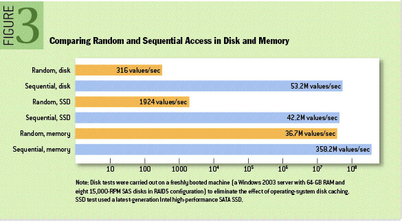
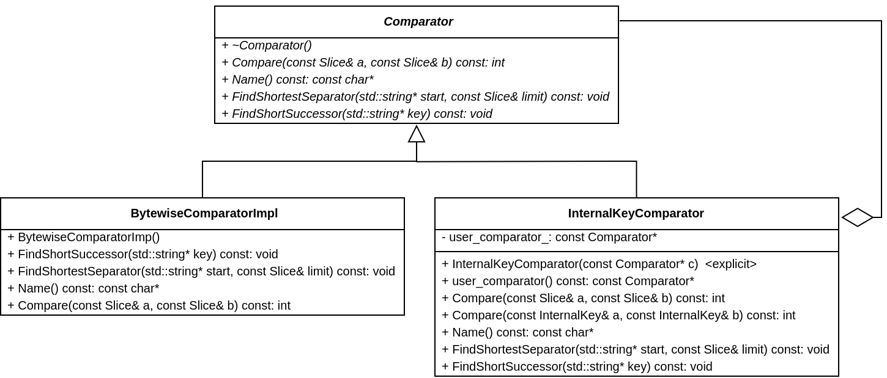

# LevelDB-1.22 源码分析
## LevelDB 原理
### SSTable: Sorted String Table
如果说 Protocol Buffers 是 Google 单个数据记录的通用语言，则 Sorted String Table（SSTable）是用于存储、处理和交换数据集的最受欢迎的工具之一。顾名思义，SSTable 是一种简单的抽象，可以有效地存储大量键值对，同时针对高吞吐量，顺序的读/写工作负载进行优化。

假设我们需要处理很大的工作负载，其输入是 GB 或 TB 数量级。另外，我们需要在其上运行多个步骤，这些步骤必须由不同的二进制文件执行。鉴于输入数据的规模，运行时间主要用于数据读写。因此，随机读取和写入不是一种选择，相反，我们将希望流式传输数据，完成后，将其作为流式操作刷新回磁盘。这样，我们可以分摊磁盘 I/O 成本。

SSTable “人”如其名，表示“有序的字符串表”。它是一个文件，其中包含一组任意、有序的键-值对。键的取值可以重复，并且键和值都不需要填充以满足长度需要。如果文件过大，可以在文件中添加或独立创建一个 key:offset 索引供快速访问。


### Log-Structured Merge Tree (LSM-Tree)
#### 背景
目前，LSM-Tree 被很多产品用作主要的文件组织结构，包括 HBase、Cassandra、LevelDB 和 SQLite，甚至 MongoDB 3.0 版本也引入了一个可选的 LSM-Tree 引擎。

LSM-Tree 的有趣之处在于它摆脱了文件组织领域主流的基于二叉树的模式。LSM-Tree 看上去有些反直觉，但是当考虑到现代的存储系统的特点后，才能体会 LSM-Tree 的精妙之处。简而言之，LSM-Tree 旨在提供比传统 B+ 数或者 ISAM 方法更好的写入吞吐量。这是通过消去随机的本地更新操作来达到这个目标。

那么为什么这是一个好的方法呢？本质上讲，这时一个古老的话题--对于磁盘而言，随机访问很慢，而顺序访问却很快。无论磁盘是机械的还是固态的，甚至是主存，在这两种访问模式之间，都有巨大的性能差距（三个数量级）。这说明应该避免随机访问，尽量执行顺序访问。



所以，如果我们关注数据写入吞吐量，最好该怎么做？一个好的策略是简单地将数据附加在文件尾部。这个策略常称为日志或者堆文件，因为完全是顺序访问，可以提供逼近理论的写入吞吐量（通常是每块磁盘 200～300 MB/s）。

上述方法足够简单，性能很好，所以在很多海量数据应用中广泛使用。但是，它有一个明显的缺点，从日志中随机读出将花费比写入多得多的时间，涉及到按时间顺序从近及远扫描日志，直到找到查找的键。这意味着，日志策略只适用于简单的场景：要么数据是整体访问，要么明确知道数据偏移。

因此，为了应对更复杂的读取范式（比如基于键的搜索，范围搜索），日志是不够的。广泛地讲，有四种方式可以帮助我们解决问题。
1. 对文件排序（基于键）。如果数据宽度一致，可以使用二分查找。如果不是，可以使用索引加扫描。
2. 哈希。使用哈希函数将数据打散进入 buckets，之后就可以直接读取。
3. B+ 树。使用有助于导航的文件组织，比如 B+ 树、ISAM 等
4. 外部文件。数据就是一个日志形式，另外单独创建哈希或者索引。

所有这些方法都可以显著提高读性能（复杂度从 O(N) 到最佳 O(log N)）。遗憾的是，这些结构添加了顺序信息，而这些信息会使得写操作变慢，日志结构就不能用了。鱼和熊掌不可兼得。

值得一提的是，以上所有四个选项都在数据上施加了某种形式的总体结构。数据是有意且专门放置在文件系统周围的，因此索引可以快速再次找到它。遗憾的是，在写入数据时当然必须尊重其结构。在这里，我们开始通过增加随机磁盘访问来降低写入性能。更糟糕的是，我们现在需要更新哈希或 B+ 索引的结构。这意味着更新文件系统的特定部分，需要缓慢的随机访问。

这就引入 LSM-Tree。与上述四种方法都不同，该技术是面向磁盘的，对内存的需求很少，仅限于性能提升，但是保留了日志系统的优秀的写性能。一个缺点是相比于 B+ 树弱一点的读性能。概括上讲，这种技术尽其所能，利用磁盘的顺序访问性能。

#### LSM-Tree 基本算法
从概念上讲，基本的 LSM-Tree 非常简单，它并不是具有一个大的索引结构，而是将一批写入顺序地保存到一组较小的索引文件中。因此，每个文件都包含在短时间内进行的一批更改。并且每个文件在写入之前都会进行排序，因此搜索会很快。此外，文件是不可更改的（immutable），永远不会更新。新的更新会进入新的文件。读取会检查所有文件，并且定期将文件合并在一起以减少文件数量。

进一步地，当更新到达时，会将它们添加到内存中的缓冲区中，该缓冲区通常以数（红黑树）的形式保存，以保留键值顺序。在大多数实现中，“内存表”（memtable）作为预写日志（write-ahead-log）复制到磁盘上，仅仅用于恢复。内存表填满后，已排序的数据将刷新到磁盘上的新文件，随着越来越多的写入操作重复此过程。重要的是，由于文件未编辑，系统仅执行顺序 IO。新条目或编辑仅创建连续文件。

因此，随着越来越多的数据进入系统，将创建越来越多的这些不可变的有序文件。每一个代表一小部分按时间顺序排列的变更，并保持排序。
由于旧文件未更新，因此会创建重复条目以取代以前的记录（或删除标记），这也就产生了一些冗余的数据。

系统会周期性地执行合并操作（Compaction）。合并操作选择一些文件，去掉重复或者需要删除的更新，然后合并在一起。这对于删除冗余非常重要，但更重要的是，要保持对读取操作性能的控制，随着文件数量增加，读取性能会下降。幸运的是，由于文件已排序，因此合并文件的过程非常有效。

当执行一个读操作，系统首先检查内存缓冲区（内存表）。如果没有找到对应的键，则以相反的时间顺序一次检查各个文件，直到找到目标键为止。由于每个文件都是有序地，因此查找相对简单。但是，随着文件数量的增加，读取操作将变得越来越慢，因为每个文件都需要检查，这是个问题。

因此在 LSM-Tree 中读取要比就地（in-place）读取方法慢。幸运的是，有一些技巧可以优化读取操作。最常见的方法就是在内存中保存页索引。这样可以方便找到目标 key。LevelDB、RocksDB 以及 BigTable 就是通过在每个文件末尾保留一个索引块来执行此操作。这通常比直接二进制搜索更好，因为它允许使用可变长度字段，并且更适合压缩数据。

即使每个文件都添加索引，读操作仍会随着文件数量的增加而变慢。通过定期将文件合并在一起，使得文件数量和读取性能都在可接受范围内。即使使用合并，读取仍将需要访问许多文件。大多数实现都通过使用 Bloom filter 来消除这种情况。Bloom filter 是一种内存有效的方法，可以确定文件是否包含键。

从“写”的角度来看，所有写操作都按批且按顺序进行写。合并回合还会产生定期的额外 IO 开销。但是，在查找记录时，读取可能会大量的文件。我们将写入时的随机 IO 换成读取时的随机 IO。如果我们可以使用 Bloom filter 之类的技巧或者大文件缓冲等硬件技巧类优化读取性能，那么这种折衷是可取的。

#### LSM-Tree 基本合并
为了保持 LSM-Tree 的读取相对较快，文件数量的管理非常重要。比如说，创建了一定数量的文件（例如 5 个文件，每个文件有 10 行）后，它们将合并为一个文件，其中包含 50 行（或可能少一些）。此过程继续，每次第五个文件填满时，这些文件就会合并一个文件（50 行或更少）。最终假设有五个 50 行的文件。 此时，将五个 50 行的文件合并为一个 250 行的文件。该过程将继续创建越来越大的文件。这种通用方法的问题是创建了大量文件：必须单独搜索所有文件以读取结果（至少在最坏的情况下）。


#### 分级合并（Leveled Compaction）
诸如 LevelDB、RocksDB 和 Cassandra 等较新的实现，不是使用基于文件大小，而是基于级别来进行合并。这可以减少最坏情况下读取操作需要访问的文件数量，同时也能减少单次压缩的副作用。分级合并和基本合并有两点不同：
1. 每级包含多个文件，并且保证同一级中不会有重复的键。也就是说，键分布在不同的文件中。因此，在同一级别中，查找一个键只需要访问一个数据。第一级别比较特殊，键可能重复。
2. 文件是一次合并到上级文件中。随着某级写满，会从中抽取单个文件将其合并到上级文件中，从而为添加更多数据腾出空间。这与基本方法略有不同，基本方法是将几个大小相似的文件合并为一个更大的文件。

这些变化意味值分级合并会随着时间的流逝扩展合并的影响，并且需要更少的总空间，它还具有更好的读取性能。但是，大多数工作负载的总 IO 较高，这意味着某些较简单的面向写入的工作负载将无法受益。

## LevelDB 源码分析
### Slice


Slice 是一种简单的结构，包含一个长度和一个指向外部字节数组的指针。Slice 的用户必须确保在释放相应的外部存储之后不使用该 Slice。多个线程可以在没有外部同步的情况下在 Slice 上调用 const 方法，但是如果任何线程可以调用非 const 方法，则访问同一 Slice 的所有线程都必须使用外部同步。返回 Slice 比返回 std::string 开销小，因为不需要复制可能很大的键和值。

C++ 字符串和 C 风格字符串都能够很容易转换为 Slice 类型
```
leveldb::Slice s1 = "hello";

std::string str("world");
leveldb::Slice s2 = str;
```
相反，Slice 对象也可以转换为 C++ 字符串（通过类方法 ToString）
```
std::string str = s1.ToString();
assert(str == std::string("hello"));
```
需要注意的是，Slice 对象的使用者必须确保其指向的外部数组有效。比如下面这个例子就是有问题的：
```
leveldb::Slice slice;
if(...) {
  std::string str = "...";
  slice = str;
}
Use(slice); // bug
```
compare() 方法提供比较两个 Slice 对象的方法，其底层是 memcmp()，即逐字节比较
```
inline int Slice::compare(const Slice& b) const {
  const size_t min_len = (size_ < b.size_) ? size_ : b.size_;
  int r = memcmp(data_, b.data_, min_len);
  if (r == 0) {
    if (size_ < b.size_) r = -1;
    else if (size_ > b.size_) r = +1;
  }
  return r;
}
```

### Status


Status 封装操作的结果。它可能指示成功，也可能指示错误以及相关的错误消息。多个线程可以在无需外部同步的情况下在 Status 上调用 const 方法，但是如果任何线程可能调用非 const 方法，则访问同一 Status 的所有线程都必须使用外部同步。

LevelDB 许多函数都会返回 Status 对象表示函数执行的状态。你可以检查函数是否正确执行，并且可以打印关联的错误信息
```
leveldb::Status s = "...";
if(!s.ok()) {
  std::cerr << s.ToString() << std::endl;
}
```
Status 类只用一个 const char* 成员变量 state_；指向动态内存，在析构函数中释放。如果 state_ 为 nullptr，表示 OK，否则字符串 state_ 分段表示多个信息：
```
state_[0..3] == length of message
state_[4]    == code
state_[5..]  == message
```
state_ 字符串头部 4 个字节为 32 位无符号整数，表示错误消息的长度（不包括code 这个字节）。私有成员函数 CopyState() 负责（深）拷贝 state_ 字符串
```
const char* Status::CopyState(const char* state) {
  uint32_t size;
  memcpy(&size, state, sizeof(size));
  char* result = new char[size + 5];
  memcpy(result, state, size + 5);
  return result;
}
```
此外，code 表示状态码，Status 共有 6 种状态，用套嵌类 Code 表示
```
enum Code {
  kOk = 0,
  kNotFound = 1,
  kCorruption = 2,
  kNotSupported = 3,
  kInvalidArgument = 4,
  kIOError = 5
};
```
私有成员函数 code() 返回当前 Status 对象的状态
```
Code code() const {
  return (state_ == nullptr) ? kOk : static_cast<Code>(state_[4]);
}
```
ToString() 成员函数将 Statue 对象相关信息转换为 std::string 对象
```
std::string Status::ToString() const {
  if (state_ == nullptr) {
    return "OK";
  } else {
    char tmp[30];
    const char* type;
    switch (code()) {
      case kOk:
        type = "OK";
        break;
      case kNotFound:
        type = "NotFound: ";
        break;
      case kCorruption:
        type = "Corruption: ";
        break;
      case kNotSupported:
        type = "Not implemented: ";
        break;
      case kInvalidArgument:
        type = "Invalid argument: ";
        break;
      case kIOError:
        type = "IO error: ";
        break;
      default:
        snprintf(tmp, sizeof(tmp),
                 "Unknown code(%d): ", static_cast<int>(code()));
        type = tmp;
        break;
    }
    std::string result(type);
    uint32_t length;
    memcpy(&length, state_, sizeof(length));
    result.append(state_ + 5, length);
    return result;
  }
}
```
需要注意的是，Status 类的构造函数只能创建 OK 类型的 Status 对象或者拷贝其他 Status 对象，其他类型的对象只能通过 6 个静态成员函数 OK()、NotFound()、Corruption()、NotSupported()、InvalidArgument()、IOError() 分别返回对应状态的 Status 对象。它们都是调用私有构造函数
```
Status::Status(Code code, const Slice& msg, const Slice& msg2) {
  assert(code != kOk);
  const uint32_t len1 = msg.size();
  const uint32_t len2 = msg2.size();
  const uint32_t size = len1 + (len2 ? (2 + len2) : 0);
  char* result = new char[size + 5];
  memcpy(result, &size, sizeof(size));
  result[4] = static_cast<char>(code);
  memcpy(result + 5, msg.data(), len1);
  if (len2) {
    result[5 + len1] = ':';
    result[6 + len1] = ' ';
    memcpy(result + 7 + len1, msg2.data(), len2);
  }
  state_ = result;
}
```

### Comparator


Comparator 对象为用作 SSTable 或数据库中的键的 Slice 对象提供排序逻辑。LevelDB 默认使用 BytewiseComparatorImpl 类的比较方法，其调用 Slice 类的 compare() 方法，逐字节比较。函数 BytewiseComparator() 会创建一个 BytewiseComparatorImpl 对象，并返回 const Comparator* 类型的指针。另外，LevelDB 还实现了 InternalKeyComparator，它是一个装饰器，其成员变量包含了一个 Comparator 类型的 user_comparator_，所有的比较都是调用这个成员变量的 Compare() 方法。


默认方法使用了 BytewiseComparatorImpl 按照字典序的默认排序函数对key进行排序。然而，你也可以在打开一个数据库时为其提供一个自定义的比较器。例如，假设数据库的每个key由两个数字著称，我们应该先按照第一个数字排序，如果相等再按照第二个数字进行排序。首先，定义一个满足如下规则的leveldb::Conmparator的子类：
```
class TwoPartComparator : public leveldb::Comparator {
 public:
  // Three-way comparison function:
  //   if a < b: negative result
  //   if a > b: positive result
  //   else: zero result
  int Compare(const leveldb::Slice& a, const leveldb::Slice& b) const {
    int a1, a2, b1, b2;
    ParseKey(a, &a1, &a2);
    ParseKey(b, &b1, &b2);
    if (a1 < b1) return -1;
    if (a1 > b1) return +1;
    if (a2 < b2) return -1;
    if (a2 > b2) return +1;
    return 0;
  }

  // Ignore the following methods for now:
  const char* Name() const { return "TwoPartComparator"; }
  void FindShortestSeparator(std::string*, const leveldb::Slice&) const {}
  void FindShortSuccessor(std::string*) const {}
};
```
现在使用这个自定义的比较器创建数据库：
```
TwoPartComparator cmp;
leveldb::DB* db;
leveldb::Options options;
options.create_if_missing = true;
options.comparator = &cmp;
leveldb::Status status = leveldb::DB::Open(options, "/tmp/testdb", &db);
...
```
Comparator 实现必须是线程安全的，因为 LevelDB 可能会同时从多个线程调用其方法。

### Coding
TODO

### FilterPolicy


LevelDB 提供 FilterPolicy，默认实现是 BloomFilterPolicy，即布隆过滤器，是一种用于快速判断某个元素是否属于集合的多哈希映射查找算法，但是并不要求 100% 正确。相对于哈希表，布隆过滤器空间利用率更高，这种空间高利用率是有代价的，当我们在布隆过滤器中查找 key 时，有两种返回值：
（1）key 不存在，那么 key 一定不存在；（2）key 存在，那么 key 可能存在。也就是说，布隆过滤器有一定打误判率。

### InternalKey


LevelDB 中跟 key 相关的数据结构主要有 UserKey、InternalKey、PasedInternalKey 和 LookupKey。其中 UserKey 就是客户传入的 key。InternalKey 是一个复合体，由三个部分组成，分别是，UserKey，SequenceNumber 和 ValueType。其中，SequenceNumber 和 ValueType 共占用 8 个字节，由一个 64 位的无符号整数表示，低 8 位存储 ValueType，高 56 位存储 SequenceNumber。PasedInternalKey 就是 InternalKey 三个部分拆分打结果。LookupKey 是 MemTable 查询的接口。


### Snapshot


Snapshot 在键-值存储的整体状态上提供了一致的只读视图，可以从多个线程安全地访问而无需任何外部同步手段。在 LevelDB 内部，一个 Snapshot 对应着一个全局唯一的 SequenceNumber。SnapshotList 使用双向链表保存先后生成的 Snapshot 对象。SnapshotList 类中 Snapshot 类型的 head_ 成员变量当作双向链表的头结点，并且 head_.prev_ 指向最新的 Snapshot，而 head_.next_ 指向最老的 Snapshot。

通过 SnapshotList 的接口生成或者销毁一个 Snapshot。
```
SnapshotImpl* SnapshotList::New(SequenceNumber sequence_number) {
  assert(empty() || newest()->sequence_number_ <= sequence_number);
  SnapshotImpl* snapshot = new SnapshotImpl(sequence_number);

  snapshot->list_ = this;
  snapshot->next_ = &head_;
  snapshot->prev_ = head_.prev_;
  snapshot->prev_->next_ = snapshot;
  snapshot->next_->prev_ = snapshot;
  return snapshot;
}

void SnapshotList::Delete(const SnapshotImpl* snapshot) {
  assert(snapshot->list_ == this);
  snapshot->prev_->next_ = snapshot->next_;
  snapshot->next_->prev_ = snapshot->prev_;
  delete snapshot;
}
```

### Options


Options 控制着 LevelDB 数据库的行为方式（在创建 LevelDB 数据库时传入）。

|成员|作用|
|:-|:-|
|comparator|提供 key 比较打逻辑，默认使用 byte-wise 比较方式|
|create_if_missing|如果是 true，那么数据库不存在时创建|
|error_if_exists|如果为 true，则如果数据库已经存在，则会引发错误|
|paranoid_checks|如果为 true，则实现将对正在处理的数据进行主动检查，并且如果检测到任何错误，则将提早停止。 这可能会有无法预料的后果：例如，一个数据库条目的损坏可能导致大量条目变得不可读或整个数据库无法打开|
|env|使用指定的对象与环境进行交互，例如 读取/写入文件，安排后台工作等。默认值为 Env::Default()|
|info_log|如果数据库生成的任何内部进度/错误信息不为空，则将其写入 info_log；如果 info_log 为 null，则将其写入与数据库内容存储在同一目录中的文件。|
|write_buffer_size|内存缓存打数据量，默认是 4MB。较大的值可提高性能，尤其是在大负载期间。内存中最多可以同时保留两个写缓冲区，因此您可能希望调整此参数以控制内存使用情况。同样，较大的写缓冲区将导致下次打开数据库时较长的恢复时间。|
|max_open_files|数据库可以使用的打开文件数。如果数据库具有较大的工作集（每 2MB 的工作集预算一个打开的文件），则可能需要增加此数目|
|block_cache|如果非空，则将指定的缓存用于块。如果为 null，leveldb将自动创建并使用8MB内部缓存|
|block_size|默认 4KB|
|block_restart_interval|重新启动点之间的密钥数量，用于密钥的增量编码。该参数可以动态更改。大多数客户端应该保留此参数。|
|max_file_size|Leveldb会在切换到新字节之前将最多字节的数量写入文件。大多数客户端应将此参数保留为空。但是，如果文件系统对较大的文件更有效，则可以考虑增加该值。不利的一面是更长的压缩时间，因此更长的延迟/性能问题。增加此参数的另一个原因可能是在最初填充大型数据库时|
|compression|数据压缩方式，默认 kSnappyCompression|
|reuse_logs|如果为 true，则在打开数据库时将其附加到现有的 MANIFEST 和日志文件中。 这样可以大大加快打开速度。|
|filter_policy|如果不为空，则使用指定的筛选器策略来减少磁盘读取。默认使用 BloomFilterPolicy|

### Cache


LevelDB 支持用户自己实现缓存策略，作为 option 传入，默认使用的缓存淘汰策略是最近最少使用（Least Recently Used，LRU）。与之相关的数据结构有四个，分别是 LRUHandle、HandleTable、LRUCache、SharedLRUCache。LRU 缓存算法主要有 LRUCache 实现，不过为了减少多线程间的竞争，提升效率，引入 SharedLRUCache 数据结构。整体来看，SharedLRUCache 内部有 kNumShards（值为 16）个 LRUCache。


查找 key 时，先计算属于哪个 LRUCache，然后在相应的 LRUCache 中查找。计算方法很简单，取 hash 值的高 4 位值当成索引值，由 SharedLRUCache::Shard() 负责计算
```
uint32_t SharedLRUCache::Shard(uint32_t hash) { 
  return hash >> (32 - kNumShardBits); 
}
```
LRUCache 中 HandleTable 对象 table_，用于实现 O(1) 查找。HandleTable 是 LevelDB 实现的哈希表，根据注释介绍，其
性能优于某些内置哈希表的实现，比如和 g++ 4.4.3 内置哈希表相比，其随机读取性能提高了 5%。HandleTable 使用链地址法处理冲突，即将所有关键字为同义词的记录存储在同一线性链表中（通过 LRUHandle 中的指针域 next_hash 链接成一条单链表）。


随着元素的插入，当 list_ 中的元素大于桶的个数的时候（elems_ > length_），HandleTable 会增加桶的个数，增长方式是 2 倍增长。和一般实现不同，HandleTable 桶的个数总是合数，初始值为 4。
```
void HandleTable::Resize() {
  uint32_t new_length = 4;
  while (new_length < elems_) {
    new_length *= 2;
  }
  LRUHandle** new_list = new LRUHandle*[new_length];
  memset(new_list, 0, sizeof(new_list[0]) * new_length);
  uint32_t count = 0;
  for (uint32_t i = 0; i < length_; i++) {
    LRUHandle* h = list_[i];
    while (h != nullptr) {
      LRUHandle* next = h->next_hash;
      uint32_t hash = h->hash;
      LRUHandle** ptr = &new_list[hash & (new_length - 1)]; // *
      h->next_hash = *ptr;
      *ptr = h;
      h = next;
      count++;
    }
  }
  assert(elems_ == count);
  delete[] list_;
  list_ = new_list;
  length_ = new_length;
}
```
从选取桶的方式（标 * 的行）可以看出，HandleTable 中选取方法并不是用“模”运算，而是按位“与”的方式。HandleTable 中桶的个数刚好被设置为 2^n。按位与可以截取低位，当作桶的索引。

HandleTable 提供查找（Lookup）、插入（Insert）和删除（Remove）接口。三者都会调用一个重要的函数 FindPointer
```
LRUHandle** HandleTable::FindPointer(const Slice& key, uint32_t hash) {
  LRUHandle** ptr = &list_[hash & (length_ - 1)];
  while (*ptr != nullptr && ((*ptr)->hash != hash || key != (*ptr)->key())) {
    ptr = &(*ptr)->next_hash;
  }
  return ptr;
}
```
FindPointer 返回的是 LRUHandle 中 next_hash 指针域的地址，作用有两个：
1. 如果存在匹配的条目，返回指向该条目的 next_hash 指针域的地址（相当于前继结点）
2. 如果不存在，指向相应链表的尾结点的 next_hash 指针域（为 nullptr，可在其后插入）。

那么 Lookup 的实现就相当简单，直接调用 FindPointer
```
LRUHandle* HandleTable::Lookup(const Slice& key, uint32_t hash) {
  return *FindPointer(key, hash);
}
```
Remove 方法也比较简单，返回被删除的条目。
```
LRUHandle* HandleTable::Remove(const Slice& key, uint32_t hash) {
  LRUHandle** ptr = FindPointer(key, hash);
  LRUHandle* result = *ptr;
  if (result != nullptr) {
    *ptr = result->next_hash;
    --elems_;
  }
  return result;
}
```
Insert 方法，需要区分是更新还是插入新条目，而且可能需要扩容。如果是插入新条目，ptr 指向尾结点的 next_hash 指针域（*ptr 的值为 nullptr），old 的值为 nullptr。否则，old 的值不为空。如果是插入新条目，返回值为 nullptr。
```
LRUHandle* HandleTable::Insert(LRUHandle* h) {
  LRUHandle** ptr = FindPointer(h->key(), h->hash);
  LRUHandle* old = *ptr;
  h->next_hash = (old == nullptr ? nullptr : old->next_hash); // *
  *ptr = h;
  if (old == nullptr) {
    ++elems_;
    if (elems_ > length_) {
      Resize();
    }
  }
  return old;
}
```
LRUCache 中的两个 LRUHandle 类型的成员变量，lru_ 和 in_use_，只使用两个指针域 next 和 prev，当作链表头结点使用。LRUCache 维持有两个双向链表，LRUCache 中缓存的所有 LRUHandle 对象都在这两个链表之一上，并且永远不会同时在两个链表上。


LRUHandle 对象中的 in_cache 成员变量指示是否被缓存。refs 成员变量指示当前使用者的数量（包括 LRUCache）。LRUHandle 中 value 成员变量保存的是指向缓冲对象的指针，而不是对象本身。什么时候调用 deleter 清理函数，就是通过控制引用计数 refs 来实现的。LRUCache 中的一个 LRUHandle 对象可能经历如下三种状态：
1. 被手动从 LRUCache 中删除、被相同的 key 替换，或者容量满时被淘汰，此时 LRUCache 不应该持有该对象。如果客户也不再持有当彻底删除该对象。
2. 不满足 1 的条件，对象正常位于 LRUCache 中，同时被客户持有。此时即使容量满，也不会被淘汰。
3. 不满足 1 的条件，对象正常位于 LRUCache 中，但不被客户持有。此时即使容量满，可能会被淘汰。

这 3 个状态，就分别对应了以下三个条件：
1. in_cache == false
2. in_cache == true && refs >= 2
3. in_cache == true && refs == 1

其中满足条件 3 的 LRUHandle 对象按照 LRU 的顺序缓存在 lru_ 链表上，lru_.prev 指向最“新”的对象，lru_.next 指向最“老”的对象，当容量满时会被淘汰。满足条件 2 的结点存在于 in_use_，表示该 LRUHandle 对象还有客户调用方法在使用。

LRUCache 提供 Ref() 和 Unref() 两个方法进行引用计数的管理。Ref() 方法用于将 lru_ 上的对象转移到 in_use_ 量表上，并递增引用计数
```
void LRUCache::Ref(LRUHandle* e) {
  if (e->refs == 1 && e->in_cache) { // if on lru_ list, move to in_use_ list
    LRU_Remove(e);
    LRU_Append(&in_use_, e);
  }
  e->refs++;
}
```
而 Unref() 的工作相反，并且在 refs 减为 0 时负责释放内存
```
void LRUCache::Unref(LRUHandle* e) {
  assert(e->refs > 0);
  e->refs--;
  if (e->refs == 0) {  // Deallocate
    assert(!e->in_cache);
    (*e->deleter)(e->key(), e->value);
    free(e);
  } else if (e->in_cache && e->refs == 1) {
    // No longer in use; move to lru_ list.
    LRU_Remove(e);
    LRU_Append(&lru_, e);
  }
}
```
LRUCache 也提供查找、插入和删除相关接口。其中查找的时间复杂度为 O(1)，因为借助于哈希表，直接在哈希表中查询。并且，在返回之前，调用 Ref() 管理引用计数等信息。
```
Cache::Handle* LRUCache::Lookup(const Slice& key, uint32_t hash) {
  MutexLock l(&mutex_);
  LRUHandle* e = table_.Lookup(key, hash);
  if(e != nullptr) {
    Ref(e);
  }
  return reinterpret_cast<Cache::Handle*>(e);
}
```
LRUCache 跟删除有关的操作有两个，Release() 和 Erase()。Release() 的逻辑主要是用于归还，表示当前不再使用，未必是似乎销毁数据，调用一次 Unref()
```
void LRUCache::Release(Cache::Handle* handle) {
  MutexLock l(&mutex_);
  Unref(reinterpret_cast<LRUHandle*>(handle));
}
```
而 Erase() 更像是删除操作。首先从 table_ 中删除
```
void LRUCache::Erase(const Slice& key, uint32_t hash) {
  MutexLock l(&mutex_);
  FinishErase(table_.Remove(key, hash));
}
```
然后调用 FinishErase() 继续处理，从链表中删除。
```
bool LRUCache::FinishErase(LRUHandle* e) {
  if (e != nullptr) {
    assert(e->in_cache);
    LRU_Remove(e);
    e->in_cache = false;
    usage_ -= e->charge;
    Unref(e);
  }
  return e != nullptr;
}
```
LRUCache 的插入 Insert() 相对比较复杂，需要考虑缓存空间不足，淘汰“老”对象的情况。
```
Cache::Handle* LRUCache::Insert(const Slice& key, uint32_t hash, void* value,
                        size_t charge,
                        void (*deleter)(const Slice& key, void* value)) {
  MutexLock l(&mutex_);
  LRUHandle* e = reinterpret_cast<LRUHandle*>(malloc(sizeof(LRUHandle) - 1 + key.size()));
  e->value = value;
  e->deleter = deleter;
  e->charge = charge;
  e->key_length = key.size();
  e->hash = hash;
  e->in_cache = false;
  e->refs = 1;
  memcpy(e->key_data, key.data(), key.size());

  if (capacity_ > 0) {
    e->refs++;
    e->in_cache = true;
    LRU_Append(&in_use_, e);
    usage += charge;
    FinishErase(table_.Insert(e));
  } else {
    e->next = nullptr;
  }
  while (usage_ > capacity_ && lru_.next != lru_) {
    LRUHandle* old = lru_.next;
    assert(old->refs == 1);
    bool erased = FinishErase(table_.Remove(old->key(), old->hash));
    if (!erased) {
      assert(erased);
    }
  }
  return reinterpret_cast<Cache::Handle*>(e);
}
```
此外，LRUCache 还提供 Prune() 函数，用于将所有 lru_ 上的对象删除
```
void LRUCache::Prune() {
  MutexLock l(&mutex_);
  while (lru_.next != &lru_) {
    LRUHandle* e = lru_.next;
    assert(e->refs == 1);
    bool erased = FinishErase(table_.Remove(e->key(), e->hash));
    if (!erased) {
      assert(erased);
    }
  }
}
```


最后，再看 SharedLRUCache 就清晰明了，都是调用 LRUCache 的接口。
```
Handle* SharedLRUCache::Insert(const Slice& key, void* value, size_t charge,
                               void (*deleter)(const Slice& key, void* value)) {
  const uint32_t hash = HashSlice(key);
  return shard_[Shard(hash)].Insert(key, hash, value, charge, deleter);
}

Handle* SharedLRUCache::Lookup(const Slice& key) {
  const uint32_t hash = HashSlice(key);
  retrurn shard_[Shard(hash)].Lookup(key, hash);
}

void SharedLRUCache::Release(Handle* handle) {
  LRUHandle* h = reinterpret_cast<LRUHandle*>(handle);
  shard_[Shard(h->hash)].Release(handle);
}

void SharedLRUCache::Erase(const Slice& key) {
  const uint32_t hash = HashSlice(key);
  shard_[Shard(hash)].Erase(key, hash);
}

void SharedLRUCache::Prune() {
  for(int s = 0; s < kNumShards; s++) {
    shard_[s].Prune();
  }
}
```

### Arena


LevelDB 实现了一套简单的内存分配管理器，名称为 Arena。但是需要注意的是，Arena 并不是为整个 LevelDB 服务，而是在 MemTable 中使用。每次向 MemTable 中增加 key-value 对时，都会向 Arena 申请内存空间。

Arena 的公有接口只有三个，即 Allocate()、AllocateAligned() 和 MemoryUsage()。其中 MemoryUsage() 返回一个 Arena 对象向系统申请的内存（管理的内存），其他两个是分配内存的接口。Arena 没有提供回收内存的接口，这根 MemTable 的生命周期有关，具体在 MemTable 中介绍。

首先看一下 Arena 组织内存的方式


和普通内存池一样，Arena 也是一次申请一块足够大（4 KB）的内存，然后从这一块中分割出合适大小的内存返回给客户。不同的是，任意时刻，Arena 只有一块 Block 有未使用的内存，由 alloc_ptr_ 指向首地址。

当剩余空间满足时，只需要移动 alloc_ptr_，分割出内存返回客户。
```
char* Arena::Allocate(size_t bytes) {
  assert(bytes > 0);
  if (butes <= alloc_bytes_remaining_) {
    char* result = alloc_ptr_;
    alloc_ptr_ += bytes;
    alloc_bytes_remaining_ -= bytes;
    return result;
  }
  return AllocateFallback(bytes);
}
```
否则，就需要向系统申请而外的空间，不过需要注意 Arena 处理方式
。前面分析可知，任意时刻，Arena 只有一块 Block 有未使用的内存，当再次申请时，前一块 Block 未使用的内存就会丢弃，浪费内存。因此，为了减少内存浪费，Arena 可能会直接申请一块完整的内存返回给客户，这个阈值是 kBlockSize 的四分之一。这样，每个 Block 最多后 1/4 的空间被浪费。
```
char* Arena::AllocateFallback(size_t bytes) {
  if (bytes > kBlockSize / 4) {
    char* result = AllocateNewBlock(bytes);
    return result;
  }

  alloc_ptr_ = AllocateNewBlock(kBlockSize);
  alloc_bytes_remaining_ = kBlockSize;
  char* result = alloc_ptr_;
  alloc_ptr_ += bytes;
  alloc_bytes_remaining_ -= bytes;
  return result;
}
```
因此，可以看出 Arena 内存分配的策略
1. bytes <= alloc_bytes_remaining_，移动 alloc_ptr_，返回内存。
2. bytes > alloc_bytes_remaining_ && bytes > kBlockSize / 4，单独申请一块完整的内存返回给客户。此时不修改 alloc_ptr_。
3. 否则，Arena 向系统申请另一块 Block，从这里分割出一块给客户。

AllocateNewBlock() 负责向系统申请内存
```
char* Arena::AllocateNewBlock(size_ block_bytes) {
  char* result = new char[block_bytes];
  blocks_.push_back(result);
  memory_usage_.fetch_add(block_bytes + sizeof(char*), std::memory_order_relaxed);
  return result;
}
```
此外，Arena 还支持地址对齐的内存。这里对齐并不是大小对齐，起始地址对齐。比如说，当前 alloc_ptr_ 值为 13，系统 8 字节对齐，返回的内存首地址应该是 16。
```
char* Arena::AllocateAligned(size_t bytes) {
  const int align = (sizeof(void*) > 8) ? sizeof(void*) : 8;
  static_assert((align & (align - 1)) == 0,
                "Pointer size should be a power of 2");
  size_t current_mod = reinterpret_cast<uintptr_t>(alloc_ptr_) & (align - 1);
  size_t slop = (current_mod == 0 ? 0 : align - current_mod);
  size_t needed = bytes + slop;
  char* result;
  if (needed <= alloc_bytes_remaining_) {
    result = alloc_ptr_ + slop;
    alloc_ptr_ += needed;
    alloc_bytes_remaining_ -= needed;
  } else {
    result = AllocateFallback(bytes);
  }
  assert((reinterpret_cast<uintptr_>(result) & (align - 1)) == 0);
  return result;
}
```

### SkipList


跳表（SkipList）的原理在[这里](https://github.com/wuyongchn/cs-primer/blob/master/ds/skip-list/skip-list.md)有分析。LevelDB 实现的跳表比较特殊，在销毁跳表之前，绝不会删除分配的结点（Node）。并且，将结点插入到跳表后，除了指针域会改变，内容不会改变。

跳表结点的阶数是随机的，LevelDB 中的 Node 用柔性数组来实现，每次申请 Node 前必须确定阶数，分配合适的空间。Node 提供的接口比较简洁
```
Node* Next(int n) {
  assert(n >= 0);
  return next_[n].load(std::memory_order_acquire);
}
void SetNext(int n, Node* x) {
  assert(n >= 0);
  next_[n].store(x, std::memory_order_release);
}

Node* NoBarrier_Next(int n) {
  assert(n >= 0);
  return next_[n].load(std::memory_order_relaxed);
}
void NoBarrier_SetNext(int n, Node* x) {
  assert(n >= 0);
  next_[n].store(x, std::memory_order_relaxed);
}
```
先分析 SkipList 几个比较重要的私有成员函数。我们知道，当跳表插入新结点时，新结点的阶数是随机决定的（如果第 i 阶存在指针，那么第 i+1 阶也有指针的概率为 p，LevelDB 中 p 为 1/4）。RandomHeight() 就是用来决定 Node 的阶数。
```
template <typename Key, class Comparator>
int SkipList<Key, Comparator>::RandomHeight() {
  static const unsinged int kBranching = 4;
  int height = 1;
  while (height < kMaxHeight && ((rnd_.Next() % kBranching) == 0)) {
    height++; // 每次有 1/4 的概率执行
  }
  assert(height > 0);
  assert(height <= kMaxHeight);
  return height;
}
```
另一个是 NewNode() 成员函数，SkipList 每次都通过它从 Arena 中申请结点。height 参数就是通过 RandomHeight() 计算的。
```
template <typename Key, class Comparator>
typename SkipList<Key, Comparator>::Node*
SkipList<Key, Comparator>::NewNode(const Key& key, int height) {
  char* const node_memory = arena_->AllocateAlinged(
      sizeof(Node) + sizeof(std::atomic<Node*>) * (height - 1));
  return new (node_memory) Node(key);
}
```
另一个是 FindGreaterOrEqual() 成员函数。我们知道在跳表中插入前也是查找。为了执行一次查找，我们在头结点从最高阶的链开始，沿着这个阶一直走，直到发现下一个结点大于我们正在查找的结点或者下一个结点为空。这个时候，我们就转到低一阶链继续使用这种方法。当进行到最底层阶并且停止时，或者我们位于正在查找的结点的前面，或者查找结点不在这个跳表中。并且为了后续方便插入，还需要记录查找过程每阶最右的结点。
```
template <typename Key, class Comparator>
typename SkipList<Key, Comparator>::Node*
SkipList<Key, Comparator>::FindGreaterOrEqual(const Key& key, 
                                              Node** prev) const {
  Node* x = head_;
  int level = GetMaxHeight() - 1;
  while (true) {
    Node* next = x->Next(level);
    if (KeyIsAfterNode(key, next)) {
      x = next;
    } else {
      if (prev != nullptr) {
        prev[level] = x;
      }
      if (level == 0) {
        return next;
      } else {
        level--;
      }
    }
  }
}
```
另外两个较重要的私有成员函数，FindLessThan() 返回最后一个满足 key < key 的结点。而 FindLast() 返回跳表的最后一个结点。
```
template <typename Key, class Comparator>
typename SkipList<Key, Comparator>::Node*
SkipList<Key, Comparator>::FindLessThan(const Key& key) const {
  Node* x = head_;
  int level = GetMaxHeight() - 1;
  while (true) {
    assert(x == head_ || compare_(x->key, key) < 0);
    Node* next = x->Next(level);
    if (next == nullptr || compare_(next->key, key) >= 0) {
      if (level == 0) {
        return x;
      } else {
        level--;
      }
    }
  }
}

template <typename Key, class Comparator>
typename SkipList<Key, Comparator>::Node*
SkipList<Key, Comparator>::FindLast() const {
  Node* x = head_;
  int level = GetMaxHeight() - 1;
  while (true) {
    Node* next = n->Next(level);
    if (next == nullptr) {
      if (level == 0) {
        return x;
      } else {
        level--;
      }
    } else {
      x = next;
    }
  }
}
```
SkipList 创建后的状态只有一个头结点
```
template <typename Key, class Comparator>
void SkipList<Key, Comparator>::SkipList(Comparator cmp, Arena* arena):
    : compare_(cmp),
      arena_(arena),
      head_(NewNode(0, kMaxHeight)),
      max_height_(1),
      rnd_(0xdeadbeef) {
  for (int i = 0; i < kMaxHeight; ++i) {
    head_->SetNext(i, nullptr);
  }
}
```
在 SkipList 中查找（Contains() 函数）的过程比较直观，FindGreaterOrEqual() 完成了主要的逻辑
```
template <typename Key, class Comparator>
bool SkipList<Key, Comparator>::Contains(const Key& key) const {
  Node* x = FindGreaterOrEqual(key, nullptr);
  if (x != nullptr && Equal(key, x->key)) {
    return true;
  } else {
    return false;
  }
}
```
在 SkipList 中插入（Insert() 函数）需要找到插入位置，使得插入后跳表仍然有序。而且，每次插入都需要决定插入结点的阶数。
```
template <typename Key, class Comparator>
void SkipList<Key, Comparator>::Insert(const Key& key) {
  Node* prev[kMaxHeight];
  Node* x = FindGreaterOrEqual(key, prev);
  assert(x == nullptr || !Equal(key, x->key));
  int height = RandomHeight();
  if (height > GetMaxHeight()) {
    for (in i = GetMaxHeight(); i < height; i++) {
      prev[i] = head_;
    }
    max_height_.store(height, std::memory_order_relaxed);
  }

  x = NewNode(key, height);
  for (int i = 0; i < height; i++) {
    x->NoBarrier_SetNext(i, prev[i]->NoBarrier_Next(i));
    prev[i]->SetNext(i, x);
  }
}
```
此外，SkipList 还提供一个双向迭代器 Iterator 供遍历使用。其实现基本调用 SkipList 的接口。

### MemTable


MemTable 是内存表，位于内存中，是 LevelDB 位于内存的数据结构。MemTable 既可以读，也可以写，和它对应的是 Immutable MemTable，两者结构完全一样，只是后者只能读，不可写。当写入的数据到达指定门限（默认 4MB），就会自动转化为 Immutable MemTable，等待写入到磁盘里。LevelDB 会产生新的 MemTable 供写入新的键-值对。

MemTable 提供了键-值对的写入、读出以及删除。但是 MemTable 没有显示打删除键-值的接口，删除某个键-值是通过插入一条记录来实施的，只不过这条记录打数据类型标记为 kTypeDetetion，正在打删除会滞后执行。MemTable 采用跳表来存储键-值对，默认按照键之间的 Byte-Wise 比较序列排序。在插入键-值对时，LevelDB 要把这个键-值对插入到合适的位置以保持有序性。

MemTable 采用引用计数管理自己的生命周期。当外部使用该 MemTable 对象时，递增引用技术；当不使用的时候，递减引用技术，在引用计数递减至 0 时释放 MemTable 内存。Ref() 和 Unref() 接口提供引用计数相关操作：
```
void MemTable::Ref() { ++refs_; }
void MemTable::Unref() {
  --refs_;
  assert(refs_ >= 0);
  if (refs_ <= 0) {
    delete this;
  }
}
```
Add() 接口向 MemTable 添加一个条目（内存空间通过 Arena 申请），该条目将键映射到指定序列号和指定类型的值。如果 type == kTypeDeletion，则值通常为空，表示一个删除操作。
```
void MemTable::Add(SequenceNumber s, ValueType type, const Slice& key,
                   const Slice& value) {
  size_t key_size = key.size();
  size_t val_size = value.size();
  size_t internal_key_size = key_size + 8;
  const size_t encode_len = VarinLength(internal_key_size) + 
                            internal_key_size + VarintLength(val_size) + 
                            val_size;
  char* buf = arena_.Allocate(encoded_len); // 申请内存
  char* p = EncodeVarient32(buf, internal_key_size);
  memcpy(p, key.size(), key_size);
  p += key_size;
  EncodeFixed64(p, (s << 8) | type);
  p += 8;
  p = EncodeVarint32(p, val_size);
  memcpy(p, value.data(), val_size);
  assert(p + val_size == buf + encoded_len);
  table_.Insert(buf); // 插入跳表
}
```
Get() 接口提供读取键-值的操作。其结果比较复杂，包括下面三种情况：（1）如果 MemTable 包含键的值，则将其存储在 value 中并返回 true；（2）如果 MemTable 包含键数据类型是删除项 kValueDeletion，在 s 中保存 NotFound() 状态，函数仍然返回 true；（3）不包含对应的键，返回false。
```
bool MemTable::Get(const LookupKey& key, std::string* value, Status* s) {
  Slice memkey = key.memtable_key();
  Table::iterator iter(&table_);
  iter.Seek(memkey.data());
  if (iter.Valid()) {
    const char* entry = iter.key();
    uint32_t key_length;
    const char* key_ptr = GetVarint32Ptr(entry, entry + 5, &key_length);
    if (comparator_.comparator.user_comparator()->Compare(
            Slice(key_ptr, key_length - 8), key.user_key()) == 0) {
      const uint64_t tag = DecodeFixed64(key_ptr + key_length - 8);
      switch (static_cast<ValueType>(tar & 0xff)) {
        case kTypeValue: {
          Slice v = GetLengthPrefixedSlice(key_ptr + key_length);
          value->assign(v.data(), v.size());
          return true;
        }
        case kTypeDeletion:
          *s = Status::NotFound(Slice());
          return true;
      }
    }
  }
  return false;
}
```

## 参考资料
- https://www.igvita.com/2012/02/06/sstable-and-log-structured-storage-leveldb/
- http://www.benstopford.com/2015/02/14/log-structured-merge-trees/
- https://queue.acm.org/detail.cfm?id=1563874
- https://zhuanlan.zhihu.com/p/45843295
- http://kaiyuan.me/2017/05/02/leveldb-03/