# 设计模式
## UML 类图关系
### 继承

## 介绍
### 什么是设计模式
每一个模式描述啦一个在我们周围不断重复发生的问题以及该问题的解决方案的核心。这样，你就能一次有一次地使用该方案而不必做重复劳动。

### GOF 设计模式
历史性著作《设计模式：可复用面向对象软件的基础》

### 从面向对象谈起
- 底层思维：向下，如何把握机器底层从微观理解对象构造
  - 语言构造
  - 编译转换
  - 内存模型
  - 运行时机制
- 抽象思维：向上，如何将我们的周围世界抽象为程序代码
  - 面向对象
  - 组件封装
  - 设计模式
  - 架构模式

### 深入理解面向对象
- 向下：深入理解三大面向对象机制
  - 封装，隐藏内部实现
  - 继承，复用现有代码
  - 多态，改写对象行为
- 向上：深刻把握面向对象机制多带来的抽象意义，理解如何使用这些机制来表达现实世界，掌握什么是“好的面向对象设计”。

### 如何解决复杂性
- 分解：分而治之
- 抽象：特殊到一般

### 重新认识面向对象
- 隔离变化
- 各司其职
- 对象是什么？
  - 封装了代码和数据
  - 一系列可被使用的公共接口
  - 某种拥有责任的抽象

### 面向对象设计原则（SOLID）
- 依赖倒置原则（DIP）
  - 高层模块（稳定）不依赖与低层模块（变化），二者都应该依赖于抽象（稳定）
  - 抽象（稳定）不应该依赖于实现细节（变化），实现细节应该抽象（稳定）
- 开放封闭原则（OCP）
  - 对扩展开放，对更改封闭
  - 类模块应该是可扩展的，但是不可修改
- 单一职责原则（SRP）
  - 一个类应该仅有一个引起它变化的原因
  - 变化的方向隐含着类的责任
- Liskov 替换原则（LSP）
  - 子类必须能够替换他们的基类
  - 继承表达类型抽象
- 接口隔离原则（ISP）
  - 不应该强迫客户程序依赖他们不用的方法
  - 接口应该小而完备

### 从封装变化角度对模式分类
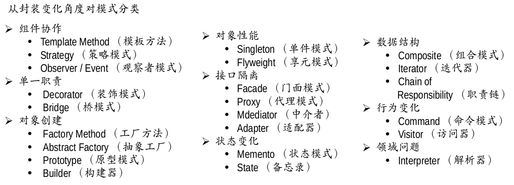

## Template Method
### 动机
在软件构建过程中，对于某一项任务，它常常有稳定的整体操作结构，但各个子步骤却又很多改变的需求，或者由于固有的原因（比如框架与应用之间的关系）而无法和任务的整体结构同时实现。

如何在确定稳定操作结构的前提下，来灵活应对各个子步骤的变化或者晚期实现需求？

### 定义
定义一个操作中的算法骨架（稳定），而将一些步骤延迟（变化）到子类中。Template Method 使得子类可以不改变（复用）一个算法的结构即可重定义（override 重写）该算法的某些特定的步骤。

### 结构
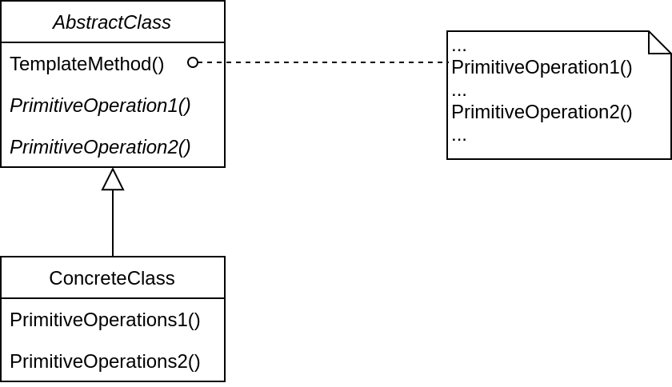

## Strategy
### 动机
- 在软件构建过程中，某些对象使用的算法可能多种多样，经常改变，如果将这些算法都编码到对象中，将会是对象变得异常复杂；而且有时候支持不使用的算法也是一个性能负担;
- 如何在运行时根据需要透明地更改对象的算法？将算法与对象本身解藕，从而避免上述问题？

### 模式定义
定义一系列算法，把他们一个个封装起来，并且使他们可以互相替换（变化）。该模式使得算法可独立于使用它的客户程序（稳定）而变化（扩展，子类化）。

### 结构
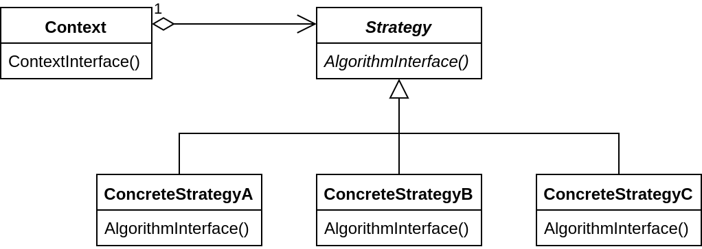

### 要点总结
- Strategy 及其子类为组件提供了一系列可重用的算法，从而可以使得类型在运行时方便地根据需要在各个算法之间进行切换。
- Strategy 模式提供了用条件判断语句以外的另一种选择，消除条件判断语句，就是在解藕合。含有许多条件判断语句的代码通常都需要  Strategy 模式。
- 如果 Strategy 对象没有实例变量，那么各个上下文可以共享同一个 Strategy 对象，从而节省对象开销。

## Observer / Event
### 动机
- 在软件创建过程中，我们需要为某些对象建立一种“通知依赖关系”--一个对象（目标对象）的状态发生改变，所有的依赖对象（观察者对象）都将得到通知。如果这样的依赖关系过于紧密，将是软件不能很好地地域变化。
- 使用面向对象技术，可以将这种依赖关系弱化，并形成一种稳定的依赖关系。从而实现软件体系结构的松耦合。

### 模式定义
定义对象的一种一对多（变化）的依赖关系，以便当一个对象（Subject）的状态发生改变时，所依赖于它的对象都得到通知并自动更新。

### 结构
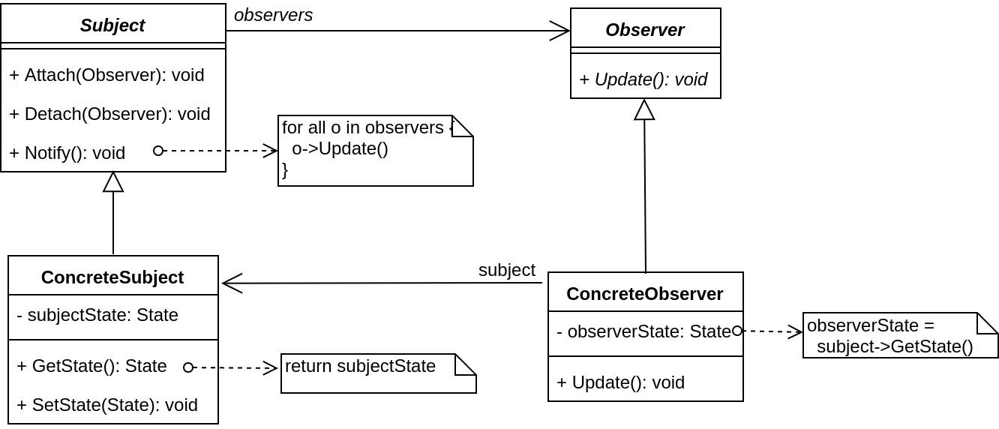

### 要点总结
- 使用面向对象的抽象，Observer 模式使得我们可以独立地改变目标与观察者，从而使二者之间的依赖达致松耦合。
- 目标发送通知时，无需指定观察者，通知会自动传播。
- 观察者自己决定是否需要订阅通知，目标对象对此一无所知。
- Observer 模式是基于事件的UI框架中非常常用的设计模式，也是 MVC 模式的一个重要组成部分。

## Decorator
### 动机
- 在某些情况下我们可能会“过度地使用继承来扩展对象的功能”，由于继承为类型引入的静态特质，使得这种扩展方式缺乏灵活性;并且随着子类的增多（扩展功能的增多），各种子类的组合（扩展功能的组合）会导致更多子类的膨胀;
- 如何使“对象功能的扩展”能够根据需要来动态地实现？同时避免“扩展功能的增多”带来的子类膨胀问题？从而使得任何“功能扩展变化”所导致的影响降为最低？

### 模式定义
- 动态（组合）地给一个对象增加一些额外的职责。就增加功能而言，Decorator 模式比生成子类（继承）更为灵活（消除重复代码&减少子类个数）。

### 结构
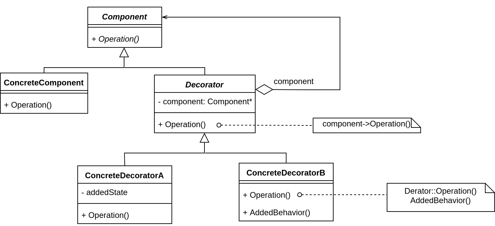

### 要点总结
- 通过采用组合而非继承的手法，Decorator 模式实现了在运行时动态扩展对象功能的能力，而且可以根据许啊哟扩展多个功能。避免了使用继承带来的“灵活性差”和“多子类衍生问题”。
- Decorator 类在接口上表现为 is-a Component 的继承关系，即 Decorator 类继承流 Component 类所具有的接口。但在实现上又表现为 has-a Component 的组合关系，即 Decorator 类有使用了另外一个 Component 类。
- Decorator 模式的目的并非解决“多个子类衍生的多继承”问题，Decorator 模式应用的要点在于解决“主体类在多个方向上的扩展功能”--是为“装饰”的含义。

## Bridge
### 动机
- 由于某些类型的固有的实现逻辑，使得它们具有两个变化的维度，乃至多个维度的变化
- 如何应对这种“多维度的变化”？如何利用面向对象技术来使得类型可以轻松地沿着两个乃至多个方向变化，而不引入额外的复杂度？

### 模式定义
将抽象部分（业务功能）与实现部分（平台实现）分离，使它们都可以独立地变化

### 结构
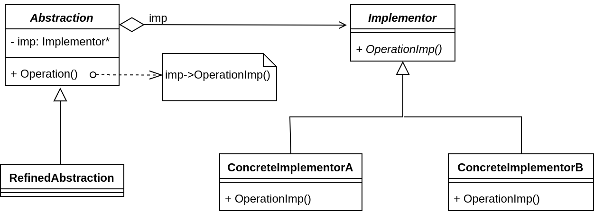

### 要点总结
- Bridge 模式使用“对象间的组合关系”解藕了抽象和实现之间固有的绑定关系，使得抽象和实现可以沿着各自的维度来变化。所谓抽象和实现沿着各自维度的变化，即“子类化”它们
- Bridge 模式有时候类似于多继承方案，但是多继承方案往往违背单一职责原则（即一个类只有一个变化的原因），复用性比较差。Bridge 模式是比多继承方案更好的解决方法。
- Bridge 模式的应用一般在“两个非常强的变化维度”，有时一个类也有多于两个的变化维度，这时可以使用 Bridge 的扩展模式。

## Factory Method
### 动机
- 在软件系统中，经常面临着创建对象的工作；由于需求的变化，需要创建的对象具体类型经常变化。
- 如何应对这种变化？如何绕过常规的对象创建方法（new），提供一种“封装机制”来避免客户程序和这种“具体对象创建”的紧耦合？

### 模式定义
定义一个用于创建对象的接口，让子类决定实例化哪一个类。Factory Method 使得一个类的实例化延迟（目的是解藕，手段是虚函数）到子类

### 结构
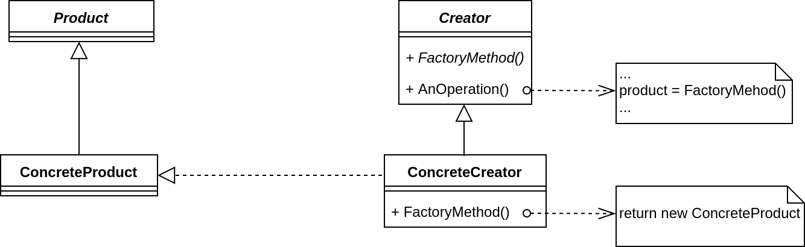

### 要点总结
- Factory Method 模式用于隔离类对象的使用者和具体类型之间的耦合关系。面对一个经常变化的具体类型，紧耦合关系（new）会导致软件的脆弱性。
- Factory Method 模式通过面向对象的手法，将要创建的具体对象工作延迟到子类，从而实现一种扩展（而非更改）的策略，较好地解决了这种紧耦合关系
- Factory Method 模式解决“单个对象”的需求变化。缺点子在于要求创建方法/参数相同。

## Abstract Factory
### 动机
- 在软件系统中，经常面临着“一系列相互依赖的对象”的创建工作；同时，由于需求的变化，往往存在更多系列对象的创建工作。
- 如何应对这种变化？如何绕过常规的对象创建方法（new），提供一种“封装机制”来避免客户程序和这种“多系列具体对象创建工作”的紧耦合？

### 模式定义
提供一个接口，让该接口负责创建一系列“相关或者相互依赖的对象”，无需指定它们具体的类。

### 结构
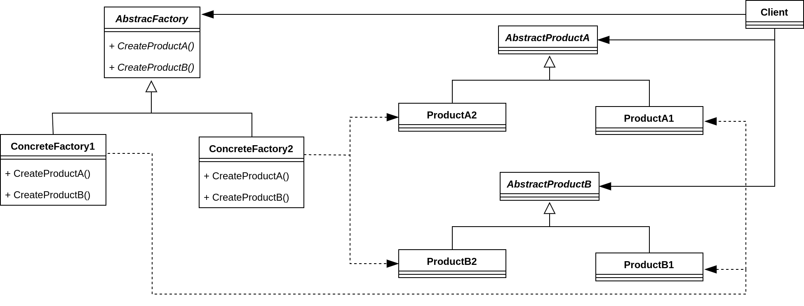

### 要点总结
- 如果没有应对“多系列对象构建”的需求变化，则没有必要使用 Abstract Factory 模式，这时候使用简单的工厂完全可以。
- “系列对象”指是某一特定系列下的对象之间有相互依赖、或作用的关系。不同系列的对象之间不能相互依赖。
- Abstract Factory 模式主要在于应对“新系列”的需求变动。其缺点在于难以应对“新对象”的需求变动。

## Prototype
### 动机
- 在软件系统中，经常面临着“某些结构复杂的对象”的创建工作；由于需求的变化，这些对象经常面临着剧烈的变化，但是它们却拥有比较稳定一致的接口。
- 如何应对这种变化？如何向“客户程序（使用这些对象的程序）”隔离出“这些易变对象”，从而使得“依赖这些易变对象”的客户程序不随着需求改变而改变？

### 模式定义
使用原型实例指定创建对象的种类，然后通过拷贝这些原型来创建新的对象。

### 结构
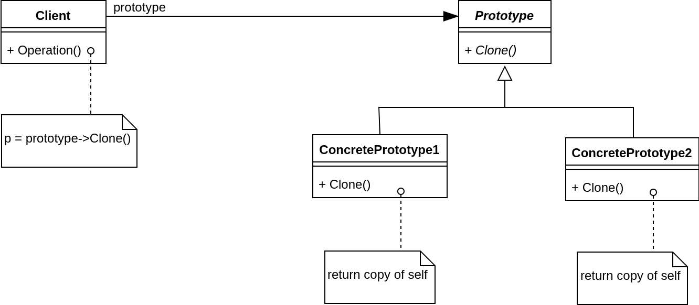

### 要点总结
- Prototype 模式同样用于隔离类对象的使用者和具体类型（易变类）之间的耦合关系，它同样要求这些“易变类”拥有“稳定的接口”。
- Prototype 模式对于“如何创建易变类的实体对象”采用“原型克隆”的方法来做，它使得我们可以非常灵活地动态创建“拥有某些稳定接口”的新对象--所需工作仅仅是注册一个新类型的对象（即原型），然后在任何需要的地方调用 Clone() 方法克隆。
- Prototype 模式中的 Clone() 方法可以利用某些框架汇中的序列化来实现深拷贝。

## Builder
### 动机
- 在软件系统中，有时候面临着“一个复杂对象”的创建工作，其通常由各个部分的子对象用一定的算法构成；由于需求的变化，这个复杂对象的各个部分经常面临着剧烈的变化，但是将它们组合在一起的算法却相对稳定。
- 如何应对这种变化？如何提供一种“封装机制”来隔离出“复杂对象的各个部分”的变化，从而保持系统中的“稳定构建算法”不随着需求改变而改变？

### 模式定义
将一个复杂对象的创建与其表示相分离，使得同样的构建过程（稳定）可以创建不同的表示（变化）。

### 结构
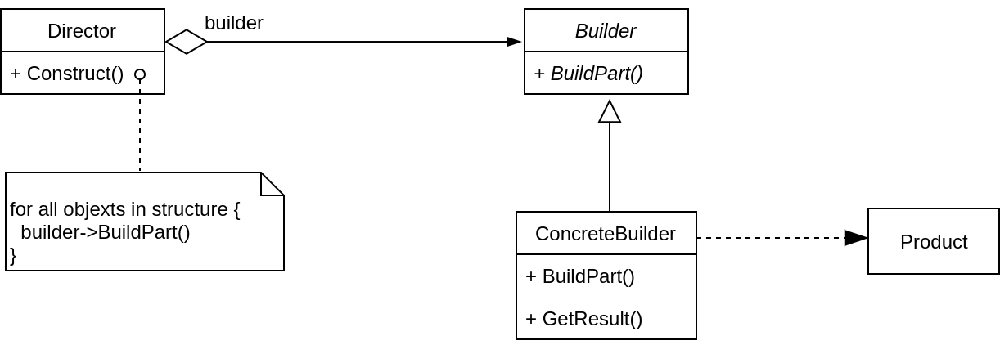

### 要点总结
- Builder 模式主要用于“分步骤构建一个复杂的对象”。在这其中“分步骤”是一个稳定的算法，而复杂对象的各个部分则经常变化
- 变化点在哪里，封装哪里 -- Builder 模式主要在于应对“复杂对象各个部分”的频繁需求变动。其缺点在于难以应对“分步骤构建算法”的需求变动
- 在 Builder 模式中，要注意不同语言中构造器内调用虚函数的差别

## Singleton
### 动机
- 在软件系统中，经常有这样一些特殊的类，必须保证他们在系统中只存在一个实例，才能保证它们的逻辑正确性、以及良好的效率。
- 如何绕过常规的构造器，提供一种机制来保证一个类只有一个实例？
- 这应该是类设计者的责任，而不是使用者的责任。

### 模式定义
保证一个类仅有一个实例，并提供一个该实例的全局访问点

### 结构
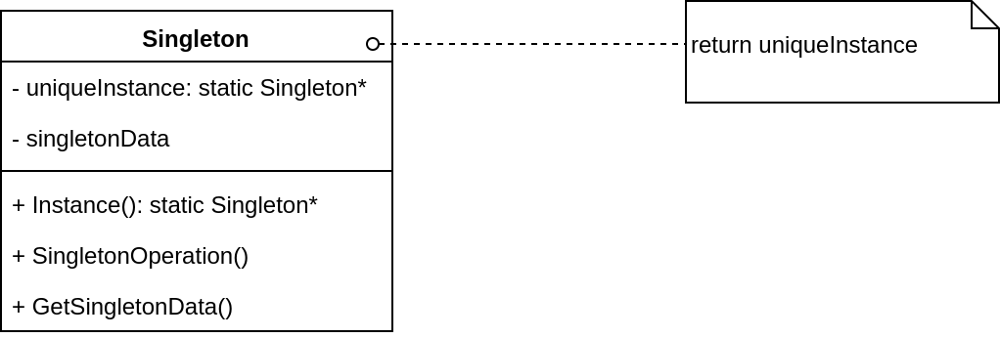

### 要点总结
- Singleton 模式中的实例构造器可以设置为 protected 以允许子类派生。
- Signleton 模式一般不要支持拷贝构造函数和 Clone 接口，因为这有可能导致多个对象实例，与 Singleton 模式的初衷违背。
- 如何实现多线程安全环境下的 Singleton？注意对双检查锁的正确实现。

## Flyweigt
### 动机
- 在软件系统采用纯粹对象方案的问题在于大量细粒度的对象会很快充斥在系统中，从而带来很高的运行时代价--主要指内存需求方面的代价。
- 如何在避免大量细粒度对象问题的同时，让外部客户程序仍然能够透明地使用面向对象的方式来进行操作。

### 模式定义
运用共享技术有效地支持大量细粒度的对象。

### 结构
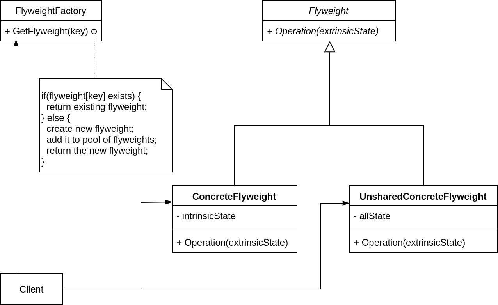

### 要点总结
- 面向对象很好地解决了抽象性的问题，但是作为一个运行在机器中的程序实体，我们需要考虑对象的代价问题。Flyweith 主要解决面向对象的代价问题，一般不触及面向对象的抽象性问题。
- Flyweight 采用共享对象的做法来降低系统中对象的个数，从而降低细粒度对象给系统带来的内存压力。在具体实现方面，要逐一对象状态的处理。
- 对象的数量太大从而导致对象内存开销加大--什么样的数量才算大？这需要我们仔细地根据具体应用情况进行评估，而不能凭空臆断。

## Facade 门面模式
### 动机
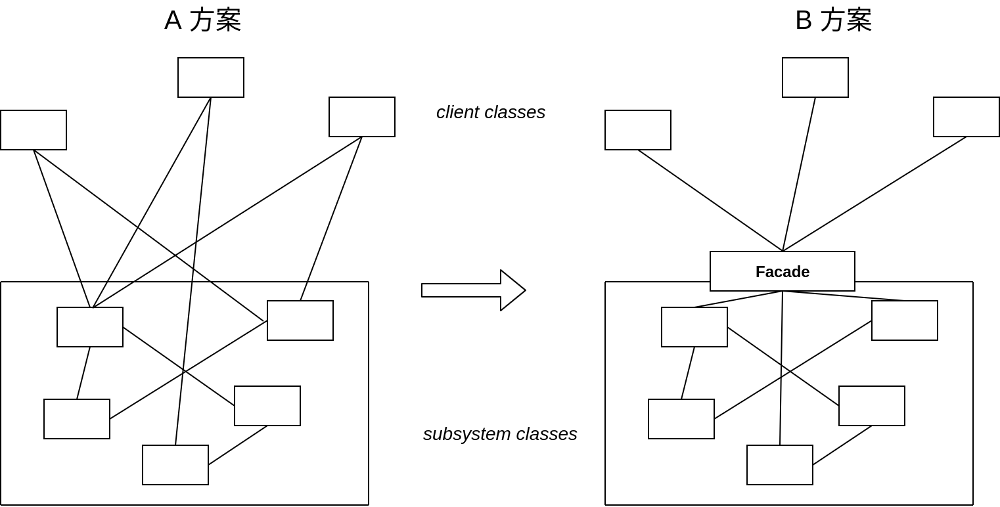

- 上述 A 方案的问题在于组件的客户和组件中各种复杂的子系统有了过多的耦合，随着外部客户程序和个子系统的演化，这种过多的耦合面临着很多变化的挑战。
- 如何简化外部客户程序和系统间的交互接口？如何将外部客户程序的演化和内部子系统的变化之间的依赖相互解藕？

### 模式定义
为子系统中的一组接口提供了一个一致（稳定）的界面，Facade 模式定义了一个高层接口，这个接口使得这一子系统更加容易使用（复用）。

### 要点总结
- 从客户程序的角度来看，Facade 模式简化了整个组件系统的接口，对于组件内部和外部客户程序来说，达到了一种“解藕”的效果--内部子系统的任何变化不会影响到 Facade 接口的变化。
- Facade 设计模式更注重从架构的层次去看整个系统，而不是单个类的层次。Facade 很多时候更是一种架构设计模式
- Facade 设计模式并非一个集装箱，可以任意地放进任何多个对象。Facade 模式中组件的内部应该是“相互耦合关系比较大的一系列组件”，而不是一个简单的功能集合。

## Proxy
### 动机
- 在面向对象系统中，有些对象由于某种原因（比如对象创建的开销很大，或者某些操作需要安全控制，或者需要进程外的访问等）直接访问会给使用者、或者系统结构带来很多麻烦。
- 如何在不失去透明操作对象的同时来管理/控制这些对象特有的复杂性？增加一层间接层是软件开发中常见的解决方式。

### 模式定义
为其他对象提供一种代理以控制（隔离，使用接口）对这个对象的访问

### 结构
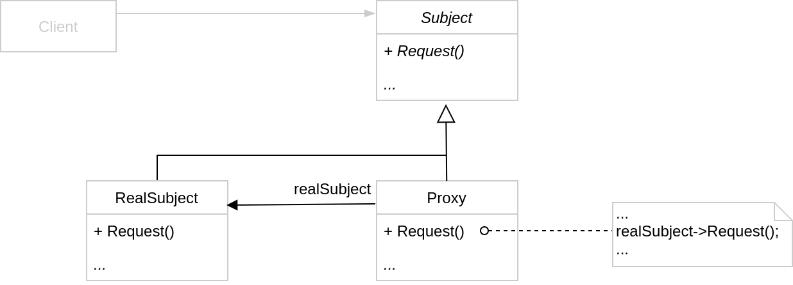

### 要点总结
- “增加一层间接层”是软件系统中对许多复杂问题的一种常见解决方案。在面向对象系统中，直接使用某系对象带来很多问题，作为间接层的 Proxy 对象便是解决这一问题的常用手段。
- 具体 Proxy 设计模式的实现方法、实现粒度都相差很大，有些可能对单个对象做细粒度的控制，不如 copy-on-write 技术，有些可能对组件模块提供抽象代理层，在架构层次对对象做 Proxy。
- Proxy 并不一定要求保持接口完整的一致性，只要能够实现间接控制，有时候损及一些透明性是可以接受的。

## Adapter
### 动机
- 在软件系统中，由于应用环境的变化，常常需要将“一些现存的对象”放到新的环境中应用，但是新环境要求的接口是这些现存对象所不能满足的。
- 如何应对这种“迁移的变化”？如何既能利用现有对象的良好表现，同时又能满足新的应用环境所要求的接口？

### 模式定义
将一个类的接口转换成客户希望的另一个接口。Adapter 模式使得原本由于接口不兼容而不能一起工作的那些类可以一起工作。

### 结构
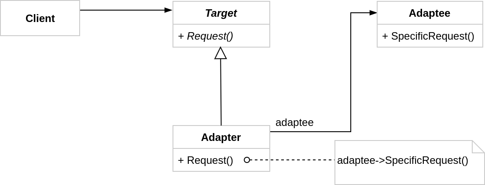

### 要点总结
- Adapter 模式主要应对于“希望复用一些现存的类，但是接口又与复用环境要求不一致的情况”，在遗留代码复用、类库迁移等方面非常有用。
- GoF 23 定义了两种 Adapter 模式的实现结构：对象适配器和类适配器。但类适配器采用“多继承”的实现方式，一般不推荐使用。对象适配器采用“对象组合”的方式，更复合松耦合精神。
- Adapter 模式可以实现地非常灵活，不必拘泥于 GoF 23 中定义的两种结构。例如，完全可以将 Adapter 模式中的“现存对象”作为新的接口方法参数，来达到适配的目的

## Mediator
### 动机
- 在软件构建过程中，经常出现多个对象互相关联交互的情况，对象之间常常会维持一种复杂的引用关系，如果遇到一些需求的更改，这种直接的引用关系将面临不断的变化。
- 在这种情况下，我们可使用一个“中介对象”来管理对象间的关联关系，避免相互交互的对象之间的紧耦合引用关系，从而更好地抵御变化。

### 模式定义
用一个中介对象类封装（封装变化）一些列的对象交互。中介者使各对象不需要显示的相互应用（编译时依赖 --> 运行时依赖），从而使其耦合松散（管理变化），而且可以独立地改变它们之间的交互。

### 结构
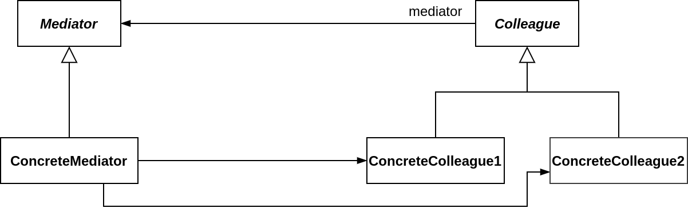

### 要点总结
- 将多个对象间复杂的关联关系解藕，Mediator 模式将多个关系间的控制逻辑集中管理，变“多个对象互相关联”为“多个对象和一个中介者关联”，简化系统的维护，抵御了可能的变化。
- 随着控制逻辑的复杂化，Mediator 具体对象的实现可能相当复杂。这时候可以对 Mediator 对象进行分解处理。
- Facade 模式是解藕系统间（单向）的对象关联关系；Mediator 模式是解藕系统内各个对象之间（双向）的关联关系。

## State
### 动机
- 在软件构建过程中，某些对象的状态如果改变，其行为也会随之而发生变化。比如文档处于只读状态，其支持的行为和读写状态支持的行为就可能完全不同。
- 如何在运行时根据对象的状态来透明地更改对象的行为？而不是为对象操作和状态变化之间引入紧耦合？

### 模式定义
允许一个对象在其内部状态改变时改变它的行为，从而使对象看起来似乎修改了其行为。

### 结构
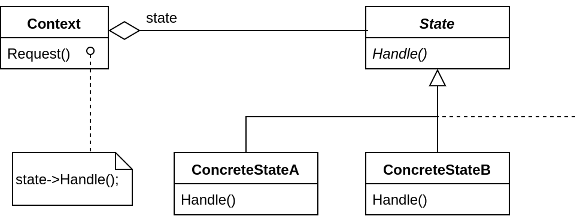

### 要点总结
- State 模式将所有与一个特定状态相关的行为都放入一个 State 子类对象中，在对象状态切换时，切换相应的对象；但同时维持 State 的接口，这样实现了具体操作与状态之间的解藕。
- 为不同的状态引入不同的对象使得状态转换变得更加明确，而且可以保证不会出现状态不一致的情况，因为转换是原子性的--即要么彻底转换过来，要么不转换。
- 如果 State 对象没有实例变量，那么各个上下文可以共享同一个 State 对象，从而节省对象的开销。

## Memento 备忘录 
### 动机
- 在软件构建过程中，某些对象的状态在转换过程中，可能由于某种需要，要求程序能够回溯到对象之前处于某个点时的状态。如果使用一些公有接口来让其他对象得到对象的状态，便会暴露对象的细节实现。
- 如何实现对象状态的良好保存与恢复？但同时又不会破坏对象本身的封装性。

### 模式定义
在不破化封装性的前提下，捕获一个对象的内部状态，并在该对象之外保存这个状态。这样以后就可以将该对象恢复到原先保存的状态。

### 结构
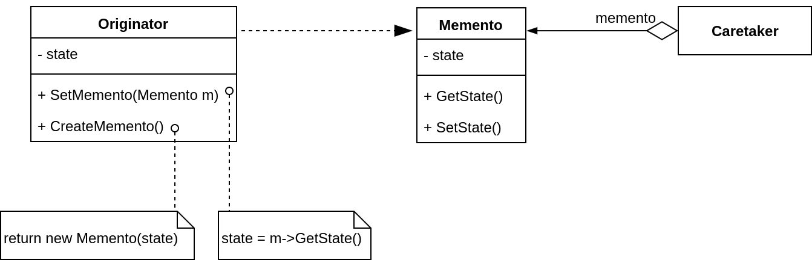

### 要点总结
- 备忘录（Memento）存储原发器（Originator）对象的内部状态，在需要时恢复原发器状态。
- Memento 模式的核心是信息隐藏，即 Originator 需要向外界隐藏信息，保持其封装性。但同时又需要将状态保持到外界（Memento）。
- 由于现代语言运行时（如 C#、Java 等）都具有相当的对象序列化支持，因此往往采用效率较高、又较容易正确实现的序列化方案来实现 Memento 模式。

## Composite
### 动机
- 软件在某些情况下，客户代码过多地依赖于对象容器复杂的内部实现结构，对象容器内部实现结构（而非抽象接口）的变化将引起客户代码的频繁变化，带来了代码的维护性、扩展性等弊端。
- 如何将“客户代码与复杂的对象容器结构”解藕？让对象容器自己来实现自身的复杂结构，从而使得客户代码就像处理简单对象一样来处理复杂的对象容器？

### 模式定义
将对象组合成树型结构以表示“部分-整体”的层次结构。Composite 使得用户对单个对象和组合的使用具有一致性（稳定）

### 结构
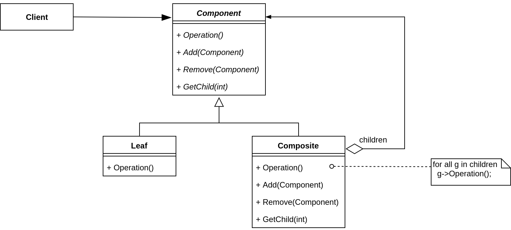

### 要点总结
- Composite 模式采用树型结构来实现普遍存在的对象容器，从而将“一对多”的关系转化为“一对一”的关系，使得客户代码可以一致地（复用）处理对象和容器，无需关系处理的是单个对象还是组合的对象容器。
- 将“客户代码与复杂的对象容器结构”解藕是 Composite 的核心思想。解藕之后，客户代码将与纯粹的抽象接口--而非对象容器的内部实现结构--发生依赖，从而更能“应对变化”。
- Composite 模式在具体实现中，可以让父对象中的子对象发向追溯；如果父对象有频繁的遍历需求，可使用缓存技巧改善效率。

## Iterator
### 动机
- 在软件构建过程中，集合对象内部结构常常变化各异。但对于这些集合对象，我们希望在不暴露其内部结构的同时，可以让外部客户代码透明地访问其中包含的元素；同时这种“透明遍历”也为“同一种算法在多种集合对象上进行操作”提供了可能。
- 使用面向对象技术将这种遍历机制抽象为“迭代器对象”为“应对变化中的集合对象”提供了一种优雅的方式。

### 模式定义
提供一种方法顺序访问一个聚合对象中的各个元素，而又不暴露（隔离内部变化，外部稳定）该对象的内部表示。

### 结构
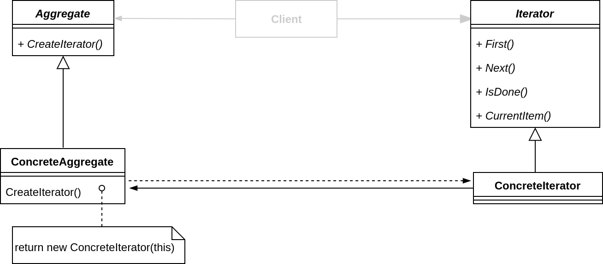

### 要点总结
- 迭代抽象：访问一个聚合对象的内容而无需暴露它的内部表示。
- 迭代多态：为遍历不同的集合结构提供一个同一的接口，从而支持同样的算法在不同的结合结构上进行操作。
- 迭代器的健壮性考虑：遍历的同时更改迭代器所在的集合结构会导致问题。
- 在 C++ 中已经过时，C++ 中使用泛型编程实现迭代器效率更高（运行时 --> 编译时）

### Chain of Responsibility
### 动机
- 在软件构建过程中，一个请求可能被多个对象处理，但是每个请求在运行时只能有一个接收者，如果显式指定，将必不可少地带来请求发送者与接收者的紧耦合
- 如何是请求发送者不需要指定具体的接收者？让请求的接收者自己在运行时决定来处理请求，从而使两者解藕。

### 模式定义
使多个对象都有机会处理请求，从而避免请求的发送者和接收者之间的耦合关系。将这些对象连成一条链，并沿着这条链传递请求，直到有一个对象处理它为止。

### 结构
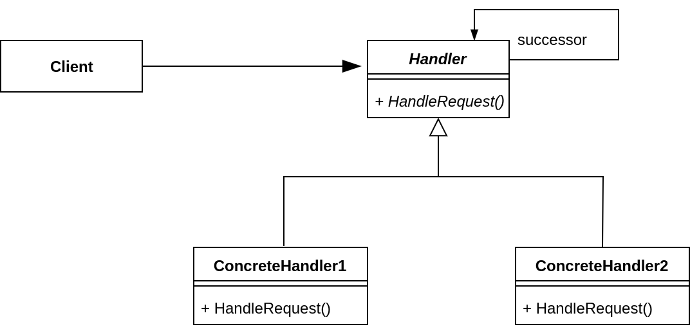

### 要点总结
- Chain-of-Responsibility 模式的应用场合在于“一个请求可能有多个接收者，但是最后真正的接收者只有一个”，这时候请求发送者与接收者的耦合有可能出现“变化脆弱”的症状，职责链的目的就是将二者解藕，从而更好地应对变化。
- 应用了 Chain-of-Responsibility 模式后，对象的职责分派将更具灵活性。我们可以在运行时动态地添加/修改请求的处理职责。
- 如果请求传递到职责链的末尾仍得不到处理，应该有一个合理的缺省机制。这也是每一个接受对象的责任，而不是发出请求的对象的责任。

## Command
### 动机
- 在软件构建过程中，“行为请求者”与“行为实现者”通常呈现一种“紧耦合”。但在某些场合--比如需要对行为进行“记录、撤销/重做（undo/redo）、事务”等处理，这种无法抵御变化的紧耦合是不合适的。
- 在这种情况下，如何将“行为请求者”与“行为实现者”解藕？将一组行为抽象为对象，可以实现二者之间的松耦合。

### 模式定义
将一个请求（行为）封装为一个对象，从而使你可用不同的请求对客户进行参数化；对请求排队或记录请求日志，以及支持可撤销的操作。

### 结构
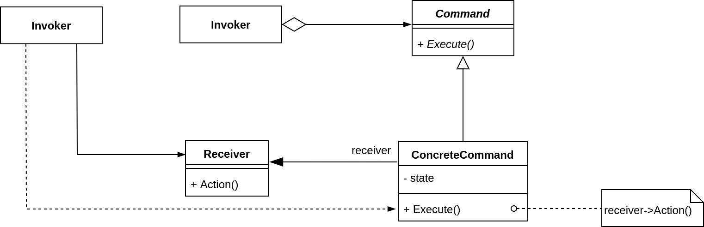

### 要点总结
- Command 模式的根本目的在于将“行为请求者”与“行为实现者”解藕，在面向对象语言中，常见的实现手段是“将行为抽象为对象”。
- 实现 Command 接口的具体命令对象 ConcreteCommand 有时候根据需要可能会保存一些额外的状态信息。通过使用 Composite 模式，可以将多个“命令”封装为一个“复合命令” MacroCammand。
- Command 模式与 C++ 中的函数对象有些类似。但两者定义行为接口的规范有所区别：Command 以面向对象中的“接口-实现”来定义行为规范，更严格，但有性能损失；C++ 函数对象以签名来定义行为接口规范，更灵活，性能更高。

## Visitor
### 动机
- 在软件构建过程中，由于需求的改变，某些类层次结构中常常需要增加新的行为（方法），如果直接在基类中做这样的更改，将会给子类带来很繁重的变更负担，甚至破换原有设计。
- 如何在不更该层次结构的前提下，在运行时根据需要透明地为类层次结构上的各个类动态添加新的操作，从而避免上述问题？

### 模式定义
表示一个作用于某个对象结构中的各元素的操作。使得可以在不改变（稳定）各元素的类的前提下定义（扩展）作用于这些元素的新操作（变化）。

### 结构
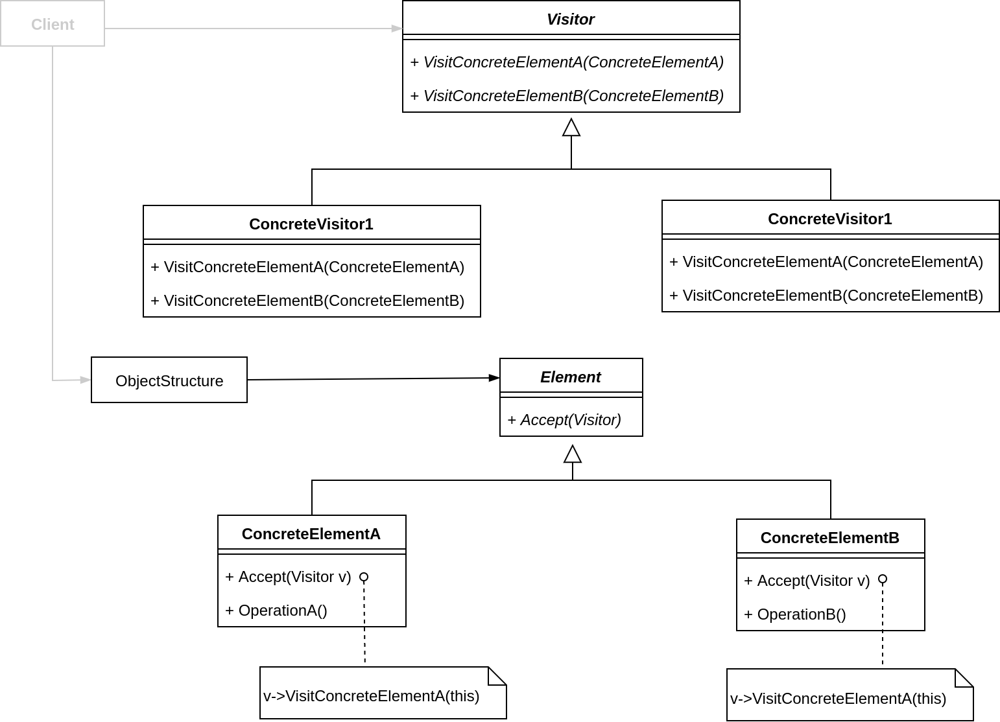

### 要点总结
- Visitor 模式通过所谓双重分发（double dispatch）来实现在不更改（不添加新的操作-编译时）Element 类层次结构的前提下，在运行时透明地为类层次结构上的各个类动态添加新的操作（支持变化）。
- 所谓双重分发，即 Visitor 模式中间包括了两个多态分发（注意其中的多态机制）：第一个为 Accept 方法的多态辨析；第二个为 VisitElementX 方法的多态辨析。
- Visitor 模式的最大缺点在于扩展类层次结构（增添新的 Element 子类），会导致 Visitor 类的改变。因此 Visitor 模式适用于“Element 类层次结构稳定，其中的操作却经常面临频繁改动”的场景。