# 进程间通信（Interprocess Communication，IPC）

## 2、Posix IPC

### 概述
以下三种类型的IPC合称为“Posix IPC”
- Posix消息队列
- Posix信号量
- Posix共享内存

Posix IPC函数

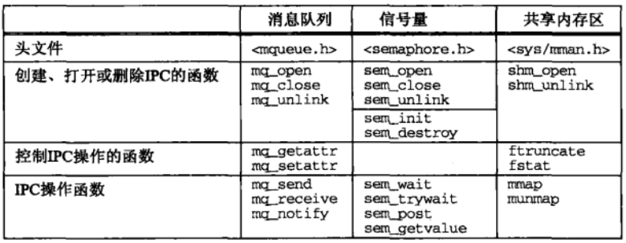

### 创建与打开IPC
- 打开`oflag`参数
 
  

- 创建`mode`参数
 
  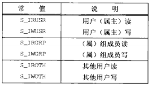

## System V IPC

### 概述
以下三种类型的IPC合称为System V IPC
- System V 消息队列
- System V信号量
- System V共享内存区

System V IPC函数

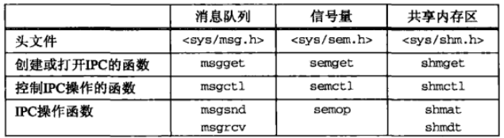

### `key_t`键和`ftok`函数
三种类型的System V IPC使用`key_t`值作为它们的名字
```
#include <sys/ipc.h>
key_t ftok(const char *pathname, int id); // 出错返回-1
```

### 创建与打开IPC
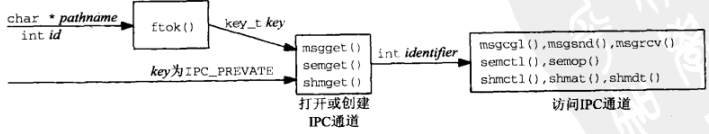

- 调用`ftok`，给它传递pathname和id
- 指定key为`IPC_PRIVATE`，这将保证会创建一个新的、唯一的IPC对象

### IPC权限
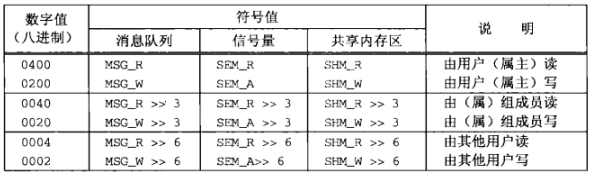

## 4、管道和FIFO

### 管道
所有时样的UNIX都提供管道。由`pipe`函数创建，提供一个单路（单向）数据流
```
#include <unistd.h>
/* @param
 * fd：返回两个文件描述符，fd[0]和fd[1]。前者读，后者写
 * return：成功返回0，失败返回-1
 */
int pipe(int fd[2]);
```
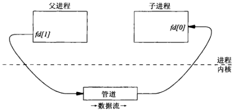

### `popen`和`pclose`函数
标准IO函数库提供了`popen`函数，它创建一个管道并启动另外一个进程，该进程要么从该管道读取标准输入，要么往该管道写入标准输出
```
#include <stdio.h>
/* @param
 * command：shell命令行
 * type："r"（调用进程读取command的标准输出）或"w"（调用进程写到command的标准输入）
 * return：成功返回文件指针，失败返回NULL
 */
FILE *popen(const char *command, const char *type);
int pclose(FILE *stream);
```

### FIFO
管道没有名字，只能用于有一个共同祖先进程的各个进程之间，无法在无亲缘关系的两个进程间创建一个管道并将它用作IPC通道（不考虑描述符传递）

FIFO是单向数据流，每个FIFO有一个路径名与之关联，无亲缘关系的进程可以访问同一个FIFO。FIFO也称为有名管道
```
#include <sys/types.h>
#include <sys/stat.h>
/* @param
 * pathname：路径名，是FIFO名字
 * mode：文件权限，隐含O_CREAT | O_EXCL
 * return：成功0，失败-1
 */
int mkfifo(const char *pathname, mode_t mode);
```

### 管道和FIFO的额外属性
- 调用`open`时可指定`O_NONBLOCK`表示  
`writefd = open(FIFO1, O_WRONLY | O_NONBLOCK);`
- 如果一个描述符已经打开，那么可以调用`fcntl`以启用`O_NONBLOCK`标志   
  ```
  int flags = fcntl(fd, F_GETFL, 0);
  fcntl(fd, F_SETFL, flags | O_NONBLOCK);
  ```

关于管道或FIFO的读出与写入的若个额外规则
- 如果请求读出的数据量多于管道或FIFO中当前可用数据量，那么只返回这些可用的数据
- 如果请求写入的数据的字节数小于或等于`PIPE_BUF`，那么`write`操作保证是原子的
- `O_NONBLOCK`标志的设置对`write`操作的原子性没有影响
- 如果向一个没有为读打开的管道或FIFO写入，那么内核将产生一个`SIGPIPE`信号

### 单个服务器，多个客户
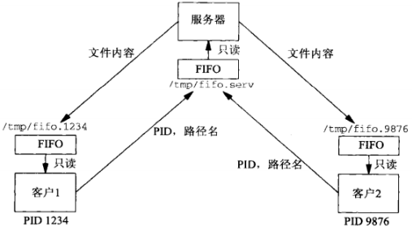

例子`fifo-server.c, file-client.c`

### 管道和FIFO限制
- `OPEN_MAX`：一个进程在任意时刻打开的最大描述符数（Pisix要求至少为16）
- `PIPE_BUF`：可原子地网一个管道或FIFO的最大数据量（posix要求至少为512）

## 5、Posix消息队列

### `mq_open`、`mq_close`和`mq_unlink`函数
```
#include <bits/mqueue.h>
typedef int mqd_t;

struct mq_attr {     /* linux */
  long mq_flags;     /* message queue flags */
  long mq_maxmsg;    /* maximum number of messages */
  long mq_msgszie;   /* maximum message size */
  long mq_curmsgs;   /* number of messages currently queued */
  long __pad[4];
};

#include <fcntl.h>
#include <sys/stat.h>
#include <mqueue.h>
/* @param
 * name：消息队列名字
 * oflag：打开模式，是O_RDONLY、O_WRONLY或O_RDWR之一，可能按位或上O_CREAT、O_EXCL或O_NONBLOCK
 * mode：如果创建，mode值
 * attr：创建消息队列的属性，如果为空指针，使用默认属性
 * return：成功返回消息队列描述符，出错返回-1
 */
mqd_t mq_open(const char *name, int oflag, ...
              /* mode_t mode, struct mq_attr *attr */);

int mq_close(mqd_t mqdes);

/** 删除消息队列
 * @param
 * name: 消息队列
 * return：成功返回0，失败返回-1
 */
int mq_unlink(const char *name);
```

### `mq_getattr`和`mq_setattr`函数
```
#include <mqueue.h>
/* @param
 * mqdes：消息队列的描述符
 * attr：接收属性的mq_attr结构体变量指针
 * return：成功返回0，失败返回-1
 */
int mq_getattr(mqd_t mqdes, struct mq_attr *attr);

/* @param
 * mqdes：消息队列描述符
 * attr：目标属性值（只使用mg_flags的值）
 * oattr：保存原来属性值
 * return：成功返回0，失败返回-1
 */
int mq_setattr(mqd_t mqdes, const struct mq_attr *attr, struct mq_attr *oattr);
```

### `mq_send`和`mq_receive`函数
```
#include <mqueue.h>
/* @param
 * mqdes：消息队列描述符
 * ptr：传送数据地址指针
 * len：传送数据长度
 *    不能小于能加到所指队列中的消息的最大大小，否则返回EMSGSIZE错误
 * prio：传送数据优先级
 *    必须小于MQ_PRIO_MAX, 0表示不使用
 * return：成功返回0，失败返回-1
 */
int mq_send(mqd_t mqdes, const char *ptr, size_t len, unsigned int prio);

/* @param
 * mqdes：消息队列描述符
 * ptr：接收数据地址指针
 * len：传送数据长度
 *    不能小于能加到所指队列中的消息的最大大小，否则返回EMSGSIZE错误
 * prio：传送数据优先级
 *    必须小于MQ_PRIO_MAX，NULL表示不使用
 * return：成功返回传送数据的字节数，出错返回-1
 */
ssize_t mq_receive(mqd_t mqdes, char *ptr, size_t len, unsigned int *priop);
```

### mqueue 客户/服务端例子
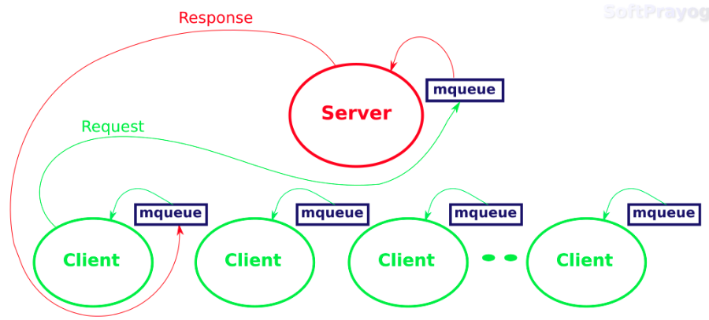

- client: `mqueue_client.c`
- server: `mqueue_server.c`

### 消息队列限制
- `mq_maxmsg`    队列中的最大消息数
- `mq_msgsize`   给定消息的最大字节数
- `MQ_OPEN_MAX`  一个进程能够同时打开的消息队列的最大数目
- `MQ_PRIO_MAX`  任意现已的最大优先级值加1

### `mq_notify`函数
Posix消息队列允许异步事件通知，以告知何时有一个消息放置到了某个空队列消息队列中，这种通知有两种方式供选择
- 产生一个信号
- 创建一个线程来执行一个指定的函数
```
#include <mqueue.h>
/* @param
 * mqdes：消息队列描述符
 * notification：
 * return：成功返回0，失败返回-1
 */
int mq_notify(mqd_t mqdes, const struct sigevent *notification);

#include <signal.h>
union sigval {
  int   sival_int;  /* integet value */
  void *sival_ptr;  /* pointer value */
};
struct sigevent {
  int              sigev_notify;  /* SIGEV_{NONE, SIGNAL, THREAD} */
  int              sigev_signo;   /* signal number if SIGEV_SIGNO */
  union sigval     sigev_value;   /* passed to signal handler or thread */
                                  /* following tow if SIG_THREAD */
  void           (*sigev_notify_function)(union sigval);
  pthread_attr_t  *sigev_notify_attributes
};
note: sigev_notify specifies how notification is to be performed.
    SIGEV_NONE: don't do anything when the event occurs.
    SIGEV_SIGNAL:Notify the process by sending the signal specified in sigev_signo.
    SIGEV_THREAD: Notify the process by invoking sigev_notify_function "as if" it were the start function of a new thread.
```
`mq_notify`函数说明
- 如果`notification`参数不为空，那么当前进程希望有一个消息到达指定的先前为空的队列时得到通知
- 如果`notification`参数为空指针，而且当前进程目前被注册为接收所指定队列的通知，那么已存在的注册将被撤销
- 任意时刻只有一个进程可以被注册为某个队列的通知
- 当有一个消息到达某个先前为空的队列，而且已有一个进程被注册为接收该队列的通知，只有在没有任何线程阻塞在该队列的`mq_receive`调用的前提下，通知才会发出。也就是说，在`mq_receive`调用中的阻塞比任何通知的注册都优先
- 当该通知被发送给它的注册进程时，其注册即被撤销。该进程必须再次调用`mq_notify`重新注册（如果必要）。

### 例子
- 简单的信号通知`mqnotifysig1.c`
  - 当消息放置到某个空对列中，该程序产生一个`SIGUSR1`信号
  - 问题
    - 在信号处理程序中调用`mq_notify`、`mq_receive`和`printf`函数，这些是非异步信号安全函数
- 信号通知`mqnotifysig2.c`
  - 避免从信号处理程序调用任何函数的方法之一是：让处理程序仅仅设置一个全局标志，由某个线程检查该标志以确定何时接受到一个消息。
  - 通过调用`sigsuspend`阻塞，以等待某个消息的到达。当有一个消息被放置到某个空队列中时，该信号产生，主线程被阻止，信号处理程序执行并设置`mqflag`变量，主线程再次执行，发现`mq_flag`为非零，于是读出该消息
  - 问题
    - 考虑一下第一个消息被读出之前有两个消息到达的情形（可以在调用`mq_notify`前调用`sleep`模拟）。这里的基本问题是，通知只是在一个消息没放置到某个空队列上时才发出。如果在能够读出第一个消息前有两个消息到达，那么只有一个通知被发出，只能读出第一个消息，并调用`sigsuspend`等待另一个消息，而对应它的通知可能永远不会发出，在此期间，另一个消息放置于该队列中等待读取，而我们一致忽略它。
- 使用非阻塞`mq_receive`的信号通知`mqnotifysig3.c`
  - 当使用`mq_notify`产生信号时，总是以非阻塞模式读取消息队列
  - 问题
    - 不够高效，处理器处于忙等（轮询查看队列里有没有数据）。
- 使用`sigwait`代替信号处理程序的信号通知`mqnotifysig4.c`
  - 更为简易（并且更为高效）的办法之一是阻塞在某个函数中，仅仅等待该信号的递交，而不是让内核执行一个只为设置一个标志的信号处理程序。`sigwait`提供了这种能力
  ```
  #include <signal.h>
  /* @param
   * set：等待发生的信号集
   * sig：被递交信号的个数
   * return：成功返回0，失败返回正值，设置errno
   */
  int sigwait(const sigset_t *set, int *sig);
  ```
- 使用`select`的Posix消息队列`mqnotifusig5.c`
  - 消息队列描述符（`mqd_t`变量）不是“普通”描述符，它不能用在`select`或`poll`中
  - 可以伴随一个管道和`mq_notify`函数使用他们（在信号处理函数中调用`write`向管道写数据，`select`用来检测管道是否有数据可读）
- 启动线程`mqnotifythread.c`
  - 异步事件通知的另一种方式是把`sig_notify`设置成`SIGEV_THREAD`，这会创建一个新的线程。该线程调用由`sigev_notify_function`指定的函数，所用的参数由`sigev_value`指定。新线程的属性由`sigev_notify_attributes`指定，要是默认属性合适的化，它可以是一个空指针。

### Posix实时信号
信号可以划分为两个大组
- 其值在`SIGRTMIN`和`SIGRTMAX`之间（包括两者）的实时信号。Posix要求至少提供`RTSIG_MAX`这种实时信号，而该常值的最小值为8
- 所有其他信号：`SIGALRM`、`SIGINT`、`SIGKILL`等

接收某个信号的进程的`sigaction`调用中是否指定了新的`SA_SIGINFO`标志会有实时行为差异

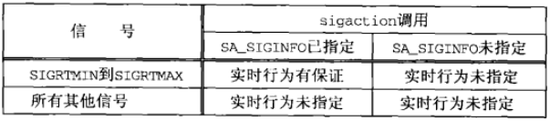

实时行为隐含如下特征
- 信号是排队的。也就是说产生几次，就提交几次。对于不排队的信号来说，产生了三次的某种信号可能只提交一次
- 当有多个`SIGRTMIN`到`SIGRTMAX`范围内的解阻塞信号排队时，值较小的信号先于值较大的信号递交。
- 当某个非实时信号递交时，传递给它的信号处理程序的唯一参数是该信号的值。实时信号比其他信号携带更多的信息。通过设置`SA_SIGINFO`标志（`act.sa_falgs = SA_SIGINFO`）安装的任意实时信号的信号处理函数声明如下：
  ```
  void func(int signo, siginfo_t *info, void *context);

  typedef struct {
    int          si_signo;  /* same value as signo argument */
    int          si_code;   /* SI_{USER, QUEUE, TIMER, ASYNCIO, MESGQ} */
    union sigval si_value;  /* interget or pointer from sender*/
  } siginfo_t;
  /**
   SI_USER：信号由kill函数发出
   SI_QUEUE：信号由sigqueue函数发出
   SI_TIMER：信号由timer_settime函数设置的某个定时器的倒是发生
   SI_ASYNCIO：信号由某个异步IO请求的完成产生
   SI_MESGQ：信号在有一个消息被放置到某个空消息队列中时产生
   */
  ```

例子`rtsignal.c`

### 使用内存映射IO实现Posix消息队列

## 6、System V消息队列

### 概述
System V消息队列使用**消息队列标识符**表示。具有足够特权的进程可以向一个给定队列里读取数据。
```

消息队列结构
#include <sys/msg.h>
struct msqid_ds {
  struct ipc_perm  msg_perm;    /* read_write permissions */
  struct msg      *msg_first;   /* ptr to first message on queue */
  struct msg      *msg_last;    /* ptr to last message on queue */
  msglen_t         msg_cbytes;  /* current # bytes on queue */
  msgqnum_t        msg_qnum;    /* current # of mseeages on queue */
  msglen_t         msg_qbytes;  /* max # of bytes allowed on queue */
  pid_t            msg_lspid;   /* pid of last msgsnd() */
  pid_t            msg_lrpid;   /* pid of last msgrcv() */
  time_t           msg_stime;   /* time of last msgsnd() */
  time_t           msg_rtime;   /* time of last msgrcv() */
  time_t           msg_ctime;   /* time of last msgctl() */
};
```
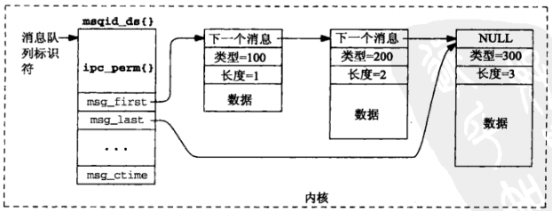

### `msgget`函数
用于创建一个新的消息队列或访问一个已存在的消息队列
```
#include <sys/msg.h>
/* @param 
 * key：既可以是ftok的返回值，也可以是IPC_PRIVATE常值
 * oflag：读写权限值的组合
 * return：成功返回非负标识符，失败返回-1
 */
int msgget(key_t key, int oflag);
```

当创建一个新消息队列时，`msdid_ds`结构的如下成员被初始化：
- `msg_perm`结构的`uid`和`cuid`成员被设置成当前进程的有效用户ID，`gid`和`cgid`成员被设置为当前进程的有效组ID
- `oflag`的读写权限位存放在`msg_perm.mode`中
- `msg_qnum`、`msg_lspid`、`msg_lrpid`、`msg_stime`和`msg_rtime`被设置为0
- `msg_ctime`被设置成当前时间
- `msg_qbytes`被设置成系统限制值

### `msgsnd`函数
```
#include <sys/msg.h>
/* @param
 * msqid：标识符
 * ptr：struct msgbuf结构指针
 * length：消息长度，字节数
 * flag：既可以是0，也可以是IPC_NOWIAT（非阻塞）
 * return：成功返回0，失败返回-1
 */
int msgsnd(int msqid, const void *ptr, size_t length, int flag);

struct msgbuf {
  long mtype;    /* message type, must be > 0 */
  char mtext[1]; /* message data */
};
```

### `msgrcv`函数
```
#include <sys/msg.h>
/* @param
 * msqid：标识符
 * ptr：接收消息的存放位置
 * length：ptr指向的缓冲区中数据部分的大小
 * type：指定希望从给定的队列中读出什么样的消息
 *    0：返回队列中的第一个消息
 *    >0：返回其类型值为type的第一个消息
 *    <0：返回其类型值小于或等于type参数的结对值的消息中类型值最小的第一个消息
 * flag：指定所请求的消息不在所指定的队列中时该做如何处理
 *    0：阻塞，直到下列某个事件发生为止：
 *        （1）有一个所请求类型的消息可读
 *        （2）由msqid标识的消息队列从系统删除（此时返回EIDRM错误）
 *        （3）调用线程被某个捕获的信号所中断（此时返回EINTR错误）
 *    IPC_NOWAIT：立即返回一个ENOMSG错误
 *    MSG_NOERROR：消息大于length时直接截断（没有设置就返回E2BIG错误）
 * return：成功返回读取的字节数，是否返回-1
 */
ssize_t msgrcv(int msqid, void *ptr, size_t length, long type, int flag);
```

### `msgctl`函数
```
#include <sys/msg.h>
/* @param
 * msqid：标识符
 * cmd：控制操作命令
 * buff：值-结果传递
 * return：成功返回0，出错返回-1
 */
int msgctl(int msqid, int cmd, struct msqid_ds *buff);
```
`msgctl`函数提供3个命令
- IPC_RMID：从系统中删除由mqsid指定的消息队列。当前在该队列上的任何消息都被丢弃，第三个参数被忽略
- IPC_SET：给指定的消息队列设置其msgid_ds结构的以下4个成员`msg_perm.uid`、`msg_perm.gid`、`msg_perm.mode`和`msg_qbytes`。它们的值来自有`buff`参数指向的结构中的相应成员
- IPC_STAT：（通过`buff`参数）给调用者返回当前`msqid_ds`结构
  
### 复用消息
与一个队列中的每个消息相关联的类型字段`msgbuf.mtype`提供了两个特性
- 类型字段可用于标识消息，从而允许多个进程在单个队列上复用消息
- 类型字段可用作优先级字段
  
例子：每个应用一个队列

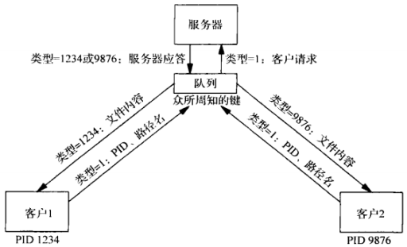

例子：每个客户一个队列

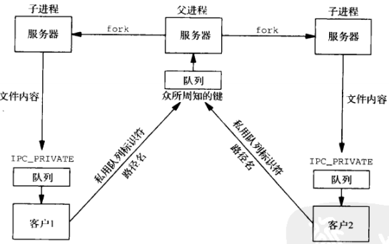

### 消息队列的限制
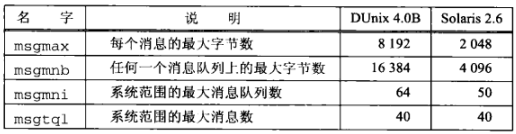

## 7、互斥锁和条件变量

### 互斥锁：上锁与解锁
互斥锁指代相互排斥，用于保护临界区，以保证任何时刻只有一个线程（或进程）在执行其中的代码。
```
#include <pthread.h>
// 均返回：成功0，失败返回正数Exxx值
int pthread_mutex_lock(pthread_mutex_t *mptr);
int pthread_mutex_trylock(pthread_mutex_t *mptr);
int pthread_mutex_unlock(pthread_mutex_t *mptr);
```
如果尝试给一个已由某个线程锁住的互斥锁上锁，那么`pthread_mutex_lock`将阻塞到该互斥锁解锁为止。`pthread_mutex_trylock`是对应的非阻塞函数，如果该互斥锁已锁住，它就返回`EBUSY`错误。

如果互斥锁变量是静态分配的，那么可以把它初始化成常值`PTHREAD_MUTEX_INITIALIZER`。如果是动态分配的（例如调用`malloc`），必须在运行时之前调用`pthread_mutex_init`函数初始化

### 生产者和消费者问题`mutex_prodcons1.c`
生产者产生所有数据之后，消费者开始启动

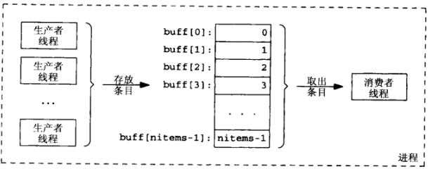

### 对比上锁与等待`mutex_prodcons2.c`
生产者和消费者并发执行，采用轮询的方式查看某个数据是否有生产者生成

### 条件变量：等待与信号发送`mutex_prodcons3.c`
条件变量用于等待。每个条件变量总是有一个互斥锁与之关联。

如果条件变量是静态分配的，那么可以把它初始化成常值`PTHREAD_COND_INITIALIZER`，如果是动态分配的（例如调用`malloc`），必须在运行时之前调用`pthread_cond_init`函数初始化
```
#include <pthread.h>
/* @brief
 * 会先解除*mptr，然后阻塞在等待对列里，直到再次被唤醒。唤醒后，该进程会先锁定*mptr，再读取资源
 * @param
 * cptr：条件变量指针
 * mptr：互斥锁指针
 * return：成功返回0，失败返回为正的Exxx值
 */
int pthread_cond_wait(pthread_cond_t *cptr, pthread_mutex_t *mptr);

/* @param
 * cptr：条件变量指针
 * return：成功返回0，失败返回为正的Exxx值
 */
int pthread_cond_signal(pthread_cond_t *cptr);
```
总的来说，给条件变量发送信号的代码大体如下：
```
struct {
  pthread_mutex_t mutex;
  pthread_cond_t cond;
  whatever variables maintain the condition
} var = { PTHREAD_MUTEX_INITIALIZER, PTHREAD_COND_INITIALIZER, ... };

pthread_mutex_lock(&var.mutex);
set condition true;
pthread_cond_signal(&val.cond); // 上锁冲突，即使唤醒，不能获取var.mutex，不能运行
pthread_mutex_unlock(&var.mutex);
```
测试条件并进入睡眠以等待该条件变为真的代码如下：
```
pthread_mutex_lock(&var.mutex);
while(condtion is false)
  pthread_cond_wait(&var.cond, &var.mutex); // 先解除mutex，让权等待
modify condition;
pthread_mutex_unlock(&var.mutex);
```
避免上锁冲突
```
int dosignal;
pthread_mutex_lock(&nready.mutex);
dosignal = (nready.nready == 0);
nready.nready++;
pthread_mutex_unlock(&nready.mutex);

if(dosignal)
  pthread_cond_signal(&nready.cond);
```

### 条件变量：定时等待和广播
通常`pthread_cond_signal`只唤醒等待在相应条件变量上的一个线程。在某些情况下一个线程认定有多个其他线程应被唤醒，这时可调用`pthread_cond_broadcast`唤醒阻塞在相应条件变量上的所有线程。
```
#include <pthread.h>
/* @param
 * cptr：条件变量
 * return：成功返回0，失败返回为正的Exxx值
 */
int pthread_cond_broadcast(pthread_cond_t *cptr);

/* @param
 * cptr：条件变量
 * mptr：互斥变量
 * abstime：绝对时间，子UTC时间1970年1月1日以来流逝的秒数和纳秒数
 * return：成功返回0，失败返回为正的Exxx值
 */
int pthread_cond_timedwait(pthread_cond_t *cptr, pthread_mutex_t *mptr, const struct timespec *abstime);

struct timespect {
  time_t tv_sec;  /* seconds */
  long   tv_nsec; /* nanoseconds */
}
```

### 互斥锁和条件变量的属性
互斥锁和条件变量是用以下函数初始化或摧毁的
```
#include <pthread.h>
/** 
 * mptr和cptr必须指向已分配的pthread_mutex_t或pthread_cond_t变量
 * attr指向属性变量，如果为NULL，使用默认属性
 * 均返回：成功返回0，失败返回为正的Exxx值
 */
int pthread_mutex_init(pthread_mutex_t *mptr, const pthread_mutextattr_t *attr);
int pthread_mutex_destroy(pthread_mutex_t *mptr);
int pthread_cond_init(pthread_cond_t *cptr, const pthread_condarrt_t *attr);
int pthread_cond_destroy(pthread_cond_t *cptr);
```
互斥锁属性的数据类型为`pthread_mutexattr_t`，条件变量属性的数据类型为`pthread_condattr_t`，它们由以下函数初始化或摧毁
```
#include <pthread.h>
/**
* 均返回：成功返回0，失败返回为正的Exxx值
*/
int pthread_mutexattr_init(pthread_mutexattr_t *attr);
int pthread_mutexattr_destroy(pthread_mutexattr_t *attr);
int pthread_condattr_init(pthread_condattr_t *attr);
int pthread_condattr_destroy(pthread_condattr_t *attr);
```
一旦某个互斥锁属性对象或某个条件变量属性对象被初始化，就通过调用不同函数启用或禁止特定的属性。举例来说，我们将在以后各章中使用的一个属性是：指定互斥锁或条件变量在不同进程间共享，而不是只在单个进程内的不同线程间共享。这个属性是用以下函数取得或存入的
```
#include <pthread.h>
/**
* value的值可以是
*     PTHREAD_PROCESS_PRIVATE：进程的线程间共享
*     PTHREAD_PROCESS_SHARED：进程间共享
* 均返回：成功返回0，失败返回为正的Exxx值
*/
int pthread_mutexattr_getpshared(const pthread_mutexattr_t *attr, int *valptr);
int pthread_mutexattr_setpshared(const pthread_mutexattr_t *attr, int value);
int pthread_condattr_getpshared(const pthread_condattr_t *attr, int *valptr);
int pthread_condattr_setpshared(const pthread_condattr_t *attr, int value);
```

### 持有锁期间进程终止
- 进程终止时系统不会自动释放持有的互斥锁、读写锁和Posix信号量，进程终止时内核总是自动清理的唯一同步锁类型是`fcntl`记录锁。使用System V信号量时，应用程序可以选择进程终止时内核是否自动清理某个信号量锁
- 一个线程也可以在持有某个互斥锁期间终止，自己调用`pthread_exit`或被另一个线程取消。如果线程调用`pthread_exit`资源终止时，这时它应该知道自己还持有一个互斥锁(对于程序员来说)，如果是被另一个线程取消的情况，线程可以安装清除处理程序(`pthread_cleanup_push`)，在被取消时调用来释放相应的锁。
- 对于线程意外操作导致进程终止的情况，就和进程终止时相同。

## 8、读写锁

### 概述
读写锁分配规则
- 只要没有线程持有某个给定的读写锁用于写，那么任意数目的线程可以持有该读写锁用于读
- 仅当没有线程持有某个给定的读写锁用于读或用于写时，才能分配该读写锁用于写

某些应用中读数据比修改数据频繁，这些应用可以从改用读写锁代替互斥锁中获益

### 获取与释放读写锁
读写锁的数据类型为`pthread_rwlock_t`。如果这个类型的某个变量是静态分配的，那么可以通过给它赋常值`PTHREAD_RWLOCK_INITIALIZER`来初始化它
```
#include <pthread.h>
/**
 * pthread_rwlock_rdlock获取一个读出锁，如果锁被某个写入者持有，
                        就阻塞调用线程
 * pthread_rwlock_wrlock获取一个写入锁，如果锁被某个写入者持有，
                        或者由一个或多个读出者持有就阻塞调用线程
 * pthread_rwlock_unlock是否一个读出锁或写入锁
 * 均返回：成功返回0，失败返回为正的Exxx值
 */
int pthread_rwlock_rdlock(pthread_rwlock_t *rwptr);
int pthread_rwlock_wrlock(pthread_rwlock_t *rwptr);
int pthread_rwlock_unlock(pthread_rwlock_t *rwptr);
```
下面两个函数尝试获取一个读出锁或写入锁，但是如果该锁不能马上取得，那么就返回`一个EBUSY`错误
```
#include <pthread.h>
/* 均返回：成功返回0，失败返回为正的Exxx值 */
int pthread_rwlock_tryrdlock(pthread_rwlock_t *rwptr);
int pthread_rwlock_trywrlock(pthread_rwlock_t *rwptr);
```

### 读写锁属性
可以通过给静态分配的读写锁赋常值`PTHREAD_RWLOCK_INITIALIZER`来初始化它。读写锁也可以通过调用`pthread_rwlock_init`来动态初始化。当一个线程不再需要某个读写锁时，可以调用`pthread_rwlock_destroy`摧毁它
```
#include <pthread.h>
/** 
 * rwptr必须指向已分配的pthread_rwlock_t变量
 * attr指向属性变量，如果为NULL，使用默认属性
 * 均返回：成功返回0，失败返回为正的Exxx值
 */
int pthread_rwlock_init(pthread_rwlock_t *rwptr, const pthread_rwlockattr_t *attr);
int pthread_rwlock_destroy(pthread_rwlock_t *rwptr);


```
数据类型为`pthread_rwlockarrt_t`的某个属性对象一旦初始化，就通过调用不同的函数来启动或禁止特定属性。
```
#include <pthread.h>
/**
* value的值可以是
*     PTHREAD_PROCESS_PRIVATE：进程的线程间共享
*     PTHREAD_PROCESS_SHARED：进程间共享
* 均返回：成功返回0，失败返回为正的Exxx值
*/
int pthread_rwlockattr_getpshared(const pthread_rwlockattr_t *attr, int *valptr);
int pthread_rwlockattr_setpshared(pthread_rwlockattr_t *attr, int value);
```

### 使用互斥锁和条件变量实现读写锁

### 线程取消
通过对方调用函数`pthread_cancel`，一个线程可以被同一进程内的任何其他线程所取消
```
#include <pthread.h>
/**
 * function sends a cancellation request to the thread thread. 
 * Whether and when the target thread reacts to the cancellation
 * request depends on two attributes that are under the control
 * of that thread: its cancelability state and type.
 *
 * A thread's cancelability state, determined by pthread_setcancelstate, 
 * can be enabled (the default for new threads) or disabled. 
 *
 * A thread's cancellation type, determined by pthread_setcanceltype,
 * may be either asynchronous or deferred (the default for new threads).
 */
int pthread_cancel(pthread_t tid); /* 成功返回0，失败返回为正的Exxx值 */

/* @param
 * state：可能的值
 *    PTHREAD_CANCEL_ENBALE：默认，响应取消请求
 *    PTHREAD_CANCEL_DISABLE：阻塞取消请求，直到可以取消
 * oldstate：返回旧状态
 * return：成功返回0，失败返回为正的Exxx值
 */
int pthread_setcancelstate(int state, int *oldstate);

/* @param
 * type：可能的值
 *    PTHREAD_CANCEL_DEFERRED：默认类型，取消请求被推迟，直到线程接下来调用作为取消点的函数
 *    PTHREAD_CANCEL_ASYNCHRONOUS：线程可以随时取消（通常，它会在收到取消请求后立即取消，但系统不保证这一点。）
 * oldtype：返回旧的类型
 * return：成功返回0，失败返回为正的Exxx值
 */
int pthread_setcanceltype(int type, int *oldtype);
```
为了处理被取消的可能情况，任何线程可以安装（压入）和删除（弹出）清理程序
```
#include <pthread.h>
/* @param
 * function：线程被取消时调用函数的地址
 * arg：function所指函数的单个参数
 */
void pthread_cleanup_push(void (*function)(void *), void *arg);

/* @param
 * 总是删除调用线程的取消清理栈中位于栈顶的函数，而且如果execute不为0，那就调用该函数
 */
void pthread_cleanup_pop(int execute);
```

例子

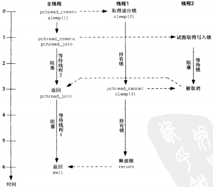

## 9、记录上锁

### 概述
记录上锁（record locking）是读写锁的一致扩展类型，它可用于具有亲缘关系或无亲缘关系的进程之间共享某个文件的读与写。被锁住的文件通过其描述符访问，执行上锁操作的函数是`fcntl`。这种类型的锁通常在内核中维护，其属主是由属主的进程ID表示的。这意味这这些锁用于不同进程间的上锁，而不是用于同一进程内不同线程间的上锁

### 对比记录上锁与文件上锁
Posix记录上锁定义了一个特殊的字节范围以指定整个文件，它的起始偏移为0（文件的开头），长度也为0。

术语粒度用于标记能被锁住的对象的大小。对于Posix记录上锁来说，粒度就是单个字节。通常情况下粒度越小，允许同时使用的用户数就越多。

### Posix `fcntl`记录上锁
```
#include <fcntl.h>
/* @param
 * fd：描述符
 * cmd：命令（F_SETLK、F_SETLKW、F_GETLK）
 * return：出错返回-1，成功返回值取决于cmd
 */
int fcntl(int fd, int cmd, .../*struct flock *arg*/);
```
用于记录上锁的cmd参数共有三个值，这三个命令要求第三个参数arg指向某个`flock`结构的指针
```
struct flock {
  short l_type;   /* F_RDLCK, F_WRLCK, F_UNLCK */
  short l_whence; /* SEEK_SET, SEEK_CUR, SEEK_END */
  off_t l_start;  /* relative starting offset in bytes */
  off_t l_len;    /* #bytes; 0 means until end-of-file */
  pid_t l_pid;    /* PID retureend by F_GETLK */
};
```
三个命令如下：
- `F_SETLK`：获取（`l_type`成员为`F_RDLCK`或`F_WRLCK`）或释放（`l_type`成员为`F_UNLCK`）由`arg`指向的`flock`结构所描述的锁。如果无法将该锁授予调用进程，该函数就立即返回一个`EACESS`或`EAGAIN`错误而不阻塞
- `F_SETLKW`：该命令与上一个命令类似，不过如果无法将所请求的锁授予调用进程，调用进程将阻塞到该锁能够授予为止
- `F_GETLK`：检查有`arg`指向的锁以确定是否有某个已存在的锁会妨碍将新锁授予调用进程。如果当前没有这样的锁存在，有`arg`指向的`flock`结构的`l_type`成员被设置为`F_UNLCK`。否则，关于这个已存在锁的信息将在由`arg`指向的`flock`结构中返回（该结构内容由`fcntl`函数覆写），其中包括持有该锁的进程的PID

提供`F_GETLK`命令的原因在于：当执行`F_SETLK`命令的`fcntl`函数返回一个错误时，导致该错误的某个锁的信息可由`F_GETLK`命令返回，从而允许我们确定是哪个进程锁住类所请求的文件区以及上锁方式（读出锁或写入锁）。但是即使是这样的情形，`F_SETLK`命令也可能返回该文件区已解锁的信息，因为在`F_SETLK`和`F_GETLK`命令之间，该文件区可能被解锁。

`flock`结构描述锁的类型（读出锁或写入锁）以及待锁住的字节范围。起始字节偏移是作为一个相对偏移（`l_start`成员）伴随其解释（`l_whence`成员）指定的。`l_whence`成员有以下三个取值：
- `SEEK_SET`：`l_start`相对于文件的开头解释
- `SEEK_CUR`：`l_start`相对文件的当前字节偏移（当前读写指针位置）解释
- `SEEK_END`：`l_start`相对于文件的末尾解释

`l_len`成员指定从该偏移开始的连续字节数。长度为0意思是“从起始偏移到文件偏移的最大可能值”

`fcntl`记录上锁既可以用于读也可以用于写，对于一个文件的任意字节，最多只能存在一种类型的锁（读入锁或写入锁）。而且，一个给定字节可以有多个读出锁，但只能有一个写入锁。

对于一个打开着某个文件的给定进程来说，当它关闭该文件的所有描述符或它本身终止时，与该文件关联的所有锁都被删除。锁不能通过`fork`由子进程继承

记录上锁不应该同标准IO函数库一块使用，因为该函数库会执行内部缓冲。当某个文件需上锁时，为避免问题，应对它使用`read`和`write`

### 劝告性上锁
Posix记录上锁称为劝告性上锁。其含义是内核维护着已由各个进程上锁的所有文件的正确信息，但是它不能防止一个进程写已由另一个进程读锁定的某个文件。类似地，它也不能防止一个进程读已由另一个进程写锁定的某个文件。一个进程能够无视一个劝告性锁而写一个读锁定文件，或者读一个写锁定文件，前提是该进程有读或写该文件的足够权限

劝告性锁对于协作进程是足够了

### 强制性上锁
使用强制性锁后，内核检查每个`read`和`write`请求，以验证其操作不会干扰由某个进程持有的某个锁。对于通常的阻塞式描述符，与某个强制性锁冲突的`read`或`write`将把调用进程投入睡眠，直到该锁释放为止。对于非阻塞式描述符，与某个强制性锁冲突的`read`或`write`将导致它们返回一个`EAGAIN`错误

### 启动一个守护进程的唯一副本
记录上锁的一个常见用途是确保某个程序（例如守护程序）在任何时刻只有一个副本在运行

### 文件作锁用
Posix.1保证，如果以`O_CREAT`（若文件不存在则创建它）和`O_EXCL`（独占打开）标志调用`open`函数，那么一旦该文件已经存在，该函数就返回一个错误。而且考虑到其他进程的存在，检查该文件是否存在和创建该文件必须是原子的。因此，我们可以把以这种技巧创建的文件作为锁使用。Posix.1保证任何时候只有一个进程能够创建这样的文件（也就是获取锁），释放这样的锁只需要`unlink`该文件。

这种技巧存在以下三个问题
1. 如果当前持有该锁的进程没有释放它就终止，那么其文件名并未删除。（可以更具最近访问时间，大于一定时间未曾访问，就假设它已被遗忘）
2. 如果另外某个进程已打开类锁文件，那么当前进程只能轮询调用`open`。（可以`sleep`1秒）
3. 调用`open`和`unlink`创建和删除一个额外的文件涉及文件系统的访问，这通常比调用`fcntl`两次（获取和释放）锁花时间长得多

## 10、Posix信号量

### 概述
信号量是一种用于提供不同进程间或一个给定进程的不同线程间同步手段的原语

一个进程可以在某个信号量上执行的三种操作
- 创建一个信号量。这还要求调用者指定初始值。
- 等待一个信号量。该操作会测试这个信号量的值，如果其值小于或等于0，那就等待（阻塞），一旦其值变为大于0就将它减1
  ```
  while (semaphore_value <= 0); /* wait, block the thread or process*/
  semaphore_value--;
  /* we have the semaphore */
  ```
- 挂出一个信号量。该操作将信号量的值加1，如果有一些进程阻塞着等待该信号量的值变为大于0，其中一个进程现在就可能被唤醒。

### `sem_open`、`sem_close`和`sem_unlink`函数
函数`sem_open`创建一个新的具名信号量或打开一个已存在的具名信号量。具名信号量总是即可用于线程间同步，又可用于进程间的同步
```
#include <semaphore.h>
/* @param
 * name：信号量名字
 * oflag：打开方式
 * return：成功返回指向信号量的指针，失败返回SEM_FAILED
 */
sem_t *sem_open(const char *name, int oflag, ...
          /* mode_t mode, unsigned int value*/);
```
`ofalg`参数可以是`0`、`O_CREAT`或`O_CREAT | O_EXCL`。如果指定了`O_CREATE`标志，那么第三个和第四个参数是需要的：其中`mode`参数指定权限位，`value`参数指定信号量的初始值，该初始值不能超过`SEM_VALUE_MAX`（必须至少为32767）。

如果指定了`O_CREAT`（而没有指定`O_EXCL`），那么只有当所需信号量尚未存在时才初始化它。

使用`sem_open`打开的具名信号量，使用`sem_close`将其关闭
```
#include <semaphore.h>
/* @param
 * sem：要关闭具名信号量的指针
 * return：成功返回0，失败返回-1
 */
int sem_close(sem_t *sem);
```
一个进程终止时，内核还对其上仍然打开着的所有具名信号**自动执行**这样的信号关闭操作。不论该进程是自愿终止的还是非自愿终止的，这种自动关闭都会发生。

关闭一个信号量并没有将它从系统中删除。这就是说，Posix有名信号量至少是随内核持续的：即使当前没有进程打开着某个信号量，它的值仍然保持。具名信号量使用`sem_unlink`从系统中删除
```
#include <semaphore.h>
int sem_unlink(const char *name); /* 成功返回0，失败返回-1*/
```
每个信号量有个引用计数记录当前的打开次数（就像文件一样），`sem_unlink`类似于文件IO的`unlink`函数：当引用计数还是大于0时，name就能从文件系统中删除，然而其信号量的析构（不同于将它的名字从文件系统中删除）却要等到最后一个`sem_close`发生为止。

### `sem_wait`和`sem_trywait`函数
`sem_wait`函数测试所指定信号量的值，如果该值大于0，那就将它减1并立即返回。如果该值等于0，调用线程就被投入睡眠中，直到该值变为大于0，这时再将它减1，函数随后返回。”测试并减1“操作是原子的
```
#include <semaphore.h>
int sem_wait(sem_t *sem);
int sem_trywait(sem_t *sem);
int sem_timedwait(sem_t *sem, const struct timespec *abs_timeout);
/* 均返回：成功返回0，失败返回-1，并设置errno */
```
`sem_wait`和`sem_trywait`的差别是：当所指定信号量的值已经是0时，后者并不将调用线程投入睡眠（阻塞），而是返回一个`EAGAIN`错误。`sem_timedwait`指定了阻塞的时间限制

如果被某个信号中断，`sem_wait`就可能过早地返回，所返回的错误为`EINTR`

### `sem_post`和`sem_getvalue`函数
当一个线程使用完某个信号量时，它应该调用`sem_post`，本函数把所指定信号量的值加1，然后唤醒正在等待该信号量变为正数的任意线程
```
#include <semaphore.h>
int sem_post(sem_t *sem);
int sem_getvalue(sem_t *sem, int *valp);
/* 均返回：成功返回0，失败返回-1，并设置errno */
```
`sem_getvalue`在由`valp`指向的整数中返回所指定信号量的当前值。如果该信号量当前已上锁，那么返回值或为0，或为某个负数，其绝对值就是等待该信号量解锁的线程数。

### 互斥锁、条件变量和信号量之间的差别
1. 互斥锁必须总是由给它上锁的线程解锁，信号量没有这种限制：一个线程可以等待某个给定信号量，而另一个线程可以挂出该信号量。
2. 每个信号量有一个与之关联的值，它由挂出操作加1，由等待操作减1，那么任何线程都可以挂出一个信号，即使当时没有线程在等待该信号量值变为正数也没有关系。然而，如果某个线程调用了`pthread_cond_signal`，不过当时没有任何线程阻塞在`pthread_cond_wait`调用中，那么发往相应条件变量的信号将丢失
3. 在各种各样的同步技巧（互斥锁、条件变量、读写锁、信号量）中，能够从信号处理中安全调用的唯一函数是`sem_post`。

### `sem_init`和`sem_destroy`函数
Posix也提供**基于内存**的信号量，他们由应用程序分配信号量的内存空间（也就是分配一个`sem_t`数据类型的内存空间），然后（调用`sem_init`）由系统初始化它们的值。使用完，调用`sem_destroy`摧毁它
```
#include <semaphore.h>
/* @param
 * sem：指向一个已分配的sem_t变量
 * shared：如果为0，同一进程的不同线程共享。否则在进程间共享（此时信号量必须放在某种类型的共享内存区中）
 * value：初始化值
 * return：成功返回0，失败返回-1
 */
int sem_init(sem_t *sem, int shared, unsigned int value);

int sem_destroy(sem_t *sem); /* 成功返回0，失败返回-1 */
```

信号量真正的持续性却取决于存放信号量的内存区的类型。只要含有某个基于内存信号量的内存区域保持有效，该信号量就一直存在。
- 如果某个基于内存的信号量是由单个进程内的各个线程共享的，那么该信号量具有随进程的持续性，当该进程终止时它也消失。
- 如果某个基于内存的信号量是在不同进程间共享的，那么该信号量必须存放在共享内存区中，因而只要该共享内存区仍然存在，该信号量也就继续存在。

### 进程间共享信号量
进程间共享基于内存信号量的规则很简单：信号量本身（其地址作为`sem_init`第一个参素的`sem_t`数据类型变量）必须驻留在由所希望共享它的进程所共享的内存中，而且`sem_init`的第二个参数必须为1。

具名信号量，不同进程通过名字即可共享

### 信号量限制
- `SEM_NSEMS_MAX`：一个进程可同时打开着的最大信号量数（Posix要求至少为256）
- `SEM_VALUE_MAX`：一个信号量的最大值（Posix要求至少为32767）

## 11、System V 信号量

### 概述
- 二值信号量
- 计数信号量
- 计数信号量集

当我们在谈论“System V 信号量”时，所指的是计数信号量集，当我们在谈论“Posix信号量”时，所指的是单个计数信号量。

对于系统中的每个信号量集，内核维护一个如下的信息结构
```
#include <sys/sem.h>
struct semid_ds {
  struct ipc_perm  sem_perm;  /* operation permission struct */
  struct sem      *sem_base;  /* ptr to array of semaphores in set */
  ushort           sem_nsems; /* # of semaphores in set */
  time_t           sem_otime; /* time of last semop() */
  time_t           sem_ctime; /* time of creation or last IPC_SET */
};
struct sem {
  ushort           semval;    /* semaphore value, nonnegative */
  short            sempid;    /* PID of last sucessful semop() SETVAL, SETALL */
  ushort_t         semncnt;   /* # awaiting semval > current value */
  ushort_t         semzcnt;   /* # awaiting semval = 0 */
};
```

### `semget`函数
`semget`函数创建一个信号量集或访问一个已存在的信号量集
```
#include <sys/sem.h>
/* @param
 * key：ftok返回的值
 * nsems：指定集合中的信号量数。如果只是访问，指定为0
 * oflag：权限位
 * return：成功则返回为非负标识符，出错则返回-1
 */
int semget(key_t key, int nsems, int oflag);
```
`oflag`值是`SEM_R`和`SEM_A`常值的组合。其中`R`代表读（read），`A`代表改变（alter）。它们还可以与`IPC_CREAT`或`IPC_CREAT | IPC_EXCL`按位或

当实际操作为创建一个新的信号量集时，相应的`semid_ds`结构的以下成员被初始化
- `sem_perm`结构的`uid`和`cuid`成员被置为调用进程的有效用户ID，`gip`和`cgid`成员被置为调用进程的有效组ID
- `oflag`参数中的读写权限位存入`sem_perm.mode`
- `sem_otime`被置0，`sem_otime`则被置为当前时间
- `sem_nsems`被设置为`nsems`参数的值
- 与该集合中每个信号量关联的各个`sem`结构并不初始化，这些结构是在一`SETVAL`或`SETALL`命令调用`semctl`时初始化的

### `semop`函数
使用`semget`函数打开一个信号量集后，对其中一个或多个信号量的操作就是用`semop`函数来执行
```
#include <sys/sem.h>
/* @param
 * semid：标识符，semget返回
 * opsptr：指向sembuf结构数组的指针
 * nops：sembuf结构数组长度
 * return：成功返回0，失败返回-1
 */
int semop(int semid, struct sembuf *opsptr, size_t nops);

struct sembuf {
  short sem_num; /* semaphore number: 0, 1, ... nsems-1 */
  short sem_op;  /* semaphore opeartion <0, 0, >0 */
  short sem_flg; /* operation flags: 0, IPC_NOWAIT, SEM_UNDO */
};
```
由内核保证传递给`semop`函数的操作数组（opsptr）被原子地执行。

`semop`的操作
- 如果`sem_op`是正数，其值就加到`semval`上，这对应于释放由某个信号量控制的资源。如果指定了`SEM_UNDO`标志，那就从相应信号量的`semadj`（由内核为在其某个信号量操作中指定了`SEM_UNDO`标志的各个进程维护，不必存在名为`semadj`的结构成员）中减掉`sem_op`的值。
- 如果`sem_op`是0，那么调用者希望等待到`semval`变为0。如果`semval`已经是0，那就立即返回。如果`semval`不为0，相应信号量的`semzcnt`值就加1，调用线程则被阻塞到`semval`变为0（到那时，相应信号量的`semzcnt`值再减1）；如果某个被捕获的信号中断了引起睡眠的`semop`函数，或者相应的信号量被删除了，那么该函数将过早地返回一个错误。如果指定了`IPC_NOWAIT`标志，调用线程就不会被阻塞，不能完成就返回`EAGAIN`错误。
- 如果`sem_op`是负数，那么调用者希望等待`semval`变为大于或等于`sem_op`的绝对值。这对应于分配资源。如果`semval`大于或等于`sem_op`的绝对值，那就从`semval`中减掉`sem_op`的绝对值。如果指定了`SEM_UNDO`标志，那么`sem_op`的绝对值就加到相应信号量的`semadj`上。如果`semval`小于`sem_op`的绝对值，相应信号量的`semncnt`值就加1，调用线程被阻塞到`semval`变为大于或等于`sem_op`的绝对值。到那时该线程被阻塞，还将从`semval`中减掉`sem_op`的绝对值，相应信号量的`semncnt`值将减1。如果指定了`SEM_UNDO`标志，那么`sem_op`的绝对值就加到相应信号量的`semadj`上。如果指定了`IPC_NOWAIT`标志，调用线程就不会被阻塞，不能完成就返回`EAGAIN`错误。或者如果某个被捕获的信号中断了引起睡眠的`semop`函数，或者相应的信号量被删除了，那么该函数将过早地返回一个错误。

### `semctl`函数
```
#include <sys/sem.h>
/* @param
 * semid：标识其操作待控制的信号量集
 * semnum：表示该信号量集内的某个成员（0, 1, ..., nsems-1）
 * cmd：命令
 * return：成功返回非负值（根据命令不同），出错返回-1
 * arg：可选参数，取决与第三个参数cmd
 */
int semctl(int semid, int semnum, int cmd, ... /* union semun arg*/);

union semun { // 必须由应用程序声明
  int              val;   /* used for SETVAL only */  
  struct semid_ds *buf;   /* used for IPC_SET and IPC_STAT */
  ushort          *array; /* used for GETALL and SETALL */
}
```
System V支持下列`cmd`值，除非另外声明，否则成功返回0，失败返回-1
- `GETVAL`：把`semval`的当前值作为函数返回值
- `SETVAL`：把`semval`值设置为`arg.val`。如果操作成功，那么相应信号量在所有进程中的信号量调整值（`semadj`）被置为0
- `GETPID`：把`sempid`的当前值作为函数返回值
- `GETZCNT`：把`semzcnt`的当前值作为函数返回值
- `GETALL`：通过`arg.array`返回指定信号量集内每个成员的`semval`值。`arg.array`必须指向`unsigned short`数组并且足够大（能够容纳所有`semval`的值）
- `SETALL`：设置所指定信号量集中每个成员的`semval`值。这些值是通过`arg.array`指针指定
- `IPC_RMID`：把`semid`指定的信号量集从系统中删除掉
- `IPC_SET`：设置所指定信号量集的`semid_ds`结构中的`sem_perm.uid`、`sem_perm.gid`和`sem_perm.mode`，这些值由`arg.buf`指定。`semid_ds`结构中`sem_ctime`也被设置成当前时间
- `IPC_STAT`：通过`arg.buf`（指向已分配空间）返回所指定信号量集当前的`semid_ds`结构

### 信号量限制
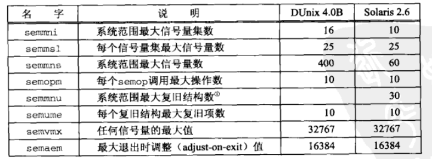

## 12、共享内存区介绍

### 概述
共享内存区是可用IPC形式中最快的。一旦这样的内存区映射到共享它的进程的地址空间，这些进程间数据的传递就不再涉及内核（进程不再通过执行内核的系统调用来彼此传递数据）。然而往该共享内存区存放信息或从中取走信息的进程间需要同步。

考虑用来传递各种类型消息的一个实例客户-服务器文件复制程序中涉及的通常步骤
- 服务器从输入文件读。该文件的数据由内核读入自己的内存空间，然后从内核复制到服务器进程。
- 服务器往一个管道、FIFO或消息队列以一条消息的形式写入这些数据。这些IPC形式通常需要把这些数据从进程复制到内核。
- 客户从该IPC通道读出这些数据。这通常需要把这些数据从内核复制到进程
- 最后，将这些数据从由`write`函数的第二个参数指定的客户缓冲区复制到输出文件。

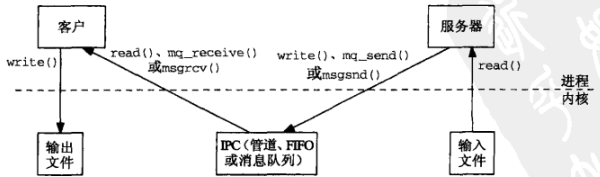

使用共享内存区的通常步骤
- 服务器使用（譬如说）一个信号量取得访问某个共享内存区对象的权力
- 服务器将数据从输入文件读入到该共享内存区对象
- 服务器读入完毕，使用一个信号量通知客户
- 客户将这些数据从该共享内存区对象写出到输出文件中

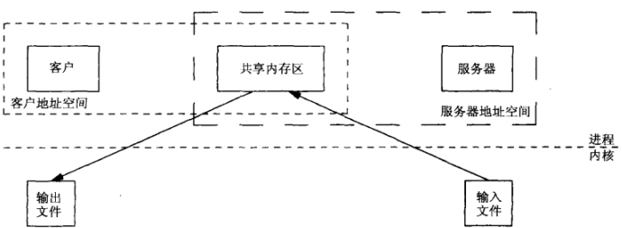

### `mmap`、`munmap`和`msync`函数
`mmap`函数把一个文件或一个Posix共享内存区对象映射到调用进程的地址空间。使用该函数有三个目的：
1. 使用普通文件以提供内存映射IO
2. 使用特殊文件以提供匿名内存映射
3. 使用`shm_open`以提供无亲缘关系进程间的Posix共享内存区
```
#include <sys/mman.h>
/* @param
 * addr：可以指定描述符fd应被映射到的进程内空间的起始地址。通常为NULL，表示内核自己选择起始地址
 * len：映射到调用进程地址空间中的字节数，从被映射文件开头起第offset该字节处开始算
 * prot：内存映射区保护参数
 *    PROT_READ：数据可读
 *    PROT_WRITE：数据可写
 *    PROT_EXEC：数据可执行
 *    PROT_NONE：数据不可访问
 * flags：MAP_SHAPRED或MAP_PRIVATE这两个标志必须指定一个，并可有选择地或上MAP_FIXED
 *    MAP_SHARED：变动是共享的，调用进程对被映射数据所作修改对于共享该对象的所有进程都可见（改变类其底层支撑对象）
 *    MAP_PRIVATE：变动是私有的，调用进程对被映射数据所作修改只对本进程可见（不改变类其底层支撑对象）
 *    MAP_FIXED：准确地解释addr参数
 * fd：描述符，成功后可以关闭
 * offset：偏移量，从这开始共享
 * return：成功返回被映射区的起始地址，出错返回MAP_FAILED
 */
void *mmap(void *addr, size_t len, int prot, int flags, int fd, off_t offset);
```
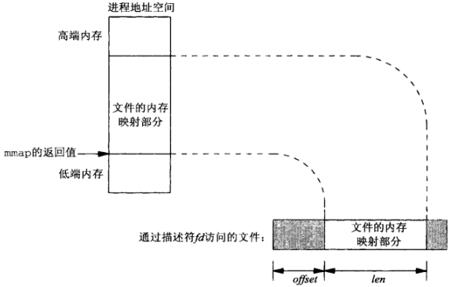

为从某个进程的地址空间删除一个映射关系，可以调用`munmap`
```
/* @param
 * addr：起始地址
 * len：映射区大小
 * return：成功返回0，失败返回-1
 */
int munmap(void *addr, size_t len);
```
再次访问以删除的映射地址将导致向调用进程产生一个`SIGSEGV`信号（假设以后的`mmap`调用不重用这部分地址空间）。如果被映射区是使用`MAP_PRIVATE`标志映射的，那么调用进程对它所作的变动都会被丢弃。如果是一个`MAP_SHARED`内存区，如果我们修改类处于内存映射到某个文件的内存区中某个位置的内容，那么内核将在稍后某个时刻相应地更新文件，也可以调用`msync`来执行这种同步
```
#include <sys/mmap.h>
/* @param
 * addr：起始地址
 * len：映射区大小
 * flags：MS_ASYNC和MS_SYNC必须指定一个
 *    MS_ASYNC：执行异步写
 *    MS_SYNC：执行同步写
 *    MS_INVALIDATE：使告诉缓存的数据失效
 * return：成功返回0，失败返回-1
 */
int msync(void *addr, size_t len, int flags);
```
`MS_ASYNC`指示一旦写操作已由内核排入队列，立即返回，而`MS_SYNC`则要等到写操作完成后才返回。指定了`MS_INVALIDATE`，那么与其最终副本不一致的文件数据的所有内存中副本都失效，后续的引用将从文件中取得数据。

### 4.4BSD 匿名内存映射
- 4.4BSD 匿名内存映射，其办法是把`mmap`的`flags`指定成`MAP_SHARED | MAP_ANON`，把`fd`参数指定为-1。`offset`参数则被忽略。这样的内存区初始化为0
- SVR4提供`/dev/zero`设备文件，我们`open`它之后可在`mmap`调用中使用得到的描述符，从该设备读时返回的字节全为0,写往该设备的任何字节则被丢弃
- Linux都支持

### 访问内存映射的对象
内存映射一个普通文件时，内存中映射区的大小（`mmap`的第二个参数）通常等于该文件的大小，然而文件大小和内存映射区大小可以不同。

## 13、Posix共享内存区

### 概述
Posix.1提供了两种在无亲缘关系进程间共享内存区的方法
- 内存映射文件：由`open`函数打开，由`mmap`函数把得到的描述符映射到当前进程地中空间的一个文件
- 共享内存区对象：由`shm_open`打开一个Posix.1 IPC名字（也许是在文件系统中的一个路径名），所返回的描述符由`mmap`函数映射到当前进程的地址空间

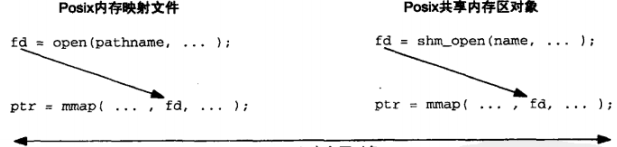

### `shm_open`和`shm_unlink`函数
```
#include <sys/mman.h>
/* @param
 * name：名字
 * oflag：必须或者含有O_RDONLY，或者含有O_RDWR，还可以指定O_CREAT、O_EXCL或O_TRUNC
 * mode：权限位，在指定了O_CREAT标志时有效，如果没有O_CREAT，可以指定为0
 * return：成功返回非负描述符，失败返回-1
 */
int shm_open(const char *name, int oflag, mode_t mode);

/* @brief
 * 删除一个共享内存区对象的名字
 * return：成功返回0，失败返回-1*/
int shm_unlink(const char *name);
```

### `ftruncate`和`fstat`函数
处理`mmap`的时候，普通文件或共享内存区对象的大小都可以通过调用`ftruncate`修改
```
#include <unistd.h>
int ftruncate(int fd, off_t length);
```
Posix就该函数对普通文件和共享内存区对象的处理的定义稍有不同
- 对于一个普通文件：
  - 如果该文件的大小大于`length`参数，额外的数据就丢弃掉。
  - 如果该文件的大小小于`length`参数，那么该文件是否修改以及其大小是否增长是未加说明的。实际上对于一个普通文件，把它的大小扩展到`length`字节的可移植方法是：先`lseek`到偏移为`length-1`处，然后`write`1个字节的数据。所幸的是几乎所有UNIX实现都支持使用`ftruncate`扩展一个文件。
- 对于一个共享内存区对象：`ftruncate`把该对象的大小设置成`length`字节

当打开一个已存在的普通文件或共享内存区对象时，可以调用`fstat`来获取有关该对象的信息
```
#include <sys/types.h>
#include <sys/stat.h>
int fstat(int fd, struct stat *buf);

struct stat {
  dev_t     st_dev;         /* ID of device containing file */
  ino_t     st_ino;         /* Inode number */
  mode_t    st_mode;        /* File type and mode */
  nlink_t   st_nlink;       /* Number of hard links */
  uid_t     st_uid;         /* User ID of owner */
  gid_t     st_gid;         /* Group ID of owner */
  dev_t     st_rdev;        /* Device ID (if special file) */
  off_t     st_size;        /* Total size, in bytes */
  blksize_t st_blksize;     /* Block size for filesystem I/O */
  blkcnt_t  st_blocks;
  struct timespec st_atim;  /* Time of last access */
  struct timespec st_mtim;  /* Time of last modification */
  struct timespec st_ctim;  /* Time of last status change */
};
```
当`fd`指代一个共享内存区对象时，只有`st_mode`、`st_uid`、`st_gid`和`st_size`有信息

## 14、System V 共享内存区

### 概述
System V 共享内存区在概念上类似于Posix共享内存区。不同的是先调用`shmget`，再调用`shmat`。

对于每个共享内存区，内核维护如下信息结构：
```
#include <sys/shm.h>
struct shmid_ds {
  struct ipc_perm  shm_perm;    /* operation permission struct */
  size_t           shm_segsz;   /* segment size */
  pid_t            shm_lpid;    /* pid of last operation */
  pid_t            shm_cpid;    /* pid of creator */
  shmatt_t         shm_nattch;  /* current # attached */
  shmatt_t         shm_cnattch; /* in-core # attached */
  time_t           shm_atime;   /* last attach time */
  time_t           shm_dtime;   /* last detach time */
  time_t           shm_ctime;   /* last change time of this structure */
};
```

### `shmget`函数
`shmget`函数创建一个新的共享内存区，或者访问一个已存在的共享内存区
```
#include <sys/shm.h>
/* @param
 * key：ftok返回值
 * size：共享内存区大小（字节），访问操作指定0
 * oflag：读写权限。它可以与IPC_CREATE或IPC_CREATE|IPC_EXCL按位或
 * return：成功返回共享内存区标识符，失败返回-1
 */
int shmget(key_t key, size_t size, int oflag);
```

### `shmat`函数
`shmat`函数将`shmget`创建或打开的一个共享区附接到调用进程的地址空间
```
#include <sys/shm.h>
/* @param
 * shmid：共享内存标识符
 * shmaddr：地址
 * flag：权限标志，默认读写权限，可以指定SHM_RDONLY表示只读访问
 * return：成功返回映射区的起始地址，失败返回(void *)-1 
 */
void *shmat(int shmid, const void *shmaddr, int flag);
```
返回地址的规则
- 如果`shmaddr`是一个空指针，那么系统替调用者选择地址（优选方案）
- 如果`shmaddr`是一个非空指针，那么返回地址取决于调用者是否给`flag`指定了`SHM_RND`值：
  - 如果没有指定`SHM_RND`，那么相应的共享内存区附接到由`shmaddr`参数指定的地址
  - 如果指定类`SHM_RND`，那么相应的共享内存区附接到由`shmaddr`参数指定的地址向下舍入一个`SHMLBA`常值。LBA代表低端边界地址（lower boundary address）

### `shmdt`函数
当一个进程完成某个共享内存区的使用时，它可调用`shmdt`断接这个内存区
```
#include <sys/shm.h>
int shmdt(const void *shmaddr); /* 成功返回-1，失败返回0 */
```

### `shmctl`函数
```
#incude <sys/shm.h>
/* @param
 * shmid：共享内存区标识符
 * cmd：命令
 * buff：值-结果传递
 * return：成功返回0，失败返回-1
 */
int shmctl(int shmid, int cmd, struct shmid_ds *buff);
```
该函数提供了三个命令
- `IPC_RMID`：从系统中删除由`shmid`表示的共享区并拆除它（只有在最后一个进程分离该段之后，即`shm_nattch`成员为零时,才会销毁该段）
- `IPC_SET`：给所指定的共享内存区设置其`shmid_ds`的以下三个成员：`shm_perm.uid`、`shm_perm.gid`和`shm_perm.mode`，它们的值来自`buff`。``shm_ctime`的值也用当前时间替换
- `IPC_STAT`：（通过`buff`参数）向调用者返回所指定gentian内存区的`shmid_ds`结构

### 共享内存区限制
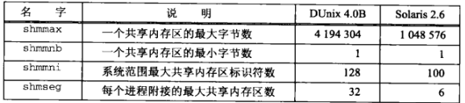

## P1、使用内存映射IO实现Posix消息队列
提供一个使用内存映射IO以及Posix互斥锁和条件变量完成的Posix消息队列的实现

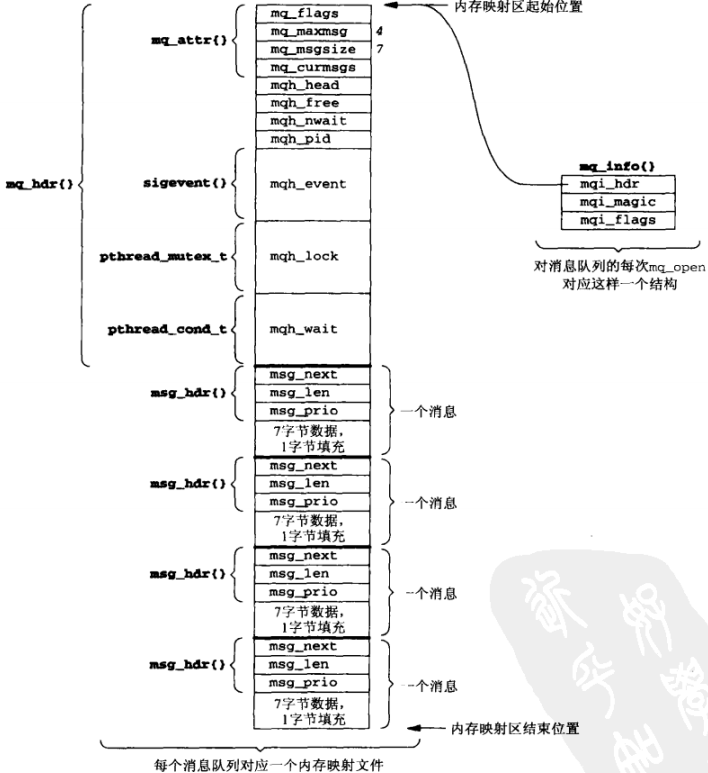
