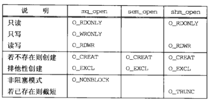

# 进程间通信（Interprocess Communication，IPC）

## 2、Posix IPC

### 概述
以下三种类型的IPC合称为“Posix IPC”
- Posix消息队列
- Posix信号量
- Posix共享内存

Posix IPC函数


### 创建与打开IPC


## System V IPC

### 概述
以下三种类型的IPC合称为System V IPC
- System V 消息队列
- System V信号量
- System V共享内存区

System V IPC函数


### `key_t`键和`ftok`函数
三种类型的System V IPC使用`key_t`值作为它们的名字
```
#include <sys/ipc.h>
key_t ftok(const char *pathname, int id); // 出错返回-1
```

### 创建与打开IPC
- 调用`ftok`，给它传递pathname和id
- 指定key为`IPC_PRIVATE`，这将保证会创建一个新的、唯一的IPC对象


## 4、管道和FIFO

### 管道
所有时样的UNIX都提供管道。由`pipe`函数创建，提供一个单路（单向）数据流
```
#include <unistd.h>
/* @param
 * fd：返回两个文件描述符，fd[0]和fd[1]。前者读，后者写
 * return：成功返回0，失败返回-1
 */
int pipe(int fd[2]);
```


### `popen`和`pclose`函数
标准IO函数库提供了`popen`函数，它创建一个管道并启动另外一个进程，该进程要么从该管道读取标准输入，要么往该管道写入标准输出
```
#include <stdio.h>
/* @param
 * command：shell命令行
 * type："r"（调用进程读取command的标准输出）或"w"（调用进程写到command的标准输入）
 * return：成功返回文件指针，失败返回NULL
 */
FILE *popen(const char *command, const char *type);
int pclose(FILE *stream);
```

### FIFO
管道没有名字，只能用于有一个共同祖先进程的各个进程之间，无法在无亲缘关系的两个进程间创建一个管道并将它用作IPC通道（不考虑描述符传递）

FIFO是单向数据流，每个FIFO有一个路径名与之关联，无亲缘关系的进程可以访问同一个FIFO。FIFO也称为有名管道
```
#include <sys/types.h>
#include <sys/stat.h>
/* @param
 * pathname：路径名，是FIFO名字
 * mode：文件权限，隐含O_CREAT | O_EXCL
 * return：成功0，失败-1
 */
int mkfifo(const char *pathname, mode_t mode);
```

### 管道和FIFO的额外属性
- 调用`open`时可指定`O_NONBLOCK`表示  
`writefd = open(FIFO1, O_WRONLY | O_NONBLOCK);`
- 如果一个描述符已经打开，那么可以调用`fcntl`以启用`O_NONBLOCK`标志   
  ```
  int flags = fcntl(fd, F_GETFL, 0);
  fcntl(fd, F_SETFL, flags | O_NONBLOCK);
  ```

关于管道或FIFO的读出与写入的若个额外规则
- 如果请求读出的数据量多于管道或FIFO中当前可用数据量，那么只返回这些可用的数据
- 如果请求写入的数据的字节数小于或等于`PIPE_BUF`，那么`write`操作保证是原子的
- `O_NONBLOCK`标志的设置对`write`操作的原子性没有影响
- 如果向一个没有为读打开的管道或FIFO写入，那么内核将产生一个`SIGPIPE`信号

### 单个服务器，多个客户


例子`fifo-server.c, file-client.c`

### 管道和FIFO限制
- `OPEN_MAX`：一个进程在任意时刻打开的最大描述符数（Pisix要求至少为16）
- `PIPE_BUF`：可原子地网一个管道或FIFO的最大数据量（posix要求至少为512）