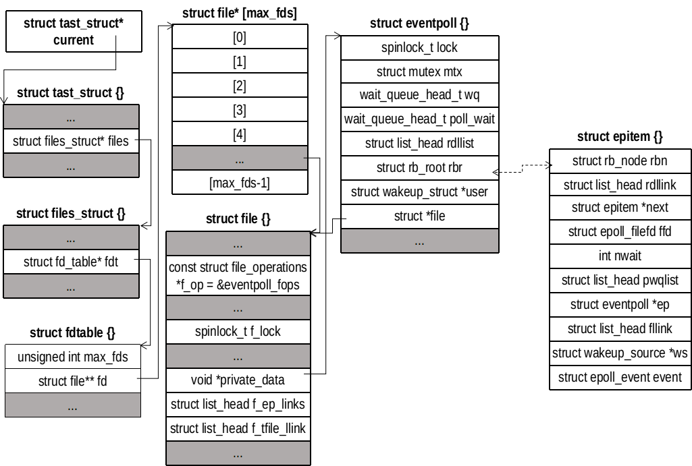
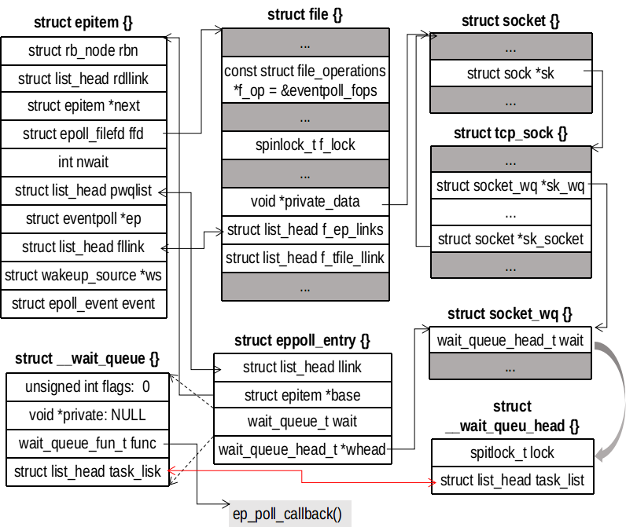

# `select`、`poll`和`epoll`的区别
`select`，`poll`，`epoll`都是 I/O 多路复用的机制。I/O 多路复用就是通过一种机制，一个进程可以监视多个描述符，一旦某个描述符就绪（可读、可写或出错），能够通知程序进行相应的读写操作。但 `select`，`poll`，`epoll` 本质上都是同步 I/O，因为他们都需要在读写事件就绪后自己负责读写数据，也就是说这个读写过程是阻塞的，而异步I/O则无需自己负责进行读写，异步 I/O 的实现会负责把数据从内核拷贝到用户空间。

## 套接字文件的 `poll`
在分析之间，先介绍文件的 poll 机制。需要知道，`file` 结构体是从进程角度对打开文件的抽象，可以绑定不同的文件操作。就套接字文件而言，在调用 `socket()` 后，除了创建一个套接字文件，还会创建一个 `file` 对象，然后将两者关联起来，`file` 对象的文件操作是调用套接字文件的操作。所以 `*f_op->poll` 函数指针其实是指向 `sock_poll` 函数。接下来看这个函数的实现：
```
/// @file net/socket.c
1141 static unsigned int sock_poll(struct file *file, poll_table *wait)
1142 {
1143     unsigned int busy_flag = 0;
1144     struct socket *sock;
1145 
1146     /*
1147      *      We can't return errors to poll, so it's either yes or no.
1148      */
1149     sock = file->private_data; // file 和 socket 关联的地方
1150 
1151     if (sk_can_busy_loop(sock->sk)) { // 直接返回false，表示不能忙等
1152         /* this socket can poll_ll so tell the system call */
1153         busy_flag = POLL_BUSY_LOOP;
1154 
1155         /* once, only if requested by syscall */
1156         if (wait && (wait->_key & POLL_BUSY_LOOP))
1157             sk_busy_loop(sock->sk, 1);
1158     }
1159 
1160     return busy_flag | sock->ops->poll(file, sock, wait); // 调用
1161 }
```
同样的道理 `sock->ops->poll` 也是指向其底层结构的文件操作函数。对 TCP 而言是 `tcp_poll()`，对 UDP 而言是 `udp_poll`。我们分析 `tcp_poll` 函数
```
/// @file net/ipv4/tcp.c
436 unsigned int tcp_poll(struct file *file, struct socket *sock, poll_table *wait)
437 {
438     unsigned int mask;
439     struct sock *sk = sock->sk;
440     const struct tcp_sock *tp = tcp_sk(sk);
441 
442     sock_rps_record_flow(sk);
443 
444     sock_poll_wait(file, sk_sleep(sk), wait); // 继续进入
445     if (sk->sk_state == TCP_LISTEN) // 如果是监听套接字，完成队列不为空就返回 POLLIN
446         return inet_csk_listen_poll(sk);
452     // 后面就是查看所有发生的事件
453     mask = 0;
482     if (sk->sk_shutdown == SHUTDOWN_MASK || sk->sk_state == TCP_CLOSE)
483         mask |= POLLHUP;
484     if (sk->sk_shutdown & RCV_SHUTDOWN)
485         mask |= POLLIN | POLLRDNORM | POLLRDHUP;
486 
487     /* Connected or passive Fast Open socket? */
488     if (sk->sk_state != TCP_SYN_SENT &&
489         (sk->sk_state != TCP_SYN_RECV || tp->fastopen_rsk != NULL)) {
490         int target = sock_rcvlowat(sk, 0, INT_MAX);
491 
492         if (tp->urg_seq == tp->copied_seq &&
493             !sock_flag(sk, SOCK_URGINLINE) &&
494             tp->urg_data)
495             target++;
496 
497         /* Potential race condition. If read of tp below will
498          * escape above sk->sk_state, we can be illegally awaken
499          * in SYN_* states. */
500         if (tp->rcv_nxt - tp->copied_seq >= target)
501             mask |= POLLIN | POLLRDNORM;
502 
503         if (!(sk->sk_shutdown & SEND_SHUTDOWN)) {
504             if (sk_stream_is_writeable(sk)) {
505                 mask |= POLLOUT | POLLWRNORM;
506             } else {  /* send SIGIO later */
507                 set_bit(SOCK_ASYNC_NOSPACE,
508                     &sk->sk_socket->flags);
509                 set_bit(SOCK_NOSPACE, &sk->sk_socket->flags);
510 
511                 /* Race breaker. If space is freed after
512                  * wspace test but before the flags are set,
513                  * IO signal will be lost.
514                  */
515                 if (sk_stream_is_writeable(sk))
516                     mask |= POLLOUT | POLLWRNORM;
517             }
518         } else
519             mask |= POLLOUT | POLLWRNORM;
520 
521         if (tp->urg_data & TCP_URG_VALID)
522             mask |= POLLPRI;
523     }
525     smp_rmb();
526     if (sk->sk_err)
527         mask |= POLLERR;
528 
529     return mask; // 返回就绪的事件
530 }
```
`sock_poll_wait()` 调用 `poll_wait()` 函数
```
/// @file include/net/sock.h
1996 static inline void sock_poll_wait(struct file *filp,
1997         wait_queue_head_t *wait_address, poll_table *p)
1998 {
1999     if (!poll_does_not_wait(p) && wait_address) {
2000         poll_wait(filp, wait_address, p);
2001         /* We need to be sure we are in sync with the
2002          * socket flags modification.
2003          *
2004          * This memory barrier is paired in the wq_has_sleeper.
2005          */
2006         smp_mb();
2007     }
2008 }
```
`poll_wait()` 函数就调用 `p->_qproc` 指向的函数。需要注意的是 `wait_address` 就是某个文件的等待队列，可以猜想，`poll_wait()` 是将特定的进程挂到某个文件的等待队列上，随后会阻塞等待这个文件唤醒。此时调用进程并没有投入睡眠，要等到调用进程调用将自己的状态设置为 `TASK_INTERRUPTIBLE` 后调用进程才放弃 CPU 进入睡眠状态。
```
/// @file include/linux/poll.h
37 typedef struct poll_table_struct {
38     poll_queue_proc _qproc;
39     unsigned long _key;
40 } poll_table;
41 
42 static inline void poll_wait(struct file * filp, wait_queue_head_t * wait_address, poll_table *p)
43 {
44     if (p && p->_qproc && wait_address)
45         p->_qproc(filp, wait_address, p); // 调用函数
46 }
```

## `select`实现及其优缺点
`select` 提供一种 `fd_set` 的数据结构，实际上是一个`long`类型的数组。数组每一位都能与已打开的文件描述符 `fd` 建立联系（`FD_SET`、`FD_CLR`），当调用 `select` 时，由内核遍历 `fd_set` 的内容，根据IO状态修改 `fd_set` 的内容，通过将某位设置为1标志描述符已经就绪。

### 函数接口
```
#include <sys/select.h>
int select(int nfds, fd_set *readfds, fd_set *writefds, fd_set *execeptfds,
           struct timeval *timeout);
void FD_ZERO(fd_set *set);
void FD_SET(int fd, fd_set *set);
void FD_CLR(int fd, fd_set *set);
int FD_ISSET(int fd, fd_set *set);
```

### 系统实现（Linux）
首先是相关数据结构。
```
/// @file include/uapi/linux/posix_types.h
21 #undef __FD_SETSIZE
22 #define __FD_SETSIZE    1024
23 
24 typedef struct {
25     unsigned long fds_bits[__FD_SETSIZE / (8 * sizeof(long))];
26 } __kernel_fd_set;

/// @file include/linux/types.h
14 typedef __kernel_fd_set		fd_set;
```

#### `sys_select()`
`sys_select()` 会将时间从用户空间拷贝到内核空间，并且调用 `poll_select_set_timeout()` 将时间转换成纳秒粒度级别。然后调用 `core_sys_select()` 进行进一步处理，最后会调用 `poll_select_copy_remaning()` 将剩余时间拷贝到用户空间。
```
/// @file fs/select.c
622 SYSCALL_DEFINE5(select, int, n, fd_set __user *, inp, fd_set __user *, outp     ,
623         fd_set __user *, exp, struct timeval __user *, tvp)
624 {
625     struct timespec end_time, *to = NULL;
626     struct timeval tv;
627     int ret;
628 
629     if (tvp) {
630         if (copy_from_user(&tv, tvp, sizeof(tv)))
631             return -EFAULT;
632 
633         to = &end_time; // 纳秒粒度
634         if (poll_select_set_timeout(to,
635                 tv.tv_sec + (tv.tv_usec / USEC_PER_SEC),
636                 (tv.tv_usec % USEC_PER_SEC) * NSEC_PER_USEC))
637             return -EINVAL;
638     }
639 
640     ret = core_sys_select(n, inp, outp, exp, to); // 主要工作
641     ret = poll_select_copy_remaining(&end_time, tvp, 1, ret); // 拷贝剩余时间
642 
643     return ret;
644 }
```

#### `core_sys_select()`
在查看代码前先了解一个数据结构 `fd_set_bits`。
```
/// @file include/linux/poll.h
 18 #define FRONTEND_STACK_ALLOC    256
 19 #define SELECT_STACK_ALLOC  FRONTEND_STACK_ALLOC

111 typedef struct {
112     unsigned long *in, *out, *ex;
113     unsigned long *res_in, *res_out, *res_ex;
114 } fd_set_bits;
```
`fd_set_bits` 里面封装保存监听事件和返回就绪事件的变量，都是指向 `unsigned long` 的指针，在轮询文件描述符的时候，是以 `unsigned long` 为单位进行处理的。接下来看 `core_sys_select()` 的代码，`core_sys_select()` 会预先在栈空间上分配 `SELECT_STACK_ALLOC` 个字节内存存放 `fd_set_bits`，如果需要处理的最大描述符过大（大于320），栈空间无法存放 `fd_set_bits` 数据结构，就需要从堆空间中重新分配。
```
/// @file fs/select.c
547 int core_sys_select(int n, fd_set __user *inp, fd_set __user *outp,
548                fd_set __user *exp, struct timespec *end_time)
549 {
550     fd_set_bits fds;
551     void *bits;
552     int ret, max_fds;
553     unsigned int size;
554     struct fdtable *fdt;
555     /* Allocate small arguments on the stack to save memory and be faster */
556     long stack_fds[SELECT_STACK_ALLOC/sizeof(long)]; // 256字节大小
557 
558     ret = -EINVAL;
559     if (n < 0)
560         goto out_nofds;
561 
562     /* max_fds can increase, so grab it once to avoid race */
563     rcu_read_lock();
564     fdt = files_fdtable(current->files); // fd 数组管理结构
565     max_fds = fdt->max_fds; // 当前进程打开的最大文件描述符
566     rcu_read_unlock();
567     if (n > max_fds) // 超过最大，截取，为什么不是错误
568         n = max_fds;
569 
570     /*
571      * We need 6 bitmaps (in/out/ex for both incoming and outgoing),
572      * since we used fdset we need to allocate memory in units of
573      * long-words. 
574      */
575     size = FDS_BYTES(n); // 用 unsigned long 保存n位需要的字节数，一定是8的倍数
576     bits = stack_fds;
577     if (size > sizeof(stack_fds) / 6) { // 栈空间无法存放
578         /* Not enough space in on-stack array; must use kmalloc */
579         ret = -ENOMEM;
580         bits = kmalloc(6 * size, GFP_KERNEL); // 在堆上申请更大的空间
581         if (!bits)
582             goto out_nofds;
583     } // 下面将 bits 管理的内存分配给 fd_set_bits 数据结构
584     fds.in      = bits;
585     fds.out     = bits +   size;
586     fds.ex      = bits + 2*size;
587     fds.res_in  = bits + 3*size;
588     fds.res_out = bits + 4*size;
589     fds.res_ex  = bits + 5*size;
590     // 然后将用户空间的三个 fd_set 数据拷贝到内核空间 fd_set_bits 中
591     if ((ret = get_fd_set(n, inp, fds.in)) ||
592         (ret = get_fd_set(n, outp, fds.out)) ||
593         (ret = get_fd_set(n, exp, fds.ex)))
594         goto out;
595     zero_fd_set(n, fds.res_in);  // 清空存储返回数据的内存
596     zero_fd_set(n, fds.res_out);
597     zero_fd_set(n, fds.res_ex);
598 
599     ret = do_select(n, &fds, end_time); // 轮询的主要工作
600 
601     if (ret < 0)
602         goto out;
603     if (!ret) {
604         ret = -ERESTARTNOHAND;
605         if (signal_pending(current))
606             goto out;
607         ret = 0;
608     }
609     // 将输入参数的空间当作输出空间，把结果从内核空间拷贝到用户空间
610     if (set_fd_set(n, inp, fds.res_in) ||
611         set_fd_set(n, outp, fds.res_out) ||
612         set_fd_set(n, exp, fds.res_ex))
613         ret = -EFAULT;
614 
615 out:
616     if (bits != stack_fds)
617         kfree(bits);
618 out_nofds:
619     return ret;
620 }
```

#### `do_select()`
`do_select()` 用轮询的方式检测监听描述符的状态是否满足条件，若达到符合的相关条件则在返回 `fd_set_bits` 对应的数据域中标记该描述符。虽然该轮训的机制是死循环，但是不是一直轮训，当内核轮询一遍文件描述符没有发现任何事件就绪时，会调用 `poll_schedule_timeout()` 函数挂起，等待相应的文件或定时器来唤醒自己，然后再继续循环体看看哪些文件已经就绪，以此减少对 CPU 的占用。我们先看轮询的过程，然后在分析如何让睡眠等待唤醒
```
399 int do_select(int n, fd_set_bits *fds, struct timespec *end_time)
400 {
401     ktime_t expire, *to = NULL;
402     struct poll_wqueues table; // 用于睡眠唤醒自己的结构，后面分析
403     poll_table *wait;
404     int retval, i, timed_out = 0;
405     unsigned long slack = 0;
406     unsigned int busy_flag = net_busy_loop_on() ? POLL_BUSY_LOOP : 0;
407     unsigned long busy_end = 0;
408 
409     rcu_read_lock();
410     retval = max_select_fd(n, fds); // 获取监听的最大描述符（仍然是打开状态）
411     rcu_read_unlock();
412 
413     if (retval < 0)
414         return retval;
415     n = retval;  // 传入的文件描述符可能被意外关闭？？
416 
417     poll_initwait(&table);
418     wait = &table.pt;
419     if (end_time && !end_time->tv_sec && !end_time->tv_nsec) {
420         wait->_qproc = NULL; // 定时器唤醒自己，不需要文件来唤醒
421         timed_out = 1; // 需要超时返回处理
422     }
423 
424     if (end_time && !timed_out)
425         slack = select_estimate_accuracy(end_time); // 现在到超时时间的纳秒数
426 
427     retval = 0;
428     for (;;) { // 主循环，开始轮询
429         unsigned long *rinp, *routp, *rexp, *inp, *outp, *exp;
430         bool can_busy_loop = false;
431         
432         inp = fds->in; outp = fds->out; exp = fds->ex;
433         rinp = fds->res_in; routp = fds->res_out; rexp = fds->res_ex;
434 
435         for (i = 0; i < n; ++rinp, ++routp, ++rexp) { // 每次处理8字节（unsigned long）
436             unsigned long in, out, ex, all_bits, bit = 1, mask, j;
437             unsigned long res_in = 0, res_out = 0, res_ex = 0;
438 
439             in = *inp++; out = *outp++; ex = *exp++; // 本次处理的8个字节（64个描述符）
440             all_bits = in | out | ex;
441             if (all_bits == 0) { // 没有任何监听事件，处理下一个8字节
442                 i += BITS_PER_LONG; // i + 64
443                 continue;
444             }
445             // 否则开始每一位进行检测
446             for (j = 0; j < BITS_PER_LONG; ++j, ++i, bit <<= 1) {
447                 struct fd f;
448                 if (i >= n)
449                     break;
450                 if (!(bit & all_bits)) // 本位没有事件，下一位
451                     continue;
452                 f = fdget(i);
453                 if (f.file) { // struct file* 指针
454                     const struct file_operations *f_op;
455                     f_op = f.file->f_op; // 文件操作函数
456                     mask = DEFAULT_POLLMASK;
457                     if (f_op->poll) { // 支持 poll 
458                         wait_key_set(wait, in, out, // 设置 wait->_key
459                                  bit, busy_flag);
460                         mask = (*f_op->poll)(f.file, wait); // poll 机制，后面分析
461                     } // mask记录了该文件的就绪的事件，如果有处于监听的，就记录下来
462                     fdput(f);
463                     if ((mask & POLLIN_SET) && (in & bit)) {
464                         res_in |= bit;
465                         retval++;
466                         wait->_qproc = NULL;
467                     }
468                     if ((mask & POLLOUT_SET) && (out & bit)) {
469                         res_out |= bit;
470                         retval++;
471                         wait->_qproc = NULL;
472                     }
473                     if ((mask & POLLEX_SET) && (ex & bit)) {
474                         res_ex |= bit;
475                         retval++;
476                         wait->_qproc = NULL;
477                     }
478                     /* got something, stop busy polling */
479                     if (retval) { // 有就绪事件，轮询结束就返回
480                         can_busy_loop = false;
481                         busy_flag = 0;
482 
483                     /*
484                      * only remember a returned
485                      * POLL_BUSY_LOOP if we asked for it
486                      */
487                     } else if (busy_flag & mask)
488                         can_busy_loop = true;
489 
490                 }
491             } // 8字节（64位）循环，下面记录结果
492             if (res_in)
493                 *rinp = res_in;
494             if (res_out)
495                 *routp = res_out;
496             if (res_ex)
497                 *rexp = res_ex;
498             cond_resched(); // 暂时放弃CPU，处理紧急事情。自己重新以抢占的形式调度回来，继续执行
499         } // 一遍轮询结束
500         wait->_qproc = NULL;
501         if (retval || timed_out || signal_pending(current))
502             break; // 有就绪时间、超时、信号事件，跳出主循环返回
503         if (table.error) { // 出错
504             retval = table.error;
505             break;
506         }
507 
508         /* only if found POLL_BUSY_LOOP sockets && not out of time */
509         if (can_busy_loop && !need_resched()) {
510             if (!busy_end) {
511                 busy_end = busy_loop_end_time();
512                 continue;
513             }
514             if (!busy_loop_timeout(busy_end))
515                 continue;
516         }
517         busy_flag = 0;
518 
519         /*
520          * If this is the first loop and we have a timeout
521          * given, then we convert to ktime_t and set the to
522          * pointer to the expiry value.
523          */
524         if (end_time && !to) {
525             expire = timespec_to_ktime(*end_time);
526             to = &expire;
527         }
528         // 设置当前进程的状态为TASK_INTERRUPTIBLE，可以被信号和wake_up()，
            // 以及超时唤醒的，然后投入睡眠
529         if (!poll_schedule_timeout(&table, TASK_INTERRUPTIBLE,
530                        to, slack))
531             timed_out = 1;
532     }
533 
534     poll_freewait(&table);
535 
536     return retval;
537 }
```

#### `*f_op->poll()` 做了什么
从前面的分析中，`*f_op->poll` 会调用 `wait->_qproc` 指向的方法。我们看看 `poll_initwait(&table);` 做了什么
```
/// @file fs/select.c
119 void poll_initwait(struct poll_wqueues *pwq)
120 {
121     init_poll_funcptr(&pwq->pt, __pollwait);
122     pwq->polling_task = current;
123     pwq->triggered = 0;
124     pwq->error = 0;
125     pwq->table = NULL;
126     pwq->inline_index = 0;
127 }
```
可以看到，将 `__pollwait()` 函数绑定到 `pwq->pt`
```
/// @file fs/select.c
219 static void __pollwait(struct file *filp, wait_queue_head_t *wait_address,
220                 poll_table *p)
221 {
222     struct poll_wqueues *pwq = container_of(p, struct poll_wqueues, pt);
223     struct poll_table_entry *entry = poll_get_entry(pwq);
224     if (!entry)
225         return;
226     entry->filp = get_file(filp);
227     entry->wait_address = wait_address;
228     entry->key = p->_key;
229     init_waitqueue_func_entry(&entry->wait, pollwake);
230     entry->wait.private = pwq;
231     add_wait_queue(wait_address, &entry->wait);
232 }
```
可以看到，`__pollwait()` 是将调用进程挂到某个等待队列上，然后绑定唤醒函数 `pollwake()`。


### 优缺点
- 优点
  - 跨平台
- 缺点
  - 单个进程能够监视的文件描述符的数量存在最大限制，通常是1024。当然可以更改数量，但由于`select`采用轮询的方式扫描文件描述符，文件描述符数量越多，性能越差
  - 每次调用`select`，都需要把fd集合从用户空间拷贝到内核空间，在返回时，将返会数组从内核空间拷贝到用户空间
  - `select`返回的是含有整个监视的文件描述符，应用程序需要遍历整个数组才能发现哪些句柄发生了事件
  - 会（清空）修改传入的`fd_set`数组（地址传递），返回的使用当作返回空间。所以应用程序所以每次都需要重新拷贝，传入副本，以免自己维持的`fd_set`被污染。

## `poll`实现及其优缺点
`poll`和`select`类似，没有本质差别，管理多个描述符也是进行轮询，根据描述符的状态进行处理。但是`poll`没有最大描述符数量的限制，并且传入的`fds`在`poll`函数返回后不会清空，活动事件记录在`revents`成员中。

### 函数接口
```
#include <poll.h>
int poll(struct pollfd *fds, nfds_t nfds, int timeout);
```

### 系统实现（Linux）
```
/// @file include/uapi/asm-generic/poll.h
35 struct pollfd {
36     int fd;
37     short events;
38     short revents;
39 };

/// @file fs/select.c
18 #define FRONTEND_STACK_ALLOC    256
20 #define POLL_STACK_ALLOC    FRONTEND_STACK_ALLOC

735 struct poll_list {
736     struct poll_list *next;
737     int len;
738     struct pollfd entries[0];
739 };
```

#### `sys_poll()`
```
/// @file fs/select.c
957 SYSCALL_DEFINE3(poll, struct pollfd __user *, ufds, unsigned int, nfds,
958         int, timeout_msecs)
959 {
960     struct timespec end_time, *to = NULL;
961     int ret;
962 
963     if (timeout_msecs >= 0) { // 拷贝时间，微秒粒度
964         to = &end_time;
965         poll_select_set_timeout(to, timeout_msecs / MSEC_PER_SEC,
966             NSEC_PER_MSEC * (timeout_msecs % MSEC_PER_SEC));
967     }
968 
969     ret = do_sys_poll(ufds, nfds, to); // 主要
970 
971     if (ret == -EINTR) {
972         struct restart_block *restart_block;
973 
974         restart_block = &current_thread_info()->restart_block;
975         restart_block->fn = do_restart_poll;
976         restart_block->poll.ufds = ufds;
977         restart_block->poll.nfds = nfds;
978 
979         if (timeout_msecs >= 0) {
980             restart_block->poll.tv_sec = end_time.tv_sec;
981             restart_block->poll.tv_nsec = end_time.tv_nsec;
982             restart_block->poll.has_timeout = 1;
983         } else
984             restart_block->poll.has_timeout = 0;
985 
986         ret = -ERESTART_RESTARTBLOCK;
987     }
988     return ret;
989 }
```

#### `do_sys_poll()`
和 `select` 一样，`poll` 也会预先在栈空间申请大小为 `POLL_STACK_ALLOC` 的内存，栈空间可以处理 30 个文件描述符。不过和 `select` 不同的是，即使栈空间太小，要从堆上申请内存，预先分配的栈空间也是被使用的。
```
/// @file fs/select.c
870 int do_sys_poll(struct pollfd __user *ufds, unsigned int nfds,
871         struct timespec *end_time)
872 {
873     struct poll_wqueues table;
874     int err = -EFAULT, fdcount, len, size;
875     /* Allocate small arguments on the stack to save memory and be
876        faster - use long to make sure the buffer is aligned properly
877        on 64 bit archs to avoid unaligned access */
878     long stack_pps[POLL_STACK_ALLOC/sizeof(long)]; // 原先分配256字节栈空间
879     struct poll_list *const head = (struct poll_list *)stack_pps;
880     struct poll_list *walk = head;
881     unsigned long todo = nfds;
882 
883     if (nfds > rlimit(RLIMIT_NOFILE))
884         return -EINVAL;
885 
886     len = min_t(unsigned int, nfds, N_STACK_PPS);
887     for (;;) {
888         walk->next = NULL;
889         walk->len = len;
890         if (!len)
891             break;
892         // 从用于空间拷贝到内核空间
893         if (copy_from_user(walk->entries, ufds + nfds-todo,
894                     sizeof(struct pollfd) * walk->len))
895             goto out_fds;
896         // 栈空间大约可以处理 30 个文件描述符
897         todo -= walk->len;
898         if (!todo)
899             break;
900 
901         len = min(todo, POLLFD_PER_PAGE); // 一次最大申请一页，可以 510 个文件描述符 
902         size = sizeof(struct poll_list) + sizeof(struct pollfd) * len;
903         walk = walk->next = kmalloc(size, GFP_KERNEL); // 空间不够，申请堆空间，栈空间继续用
904         if (!walk) {
905             err = -ENOMEM;
906             goto out_fds;
907         }
908     }
909 
910     poll_initwait(&table); // 和 select 处理一样
911     fdcount = do_poll(nfds, head, &table, end_time); // 主要工作
912     poll_freewait(&table);
913     // 将结果从内核空间拷贝到用户空间
914     for (walk = head; walk; walk = walk->next) {
915         struct pollfd *fds = walk->entries;
916         int j;
917 
918         for (j = 0; j < walk->len; j++, ufds++)
919             if (__put_user(fds[j].revents, &ufds->revents))
920                 goto out_fds;
921     }
922 
923     err = fdcount;
924 out_fds:
925     walk = head->next;
926     while (walk) {
927         struct poll_list *pos = walk;
928         walk = walk->next;
929         kfree(pos);
930     }
931 
932     return err;
933 }
```

#### `do_poll()`
和 `do_select` 的原理一样
```
/// @file fs/select.c
781 static int do_poll(unsigned int nfds,  struct poll_list *list,
782            struct poll_wqueues *wait, struct timespec *end_time)
783 {
784     poll_table* pt = &wait->pt;
785     ktime_t expire, *to = NULL;
786     int timed_out = 0, count = 0;
787     unsigned long slack = 0;
788     unsigned int busy_flag = net_busy_loop_on() ? POLL_BUSY_LOOP : 0;
789     unsigned long busy_end = 0;
790 
791     /* Optimise the no-wait case */
792     if (end_time && !end_time->tv_sec && !end_time->tv_nsec) {
793         pt->_qproc = NULL;
794         timed_out = 1;
795     }
796 
797     if (end_time && !timed_out)
798         slack = select_estimate_accuracy(end_time);
799 
800     for (;;) { // 主循环
801         struct poll_list *walk;
802         bool can_busy_loop = false;
803 
804         for (walk = list; walk != NULL; walk = walk->next) {
805             struct pollfd * pfd, * pfd_end;
806 
807             pfd = walk->entries;
808             pfd_end = pfd + walk->len;
809             for (; pfd != pfd_end; pfd++) {
817                 if (do_pollfd(pfd, pt, &can_busy_loop,
818                           busy_flag)) {
819                     count++;
820                     pt->_qproc = NULL;
821                     /* found something, stop busy polling */
822                     busy_flag = 0;
823                     can_busy_loop = false;
824                 }
825             }
826         }
831         pt->_qproc = NULL;
832         if (!count) {
833             count = wait->error;
834             if (signal_pending(current))
835                 count = -EINTR;
836         }
837         if (count || timed_out)
838             break;
839 
840         /* only if found POLL_BUSY_LOOP sockets && not out of time */
841         if (can_busy_loop && !need_resched()) {
842             if (!busy_end) {
843                 busy_end = busy_loop_end_time();
844                 continue;
845             }
846             if (!busy_loop_timeout(busy_end))
847                 continue;
848         }
849         busy_flag = 0;
850 
856         if (end_time && !to) {
857             expire = timespec_to_ktime(*end_time);
858             to = &expire;
859         }
860 
861         if (!poll_schedule_timeout(wait, TASK_INTERRUPTIBLE, to, slack)) // 睡眠
862             timed_out = 1;
863     }
864     return count;
865 }
```

### 优缺点
- 优点
  - `select` 会修改传入的 `fd_set` 参数，把它当作返回的空间存储返回的数据，而 `poll` 不会，返回数据和传入的数据不互相干扰；
  - `poll` 的描述符类型使用链表实现，没有描述符数量的限制；
- 缺点
  - 每次调用 `poll`，都需要把 `pollfd` 链表从用户空间拷贝到内核空间，在返回时，将返会数据从内核空间拷贝到用户空间
  - `poll` 返回的是含有整个 `pollfd` 链表，应用程序需要遍历整个链表才能发现哪些句柄发生了事件

## [`epoll`实现及其优缺点](https://tqr.ink/2017/10/05/implementation-of-epoll/)
相对于 `select` 来说，`epoll` 没有描述符个数限制。调用 `epoll_ctl` 注册事件的时候将相关数据拷入内核，以后调用 `epoll_wait` 不会像 `select` 或 `poll` 那样，每次都从用户空间拷贝数据到内核空间。并且与 `select` 或 `poll` 返回所有事件不同的是，`epoll` 返回的是处于就绪的事件的列表。此外 `epoll` 是基于事件驱动的，在所有添加事件会对应文件建立回调关系，也就是说，当相应的事件发生时会调用这个回调方法，它会将发生的事件添加到就绪链表中。

### 接口函数
```
/// @file sys/epoll.h
typedef union epoll_data
{
  void *ptr;
  int fd;
  uint32_t u32;
  uint64_t u64;
} epoll_data_t;

struct epoll_event
{
  uint32_t events;	/* Epoll events */
  epoll_data_t data;	/* User data variable */
} __EPOLL_PACKED;

#include <sys/epoll.h>
int epoll_create(int size);
int epoll_ctl(int epfd, int op, int fd, struct epoll_event *event);
int epoll_wait(int epfd, struct epoll_event *events, int maxevents, int timeout);
```

### `epoll` 的数据结构
`epoll` 的原理和 `select` 和 `poll` 都不一样。`epoll` 在内核中会保存需要监视事件（文件和对应的状态），这时通过 `epoll_ctl()` 来完成监听事件的添加、修改和移除。所以内核中需要特定的数据结构来保存需要监视的事件。首先内核用 `eventpoll` 结构体来保存所有监视的事件。第一，所有监视事件用红黑树串联起来；第二，一切皆文件，创建 `eventpoll` 对象会绑定一个匿名文件的 `file` 对象。我们可以像操作文件一样操作 `eventpoll` 对象。


```
/// @file fs/eventpoll.c
180 struct eventpoll {
182     spinlock_t            lock;                 // 自旋锁，保护本结构体
190     struct mutex          mtx;                  // 互斥变量，保护 file 对象
193     wait_queue_head_t     wq;                   // sys_epoll_wait() 等待队列
196     wait_queue_head_t     poll_wait;            // file->poll() 等待队列
199     struct list_head      rdllist;              // 就绪事件链表
202     struct rb_root        rbr;                  // 红黑树的根
209     struct epitem        *ovflist;              // 备选队列，锁被占用时添加到此
212     struct wakeup_source *ws;                   // 
215     struct user_struct   *user;                 // epoll_create() 调用者信息
217     struct file          *file;                 // 绑定的 file 对象
220     int                   visited;
221     struct list_head      visited_list_link;
222 };
```
每一个事件都用一个 `epitem` 结构体表示
```
/// @file fs/eventpoll.c
136 struct epitem {
137     union {
139         struct rb_node          rbn;     // 挂到红黑树
141         struct rcu_head         rcu;     // 挂到释放链表
142     };
145     struct list_head            rdllink; // 挂到就绪链表
151     struct epitem              *next;    // 串联ovflist链表
154     struct epoll_filefd         ffd;     // 保存需要监视 fd 和 file
157     int                         nwait;   // 
160     struct list_head            pwqlist; // 
163     struct eventpoll           *ep;      // 所属的 eventpoll 对象
166     struct list_head            fllink;
169     struct wakeup_source __rcu *ws;
172     struct epoll_event          event;   // 监视的状态
173 };
```

`eppoll_entry`
```
/// @file fs/eventpoll.c
225 struct eppoll_entry {
227     struct list_head   llink;
230     struct epitem     *base;
236     wait_queue_t       wait;
239     wait_queue_head_t *whead;
240 };
```
`ep_send_events_data`
```
249 struct ep_send_events_data {
250     int maxevents;
251     struct epoll_event __user *events;
252 };
```

### 系统实现
```
/// @file include/uapi/linux/eventpoll.h
59 struct epoll_event {
60     __u32 events;
61     __u64 data;
62 } EPOLL_PACKED;
```

#### `epoll_create()`
```
/// @file fs/eventpoll.c
1820 SYSCALL_DEFINE1(epoll_create, int, size)
1821 {
1822     if (size <= 0)
1823         return -EINVAL;
1824 
1825     return sys_epoll_create1(0);
1826 }
```
可以看到 `size` 参数没有任何作用，只要不小于0就行。
```
/// @file fs/eventpoll.c
1777 SYSCALL_DEFINE1(epoll_create1, int, flags)
1778 {
1779     int error, fd;
1780     struct eventpoll *ep = NULL;
1781     struct file *file;
1782 
1783     /* Check the EPOLL_* constant for consistency.  */
1784     BUILD_BUG_ON(EPOLL_CLOEXEC != O_CLOEXEC);
1785 
1786     if (flags & ~EPOLL_CLOEXEC)
1787         return -EINVAL;
1788     /*
1789      * Create the internal data structure ("struct eventpoll").
1790      */
1791     error = ep_alloc(&ep); // 申请一个 eventpoll 对象
1792     if (error < 0)
1793         return error;
1794     /*
1795      * Creates all the items needed to setup an eventpoll file. That is,
1796      * a file structure and a free file descriptor.
1797      */
1798     fd = get_unused_fd_flags(O_RDWR | (flags & O_CLOEXEC)); // 申请一个未用的描述符
1799     if (fd < 0) {
1800         error = fd;
1801         goto out_free_ep;
1802     }
1803     file = anon_inode_getfile("[eventpoll]", &eventpoll_fops, ep,
1804                  O_RDWR | (flags & O_CLOEXEC)); // 申请一个匿名文件
1805     if (IS_ERR(file)) {
1806         error = PTR_ERR(file);
1807         goto out_free_fd;
1808     }
1809     ep->file = file;
1810     fd_install(fd, file);
1811     return fd;
1812 
1813 out_free_fd:
1814     put_unused_fd(fd);
1815 out_free_ep:
1816     ep_free(ep);
1817     return error;
1818 }
```
`epoll_create()` 系统调用完成了 `fd`、`file`、`eventpoll` 三个对象之间的关联，并将 `fd` 返回给用户态应用程序。每一个 `fd` 都会对应一个 `eventpoll` 对象，用户通过 `fd` 可以将需要监视的目标事件添加到 `eventpoll` 中。

#### `epoll_ctl()`
```
/// @file fs/eventpoll.c
1833 SYSCALL_DEFINE4(epoll_ctl, int, epfd, int, op, int, fd,
1834         struct epoll_event __user *, event)
1835 {
1836     int error;
1837     int full_check = 0;
1838     struct fd f, tf;
1839     struct eventpoll *ep;
1840     struct epitem *epi;
1841     struct epoll_event epds;
1842     struct eventpoll *tep = NULL;
1843 
1844     error = -EFAULT;
1845     if (ep_op_has_event(op) && // 如果不是删除操作，就需要将事件拷贝到内核空间
1846         copy_from_user(&epds, event, sizeof(struct epoll_event)))
1847         goto error_return;
1848 
1849     error = -EBADF;
1850     f = fdget(epfd);
1851     if (!f.file)  // epfd 绑定的 file 对象
1852         goto error_return;
1853 
1854     /* Get the "struct file *" for the target file */
1855     tf = fdget(fd);
1856     if (!tf.file) // 需要监视文件绑定的 file 对象
1857         goto error_fput;
1858 
1859     /* The target file descriptor must support poll */
1860     error = -EPERM;
1861     if (!tf.file->f_op->poll) // 监视文件不支持 poll 机制，无法处理
1862         goto error_tgt_fput;
1863 
1864     /* Check if EPOLLWAKEUP is allowed */
1865     if (ep_op_has_event(op))
1866         ep_take_care_of_epollwakeup(&epds);
1867 
1873     error = -EINVAL;
1874     if (f.file == tf.file || !is_file_epoll(f.file)) // 不能监视自己
1875         goto error_tgt_fput;
1876 
1881     ep = f.file->private_data; // 从 file 对象中找到 eventpoll 对象
1882 
1898     mutex_lock_nested(&ep->mtx, 0);
1899     if (op == EPOLL_CTL_ADD) { // 新增操作，下面操作不明真相
1900         if (!list_empty(&f.file->f_ep_links) || // 
1901                         is_file_epoll(tf.file)) { // 注册文件是 eventpoll 文件
1902             full_check = 1;
1903             mutex_unlock(&ep->mtx);
1904             mutex_lock(&epmutex);
1905             if (is_file_epoll(tf.file)) {
1906                 error = -ELOOP;
1907                 if (ep_loop_check(ep, tf.file) != 0) {
1908                     clear_tfile_check_list();
1909                     goto error_tgt_fput;
1910                 }
1911             } else
1912                 list_add(&tf.file->f_tfile_llink,
1913                             &tfile_check_list);
1914             mutex_lock_nested(&ep->mtx, 0);
1915             if (is_file_epoll(tf.file)) {
1916                 tep = tf.file->private_data;
1917                 mutex_lock_nested(&tep->mtx, 1);
1918             }
1919         }
1920     }
1921 
1927     epi = ep_find(ep, tf.file, fd); // 在红黑树查找 fd
1928 
1929     error = -EINVAL;
1930     switch (op) {
1931     case EPOLL_CTL_ADD:
1932         if (!epi) { // 未注册则添加
1933             epds.events |= POLLERR | POLLHUP;
1934             error = ep_insert(ep, &epds, tf.file, fd, full_check);
1935         } else // 已经注册，不能重复注册，出错，
1936             error = -EEXIST;
1937         if (full_check)
1938             clear_tfile_check_list();
1939         break;
1940     case EPOLL_CTL_DEL: // 删除
1941         if (epi) // 存在则删除
1942             error = ep_remove(ep, epi);
1943         else // 删除未注册文件
1944             error = -ENOENT;
1945         break;
1946     case EPOLL_CTL_MOD: // 修改
1947         if (epi) { // 已经注册则修改
1948             epds.events |= POLLERR | POLLHUP;
1949             error = ep_modify(ep, epi, &epds);
1950         } else // 修改不存在文件，出错
1951             error = -ENOENT;
1952         break;
1953     }
1954     if (tep != NULL)
1955         mutex_unlock(&tep->mtx);
1956     mutex_unlock(&ep->mtx);
1958 error_tgt_fput:
1959     if (full_check)
1960         mutex_unlock(&epmutex);
1961 
1962     fdput(tf);
1963 error_fput:
1964     fdput(f);
1965 error_return:
1966 
1967     return error;
1968 }
```
在添加监视事件的时候，首先要保证没有注册过，如果存在，就返回 `-EEXIST` 错误。不过，检测是否注册不仅仅依靠文件描述符，还会查看其绑定的 `file` 对象的地址。默认设置对目标文件的 `POLLERR` 和 `POLLHUP` 监听事件，然后调用 `ep_insert()` 函数，其函数核心的两个工作是：（1）将回调函数加入到要监听的文件文件描述符；（2）将要监听事件插入到的红黑树里面。
```
/// @file fs/eventpoll.c
1277 static int ep_insert(struct eventpoll *ep, struct epoll_event *event,
1278              struct file *tfile, int fd, int full_check)
1279 {
1280     int error, revents, pwake = 0;
1281     unsigned long flags;
1282     long user_watches;
1283     struct epitem *epi;
1284     struct ep_pqueue epq; 
1285     // 最多内核空间的 4% 给 eventpoll 使用，每个事件占用
         // (sizeof(struct epitem) + sizeof(struct eppoll_entry))
         // 在 64 位系统中占用 128 + 72 = 200 字节
1286     user_watches = atomic_long_read(&ep->user->epoll_watches);
1287     if (unlikely(user_watches >= max_user_watches))
1288         return -ENOSPC;
1289     if (!(epi = kmem_cache_alloc(epi_cache, GFP_KERNEL))) // 分配 epitem
1290         return -ENOMEM;
1291 
1292     /* Item initialization follow here ... */
1293     INIT_LIST_HEAD(&epi->rdllink);
1294     INIT_LIST_HEAD(&epi->fllink);
1295     INIT_LIST_HEAD(&epi->pwqlist);
1296     epi->ep = ep; // 所属 eventpoll
1297     ep_set_ffd(&epi->ffd, tfile, fd); // 设置监视文件
1298     epi->event = *event;              // 设置监视事件
1299     epi->nwait = 0;
1300     epi->next = EP_UNACTIVE_PTR;
1301     if (epi->event.events & EPOLLWAKEUP) {
1302         error = ep_create_wakeup_source(epi);
1303         if (error)
1304             goto error_create_wakeup_source;
1305     } else {
1306         RCU_INIT_POINTER(epi->ws, NULL);
1307     }
1308 
1309     /* Initialize the poll table using the queue callback */
1310     epq.epi = epi;
1311     init_poll_funcptr(&epq.pt, ep_ptable_queue_proc);
1312     // 上面函数的操作
         // epq.pt._qproc = ep_ptable_queue_proc; epq.pt._key = ~0UL;

1320     revents = ep_item_poll(epi, &epq.pt);
1321 
1322     /*
1323      * We have to check if something went wrong during the poll wait queue
1324      * install process. Namely an allocation for a wait queue failed due
1325      * high memory pressure.
1326      */
1327     error = -ENOMEM;
1328     if (epi->nwait < 0)
1329         goto error_unregister;
1330 
1331     /* Add the current item to the list of active epoll hook for this file */
1332     spin_lock(&tfile->f_lock);
1333     list_add_tail_rcu(&epi->fllink, &tfile->f_ep_links);
1334     spin_unlock(&tfile->f_lock);
1335 
1340     ep_rbtree_insert(ep, epi); // 插入到红黑树
1341 
1342     /* now check if we've created too many backpaths */
1343     error = -EINVAL;
1344     if (full_check && reverse_path_check())
1345         goto error_remove_epi;
1346 
1347     /* We have to drop the new item inside our item list to keep track of it */
1348     spin_lock_irqsave(&ep->lock, flags);
1349 
1350      // 如果事件就绪且没有添加到就绪链表
1351     if ((revents & event->events) && !ep_is_linked(&epi->rdllink)) {
1352         list_add_tail(&epi->rdllink, &ep->rdllist); // 添加到就绪链表
1353         ep_pm_stay_awake(epi);
1354 
1355         /* Notify waiting tasks that events are available */
1356         if (waitqueue_active(&ep->wq))
1357             wake_up_locked(&ep->wq);
1358         if (waitqueue_active(&ep->poll_wait))
1359             pwake++;
1360     }
1361 
1362     spin_unlock_irqrestore(&ep->lock, flags);
1363 
1364     atomic_long_inc(&ep->user->epoll_watches);
1365 
1366     /* We have to call this outside the lock */
1367     if (pwake)
1368         ep_poll_safewake(&ep->poll_wait);
1369 
1370     return 0;
/// ...
1398     return error;
1399 }
```
`ep_item_poll(epi, &epq.pt)`做了什么
```
/// @file fs/eventpoll.c
801 static inline unsigned int ep_item_poll(struct epitem *epi, poll_table *pt)
802 {
803     pt->_key = epi->event.events;
804 
805     return epi->ffd.file->f_op->poll(epi->ffd.file, pt) & epi->event.events;
806 }
```
可以看到，调用目标文件的 `poll` 函数，`pt->_qproc` 指向的是 `ep_ptable_queue_proc()`。下面看该函数的操作
```
/// @file fs/eventpoll.c
1101 static void ep_ptable_queue_proc(struct file *file, wait_queue_head_t *whead,
1102                  poll_table *pt)
1103 {
1104     struct epitem *epi = ep_item_from_epqueue(pt);
1105     struct eppoll_entry *pwq;
1106 
1107     if (epi->nwait >= 0 && (pwq = kmem_cache_alloc(pwq_cache, GFP_KERNEL))) {
1108         init_waitqueue_func_entry(&pwq->wait, ep_poll_callback);
1109         pwq->whead = whead;
1110         pwq->base = epi;
1111         add_wait_queue(whead, &pwq->wait);
1112         list_add_tail(&pwq->llink, &epi->pwqlist);
1113         epi->nwait++;
1114     } else { // 出错
1115         /* We have to signal that an error occurred */
1116         epi->nwait = -1;
1117     }
1118 }
```
可以看到，`ep_ptable_queue_proc()` 将自己 `epitem` 对象通过 `eppoll_entry` 对象挂到目标文件的等待（阻塞队列）上


我们再来看回调函数 `ep_poll_callback()`做了什么
```
/// @file fs/eventpoll.c
1007 static int ep_poll_callback(wait_queue_t *wait, unsigned mode, int sync, void *key)
1008 {
1009     int pwake = 0;
1010     unsigned long flags;
1011     struct epitem *epi = ep_item_from_wait(wait); // wait==>eppoll_entry==>epitem
1012     struct eventpoll *ep = epi->ep; // 所属eventpoll
1013 
1014     spin_lock_irqsave(&ep->lock, flags);
1014
1022     if (!(epi->event.events & ~EP_PRIVATE_BITS)) // 没有 EPOLL 可以监视的时间
1023         goto out_unlock; // 出去
1024 
1025     // key标识可本监视文件上的所有状态
1031     if (key && !((unsigned long) key & epi->event.events)) // 没有监视的事件
1032         goto out_unlock; // 出去
1033     // 如果正在将就绪事件拷贝到用户空间，暂时将epitm放到备选队列
1040     if (unlikely(ep->ovflist != EP_UNACTIVE_PTR)) {
1041         if (epi->next == EP_UNACTIVE_PTR) {
1042             epi->next = ep->ovflist;
1043             ep->ovflist = epi;
1044             if (epi->ws) {
1049                 __pm_stay_awake(ep->ws);
1050             }
1051 
1052         }
1053         goto out_unlock;
1054     }
1055 
1057     if (!ep_is_linked(&epi->rdllink)) { // 还没有在就绪队列，加入
1058         list_add_tail(&epi->rdllink, &ep->rdllist);
1059         ep_pm_stay_awake_rcu(epi);
1060     }
1061 
1066     if (waitqueue_active(&ep->wq)) // 唤醒阻塞在 epollevent的 epoll_wait 进程
1067         wake_up_locked(&ep->wq);
1068     if (waitqueue_active(&ep->poll_wait))
1069         pwake++;
1070 
1071 out_unlock:
1072     spin_unlock_irqrestore(&ep->lock, flags);
1073 
1074     /* We have to call this outside the lock */
1075     if (pwake)
1076         ep_poll_safewake(&ep->poll_wait);
1077 
1078     if ((unsigned long)key & POLLFREE) { // ??
1084         list_del_init(&wait->task_list);
1085         /*
1086          * ->whead != NULL protects us from the race with ep_free()
1087          * or ep_remove(), ep_remove_wait_queue() takes whead->lock
1088          * held by the caller. Once we nullify it, nothing protects
1089          * ep/epi or even wait.
1090          */
1091         smp_store_release(&ep_pwq_from_wait(wait)->whead, NULL);
1092     }
1093 
1094     return 1;
1095 }
```
可以看到，回调函数 `ep_poll_callback()` 在事件就绪后，将对应的 `epitem` 对象添加到就绪链表中。

#### `epoll_wait`
```
/// @file fs/eventpoll.c
1974 SYSCALL_DEFINE4(epoll_wait, int, epfd, struct epoll_event __user *, events,
1975         int, maxevents, int, timeout)
1976 {
1977     int error;
1978     struct fd f;
1979     struct eventpoll *ep;
1980 
1981     /* The maximum number of event must be greater than zero */
1982     if (maxevents <= 0 || maxevents > EP_MAX_EVENTS)
1983         return -EINVAL;
1984 
1985     /* Verify that the area passed by the user is writeable */
1986     if (!access_ok(VERIFY_WRITE, events, maxevents * sizeof(struct epoll_event)))
1987         return -EFAULT;
1988 
1989     /* Get the "struct file *" for the eventpoll file */
1990     f = fdget(epfd);
1991     if (!f.file)
1992         return -EBADF;
1993 
1994     /*
1995      * We have to check that the file structure underneath the fd
1996      * the user passed to us _is_ an eventpoll file.
1997      */
1998     error = -EINVAL;
1999     if (!is_file_epoll(f.file)) // 不是 epoll 文件
2000         goto error_fput;
2001 
2002     /*
2003      * At this point it is safe to assume that the "private_data" contains
2004      * our own data structure.
2005      */
2006     ep = f.file->private_data;
2007 
2008     /* Time to fish for events ... */
2009     error = ep_poll(ep, events, maxevents, timeout); // 主要操作
2010 
2011 error_fput:
2012     fdput(f);
2013     return error;
2014 }
```
接下来分析 `ep_poll()`
```
/// @file fs/eventpoll.c
1598 static int ep_poll(struct eventpoll *ep, struct epoll_event __user *events,
1599            int maxevents, long timeout)
1600 {
1601     int res = 0, eavail, timed_out = 0;
1602     unsigned long flags;
1603     long slack = 0;
1604     wait_queue_t wait;
1605     ktime_t expires, *to = NULL;
1606 
1607     if (timeout > 0) { // 设置超时时间
1608         struct timespec end_time = ep_set_mstimeout(timeout);
1609 
1610         slack = select_estimate_accuracy(&end_time);
1611         to = &expires;
1612         *to = timespec_to_ktime(end_time);
1613     } else if (timeout == 0) {
1618         timed_out = 1;
1619         spin_lock_irqsave(&ep->lock, flags);
1620         goto check_events;
1621     }
1622 
1623 fetch_events:
1624     spin_lock_irqsave(&ep->lock, flags);
1625 
1626     if (!ep_events_available(ep)) { // 就绪或备选队列为空，没有就绪队列
         // 将当前进程加入到 ep->wq 等待队列里面，然后在一个无限for循环里面，
         // 首先调用set_current_state(TASK_INTERRUPTIBLE)，将当前进程
         // 设置为可中断的睡眠状态，然后调度让当前进程就让出cpu，进入睡眠，直到有其
         //  他进程调用wake_up或者有中断信号进来唤醒本进程
1632         init_waitqueue_entry(&wait, current); // 设置睡眠时的唤醒函数
1633         __add_wait_queue_exclusive(&ep->wq, &wait);
1634 
1635         for (;;) {
1641             set_current_state(TASK_INTERRUPTIBLE); 准备睡眠
1642             if (ep_events_available(ep) || timed_out) // 有就绪或超时，退出
1643                 break;
1644             if (signal_pending(current)) { // 是信号唤起，退出，处理信号
1645                 res = -EINTR;
1646                 break;
1647             }
1648 
1649             spin_unlock_irqrestore(&ep->lock, flags);
                 // 调度，让出 CPU，投入睡眠
1650             if (!schedule_hrtimeout_range(to, slack, HRTIMER_MODE_ABS))
1651                 timed_out = 1;
1652 
1653             spin_lock_irqsave(&ep->lock, flags);
1654         }
1655         __remove_wait_queue(&ep->wq, &wait);
1656 
1657         set_current_state(TASK_RUNNING); // 被唤醒，开始处理
1658     }
1659 check_events:
1660     /* Is it worth to try to dig for events ? */
1661     eavail = ep_events_available(ep); // 是否有就绪事件
1662 
1663     spin_unlock_irqrestore(&ep->lock, flags);
1664 
1665     /*
1666      * Try to transfer events to user space. In case we get 0 events and
1667      * there's still timeout left over, we go trying again in search of
1668      * more luck.
1669      */
1670     if (!res && eavail &&
1671         !(res = ep_send_events(ep, events, maxevents)) && !timed_out)
1672         goto fetch_events;
1673 
1674     return res;
1675 }
```
如果有就绪事件发生，则调用 `ep_send_events()` 函数做进一步处理。
```
/// @file fs/eventpoll.c
1559 static int ep_send_events(struct eventpoll *ep,
1560               struct epoll_event __user *events, int maxevents)
1561 {
1562     struct ep_send_events_data esed;
1563 
1564     esed.maxevents = maxevents; // 用户空间大小
1565     esed.events = events;       // 用户空间地址
1566 
1567     return ep_scan_ready_list(ep, ep_send_events_proc, &esed, 0, false);
1568 }
```
继续调用 `ep_scan_ready_list()` 函数
```
597 static int ep_scan_ready_list(struct eventpoll *ep,
598                   int (*sproc)(struct eventpoll *,
599                        struct list_head *, void *),
600                   void *priv, int depth, bool ep_locked)
601 {
602     int error, pwake = 0;
603     unsigned long flags;
604     struct epitem *epi, *nepi;
605     LIST_HEAD(txlist); // 新建一个队列
611 
612     if (!ep_locked)
613         mutex_lock_nested(&ep->mtx, depth); // 占用互斥锁
614 
623     spin_lock_irqsave(&ep->lock, flags); // 加锁
624     list_splice_init(&ep->rdllist, &txlist); // 将 fdlist 的内容转移到 txlist
625     ep->ovflist = NULL; // 初始化，标志正在拷贝数据到用户空间
626     spin_unlock_irqrestore(&ep->lock, flags); // 释放锁
627 
631     error = (*sproc)(ep, &txlist, priv); // 调用 ep_send_events_proc()
632 
633     spin_lock_irqsave(&ep->lock, flags); // 占用锁
634     // 处理备选队列，将它们拷贝到就绪队列
639     for (nepi = ep->ovflist; (epi = nepi) != NULL;
640          nepi = epi->next, epi->next = EP_UNACTIVE_PTR) {
647         if (!ep_is_linked(&epi->rdllink)) {
648             list_add_tail(&epi->rdllink, &ep->rdllist);
649             ep_pm_stay_awake(epi);
650         }
651     }
652     // 标志 ovflist 不能使用，就绪事件挂到 rdllist 上
657     ep->ovflist = EP_UNACTIVE_PTR;
658 
662     list_splice(&txlist, &ep->rdllist); // 没有拷贝的放回就绪队列
663     __pm_relax(ep->ws);
664 
665     if (!list_empty(&ep->rdllist)) {
670         if (waitqueue_active(&ep->wq)) // 有就绪事件
671             wake_up_locked(&ep->wq);
672         if (waitqueue_active(&ep->poll_wait))
673             pwake++;
674     }
675     spin_unlock_irqrestore(&ep->lock, flags);
676 
677     if (!ep_locked)
678         mutex_unlock(&ep->mtx); // 释放互斥锁
679 
680     /* We have to call this outside the lock */
681     if (pwake)
682         ep_poll_safewake(&ep->poll_wait);
683 
684     return error;
685 }
```
需要看一下 `ep_send_events_proc()`的处理操作
```
1479 static int ep_send_events_proc(struct eventpoll *ep, struct list_head *head,
1480                    void *priv)
1481 {   // 调用这占用了互斥锁
1482     struct ep_send_events_data *esed = priv;
1483     int eventcnt;
1484     unsigned int revents;
1485     struct epitem *epi;
1486     struct epoll_event __user *uevent;
1487     struct wakeup_source *ws;
1488     poll_table pt;
1489 
1490     init_poll_funcptr(&pt, NULL);
1491      
1497     for (eventcnt = 0, uevent = esed->events;
1498          !list_empty(head) && eventcnt < esed->maxevents;) {
1499         epi = list_first_entry(head, struct epitem, rdllink); // 从链表中获取一个 epitem
1500 
1510         ws = ep_wakeup_source(epi);
1511         if (ws) {
1512             if (ws->active)
1513                 __pm_stay_awake(ep->ws);
1514             __pm_relax(ws);
1515         }
1516 
1517         list_del_init(&epi->rdllink); // 从就绪链表中取下来
1518 
1519         revents = ep_item_poll(epi, &pt); // 再次查看发生的事件
1520 
1527         if (revents) { // 有事件发生，将当前的事件和用户传入的数据都拷贝到用户空间
1528             if (__put_user(revents, &uevent->events) ||
1529                 __put_user(epi->event.data, &uevent->data)) { // 拷贝失败
1530                 list_add(&epi->rdllink, head); // txlist的内容放回就绪链表
1531                 ep_pm_stay_awake(epi);
1532                 return eventcnt ? eventcnt : -EFAULT; // 返回出错
1533             }
1534             eventcnt++;
1535             uevent++;
1536             if (epi->event.events & EPOLLONESHOT)
1537                 epi->event.events &= EP_PRIVATE_BITS;
1538             else if (!(epi->event.events & EPOLLET)) { // 不是边缘触发，相当于默认边缘触发
1539                 // 是水平触发，需要将 epitem 再次插入到就绪链表，下一次
                     // 调用 epoll_wait 会再次检查事件是否就绪。
1550                 list_add_tail(&epi->rdllink, &ep->rdllist);
1551                 ep_pm_stay_awake(epi);
1552             }
1553         }
1554     }
1555 
1556     return eventcnt;
1557 }
```

## 总结
1. select，poll实现需要自己不断轮询所有fd集合，直到设备就绪，期间可能要睡眠和唤醒多次交替。而epoll其实也需要调用epoll_wait不断轮询就绪链表，期间也可能多次睡眠和唤醒交替，但是它是设备就绪时，调用回调函数，把就绪fd放入就绪链表中，并唤醒在epoll_wait中进入睡眠的进程。虽然都要睡眠和交替，但是select和poll在“醒着”的时候要遍历整个fd集合，而epoll在“醒着”的时候只要判断一下就绪链表是否为空就行了，这节省了大量的CPU时间。这就是回调机制带来的性能提升。
2. select，poll每次调用都要把fd集合从用户态往内核态拷贝一次，并且要把current往设备等待队列中挂一次，而epoll只要一次拷贝，而且把current往等待队列上挂也只挂一次（在epoll_wait的开始，注意这里的等待队列并不是设备等待队列，只是一个epoll内部定义的等待队列）。这也能节省不少的开销。
3. 应用场景  
  - `select`的`timeout`参数精度为1ns，而`poll`和`epoll`为 1ms，因此`select`更加适用于实时性要求比较高的场景。select 可移植性更好，几乎被所有主流平台所支持。 
  - `poll`没有最大描述符数量的限制，如果平台支持并且对实时性要求不高，应该使用`poll`而不是`select`。
  - `epoll`只能运行在Linux平台上，有大量的描述符需要同时轮询，并且这些连接最好是长连接。需要同时监控小于1000个描述符，就没有必要使用`epoll`，因为这个应用场景下并不能体现`epoll`的优势。需要监控的描述符状态变化多，而且都是非常短暂的，也没有必要使用`epoll`。因为`epoll`中的所有描述符都存储在内核中，造成每次需要对描述符的状态改变都需要通过`epoll_ctl`进行系统调用，频繁系统调用降低效率。并且`epoll`的描述符存储在内核，不容易调试。
4. select/poll/epoll区别

|--|select|poll|epoll|
|:-:|:-:|:-:|:-:|
|操作方式|遍历|遍历|回调|
|底层实现|数组|链表|红黑树|
|IO效率|每次线性遍历，O(n)|每次线性遍历，O(n)|调用回调函数，O(k)|
|最大连接数|1024(x86)或2048(x64)|无上限|无上限|
|fd拷贝|每次调用，从用户态烤到内核态|每次调用，从用户态烤到内核态|调用epoll_ctl是拷贝进内存并保存，<br>之后调用epoll_wait只拷贝就绪事件|

5. epoll并不是新添加到系统的黑科技，而是原有系统接口的组合。可以看到，select和poll也利用了虚拟文件系统`poll`机制，只不过仅仅是唤醒do_select或者do_poll进程，而epoll不仅唤醒epoll_wait，在这之前还将就绪的事件添加到就绪的队列，减少了唤醒之后的遍历所有文件描述符检查就绪工作，而是仅仅检查处于就绪链表上的事件，复杂度大大减少。