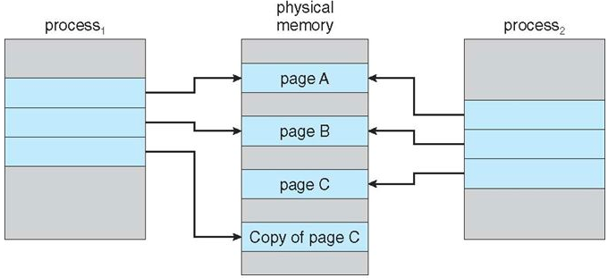
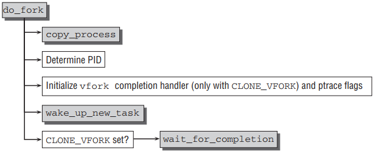
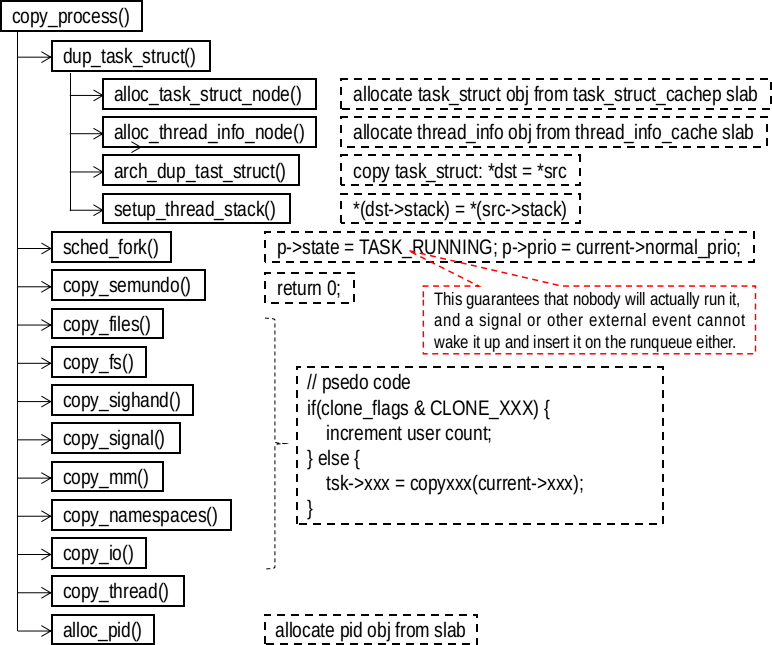

# fork() 系统调用
## 写时拷贝（Copy-on-Write，COW）


fork() 的实现使用了写时拷贝，写时拷贝是一种可以推迟甚至免除数据拷贝的技术。在 fork() 调用返回后，内核此时并没有复制整个进程的地址空间，而是让父进程和子进程共享同一个页表，同时把这些页面标记为只读。当进程（可以是子进程或父进程）试图向某一页面写入数据的时候，它会收到写保护的错误。内核发现进程的写入行为之后，会为进程分配一个该页面的新副本，并将这个副本标记为可读、可写。也就是说，资源的复制只有在需要写入的时候才进行，在此之前，只是以只读方式共享。这种方式使得地址空间上的页的拷贝被推迟到实际发生写入的时候才进行。在页根本不会被写入的情况下（fork() 后立即调用 exec() 函数）不用进行无用的拷贝。

### fork 、vfork()、clone()
fork() 通过复制调用者进程来数据创建一个进程。新创建的进程称为子进程，调用者进程称为父进程。虽然在 fork() 返回的时刻父子进程的内存空间（虚拟地址空间）的内容一样，但是他们运行在独立的内存空间，内存读写、文件映射 mmap()、文件解映射 munmap() 操作不会影响到对方。

子进程不会复制父进程下列内容
- 子进程有自己的进程 ID
- 子进程的父进程 ID 是父进程的 ID
- 子进程不会继承父进程的内存锁（mlock() 或 mlockall()，允许程序在内存上锁住它的部分或全部地址空间，阻止系统将这些内存页调度到交换空间）
- 子进程程未决信号集初始为空
- 子进程不继承父进程的记录锁 fcntl()
- 子进程不进程父进程的计时器

特别地，需要注意的是
- 子进程继承父进程的互斥量、条件变量
- 子进程继承父进程打开的文件描述符
- 子进程继承父进程的消息队列

vfork() 和 fork() 的作用一样，创建一个子进程。但是 vfork() 则是除了 tast_struct 对象和系统空间堆栈，其他资源全部通过数据结构指针的复制的方式共享。所以，除了修改子进程 `pid_t` 类型的数据，其他任何数据的写该都是未定义。vfork() 主要用于创建一个进程，然后立即调用 execve() 加载其他程序运行。此外，与 fork() 不同的是，vfork() 调用后，父进程阻塞直到子进程终止或者子进程调用 execve()，再那之前，子进程共享父进程的所有内存内容，包括堆栈。

clone() 也是创建一个线程，与 fork() 不同的是，clone() 允许子进程共享父进程的部分上下文，包括内存空间、文件描述符表、信号表。clone() 是为了支持线程，一个进程的多个线程在一个共享的内存空间中并发地执行。

fork() 、vfork()、clone() 三个都是调用 do_fork() 完成工作，只是传入了不同的标志。
```
/// @file kernel/fork.c
1672 SYSCALL_DEFINE0(fork)
1673 {
1674 #ifdef CONFIG_MMU
1675     return do_fork(SIGCHLD, 0, 0, NULL, NULL);
1676 #else
1677     /* can not support in nommu mode */
1678     return -EINVAL;
1679 #endif
1680 }

1684 SYSCALL_DEFINE0(vfork)
1685 {
1686     return do_fork(CLONE_VFORK | CLONE_VM | SIGCHLD, 0,
1687             0, NULL, NULL);
1688 }

1709 SYSCALL_DEFINE5(clone, unsigned long, clone_flags, unsigned long, newsp,
1710          int __user *, parent_tidptr,
1711          int __user *, child_tidptr,
1712          int, tls_val)
1714 {
1715     return do_fork(clone_flags, newsp, 0, parent_tidptr, child_tidptr);
1716 }
```
常用的标志有

|标志|含义|
|:-|:-|
|CLONE_FILES|父子进程共享打开的文件|
|CLONE_FS|父子进程共享根目录、工作目录、umask|
|CLONE_IO|共享 IO 上下文？？|
|CLONE_NEWNS|为子进程创建新的命名空间|
|CLONE_PARENT|指定子进程与父进程拥有同一个父进程|
|CLONE_PTRACE|继续调试子进程|
|CLONE_SETTID|将 TID 写回至用户空间|
|CLONE_SETTLS|为子进程创建新的 TLS（Thread-Local Storage）|
|CLONE_SIGHAND|父子进程共享信号处理函数及被阻塞的信号|
|CLONE_SYSVSEM|父子进程共享 System V SEM_UNDO 语义|
|CLONE_STOP|以 STAK_STOP 开始进程|
|CLONE_VFORK|调用 vfork()，父进程准备睡眠等待子进程将其唤醒|
|CLONE_UNTRACED|防止跟踪子进程上强制执行 CLONE_PTRACE|
|CLONE_VM|父子进程共享地址空间|

###  task_struct 对象的成员信息
- 调度参数：进程优先级、最近消耗的 CPU 时间、最近睡眠时间
- 内存映射：指向代码、数据、堆栈段或页表的指针，如果代码段是共享的，代码指针指向共享代码表
- 信号：掩码显示了哪些信号被忽略、哪些信号需要被捕捉、哪些信号被暂时阻塞以及哪些信号在传递中
- 机器寄存器：当内核陷进发生时，机器寄存器的内容会被保存
- 系统调用状态：关于当前系统调用的信息，包括参数和返回值
- 文件描述符表
- 统计数据：指向记录用户、进程占用系统CPU时间的表的指针
- 内核堆栈：进程的内核部分可以使用的固定堆栈
- 其他：当前进程状态、正在等待的事件、距离警报时钟超时的时间、PID、父进程 PID、用户标识符、组标识符等

### do_fork()


```
/// @file kernel/fork.c
1592 long do_fork(unsigned long clone_flags,
1593           unsigned long stack_start,
1594           unsigned long stack_size,
1595           int __user *parent_tidptr,
1596           int __user *child_tidptr)
1597 {
1598     struct task_struct *p;
1599     int trace = 0;
1600     long nr;
1601 
1602     /*
1603      * Determine whether and which event to report to ptracer.  When
1604      * called from kernel_thread or CLONE_UNTRACED is explicitly
1605      * requested, no event is reported; otherwise, report if the event
1606      * for the type of forking is enabled.
1607      */
1608     if (!(clone_flags & CLONE_UNTRACED)) {
1609         if (clone_flags & CLONE_VFORK)
1610             trace = PTRACE_EVENT_VFORK;
1611         else if ((clone_flags & CSIGNAL) != SIGCHLD)
1612             trace = PTRACE_EVENT_CLONE;
1613         else
1614             trace = PTRACE_EVENT_FORK;
1615 
1616         if (likely(!ptrace_event_enabled(current, trace)))
1617             trace = 0;
1618     }
1619 
1620     p = copy_process(clone_flags, stack_start, stack_size,
1621              child_tidptr, NULL, trace);
1622     /*
1623      * Do this prior waking up the new thread - the thread pointer
1624      * might get invalid after that point, if the thread exits quickly.
1625      */
1626     if (!IS_ERR(p)) {
1627         struct completion vfork;
1628         struct pid *pid;
1629 
1630         trace_sched_process_fork(current, p);
1631 
1632         pid = get_task_pid(p, PIDTYPE_PID); // 获取pid对象
1633         nr = pid_vnr(pid); // 转换为数字ID
1634 
1635         if (clone_flags & CLONE_PARENT_SETTID)
1636             put_user(nr, parent_tidptr);
1637 
1638         if (clone_flags & CLONE_VFORK) {
1639             p->vfork_done = &vfork;
1640             init_completion(&vfork);
1641             get_task_struct(p);
1642         }
1643 
1644         wake_up_new_task(p); // 唤醒子进程
1645 
1646         /* forking complete and child started to run, tell ptracer */
1647         if (unlikely(trace))
1648             ptrace_event_pid(trace, pid);
1649 
1650         if (clone_flags & CLONE_VFORK) { // 如果是CLONE_VFORK
1651             if (!wait_for_vfork_done(p, &vfork)) // 等待子进程终止
1652                 ptrace_event_pid(PTRACE_EVENT_VFORK_DONE, pid);
1653         }
1654 
1655         put_pid(pid);
1656     } else {
1657         nr = PTR_ERR(p);
1658     }
1659     return nr;
1660 }
```

### copy_process()


``` 
/// @file kernel/fork.c
1139 static struct task_struct *copy_process(unsigned long clone_flags,
1140                     unsigned long stack_start,
1141                     unsigned long stack_size,
1142                     int __user *child_tidptr,
1143                     struct pid *pid,
1144                     int trace)
1145 {
1146     int retval;
1147     struct task_struct *p;
1148 
1149     if ((clone_flags & (CLONE_NEWNS|CLONE_FS)) == (CLONE_NEWNS|CLONE_FS))
1150         return ERR_PTR(-EINVAL);
1151 
1152     if ((clone_flags & (CLONE_NEWUSER|CLONE_FS)) == (CLONE_NEWUSER|CLONE_FS))
1153         return ERR_PTR(-EINVAL);
1154 
1155     /*
1156      * Thread groups must share signals as well, and detached threads
1157      * can only be started up within the thread group.
1158      */
1159     if ((clone_flags & CLONE_THREAD) && !(clone_flags & CLONE_SIGHAND))
1160         return ERR_PTR(-EINVAL);
1161 
1162     /*
1163      * Shared signal handlers imply shared VM. By way of the above,
1164      * thread groups also imply shared VM. Blocking this case allows
1165      * for various simplifications in other code.
1166      */
1167     if ((clone_flags & CLONE_SIGHAND) && !(clone_flags & CLONE_VM))
1168         return ERR_PTR(-EINVAL);
1169 
1170     /*
1171      * Siblings of global init remain as zombies on exit since they are
1172      * not reaped by their parent (swapper). To solve this and to avoid
1173      * multi-rooted process trees, prevent global and container-inits
1174      * from creating siblings.
1175      */
1176     if ((clone_flags & CLONE_PARENT) &&
1177                 current->signal->flags & SIGNAL_UNKILLABLE)
1178         return ERR_PTR(-EINVAL);
1179 
1180     /*
1181      * If the new process will be in a different pid or user namespace
1182      * do not allow it to share a thread group or signal handlers or
1183      * parent with the forking task.
1184      */
1185     if (clone_flags & CLONE_SIGHAND) {
1186         if ((clone_flags & (CLONE_NEWUSER | CLONE_NEWPID)) ||
1187             (task_active_pid_ns(current) !=
1188                 current->nsproxy->pid_ns_for_children))
1189             return ERR_PTR(-EINVAL);
1190     }
1191 
1192     retval = security_task_create(clone_flags);
1193     if (retval)
1194         goto fork_out;
1195 
1196     retval = -ENOMEM;
1197     p = dup_task_struct(current);
1198     if (!p)
1199         goto fork_out;
1200 
1201     ftrace_graph_init_task(p);
1202     get_seccomp_filter(p);
1203 
1204     rt_mutex_init_task(p);
1205 
1206 #ifdef CONFIG_PROVE_LOCKING
1207     DEBUG_LOCKS_WARN_ON(!p->hardirqs_enabled);
1208     DEBUG_LOCKS_WARN_ON(!p->softirqs_enabled);
1209 #endif
1210     retval = -EAGAIN;
1211     if (atomic_read(&p->real_cred->user->processes) >=
1212             task_rlimit(p, RLIMIT_NPROC)) {
1213         if (p->real_cred->user != INIT_USER &&
1214             !capable(CAP_SYS_RESOURCE) && !capable(CAP_SYS_ADMIN))
1215             goto bad_fork_free;
1216     }
1217     current->flags &= ~PF_NPROC_EXCEEDED;
1218 
1219     retval = copy_creds(p, clone_flags);
1220     if (retval < 0)
1221         goto bad_fork_free;
1222 
1223     /*
1224      * If multiple threads are within copy_process(), then this check
1225      * triggers too late. This doesn't hurt, the check is only there
1226      * to stop root fork bombs.
1227      */
1228     retval = -EAGAIN;
1229     if (nr_threads >= max_threads)
1230         goto bad_fork_cleanup_count;
1231 
1232     if (!try_module_get(task_thread_info(p)->exec_domain->module))
1233         goto bad_fork_cleanup_count;
1234 
1235     delayacct_tsk_init(p);  /* Must remain after dup_task_struct() */
1236     p->flags &= ~(PF_SUPERPRIV | PF_WQ_WORKER);
1237     p->flags |= PF_FORKNOEXEC;
1238     INIT_LIST_HEAD(&p->children);
1239     INIT_LIST_HEAD(&p->sibling);
1240     rcu_copy_process(p);
1241     p->vfork_done = NULL;
1242     spin_lock_init(&p->alloc_lock);
1243 
1244     init_sigpending(&p->pending);
1245 
1246     p->utime = p->stime = p->gtime = 0;
1247     p->utimescaled = p->stimescaled = 0;
1248 #ifndef CONFIG_VIRT_CPU_ACCOUNTING_NATIVE
1249     p->prev_cputime.utime = p->prev_cputime.stime = 0;
1250 #endif
1251 #ifdef CONFIG_VIRT_CPU_ACCOUNTING_GEN
1252     seqlock_init(&p->vtime_seqlock);
1253     p->vtime_snap = 0;
1254     p->vtime_snap_whence = VTIME_SLEEPING;
1255 #endif
1256 
1257 #if defined(SPLIT_RSS_COUNTING)
1258     memset(&p->rss_stat, 0, sizeof(p->rss_stat));
1259 #endif
1260 
1261     p->default_timer_slack_ns = current->timer_slack_ns;
1262 
1263     task_io_accounting_init(&p->ioac);
1264     acct_clear_integrals(p);
1265 
1266     posix_cpu_timers_init(p);
1267 
1268     p->io_context = NULL;
1269     p->audit_context = NULL;
1270     if (clone_flags & CLONE_THREAD)
1271         threadgroup_change_begin(current);
1272     cgroup_fork(p);
1273 #ifdef CONFIG_NUMA
1274     p->mempolicy = mpol_dup(p->mempolicy);
1275     if (IS_ERR(p->mempolicy)) {
1276         retval = PTR_ERR(p->mempolicy);
1277         p->mempolicy = NULL;
1278         goto bad_fork_cleanup_threadgroup_lock;
1279     }
1280 #endif
1281 #ifdef CONFIG_CPUSETS
1282     p->cpuset_mem_spread_rotor = NUMA_NO_NODE;
1283     p->cpuset_slab_spread_rotor = NUMA_NO_NODE;
1284     seqcount_init(&p->mems_allowed_seq);
1285 #endif
1286 #ifdef CONFIG_TRACE_IRQFLAGS
1287     p->irq_events = 0;
1288     p->hardirqs_enabled = 0;
1289     p->hardirq_enable_ip = 0;
1290     p->hardirq_enable_event = 0;
1291     p->hardirq_disable_ip = _THIS_IP_;
1292     p->hardirq_disable_event = 0;
1293     p->softirqs_enabled = 1;
1294     p->softirq_enable_ip = _THIS_IP_;
1295     p->softirq_enable_event = 0;
1296     p->softirq_disable_ip = 0;
1297     p->softirq_disable_event = 0;
1298     p->hardirq_context = 0;
1299     p->softirq_context = 0;
1300 #endif
1301 #ifdef CONFIG_LOCKDEP
1302     p->lockdep_depth = 0; /* no locks held yet */
1303     p->curr_chain_key = 0;
1304     p->lockdep_recursion = 0;
1305 #endif
1306 
1307 #ifdef CONFIG_DEBUG_MUTEXES
1308     p->blocked_on = NULL; /* not blocked yet */
1309 #endif
1310 #ifdef CONFIG_MEMCG
1311     p->memcg_batch.do_batch = 0;
1312     p->memcg_batch.memcg = NULL;
1313 #endif
1314 #ifdef CONFIG_BCACHE
1315     p->sequential_io    = 0;
1316     p->sequential_io_avg    = 0;
1317 #endif
1318 
1319     /* Perform scheduler related setup. Assign this task to a CPU. */
1320     retval = sched_fork(clone_flags, p);
1321     if (retval)
1322         goto bad_fork_cleanup_policy;
1323 
1324     retval = perf_event_init_task(p);
1325     if (retval)
1326         goto bad_fork_cleanup_policy;
1327     retval = audit_alloc(p);
1328     if (retval)
1329         goto bad_fork_cleanup_perf;
1330     /* copy all the process information */
1331     retval = copy_semundo(clone_flags, p);
1332     if (retval)
1333         goto bad_fork_cleanup_audit;
1334     retval = copy_files(clone_flags, p);
1335     if (retval)
1336         goto bad_fork_cleanup_semundo;
1337     retval = copy_fs(clone_flags, p);
1338     if (retval)
1339         goto bad_fork_cleanup_files;
1340     retval = copy_sighand(clone_flags, p);
1341     if (retval)
1342         goto bad_fork_cleanup_fs;
1343     retval = copy_signal(clone_flags, p);
1344     if (retval)
1345         goto bad_fork_cleanup_sighand;
1346     retval = copy_mm(clone_flags, p);
1347     if (retval)
1348         goto bad_fork_cleanup_signal;
1349     retval = copy_namespaces(clone_flags, p);
1350     if (retval)
1351         goto bad_fork_cleanup_mm;
1352     retval = copy_io(clone_flags, p);
1353     if (retval)
1354         goto bad_fork_cleanup_namespaces;
1355     retval = copy_thread(clone_flags, stack_start, stack_size, p);
1356     if (retval)
1357         goto bad_fork_cleanup_io;
1358 
1359     if (pid != &init_struct_pid) {
1360         retval = -ENOMEM;
1361         pid = alloc_pid(p->nsproxy->pid_ns_for_children);
1362         if (!pid)
1363             goto bad_fork_cleanup_io;
1364     }
1365 
1366     p->set_child_tid = (clone_flags & CLONE_CHILD_SETTID) ? child_tidptr : NULL;
1367     /*
1368      * Clear TID on mm_release()?
1369      */
1370     p->clear_child_tid = (clone_flags & CLONE_CHILD_CLEARTID) ? child_tidptr : NULL;
1371 #ifdef CONFIG_BLOCK
1372     p->plug = NULL;
1373 #endif
1374 #ifdef CONFIG_FUTEX
1375     p->robust_list = NULL;
1376 #ifdef CONFIG_COMPAT
1377     p->compat_robust_list = NULL;
1378 #endif
1379     INIT_LIST_HEAD(&p->pi_state_list);
1380     p->pi_state_cache = NULL;
1381 #endif
1382     /*
1383      * sigaltstack should be cleared when sharing the same VM
1384      */
1385     if ((clone_flags & (CLONE_VM|CLONE_VFORK)) == CLONE_VM)
1386         p->sas_ss_sp = p->sas_ss_size = 0;
1387 
1388     /*
1389      * Syscall tracing and stepping should be turned off in the
1390      * child regardless of CLONE_PTRACE.
1391      */
1392     user_disable_single_step(p);
1393     clear_tsk_thread_flag(p, TIF_SYSCALL_TRACE);
1394 #ifdef TIF_SYSCALL_EMU
1395     clear_tsk_thread_flag(p, TIF_SYSCALL_EMU);
1396 #endif
1397     clear_all_latency_tracing(p);
1398 
1399     /* ok, now we should be set up.. */
1400     p->pid = pid_nr(pid);
1401     if (clone_flags & CLONE_THREAD) {
1402         p->exit_signal = -1;
1403         p->group_leader = current->group_leader;
1404         p->tgid = current->tgid;
1405     } else {
1406         if (clone_flags & CLONE_PARENT)
1407             p->exit_signal = current->group_leader->exit_signal;
1408         else
1409             p->exit_signal = (clone_flags & CSIGNAL);
1410         p->group_leader = p;
1411         p->tgid = p->pid;
1412     }
1413 
1414     p->nr_dirtied = 0;
1415     p->nr_dirtied_pause = 128 >> (PAGE_SHIFT - 10);
1416     p->dirty_paused_when = 0;
1417 
1418     p->pdeath_signal = 0;
1419     INIT_LIST_HEAD(&p->thread_group);
1420     p->task_works = NULL;
1421 
1422     /*
1423      * From this point on we must avoid any synchronous user-space
1424      * communication until we take the tasklist-lock. In particular, we do
1425      * not want user-space to be able to predict the process start-time by
1426      * stalling fork(2) after we recorded the start_time but before it is
1427      * visible to the system.
1428      */
1429
1430     do_posix_clock_monotonic_gettime(&p->start_time);
1431     p->real_start_time = p->start_time;
1432     monotonic_to_bootbased(&p->real_start_time);
1433 
1434     /*
1435      * Make it visible to the rest of the system, but dont wake it up yet.
1436      * Need tasklist lock for parent etc handling!
1437      */
1438     write_lock_irq(&tasklist_lock);
1439 
1440     /* CLONE_PARENT re-uses the old parent */
1441     if (clone_flags & (CLONE_PARENT|CLONE_THREAD)) {
1442         p->real_parent = current->real_parent;
1443         p->parent_exec_id = current->parent_exec_id;
1444     } else {
1445         p->real_parent = current;
1446         p->parent_exec_id = current->self_exec_id;
1447     }
1448 
1449     spin_lock(&current->sighand->siglock);
1450 
1451     /*
1452      * Process group and session signals need to be delivered to just the
1453      * parent before the fork or both the parent and the child after the
1454      * fork. Restart if a signal comes in before we add the new process to
1455      * it's process group.
1456      * A fatal signal pending means that current will exit, so the new
1457      * thread can't slip out of an OOM kill (or normal SIGKILL).
1458     */
1459     recalc_sigpending();
1460     if (signal_pending(current)) {
1461         retval = -ERESTARTNOINTR;
1462         goto bad_fork_free_pid;
1463     }
1464     if (unlikely(!(ns_of_pid(pid)->nr_hashed & PIDNS_HASH_ADDING))) {
1465         retval = -ENOMEM;
1466         goto bad_fork_free_pid;
1467     }
1468 
1469     if (likely(p->pid)) {
1470         ptrace_init_task(p, (clone_flags & CLONE_PTRACE) || trace);
1471 
1472         init_task_pid(p, PIDTYPE_PID, pid);
1473         if (thread_group_leader(p)) {
1474             init_task_pid(p, PIDTYPE_PGID, task_pgrp(current));
1475             init_task_pid(p, PIDTYPE_SID, task_session(current));
1476 
1477             if (is_child_reaper(pid)) {
1478                 ns_of_pid(pid)->child_reaper = p;
1479                 p->signal->flags |= SIGNAL_UNKILLABLE;
1480             }
1481 
1482             p->signal->leader_pid = pid;
1483             p->signal->tty = tty_kref_get(current->signal->tty);
1484             list_add_tail(&p->sibling, &p->real_parent->children);
1485             list_add_tail_rcu(&p->tasks, &init_task.tasks);
1486             attach_pid(p, PIDTYPE_PGID);
1487             attach_pid(p, PIDTYPE_SID);
1488             __this_cpu_inc(process_counts);
1489         } else {
1490             current->signal->nr_threads++;
1491             atomic_inc(&current->signal->live);
1492             atomic_inc(&current->signal->sigcnt);
1493             list_add_tail_rcu(&p->thread_group,
1494                       &p->group_leader->thread_group);
1495             list_add_tail_rcu(&p->thread_node,
1496                       &p->signal->thread_head);
1497         }
1498         attach_pid(p, PIDTYPE_PID);
1499         nr_threads++;
1500     }
1501 
1502     total_forks++;
1503     spin_unlock(&current->sighand->siglock);
1504     syscall_tracepoint_update(p);
1505     write_unlock_irq(&tasklist_lock);
1506 
1507     proc_fork_connector(p);
1508     cgroup_post_fork(p);
1509     if (clone_flags & CLONE_THREAD)
1510         threadgroup_change_end(current);
1511     perf_event_fork(p);
1512 
1513     trace_task_newtask(p, clone_flags);
1514     uprobe_copy_process(p, clone_flags);
1515 
1516     return p;
//...
```