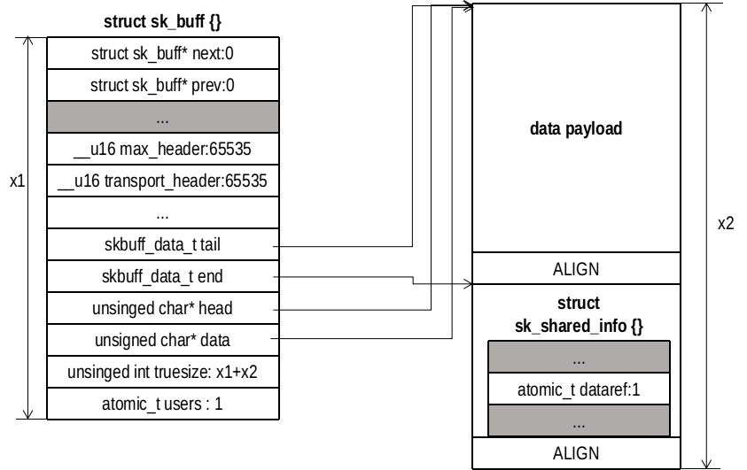

# Linux网络实现之 SKB

## 套接字缓存 sk_buff 结构
sk_buff 是 Linux 内核用于管理网络数据包的缓冲结构，当其在不同网络协议层之间传递的时候，只需要附加特定的头部信息，不用拷贝数据，减少了拷贝带来的开销。每次分配都分配两个部分，一个是固定大小的 sk_buff 对象，一个是存储数据的缓冲区。
```
/// @file include/linux/skbuff.h 
485 struct sk_buff {
486     /* These two members must be first. */
487     struct sk_buff          *next;                      // 链表中下一个 sk_buff
488     struct sk_buff          *prev;                      // 链表中前一个 sk_buff
489 
490     union {
491         ktime_t              tstamp;                    // 到达或离开时间
492         struct skb_mstamp    skb_mstamp;
493     };
494 
495     struct sock             *sk;                        // 所属 sock
496     struct net_device       *dev;                       // 到达或离开的硬件

504     char                     cb[48] __aligned(8);       // 控制数据，存放私有数据
505 
506     unsigned long           _skb_refdst;                // 目的条目（路由表）
507 #ifdef CONFIG_XFRM
508     struct  sec_path        *sp;                        // 安全路径？？
509 #endif
510     unsigned int             len,                       // 数据长度（包括头部）
511                              data_len;                  // 数据长度（不包括头部）
512     __u16                    mac_len,                   // 链路层头部长度
513                              hdr_len;                   // cloned skb 的可写头部长度
514     union {
515         __wsum               csum;                      // 校验和
516         struct {
517             __u16            csum_start;                // 校验和开始偏移值（skb->head）
518             __u16            csum_offset;               // 校验和结束偏移值
519         };
520     };
521     __u32                    priority;                  // 数据入队优先级
522     kmemcheck_bitfield_begin(flags1);
523     __u8                     ignore_df:1,               // 允许局部碎片
524                              cloned:1,                  // 头部必须 clone
525                              ip_summed:2,               // IP 分组校验和状态
526                              nohdr:1,                   // 不允许修改头部
527                              nfctinfo:3; // 
528     __u8                     pkt_type:3,
529                              fclone:2,                  // skbuff 克隆状态
530                              ipvs_property:1,           // skbuff 被 ipvs 拥有
531                              peeked:1,                  // 是否已经查看
532                              nf_trace:1;
533     kmemcheck_bitfield_end(flags1);
534     __be16                   protocol;                  // 协议？？
535 
536     void            (*destructor)(struct sk_buff *skb); // 析构函数
537 #if defined(CONFIG_NF_CONNTRACK) || defined(CONFIG_NF_CONNTRACK_MODULE)
538     struct nf_conntrack     *nfct; 
539 #endif
540 #ifdef CONFIG_BRIDGE_NETFILTER
541     struct nf_bridge_info   *nf_bridge;
542 #endif
543 
544     int                      skb_iif;                   // 到达设备的 ifindex
545 
546     __u32                    hash;                      // 分组的哈希值
547 
548     __be16                   vlan_proto;
549     __u16                    vlan_tci;
550 
551 #ifdef CONFIG_NET_SCHED
552     __u16                    tc_index;                  // 拥塞控制 index
553 #ifdef CONFIG_NET_CLS_ACT
554     __u16                    tc_verd;                   // 拥塞控制 verdict */
555 #endif
556 #endif
557 
558     __u16                    queue_mapping;
559     kmemcheck_bitfield_begin(flags2);
560 #ifdef CONFIG_IPV6_NDISC_NODETYPE
561     __u8                     ndisc_nodetype:2;          // 路由类型
562 #endif
563     __u8                     pfmemalloc:1;
564     __u8                     ooo_okay:1;
565     __u8                     l4_hash:1;
566     __u8                     wifi_acked_valid:1;
567     __u8                     wifi_acked:1;
568     __u8                     no_fcs:1;
569     __u8                     head_frag:1;
575     __u8                     encapsulation:1;
576     __u8                     encap_hdr_csum:1;
577     __u8                     csum_valid:1;
578     __u8                     csum_complete_sw:1;
579     /* 3/5 bit hole (depending on ndisc_nodetype presence) */
580     kmemcheck_bitfield_end(flags2);
581 
582 #if defined CONFIG_NET_DMA || defined CONFIG_NET_RX_BUSY_POLL
583     union {
584         unsigned int         napi_id;
585         dma_cookie_t         dma_cookie;
586     };
587 #endif
588 #ifdef CONFIG_NETWORK_SECMARK
589     __u32                    secmark;
590 #endif
591     union {
592         __u32                mark;
593         __u32                dropcount;
594         __u32                reserved_tailroom;
595     };
596 
597     __be16                   inner_protocol;            // 协议
598     __u16                    inner_transport_header;    // 传输层头部（封装）
599     __u16                    inner_network_header;      // 网络层头部（封装）
600     __u16                    inner_mac_header;          // 链路层头部（封装）
601     __u16                    transport_header;          // 传输层头部
602     __u16                    network_header;            // 网络层头部
603     __u16                    mac_header;                // 链路层头部
604     /* These elements must be at the end, see alloc_skb() for details.  */
605     sk_buff_data_t           tail;
606     sk_buff_data_t           end;
607     unsigned char           *head,                      // 缓冲头部
608                             *data;                      // 缓冲数据
609     unsigned int             truesize;                  // sk_buff 的大小加数据的大小
610     atomic_t                 users;                     // 引用计数
611 };
```
成员详细含义，后面分析

### skb_shared_info
用于管理碎片式缓冲区，用于支持发送的数据不要求都在一段连续的内存。
```
/// @file include/linux/skbuff.h
167 #if (65536/PAGE_SIZE + 1) < 16
168 #define MAX_SKB_FRAGS 16UL
169 #else
170 #define MAX_SKB_FRAGS (65536/PAGE_SIZE + 1)
171 #endif

281 struct skb_shared_info {
282     unsigned char    nr_frags;
283     __u8             tx_flags;
284     unsigned short   gso_size;
285     /* Warning: this field is not always filled in (UFO)! */
286     unsigned short   gso_segs;
287     unsigned short   gso_type;
288     struct sk_buff  *frag_list;
289     struct skb_shared_hwtstamps hwtstamps;
290     __be32           ip6_frag_id;
291 
292     /*
293      * Warning : all fields before dataref are cleared in __alloc_skb()
294      */
295     atomic_t         dataref;
296 
297     /* Intermediate layers must ensure that destructor_arg
298      * remains valid until skb destructor */
299     void *           destructor_arg;
300 
301     /* must be last field, see pskb_expand_head() */
302     skb_frag_t       frags[MAX_SKB_FRAGS];
303 };
```

### sk_buff 链表
```
/// @file include/linux/skbuff.h 
149 struct sk_buff_head {
150     /* These two members must be first. */
151     struct sk_buff  *next;
152     struct sk_buff  *prev;
153 
154     __u32            qlen; // 链表中sk_buff的数目
155     spinlock_t       lock;
156 };
```


### SLAB 分配器设置
有两个跟 sk_buff 对象分配有关的 SLAB（可以在 /sys/kernel/slab 中找到），他们在 skb_init() 中被创建
```
/// @file net/core/skbuff.c
3260 void __init skb_init(void)
3261 {
3262     skbuff_head_cache = kmem_cache_create("skbuff_head_cache",
3263                           sizeof(struct sk_buff),
3264                           0,
3265                           SLAB_HWCACHE_ALIGN|SLAB_PANIC,
3266                           NULL);
3267     skbuff_fclone_cache = kmem_cache_create("skbuff_fclone_cache",
3268                         (2*sizeof(struct sk_buff)) +
3269                         sizeof(atomic_t),
3270                         0,
3271                         SLAB_HWCACHE_ALIGN|SLAB_PANIC,
3272                         NULL);
3273 }
```
skbuff_head_cache 一次分配一个 sk_buff 对象，多数情况下都是从这里分配一个 sk_buff 对象。skbuff_fclone_cache 用于处理在分配 sk_buff 就可以预见可能被克隆的情况，一次就分配两个对象和一个引用计数。多分出的一个 sk_buff 对象用于处理将来的克隆操作。引用计数表示分配两个对象被使用的数目，取值 0，1，2。

### 分配 SKB
#### alloc_skb()
alloc_skb() 是对函数 `__alloc_skb()` 的包装。从 skbuff_head_cache 中分配对象
```
/// @file include/linux/skbuff.h
730 static inline struct sk_buff *alloc_skb(unsigned int size,
731                     gfp_t priority)
732 {
733     return __alloc_skb(size, priority, 0, NUMA_NO_NODE);
734 }
```
参数说明
- size：数据缓冲区的大小，将来用于存放各种头部、数据
- priority：SLAB 分配方式

#### `__alloc_skb()`
`__alloc_skb()` 支持从 skbuff_head_cache 或 skbuff_fclone_cache 中分配对象，有 flag 控制。参数 node 用于支持 NUMA（忽略）
```
/// @file net/core/skbuff.c
200 struct sk_buff *__alloc_skb(unsigned int size, gfp_t gfp_mask,
201                 int flags, int node)
202 {
203     struct kmem_cache *cache;
204     struct skb_shared_info *shinfo;
205     struct sk_buff *skb;
206     u8 *data;
207     bool pfmemalloc;
```
首先根据 flag 参数找到目的 SLAB 分配器。然后从中分配 skb_buff 对象。
```
/// @file net/core/skbuff.c
209     cache = (flags & SKB_ALLOC_FCLONE)
210         ? skbuff_fclone_cache : skbuff_head_cache;
211 
212     if (sk_memalloc_socks() && (flags & SKB_ALLOC_RX))
213         gfp_mask |= __GFP_MEMALLOC;
214 
215     /* Get the HEAD */
216     skb = kmem_cache_alloc_node(cache, gfp_mask & ~__GFP_DMA, node);
217     if (!skb)
218         goto out;
219     prefetchw(skb);
```
接下来分配数据缓冲区（大小要进行数据对齐，目的是配合高速缓冲存储器，提高存取效率）。
```
/// @file net/core/skbuff.c
221     /* We do our best to align skb_shared_info on a separate cache
222      * line. It usually works because kmalloc(X > SMP_CACHE_BYTES) gives
223      * aligned memory blocks, unless SLUB/SLAB debug is enabled.
224      * Both skb->head and skb_shared_info are cache line aligned.
225      */
226     size = SKB_DATA_ALIGN(size);
227     size += SKB_DATA_ALIGN(sizeof(struct skb_shared_info));
228     data = kmalloc_reserve(size, gfp_mask, node, &pfmemalloc);
229     if (!data)
230         goto nodata;
231     /* kmalloc(size) might give us more room than requested.
232      * Put skb_shared_info exactly at the end of allocated zone,
233      * to allow max possible filling before reallocation.
234      */
235     size = SKB_WITH_OVERHEAD(ksize(data));
236     prefetchw(data + size);
```
最后设置 sk_buff 相关成员。首先是几个宏定义
```
/// @file include/linux/skbuff.h
115 #define SKB_DATA_ALIGN(X)   (((X) + (SMP_CACHE_BYTES - 1)) & \
116                  ~(SMP_CACHE_BYTES - 1))
117 #define SKB_WITH_OVERHEAD(X)    \
118     ((X) - SKB_DATA_ALIGN(sizeof(struct skb_shared_info)))

125 #define SKB_TRUESIZE(X) ((X) +                      \
126              SKB_DATA_ALIGN(sizeof(struct sk_buff)) +   \
127              SKB_DATA_ALIGN(sizeof(struct skb_shared_info)))
```
所以到目前位置，size 变量的值为 226 行时的结果。在 235，从 size 减去了 227 行加上的部分。
```
/// @file net/core/skbuff.c
238     /*
239      * Only clear those fields we need to clear, not those that we will
240      * actually initialise below. Hence, don't put any more fields after
241      * the tail pointer in struct sk_buff!
242      */
243     memset(skb, 0, offsetof(struct sk_buff, tail)); // sk_buff清零
244     /* Account for allocated memory : skb + skb->head */
245     skb->truesize = SKB_TRUESIZE(size); // 分配的内存之和
246     skb->pfmemalloc = pfmemalloc; // 设置 PF_MEMALLOC 标志
247     atomic_set(&skb->users, 1); // 引用计数此时为 1
248     skb->head = data; // 没有任何头部，data 为数据缓冲区起始地址;
249     skb->data = data; 
250     skb_reset_tail_pointer(skb); // skb->tail = skb->data;
251     skb->end = skb->tail + size;
252     skb->mac_header = (typeof(skb->mac_header))~0U; // 65535
253     skb->transport_header = (typeof(skb->transport_header))~0U; // 65535
254
255     /* make sure we initialize shinfo sequentially */
256     shinfo = skb_shinfo(skb);
257     memset(shinfo, 0, offsetof(struct skb_shared_info, dataref)); // 清零
258     atomic_set(&shinfo->dataref, 1); // 引用计数
259     kmemcheck_annotate_variable(shinfo->destructor_arg);
260 
261     if (flags & SKB_ALLOC_FCLONE) {
262         struct sk_buff *child = skb + 1; // 另一个sk_buff的地址
263         atomic_t *fclone_ref = (atomic_t *) (child + 1); // 引用计数的地址
264 
265         kmemcheck_annotate_bitfield(child, flags1);
266         kmemcheck_annotate_bitfield(child, flags2);
267         skb->fclone = SKB_FCLONE_ORIG; // 设置已经有克隆的 sk_buff 预备
268         atomic_set(fclone_ref, 1); // 只使用了一个
269 
270         child->fclone = SKB_FCLONE_UNAVAILABLE; // 孩子的没有被使用
271         child->pfmemalloc = pfmemalloc; // 设置 PF_MEMALLOC 标志
272     }
273 out:
274     return skb;
275 nodata:
276     kmem_cache_free(cache, skb);
277     skb = NULL;
278     goto out;
279 }
```


### 释放 SKB


调用 kfree_skb() 释放 sk_buff 对象。只有当引用计数 sk_buff::users 减为 1 才会回收。

```
/// @file net/core/skbuff.c
634 void kfree_skb(struct sk_buff *skb)
635 {
636     if (unlikely(!skb))
637         return;
638     if (likely(atomic_read(&skb->users) == 1))
639         smp_rmb();
640     else if (likely(!atomic_dec_and_test(&skb->users)))
641         return;
642     trace_kfree_skb(skb, __builtin_return_address(0));
643     __kfree_skb(skb); // 引用计数减为0，回收sk_buff
644 }
```
`__kfree_skb()` 函数比较简单
```
/// @file net/core/skbuff.c
620 void __kfree_skb(struct sk_buff *skb)
621 {
622     skb_release_all(skb); // 释放数据缓冲区
623     kfree_skbmem(skb); // 释放 sk_buff 对象
624 }
```

### 数据预留和对齐
#### skb_reserve()
在数据缓冲区头部预留一定的空间，通常被用来在数据缓冲区中插入协议首部或者在某个边界上对齐。
```
/// @file include/linux/skbuff.h
1668 static inline void skb_reserve(struct sk_buff *skb, int len)
1669 {
1670     skb->data += len;
1671     skb->tail += len;
1672 }
```


#### skb_push()
在数据缓冲区的数据载荷部分预留空间，将来用来存放数据
```
/// @file net/core/skbuff.c
1317 unsigned char *skb_push(struct sk_buff *skb, unsigned int len)
1318 {
1319     skb->data -= len;
1320     skb->len  += len;
1321     if (unlikely(skb->data<skb->head))
1322         skb_under_panic(skb, len, __builtin_return_address(0));
1323     return skb->data;
1324 }
```


#### skb_pull()
修改 skb->data 指针，使之下移一定字节，忽略开头一定数据。
```
/// @file net/core/skbuff.c
1337 unsigned char *skb_pull(struct sk_buff *skb, unsigned int len)
1338 {
1339     return skb_pull_inline(skb, len);
1340 }

/// @file include/linux/skbuff.h
1586 static inline unsigned char *__skb_pull(struct sk_buff *skb, unsigned int len)
1587 {
1588     skb->len -= len;
1589     BUG_ON(skb->len < skb->data_len);
1590     return skb->data += len;
1591 }
1592 
1593 static inline unsigned char *skb_pull_inline(struct sk_buff *skb, unsigned int len)
1594 {
1595     return unlikely(len > skb->len) ? NULL : __skb_pull(skb, len);
```


#### skb_put()
修改 skb->tail 指针，使之下移一定字节。
```
/// @file net/core/skbuff.c
1296 unsigned char *skb_put(struct sk_buff *skb, unsigned int len)
1297 {
1298     unsigned char *tmp = skb_tail_pointer(skb);
1299     SKB_LINEAR_ASSERT(skb);
1300     skb->tail += len;
1301     skb->len  += len;
1302     if (unlikely(skb->tail > skb->end))
1303         skb_over_panic(skb, len, __builtin_return_address(0));
1304     return tmp;
1305 }
```


### 克隆和复制 SKB
#### skb_clone()
skb_clone() 只拷贝 sk_buff 对象而不拷贝数据缓冲区。当某些“用户”只是修改 sk_buff 对象中的某些字段值时，没有必要将数据缓冲区也拷贝一份，底层可以采用共享同一个数据缓冲区，减少不必要的数据拷贝。克隆必须增加数据缓冲区的引用计数，以免共享数据被提前释放。
```
/// @file net/core/skbuff.c
880 struct sk_buff *skb_clone(struct sk_buff *skb, gfp_t gfp_mask)
881 {
882     struct sk_buff *n;
883 
884     if (skb_orphan_frags(skb, gfp_mask))
885         return NULL;
886 
887     n = skb + 1;
888     if (skb->fclone == SKB_FCLONE_ORIG && // 有孩子
889         n->fclone == SKB_FCLONE_UNAVAILABLE) { // 孩子没被使用
890         atomic_t *fclone_ref = (atomic_t *) (n + 1); // 引用计数
891         n->fclone = SKB_FCLONE_CLONE; // 使用孩子，孩子现在分除去当作克隆对象
892         atomic_inc(fclone_ref); // 增加引用计数
893     } else { // 必须从skbuff_head_cache分配一个
894         if (skb_pfmemalloc(skb))
895             gfp_mask |= __GFP_MEMALLOC;
896 
897         n = kmem_cache_alloc(skbuff_head_cache, gfp_mask);
898         if (!n)
899             return NULL;
900 
901         kmemcheck_annotate_bitfield(n, flags1);
902         kmemcheck_annotate_bitfield(n, flags2);
903         n->fclone = SKB_FCLONE_UNAVAILABLE; // 设置状态，没有孩子
904     }
905 
906     return __skb_clone(n, skb); // 拷贝成员
907 }
```
调用 `__skb_clone()` 拷贝成员
```
/// @file net/core/skbuff.c
756 static struct sk_buff *__skb_clone(struct sk_buff *n, struct sk_buff *skb)
757 {
758 #define C(x) n->x = skb->x
759 
760     n->next = n->prev = NULL;
761     n->sk = NULL;
762     __copy_skb_header(n, skb);
763 
764     C(len);
765     C(data_len);
766     C(mac_len);
767     n->hdr_len = skb->nohdr ? skb_headroom(skb) : skb->hdr_len;
768     n->cloned = 1; // 克隆标志，不能修改数据
769     n->nohdr = 0;
770     n->peeked = 0;
771     C(pfmemalloc);
772     n->destructor = NULL;
773     C(tail);
774     C(end);
775     C(head);
776     C(head_frag);
777     C(data);
778     C(truesize);
779     atomic_set(&n->users, 1);
780 
781     atomic_inc(&(skb_shinfo(skb)->dataref));
782     skb->cloned = 1; // 克隆标志，不能修改数据
783 
784     return n;
785 #undef C
786 }
```
#### skb_copy()
skb_copy() 会拷贝 sk_buff 对象和数据缓冲区，完成拷贝后新旧 SKB 没有关联。
```
/// @file net/core/skbuff.c
958 struct sk_buff *skb_copy(const struct sk_buff *skb, gfp_t gfp_mask)
959 {
960     int headerlen = skb_headroom(skb); // 头部（未用空间）长度，不是报文头部总长度
961     unsigned int size = skb_end_offset(skb) + skb->data_len; // 见后面文件
962     struct sk_buff *n = __alloc_skb(size, gfp_mask,
963                     skb_alloc_rx_flag(skb), NUMA_NO_NODE); // 申请 SKB
964 
965     if (!n)
966         return NULL;
967 
968     /* Set the data pointer */
969     skb_reserve(n, headerlen); // skb->data += headerlen; skb->tail += headerlen
970     /* Set the tail pointer and length */
971     skb_put(n, skb->len); // skb->tail += skb->len
972     // 拷贝[skb->head, skb->tail)的数据到[n->head, n->tail)。并且拷贝 skb_shared_info 的数据
973     if (skb_copy_bits(skb, -headerlen, n->head, headerlen + skb->len))
974         BUG();
975 
976     copy_skb_header(n, skb); // 拷贝 sk_buff 和 skb_shared_info 的成员数据
977     return n;
978 }
```
961 行 skb_end_offset(skb) + skb->data_len 的含义：首先 skb_end_offset() 返回 skb->end - skb->head。skb->data_len 记录的是 skb_shared_info 中管理的数据字节数。

### 链表管理函数
#### skb_queue_head_init()
初始化 sk_buff_head 头结点
```
include/linux/skbuff.h
1220 static inline void skb_queue_head_init(struct sk_buff_head *list)
1221 {
1222     spin_lock_init(&list->lock); // 初始化自旋锁
1223     __skb_queue_head_init(list); // 初始化指针（指向自己）和计数器（初值0）
1224 }
```

#### skb_queue_head() 和 skb_queue_tail()
对应于双向链表的头插法和尾插法

#### skb_dequeue() 和 skb_dequeue_tail()
从队列头部或尾部取下一个 SKB

#### skb_queue_purge()
清空并回收一个 SKB 链表
```
/// @file net/core/skbuff.c
2300 void skb_queue_purge(struct sk_buff_head *list)
2301 {
2302     struct sk_buff *skb;
2303     while ((skb = skb_dequeue(list)) != NULL)
2304         kfree_skb(skb);
2305 }
```

#### skb_queue_walk 宏定义
遍历链表
```
/// @file include/linux/skbuff.h
2520 #define skb_queue_walk(queue, skb)             \
2521         for (skb = (queue)->next;              \
2522              skb != (struct sk_buff *)(queue); \
2523              skb = skb->next)
```

### 添加和删除尾部数据
#### skb_add_data()
拷贝数据到线性区尾部。在拷贝之前调用 skb_put()，在尾部预留空间，然后将数据拷贝进来
```
/// @file include/linux/skbuff.h
2387 static inline int skb_add_data(struct sk_buff *skb,
2388                    char __user *from, int copy)
2389 {
2390     const int off = skb->len;
2391 
2392     if (skb->ip_summed == CHECKSUM_NONE) {
2393         int err = 0;
2394         __wsum csum = csum_and_copy_from_user(from, skb_put(skb, copy),
2395                                 copy, 0, &err);
2396         if (!err) {
2397             skb->csum = csum_block_add(skb->csum, csum, off);
2398             return 0;
2399         }
2400     } else if (!copy_from_user(skb_put(skb, copy), from, copy))
2401         return 0;
2402 
2403     __skb_trim(skb, off);
2404     return -EFAULT;
2405 }
```

#### skb_trim()
删除尾部数据直到满足指定长度，如果目前数据长度不大于指定长度，直接返回。否则，移动 skb->tail 指针
```
/// @file net/core/skbuff.c
1352 void skb_trim(struct sk_buff *skb, unsigned int len)
1353 {
1354     if (skb->len > len)
1355         __skb_trim(skb, len); // skb->len = len; skb->tail = skb->data + len
1356 }
```

#### pskb_trim()
skb_trim() 的拓展，支持处理非线性区域数据。
```
/// @file include/linux/skbuff.h 
1962 static inline int __pskb_trim(struct sk_buff *skb, unsigned int len)
1963 {
1964     if (skb->data_len)
1965         return ___pskb_trim(skb, len);
1966     __skb_trim(skb, len);
1967     return 0;
1968 }
1969 
1970 static inline int pskb_trim(struct sk_buff *skb, unsigned int len)
1971 {
1972     return (len < skb->len) ? __pskb_trim(skb, len) : 0;
1973 }
```


### 拆分数据skb_split()
skb_split() 可根据指定长度拆分 SKB，使得原 SKB 中的数据长度为指定的长度，剩下的数据保存到另一个 SKB 中。
```
/// @file net/core/skbuff.c
2480 void skb_split(struct sk_buff *skb, struct sk_buff *skb1, const u32 len)
2481 {
2482     int pos = skb_headlen(skb); // 线性区长度
2483 
2484     skb_shinfo(skb1)->tx_flags = skb_shinfo(skb)->tx_flags & SKBTX_SHARED_FRAG;
2485     if (len < pos)  /* Split line is inside header. */
2486         skb_split_inside_header(skb, skb1, len, pos);
2487     else        /* Second chunk has no header, nothing to copy. */
2488         skb_split_no_header(skb, skb1, len, pos);
2489 }
```
如果拆分数据的长度小于线性数据长度时，调用 skb_split_inside_header() 处理，否则调用 skb_split_no_header() 处理拆分 skb_shared_info 中管理的数据

#### skb_split_inside_header()
```
/// @file net/core/skbuff.c
2412 static inline void skb_split_inside_header(struct sk_buff *skb,
2413                        struct sk_buff* skb1,
2414                        const u32 len, const int pos)
2415 { // pos 是原来 skb 中线性区的数据字节数，len 是保存在 skb 的数据字节数
2416     int i;
2417     // 移动线性区多于的数据到 SKB1，memcpy(skb1->data, skb->data + len, pos - len);
2418     skb_copy_from_linear_data_offset(skb, len, skb_put(skb1, pos - len),
2419                      pos - len);
2420     // 将skb数据缓冲区 skb_shared_info 管理的数据转移给 skb1
2421     for (i = 0; i < skb_shinfo(skb)->nr_frags; i++)
2422         skb_shinfo(skb1)->frags[i] = skb_shinfo(skb)->frags[i];
2423 
2424     skb_shinfo(skb1)->nr_frags = skb_shinfo(skb)->nr_frags;
2425     skb_shinfo(skb)->nr_frags  = 0;
2426     skb1->data_len         = skb->data_len;
2427     skb1->len          += skb1->data_len;
2428     skb->data_len          = 0;
2429     skb->len           = len;
2430     skb_set_tail_pointer(skb, len);
2431 }
```


#### skb_split_no_header()
```
/// @file net/core/skbuff.c
2433 static inline void skb_split_no_header(struct sk_buff *skb,
2434                        struct sk_buff* skb1,
2435                        const u32 len, int pos)
2436 {
2437     int i, k = 0;
2438     const int nfrags = skb_shinfo(skb)->nr_frags; // 碎片数量
2439 
2440     skb_shinfo(skb)->nr_frags = 0;
2441     skb1->len         = skb1->data_len = skb->len - len; // 线性区没有数据
2442     skb->len          = len; // 分割后大小
2443     skb->data_len         = len - pos; // 非线性区大小
2444 
2445     for (i = 0; i < nfrags; i++) { // 遍历
2446         int size = skb_frag_size(&skb_shinfo(skb)->frags[i]);
2447 
2448         if (pos + size > len) { // 累计长度超出 len 的部分，属于 skb1
2449             skb_shinfo(skb1)->frags[k] = skb_shinfo(skb)->frags[i];
2450 
2451             if (pos < len) { // 需要分割，一部分属于 skb，一部分属于 skb1
2460                 skb_frag_ref(skb, i);
2461                 skb_shinfo(skb1)->frags[0].page_offset += len - pos;
2462                 skb_frag_size_sub(&skb_shinfo(skb1)->frags[0], len - pos);
2463                 skb_frag_size_set(&skb_shinfo(skb)->frags[i], len - pos);
2464                 skb_shinfo(skb)->nr_frags++;
2465             }
2466             k++;
2467         } else // 累计长度小于len，属于skb
2468             skb_shinfo(skb)->nr_frags++;
2469         pos += size;
2470     }
2471     skb_shinfo(skb1)->nr_frags = k;
2472 }
```


### 重新分配SKB的线性数据区 pskb_expand_head()
pskb_expand_head() 根据指定长度重新扩展 headroom 和 tailroom。此外，数据缓冲区必须是独有的，也就是 skb->users 为1
```
/// @file net/core/skbuff.c
1061 int pskb_expand_head(struct sk_buff *skb, int nhead, int ntail,
1062              gfp_t gfp_mask)
1063 {
1064     int i;
1065     u8 *data;
1066     int size = nhead + skb_end_offset(skb) + ntail; // 新的大小
1067     long off;
1068 
1069     BUG_ON(nhead < 0);
1070     
1071     if (skb_shared(skb)) // atomic_read(&skb->users) != 1;
1072         BUG(); // 共享，不能修改
1073 
1074     size = SKB_DATA_ALIGN(size); // 对齐
1075 
1076     if (skb_pfmemalloc(skb))
1077         gfp_mask |= __GFP_MEMALLOC;
1078     data = kmalloc_reserve(size + SKB_DATA_ALIGN(sizeof(struct skb_shared_info)),
1079                    gfp_mask, NUMA_NO_NODE, NULL); // 分配
1080     if (!data)
1081         goto nodata;
1082     size = SKB_WITH_OVERHEAD(ksize(data));
1083 
1084     /* Copy only real data... and, alas, header. This should be
1085      * optimized for the cases when header is void.
1086      */
1087     memcpy(data + nhead, skb->head, skb_tail_pointer(skb) - skb->head); // 拷贝线性区数据
1088 
1089     memcpy((struct skb_shared_info *)(data + size), /* 拷贝skb_shared_info成员 */
1090            skb_shinfo(skb),
1091            offsetof(struct skb_shared_info, frags[skb_shinfo(skb)->nr_frags]));
1092 
1093     /*
1094      * if shinfo is shared we must drop the old head gracefully, but if it
1095      * is not we can just drop the old head and let the existing refcount
1096      * be since all we did is relocate the values
1097      */
1098     if (skb_cloned(skb)) { // 有克隆？？？
1099         /* copy this zero copy skb frags */
1100         if (skb_orphan_frags(skb, gfp_mask))
1101             goto nofrags;
1102         for (i = 0; i < skb_shinfo(skb)->nr_frags; i++)
1103             skb_frag_ref(skb, i);
1104 
1105         if (skb_has_frag_list(skb))
1106             skb_clone_fraglist(skb);
1107 
1108         skb_release_data(skb);
1109     } else {
1110         skb_free_head(skb);
1111     }
1112     off = (data + nhead) - skb->head;
1113 
1114     skb->head     = data;
1115     skb->head_frag = 0;
1116     skb->data    += off;
1117 #ifdef NET_SKBUFF_DATA_USES_OFFSET
1118     skb->end      = size;
1119     off           = nhead;
1120 #else
1121     skb->end      = skb->head + size;
1122 #endif
1123     skb->tail         += off;
1124     skb_headers_offset_update(skb, nhead);
1125     skb->cloned   = 0;
1126     skb->hdr_len  = 0;
1127     skb->nohdr    = 0;
1128     atomic_set(&skb_shinfo(skb)->dataref, 1);
1129     return 0;
1130 
1131 nofrags:
1132     kfree(data);
1133 nodata:
1134     return -ENOMEM;
1135 }
```


### 其他函数
#### skb_headlen()
返回线性区 [skb->head, skb->end) 中的数据字节数，线性区也叫做头部（head 或 header）
```
/// @file include/linux/skbuff.h
1447 static inline unsigned int skb_headlen(const struct sk_buff *skb)
1448 {
1449     return skb->len - skb->data_len;
1450 }
```

#### skb_headroom()
```
/// @file include/linux/skbuff.h
1629 static inline unsigned int skb_headroom(const struct sk_buff *skb)
1630 {
1631     return skb->data - skb->head;
1632 }
```