# Linux Slab分配器（Linux版本3.16.69）

## 背景
我们知道，在 Linux 内核中的内存管理是使用伙伴系统 (Buddy System)，但是这个系统有一个问题就是，它的最小单位是页，即 PAGE_SIZE ，在 x86 架构中这个常数一般是 4k 。但是很多情况下我们要分配的单元大小是远远小于 4k 的，如果使用伙伴系统的话，必定是会产生很大的浪费的。所以，一个粒度更加小的分配器呼之欲出，SLAB 就是为了解决这个小粒度内存分配的问题的。

## 如何解决该问题
SLAB分配器实际上是建立在伙伴系统算法之上的，SLAB分配器使用的内存空间是通过伙伴算法进行分配的，只不过SLAB对这些内存空间实现了自己的算法进而对小块内存进行管理。

在讲解SLAB原理前，我们考虑下面场景：如果一个应用程序经常使用某一种类型的对象，或者说频繁的创建、回收某一种类型的对象，那我们是不是可以尝试将这类对象单独存放起来，当进程不在使用时，我们暂时先不回收，等应用程序再使用时，我们把之前应该回收的对象在拿出来，只不过重新构造一下对象，这样我们就减少了一次释放、申请内存的操作了。

## Slab分配器数据结构
- cache管理描述符：`struct kmem_cache`类型的对象，控制slab的布局、object的分配和释放
- slab描述符：从伙伴系统申请的2^gforder个物理页组成一个slab，里面放着一定数量的特定类型的object
- object描述符：

## Slab分配器数据结构


## 创建一个Slab分配器--`kmem_cache_create`
比如创建一个管理`struct test`的`cache`
```
struct slab_test {
  float fval;
  int ival;
  char ch;
};
/* sizeof(struct slab_test) = 12 */
void slab_ctor(void *ptr){
    struct slab_test *stptr = (struct slab_test*)ptr;
    stptr->fval = 3.14;
    stptr->ival = 2;
    stptr->ch = 'R';
}
struct kmem_cache *cachep = kmem_cache_create("test_cache", sizeof(struct slab_test), 0, SLAB_HWCACHE_ALIGN, slab_ctor);
```
### STEP1、创建`cache`管理描述符（申请一个`struct kmem_cache`类型的对象）


```
struct kmem_cache *kmem_cache_create(const char *name, size_t size, size_t align,
		  unsigned long flags, void (*ctor)(void *)){
  struct kmem_cache *s;
  char *cache_name;
  int err;
  /* ... 略过内容：参数检查、加锁...*/
  cache_name = kstrdup(name, GFP_KERNEL);
  s = do_kmem_cache_create(cache_name, size, size,
        calculate_alignment(flags, align, size), /* 计算对齐 */
        flags, ctor, NULL, NULL);
out_unlock:
  /*略过内容：错误处理*/
  return s;
}

static struct kmem_cache *do_kmem_cache_create(char *name, size_t object_size, size_t size，
      size_t align, unsigned long flags, void (*ctor)(void *),
      struct mem_cgroup *memcg, struct kmem_cache *root_cache) {
  struct kmem_cache *s; int err;
  err = -ENOMEM;
  s = kmem_cache_zalloc(kmem_cache, GFP_KERNEL); /* 从全局变量kmem_cache申请一个描述符对象 */
  if (!s)
    goto out;
    
  s->name = name; 
  s->object_size = object_size;
  s->size = size;
  s->align = align;
  s->ctor = ctor;
  
  err = __kmem_cache_create(s, flags); /* 主要工作*/
  s->refcount = 1;
  list_add(&s->list, &slab_caches);
}
```
### STEP2、初始化`cache`管理描述符
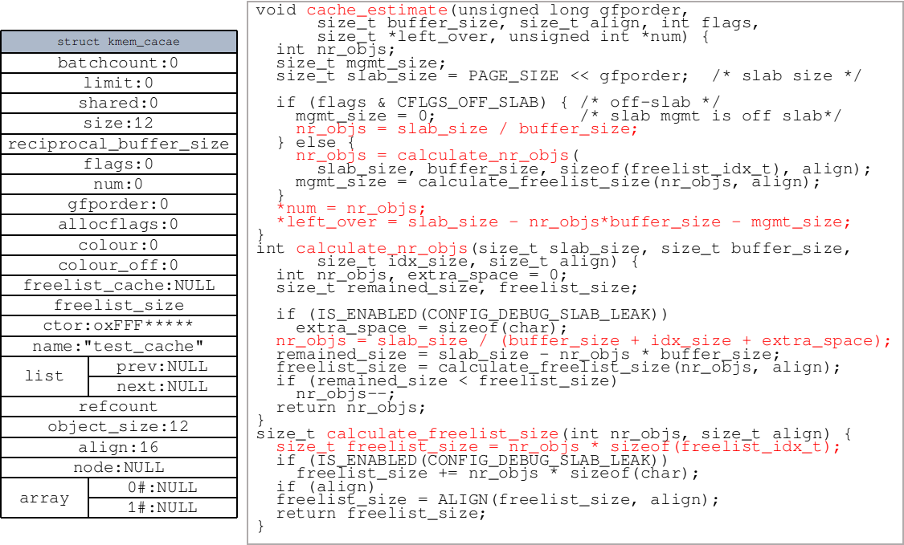

```
static size_t calculate_slab_order(struct kmem_cache *cachep, 
    size_t size, size_t align, unsigned long flags) {
  unsigned long offslab_limit; size_t left_over = 0; int gfporder;
  
  for (gfporder = 0; gfporder <= KMALLOC_MAX_ORDER; gfporder++) {
    unsigned int num; size_t remainder;
    cache_estimate(gfporder, size, align, flags, &remainder, &num);
    if (!num)
      continue;
    if (num > SLAB_OBJ_MAX_NUM)
      break;
    if (flags & CFLGS_OFF_SLAB) {
      size_t freelist_size_per_obj = sizeof(freelist_idx_t);
      if (IS_ENABLED(CONFIG_DEBUG_SLAB_LEAK))
        freelist_size_per_obj += sizeof(char);
      offslab_limit = size;
      offslab_limit /= freelist_size_per_obj;
      if (num > offslab_limit)
        break;
    }

    cachep->num = num;
    cachep->gfporder = gfporder;
    left_over = remainder;

    if (flags & SLAB_RECLAIM_ACCOUNT)
      break;
    if (gfporder >= slab_max_order)
      break;
    if (left_over * 8 <= (PAGE_SIZE << gfporder))
      break;
  }
  return left_over;
}
```

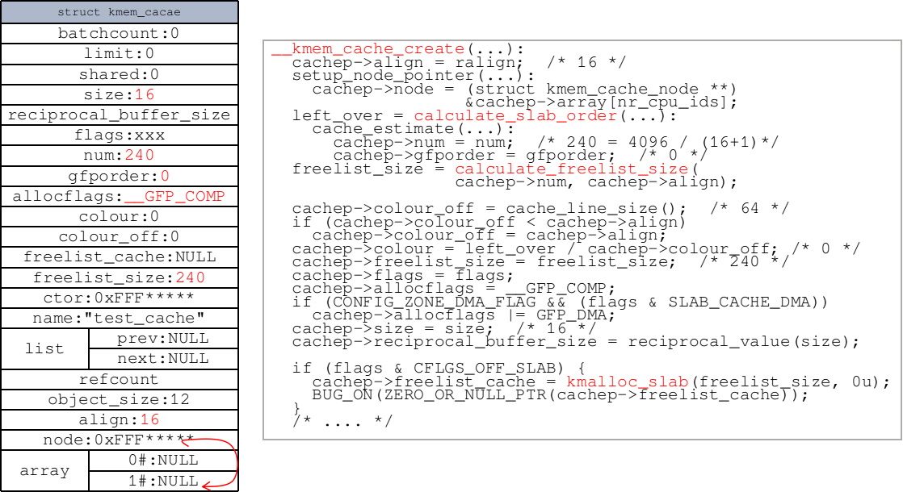

```
/**
 * @cachep: cache management descriptor
 * @flags: SLAB flags
 *     %SLAB_POISON - 将0xa5a5a5a5数据写入管理的slab对象内存，以捕获对未初始化内存的引用
 *     %SLAB_RED_ZONE - 在分配的内存周围插入“红色”区域以检查缓冲区溢出
 *     %SLAB_HWCACHE_ALIGN - 将此缓存中的slab对象与硬件缓存线对齐。
 */
int __kmem_cache_create(struct kmem_cache *cachep, unsigned long flags) {
  size_t left_over, freelist_size;
  size_t ralign = BYTES_PER_WORD;
  gfp_t gfp;
  int err;
  size_t size = cachep->size;

#if DEBUG
/* 调试添加内容 */
#endif

  if (size & (BYTES_PER_WORD - 1)) {  /* word对齐，size必须是8的倍数 */
    size += (BYTES_PER_WORD - 1);
    size &= ~(BYTES_PER_WORD - 1);
  }
  if (flags & SLAB_RED_ZONE) {       /* 加上储存溢出标记的内存, 然后对齐 */
    ralign = REDZONE_ALIGN;          /* max(BYTES_PER_WORD, sizeof(long long)) */
    size += REDZONE_ALIGN - 1;
    size &= ~(REDZONE_ALIGN - 1);
  }
  if (ralign < cachep->align) {      /* 调用者强制的对齐 */
    ralign = cachep->align;
  }
  if (ralign > __alignof__(unsigned long long)) /*？？*/
    flags &= ~(SLAB_RED_ZONE | SLAB_STORE_USER);
  cachep->align = ralign;

  if (slab_is_available())
    gfp = GFP_KERNEL;
  else
    gfp = GFP_NOWAIT;
  setup_node_pointer(cachep);   /* cachep->node = (struct kmem_cache_node **)&cachep->array[nr_cpu_ids]; */
#if DEBUG
/*调试内容*/
#endif

  if (size >= OFF_SLAB_MIN_SIZE && !slab_early_init && !(flags & SLAB_NOLEAKTRACE))
    flags |= CFLGS_OFF_SLAB;        /* obj很大，最好将slab管理obj的结构放在slab外面*/
  size = ALIGN(size, cachep->align); /* size进行对齐 */
  if (FREELIST_BYTE_INDEX && size < SLAB_OBJ_MIN_SIZE) /* 满足最小obj大小*/
    size = ALIGN(SLAB_OBJ_MIN_SIZE, cachep->align);

  left_over = calculate_slab_order(cachep, size, cachep->align, flags);
  if (!cachep->num)
		return -E2BIG;
  freelist_size = calculate_freelist_size(cachep->num, cachep->align);
  if (flags & CFLGS_OFF_SLAB && left_over >= freelist_size) { /* 剩余空间足够slab_mgmt*/
    flags &= ~CFLGS_OFF_SLAB;
    left_over -= freelist_size;
  }

  if (flags & CFLGS_OFF_SLAB) {
    freelist_size = calculate_freelist_size(cachep->num, 0); /* off-slab不需要对齐*/

#ifdef CONFIG_PAGE_POISONING
/*.....*/
#endif
  }

  cachep->colour_off = cache_line_size();
  if (cachep->colour_off < cachep->align)
    cachep->colour_off = cachep->align;
  cachep->colour = left_over / cachep->colour_off;
  cachep->freelist_size = freelist_size;
  cachep->flags = flags;
  cachep->allocflags = __GFP_COMP;
  if (CONFIG_ZONE_DMA_FLAG && (flags & SLAB_CACHE_DMA))
    cachep->allocflags |= GFP_DMA;
  cachep->size = size;
  cachep->reciprocal_buffer_size = reciprocal_value(size);

  if (flags & CFLGS_OFF_SLAB) { /* 分配管理slab_mgmt的管理描述符*/
    cachep->freelist_cache = kmalloc_slab(freelist_size, 0u);
    BUG_ON(ZERO_OR_NULL_PTR(cachep->freelist_cache));
  }

  err = setup_cpu_cache(cachep, gfp); /* 申请cache_array和kmem_cache_node*/
  if (err) {
    __kmem_cache_shutdown(cachep);
    return err;
  }

  if (flags & SLAB_DEBUG_OBJECTS) {
    WARN_ON_ONCE(flags & SLAB_DESTROY_BY_RCU);
    slab_set_debugobj_lock_classes(cachep);
  } else if (!OFF_SLAB(cachep) && !(flags & SLAB_DESTROY_BY_RCU))
    on_slab_lock_classes(cachep);
  return 0;
}
```

### STEP3、分配`cache_array`
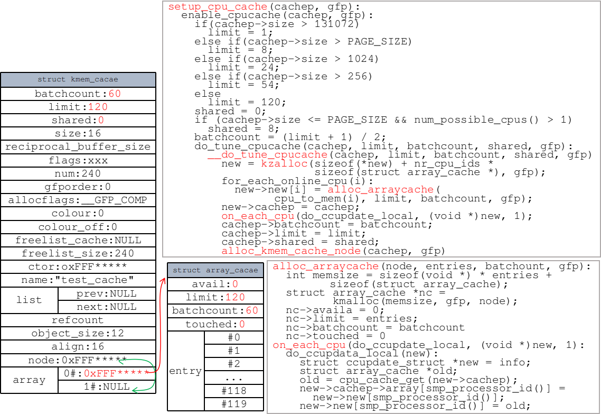

```
struct ccupdate_struct {
  struct kmem_cache *cachep;
  struct array_cache *new[0];
};

static int __do_tune_cpucache(struct kmem_cache *cachep, int limit,
				int batchcount, int shared, gfp_t gfp) {
  struct ccupdate_struct *new;
  int i;
  new = kzalloc(sizeof(*new) + nr_cpu_ids * sizeof(struct array_cache *), gfp);
  if (!new)
    return -ENOMEM;

  for_each_online_cpu(i) {
    new->new[i] = alloc_arraycache(cpu_to_mem(i), limit, batchcount, gfp); /* 分配array_cache */
    if (!new->new[i]) {
      for (i--; i >= 0; i--)
        kfree(new->new[i]);
      kfree(new);
      return -ENOMEM;
    }
  }
  new->cachep = cachep;
  on_each_cpu(do_ccupdate_local, (void *)new, 1); /* 将申请的array_cache和cachep关联起来*/
  check_irq_on();
  cachep->batchcount = batchcount;
  cachep->limit = limit;
  cachep->shared = shared;

  for_each_online_cpu(i) { /* 将cachep->array的内容释放掉 */
    struct array_cache *ccold = new->new[i];
    if (!ccold)
			continue;
    spin_lock_irq(&cachep->node[cpu_to_mem(i)]->list_lock);
    free_block(cachep, ccold->entry, ccold->avail, cpu_to_mem(i));
    spin_unlock_irq(&cachep->node[cpu_to_mem(i)]->list_lock);
    kfree(ccold);
  }
  kfree(new);
  return alloc_kmem_cache_node(cachep, gfp); /* 申请kmem_cache_node */
}
```

### STEP4、分配`kmem_cache_node`
```
static int alloc_kmem_cache_node(struct kmem_cache *cachep, gfp_t gfp) {
  int node;
  struct kmem_cache_node *n;
  struct array_cache *new_shared;
  struct array_cache **new_alien = NULL;

  for_each_online_node(node) {
    if (use_alien_caches) {
      new_alien = alloc_alien_cache(node, cachep->limit, gfp);
      if (!new_alien)
        goto fail;
    }

    new_shared = NULL;
    if (cachep->shared) { /* 分配shared */
      new_shared = alloc_arraycache(node, cachep->shared*cachep->batchcount, 0xbaadf00d, gfp);
      if (!new_shared) {
        free_alien_cache(new_alien);
        goto fail;
      }
    }

    n = cachep->node[node];
    if (n) { /* 已经有kmem_cache_node，更新它*/
      struct array_cache *shared = n->shared;
      spin_lock_irq(&n->list_lock);

      if (shared)
      free_block(cachep, shared->entry,
        shared->avail, node);

      n->shared = new_shared;
      if (!n->alien) {
        n->alien = new_alien;
        new_alien = NULL;
      }
      n->free_limit = (1 + nr_cpus_node(node)) * cachep->batchcount + cachep->num;
      spin_unlock_irq(&n->list_lock);
      kfree(shared);
      free_alien_cache(new_alien);
      continue;
    }
    n = kmalloc_node(sizeof(struct kmem_cache_node), gfp, node); /* 分配kmem_cache_node */
    if (!n) {
      free_alien_cache(new_alien);
      kfree(new_shared);
      goto fail;
    }

    kmem_cache_node_init(n);
    n->next_reap = jiffies + REAPTIMEOUT_NODE + ((unsigned long)cachep) % REAPTIMEOUT_NODE;
    n->shared = new_shared;
    n->alien = new_alien;
    n->free_limit = (1 + nr_cpus_node(node)) * cachep->batchcount + cachep->num;
    cachep->node[node] = n;
  }
  return 0;

fail:
  /* 失败处理 */
  return -ENOMEM;
}
```

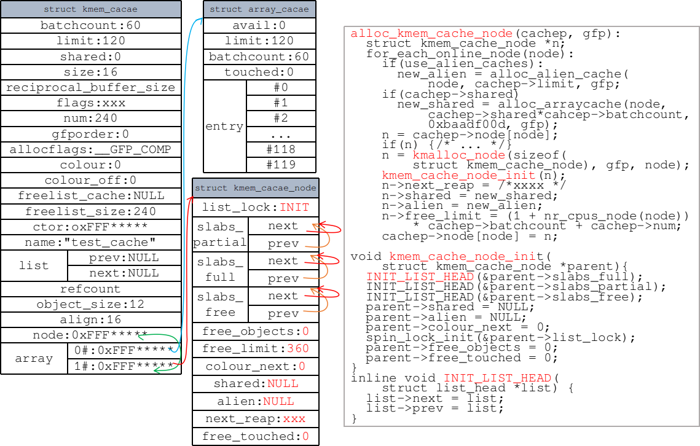

```
static void kmem_cache_node_init(struct kmem_cache_node *parent){
  INIT_LIST_HEAD(&parent->slabs_full);
  INIT_LIST_HEAD(&parent->slabs_partial);
  INIT_LIST_HEAD(&parent->slabs_free);
  parent->shared = NULL;
  parent->alien = NULL;
  parent->colour_next = 0;
  spin_lock_init(&parent->list_lock);
  parent->free_objects = 0;
  parent->free_touched = 0;
}
static inline void INIT_LIST_HEAD(struct list_head *list) {
  list->next = list;
  list->prev = list;
}
```

## 分配对象--`kmem_cache_alloc`

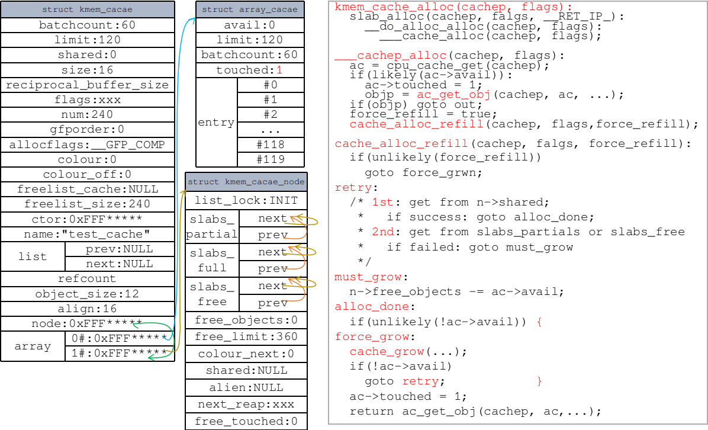

### STEP1、从CPU `array_cache`获取
```
void *kmem_cache_alloc(cachep, flags):
    slab_alloc(cachep, flags, _RET_IP_):
      /* ... */
      objp = __do_cache_alloc(cachep, flags);
        ___cache_alloc(cachep, flags);
      /* ... */

static inline void *____cache_alloc(struct kmem_cache *cachep, gfp_t flags) {
  void *objp;
  struct array_cache *ac;
  bool force_refill = false;
  check_irq_off();

  ac = cpu_cache_get(cachep); /* return cachep->array[smp_processor_id()]; */
  if (likely(ac->avail)) {    /* likely表示执行if语句的可能性大，从cpu array_cache获取 */
    ac->touched = 1;
    objp = ac_get_obj(cachep, ac, flags, false); /* objp = ac->entry[--ac->avail]; */
    if (objp) {
      STATS_INC_ALLOCHIT(cachep);
      goto out;
    }
    force_refill = true;     /* 必须分配空间 *FIXME */
  }

  STATS_INC_ALLOCMISS(cachep);
  objp = cache_alloc_refill(cachep, flags, force_refill);
  ac = cpu_cache_get(cachep);

out:
  if (objp)
    kmemleak_erase(&ac->entry[ac->avail]);
  return objp;
}
```

### STEP2、若STEP1失败，调用`cache_alloc_refill`
```
static void *cache_alloc_refill(
    struct kmem_cache *cachep, gfp_t flags, bool force_refill) {
  int batchcount;
  struct kmem_cache_node *n;
  struct array_cache *ac;
  int node;

  check_irq_off();
  node = numa_mem_id();
  if (unlikely(force_refill)) /* unlikely表示不执行if的可能性大 */
		goto force_grow;
retry:  /* 再一次尝试 */
  ac = cpu_cache_get(cachep);
  batchcount = ac->batchcount;
  if (!ac->touched && batchcount > BATCHREFILL_LIMIT) {
    /* 如果此cache上最近没有活动，则只执行部分refill。 否则全部refill */
    batchcount = BATCHREFILL_LIMIT;
  }
  n = cachep->node[node];
  BUG_ON(ac->avail > 0 || !n);
  spin_lock(&n->list_lock);

  /* 看看是否可以从n->share上获取对象来填充ac */
  if (n->shared && transfer_objects(ac, n->shared, batchcount)) {
    n->shared->touched = 1;
    goto alloc_done;
  }
  /* 尝试从slabs_partial和slabs_free获取对象填充ac*/
  while (batchcount > 0) {
    struct list_head *entry;
    struct page *page;
    entry = n->slabs_partial.next;
    if (entry == &n->slabs_partial) {
      n->free_touched = 1;
      entry = n->slabs_free.next;
      if (entry == &n->slabs_free)
        goto must_grow;
    }
    /* 通过entry(指向lru成员的地址)获取struct page的地址 */
    page = list_entry(entry, struct page, lru);
    check_spinlock_acquired(cachep);
    BUG_ON(page->active >= cachep->num);

    while (page->active < cachep->num && batchcount--) {
      STATS_INC_ALLOCED(cachep);
      STATS_INC_ACTIVE(cachep);
      STATS_SET_HIGH(cachep);
      
      /* 填充（转移）:从slab_partial到array_cache */
      ac_put_obj(cachep, ac, slab_get_obj(cachep, page, node)); 
    }

    list_del(&page->lru);
    if (page->active == cachep->num)
      list_add(&page->lru, &n->slabs_full);
    else
      list_add(&page->lru, &n->slabs_partial);
  }

must_grow:
  n->free_objects -= ac->avail;
alloc_done:
  spin_unlock(&n->list_lock);
  if (unlikely(!ac->avail)) {
    int x;
force_grow:
    x = cache_grow(cachep, flags | GFP_THISNODE, node, NULL);
    ac = cpu_cache_get(cachep);
    node = numa_mem_id();

    /* no objects in sight? abort */
    if (!x && (ac->avail == 0 || force_refill))
      return NULL;

    if (!ac->avail)		/* objects refilled by interrupt? */
    goto retry;
  }
  ac->touched = 1;
  return ac_get_obj(cachep, ac, flags, force_refill);
}
```

### STEP3、（退无可退）必须申请页面，调用`cache_grow`
#### 申请物理页面
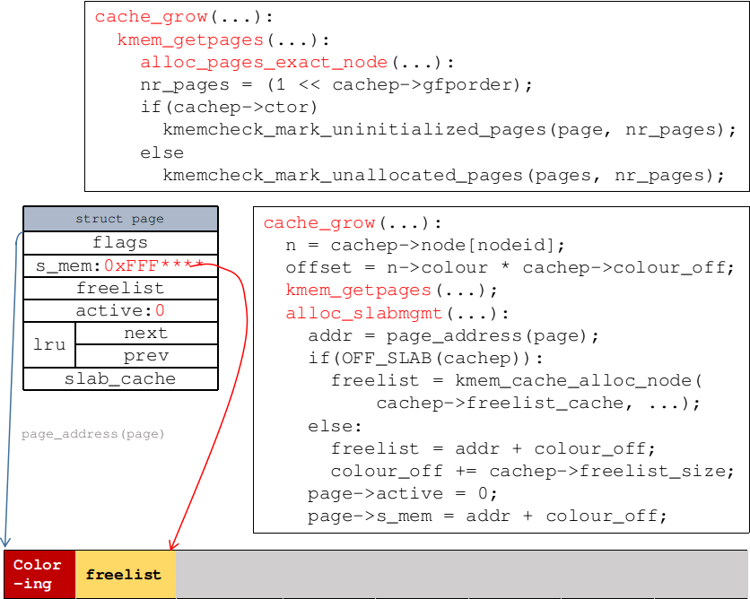

```
static int cache_grow(struct kmem_cache *cachep, 
        gfp_t flags, int nodeid, struct page *page){
  void *freelist;
  size_t offset;
  gfp_t local_flags;
  struct kmem_cache_node *n;

  BUG_ON(flags & GFP_SLAB_BUG_MASK);
  local_flags = flags & (GFP_CONSTRAINT_MASK|GFP_RECLAIM_MASK);

  /* 获取节点列表list_lock以更改此节点上的colour_next */
  check_irq_off();
  n = cachep->node[nodeid];
  spin_lock(&n->list_lock);

  /* 获取slab的colour_next，然后调整下一个值 */
  offset = n->colour_next;
  n->colour_next++;
  if (n->colour_next >= cachep->colour)
    n->colour_next = 0;
  spin_unlock(&n->list_lock);

  offset *= cachep->colour_off; /* 乘以颜色基准offset */

  if (local_flags & __GFP_WAIT)
    local_irq_enable();
  kmem_flagcheck(cachep, flags); /* flags合法性检查 */

  if (!page)
    page = kmem_getpages(cachep, local_flags, nodeid); /* 尝试从nodeid分配一个物理页面 */
  if (!page)
    goto failed;
  /* ............ */
```

#### 分配`slabmagt`并初始化页面
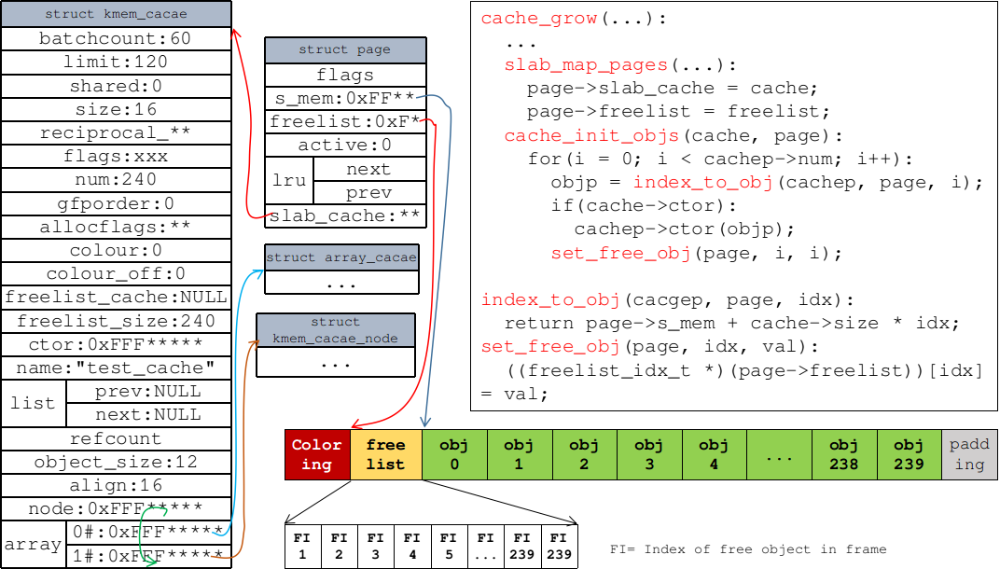

```
  /* ............ */
  /* 获取slab mgmt */
  freelist = alloc_slabmgmt(cachep, page, offset, 
          local_flags & ~GFP_CONSTRAINT_MASK, nodeid);
  if (!freelist)
    goto opps1;

  slab_map_pages(cachep, page, freelist); /* 将从addr开始的页面映射到给定的缓存和slab */

  cache_init_objs(cachep, page);          /* 进行初始化 */

  if (local_flags & __GFP_WAIT)
    local_irq_disable();
  check_irq_off();
  spin_lock(&n->list_lock);
  /* ............ */
```

#### 将`slab`添加到`kmem_cache_node`
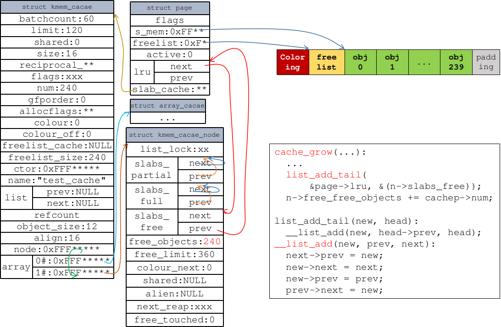

```
  /* ............. */
  /* Make slab active. */
  list_add_tail(&page->lru, &(n->slabs_free)); /* 将分配的加到slabs_free中 */
  STATS_INC_GROWN(cachep);
  n->free_objects += cachep->num;
  spin_unlock(&n->list_lock);
  return 1;
opps1:
  kmem_freepages(cachep, page);
failed:
  if (local_flags & __GFP_WAIT)
    local_irq_disable();
  return 0;
}
```

#### 将一部分obj放入`array_cache`并再次分配对象
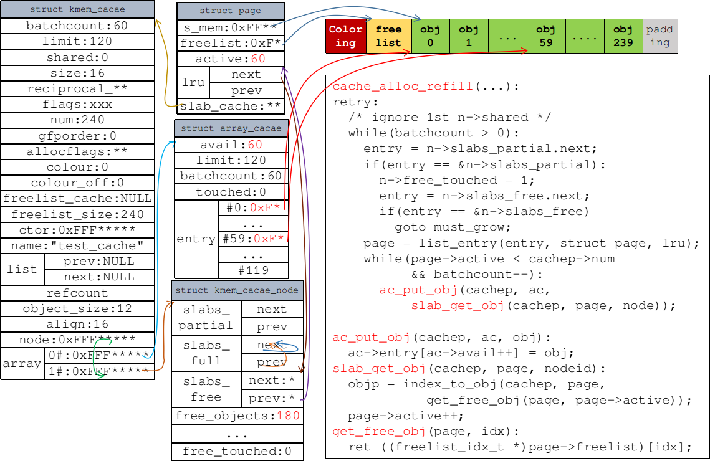

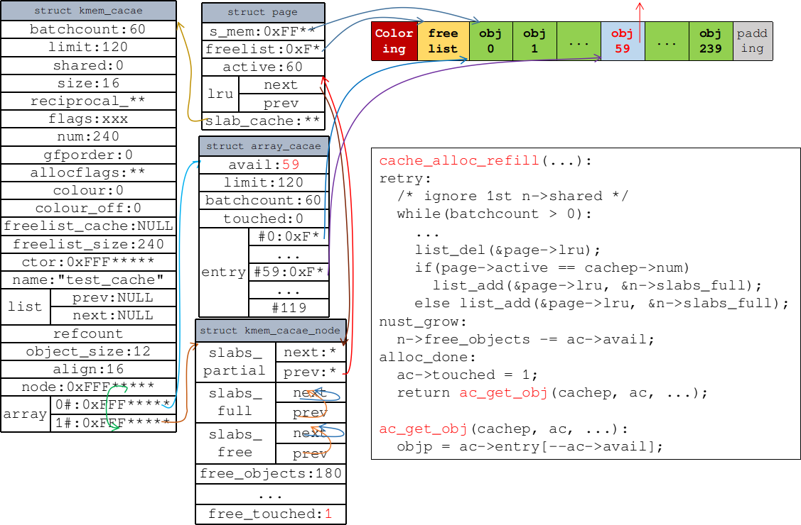

## 释放对象--`kmem_cache_free`
### `avail < limit` 可直接放回
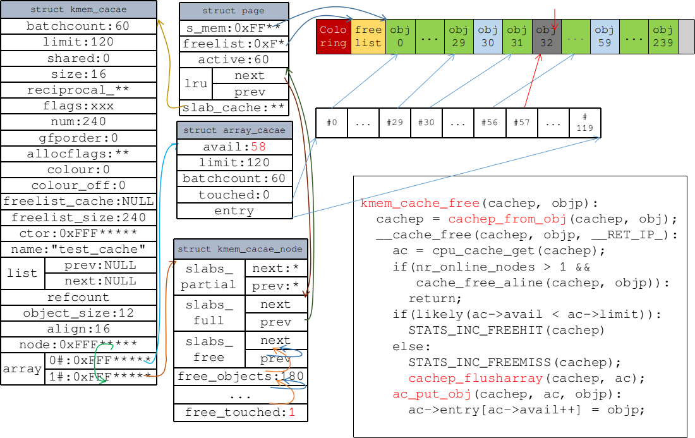

```
void kmem_cache_free(struct kmem_cache *cachep, void *objp) {
  unsigned long flags;
  cachep = cache_from_obj(cachep, objp);
  if (!cachep)
    return;

  local_irq_save(flags);
  debug_check_no_locks_freed(objp, cachep->object_size);
  if (!(cachep->flags & SLAB_DEBUG_OBJECTS))
    debug_check_no_obj_freed(objp, cachep->object_size);
  __cache_free(cachep, objp, _RET_IP_); /* 主要工作 */
  local_irq_restore(flags);

  trace_kmem_cache_free(_RET_IP_, objp);
}
```

### `avail == limit` 刷新`array_cache`腾出足够空间
```
static void cache_flusharray(struct kmem_cache *cachep, struct array_cache *ac) {
  int batchcount;
  struct kmem_cache_node *n;
  int node = numa_mem_id();

  batchcount = ac->batchcount;
#if DEBUG
  BUG_ON(!batchcount || batchcount > ac->avail);
#endif
  check_irq_off();
  n = cachep->node[node];
  spin_lock(&n->list_lock);
  if (n->shared) {
    struct array_cache *shared_array = n->shared;
    int max = shared_array->limit - shared_array->avail;
    if (max) {
      if (batchcount > max)
        batchcount = max;
      memcpy(&(shared_array->entry[shared_array->avail]),
            ac->entry, sizeof(void *) * batchcount);
      shared_array->avail += batchcount;
      goto free_done;
    }
  }
  free_block(cachep, ac->entry, batchcount, node); /* 主要工作 */
free_done:
#if STATS
  /* 调试 */
#endif
  spin_unlock(&n->list_lock);
  ac->avail -= batchcount;
  memmove(ac->entry, &(ac->entry[batchcount]), sizeof(void *)*ac->avail);
}
```

#### 将`array_cache`中`batchcount`个obj放回`page`
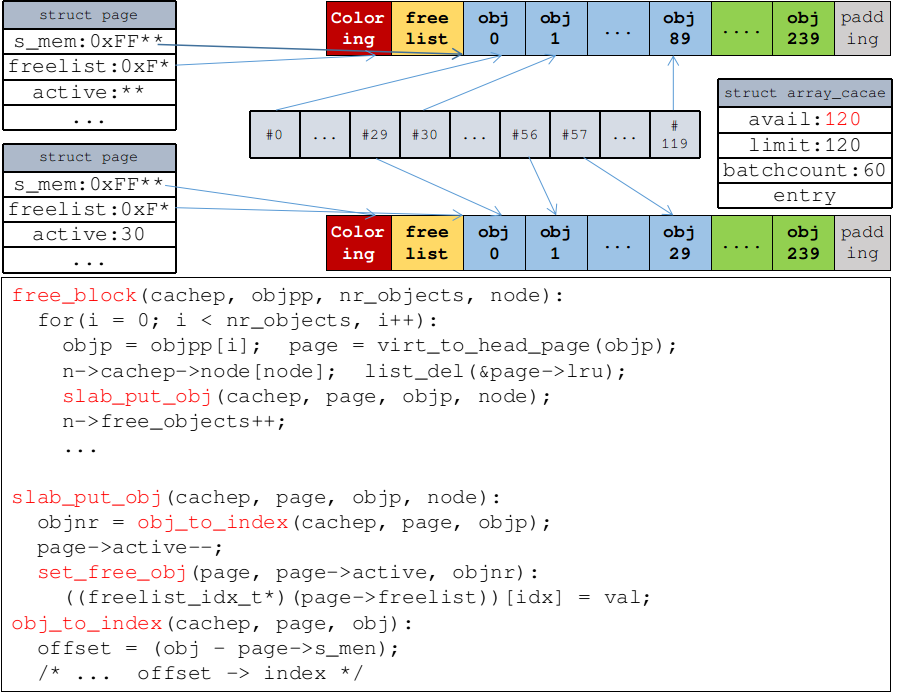

```
static void free_block(struct kmem_cache *cachep, void **objpp, 
            int nr_objects, int node) {
  int i;
  struct kmem_cache_node *n;

  for (i = 0; i < nr_objects; i++) {
    void *objp;
    struct page *page;

    clear_obj_pfmemalloc(&objpp[i]);
    objp = objpp[i];

    page = virt_to_head_page(objp);
    n = cachep->node[node];
    list_del(&page->lru);
    check_spinlock_acquired_node(cachep, node);
    slab_put_obj(cachep, page, objp, node);
    STATS_DEC_ACTIVE(cachep);
    n->free_objects++;

    /* fixup slab chains */
    if (page->active == 0) {
      if (n->free_objects > n->free_limit) {
        n->free_objects -= cachep->num;
        slab_destroy(cachep, page);
      } else {
        list_add(&page->lru, &n->slabs_free);
      }
    } else {
      list_add_tail(&page->lru, &n->slabs_partial);
    }
  }
}
```
#### 必要时释放`page`
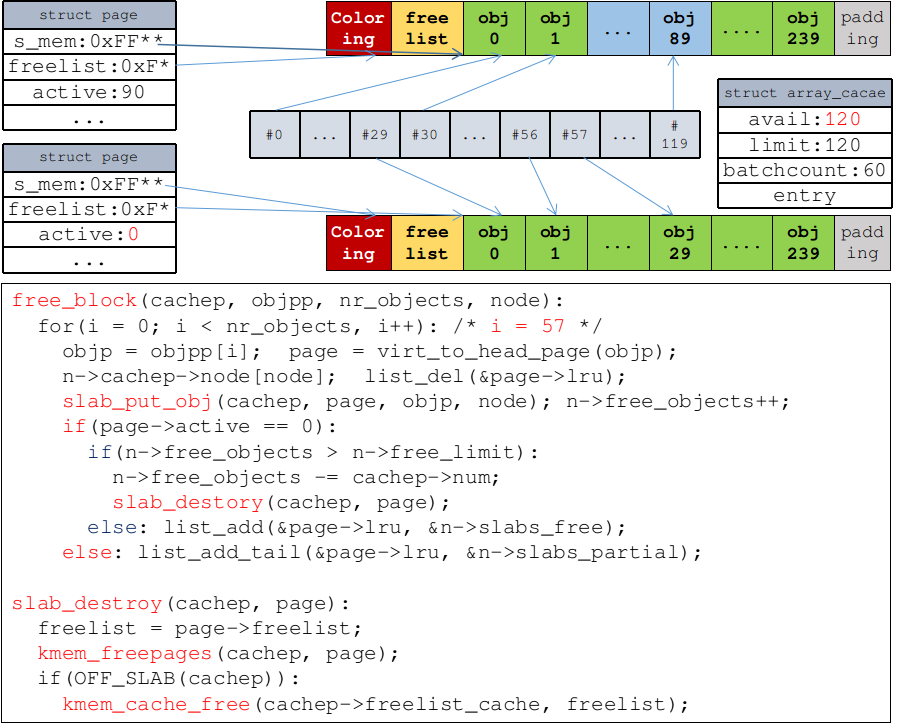

#### 修改`entry`
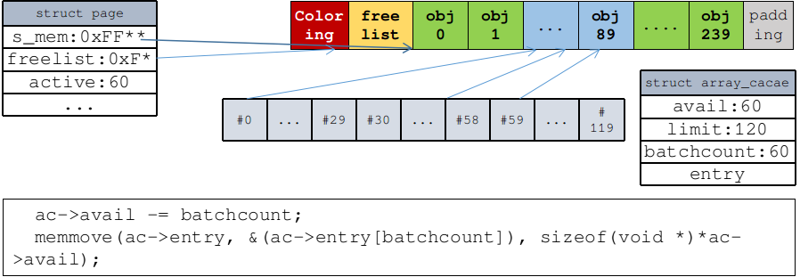

## 释放内存--`kmem_cache_destroy`
```
void slab_kmem_cache_release(struct kmem_cache *s)
{
	kfree(s->name);
	kmem_cache_free(kmem_cache, s);
}

void kmem_cache_destroy(struct kmem_cache *s) {
  get_online_cpus();
  get_online_mems();

  mutex_lock(&slab_mutex);

  s->refcount--;
  if (s->refcount)
    goto out_unlock;

  if (memcg_cleanup_cache_params(s) != 0)
    goto out_unlock;

  if (__kmem_cache_shutdown(s) != 0) {
    printk(KERN_ERR "kmem_cache_destroy %s: "
		       "Slab cache still has objects\n", s->name);
    dump_stack();
    goto out_unlock;
  }

  list_del(&s->list);

  mutex_unlock(&slab_mutex);
  if (s->flags & SLAB_DESTROY_BY_RCU)
    rcu_barrier();

  memcg_free_cache_params(s);
#ifdef SLAB_SUPPORTS_SYSFS
  sysfs_slab_remove(s);
#else
  slab_kmem_cache_release(s);  /* 主要工作 */
#endif
  goto out;

out_unlock:
  mutex_unlock(&slab_mutex);
out:
  put_online_mems();
  put_online_cpus();
}
```

```
void slab_kmem_cache_release(struct kmem_cache *s) {
  kfree(s->name);
  kmem_cache_free(kmem_cache, s);
}
```