# Linux Slab分配器（Linux版本3.16.69）

## 背景
Linux 内存管理使用的伙伴系统（Buddy System）最小分配单位是页， 即 PAGE_SIZE，并且每次分配 2^N 个页面。在 x86 架构中每页的大小一般为 4KB。但是很多情况下，内核某个模块某个时候需要申请的内存是远远小于 4KB 的，或者跟 2^N 个页面的大小差别大，如果使用伙伴系统的话，必定是会产生很大的浪费。所以，一个粒度更小的分配器呼之欲出，SLAB 就是为了解决这个小粒度内存分配的问题。

此外，我们考虑下面场景：如果一个内核模块经常使用某一种类型的对象，或者说频繁的创建、回收某一种类型的对象，那我们是不是可以尝试将这类对象单独存放起来，当模块不再使用时一个对象时，我们暂时先不释放对象的内存，而是缓存起来，等该模块再此申请使用这类对象，我们把之前应该回收的对象再拿出来，只不过重新构造一下对象，这样我们就减少了一次释放、申请内存的操作了。

SLAB 分配器是建立在伙伴系统之上的一个更加细粒度的内存分配系统，SLAB 分配器使用的内存空间是通过伙伴算法进行分配的，只不过 SLAB 对这些内存空间实现了自己的算法进而对小块内存进行管理。SALB 分配器背后的基本思想是缓存常用对象，供内核使用。如果没有基于对象的分配器，内核将花费大量时间来分配，初始化和释放同一个对象。

## SLAB 分配器数据结构
在 SLAB 分配器的语境中，cache 指管理特定类型（如 task_struct、mm_struct 和 tcp_sock 等）的多个对象的管理器。cache 管理的对象并不是散乱的，而是用叫做 slab 的结构组织起来的。cache 可以拥有多个 slab，每个 slab 都是从伙伴系统申请的 2^N 个页面构造而成。

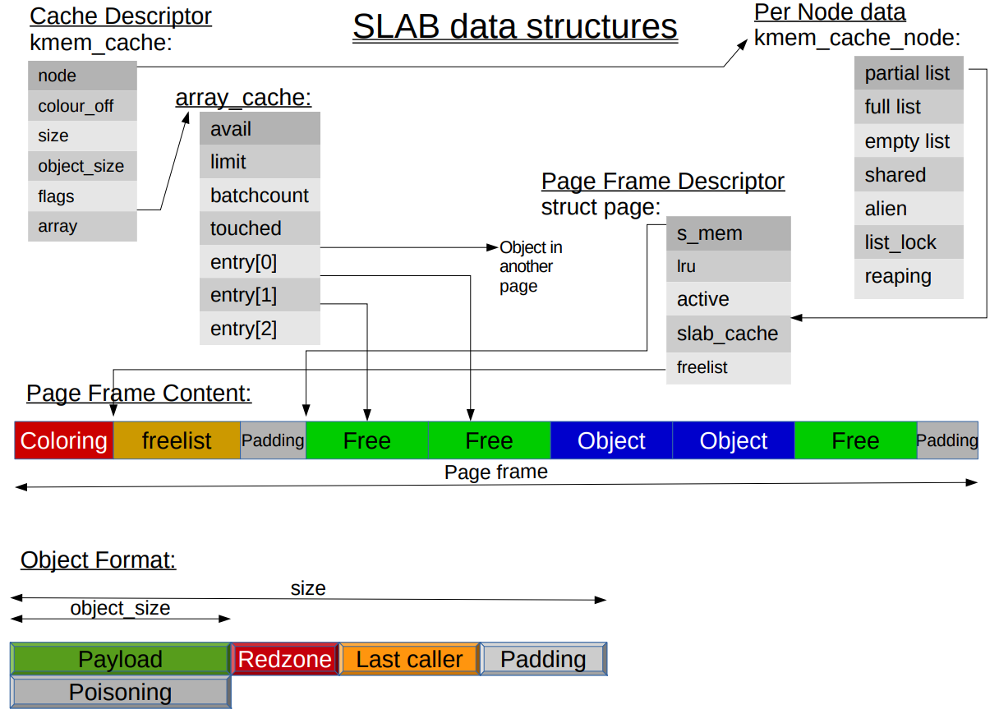

- cache 描述符：kmem_cache 结构体类型的对象，保存 cache 的基本信息，比如名字、对象大小、对齐，每个 slab 对象的个数以及需要申请多少个页面
- kmem_cache_node：管理 slab
- array_cache：缓存对象
- slab 管理结构：管理 2^N 个页面分割的对象

### freelist_idx_t
```
/// @file mm/slab.c
163 #if FREELIST_BYTE_INDEX
164 typedef unsigned char freelist_idx_t;
165 #else
166 typedef unsigned short freelist_idx_t;
167 #endif
```

### array_cache
```
/// @file mm/slab.c
189 struct array_cache {
190     unsigned int avail;       // 可用对象的数目 
191     unsigned int limit;       // entry数组大小，表示最多可存放的对象数目
192     unsigned int batchcount;  // 当对象数量不足或超出，一次转移对象的数目
193     unsigned int touched;
194     spinlock_t   lock;
195     void        *entry[];     // 保存对象obj
204 };
```

### kmem_cache_node
```
/// @file mm/slab.h
269 struct kmem_cache_node {
270     spinlock_t list_lock;
271 
272 #ifdef CONFIG_SLAB
273     struct list_head     slabs_partial;  // 本链表中的部分对象空闲
274     struct list_head     slabs_full;     // 本链表中没有对象空闲
275     struct list_head     slabs_free;     // 本链表中所有对象空闲
276     unsigned long        free_objects;   // 空闲对象？？
277     unsigned int         free_limit;
278     unsigned int         colour_next;    // Per-node cache coloring
279     struct array_cache  *shared;         // shared per node
280     struct array_cache **alien;          // on other nodes
281     unsigned long        next_reap;      // updated without locking
282     int                  free_touched;   // updated without locking
283 #endif
284 
285 #ifdef CONFIG_SLUB
286     unsigned long nr_partial;
287     struct list_head partial;
288 #ifdef CONFIG_SLUB_DEBUG
289     atomic_long_t nr_slabs;
290     atomic_long_t total_objects;
291     struct list_head full;
292 #endif
293 #endif
294 
295 };
```

### kmem_cache
```
/// @file include/linux/slab_def.h
 6 /*
 7  * Definitions unique to the original Linux SLAB allocator.
 8  */
 9 
10 struct kmem_cache {
11 /* 1) Cache tunables. Protected by slab_mutex */
12     unsigned int            batchcount;    // 一次转移对象的数目
13     unsigned int            limit;
14     unsigned int            shared;
15 
16     unsigned int            size; // 对象对齐后大小
17     struct reciprocal_value reciprocal_buffer_size;
18 /* 2) touched by every alloc & free from the backend */
19 
20     unsigned int             flags;     /* constant flags */
21     unsigned int             num;       /* # of objs per slab */
22 
23 /* 3) cache_grow/shrink */
24     /* order of pgs per slab (2^n) */
25     unsigned int             gfporder;
26 
27     /* force GFP flags, e.g. GFP_DMA */
28     gfp_t                    allocflags;
29 
30     size_t                   colour;          /* cache colouring range */
31     unsigned int             colour_off;    /* colour offset */
32     struct kmem_cache       *freelist_cache;
33     unsigned int             freelist_size;
34 
35     /* constructor func */
36     void                   (*ctor)(void *obj); // 对象构造函数
37 
38 /* 4) cache creation/removal */
39     const char              *name;
40     struct list_head         list;
41     int                      refcount;         // 引用计数
42     int                      object_size;      // 对象原始大小
43     int                      align;            // 对齐基准
45 /* 5) statistics */
44 
46 #ifdef CONFIG_DEBUG_SLAB
// ...
69 #endif
86     struct kmem_cache_node **node;
87     struct array_cache      *array[NR_CPUS + MAX_NUMNODES];
91 };
```

## SLAB 接口函数
```
#include <linux/slab.h>
/// 创建 SLAB 分配器
struct kmem_cache* 
kmem_cache_create(const char *name, size_t size, size_t align, unsigned long flags, 
                  void (*ctor)(void*, struct kmem_cache*, unsigned long));

/// 释放 SLAB 分配器
void kmem_cache_destroy(struct kmem_cache *cachep);

/// 从 SLAB 分配器中分配对象
void *kmem_cache_alloc(struct kmem_cache *cachep, gfp_t flags);
void *kmem_cache_zalloc(struct kmem_cache *cachep, gfp_t flags); // 对象会清零

/// 将某个对象还会 SLAB 分配器
void kmem_cache_free(struct kmem_cache *cachep, void *objp);

/// 通用对象分配和释放
void *kmalloc(size_t size, int flags);
void kfree(const void* objp)
```

## 创建一个 SLAB 分配器 -- kmem_cache_create() 函数
比如创建一个管理 struct test 的 cache
```
struct slab_test {
  float fval;
  int ival;
  char ch;
}; // sizeof(slab_test) = 12

void slab_ctor(void *ptr){
    struct slab_test *stptr = (struct slab_test*)ptr;
    stptr->fval = 3.14;
    stptr->ival = 2;
    stptr->ch = 'R';
}
struct kmem_cache *cachep = kmem_cache_create(
  "test_cache", sizeof(struct slab_test),
  0, SLAB_HWCACHE_ALIGN, slab_ctor);
```

### STEP1、创建 cache 描述符
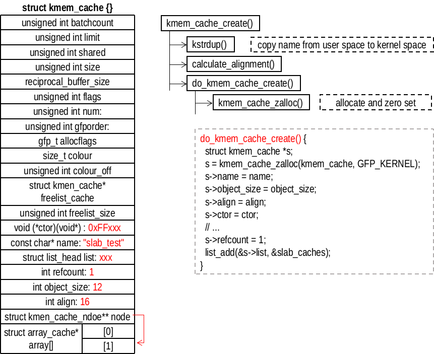

#### kmem_cache_create()
调用 kmem_cache_create() 函数创建一个 keme_cache 类型的对象。
```
/// @file mm/slab_common.c
198 struct kmem_cache *
199 kmem_cache_create(const char *name, size_t size, size_t align,
200           unsigned long flags, void (*ctor)(void *))
```
各个参数的含义如下：
- name：创建 cache 的名字，用于在 `/proc/slabinfo` 表示一个cache
- size：通过本 cache 创建的对象的大小
- align：对齐字节
- flags：标志，常用的是 SLAB_HWCACHE_ALIGN，表示按照硬件缓存线对齐对象
- ctor：对象构造函数

接下来分析具体的实现
```
/// @file mm/slab_common.c
201 {
202     struct kmem_cache *s;
203     char *cache_name;
204     int err;
205 
206     get_online_cpus();
207     get_online_mems();
208 
209     mutex_lock(&slab_mutex);
210 
211     err = kmem_cache_sanity_check(name, size);
212     if (err)
213         goto out_unlock;
214 
215     /*
216      * Some allocators will constraint the set of valid flags to a subset
217      * of all flags. We expect them to define CACHE_CREATE_MASK in this
218      * case, and we'll just provide them with a sanitized version of the
219      * passed flags.
220      */
221     flags &= CACHE_CREATE_MASK;
222 
223     s = __kmem_cache_alias(name, size, align, flags, ctor);
224     if (s)
225         goto out_unlock;
226
227     cache_name = kstrdup(name, GFP_KERNEL); // 将名字拷贝到内核空间
228     if (!cache_name) {
229         err = -ENOMEM;
230         goto out_unlock;
231     }
232 
233     s = do_kmem_cache_create(cache_name, size, size,
234                  calculate_alignment(flags, align, size), // 对齐基准
235                  flags, ctor, NULL, NULL); // 创建kmen_cache对象
236     if (IS_ERR(s)) {
237         err = PTR_ERR(s);
238         kfree(cache_name); // 失败，释放名字占用的内存
239     }
240 
241 out_unlock:
242     mutex_unlock(&slab_mutex);
243 
244     put_online_mems();
245     put_online_cpus();
246 
247     if (err) {
248         if (flags & SLAB_PANIC)
249             panic("kmem_cache_create: Failed to create slab '%s'. Error %d\n",
250                 name, err);
251         else {
252             printk(KERN_WARNING "kmem_cache_create(%s) failed with error %d",
253                 name, err);
254             dump_stack();
255         }
256         return NULL;
257     }
258     return s;
259 }
```
可以看到，kmem_cache_create() 调用 do_kmem_cache_create() 执行创建 kmem_cache 对象的操作。在了解 do_kmem_cache_create() 之前先看一下 calculate_alignment() 是如何进行对齐处理的
```
/// @file mm/slab_common.c
107 /*
108  * Figure out what the alignment of the objects will be given a set of
109  * flags, a user specified alignment and the size of the objects.
110  */
111 unsigned long calculate_alignment(unsigned long flags,
112         unsigned long align, unsigned long size)
113 {   
121     if (flags & SLAB_HWCACHE_ALIGN) {
122         unsigned long ralign = cache_line_size(); // 64
123         while (size <= ralign / 2) // 找到大于size的最小值
124             ralign /= 2;
125         align = max(align, ralign);
126     }
127     
128     if (align < ARCH_SLAB_MINALIGN) // 16
129         align = ARCH_SLAB_MINALIGN; 
130 
131     return ALIGN(align, sizeof(void *)); // 64位系统8字节对齐
132 }
```
如果没有指定（通常是这样）align，需要满足三个对齐要求：（1）和 CPU 的 cache_line_size() 对齐；（2）满足 SLAB 最小对齐要求；（3）满足计算机对齐要求。calculate_alignment() 返回的是对齐值基准，而不是对象对齐后的大小。比如说 size 为 110，那么会返回 64。对象对齐后的大小应该为 128。

#### do_kmem_cache_create()
```
/// @file mm/slab_common.c
134 static struct kmem_cache *
135 do_kmem_cache_create(char *name, size_t object_size, size_t size, size_t align,
136              unsigned long flags, void (*ctor)(void *),
137              struct mem_cgroup *memcg, struct kmem_cache *root_cache)
138 {
139     struct kmem_cache *s;
140     int err;
141 
142     err = -ENOMEM;
143     s = kmem_cache_zalloc(kmem_cache, GFP_KERNEL); // 分配kmem_cache对象
144     if (!s)
145         goto out;
146 
147     s->name = name;               // 名字
148     s->object_size = object_size; // 对象原始大小
149     s->size = size;               // 对象对齐后大小
150     s->align = align;             // 对齐基准
151     s->ctor = ctor;               // 构造函数
152 
153     err = memcg_alloc_cache_params(memcg, s, root_cache);
154     if (err)
155         goto out_free_cache;
156 
157     err = __kmem_cache_create(s, flags); // 分配或初始化其他内容
158     if (err)
159         goto out_free_cache;
160 
161     s->refcount = 1; // 引用计数
162     list_add(&s->list, &slab_caches);
163 out:
164     if (err)
165         return ERR_PTR(err);
166     return s;
167 
168 out_free_cache:
169     memcg_free_cache_params(s);
170     kfree(s);
171     goto out;
172 }
```

### STEP2、初始化 cache 管理描述符
初始化工作主要在 __kmem_cache_create() 完成
```
/// @file mm/slab.c
2225 int
2226 __kmem_cache_create (struct kmem_cache *cachep, unsigned long flags)
2227 {
2228     size_t left_over, freelist_size;
2229     size_t ralign = BYTES_PER_WORD; // sizeof(void*)
2230     gfp_t gfp;
2231     int err;
2232     size_t size = cachep->size; // 对象大小
2233 
2234 #if DEBUG
/// ...
2250 #endif
```
指针 cachep 指向已经分配的 kmem_cache 的对象首先是再次做对齐处理。目前 cachep->size 是对象的实际大小，如果标志仅仅是 SLAB_HWCACHE_ALIGN，不会更新 cachep->align。随后调用 setup_node_pointer() 更新 cachep->node。最后更新 cachep->size 的大小，更新后表示对象对齐后的大小。

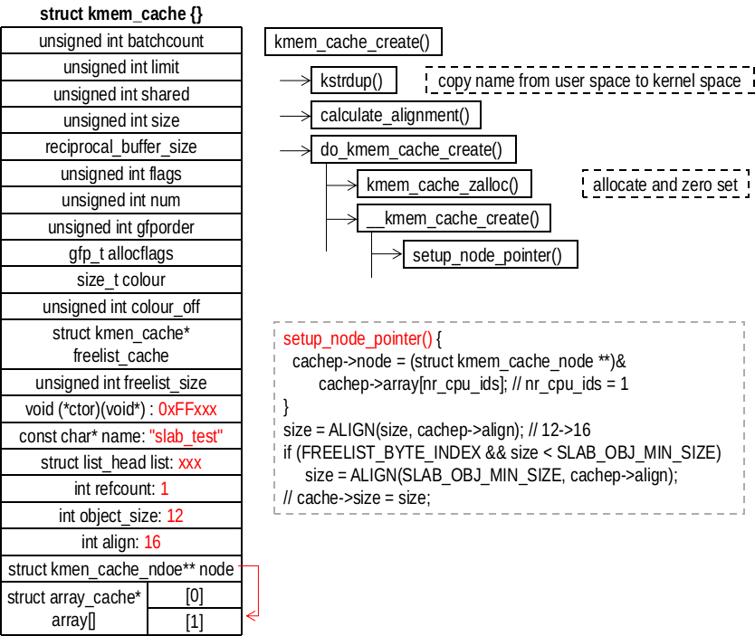

```
/// @file mm/slab.c
2257     if (size & (BYTES_PER_WORD - 1)) {
2258         size += (BYTES_PER_WORD - 1);
2259         size &= ~(BYTES_PER_WORD - 1);
2260     }
2261 
2262     if (flags & SLAB_RED_ZONE) {
2263         ralign = REDZONE_ALIGN; // 更新对齐量
2264         /* If redzoning, ensure that the second redzone is suitably
2265          * aligned, by adjusting the object size accordingly. */
2266         size += REDZONE_ALIGN - 1;
2267         size &= ~(REDZONE_ALIGN - 1);
2268     }
2269 
2270     /* 3) caller mandated alignment */
2271     if (ralign < cachep->align) { // 更新对齐量
2272         ralign = cachep->align;
2273     }
2274     /* disable debug if necessary */
2275     if (ralign > __alignof__(unsigned long long))
2276         flags &= ~(SLAB_RED_ZONE | SLAB_STORE_USER);
2277     /*
2278      * 4) Store it.
2279      */
2280     cachep->align = ralign; // 更新对齐
2281 
2282     if (slab_is_available())
2283         gfp = GFP_KERNEL;
2284     else
2285         gfp = GFP_NOWAIT;
2286 
2287     setup_node_pointer(cachep);
2288 #if DEBUG
/// ....
2324 #endif
2332     if (size >= OFF_SLAB_MIN_SIZE && !slab_early_init &&
2333         !(flags & SLAB_NOLEAKTRACE)) // 
2334         /*
2335          * Size is large, assume best to place the slab management obj
2336          * off-slab (should allow better packing of objs).
2337          */
2338         flags |= CFLGS_OFF_SLAB; // obj很大，最好将slab管理obj的结构放在slab外面
2339 
2340     size = ALIGN(size, cachep->align); // 按照align对齐
2341     /*
2342      * We should restrict the number of objects in a slab to implement
2343      * byte sized index. Refer comment on SLAB_OBJ_MIN_SIZE definition.
2344      */
2345     if (FREELIST_BYTE_INDEX && size < SLAB_OBJ_MIN_SIZE)
2346         size = ALIGN(SLAB_OBJ_MIN_SIZE, cachep->align); // 满足最小obj大小
```
接下来是调用 calculate_slab_order() 计算需要分配多少个页面。
```
/// @file mm/slab.c
2348     left_over = calculate_slab_order(cachep, size, cachep->align, flags);
2349 
2350     if (!cachep->num) // 为0,表示分配失败
2351         return -E2BIG;
```

####  calculate_slab_order()
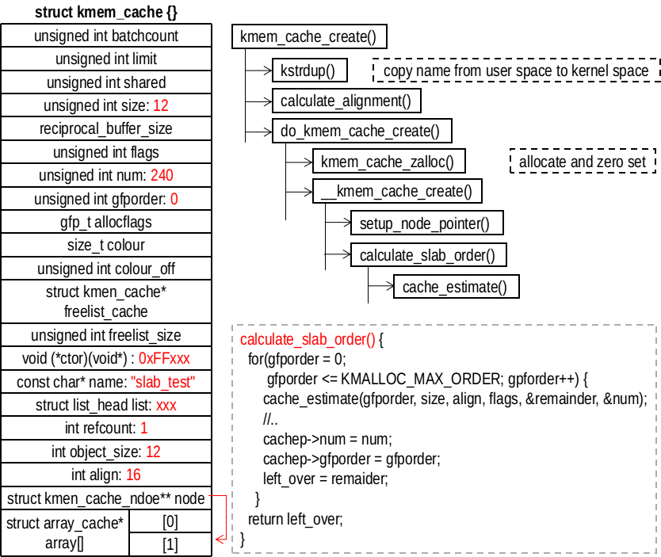

```
/// @file mm/slab.c
2077 static size_t calculate_slab_order(struct kmem_cache *cachep,
2078             size_t size, size_t align, unsigned long flags)
2079 {
2080     unsigned long offslab_limit;
2081     size_t left_over = 0; // 分割对象后剩余的空间
2082     int gfporder; // 表示需要的页面大小为2^gfporder
2083 
2084     for (gfporder = 0; gfporder <= KMALLOC_MAX_ORDER; gfporder++) {
2085         unsigned int num; // 可以分割的对象个数
2086         size_t remainder; // 剩余空间
2087 
2088         cache_estimate(gfporder, size, align, flags, &remainder, &num);
2089         if (!num) // 2^gfporder大小的页面无法分割出一个对象，继续增大页面
2090             continue;
2091 
2092         /* Can't handle number of objects more than SLAB_OBJ_MAX_NUM */
2093         if (num > SLAB_OBJ_MAX_NUM) // 超过最大对象大小，无法处理
2094             break;
2095 
2096         if (flags & CFLGS_OFF_SLAB) { // 对象管理结构在slab之外
                 // 每个对象占用管理结构的空间
2097             size_t freelist_size_per_obj = sizeof(freelist_idx_t);
2103             if (IS_ENABLED(CONFIG_DEBUG_SLAB_LEAK))
2104                 freelist_size_per_obj += sizeof(char);
2105             offslab_limit = size; // slab之外的管理结构最大为size
2106             offslab_limit /= freelist_size_per_obj; // 管理结构可以管理的对象数目
2107 
2108             if (num > offslab_limit) // 对象太大
2109                 break;
2110         }
2111 
2112         /* Found something acceptable - save it away */
2113         cachep->num = num; // 可以分割出的对象的数目
2114         cachep->gfporder = gfporder; // 要申请的页面大小
2115         left_over = remainder; // 分割出对象或管理结构后剩余的大小
2116 
2117         /*
2118          * A VFS-reclaimable slab tends to have most allocations
2119          * as GFP_NOFS and we really don't want to have to be allocating
2120          * higher-order pages when we are unable to shrink dcache.
2121          */
2122         if (flags & SLAB_RECLAIM_ACCOUNT)
2123             break;
2124 
2125         /*
2126          * Large number of objects is good, but very large slabs are
2127          * currently bad for the gfp()s.
2128          */
2129         if (gfporder >= slab_max_order)
2130             break;
2131 
2132         /*
2133          * Acceptable internal fragmentation?
2134          */
2135         if (left_over * 8 <= (PAGE_SIZE << gfporder))
2136             break; // 内部碎片大小满足要求
2137     }
2138     return left_over; // 返回剩余的空间大小
2139 }
```
然后看一下 cache_estimate() 的操作
```
/// @file mm/slab.c
662 static void cache_estimate(unsigned long gfporder, size_t buffer_size,
663                size_t align, int flags, size_t *left_over,
664                unsigned int *num)
665 {
666     int nr_objs;
667     size_t mgmt_size;
668     size_t slab_size = PAGE_SIZE << gfporder;
669 
684     if (flags & CFLGS_OFF_SLAB) { // slab管理结构在slab之外
685         mgmt_size = 0;
686         nr_objs = slab_size / buffer_size;
687 
688     } else {
689         nr_objs = calculate_nr_objs(slab_size, buffer_size,
690                     sizeof(freelist_idx_t), align);
691         mgmt_size = calculate_freelist_size(nr_objs, align);
692     }
693     *num = nr_objs;
694     *left_over = slab_size - nr_objs*buffer_size - mgmt_size;
695 }
```
我么可以看到，如果 slab 管理结构在 slab 之外，计算相当简单。复杂的是当管理结构在 slab 内部的时，需要考虑管理结构的放置。第一步是调用 calculate_nr_objs() 计算可以分割出多少个对象。
```
/// @file mm/slab.c
627 static int calculate_nr_objs(size_t slab_size, size_t buffer_size,
628                 size_t idx_size, size_t align)
629 {   
630     int nr_objs;
631     size_t remained_size;
632     size_t freelist_size;
633     int extra_space = 0;
634     
635     if (IS_ENABLED(CONFIG_DEBUG_SLAB_LEAK))
636         extra_space = sizeof(char);
        // 忽略初对齐的填充。 填充最多为align-1个字节，而buffer_size至少align大小。
        // 在最坏的情况下，当考虑填充时，该结果将大于适合内存分配的对象的数量。
645     nr_objs = slab_size / (buffer_size + idx_size + extra_space);
646     
647     /*
648      * This calculated number will be either the right
649      * amount, or one greater than what we want.
650      */
651     remained_size = slab_size - nr_objs * buffer_size; // 甚于空间
652     freelist_size = calculate_freelist_size(nr_objs, align); // 管理结构占用空间（需要对齐）
653     if (remained_size < freelist_size) // 不能放下管理结构，牺牲一个对象的空间
654         nr_objs--;
655 
656     return nr_objs; // 返回空间数
657 }
```
第二步是调用 calculate_freelist_size() 计算 slab 管理结构的大小
```
/// @file mm/slab.c
613 static size_t calculate_freelist_size(int nr_objs, size_t align)
614 {   
615     size_t freelist_size;
616     
617     freelist_size = nr_objs * sizeof(freelist_idx_t);
618     if (IS_ENABLED(CONFIG_DEBUG_SLAB_LEAK))
619         freelist_size += nr_objs * sizeof(char);
620     
621     if (align)
622         freelist_size = ALIGN(freelist_size, align); // 对齐
623     
624     return freelist_size;
625 }
```

#### __kmem_cache_create() 填写成员
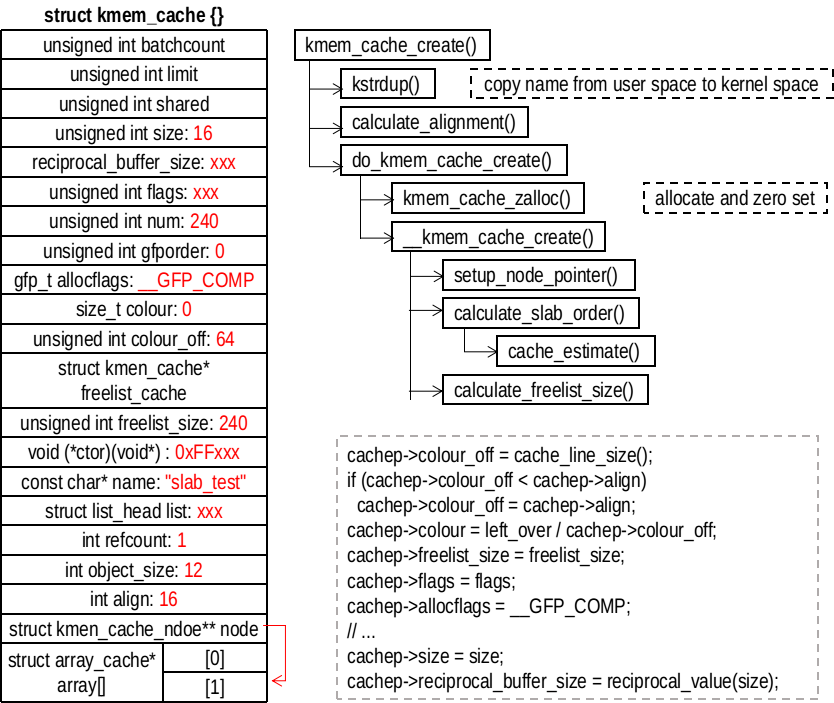

```
/// @file mm/slab.c : __kmem_cache_create
2353     freelist_size = calculate_freelist_size(cachep->num, cachep->align); // 管理结构大小
         // 如果管理结构是放在slab外面的，并且剩余的空间够大，就把管理结构放置到slab内部
2359     if (flags & CFLGS_OFF_SLAB && left_over >= freelist_size) {
2360         flags &= ~CFLGS_OFF_SLAB; // slab管理结构在slab内部的标志
2361         left_over -= freelist_size; // 更新剩余的空间
2362     }
2363 
2364     if (flags & CFLGS_OFF_SLAB) {
2365         /* really off slab. No need for manual alignment */
2366         freelist_size = calculate_freelist_size(cachep->num, 0);
2368 #ifdef CONFIG_PAGE_POISONING
2369         /* If we're going to use the generic kernel_map_pages()
2370          * poisoning, then it's going to smash the contents of
2371          * the redzone and userword anyhow, so switch them off.
2372          */
2373         if (size % PAGE_SIZE == 0 && flags & SLAB_POISON)
2374             flags &= ~(SLAB_RED_ZONE | SLAB_STORE_USER);
2375 #endif
2376     }
2377 
2378     cachep->colour_off = cache_line_size(); // 颜色偏移值
2379     /* Offset must be a multiple of the alignment. */
2380     if (cachep->colour_off < cachep->align)
2381         cachep->colour_off = cachep->align; // 颜色对齐
2382     cachep->colour = left_over / cachep->colour_off; // 颜色的数量
2383     cachep->freelist_size = freelist_size; // slab管理结构的大小
2384     cachep->flags = flags; // 标志，增加slab管理结构在外还是在内的标志
2385     cachep->allocflags = __GFP_COMP;
2386     if (CONFIG_ZONE_DMA_FLAG && (flags & SLAB_CACHE_DMA))
2387         cachep->allocflags |= GFP_DMA;
2388     cachep->size = size; // 对象对齐后的大小
2389     cachep->reciprocal_buffer_size = reciprocal_value(size);
```
接下来就是申请其他的结构，比如说 slab 管理结构、cache_array 对象和 kmem_cache_node 对象
```
/// @file mm/slab.c : __kmem_cache_create
2391     if (flags & CFLGS_OFF_SLAB) { // 申请slab管理结构
2392         cachep->freelist_cache = kmalloc_slab(freelist_size, 0u);
2393         /*
2394          * This is a possibility for one of the kmalloc_{dma,}_caches.
2395          * But since we go off slab only for object size greater than
2396          * OFF_SLAB_MIN_SIZE, and kmalloc_{dma,}_caches get created
2397          * in ascending order,this should not happen at all.
2398          * But leave a BUG_ON for some lucky dude.
2399          */
2400         BUG_ON(ZERO_OR_NULL_PTR(cachep->freelist_cache));
2401     }
2402 
2403     err = setup_cpu_cache(cachep, gfp); // 申请cache_array和kmem_cache_node对象
2404     if (err) {
2405         __kmem_cache_shutdown(cachep);
2406         return err;
2407     }
2408 
2409     if (flags & SLAB_DEBUG_OBJECTS) {
2410         /*
2411          * Would deadlock through slab_destroy()->call_rcu()->
2412          * debug_object_activate()->kmem_cache_alloc().
2413          */
2414         WARN_ON_ONCE(flags & SLAB_DESTROY_BY_RCU);
2415 
2416         slab_set_debugobj_lock_classes(cachep);
2417     } else if (!OFF_SLAB(cachep) && !(flags & SLAB_DESTROY_BY_RCU))
2418         on_slab_lock_classes(cachep);
2419 
2420     return 0;
2421 }
```

#### setup_cpu_cache()
```
/// @file mm/slab.c
2141 static int __init_refok setup_cpu_cache(struct kmem_cache *cachep, gfp_t gfp)
2142 {
2143     if (slab_state >= FULL)
2144         return enable_cpucache(cachep, gfp);
///...
```
setup_cpu_cache() 直接调用 enable_cpucache()，会完成 limit 和 batchcount 的设置
```
/// @file mm/slab.c
3926 static int enable_cpucache(struct kmem_cache *cachep, gfp_t gfp)
3927 {
3928     int err;
3929     int limit = 0;
3930     int shared = 0;
3931     int batchcount = 0;
3932 
3933     if (!is_root_cache(cachep)) {
3934         struct kmem_cache *root = memcg_root_cache(cachep);
3935         limit = root->limit; // 0
3936         shared = root->shared; // 0
3937         batchcount = root->batchcount; // 0
3938     }
3939 
3940     if (limit && shared && batchcount)
3941         goto skip_setup;
3951     if (cachep->size > 131072)
3952         limit = 1;
3953     else if (cachep->size > PAGE_SIZE)
3954         limit = 8;
3955     else if (cachep->size > 1024)
3956         limit = 24;
3957     else if (cachep->size > 256)
3958         limit = 54;
3959     else
3960         limit = 120; // 
3971     shared = 0;
3972     if (cachep->size <= PAGE_SIZE && num_possible_cpus() > 1) // 单 CPU 不成立
3973         shared = 8;
3974 
3975 #if DEBUG
/// ...
3982 #endif
3983     batchcount = (limit + 1) / 2;
3984 skip_setup:
3985     err = do_tune_cpucache(cachep, limit, batchcount, shared, gfp); // 分配工作
3986     if (err)
3987         printk(KERN_ERR "enable_cpucache failed for %s, error %d.\n",
3988                cachep->name, -err);
3989     return err;
3990 }
```
do_tune_cpucache() 会完成 cache_array 对象和 kmem_cache_node 对象的申请
```
/// @file mm/slab.c
3899 static int do_tune_cpucache(struct kmem_cache *cachep, int limit,
3900                 int batchcount, int shared, gfp_t gfp)
3901 {
3902     int ret;
3903     struct kmem_cache *c = NULL;
3904     int i = 0;
3905 
3906     ret = __do_tune_cpucache(cachep, limit, batchcount, shared, gfp); // 分配工作
3907 
3908     if (slab_state < FULL)
3909         return ret;
3910 
3911     if ((ret < 0) || !is_root_cache(cachep))
3912         return ret;
3913 
3914     VM_BUG_ON(!mutex_is_locked(&slab_mutex));
3915     for_each_memcg_cache_index(i) { // 不会执行
3916         c = cache_from_memcg_idx(cachep, i);
3917         if (c)
3918             /* return value determined by the parent cache only */
3919             __do_tune_cpucache(c, limit, batchcount, shared, gfp);
3920     }
3921 
3922     return ret;
3923 }
```

### STEP3、分配 cache_array
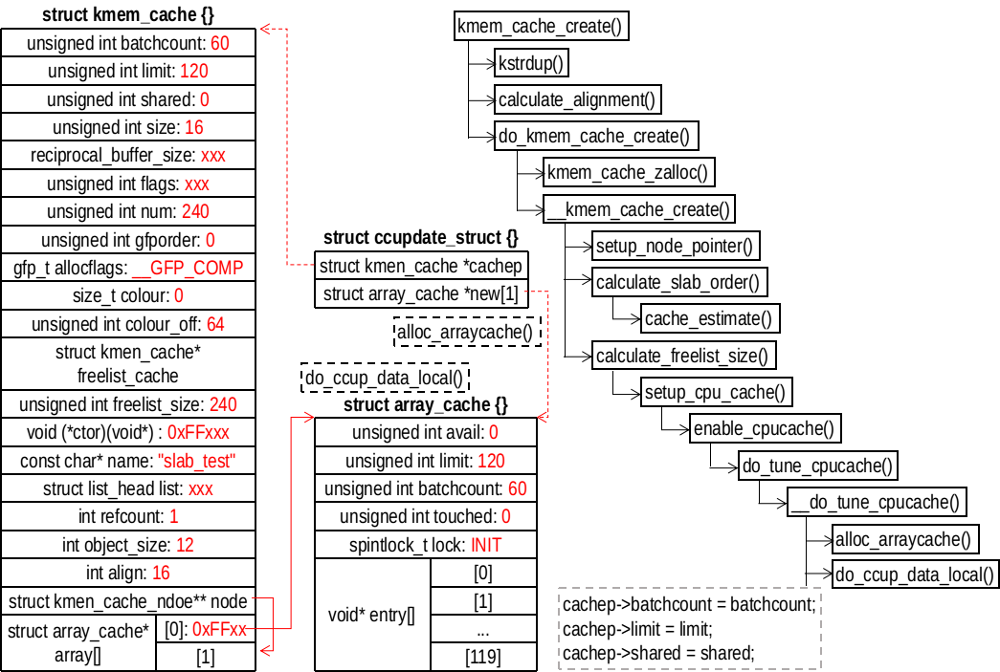

首先分配一个 ccupdate_struct 对象（用指针 new 指向）用于暂存分配的 array_cache 对象
```
/// @file mm/slab.c
3838 struct ccupdate_struct {
3839     struct kmem_cache *cachep;
3840     struct array_cache *new[0];
3841 };

3856 static int __do_tune_cpucache(struct kmem_cache *cachep, int limit,
3857                 int batchcount, int shared, gfp_t gfp)
3858 {   
3859     struct ccupdate_struct *new;
3860     int i;
3861     
3862     new = kzalloc(sizeof(*new) + nr_cpu_ids * sizeof(struct array_cache *),
3863               gfp);
3864     if (!new)
3865         return -ENOMEM;
```
然后开始分配 array_cache 对象
```
/// @file mm/slab.c     
3867     for_each_online_cpu(i) {
3868         new->new[i] = alloc_arraycache(cpu_to_mem(i), limit,
3869                         batchcount, gfp); // 分配array_cache*数组
3870         if (!new->new[i]) { // 分配失败，释放已经分配的
3871             for (i--; i >= 0; i--)
3872                 kfree(new->new[i]);
3873             kfree(new);
3874             return -ENOMEM;
3875         }
3876     }
3877     new->cachep = cachep;
```
将 new 指向的 array_cache 和 cachep 交换
```
/// @file mm/slab.c    
3879     on_each_cpu(do_ccupdate_local, (void *)new, 1); // 交换
3880     
3881     check_irq_on();
3882     cachep->batchcount = batchcount; 
3883     cachep->limit = limit;
3884     cachep->shared = shared;
```
最后释放 new 指向的对象
```
/// @file mm/slab.c
3886     for_each_online_cpu(i) {
3887         struct array_cache *ccold = new->new[i];
3888         if (!ccold) // 空指针，没有管理的对象
3889             continue;
3890         spin_lock_irq(&cachep->node[cpu_to_mem(i)]->list_lock);
3891         free_block(cachep, ccold->entry, ccold->avail, cpu_to_mem(i));
3892         spin_unlock_irq(&cachep->node[cpu_to_mem(i)]->list_lock);
3893         kfree(ccold);
3894     }
3895     kfree(new); // 释放 new 指向对象
3896     return alloc_kmem_cache_node(cachep, gfp);
3897 }
```

#### `alloc_arraycache()`
```
/// @file mm/slab.c
796 static struct array_cache *alloc_arraycache(int node, int entries,
797                         int batchcount, gfp_t gfp)
798 {   // 需要分配entries个指针，指向管理的对象
799     int memsize = sizeof(void *) * entries + sizeof(struct array_cache);
800     struct array_cache *nc = NULL;
801 
802     nc = kmalloc_node(memsize, gfp, node); // 分配
810     kmemleak_no_scan(nc);
811     if (nc) {
812         nc->avail = 0;
813         nc->limit = entries;
814         nc->batchcount = batchcount;
815         nc->touched = 0;
816         spin_lock_init(&nc->lock);
817     }
818     return nc;
819 }
```

#### on_each_cpu() 
on_each_cpu() 调用 do_ccpudate_local(info)
```
/// @file mm/slab.c
3843 static void do_ccupdate_local(void *info)
3844 {   
3845     struct ccupdate_struct *new = info; // 新分配的
3846     struct array_cache *old;
3847     
3848     check_irq_off();
3849     old = cpu_cache_get(new->cachep); // 原来cachep的array_cache
3850     // 交换
3851     new->cachep->array[smp_processor_id()] = new->new[smp_processor_id()];
3852     new->new[smp_processor_id()] = old;
3853 }
```

### STEP4、分配 kmem_cache_node 对象
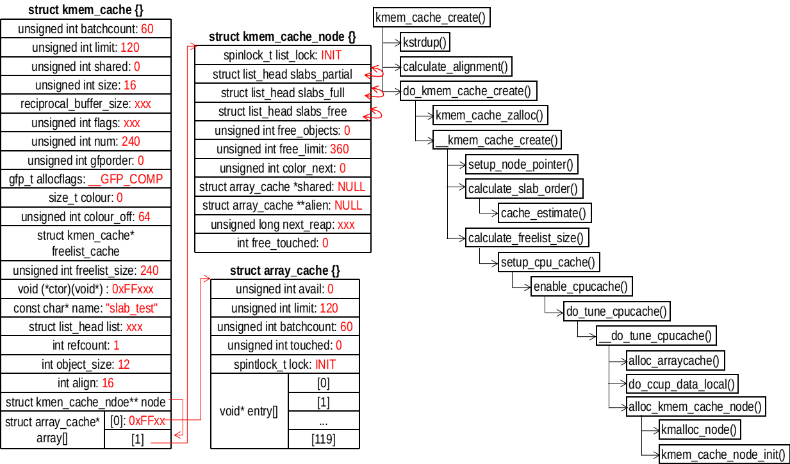

```
/// @file mm/slab.c
3753 static int alloc_kmem_cache_node(struct kmem_cache *cachep, gfp_t gfp)
3754 {
3755     int node;
3756     struct kmem_cache_node *n;
3757     struct array_cache *new_shared;
3758     struct array_cache **new_alien = NULL;
3759 
3760     for_each_online_node(node) {
3761     // for ( (node) = 0; (node) == 0; (node) = 1)
3762                 if (use_alien_caches) { // 不执行
3763                         new_alien = alloc_alien_cache(node, cachep->limit, gfp);
3764                         if (!new_alien)
3765                                 goto fail;
3766                 }
3767 
3768         new_shared = NULL;
3769         if (cachep->shared) { // 0，不执行
3770             new_shared = alloc_arraycache(node,
3771                 cachep->shared*cachep->batchcount,
3772                     0xbaadf00d, gfp);
3773             if (!new_shared) {
3774                 free_alien_cache(new_alien);
3775                 goto fail;
3776             }
3777         }
3778         // cachep->node指向cachep->array_cache[1]
3779         n = cachep->node[node];
3780         if (n) { // 现在为空，不执行
3781             struct array_cache *shared = n->shared;
3782 
3783             spin_lock_irq(&n->list_lock);
3784 
3785             if (shared)
3786                 free_block(cachep, shared->entry,
3787                         shared->avail, node);
3788 
3789             n->shared = new_shared;
3790             if (!n->alien) {
3791                 n->alien = new_alien;
3792                 new_alien = NULL;
3793             }
3794             n->free_limit = (1 + nr_cpus_node(node)) *
3795                     cachep->batchcount + cachep->num;
3796             spin_unlock_irq(&n->list_lock);
3797             kfree(shared);
3798             free_alien_cache(new_alien);
3799             continue;
3800         }
             // 分配kmem_cache_node对象
3801         n = kmalloc_node(sizeof(struct kmem_cache_node), gfp, node);
3802         if (!n) { // 分配失败
3803             free_alien_cache(new_alien);
3804             kfree(new_shared);
3805             goto fail;
3806         }
3807 
3808         kmem_cache_node_init(n); // 初始化
3809         n->next_reap = jiffies + REAPTIMEOUT_NODE +
3810                 ((unsigned long)cachep) % REAPTIMEOUT_NODE;
3811         n->shared = new_shared; // NULL
3812         n->alien = new_alien; // NULL
3813         n->free_limit = (1 + nr_cpus_node(node)) *
3814                     cachep->batchcount + cachep->num; // (1+1) * (120 + 60)
3815         cachep->node[node] = n;
3816     }
3817     return 0;
3818 
3819 fail:
/// ...
3836 }
```
kmem_cache_node_init() 的初始化操作如下：
```
/// @file mm/slab.c
254 static void kmem_cache_node_init(struct kmem_cache_node *parent)
255 {
256     INIT_LIST_HEAD(&parent->slabs_full); // list->next = list; list->prev = list;
257     INIT_LIST_HEAD(&parent->slabs_partial);
258     INIT_LIST_HEAD(&parent->slabs_free);
259     parent->shared = NULL;
260     parent->alien = NULL;
261     parent->colour_next = 0;
262     spin_lock_init(&parent->list_lock);
263     parent->free_objects = 0;
264     parent->free_touched = 0;
265 }
```
到目前位置，SLAB管理相关的数据结构已经分配完成，可以看到，此时并没有任何可以用对象。

## 分配对象 kmem_cache_alloc()
```
/// @file mm/slab.c
3549 void *kmem_cache_alloc(struct kmem_cache *cachep, gfp_t flags)
3550 {
3551     void *ret = slab_alloc(cachep, flags, _RET_IP_);
3552 
3553     trace_kmem_cache_alloc(_RET_IP_, ret,
3554                    cachep->object_size, cachep->size, flags);
3555 
3556     return ret;
3557 }
```
分配操作在 slab_alloc() 中完成
```
/// @file mm/slab.c
3374 static __always_inline void *
3375 slab_alloc(struct kmem_cache *cachep, gfp_t flags, unsigned long caller)
3376 {
3377     unsigned long save_flags;
3378     void *objp;
3379 
3380     flags &= gfp_allowed_mask;
3381 
3382     lockdep_trace_alloc(flags);
3383 
3384     if (slab_should_failslab(cachep, flags))
3385         return NULL;
3386 
3387     cachep = memcg_kmem_get_cache(cachep, flags); // return cachep
3388 
3389     cache_alloc_debugcheck_before(cachep, flags);
3390     local_irq_save(save_flags);
3391     objp = __do_cache_alloc(cachep, flags); // 分配对象
3392     local_irq_restore(save_flags);
3393     objp = cache_alloc_debugcheck_after(cachep, flags, objp, caller);
3394     kmemleak_alloc_recursive(objp, cachep->object_size, 1, cachep->flags,
3395                  flags);
3396     prefetchw(objp);
3397 
3398     if (likely(objp)) {
3399         kmemcheck_slab_alloc(cachep, flags, objp, cachep->object_size);
3400         if (unlikely(flags & __GFP_ZERO))
3401             memset(objp, 0, cachep->object_size);
3402     }
3403 
3404     return objp;
3405 }
```
\__do_cache_alloc() 继续调用 ____cache_alloc()
```
/// @file mm/slab.c
3366 static __always_inline void *
3367 __do_cache_alloc(struct kmem_cache *cachep, gfp_t flags)
3368 {
3369     return ____cache_alloc(cachep, flags);
3370 }
```
___cache_alloc() 的定义如下：
```
/// @file mm/slab.c
3070 static inline void *____cache_alloc(struct kmem_cache *cachep, gfp_t flags)
3071 {   
3072     void *objp;
3073     struct array_cache *ac;
3074     bool force_refill = false; // 预定不用填充（转移对象）
3075     
3076     check_irq_off();
3077     
3078     ac = cpu_cache_get(cachep); // cachep->array[0]
3079     if (likely(ac->avail)) { // 有可用对象
3080         ac->touched = 1; // 有过访问记录
3081         objp = ac_get_obj(cachep, ac, flags, false); // 返回一个对象
3082 
3083         /*
3084          * Allow for the possibility all avail objects are not allowed
3085          * by the current flags
3086          */
3087         if (objp) {
3088             STATS_INC_ALLOCHIT(cachep);
3089             goto out; // 返回
3090         } // 分配失败，需要填充对象
3091         force_refill = true; // 需要强制填充
3092     }
3093     // 没有可用对象，填充
3094     STATS_INC_ALLOCMISS(cachep);
3095     objp = cache_alloc_refill(cachep, flags, force_refill); // 填充
3096     /*
3097      * the 'ac' may be updated by cache_alloc_refill(),
3098      * and kmemleak_erase() requires its correct value.
3099      */
3100     ac = cpu_cache_get(cachep);
3101 
3102 out:
3103     /*
3104      * To avoid a false negative, if an object that is in one of the
3105      * per-CPU caches is leaked, we need to make sure kmemleak doesn't
3106      * treat the array pointers as a reference to the object.
3107      */
3108     if (objp)
3109         kmemleak_erase(&ac->entry[ac->avail]);
3110     return objp;
3111 }
```
从上面的分析可知，如果 array_cache 中有可用对象，直接从中获取。如果分配失败或者 array_cache 没有可用对象，需要调用 cache_alloc_refill() 进行处理。

### STEP1、从 array_cache 获取对象
调用 ac_get_obj() 获取一个对象，过程很简单。
```
/// @file mm/slab.c
902 static inline void *ac_get_obj(struct kmem_cache *cachep,
903             struct array_cache *ac, gfp_t flags, bool force_refill)
904 {
905     void *objp;
906 
907     if (unlikely(sk_memalloc_socks()))
908         objp = __ac_get_obj(cachep, ac, flags, force_refill);
909     else
910         objp = ac->entry[--ac->avail]; // 取一个对象并且递减可用对象计数ac->avail
911 
912     return objp; // 返回对象
913 }
```

### STEP2、若STEP1失败，调用 cache_alloc_refill()
在第一次申请对象时，force_refill 一定是 false，我们就按照这个分析。可以看到传入参数 force_refill 为 true 的话，直接跳转到 force_grow 进行申请页面，分割对象。
```
/// @file mm/slab.c
2901 static void *cache_alloc_refill(struct kmem_cache *cachep, gfp_t flags,
2902                             bool force_refill)
2903 {
2904     int batchcount;
2905     struct kmem_cache_node *n;
2906     struct array_cache *ac;
2907     int node;
2908 
2909     check_irq_off();
2910     node = numa_mem_id();
2911     if (unlikely(force_refill)) // unlikely表示不执行if的可能性大
2912         goto force_grow; // 强制填充
```
retry 是分配对象完成的地方，force_grow 只是申请页面，分割出对象，不会执行分配对象的操作。retry会尝试从其他地方转移一部分（数目为 batchcount）的对象到 array_cache 。第一步是尝试从 array_cache::shared 上获取一部分对象，根据前面的分析 shared 为空。
```
/// @file mm/slab.c
2913 retry:
2914     ac = cpu_cache_get(cachep);
2915     batchcount = ac->batchcount;
2916     if (!ac->touched && batchcount > BATCHREFILL_LIMIT) {
2917         /*
2918          * If there was little recent activity on this cache, then
2919          * perform only a partial refill.  Otherwise we could generate
2920          * refill bouncing.
2921          */
2922         batchcount = BATCHREFILL_LIMIT; // 16
2923     }
2924     n = cachep->node[node];
2925 
2926     BUG_ON(ac->avail > 0 || !n);
2927     spin_lock(&n->list_lock);
2928 
2929     /* See if we can refill from the shared array */
2930     if (n->shared && transfer_objects(ac, n->shared, batchcount)) {
2931         n->shared->touched = 1;
2932         goto alloc_done;
2933     }
```
接下来尝试从 slabs_partial 和 slabs_free 链表上 batchcount 个对象。
```
/// @file mm/slab.c
2935     while (batchcount > 0) {
2936         struct list_head *entry;
2937         struct page *page;
2938         /* Get slab alloc is to come from. */
2939         entry = n->slabs_partial.next; // 从slabs_partial获取
2940         if (entry == &n->slabs_partial) { // slabs_partial为空
2941             n->free_touched = 1;
2942             entry = n->slabs_free.next;//从slabs_free获取
2943             if (entry == &n->slabs_free) // slabs_free为空
2944                 goto must_grow; // 必须增长，第一次申请的时候必定跳转
2945         }
2946         // 通过entry获取struct page的地址
2947         page = list_entry(entry, struct page, lru);
2948         check_spinlock_acquired(cachep);
2949 
2950         /*
2951          * The slab was either on partial or free list so
2952          * there must be at least one object available for
2953          * allocation.
2954          */
2955         BUG_ON(page->active >= cachep->num);
2956         // 转移对象
2957         while (page->active < cachep->num && batchcount--) {
2958             STATS_INC_ALLOCED(cachep);
2959             STATS_INC_ACTIVE(cachep);
2960             STATS_SET_HIGH(cachep);
2961 
2962             ac_put_obj(cachep, ac, slab_get_obj(cachep, page,
2963                                     node));
2964         }
2965 
2966         /* move slabp to correct slabp list: */
2967         list_del(&page->lru);
2968         if (page->active == cachep->num)
2969             list_add(&page->lru, &n->slabs_full);
2970         else
2971             list_add(&page->lru, &n->slabs_partial);
2972     }
2973 
2974 must_grow: // 第一次申请必定跳转到这里
2975     n->free_objects -= ac->avail;
2976 alloc_done:
2977     spin_unlock(&n->list_lock);
2978 
2979     if (unlikely(!ac->avail)) { // 再次尝试
2980         int x;
2981 force_grow: // 申请页面
2982         x = cache_grow(cachep, flags | GFP_THISNODE, node, NULL);
2983 
2984         /* cache_grow can reenable interrupts, then ac could change. */
2985         ac = cpu_cache_get(cachep);
2986         node = numa_mem_id();
2987 
2988         /* no objects in sight? abort */
2989         if (!x && (ac->avail == 0 || force_refill))
2990             return NULL;
2991 
2992         if (!ac->avail)     /* objects refilled by interrupt? */
2993             goto retry;
2994     }
2995     ac->touched = 1;
2996 
2997     return ac_get_obj(cachep, ac, flags, force_refill);
2998 }
```

### STEP3、（退无可退）必须申请页面，转到 cache_grow
需要注意的是， cache_grow() 在申请页面后，再次跳转到 retry 
#### 申请页
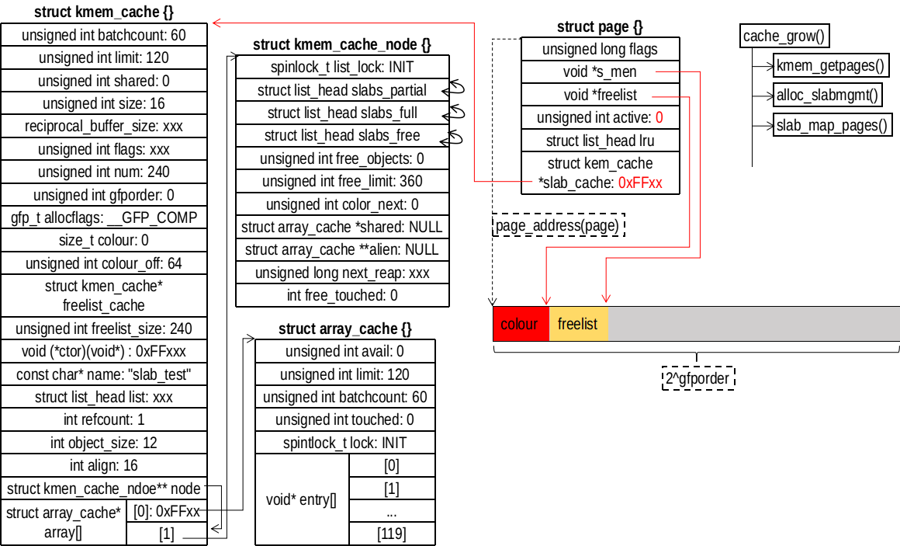

```
/// @file mm/slab.c
2738 static int cache_grow(struct kmem_cache *cachep,
2739         gfp_t flags, int nodeid, struct page *page)
2740 {
2741     void *freelist;
2742     size_t offset;
2743     gfp_t local_flags;
2744     struct kmem_cache_node *n;
2745 
2746     /*
2747      * Be lazy and only check for valid flags here,  keeping it out of the
2748      * critical path in kmem_cache_alloc().
2749      */
2750     BUG_ON(flags & GFP_SLAB_BUG_MASK);
2751     local_flags = flags & (GFP_CONSTRAINT_MASK|GFP_RECLAIM_MASK);
2752 
2753     /* Take the node list lock to change the colour_next on this node */
2754     check_irq_off();
2755     n = cachep->node[nodeid];
2756     spin_lock(&n->list_lock);
2757 
2758     /* Get colour for the slab, and cal the next value. */
2759     offset = n->colour_next;
2760     n->colour_next++;
2761     if (n->colour_next >= cachep->colour)
2762         n->colour_next = 0;
2763     spin_unlock(&n->list_lock);
2764 
2765     offset *= cachep->colour_off;
2766 
2767     if (local_flags & __GFP_WAIT)
2768         local_irq_enable();
2769 
2770     /*
2771      * The test for missing atomic flag is performed here, rather than
2772      * the more obvious place, simply to reduce the critical path length
2773      * in kmem_cache_alloc(). If a caller is seriously mis-behaving they
2774      * will eventually be caught here (where it matters).
2775      */
2776     kmem_flagcheck(cachep, flags);
2777 
2778     /*
2779      * Get mem for the objs.  Attempt to allocate a physical page from
2780      * 'nodeid'.
2781      */
2782     if (!page)
2783         page = kmem_getpages(cachep, local_flags, nodeid);
2784     if (!page)
2785         goto failed;
2786 
2787     /* Get slab management. */
2788     freelist = alloc_slabmgmt(cachep, page, offset,
2789             local_flags & ~GFP_CONSTRAINT_MASK, nodeid);
2790     if (!freelist)
2791         goto opps1;
2792 
2793     slab_map_pages(cachep, page, freelist);
```
alloc_slabmgmt() 是分配slab管理结构
```
/// @file mm/slab.c
2595 static void *alloc_slabmgmt(struct kmem_cache *cachep,
2596                    struct page *page, int colour_off,
2597                    gfp_t local_flags, int nodeid)
2598 {
2599     void *freelist;
2600     void *addr = page_address(page);
2601 
2602     if (OFF_SLAB(cachep)) { // 管理结构在外边
2603         /* Slab management obj is off-slab. */
2604         freelist = kmem_cache_alloc_node(cachep->freelist_cache,
2605                           local_flags, nodeid);
2606         if (!freelist)
2607             return NULL;
2608     } else { // 管理结构在slab内部
2609         freelist = addr + colour_off;
2610         colour_off += cachep->freelist_size;
2611     }
2612     page->active = 0;
2613     page->s_mem = addr + colour_off;
2614     return freelist;
2615 }
```
slab_map_pages() 是连接 cachep 和 freelist
```
/// @file mm/slab.c
2727 static void slab_map_pages(struct kmem_cache *cache, struct page *page,
2728                void *freelist)
2729 {
2730     page->slab_cache = cache;
2731     page->freelist = freelist;
2732 }
```

#### 分割页
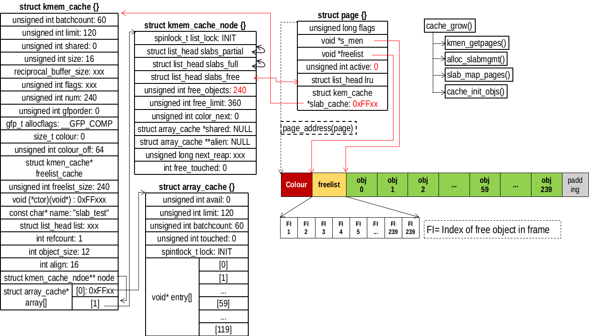

```
/// @file mm/slab.c : cache_grow()
2795     cache_init_objs(cachep, page);
2796 
2797     if (local_flags & __GFP_WAIT)
2798         local_irq_disable();
2799     check_irq_off();
2800     spin_lock(&n->list_lock);
2801 
2802     /* Make slab active. */
2803     list_add_tail(&page->lru, &(n->slabs_free));
2804     STATS_INC_GROWN(cachep);
2805     n->free_objects += cachep->num;
2806     spin_unlock(&n->list_lock);
2807     return 1;
2808 opps1:
2809     kmem_freepages(cachep, page);
2810 failed:
2811     if (local_flags & __GFP_WAIT)
2812         local_irq_disable();
2813     return 0;
2814 }
```
将页面分割成对象是调用 cache_init_objs() 完成的。完成后，将 page 挂到 slabs_free 链表的末尾。
```
/// @file mm/slab.c
2628 static void cache_init_objs(struct kmem_cache *cachep,
2629                 struct page *page)
2630 {
2631     int i;
2632 
2633     for (i = 0; i < cachep->num; i++) {
2634         void *objp = index_to_obj(cachep, page, i);
2635 #if DEBUG
/// ...
2666 #else
2667         if (cachep->ctor) // 有构造函数，调用够栈函数
2668             cachep->ctor(objp);
2669 #endif
2670         set_obj_status(page, i, OBJECT_FREE); // 空函数
2671         set_free_obj(page, i, i); // 设置slab管理结构freelist
2672     }
2673 }
```
index_to_obj() 是根据索引返回对象的地址
```
/// @file mm/slab.c
438 static inline void *index_to_obj(struct kmem_cache *cache, struct page *page,
439                  unsigned int idx)
440 {
441     return page->s_mem + cache->size * idx;
442 }
```
从 set_free_obj() 可以看出slab管理结构 freelist 是什么。freelist 是一个数组，存放对象的索引，在初始化的时候，freelist[i] = i，根据索引值就可以找到对象的地址。page->active 表示本 slab 分配出的对象，也表示 freelist 数组使用的是 [0, page->active) 区间，该区间保存的索引就是分配出去的对象的索引。
```
/// @file mm/slab.c
2622 static inline void set_free_obj(struct page *page,
2623                     unsigned int idx, freelist_idx_t val)
2624 {
2625     ((freelist_idx_t *)(page->freelist))[idx] = val;
2626 }
```

#### 再次访问 retry
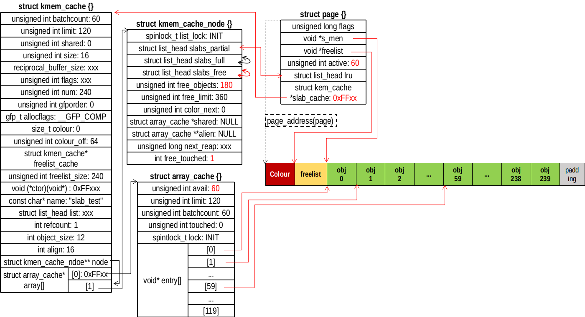

此时 slabs_free 链表不再为空，需要用这个链表上的对象填充 array_cache 数组。
```
/// @file mm/slab.c : cache_alloc_refill()
2957         while (page->active < cachep->num && batchcount--) { // 循环
2958             STATS_INC_ALLOCED(cachep);
2959             STATS_INC_ACTIVE(cachep);
2960             STATS_SET_HIGH(cachep);
2961 
2962             ac_put_obj(cachep, ac, slab_get_obj(cachep, page,
2963                                     node));
2964         }

2974 must_grow: // 第一次申请必定跳转到这里
2975     n->free_objects -= ac->avail;

2997     return ac_get_obj(cachep, ac, flags, force_refill); // 返回一个对象
```
slab_get_obj() 是从 page 获取一个对象
```
/// @file mm/slab.c
2685 static void *slab_get_obj(struct kmem_cache *cachep, struct page *page,
2686                 int nodeid)
2687 {
2688     void *objp;
2689 
2690     objp = index_to_obj(cachep, page, get_free_obj(page, page->active));
2691     page->active++; // 表示在使用
2692 #if DEBUG
2693     WARN_ON(page_to_nid(virt_to_page(objp)) != nodeid);
2694 #endif
2695 
2696     return objp;
2697 }
```
get_free_obj() 是返回未分配对象的索引
```
/// @file mm/slab.c
2617 static inline freelist_idx_t get_free_obj(struct page *page, unsigned int idx)
2618 {
2619     return ((freelist_idx_t *)page->freelist)[idx];
2620 }
```
ac_put_obj() 的作用就是将对象放到 array_cache 中
```
/// @file mm/slab.c
928 static inline void ac_put_obj(struct kmem_cache *cachep, struct array_cache *ac,
929                                 void *objp)
930 {
931     if (unlikely(sk_memalloc_socks()))
932         objp = __ac_put_obj(cachep, ac, objp);
933 
934     ac->entry[ac->avail++] = objp; // 这里
935 }
```
需要注意的是，这里是指针的改变，并没有对象的移动。最后调用 ac_get_obj() 返回一个对象

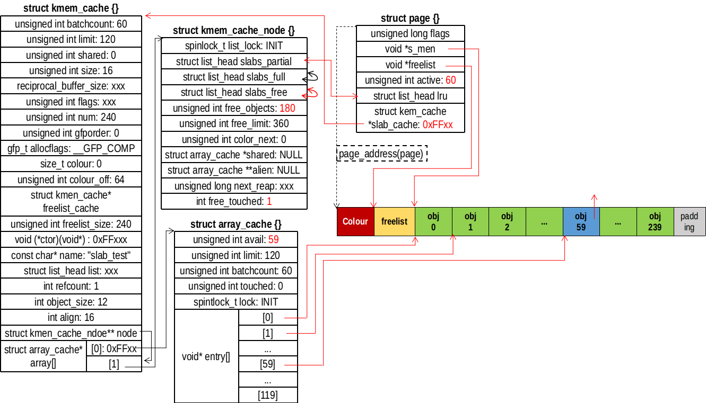

## 释放对象 kmem_cache_free()
首先是根据obj的地址找到所属的 cache ，这时通过 cache_from_obj() 实现的。基本的流程是先通过 obj 的地址找到所属的页面 page，通过 page->slab_cache 找到所属的 cache。然后调用 __cache_free() 释放对象。
```
/// @file mm/slab.c
3703 void kmem_cache_free(struct kmem_cache *cachep, void *objp)
3704 {
3705     unsigned long flags;
3706     cachep = cache_from_obj(cachep, objp); // 根据obj找到所属的cachep
3707     if (!cachep)
3708         return;
3709 
3710     local_irq_save(flags);
3711     debug_check_no_locks_freed(objp, cachep->object_size);
3712     if (!(cachep->flags & SLAB_DEBUG_OBJECTS))
3713         debug_check_no_obj_freed(objp, cachep->object_size);
3714     __cache_free(cachep, objp, _RET_IP_); // 释放工作
3715     local_irq_restore(flags);
3716 
3717     trace_kmem_cache_free(_RET_IP_, objp);
3718 }
```

### __cache_free()
当 array_cache 还有空闲时，调用 ac_put_obj() 直接放入。否则要先刷新 cache_flusharray()，再放入。
```
/// @file mm/slab.c
3510 static inline void __cache_free(struct kmem_cache *cachep, void *objp,
3511                 unsigned long caller)
3512 {
3513     struct array_cache *ac = cpu_cache_get(cachep);
3514 
3515     check_irq_off();
3516     kmemleak_free_recursive(objp, cachep->flags);
3517     objp = cache_free_debugcheck(cachep, objp, caller);
3518 
3519     kmemcheck_slab_free(cachep, objp, cachep->object_size);
3520 
3521     /*
3522      * Skip calling cache_free_alien() when the platform is not numa.
3523      * This will avoid cache misses that happen while accessing slabp (which
3524      * is per page memory  reference) to get nodeid. Instead use a global
3525      * variable to skip the call, which is mostly likely to be present in
3526      * the cache.
3527      */
3528     if (nr_online_nodes > 1 && cache_free_alien(cachep, objp))
3529         return;
3530 
3531     if (likely(ac->avail < ac->limit)) {
3532         STATS_INC_FREEHIT(cachep); // 空函数
3533     } else { // array_cache中的对象数量达到最大值
3534         STATS_INC_FREEMISS(cachep);
3535         cache_flusharray(cachep, ac); // 刷新array_cache
3536     }
3537 
3538     ac_put_obj(cachep, ac, objp);
3539 }
```

### cache_flusharray()
```
/// @file mm/slab.c
3455 static void cache_flusharray(struct kmem_cache *cachep, struct array_cache *ac)
3456 {   
3457     int batchcount;
3458     struct kmem_cache_node *n;
3459     int node = numa_mem_id();
3460     
3461     batchcount = ac->batchcount;
3462 #if DEBUG
3463     BUG_ON(!batchcount || batchcount > ac->avail);
3464 #endif
3465     check_irq_off();
3466     n = cachep->node[node];
3467     spin_lock(&n->list_lock);
3468     if (n->shared) { // 首先尝试转移到shared
3469         struct array_cache *shared_array = n->shared;
3470         int max = shared_array->limit - shared_array->avail;
3471         if (max) {
3472             if (batchcount > max)
3473                 batchcount = max;
3474             memcpy(&(shared_array->entry[shared_array->avail]),
3475                    ac->entry, sizeof(void *) * batchcount);
3476             shared_array->avail += batchcount;
3477             goto free_done;
3478         }
3479     }
3480     
3481     free_block(cachep, ac->entry, batchcount, node); // 主要工作
3482 free_done:
3483 #if STATS // 忽略
3484     {
3485         int i = 0;
3486         struct list_head *p;
3487 
3488         p = n->slabs_free.next;
3489         while (p != &(n->slabs_free)) {
3490             struct page *page;
3491             
3492             page = list_entry(p, struct page, lru);
3493             BUG_ON(page->active);
3494 
3495             i++;
3496             p = p->next;
3497         }   
3498         STATS_SET_FREEABLE(cachep, i);
3499     }   
3500 #endif  
3501     spin_unlock(&n->list_lock);
3502     ac->avail -= batchcount; // 修复array_cache
3503     memmove(ac->entry, &(ac->entry[batchcount]), sizeof(void *)*ac->avail);
3504 }
```

### free_block()
将 nr_objects 个对象放回所属的页面中
```
/// @file mm/slab.c
3410 static void free_block(struct kmem_cache *cachep, void **objpp, int nr_objects,
3411                int node)
3412 {   
3413     int i; 
3414     struct kmem_cache_node *n;
3415     
3416     for (i = 0; i < nr_objects; i++) {
3417         void *objp; 
3418         struct page *page;
3419 
3420         clear_obj_pfmemalloc(&objpp[i]); // 清除一些标志
3421         objp = objpp[i];
3422 
3423         page = virt_to_head_page(objp); // objp ==> page
3424         n = cachep->node[node];
3425         list_del(&page->lru);
3426         check_spinlock_acquired_node(cachep, node);
3427         slab_put_obj(cachep, page, objp, node); // 还会 obj
3428         STATS_DEC_ACTIVE(cachep);
3429         n->free_objects++; // 可用对象递增
3430 
3431         /* fixup slab chains */
3432         if (page->active == 0) { // page的对象全部回收
3433             if (n->free_objects > n->free_limit) { // node管理的超过阈值
3434                 n->free_objects -= cachep->num;
3435                 /* No need to drop any previously held
3436                  * lock here, even if we have a off-slab slab
3437                  * descriptor it is guaranteed to come from
3438                  * a different cache, refer to comments before
3439                  * alloc_slabmgmt.
3440                  */
3441                 slab_destroy(cachep, page); // 释放页面
3442             } else { // 否则挂到空闲链表
3443                 list_add(&page->lru, &n->slabs_free);
3444             }
3445         } else { // 挂到部分链表
3446             /* Unconditionally move a slab to the end of the
3447              * partial list on free - maximum time for the
3448              * other objects to be freed, too.
3449              */
3450             list_add_tail(&page->lru, &n->slabs_partial);
3451         }
3452     }
3453 }
```
slab_put_obj() 的工作很简单
```
/// @file mm/slab.c
2699 static void slab_put_obj(struct kmem_cache *cachep, struct page *page,
2700                 void *objp, int nodeid)
2701 {
2702     unsigned int objnr = obj_to_index(cachep, page, objp);
2703 #if DEBUG
/// ..
2717 #endif
2718     page->active--;
2719     set_free_obj(page, page->active, objnr);
2720 }
```
slab_destroy() 的工作是释放页面和 slab 管理结构（如果在外部）
```
/// @file mm/slab.c
2034 static void slab_destroy(struct kmem_cache *cachep, struct page *page)
2035 {
2036     void *freelist;
2037 
2038     freelist = page->freelist;
2039     slab_destroy_debugcheck(cachep, page);
2040     if (unlikely(cachep->flags & SLAB_DESTROY_BY_RCU)) {
2041         struct rcu_head *head;
2049         head = (void *)&page->rcu_head;
2050         call_rcu(head, kmem_rcu_free);
2051 
2052     } else {
2053         kmem_freepages(cachep, page); // 回收页面
2054     }
2055 
2060     if (OFF_SLAB(cachep)) // 释放slab管理结构
2061         kmem_cache_free(cachep->freelist_cache, freelist);
2062 }
```

## SLAB 分配器释放
### kmem_cache_destroy()
kmem_cache_destroy() 的工作是释放一个 cache
```
/// @file mm/slab_common.c
335 void kmem_cache_destroy(struct kmem_cache *s)
336 {
337     get_online_cpus();
338     get_online_mems();
339 
340     mutex_lock(&slab_mutex);
341 
342     s->refcount--; // 递减引用计数
343     if (s->refcount) // 仍然有其他用户
344         goto out_unlock;
345 
346     if (memcg_cleanup_cache_params(s) != 0)
347         goto out_unlock;
348 
349     if (__kmem_cache_shutdown(s) != 0) { // 直接返回0，不会执行
350         printk(KERN_ERR "kmem_cache_destroy %s: "
351                "Slab cache still has objects\n", s->name);
352         dump_stack();
353         goto out_unlock;
354     }
355 
356     list_del(&s->list); // 将kmem_cache对象从链表中取下
357 
358     mutex_unlock(&slab_mutex);
359     if (s->flags & SLAB_DESTROY_BY_RCU)
360         rcu_barrier();
361 
362     memcg_free_cache_params(s);
363 #ifdef SLAB_SUPPORTS_SYSFS
364     sysfs_slab_remove(s);
365 #else
366     slab_kmem_cache_release(s); // 释放工作发生的地方
367 #endif
368     goto out;
369 
370 out_unlock:
371     mutex_unlock(&slab_mutex);
372 out:
373     put_online_mems();
374     put_online_cpus();
375 }
```
slab_kmem_cache_release() 进行释放操作
```
/// @file mm/slab_common.c
329 void slab_kmem_cache_release(struct kmem_cache *s)
330 {
331     kfree(s->name); // 释放名字占用的空间
332     kmem_cache_free(kmem_cache, s); // 释放
333 }
```
需要注意的是， kmem_cache 是一个全局变量，指向一个 cache，这个 cache 管理分配 kmem_cache 对象。kmem_cache 对象的释放和普通对象的释放一样，kmem_cache_free() 的处理也一样。