# Linux网络实现之TCP

## socket结构
套接字代表一条端到端通信的一端，存储了该端所有与通信有关的信息。这些信息包括：使用的协议、套接字状态、源地址、目的地址、到达的连接、数据缓冲和可选标志。
```
/// @file inlude/linux/net.h
105 struct socket {
106     socket_state        state;
107 
108     kmemcheck_bitfield_begin(type);
109     short           type;
110     kmemcheck_bitfield_end(type);
111 
112     unsigned long       flags;
113 
114     struct socket_wq __rcu  *wq;
115 
116     struct file     *file;
117     struct sock     *sk;
118     const struct proto_ops  *ops;
119 };
每个成员的含义如下：
```
- `state`表征套接字的状态（不同于TCP连接的状态），其状态如下：
```
/// @file inlcude/uapi/linux/net.h
47 typedef enum {
48     SS_FREE = 0,      // 未分配
49     SS_UNCONNECTED,   // 未连接
50     SS_CONNECTING,    // 正在连接
51     SS_CONNECTED,     // 已连接
52     SS_DISCONNECTING  // 正在断开连接
53 } socket_state;
```
- `type`表征套接字的类型，比如常用的`SOCK_STREAM`（TCP）和`SOCK_DGRAM`（UDP）等
- `flags`表征套接字的选项
- `wq`指向等待队列
```
/// @file inlcude/linux/net.h
88 struct socket_wq {
90     wait_queue_head_t   wait;
91     struct fasync_struct    *fasync_list; // 异步通知队列
92     struct rcu_head     rcu; // Read-Copy Update
93 } ____cacheline_aligned_in_smp;
```
`wait`是头结点，封装自旋锁和任务队列头部
```
/// @file include/linux/wait.h
35 struct __wait_queue_head {
36     spinlock_t      lock;
37     struct list_head    task_list;
38 };
39 typedef struct __wait_queue_head wait_queue_head_t;
```
`rcu`是读拷贝修改(Read-Copy Update, RCU)，对于被RCU保护的共享数据结构，读者不需要获得任何锁就可以访问它，但写者在访问它时首先拷贝一个副本，然后对副本进行修改，最后使用一个回调（callback）机制在适当的时机把指向原来数据的指针重新指向新的被修改的数据。这个时机就是所有引用该数据的CPU都退出对共享数据的操作。
- `file`指向与该套接字相关联的`struct file`对象
- `sk`指向`struct sock`对象。
  - 用户空间每创建一个套接字，内核会有`struct socket`和`struck sock`对象与之关联。
  - 为了方便区分，`sock`总是指向`struct socket`对象，`sk`总是指向`struct sock`对象。
  - 两个对象是共生关系，`socket::sk`指向`sock`，而`sock::sk_socket`指向`socket`。

- `ops`套接字操作函数，用来将套接字系统调用映射到相应的传输层实现。结构体`proto_ops`除了一个`int`型成员`family`表示协议族，一个`mudule`结构体的成员`owner`表示所属模块外，其余都是函数指针，因此整个`proto_ops`结构可以看作是一张套接字系统调用到传输层函数的跳转表。
```
/// @file inlcude/linux/net.h
128 struct proto_ops {
129     int     family;
130     struct module   *owner;
131     int     (*release)   (struct socket *sock);
132     int     (*bind)      (struct socket *sock,
133                       struct sockaddr *myaddr,
134                       int sockaddr_len);
135     int     (*connect)   (struct socket *sock,
136                       struct sockaddr *vaddr,
137                       int sockaddr_len, int flags);
138     int     (*socketpair)(struct socket *sock1,
139                       struct socket *sock2);
140     int     (*accept)    (struct socket *sock,
141                       struct socket *newsock, int flags);
142     int     (*getname)   (struct socket *sock,
143                       struct sockaddr *addr,
144                       int *sockaddr_len, int peer);
145     unsigned int    (*poll)      (struct file *file, struct socket *sock,
146                       struct poll_table_struct *wait);
147     int     (*ioctl)     (struct socket *sock, unsigned int cmd,
148                       unsigned long arg);
153     int     (*listen)    (struct socket *sock, int len);
154     int     (*shutdown)  (struct socket *sock, int flags);
155     int     (*setsockopt)(struct socket *sock, int level,
156                       int optname, char __user *optval, unsigned int optlen);
157     int     (*getsockopt)(struct socket *sock, int level,
158                       int optname, char __user *optval, int __user *optlen);
165     int     (*sendmsg)   (struct kiocb *iocb, struct socket *sock,
166                       struct msghdr *m, size_t total_len);
175     int     (*recvmsg)   (struct kiocb *iocb, struct socket *sock,
176                       struct msghdr *m, size_t total_len,
177                       int flags);
178     int     (*mmap)      (struct file *file, struct socket *sock,
179                       struct vm_area_struct * vma);
180     ssize_t     (*sendpage)  (struct socket *sock, struct page *page,
181                       int offset, size_t size, int flags);
182     ssize_t     (*splice_read)(struct socket *sock,  loff_t *ppos,
183                        struct pipe_inode_info *pipe, size_t len, unsigned int flags);
184     int     (*set_peek_off)(struct sock *sk, int val);
185 };
```
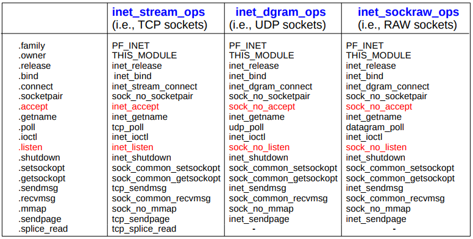

## `struct socket`和`struct sock`关系

### BSD协议栈
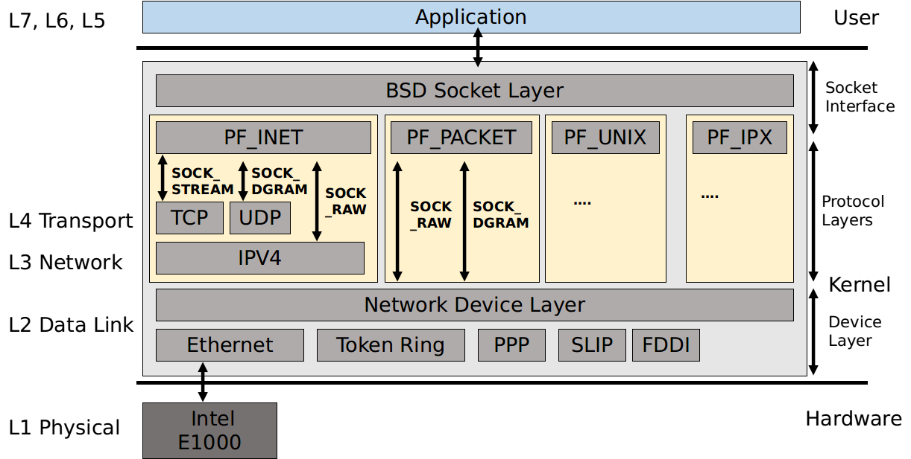

### 各种`sock`之间的关系
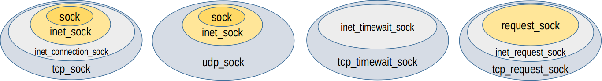

这种关系特别像C++中的继承。用一个`struct sock`指针可以指向`struct tcp_sock`或者`struct udp_sock`对象，通过类型转换，可以将`struct sock`对象向”继承“方向转型为`struct inet_sock`、`struct inet_connection_sock`和`struct tcp_sock`等。

### `socket`和`sock`的关系
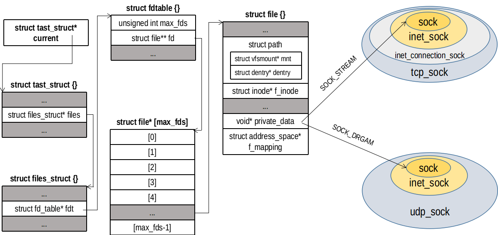

`struct socket`是统一的接口，用于和`struct file`对象绑定。其`struct socket::sk`成员可以指向具体的套接字（比如`struct tcp_sock`或`struct udp_sock`）

## 套接字文件
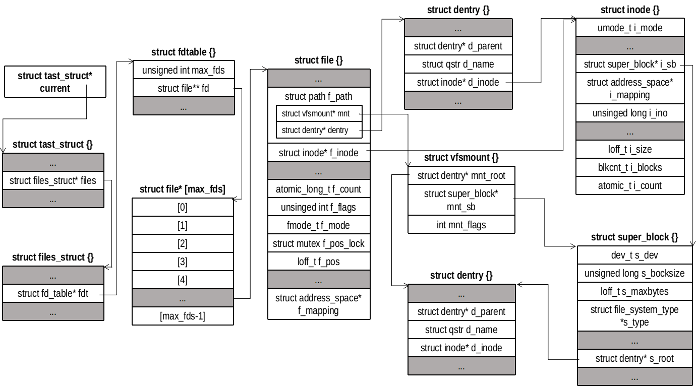

Linux一切皆文件。套接字也是一种文件，是由类型为`sock_fs_type`的伪文件系统（pseudo filesystem）负责创建、打开和关闭以及读写。可其他文件一样，用户空间使用的套接字是文件描述符，是数组`struct file`的索引值。`struct file`是进程对打开文件的抽象表示，`struct inode`是虚拟文件系统对打开文件的表示。不同进程打开同一个文件会有不同`struct file`对象，但是都指向同一个`struct inode`对象。`struct file`记录了本进程文件读写的标记的位置，打开文件的权限等。每个打开的文件都有一个`struct inode`，伪文件系统`sock_fs_type`管理`inode`的分配和释放（分别调用`alloc_inode`和`destroy_inode`，其底层分别调用`sock_alloc_inode`和`sock_destroy_inode`）。当创建一个套接字，就会分配一个`struct socket_alloc`，里面包含了一个`struct inode`对象以及`struct socket`对象。
```
struct socket_alloc {
/// @file include/net/sock.h
1395 struct socket_alloc {
1396     struct socket socket;
1397     struct inode vfs_inode;
1398 };
```

## 相关（全局）变量
### slab分配器
用`cat /proc/slabinfo`可以查看系统创建的slab分配器。和套接字有关的有如下几个（不考虑IPv6）
- `sock_inode_cache`：分配`strict socket_alloc`对象，由全局变量`sock_inode_cachep`指向
- `TCP`：分配`struct tcp_sock`对象，由全局变量`tcp_prot.slab`指向
- `request_sock_TCP`：分配`struct tcp_request_sock`对象，由全局变量`tcp_prot->rsk_prot->slab`指向
- `tw_sock_TCP`：分配`struct tcp_timewait_sock`对象，由全局变量`tcp_prot->twsk_prot->slab`指向
- `UDP`：分配`struct udp_sock`对象，由全局变量`udp_prot->slab`指向（`/sys/kernel/slab`存在）
- `RAW`：分配`struct raw_sock`对象，由全局变量`raw_prot.slab`指向

用于分配`struct tcp_sock`、`struct tcp_request_sock`和`struct tcp_timewait_sock`对象的slab分配器在`inet_init::proto_register(&tcp_prot, 1)`中完成（`net/ipv4/af_inet.c 1703`）。`proto_register`主要完成slab分配器的创建
1. 创建分配`struct tcp_sock`的slab，名字为`TCP`，用`tcp_prot->slab`指向。
```
/// @file net/core/sock.c
2797 int proto_register(struct proto *prot, int alloc_slab)
2798 {
2799     if (alloc_slab) {
2800         prot->slab = kmem_cache_create(prot->name, prot->obj_size, 0,
2801                     SLAB_HWCACHE_ALIGN | prot->slab_flags,
2802                     NULL);
```
2. 创建分配`tcp_request_sock`的slab，名字为`request_sock_TCP`，用`tcp_prot->rsk_prot->slab`指向
```
/// @file net/core/sock.c
2810         if (prot->rsk_prot != NULL) {
2811             prot->rsk_prot->slab_name = kasprintf(GFP_KERNEL, "request_sock_%s", prot->name);
2812             if (prot->rsk_prot->slab_name == NULL)
2813                 goto out_free_sock_slab;
2814 
2815             prot->rsk_prot->slab = kmem_cache_create(prot->rsk_prot->slab_name,
2816                                  prot->rsk_prot->obj_size, 0,
2817                                  SLAB_HWCACHE_ALIGN, NULL);
```

3. 创建分配`tcp_timewait_sock`的slab，名字为`tw_sock_TCP`，用`tcp_prot->twsk_prot->slab`指向
```
/// @file net/core/sock.c
2826         if (prot->twsk_prot != NULL) {
2827             prot->twsk_prot->twsk_slab_name = kasprintf(GFP_KERNEL, "tw_sock_%s", prot->name);
2828 
2829             if (prot->twsk_prot->twsk_slab_name == NULL)
2830                 goto out_free_request_sock_slab;
2831 
2832             prot->twsk_prot->twsk_slab =
2833                 kmem_cache_create(prot->twsk_prot->twsk_slab_name,
2834                           prot->twsk_prot->twsk_obj_size,
2835                           0,
2836                           SLAB_HWCACHE_ALIGN |
2837                             prot->slab_flags,
2838                           NULL);
```

### `net_families`数组
最初的赋值操作在`inet_init::sock_register(&inet_family_ops)`中完成（`net/ipv4/af_inet.c 1703`）。`inet_family_ops`是个全局变量，定义如下
```
/// net/ipv4/af_inet.c 991
991 static const struct net_proto_family inet_family_ops = {
992     .family = PF_INET,
993     .create = inet_create,
994     .owner  = THIS_MODULE,
995 };
```
`sock_register`主要的工作就是将`PF_INET`注册进`net_families`
```
/// @file net/socket.c
2606 int sock_register(const struct net_proto_family *ops)
2607 {
2608     int err;
2609 
2610     if (ops->family >= NPROTO) {
2611         pr_crit("protocol %d >= NPROTO(%d)\n", ops->family, NPROTO);
2612         return -ENOBUFS;
2613     }
2614 
2615     spin_lock(&net_family_lock);
2616     if (rcu_dereference_protected(net_families[ops->family],
2617                       lockdep_is_held(&net_family_lock)))
2618         err = -EEXIST;
2619     else {
2620         rcu_assign_pointer(net_families[ops->family], ops); // 赋值
2621         err = 0;
2622     }
2623     spin_unlock(&net_family_lock);
2624 
2625     pr_info("NET: Registered protocol family %d\n", ops->family);
2626     return err;
2627 }
```
结果就是`net_families[PF_INET]->create`指向的是`inet_create`

### `inet_protos`数组
`inet_init::inet_add_protocol`将协议`tcp_protocol`、`udp_protocol`、`icmp_protocol`和`igmp_protocol`写进全局变量`inet_protos`。结果就是
```
inet_protos[
  IPPROTO_ICMP, &icmp_protocol,
  IPPROTO_UDP, &udp_protocol,
  IPPROTO_TCP, &tcp_protocol,
  IPPROTO_IGMP, &igmp_protocol
]
```

### `inetsw`链表
`inetsw`存放的是套接字接口`inet_protosw`指针，将数组`inetsw_array`的内容赋值给`inetsw`。全局变量`inetsw_array`的定义如下：
```
/// @file net/ipv4/af_inet.c
1000 static struct inet_protosw inetsw_array[] =
1001 {
1002     {
1003         .type =       SOCK_STREAM,
1004         .protocol =   IPPROTO_TCP,
1005         .prot =       &tcp_prot,
1006         .ops =        &inet_stream_ops,
1007         .flags =      INET_PROTOSW_PERMANENT |
1008                   INET_PROTOSW_ICSK,
1009     },
1010 
1011     {
1012         .type =       SOCK_DGRAM,
1013         .protocol =   IPPROTO_UDP,
1014         .prot =       &udp_prot,
1015         .ops =        &inet_dgram_ops,
1016         .flags =      INET_PROTOSW_PERMANENT,
1017        },
1018 
1019        {
1020         .type =       SOCK_DGRAM,
1021         .protocol =   IPPROTO_ICMP,
1022         .prot =       &ping_prot,
1023         .ops =        &inet_sockraw_ops,
1024         .flags =      INET_PROTOSW_REUSE,
1025        },
1026 
1027        {
1028            .type =       SOCK_RAW,
1029            .protocol =   IPPROTO_IP,    /* wild card */
1030            .prot =       &raw_prot,
1031            .ops =        &inet_sockraw_ops,
1032            .flags =      INET_PROTOSW_REUSE,
1033        }
1034 };
```

## 传输控制块的分配和释放
### `sk_alloc()`
调用`sk_prot_alloc()`分配一个传输控制块，然后进行必要的初始化。
```
/// @file net/core/sock.c
1403 struct sock *sk_alloc(struct net *net, int family, gfp_t priority,
1404               struct proto *prot)
1405 {
1406     struct sock *sk;
1407 
1408     sk = sk_prot_alloc(prot, priority | __GFP_ZERO, family); // 分配
1409     if (sk) { // 初始化
1410         sk->sk_family = family;
1411         /*
1412          * See comment in struct sock definition to understand
1413          * why we need sk_prot_creator -acme
1414          */
1415         sk->sk_prot = sk->sk_prot_creator = prot;
1416         sock_lock_init(sk);
1417         sock_net_set(sk, get_net(net));
1418         atomic_set(&sk->sk_wmem_alloc, 1);
1419 
1420         sock_update_classid(sk);
1421         sock_update_netprioidx(sk);
1422     }
1423 
1424     return sk;
1425 }
```
`sk_prot_alloc()`会根据传入的`prot`参数，决定从何处分配一个什么类型（或大小）的传输控制块。
```
/// @file net/core/sock.c
1326 static struct sock *sk_prot_alloc(struct proto *prot, gfp_t priority,
1327         int family)
1328 {
1329     struct sock *sk;
1330     struct kmem_cache *slab;
1331 
1332     slab = prot->slab; // slab分配器
1333     if (slab != NULL) { // 存在slab分配器，从slab中分配一个
1334         sk = kmem_cache_alloc(slab, priority & ~__GFP_ZERO);
1335         if (!sk)
1336             return sk;
1337         if (priority & __GFP_ZERO) {
1338             if (prot->clear_sk)
1339                 prot->clear_sk(sk, prot->obj_size);
1340             else
1341                 sk_prot_clear_nulls(sk, prot->obj_size);
1342         }
1343     } else // 不存在的话，kmalloc一个
1344         sk = kmalloc(prot->obj_size, priority);
1345 
1346     if (sk != NULL) { // 初始化
1347         kmemcheck_annotate_bitfield(sk, flags);
1348 
1349         if (security_sk_alloc(sk, family, priority))
1350             goto out_free;
1351 
1352         if (!try_module_get(prot->owner))
1353             goto out_free_sec;
1354         sk_tx_queue_clear(sk);
1355     }
1356 
1357     return sk;
1358 
1359 out_free_sec:
1360     security_sk_free(sk);
1361 out_free:
1362     if (slab != NULL)
1363         kmem_cache_free(slab, sk);
1364     else
1365         kfree(sk);
1366     return NULL;
1367 }
```

### `sk_free()`
```
/// @file net/core/sock.c
1428 static void __sk_free(struct sock *sk)
1429 {
1430     struct sk_filter *filter;
1431 
1432     if (sk->sk_destruct)
1433         sk->sk_destruct(sk);
1434 
1435     filter = rcu_dereference_check(sk->sk_filter,
1436                        atomic_read(&sk->sk_wmem_alloc) == 0);
1437     if (filter) {
1438         sk_filter_uncharge(sk, filter);
1439         RCU_INIT_POINTER(sk->sk_filter, NULL);
1440     }
1441 
1442     sock_disable_timestamp(sk, SK_FLAGS_TIMESTAMP);
1443 
1444     if (atomic_read(&sk->sk_omem_alloc))
1445         pr_debug("%s: optmem leakage (%d bytes) detected\n",
1446              __func__, atomic_read(&sk->sk_omem_alloc));
1447 
1448     if (sk->sk_frag.page) {
1449         put_page(sk->sk_frag.page);
1450         sk->sk_frag.page = NULL;
1451     }
1452 
1453     if (sk->sk_peer_cred)
1454         put_cred(sk->sk_peer_cred);
1455     put_pid(sk->sk_peer_pid);
1456     put_net(sock_net(sk));
1457     sk_prot_free(sk->sk_prot_creator, sk);
1458 }
1459 
1460 void sk_free(struct sock *sk)
1461 {
1462     /*
1463      * We subtract one from sk_wmem_alloc and can know if
1464      * some packets are still in some tx queue.
1465      * If not null, sock_wfree() will call __sk_free(sk) later
1466      */
1467     if (atomic_dec_and_test(&sk->sk_wmem_alloc))
1468         __sk_free(sk);
1469 }
```

## `socket`
### 接口
```
int socket(int domain, int type, int protocol);
```
参数说明如下：
- `doamin`：创建套接字的地址族，如`AF_INET`，`AF_LOCAL`等
- `type`：套接字类型，如`SOCK_STREAM`，`SOCK_DGRAM`
- `protocol`，传输层协议，如`IPPROTO_TCP`、`IPPROTO_UDP`，一般传入0

### 调用关系
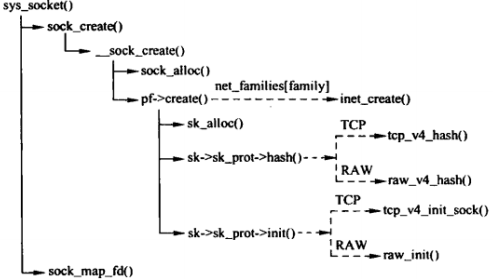

### `sys_socket`
```
/// @file net/socket.c
1369 SYSCALL_DEFINE3(socket, int, family, int, type, int, protocol)
1370 {
1371     int retval;
1372     struct socket *sock;
1373     int flags;
```
1. 调用`sock_create`创建套接字（`struct socket`、`struct sock`）
``` 
1389     retval = sock_create(family, type, protocol, &sock);
1390     if (retval < 0)
1391         goto out;
```
2. 调用`sock_map_fd`将`struct sock`绑定一个`struct file`对象（`struct file::private_data = sock`）,然后返回文件描述。
```
1393     retval = sock_map_fd(sock, flags & (O_CLOEXEC | O_NONBLOCK));
1394     if (retval < 0)
1395         goto out_release;
1404 }
```

`sock_create`直接调用`__sock_create`，`__sock_create`比`sock_create`多了两个参数：`net`和`kern`，`kern`用于表示创建的套接字用于内核（1）还是用于普用进程（0）。`net`用于指明命名空间。`__sock_create`调用：
```
/// @file net/socket.c
1357 int sock_create(int family, int type, int protocol, struct socket **res)
1358 {
1359     return __sock_create(current->nsproxy->net_ns, family, type, protocol, res, 0);
1360 }
```

`socket_map_fd`有一部分工作类似于普通文件`open`系统调用：获取一个空闲描述符，创建一个`struct file`对象，然后将`struct file`对象添加到进程打开的文件指针数组中。除此之外，还需绑定`struct socket`和`struct file`对象
```
/// @file net/socket.c
395 static int sock_map_fd(struct socket *sock, int flags)
396 {
397     struct file *newfile;
398     int fd = get_unused_fd_flags(flags); // 获取一个未用的文件描述符
399     if (unlikely(fd < 0))
400         return fd;
401      // 获取一个file结构体，并和sock绑定, file->private_data = sock;
402     newfile = sock_alloc_file(sock, flags, NULL);
403     if (likely(!IS_ERR(newfile))) {
404         fd_install(fd, newfile); // 将fd和file绑定
405         return fd; // 返回文件描述符
406     }
407 
408     put_unused_fd(fd);
409     return PTR_ERR(newfile);
410 }
```

### `__sock_create`
`__sock_create`主要完成套接字的分配，参数和`sock_create`基本一样，至少多了一个`kern`
```
/// @file net/socket.c
1244 int __sock_create(struct net *net, int family, int type, int protocol,
1245              struct socket **res, int kern)
1246 {
1247     int err;
1248     struct socket *sock;
1249     const struct net_proto_family *pf;
```
（略过安全检查）接下来调用`sock_alloc`从`sock_inode_cache`slab分配器中申请`struct socket_alloc`对象，同时初始化`inode`和套接字，然后返回指向`socket`的指针`sock`
```
1283     sock = sock_alloc();
1284     if (!sock) {
1285         net_warn_ratelimited("socket: no more sockets\n");
1286         return -ENFILE; /* Not exactly a match, but its the
1287                    closest posix thing */
1288     }
1289 
1290     sock->type = type;
```
接下来调用具体的协议族（如果是`AF_INET`，则调用`inet_create`）继续初始化套接字，同时创建`sock`结构体
```
1303     rcu_read_lock();
1304     pf = rcu_dereference(net_families[family]); // pf->inet_family_ops
1305     err = -EAFNOSUPPORT;
1306     if (!pf)
1307         goto out_release;

1313     if (!try_module_get(pf->owner))
1314         goto out_release;
1315 
1316     /* Now protected by module ref count */
1317     rcu_read_unlock();
1318 
1319     err = pf->create(net, sock, protocol, kern); // inet_family_ops.inet_create
1320     if (err < 0)
1321         goto out_module_put;

1338     *res = sock;
1339 
1340     return 0;
```

#### `sock_alloc`
创建一个`socket_alloc`结构体，返回指向`socket`的指针`sock`。
```
/// @file net/socket.c
540 static struct socket *sock_alloc(void)
541 {
542     struct inode *inode;
543     struct socket *sock;
544 
545     inode = new_inode_pseudo(sock_mnt->mnt_sb);
546     if (!inode)
547         return NULL;
548 
549     sock = SOCKET_I(inode); // 通过inode成员找到socket成员
```
然后初始化`inode`
```
551     kmemcheck_annotate_bitfield(sock, type);
552     inode->i_ino = get_next_ino();
553     inode->i_mode = S_IFSOCK | S_IRWXUGO;
554     inode->i_uid = current_fsuid();
555     inode->i_gid = current_fsgid();
556     inode->i_op = &sockfs_inode_ops;
557 
558     this_cpu_add(sockets_in_use, 1);
559     return sock;
560 }
```
`new_inode_pseudo`主要是调用`alloc_inode`（底层`sock_alloc_inode`）。`sock_alloc_inode`在slab分配器中申请一个`socket_alloc`结构体，返回`inode`指针
```
249 static struct inode *sock_alloc_inode(struct super_block *sb)
250 {
251     struct socket_alloc *ei;
252     struct socket_wq *wq;
253 
254     ei = kmem_cache_alloc(sock_inode_cachep, GFP_KERNEL);
255     if (!ei)
256         return NULL;
257     wq = kmalloc(sizeof(*wq), GFP_KERNEL);
258     if (!wq) {
259         kmem_cache_free(sock_inode_cachep, ei);
260         return NULL;
261     }
262     init_waitqueue_head(&wq->wait);
263     wq->fasync_list = NULL;
264     RCU_INIT_POINTER(ei->socket.wq, wq);
265 
266     ei->socket.state = SS_UNCONNECTED; // 初始状态
267     ei->socket.flags = 0;
268     ei->socket.ops = NULL;
269     ei->socket.sk = NULL;
270     ei->socket.file = NULL;
271 
272     return &ei->vfs_inode;
273 }
```
此时`socket`的状态为未连接，`type`为传入的值，其他成员为空

#### `inet_create`
`inet_create`主要是用于创建一个`struct tcp_sock`或者`struct udp_sock`对象（或其他），并与`struct socket`对象关联起来（`struct socket::sock <--> struct sock::ssocket`）
```
/// @file net/ipv4/af_inet.c
251 static int inet_create(struct net *net, struct socket *sock, int protocol,
252                int kern)
253 {
254     struct sock *sk;
255     struct inet_protosw *answer;
256     struct inet_sock *inet;
257     struct proto *answer_prot;
258     unsigned char answer_flags;
259     int try_loading_module = 0;
260     int err;
261 
262     if (protocol < 0 || protocol >= IPPROTO_MAX)
263         return -EINVAL;
264 
265     sock->state = SS_UNCONNECTED;

```
首先根据`sock->type`在`inetsw`链表中找到IP协议提供的接口`inet_protosw`。考虑两种套接字类型`SOCK_STREAM`和`SOCK_DGRAM`。其`osp`和`prot`分布指向`inet_stream_ops`，`tcp_prot`和`inet_dgram_ops`，`udp_prot`。
```
269     err = -ESOCKTNOSUPPORT;
270     rcu_read_lock();
271     list_for_each_entry_rcu(answer, &inetsw[sock->type], list) {
272 
273         err = 0;
274         /* Check the non-wild match. */
275         if (protocol == answer->protocol) {
276             if (protocol != IPPROTO_IP)
277                 break;
278         } else {
279             /* Check for the two wild cases. */
280             if (IPPROTO_IP == protocol) {
281                 protocol = answer->protocol;
282                 break;
283             }
284             if (IPPROTO_IP == answer->protocol)
285                 break;
286         }
287         err = -EPROTONOSUPPORT;
288     }
289 
290     if (unlikely(err)) { 错误处理

317     sock->ops = answer->ops;
318     answer_prot = answer->prot;
319     answer_flags = answer->flags;
```
接下来申请`sock`结构体，会从`answer_prot->slab`所指向的slab分配器中申请对象（如果存在）申请对象。如果slab分配器不存在，用`kmalloc`申请大小为`answer_prot->obj_size`的对象。
```
324     err = -ENOBUFS;
325     sk = sk_alloc(net, PF_INET, GFP_KERNEL, answer_prot);
326     if (sk == NULL)
327         goto out;
```
最后初始化`sock`结构体。设置是否可以重用套接字（IP地址和端口）
```
330     if (INET_PROTOSW_REUSE & answer_flags)
331         sk->sk_reuse = SK_CAN_REUSE;
333     inet = inet_sk(sk); // 类型转换sock-->inet_sock
334     inet->is_icsk = (INET_PROTOSW_ICSK & answer_flags) != 0;
338     if (SOCK_RAW == sock->type) {
339         inet->inet_num = protocol;
340         if (IPPROTO_RAW == protocol)
341             inet->hdrincl = 1;
342     }
343 
344     if (net->ipv4.sysctl_ip_no_pmtu_disc)
345         inet->pmtudisc = IP_PMTUDISC_DONT;
346     else
347         inet->pmtudisc = IP_PMTUDISC_WANT;
348 
349     inet->inet_id = 0;
350 
351     sock_init_data(sock, sk); // 初始化sock
352 
353     sk->sk_destruct    = inet_sock_destruct; // 回调函数，清理工作
354     sk->sk_protocol    = protocol;
355     sk->sk_backlog_rcv = sk->sk_prot->backlog_rcv;
356 
357     inet->uc_ttl    = -1; // 单播TTL
358     inet->mc_loop   = 1;
359     inet->mc_ttl    = 1; // 多播TTL
360     inet->mc_all    = 1;
361     inet->mc_index  = 0;
362     inet->mc_list   = NULL;
363     inet->rcv_tos   = 0;
364 
365     sk_refcnt_debug_inc(sk);
366 
367     if (inet->inet_num) {
373         inet->inet_sport = htons(inet->inet_num);
374         /* Add to protocol hash chains. */
375         sk->sk_prot->hash(sk);
376     }
377 
378     if (sk->sk_prot->init) {
379         err = sk->sk_prot->init(sk);
380         if (err)
381             sk_common_release(sk);
382     }
```

## `bind`
`bind` 系统调用将一个本地的IP地址及传输层的端口和套接字关联起来。

### 接口
```
int bind(int sockfd, const struct sockaddr *addr, socklen_t addrlen)
```
参数说明如下：
- `sockfd`：套接字文件描述符
- `addr`：本地地址
- `addlen`：`addr`字节数

### 调用关系
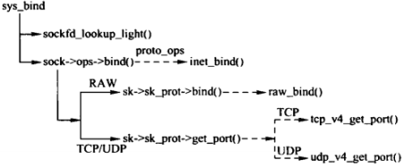

### `sys_bind`
```
/// @file net/socket.c
1519 SYSCALL_DEFINE3(bind, int, fd, struct sockaddr __user *, umyaddr, int, addrlen)
1520 {
1521     struct socket *sock;
1522     struct sockaddr_storage address;
1523     int err, fput_needed;
1524 
1525     sock = sockfd_lookup_light(fd, &err, &fput_needed);
1526     if (sock) {
1527         err = move_addr_to_kernel(umyaddr, addrlen, &address); // 用户空间数据拷贝到内核空间
1528         if (err >= 0) {
1529             err = security_socket_bind(sock,
1530                            (struct sockaddr *)&address,
1531                            addrlen);
1532             if (!err)
1533                 err = sock->ops->bind(sock,
1534                               (struct sockaddr *)
1535                               &address, addrlen); // 绑定
1536         }
1537         fput_light(sock->file, fput_needed); // 操作完成，减少文件引用计数
1538     }
1539     return err;
1540 }
```

#### `sockfd_lookup_light`
首先调用`sockfd_lookup_light`返回文件描述符对应`struct file`对象，从中找到关联的套接字文件，并且返回是否需要减少该文件引用计数的标志。套接字和它地应的文件是绑定的，因此在使用套接字的时候需要增加对文件的引用计数，防止被意外释放。
```
/// @file net/socket.c
453 static struct socket *sockfd_lookup_light(int fd, int *err, int *fput_needed)
454 {
455     struct fd f = fdget(fd);
456     struct socket *sock;
457 
458     *err = -EBADF;
459     if (f.file) {
460         sock = sock_from_file(f.file, err);
461         if (likely(sock)) {
462             *fput_needed = f.flags;
463             return sock;
464         }
465         fdput(f);
466     }
467     return NULL;
468 }
```

#### `inet_bind`
`sock->ops->bind`函数指针指向具体套接字文件的绑定操作。
```
/// @file net/ipv4/af_inet.c
430 int inet_bind(struct socket *sock, struct sockaddr *uaddr, int addr_len)
431 {
432     struct sockaddr_in *addr = (struct sockaddr_in *)uaddr;
433     struct sock *sk = sock->sk;
434     struct inet_sock *inet = inet_sk(sk);
435     struct net *net = sock_net(sk);
436     unsigned short snum;
437     int chk_addr_ret;
438     int err;
```
如果当前套接字（`SOCK_RAM`）实现了`bind`方法，则直接调用，进行地址绑定。
```
/// @file net/ipv4/af_inet.c
440     /* If the socket has its own bind function then use it. (RAW) */
441     if (sk->sk_prot->bind) {
442         err = sk->sk_prot->bind(sk, uaddr, addr_len);
443         goto out;
444     }
```
否则（`SOCK_STREAM`、`SOCK_DGRAM`）进行如下操作。首先进行地址和端口号合法性检查
```
/// @file net/ipv4/af_inet.c
459     chk_addr_ret = inet_addr_type(net, addr->sin_addr.s_addr);
468     err = -EADDRNOTAVAIL;
469     if (!sysctl_ip_nonlocal_bind && /* sysctl_ip_nonlocal_bin默认false */
470         !(inet->freebind || inet->transparent) && /* */
471         addr->sin_addr.s_addr != htonl(INADDR_ANY) && /* INADDR_ANY不进行操作 */
472         chk_addr_ret != RTN_LOCAL &&
473         chk_addr_ret != RTN_MULTICAST &&
474         chk_addr_ret != RTN_BROADCAST)
475         goto out;
476 
477     snum = ntohs(addr->sin_port);
478     err = -EACCES;
479     if (snum && snum < PROT_SOCK && /* PROT_SOCK = 1024，绑定小于1024的端口 */
480         !ns_capable(net->user_ns, CAP_NET_BIND_SERVICE)) /* 当前进程没有特权 */
481         goto out;
```
然后进行地址绑定
```
/// @file net/ipv4/af_inet.c
490     lock_sock(sk); // 上锁
491 
492     /* Check these errors (active socket, double bind). */
493     err = -EINVAL;
494     if (sk->sk_state != TCP_CLOSE || inet->inet_num) // 已经绑定
495         goto out_release_sock;
496     // 在网络层绑定ip地址，inet_rcv_saddr用于hash查找，inet_saddr用于传输
497     inet->inet_rcv_saddr = inet->inet_saddr = addr->sin_addr.s_addr;
498     if (chk_addr_ret == RTN_MULTICAST || chk_addr_ret == RTN_BROADCAST)
499         inet->inet_saddr = 0;  /* Use device */
500 
501     // 在传输层绑定端口号，调用inet_csk_get_port(TCP)或者udp_v4_get_port(UDP)，出错返回非0
502     if (sk->sk_prot->get_port(sk, snum)) { 
503         inet->inet_saddr = inet->inet_rcv_saddr = 0; // 绑定失败
504         err = -EADDRINUSE;
505         goto out_release_sock;
506     }
507 
508     if (inet->inet_rcv_saddr)
509         sk->sk_userlocks |= SOCK_BINDADDR_LOCK; // 标记已经绑定ip地址
510     if (snum)
511         sk->sk_userlocks |= SOCK_BINDPORT_LOCK; // 标记以及绑定端口号
512     inet->inet_sport = htons(inet->inet_num); // inet_sock本地端口号
513     inet->inet_daddr = 0; // 初始化目的ip地址
514     inet->inet_dport = 0; // 初始化目的端口号
515     sk_dst_reset(sk);
516     err = 0;
```

## `listen`
当`socket`函数创建一个套接字是，他被假设为一个主动套接字（调用`connect`发起连接的客户套接字）。`listen`函数把一个未连接的套接字转换成一个被动套接字，指示内核应接受指向该套接字的连接请求。调用`listen`导致套接字从`CLOSED`状态转换到`LISTEN`状态。同时可以指定已完成连接的队列长度。超过门限制，套接字将拒绝新的连接请求。

### 接口
```
int listen(int sockfd, int backlog);
```
参数说明如下：
- `sockfd`：套接字文件描述符
- `backlog`：已完成连接的队列长度

### 调用关系
```
sys_listen()
  |-->inet_listen()
        |-->inet_csk_listen_start()
```

### `sys_listen`
```
/// @file net/socket.c
1548 SYSCALL_DEFINE2(listen, int, fd, int, backlog)
1549 {
1550     struct socket *sock;
1551     int err, fput_needed;
1552     int somaxconn;
1553 
1554     sock = sockfd_lookup_light(fd, &err, &fput_needed);
1555     if (sock) { // inlcude/linux/socket.h:231 #define SOMAXCONN	128
1556         somaxconn = sock_net(sock->sk)->core.sysctl_somaxconn; // 队列最大128
1557         if ((unsigned int)backlog > somaxconn)
1558             backlog = somaxconn;
1559 
1560         err = security_socket_listen(sock, backlog);
1561         if (!err)
1562             err = sock->ops->listen(sock, backlog);
1563 
1564         fput_light(sock->file, fput_needed);
1565     }
1566     return err;
1567 }
```

### `inet_listen`
```
/// @file net/ipv4/af_inet.c
192 int inet_listen(struct socket *sock, int backlog)
193 {
194     struct sock *sk = sock->sk;
195     unsigned char old_state;
196     int err;
197 
198     lock_sock(sk);
```
首先检查`socket`的状态和类型。如果不是`SS_UNCONNECTED`状态或者不是`SOCK_STREAM`类型，跳出。然后检查`sock`的状态是否为`TCPF_CLOSE`或者`TCPF_LISTEN`，不能在其他状态时进行`listen`
```
200     err = -EINVAL;
201     if (sock->state != SS_UNCONNECTED || sock->type != SOCK_STREAM)
202         goto out;
203 
204     old_state = sk->sk_state;
205     if (!((1 << old_state) & (TCPF_CLOSE | TCPF_LISTEN)))
206         goto out;
207 
208     /* Really, if the socket is already in listen state
209      * we can only allow the backlog to be adjusted.
210      */
211     if (old_state != TCP_LISTEN) { // old_state为TCP_CLOSE
212         // TFO（TCP Fast Open）是一种能够在TCP连接建立阶段传输数据的机制。忽略
219         if ((sysctl_tcp_fastopen & TFO_SERVER_ENABLE) != 0 &&
220             inet_csk(sk)->icsk_accept_queue.fastopenq == NULL) {
221             if ((sysctl_tcp_fastopen & TFO_SERVER_WO_SOCKOPT1) != 0)
222                 err = fastopen_init_queue(sk, backlog);
223             else if ((sysctl_tcp_fastopen &
224                   TFO_SERVER_WO_SOCKOPT2) != 0)
225                 err = fastopen_init_queue(sk,
226                     ((uint)sysctl_tcp_fastopen) >> 16);
227             else
228                 err = 0;
229             if (err)
230                 goto out;
231 
232             tcp_fastopen_init_key_once(true);
233         }
234         err = inet_csk_listen_start(sk, backlog); // 做监听初始化，申请连接请求队列
235         if (err)
236             goto out;
237     } // 如果已经是TCP_LISTEN状态，不会进行初始化，而是设置backlog
238     sk->sk_max_ack_backlog = backlog; // 设置sock的已完成连接的队列长度
239     err = 0;
240 
241 out:
242     release_sock(sk);
243     return err;
244 }
```

### `inet_csk_listen_start`
首先调用`reqsk_queue_alloc`申请已完成连接的队列。`nr_table_entries`表示存储已建立的连接的队列的最大长度。
```
/// @file net/ipv4/inet_connection_sock.c
744 int inet_csk_listen_start(struct sock *sk, const int nr_table_entries)
745 {
746     struct inet_sock *inet = inet_sk(sk);
747     struct inet_connection_sock *icsk = inet_csk(sk);
748     int rc = reqsk_queue_alloc(&icsk->icsk_accept_queue, nr_table_entries);
749 
750     if (rc != 0)
751         return rc;
```
然后初始化`sock`相关的数据
```
753     sk->sk_max_ack_backlog = 0; // ？？
754     sk->sk_ack_backlog = 0; // 已完成连接为0
755     inet_csk_delack_init(sk); // 初始化延迟确认相关的数据结构

762     sk->sk_state = TCP_LISTEN; // 设置TCP状态
763     if (!sk->sk_prot->get_port(sk, inet->inet_num)) { // 如果没有绑定端口号，绑定一个临时的
764         inet->inet_sport = htons(inet->inet_num);
765 
766         sk_dst_reset(sk);
767         sk->sk_prot->hash(sk);
768 
769         return 0;
770     }
771     // 失败
772     sk->sk_state = TCP_CLOSE;
773     __reqsk_queue_destroy(&icsk->icsk_accept_queue); // 释放
774     return -EADDRINUSE;
775 }
```
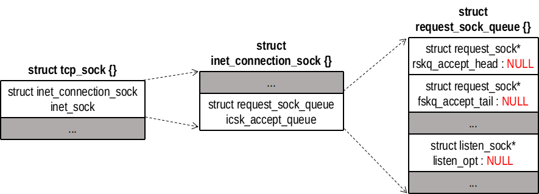

### `reqsk_queue_alloc`
申请已完成连接的队列。当完成三次握手，并不会申请一个`struct tcp_sock`对象（大小2048字节），而是申请一个`struct tcp_request_sock`对象（大小304字节）放到已完成连接队列`icsk_accept_queue`里面。
```
/// @file net/core/request_sock.c
37 int sysctl_max_syn_backlog = 256;
40 int reqsk_queue_alloc(struct request_sock_queue *queue,
41               unsigned int nr_table_entries)
42 {
43     size_t lopt_size = sizeof(struct listen_sock);
44     struct listen_sock *lopt;
45 
46     nr_table_entries = min_t(u32, nr_table_entries, sysctl_max_syn_backlog); // 最大值256
47     nr_table_entries = max_t(u32, nr_table_entries, 8); // 最小值为8
48     nr_table_entries = roundup_pow_of_two(nr_table_entries + 1); // 对齐2^n
49     lopt_size += nr_table_entries * sizeof(struct request_sock *); // 总共字节数
50     if (lopt_size > PAGE_SIZE) // 大于1页
51         lopt = vzalloc(lopt_size); // 分配并清零
52     else
53         lopt = kzalloc(lopt_size, GFP_KERNEL); // 分配并清零
54     if (lopt == NULL)
55         return -ENOMEM;
56 
57     for (lopt->max_qlen_log = 3;
58          (1 << lopt->max_qlen_log) < nr_table_entries;
59          lopt->max_qlen_log++); // 2^max_qlen_log = nr_table_entries
60 
61     get_random_bytes(&lopt->hash_rnd, sizeof(lopt->hash_rnd));
62     rwlock_init(&queue->syn_wait_lock);
63     queue->rskq_accept_head = NULL;
64     lopt->nr_table_entries = nr_table_entries; // 数据总长度
65 
66     write_lock_bh(&queue->syn_wait_lock);
67     queue->listen_opt = lopt;
68     write_unlock_bh(&queue->syn_wait_lock);
69 
70     return 0;
71 }
```
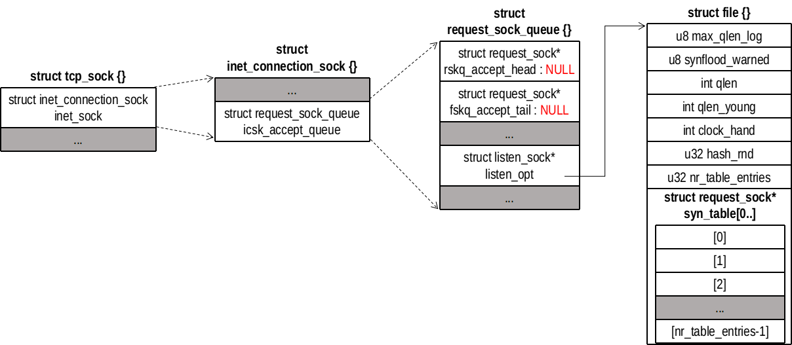

## `accept()`
`accept()`返回一个新的文件描述符，指向一个连接到客户的套接字文件。

### 接口
```
int accept(int sockfd, struct sockaddr *addr, socklen_t *addrlen);
```
参数说明如下
- `sockfd`：服务端监听套接字
- `addr`：远端地址
- `addrlen`：地址长度

### 调用关系
```
sys_accept()
  |-->sys_accept4()
      |-->sockfd_lookup_light()
      |-->sock_alloc()
      |-->get_unused_fd_flags()
      |-->sock_alloc_file()
      |-->inet_accept()
      |   |-->inet_csk_accept()
      |   |-->sock_graft()
      |-->fd_install()
      |-->fput_light()
```

### `sys_accept()`
`sys_accept()`直接调用`sys_accept4()`
```
/// @file net/socket.c
1662 SYSCALL_DEFINE3(accept, int, fd, struct sockaddr __user *, upeer_sockaddr,
1663         int __user *, upeer_addrlen)
1664 {
1665     return sys_accept4(fd, upeer_sockaddr, upeer_addrlen, 0);
1666 }
```
`sys_accept4()`首先创建一个新的`struct socket`对象和`struct file`对象，然后绑定两者。
```
/// @file net/socket.c
1581 SYSCALL_DEFINE4(accept4, int, fd, struct sockaddr __user *, upeer_sockaddr,
1582         int __user *, upeer_addrlen, int, flags)
1583 {
1584     struct socket *sock, *newsock;
1585     struct file *newfile;
1586     int err, len, newfd, fput_needed;
1587     struct sockaddr_storage address;
1588 
1589     if (flags & ~(SOCK_CLOEXEC | SOCK_NONBLOCK))
1590         return -EINVAL;
1591 
1592     if (SOCK_NONBLOCK != O_NONBLOCK && (flags & SOCK_NONBLOCK))
1593         flags = (flags & ~SOCK_NONBLOCK) | O_NONBLOCK;
1594 
1595     sock = sockfd_lookup_light(fd, &err, &fput_needed);
1596     if (!sock)
1597         goto out;
1598 
1599     err = -ENFILE;
1600     newsock = sock_alloc(); // 分配一个socket和inode
1601     if (!newsock)
1602         goto out_put;
1603 
1604     newsock->type = sock->type;
1605     newsock->ops = sock->ops;
1606 
1607     /*
1608      * We don't need try_module_get here, as the listening socket (sock)
1609      * has the protocol module (sock->ops->owner) held.
1610      */
1611     __module_get(newsock->ops->owner);
1612 
1613     newfd = get_unused_fd_flags(flags); // 申请一个未用的文件描述符
1614     if (unlikely(newfd < 0)) {
1615         err = newfd;
1616         sock_release(newsock);
1617         goto out_put;
1618     }
         // 分配一个file对象，绑定socket对象
1619     newfile = sock_alloc_file(newsock, flags, sock->sk->sk_prot_creator->name);
1620     if (unlikely(IS_ERR(newfile))) {
1621         err = PTR_ERR(newfile);
1622         put_unused_fd(newfd);
1623         sock_release(newsock);
1624         goto out_put;
1625     }
1626 
1627     err = security_socket_accept(sock, newsock);
1628     if (err)
1629         goto out_fd;
1630 
1631     err = sock->ops->accept(sock, newsock, sock->file->f_flags); // 调用inet_accept
1632     if (err < 0)
1633         goto out_fd;
1634 
1635     if (upeer_sockaddr) {
1636         if (newsock->ops->getname(newsock, (struct sockaddr *)&address,
1637                       &len, 2) < 0) {
1638             err = -ECONNABORTED;
1639             goto out_fd;
1640         }
1641         err = move_addr_to_user(&address,
1642                     len, upeer_sockaddr, upeer_addrlen);
1643         if (err < 0)
1644             goto out_fd;
1645     }
1646 
1647     /* File flags are not inherited via accept() unlike another OSes. */
1648 
1649     fd_install(newfd, newfile); // 绑定文件描述符和file对象 
1650     err = newfd;
1651 
1652 out_put:
1653     fput_light(sock->file, fput_needed);
1654 out:
1655     return err;
1656 out_fd:
1657     fput(newfile);
1658     put_unused_fd(newfd);
1659     goto out_put;
1660 }
```

### `inet_accept()`
调用`inet_csk_accept()`返回一个已建立的连接的传输控制块
```
/// @file  net/ipv4/af_inet.c 
672 int inet_accept(struct socket *sock, struct socket *newsock, int flags)
673 {
674     struct sock *sk1 = sock->sk; // 获取传输控制块
675     int err = -EINVAL;
676     struct sock *sk2 = sk1->sk_prot->accept(sk1, flags, &err); // inet_csk_accept
677 
678     if (!sk2)
679         goto do_err;
680 
681     lock_sock(sk2);
682 
683     sock_rps_record_flow(sk2);
684     WARN_ON(!((1 << sk2->sk_state) &
685           (TCPF_ESTABLISHED | TCPF_SYN_RECV |
686           TCPF_CLOSE_WAIT | TCPF_CLOSE)));
687 
688     sock_graft(sk2, newsock);
689 
690     newsock->state = SS_CONNECTED; // 已连接
691     err = 0;
692     release_sock(sk2);
693 do_err:
694     return err;
695 }
```
### `inet_csk_accept()`
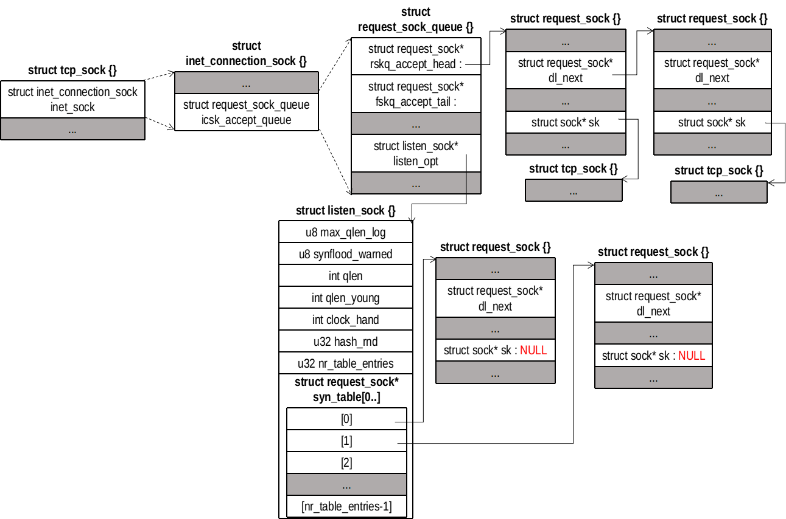

```
/// @file  net/ipv4/inet_connection_sock.c 
292 struct sock *inet_csk_accept(struct sock *sk, int flags, int *err)
293 {
294     struct inet_connection_sock *icsk = inet_csk(sk);
295     struct request_sock_queue *queue = &icsk->icsk_accept_queue;
296     struct sock *newsk;
297     struct request_sock *req;
298     int error;
299 
300     lock_sock(sk);
301 
302     /* We need to make sure that this socket is listening,
303      * and that it has something pending.
304      */
305     error = -EINVAL;
306     if (sk->sk_state != TCP_LISTEN) // 不是监听套接字，出错
307         goto out_err;
308 
309     /* Find already established connection */
310     if (reqsk_queue_empty(queue)) { // 已建立连接的队列为空
311         long timeo = sock_rcvtimeo(sk, flags & O_NONBLOCK);
312         // 非阻塞套接字直接返回0，否则返回阻塞时间
313         /* If this is a non blocking socket don't sleep */
314         error = -EAGAIN;
315         if (!timeo) // 非阻塞，返回-EAGAIN
316             goto out_err;
317 
318         error = inet_csk_wait_for_connect(sk, timeo); // 阻塞
319         if (error)
320             goto out_err;
321     }
322     req = reqsk_queue_remove(queue); // 出队，返回一个指向 request_sock对象的指针
323     newsk = req->sk; // 取出传输控制块
324 
325     sk_acceptq_removed(sk); // --sk->sk_ack_backlog，已建立连接数量减1
326     if (sk->sk_protocol == IPPROTO_TCP && queue->fastopenq != NULL) {
327         spin_lock_bh(&queue->fastopenq->lock);
328         if (tcp_rsk(req)->listener) {
329             /* We are still waiting for the final ACK from 3WHS
330              * so can't free req now. Instead, we set req->sk to
331              * NULL to signify that the child socket is taken
332              * so reqsk_fastopen_remove() will free the req
333              * when 3WHS finishes (or is aborted).
334              */
335             req->sk = NULL;
336             req = NULL;
337         }
338         spin_unlock_bh(&queue->fastopenq->lock);
339     }
340 out:
341     release_sock(sk);
342     if (req)
343         __reqsk_free(req);
344     return newsk; // 返回已建立连接的传输控制块
345 out_err:
346     newsk = NULL;
347     req = NULL;
348     *err = error;
349     goto out;
350 }
```

## `connect()`
对于TCP，建立一条与指定的外部地址的连接，如果在`connect()`调用前没有绑定地址和端口号，则会自动绑定一个地址和端口号到地址。对于无连接协议如UDP和ICMP，`connect`则记录外部地址，以便发送数据报时使用。

### 接口
```
int connect(int sockfd, const struct sockaddr *addr, socklen_t addrlen);
```
参数说明
- `sockfd`：本地套接字描述符
- `addr`：远端地址
- `addlen`：地址大小（字节数）

### 调用关系
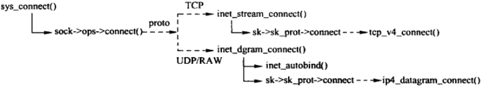

### `sys_connect()`
```
/// @file net/socket.c
1680 SYSCALL_DEFINE3(connect, int, fd, struct sockaddr __user *, uservaddr,
1681         int, addrlen)
1682 {
1683     struct socket *sock;
1684     struct sockaddr_storage address;
1685     int err, fput_needed;
1686 
1687     sock = sockfd_lookup_light(fd, &err, &fput_needed);
1688     if (!sock)
1689         goto out;
1690     err = move_addr_to_kernel(uservaddr, addrlen, &address); // 拷贝地址到内核空间
1691     if (err < 0)
1692         goto out_put;
1693 
1694     err =
1695         security_socket_connect(sock, (struct sockaddr *)&address, addrlen);
1696     if (err)
1697         goto out_put;
1698 
1699     err = sock->ops->connect(sock, (struct sockaddr *)&address, addrlen,
1700                  sock->file->f_flags); // inet_stream_connect()或inet_dgram_connect()
1701 out_put:
1702     fput_light(sock->file, fput_needed);
1703 out:
1704     return err;
1705 }
```

### `sock->ops->connect()`
#### `inet_stream_connect()`
```
/// @file net/ipv4/af_inet.c
656 int inet_stream_connect(struct socket *sock, struct sockaddr *uaddr,
657             int addr_len, int flags)
658 {
659     int err;
660 
661     lock_sock(sock->sk);
662     err = __inet_stream_connect(sock, uaddr, addr_len, flags);
663     release_sock(sock->sk);
664     return err;
665 }
```
继续调用`____inet_stream_connect()`
```
/// @file net/ipv4/af_inet.c
569 int __inet_stream_connect(struct socket *sock, struct sockaddr *uaddr,
570               int addr_len, int flags)
571 {
572     struct sock *sk = sock->sk;
573     int err;
574     long timeo;
575 
576     if (addr_len < sizeof(uaddr->sa_family)) // 地址检查
577         return -EINVAL;
578 
579     if (uaddr->sa_family == AF_UNSPEC) {
580         err = sk->sk_prot->disconnect(sk, flags);
581         sock->state = err ? SS_DISCONNECTING : SS_UNCONNECTED;
582         goto out;
583     }
584 
585     switch (sock->state) {
586     default:
587         err = -EINVAL;
588         goto out;
589     case SS_CONNECTED:
590         err = -EISCONN;
591         goto out;
592     case SS_CONNECTING:
593         err = -EALREADY;
594         /* Fall out of switch with err, set for this state */
595         break;
596     case SS_UNCONNECTED: // 未建立连接，建立连接
597         err = -EISCONN;
598         if (sk->sk_state != TCP_CLOSE)
599             goto out;
600         // 继续调用tcp_v4_conncet()
601         err = sk->sk_prot->connect(sk, uaddr, addr_len);
602         if (err < 0)
603             goto out;
604 
605         sock->state = SS_CONNECTING; // 设置状态，正在连接
606 
607         /* Just entered SS_CONNECTING state; the only
608          * difference is that return value in non-blocking
609          * case is EINPROGRESS, rather than EALREADY.
610          */
611         err = -EINPROGRESS;
612         break;
613     }
614 
615     timeo = sock_sndtimeo(sk, flags & O_NONBLOCK);
616     // 等待三次握手完成
617     if ((1 << sk->sk_state) & (TCPF_SYN_SENT | TCPF_SYN_RECV)) {
618         int writebias = (sk->sk_protocol == IPPROTO_TCP) &&
619                 tcp_sk(sk)->fastopen_req &&
620                 tcp_sk(sk)->fastopen_req->data ? 1 : 0;
621 
622         /* Error code is set above */
623         if (!timeo || !inet_wait_for_connect(sk, timeo, writebias))
624             goto out; // 非阻塞或出错
625 
626         err = sock_intr_errno(timeo);
627         if (signal_pending(current))
628             goto out;
629     }
630 
631     /* Connection was closed by RST, timeout, ICMP error
632      * or another process disconnected us.
633      */
634     if (sk->sk_state == TCP_CLOSE) // 建立成功或失败
635         goto sock_error;
636 
637     /* sk->sk_err may be not zero now, if RECVERR was ordered by user
638      * and error was received after socket entered established state.
639      * Hence, it is handled normally after connect() return successfully.
640      */
641 
642     sock->state = SS_CONNECTED; // 三次握手成功完成，连接建立
643     err = 0;
644 out:
645     return err;
646 
647 sock_error:
648     err = sock_error(sk) ? : -ECONNABORTED;
649     sock->state = SS_UNCONNECTED;
650     if (sk->sk_prot->disconnect(sk, flags))
651         sock->state = SS_DISCONNECTING;
652     goto out;
653 }
```

#### `inet_dgram_connect()`
```
/// @file net/ipv4/af_inet.c
524 int inet_dgram_connect(struct socket *sock, struct sockaddr *uaddr,
525                int addr_len, int flags)
526 {
527     struct sock *sk = sock->sk;
528 
529     if (addr_len < sizeof(uaddr->sa_family))
530         return -EINVAL;
531     if (uaddr->sa_family == AF_UNSPEC)
532         return sk->sk_prot->disconnect(sk, flags);
533     // 没有绑定地址，自动绑定
534     if (!inet_sk(sk)->inet_num && inet_autobind(sk))
535         return -EAGAIN;
536     return sk->sk_prot->connect(sk, uaddr, addr_len);
537 }
```

## `shutdown()`
`shutdown()`关闭连接的读通道、写通道或读写通道。对于读通道，`shutdown()`丢弃所有进程还没有读走的数据以及调用`shutdown()`之后到达的数据。对于写通道，`shutdown()`使用协议作相应的处理，如果是TCP，所有剩余的数据将被发送，发送完成后发送`FIN`。
### 接口
```
int shutdown(int sockfd, int how);
```
参数说明
- `sock`：需要断开的套接字文件描述符
- `howto`：传递断开方式信息
  - `SHUT_RD`：断开输入流
  - `SHUT_WR`：断开输出流
  - `SHUT_RDWR`：同时断开输入输出流

### 调用关系
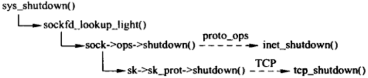

### `sys_shutdown()`
```
/// @file net/socket.c
1956 SYSCALL_DEFINE2(shutdown, int, fd, int, how)
1957 {
1958     int err, fput_needed;
1959     struct socket *sock;
1960 
1961     sock = sockfd_lookup_light(fd, &err, &fput_needed);
1962     if (sock != NULL) {
1963         err = security_socket_shutdown(sock, how);
1964         if (!err)
1965             err = sock->ops->shutdown(sock, how); // inet_shutdown()
1966         fput_light(sock->file, fput_needed);
1967     }
1968     return err;
1969 }
```

### `inet_shutdown()`
```
/// @file net/ipv4/af_inet.c
781 int inet_shutdown(struct socket *sock, int how)
782 {
783     struct sock *sk = sock->sk;
784     int err = 0;
785 
786     /* This should really check to make sure
787      * the socket is a TCP socket. (WHY AC...)
788      */
789     how++; // 0->1，1->2, 2->3，方便位操作
792     if ((how & ~SHUTDOWN_MASK) || !how) /* MAXINT->0 */
793         return -EINVAL;
794 
795     lock_sock(sk);
796     if (sock->state == SS_CONNECTING) {
797         if ((1 << sk->sk_state) &
798             (TCPF_SYN_SENT | TCPF_SYN_RECV | TCPF_CLOSE))
799             sock->state = SS_DISCONNECTING;
800         else
801             sock->state = SS_CONNECTED;
802     }
803 
804     switch (sk->sk_state) {
805     case TCP_CLOSE: // TCP是关闭状态，出错
806         err = -ENOTCONN;
807         /* Hack to wake up other listeners, who can poll for
808            POLLHUP, even on eg. unconnected UDP sockets -- RR */
809     default: 
810         sk->sk_shutdown |= how;
811         if (sk->sk_prot->shutdown)
812             sk->sk_prot->shutdown(sk, how);// 调用tcp_shutdown，发送FIN
813         break;
814 
815     /* Remaining two branches are temporary solution for missing
816      * close() in multithreaded environment. It is _not_ a good idea,
817      * but we have no choice until close() is repaired at VFS level.
818      */
819     case TCP_LISTEN: // 处于监听状态
820         if (!(how & RCV_SHUTDOWN))
821             break;
822         /* Fall through */
823     case TCP_SYN_SENT: // 处于SYN_SENT，关闭连接
824         err = sk->sk_prot->disconnect(sk, O_NONBLOCK);
825         sock->state = err ? SS_DISCONNECTING : SS_UNCONNECTED;
826         break;
827     }
828 
829     /* Wake up anyone sleeping in poll. */
830     sk->sk_state_change(sk); // 状态改变，唤醒相应进程
831     release_sock(sk); // 释放传输控制块
832     return err;
833 }
```

### `tcp_shutdown()`
```
/// @file net/ipv4/tcp.c
2097 void tcp_shutdown(struct sock *sk, int how)
2098 {
2099     /*  We need to grab some memory, and put together a FIN,
2100      *  and then put it into the queue to be sent.
2101      *      Tim MacKenzie(tym@dibbler.cs.monash.edu.au) 4 Dec '92.
2102      */
2103     if (!(how & SEND_SHUTDOWN)) // 如果不是关闭发送，直接返回
2104         return;
2105     // 关闭发送方向，需要等待数据发送完毕，在发送FIN
2106     /* If we've already sent a FIN, or it's a closed state, skip this. */
2107     if ((1 << sk->sk_state) &
2108         (TCPF_ESTABLISHED | TCPF_SYN_SENT |
2109          TCPF_SYN_RECV | TCPF_CLOSE_WAIT)) {
2110         /* Clear out any half completed packets.  FIN if needed. */
2111         if (tcp_close_state(sk)) // 根据TCP状态变迁图，改变TCP状态（数据要继续发送）
2112             tcp_send_fin(sk); // 发送FIN
2113     }
2114 }
```

## `close()`
关闭各种文件描述符，这里只讨论关闭套接字文件描述符

### 接口
```
int close(int sockfd);
```

### 调用关系
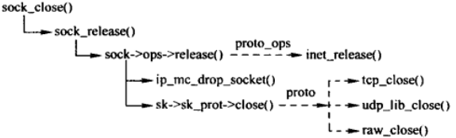

### `sys_close()`
```
/// @file fs/open.c
1051 SYSCALL_DEFINE1(close, unsigned int, fd)
1052 {
1053     int retval = __close_fd(current->files, fd);
1054 
1055     /* can't restart close syscall because file table entry was cleared */
1056     if (unlikely(retval == -ERESTARTSYS ||
1057              retval == -ERESTARTNOINTR ||
1058              retval == -ERESTARTNOHAND ||
1059              retval == -ERESTART_RESTARTBLOCK))
1060         retval = -EINTR;
1061 
1062     return retval;
1063 }
```
继续调用`__close_fd()`
```
/// @file fs/file.c
573 int __close_fd(struct files_struct *files, unsigned fd)
574 {
575     struct file *file;
576     struct fdtable *fdt;
577 
578     spin_lock(&files->file_lock);
579     fdt = files_fdtable(files);
580     if (fd >= fdt->max_fds)
581         goto out_unlock;
582     file = fdt->fd[fd]; // 文件描述符对应的file对象
583     if (!file)
584         goto out_unlock;
585     rcu_assign_pointer(fdt->fd[fd], NULL); // 从fdt中删除
586     __clear_close_on_exec(fd, fdt);
587     __put_unused_fd(files, fd); // 归还文件描述符
588     spin_unlock(&files->file_lock);
589     return filp_close(file, files); // 继续
590 
591 out_unlock:
592     spin_unlock(&files->file_lock);
593     return -EBADF;
594 }
```

### flip_close
```
/// @file fs/open.c
1024 int filp_close(struct file *filp, fl_owner_t id)
1025 {
1026     int retval = 0;
1027 
1028     if (!file_count(filp)) { // 检查引用计数，引用计数为0表示关闭一个没有使用的文件，出错
1029         printk(KERN_ERR "VFS: Close: file count is 0\n");
1030         return 0;
1031     }
1032 
1033     if (filp->f_op->flush) // 套接字文件没有这个函数
1034         retval = filp->f_op->flush(filp, id);
1035 
1036     if (likely(!(filp->f_mode & FMODE_PATH))) {
1037         dnotify_flush(filp, id);
1038         locks_remove_posix(filp, id); // 直接返回
1039     }
1040     fput(filp);
1041     return retval;
1042 }
```

### fput
```
/// @file fs/file_table.c
272 void fput(struct file *file)
273 {
274     if (atomic_long_dec_and_test(&file->f_count)) { // 递减引用计数
275         struct task_struct *task = current;
276 
277         if (likely(!in_interrupt() && !(task->flags & PF_KTHREAD))) {
278             init_task_work(&file->f_u.fu_rcuhead, ____fput);
279             if (!task_work_add(task, &file->f_u.fu_rcuhead, true))
280                 return;
281             /*
282              * After this task has run exit_task_work(),
283              * task_work_add() will fail.  Fall through to delayed
284              * fput to avoid leaking *file.
285              */
286         }
287 
288         if (llist_add(&file->f_u.fu_llist, &delayed_fput_list))
289             schedule_delayed_work(&delayed_fput_work, 1);
290     }
291 }


250 static void ____fput(struct callback_head *work)
251 {
252     __fput(container_of(work, struct file, f_u.fu_rcuhead));
253 }
```

### `__fput()`
```
/// @file fs/file_table.c
194 static void __fput(struct file *file)
195 {   
196     struct dentry *dentry = file->f_path.dentry;
197     struct vfsmount *mnt = file->f_path.mnt;
198     struct inode *inode = file->f_inode;
199     
200     might_sleep();
201     
202     fsnotify_close(file);
203     /*
204      * The function eventpoll_release() should be the first called
205      * in the file cleanup chain.
206      */
207     eventpoll_release(file); // 如果注册到了epoll，从中删除
208     locks_remove_file(file);
209     
210     if (unlikely(file->f_flags & FASYNC)) {
211         if (file->f_op->fasync)
212             file->f_op->fasync(-1, file, 0);
213     }
214     ima_file_free(file);
215     if (file->f_op->release)
216         file->f_op->release(inode, file); // 关闭，调用sock_close
217     security_file_free(file);
218     if (unlikely(S_ISCHR(inode->i_mode) && inode->i_cdev != NULL &&
219              !(file->f_mode & FMODE_PATH))) {
220         cdev_put(inode->i_cdev);
221     }
222     fops_put(file->f_op);
223     put_pid(file->f_owner.pid);
224     if ((file->f_mode & (FMODE_READ | FMODE_WRITE)) == FMODE_READ)
225         i_readcount_dec(inode); // 索引结点引用计数递减
226     if (file->f_mode & FMODE_WRITER) {
227         put_write_access(inode);
228         __mnt_drop_write(mnt);
229     }
230     file->f_path.dentry = NULL;
231     file->f_path.mnt = NULL;
232     file->f_inode = NULL;
233     file_free(file); // 释放file对象
234     dput(dentry); // 释放目录项
235     mntput(mnt);
236 }
```

### `sock_close()`
```
/// @file  net/socket.c
1170 static int sock_close(struct inode *inode, struct file *filp)
1171 {
1172     sock_release(SOCKET_I(inode));
1173     return 0;
1174 }
```
继而调用`sock_release()`
```
588 void sock_release(struct socket *sock)
589 {
590     if (sock->ops) {
591         struct module *owner = sock->ops->owner;
592 
593         sock->ops->release(sock); // 调用inet_release
594         sock->ops = NULL;
595         module_put(owner);
596     }
597 
598     if (rcu_dereference_protected(sock->wq, 1)->fasync_list)
599         pr_err("%s: fasync list not empty!\n", __func__);
600 
601     if (test_bit(SOCK_EXTERNALLY_ALLOCATED, &sock->flags))
602         return;
603 
604     this_cpu_sub(sockets_in_use, 1);
605     if (!sock->file) {
606         iput(SOCK_INODE(sock)); // 释放索inode和socket对象
607         return;
608     }
609     sock->file = NULL;
610 }
```

### inet_release
```
/// @file  net/socket.c
396 int inet_release(struct socket *sock)
397 {
398     struct sock *sk = sock->sk;
399 
400     if (sk) {
401         long timeout;
402 
403         sock_rps_reset_flow(sk);
404 
405         /* Applications forget to leave groups before exiting */
406         ip_mc_drop_socket(sk);
407 
408         /* If linger is set, we don't return until the close
409          * is complete.  Otherwise we return immediately. The
410          * actually closing is done the same either way.
411          *
412          * If the close is due to the process exiting, we never
413          * linger..
414          */
415         timeout = 0;
416         if (sock_flag(sk, SOCK_LINGER) &&
417             !(current->flags & PF_EXITING))
418             timeout = sk->sk_lingertime;
419         sock->sk = NULL;
420         sk->sk_prot->close(sk, timeout); // tcp_close
421     }
422     return 0;
423 }
```

### tcp_close
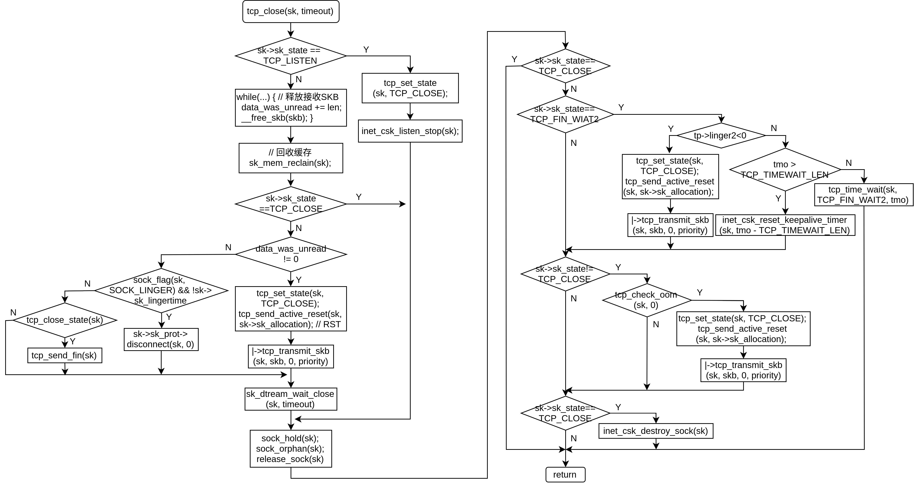

```
/// @file net/ipv4/tcp.c
2131 void tcp_close(struct sock *sk, long timeout)
2132 {
2133     struct sk_buff *skb;
2134     int data_was_unread = 0;
2135     int state;
2136 
2137     lock_sock(sk);
2138     sk->sk_shutdown = SHUTDOWN_MASK;
2139 
2140     if (sk->sk_state == TCP_LISTEN) {
2141         tcp_set_state(sk, TCP_CLOSE); // 设置TCP状态为TCP_CLOSE
2142 
2143         /* Special case. */
2144         inet_csk_listen_stop(sk); // 停止监听
2145 
2146         goto adjudge_to_death;
2147     }
2148 
2149     // 释放接受缓冲区，统计未读取数据
2153     while ((skb = __skb_dequeue(&sk->sk_receive_queue)) != NULL) {
2154         u32 len = TCP_SKB_CB(skb)->end_seq - TCP_SKB_CB(skb)->seq -
2155               tcp_hdr(skb)->fin;
2156         data_was_unread += len;
2157         __kfree_skb(skb);
2158     }
2159 
2160     sk_mem_reclaim(sk); // 释放缓存
2161 
2162     /* If socket has been already reset (e.g. in tcp_reset()) - kill it. */
2163     if (sk->sk_state == TCP_CLOSE)
2164         goto adjudge_to_death;
2165 
2173     if (unlikely(tcp_sk(sk)->repair)) {
2174         sk->sk_prot->disconnect(sk, 0);
2175     } else if (data_was_unread) { // 存在为读取数据
2176         /* Unread data was tossed, zap the connection. */
2177         NET_INC_STATS_USER(sock_net(sk), LINUX_MIB_TCPABORTONCLOSE);
2178         tcp_set_state(sk, TCP_CLOSE); // 甚至TCP状态为TCP_CLOSE
2179         tcp_send_active_reset(sk, sk->sk_allocation); // 构造一个RST分节并发送
2180     } else if (sock_flag(sk, SOCK_LINGER) && !sk->sk_lingertime) {
2181         /* Check zero linger _after_ checking for unread data. */
2182         sk->sk_prot->disconnect(sk, 0); // 调用tcp_disconnect()断开连接
2183         NET_INC_STATS_USER(sock_net(sk), LINUX_MIB_TCPABORTONDATA);
2184     } else if (tcp_close_state(sk)) { // 设置为下一个状态，如果可以发送FIN
2214         tcp_send_fin(sk); // 发送FIN分节
2215     }
2216     // 等待TCP完成其他操作
2217     sk_stream_wait_close(sk, timeout);
2218 
2219 adjudge_to_death:
2220     state = sk->sk_state;
2221     sock_hold(sk);
2222     sock_orphan(sk); // 设置孤儿套接字
2223 
2224     /* It is the last release_sock in its life. It will remove backlog. */
2225     release_sock(sk);
2226 
2227 
2228     // 到目前位置，套接字被内核接管
2231     local_bh_disable();
2232     bh_lock_sock(sk);
2233     WARN_ON(sock_owned_by_user(sk));
2234 
2235     percpu_counter_inc(sk->sk_prot->orphan_count);
2236 
2237     /* Have we already been destroyed by a softirq or backlog? */
2238     if (state != TCP_CLOSE && sk->sk_state == TCP_CLOSE) // 已经关闭，无需处理
2239         goto out;
2254 
2255     if (sk->sk_state == TCP_FIN_WAIT2) { // 处于TCP_FIN_WAIT2状态
2256         struct tcp_sock *tp = tcp_sk(sk);
2257         if (tp->linger2 < 0) {
2258             tcp_set_state(sk, TCP_CLOSE);
2259             tcp_send_active_reset(sk, GFP_ATOMIC); // 发送RST
2260             NET_INC_STATS_BH(sock_net(sk),
2261                     LINUX_MIB_TCPABORTONLINGER);
2262         } else {
2263             const int tmo = tcp_fin_time(sk);
2264 
2265             if (tmo > TCP_TIMEWAIT_LEN) { // 超时时间大于60秒
2266                 inet_csk_reset_keepalive_timer(sk,
2267                         tmo - TCP_TIMEWAIT_LEN);// 重置超时时间
2268             } else {
2269                 tcp_time_wait(sk, TCP_FIN_WAIT2, tmo);
2270                 goto out;
2271             }
2272         }
2273     }
2274     if (sk->sk_state != TCP_CLOSE) {
2275         sk_mem_reclaim(sk);
2276         if (tcp_check_oom(sk, 0)) {
2277             tcp_set_state(sk, TCP_CLOSE);
2278             tcp_send_active_reset(sk, GFP_ATOMIC); // 发送RST
2279             NET_INC_STATS_BH(sock_net(sk),
2280                     LINUX_MIB_TCPABORTONMEMORY);
2281         }
2282     }
2283 
2284     if (sk->sk_state == TCP_CLOSE) {
2285         struct request_sock *req = tcp_sk(sk)->fastopen_rsk;
2286         /* We could get here with a non-NULL req if the socket is
2287          * aborted (e.g., closed with unread data) before 3WHS
2288          * finishes.
2289          */
2290         if (req != NULL)
2291             reqsk_fastopen_remove(sk, req, false);
2292         inet_csk_destroy_sock(sk); // 释放传输控制块
2293     }
2294     /* Otherwise, socket is reprieved until protocol close. */
2295 
2296 out:
2297     bh_unlock_sock(sk);
2298     local_bh_enable();
2299     sock_put(sk);
2300 }
```