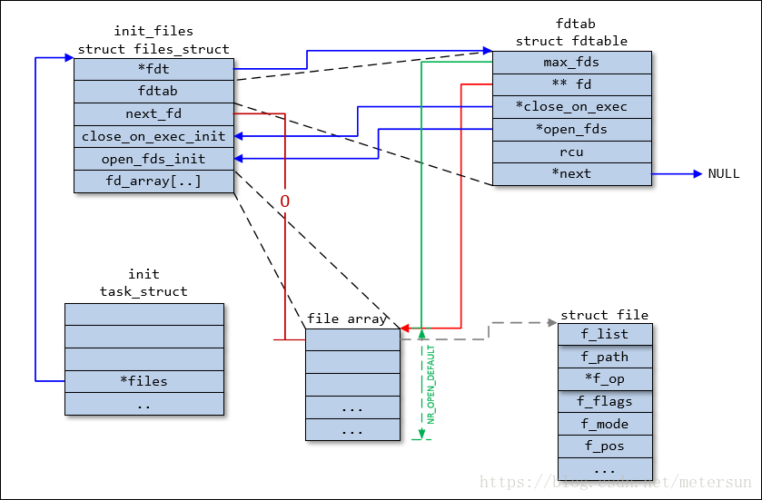

# Socket close分析

## 必要数据结构

```
struct task_struct {
  ...
  struct files_struct *files;
};

struct files_struct {
  atomic_t count;
  struct fdtable __rcu *fdt;
  struct fdtable fdtab;
  
  spinlock_t file_lock ____cacheline_aligned_in_smp;
  int next_fd;
  struct embedded_fd_set close_on_exec_init;
  struct embedded_fd_set open_fds_init;
  struct file __rcu * fd_array[NR_OPEN_DEFAULT];
};

struct fdtable {
  unsigned int max_fds;
  struct file __rcu **fd;      /* current fd array */
  fd_set *close_on_exec;
  fd_set *open_fds;
  struct rcu_head rcu;
  struct fdtable *next;
};
```


## 源码解析（linux3.1.10）

### 进入sys_close
```
/* 忽略错误处理的代码 */
SYSCALL_DEFINE1(close, unsigned int, fd){
  int retval = __close_fd(current->files, fd);
  return retval;
}
```
### 进入__close_fd
```
/* 忽略错误处理 */
int __close_fd(struct files_struct *files, unsigned fd){
  struct file *file;
  struct fdtable *fdt;

  spin_lock(&files->file_lock);
  fdt = files_fdtable(files); // files->fdt;
  file = fdt->fd[fd];  // fd对应的struct file
  rcu_assign_pointer(fdt->fd[fd], NULL); // fdt->fd[fd] = NULL;
  __clear_close_on_exec(fd, fdt); // 清除O_CLOEXEC标志
  __put_unused_fd(files, fd); // 归还fd
  spin_unlock(&files->file_lock);
  return filp_close(file, files); // 关闭
}
```

### flip_close
```
typedef struct files_struct *fl_owner_t;
int filp_close(struct file *filp, fl_owner_t id) {
  int retval = 0;

  if (!file_count(filp)) { /* 合法性检查 */
    printk(KERN_ERR "VFS: Close: file count is 0\n"); return 0;
  }
  if (filp->f_op->flush) /* 刷新，写回磁盘 */
    retval = filp->f_op->flush(filp, id);

  if (likely(!(filp->f_mode & FMODE_PATH))) {
    dnotify_flush(filp, id);
    locks_remove_posix(filp, id);
  }
  fput(filp); /* 继续 */
  return retval;
}
```

### fput
```
void fput(struct file *file) {
  if (atomic_long_dec_and_test(&file->f_count)) { /*f_count减1，如果等于0，进入if*/
    struct task_struct *task = current;
    if (likely(!in_interrupt() && !(task->flags & PF_KTHREAD))) {
      init_task_work(&file->f_u.fu_rcuhead, ____fput); /* 设置file销毁的回调函数为____fput */
      /* 将销毁该文件的task放到待执行的任务队列中 */
      if (!task_work_add(task, &file->f_u.fu_rcuhead, true)) 
        return;
    }
    if (llist_add(&file->f_u.fu_llist, &delayed_fput_list))
      schedule_delayed_work(&delayed_fput_work, 1);
  }
}

static void ____fput(struct callback_head *work) {
  __fput(container_of(work, struct file, f_u.fu_rcuhead));
}
```

### __fput
```
static void __fput(struct file *file) {
  struct dentry *dentry = file->f_path.dentry;
  struct vfsmount *mnt = file->f_path.mnt;
  struct inode *inode = file->f_inode;

  might_sleep();

  fsnotify_close(file);
  /* 检查该文件是否已被注册到epoll实例中，如果是则从epoll实例中移除。*/
  eventpoll_release(file);
  locks_remove_file(file);
  /*...*/
  if (file->f_op->release)
    file->f_op->release(inode, file); /* 关闭文件，对于socket，release指向sock_close */
  /* ... */
}

static int sock_close(struct inode *inode, struct file *filp) {
  sock_release(SOCKET_I(inode)); /* SOCKET_I：通过inode找到socket首地址 */
  return 0;
}


```

### sock_release
```
void sock_release(struct socket *sock) {
  if (sock->ops) {
    struct module *owner = sock->ops->owner;
    sock->ops->release(sock); /* 该方法是inet_release */
    sock->ops = NULL;
    module_put(owner);
  }
  /* ... */
  if (!sock->file) { /* 归还inode */
    iput(SOCK_INODE(sock));
    return;
  }
  sock->file = NULL;
}
```

### inet_release
```
int inet_release(struct socket *sock) {
  struct sock *sk = sock->sk;
  if (sk) {
    long timeout;
    /* ... */
    timeout = 0;
    if (sock_flag(sk, SOCK_LINGER) && !(current->flags & PF_EXITING))
      timeout = sk->sk_lingertime;
    sock->sk = NULL;
    sk->sk_prot->close(sk, timeout); /* 这个方法是tcp_close */
  }
  return 0;
}
```

### tcp_close
```
void tcp_close(struct sock *sk, long timeout) {
  struct sk_buff *skb;
  int data_was_unread = 0;
  int state;

  lock_sock(sk);
  sk->sk_shutdown = SHUTDOWN_MASK;

  if (sk->sk_state == TCP_LISTEN) {
    tcp_set_state(sk, TCP_CLOSE);

    /* Special case. */
    inet_csk_listen_stop(sk);

    goto adjudge_to_death;
  }

  /*  We need to flush the recv. buffs.  We do this only on the
   *  descriptor close, not protocol-sourced closes, because the
   *  reader process may not have drained the data yet!
   */
  while ((skb = __skb_dequeue(&sk->sk_receive_queue)) != NULL) {
    u32 len = TCP_SKB_CB(skb)->end_seq - TCP_SKB_CB(skb)->seq - tcp_hdr(skb)->fin;
    data_was_unread += len;
    __kfree_skb(skb);
  }

	sk_mem_reclaim(sk);

	/* If socket has been already reset (e.g. in tcp_reset()) - kill it. */
	if (sk->sk_state == TCP_CLOSE)
		goto adjudge_to_death;

	/* As outlined in RFC 2525, section 2.17, we send a RST here because
	 * data was lost. To witness the awful effects of the old behavior of
	 * always doing a FIN, run an older 2.1.x kernel or 2.0.x, start a bulk
	 * GET in an FTP client, suspend the process, wait for the client to
	 * advertise a zero window, then kill -9 the FTP client, wheee...
	 * Note: timeout is always zero in such a case.
	 */
	if (unlikely(tcp_sk(sk)->repair)) {
		sk->sk_prot->disconnect(sk, 0);
	} else if (data_was_unread) {
		/* Unread data was tossed, zap the connection. */
		NET_INC_STATS_USER(sock_net(sk), LINUX_MIB_TCPABORTONCLOSE);
		tcp_set_state(sk, TCP_CLOSE);
		tcp_send_active_reset(sk, sk->sk_allocation);
	} else if (sock_flag(sk, SOCK_LINGER) && !sk->sk_lingertime) {
		/* Check zero linger _after_ checking for unread data. */
		sk->sk_prot->disconnect(sk, 0);
		NET_INC_STATS_USER(sock_net(sk), LINUX_MIB_TCPABORTONDATA);
	} else if (tcp_close_state(sk)) {
		/* We FIN if the application ate all the data before
		 * zapping the connection.
		 */

		/* RED-PEN. Formally speaking, we have broken TCP state
		 * machine. State transitions:
		 *
		 * TCP_ESTABLISHED -> TCP_FIN_WAIT1
		 * TCP_SYN_RECV	-> TCP_FIN_WAIT1 (forget it, it's impossible)
		 * TCP_CLOSE_WAIT -> TCP_LAST_ACK
		 *
		 * are legal only when FIN has been sent (i.e. in window),
		 * rather than queued out of window. Purists blame.
		 *
		 * F.e. "RFC state" is ESTABLISHED,
		 * if Linux state is FIN-WAIT-1, but FIN is still not sent.
		 *
		 * The visible declinations are that sometimes
		 * we enter time-wait state, when it is not required really
		 * (harmless), do not send active resets, when they are
		 * required by specs (TCP_ESTABLISHED, TCP_CLOSE_WAIT, when
		 * they look as CLOSING or LAST_ACK for Linux)
		 * Probably, I missed some more holelets.
		 * 						--ANK
		 * XXX (TFO) - To start off we don't support SYN+ACK+FIN
		 * in a single packet! (May consider it later but will
		 * probably need API support or TCP_CORK SYN-ACK until
		 * data is written and socket is closed.)
		 */
		tcp_send_fin(sk);
	}

	sk_stream_wait_close(sk, timeout);

adjudge_to_death:
	state = sk->sk_state;
	sock_hold(sk);
	sock_orphan(sk);

	/* It is the last release_sock in its life. It will remove backlog. */
	release_sock(sk);


	/* Now socket is owned by kernel and we acquire BH lock
	   to finish close. No need to check for user refs.
	 */
	local_bh_disable();
	bh_lock_sock(sk);
	WARN_ON(sock_owned_by_user(sk));

	percpu_counter_inc(sk->sk_prot->orphan_count);

	/* Have we already been destroyed by a softirq or backlog? */
	if (state != TCP_CLOSE && sk->sk_state == TCP_CLOSE)
		goto out;

	/*	This is a (useful) BSD violating of the RFC. There is a
	 *	problem with TCP as specified in that the other end could
	 *	keep a socket open forever with no application left this end.
	 *	We use a 1 minute timeout (about the same as BSD) then kill
	 *	our end. If they send after that then tough - BUT: long enough
	 *	that we won't make the old 4*rto = almost no time - whoops
	 *	reset mistake.
	 *
	 *	Nope, it was not mistake. It is really desired behaviour
	 *	f.e. on http servers, when such sockets are useless, but
	 *	consume significant resources. Let's do it with special
	 *	linger2	option.					--ANK
	 */

	if (sk->sk_state == TCP_FIN_WAIT2) {
		struct tcp_sock *tp = tcp_sk(sk);
		if (tp->linger2 < 0) {
			tcp_set_state(sk, TCP_CLOSE);
			tcp_send_active_reset(sk, GFP_ATOMIC);
			NET_INC_STATS_BH(sock_net(sk),
					LINUX_MIB_TCPABORTONLINGER);
		} else {
			const int tmo = tcp_fin_time(sk);

			if (tmo > TCP_TIMEWAIT_LEN) {
				inet_csk_reset_keepalive_timer(sk,
						tmo - TCP_TIMEWAIT_LEN);
			} else {
				tcp_time_wait(sk, TCP_FIN_WAIT2, tmo);
				goto out;
			}
		}
	}
	if (sk->sk_state != TCP_CLOSE) {
		sk_mem_reclaim(sk);
		if (tcp_check_oom(sk, 0)) {
			tcp_set_state(sk, TCP_CLOSE);
			tcp_send_active_reset(sk, GFP_ATOMIC);
			NET_INC_STATS_BH(sock_net(sk),
					LINUX_MIB_TCPABORTONMEMORY);
		}
	}

	if (sk->sk_state == TCP_CLOSE) {
		struct request_sock *req = tcp_sk(sk)->fastopen_rsk;
		/* We could get here with a non-NULL req if the socket is
		 * aborted (e.g., closed with unread data) before 3WHS
		 * finishes.
		 */
		if (req != NULL)
			reqsk_fastopen_remove(sk, req, false);
		inet_csk_destroy_sock(sk);
	}
	/* Otherwise, socket is reprieved until protocol close. */

out:
	bh_unlock_sock(sk);
	local_bh_enable();
	sock_put(sk);
}
```