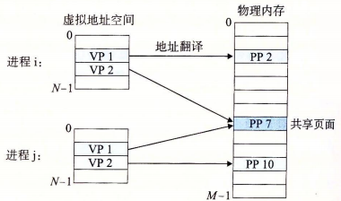

# 深入理解计算机系统

## ch9 虚拟内存
虚拟内存是操作提供的一种对主存的抽象概念，它为每个进程提供了一个大的、一致和私有的地址空间。通过一个很清晰的机制，虚拟内存提供了三个重要的能力：
1. 它将主存看成一个存储在磁盘上的地址空间的高速缓存，在主存中只保存活动区域，并根据需要在磁盘和主存之间来回传送数据，通过这种方式，高效地使用了主存;
2. 它为每个进程提供了一致的地址空间，从而简化了内存管理;
3. 它保护了每个进程的地址空间不被其他进程破化;

### 物理地址和虚拟地址


### 虚拟内存作为缓存的工具
概念上而言，虚拟内存被组织为一个由磁盘上的N个连续字节大小的单元组成的数组，每个字节都有一个唯一的虚拟地址，作为到数组的索引。数组的内容被缓存在主存中。虚拟系统将虚拟内存分割为称为虚拟页的大小固定的块，类似地，物理内存被分割为物理页（也称为页帧），大小和虚拟页一致。

在任意时刻，虚拟页面的集合都分为三个不相交的子集：
1. 未分配的：虚拟系统还未分配（或者创建）的页。未分配的页没有任何数据和它们相关联，因此也就没有对应的磁盘空间。
2. 缓存的：当前已缓存在物理内存（主存）中的已分配页
3. 未缓存的：未缓冲在物理内存（主存）的已分配页


#### 页表
虚拟内存系统必须有某种方法来判定一个虚拟页是否缓冲在物理内存的某个地方。如果是，系统还必须确定这个虚拟页存放在哪个物理页中。如果不命中，系统必须判断这个虚拟页存放在磁盘的哪个位置，在物理内存中选择一个牺牲页，并将虚拟页从磁盘复制到内存中，替换这个牺牲页

这些功能是由软硬件联合提供的，包括操作系统、内存管理单元（Memory Management Unit, MMU）中的地址翻译硬件和一个常驻内存的页表的数据结构。页表将虚拟页面映射到物理页，每次地址翻译硬件将一个虚拟地址转换为物理地址时，都会读取页表。操作系统负责维护页表的内容，以及在磁盘和内存之间来回传送页。

页表就是一个页表条目（Page Table Entry, PTE）的数组，虚拟地址空间中的每个页在页表中一个固定偏移量处都有一个PTE。


### 虚拟内存作为内存管理的工具


操作系统为某个进程提供了独立的页表，因而也就是一个独立的虚拟地址空间。不同进程的虚拟地址可以映射到同一个共享物理页面上。虚拟系统简化了链接和加载、代码和数据共享，以及应用程序的内存分配
- 简化链接：独立的地址空间允许每个进程的内存映像使用相同的基本格式，而不管代码和数据实际存放在物理内存的何处。
- 简化加载：虚拟内存还使得容易向内存中加载可执行文件和共享对象文件。要把目标文件中`.text`和`.data`数据加载到一个新创建的进程中，Linux加载器为代码和数据端分配虚拟页，把它们标记为无效的（未被缓存的），将页表条目指向目标文件的适当位置
- 简化共享：操作系统通过将不同进程中的适当的虚拟页面映射到相同的物理物理页面，从而安排多个进程共享这部分代码的一个副本，而不是在每个进程中都包含一份共享数据
- 简化内存分配：当一个运行在用户进程中的程序要求额外的堆空间时（malloc调用），操作系统分配K个连续的虚拟内存页面，并且将它们映射到物理内存中k个任意的物理页面，不要求连续

### 虚拟内存作为内存保护的工具


SUP位表示进程是否必须运行在内核模式（超级用户）下才能访问该页。如果一条指定违反了这些许可条件，那么CPU就触发一个一般保护故障，将控制传递给一个内核中的异常处理程序。Linux shell一般将这种异常报告为段错误（Segmentation Fault）

### 地址翻译


#### 页面命中


CPU硬件执行的步骤
1. 处理器生成一个虚拟地址，把它传送给MMU
2. MMU生成PTE地址，并请求从主存/高速缓冲得到它
3. 主存/高速缓冲向MMU返回PTE
4. MMU构造物理地址，把它传送给主存/高速缓冲
5. 主存/高速缓冲返回所请求的数据字给处理器

#### 缺页


硬件和操作系统协作执行步骤
1. 处理器生成一个虚拟地址，把它传送给MMU
2. MMU生成PTE地址，并请求从主存/高速缓冲得到它
3. 主存/高速缓冲向MMU返回PTE
4. PTE有效位是零，所以MMU触发了一次异常，将CPU转移给操作系统内核中的缺页异常处理程序
5. 缺页异常处理程序确定出物理内存中的牺牲页，如果这个页面已经被修改了，则把它写会磁盘
6. 缺页异常处理程序调入新的页面，并更新内存中的PTE
7. 缺页异常处理程序返回到原来的进程，再次执行导致缺页的指令。后面过程就是命中的处理步骤

#### 结合高速缓存（比如CPU和主存的L1缓存）的情况


#### 利用TLB加速地址翻译
没有TLB（Translation Lookaside Buffer）的情况，每次CPU产生一个虚拟地址，MMU就必须区主存或高速缓冲中查阅一个PTE，以便将虚拟地址翻译为物理地址，如果从内存读取，代价是几十到几百个周期。如果PTE碰巧缓存在L1中，那么代价下降到1个或2个周期。TLB用来试图消除即使是1个或2个周期的开销。


TLB是一个小的、虚拟地址的缓存，其中没一行都保存着一个有单个PTE组成的块。用于组选择和行匹配的索引和标记字段是从虚拟地址中的虚拟页号（VPN）中提取出来的。如果TLB有2^t个组，那么TLB索引（TLBI）是由VPN的t个最低位组成的，而TLB标记（TLBT）是由VPN中剩余的位组成的。


当TLB命中时（通常情况），所有的地址翻译步骤都是在芯片上的MMU中执行，因此非常快。其步骤如下：
1. CPU产生一个虚拟地址
2. 用VPN在TLB中查找PTE
3. TLB返回PTE
4. MMU将这个虚拟地址翻译成一个物理地址，并且将它发送到高速缓冲/主存
5. 主存/高速缓冲返回所请求的数据字给处理器

#### 多级页表


### Intel Core i7地址翻译
#### 内存系统


#### 地址翻译


### Linux虚拟内存系统


Linux为每个进程维护了一个单独的虚拟地址空间，可分为内核虚拟内存和进程虚拟内存。Linux将虚拟内存组织成一些区域（也叫做段）的集合，一个区域就是就是已经分配的虚拟内存的连续片。每个存在的虚拟页面都保存在某个区域中，而不属于某个区域的虚拟页是不存在的，且不能被进程引用。内核为系统中的每个进程维护一个单独的`tast_struct`，任务结构中的一个条目指向`mm_struct`，它描述了虚拟内存的当前状态


### 内存映射文件
共享库实际上是一种更为通用的机制--内存映射文件的一个特例。这种机制的思想是：进程可以发起一个系统调用，将一个文件映射到其虚拟地址空间的一部分。在多数实现中，在映射共享的页面时不会实际读入页面的内容，而是在访问页面时出现缺页才会每次一页地读入，磁盘万恶将则被当作后备存储。当进程退出或显式地解除文件映射时，所有被改动的页面会被协会到磁盘文件中。内存映射文件提供了一种IO的可选模型。可以把一个文件当作一个内存中的大字符数组来访问，而不是通过读写操作来访问这个文件。

如果两个或两个以上的进程同时映射了同一个文件，它们就可以通过共享内存来通信。一个进程在共享内存上完成了写操作，此刻当另一个进程在映射到这个文件的虚拟地址空间上执行读操作时，它就可以立即看到上一个进程写操作的结果。因此，这个机制提供了一个进程间的高速带宽通道，而且这种应用很普遍（甚至扩展到用来映射无名的临时文件）。

Linux 进程可以使用 `mmap()` 函数来创建新的虚拟内存区域，并将对象映射到这些区域中
```
#include <unistd.h>
#include <sys/mman.h>
void *mmap(void *start, size_t length, int prot, 
           int flags, int fd, offset offset);
```
`mmap()` 函数要求穿件的虚拟内存的地址最好是从 `start` 开始的一个区域，并将文件描述符 `fd` 指定的对象的一个连续的片映射到这个新的区域。连续的对象片大小为 `length` 字节，从距文件开始处偏移量为 `offset` 字节的地方开始。`start` 地址仅仅是一个暗示，通常被定义为 `NULL`。参数`prot` 包含描述新映射的虚拟内存区域的访问权限位，可以指定以下权限：
- `PROT_EXEC`：这个区域的页面由可以被 CPU 执行的指令组成
- `PROT_READ`：这个区域内的页面可读
- `PROT_WRITE`：这个区域内的页面可写
- `PROT_NONE`：这个区域内的页面不能被访问

`flags` 描述被映射对象类型的位组成。有如下标志：
- `MAP_ANON`：被映射的对象是一个匿名对象，相应的虚拟页面是请求二进制零的
- `MAP_PRIVATE`：被映射的对象是一个私有的、写时复制的对象
- `MAP_SHARED`：被映射的是一个共享对象