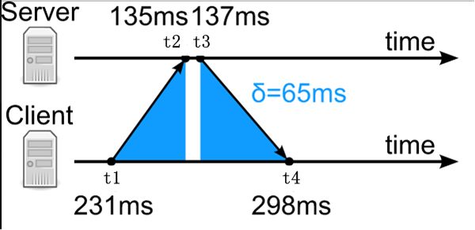

# Pratical Network Programming -- ChenShuo

## Layered Network
- Ethernet frame：以太网帧
- IP packet：IP分组
- TCP segment：TCP分节
- Application message：应用消息

## 常见错误
- 网络IO和业务逻辑混杂，不利于测试与维护
- TCP数据不完整（断开时机不正确）
- TCP数据没有边界
- 直接发送结构体（对齐、不可扩展）
- TCP自连接
- 非阻塞IO编程太多坑

## Test TCP (ttcp)
- 测试TCP性能的工具
- 性能指标
  - 带宽（Bandwidth, MB/s）
  - 吞吐量（Troughput, message/s, queries/s{QPS}, transactions/s{TPS}）
  - 延迟（Latency, milliseconds, percentiles）
  - 资源使用率（Utilization, percent, payload vs. carrier, goodput vs. theory BW）
  - 额外开销（Overhand, CPU usage, for compression and/or encryption）

## Timekeep in Linux Kernel
- High-resolution kernel timers sicne 2.6.16
- Multiple clock sources, tsc is commmonly chosen
- Resolution: 1/frequency
  - 1us(gettimeofday) or 1ns(clock_gettime)

## NTP (Network Time Protocol)如何工作
- 基本原理
  - 服务器和客户端之间通过两次报文交换，确定主从时间误差，客户端校准本地计算机时间，完成时间同步。有条件的话进一步校准本地时钟频率。
- 时间同步过程
  - 服务器在`UDP`的`132`端口提供授时服务，客户端发送附带`T1`时间戳（Timestamp）的查询报文给服务器，服务器在该报文上添加到达时刻`T2`和相应报文发送时刻`T3`，客户端记录相应报文到达时刻`T4`。
  - 
- 时间差计算
  - 图中用蓝色标志了主从直接来回链路的时延`Sigma`
    - `Sigma = (t4 - t1) - (t3 - t2)`
  - 假设来回网络链路是对称的，即传输时延相对，那么可以计算客户端与服务器之间的时间误差`Delta`
    - `Delta = t1+Sigma/2-t2 = ((t1+t4)-(t2+t3))/2`
- 计时方式
  - NTP采用UTC时间计时，TCP时间戳是自1900-01-01 00:00:00开始的UTC总秒数，当前秒的亚秒数。当正闰秒时，60秒和下一分钟的0秒的NTP总秒数一致的，因此NTP报文专门定义了闰秒指示域来提示。
- 误差分析
  - 局域网内计算机利用NTP协议进行时间同步，时间同步精度在5ms左右，主要误差包括：
    - 计算机打时间戳的位置在应用层，受协议栈缓冲、任务调度等影响，不能在网络报文到来时马上打戳
    - 各种中间网络传输设备带来的传输时延不确定性以及链路的不对称性，将进一步减低NTP时间同步精度
  
## 何时以及如何关闭一个TCP连接
- TCP不可靠？
  - 发送完数据后直接关闭`close`，可能丢失最后一小部分部分数据
- 错误发送：`send+close`
  - 当输入缓冲区中存在数据时，`close`会向对方发送`RST`，提前终止连接。
- 正确发送：`send + shutdown + read -> 0 + close`
- 正确接收：`read -> 0 + if nothing more to send + close`

## TCP服务器/客户端编程三部曲
- `SO_REUSADDR`
  - 服务器可以用原来的IP和端口号重启
- 忽略`SIGPIPE`信号`signal(SIGPIPE, SIG_IGN);`
- `TCP_NODELAY`

## 非阻塞IO
- 需要应用层缓冲
- IO 多路复用常搭配非阻塞 IO
  - 以`read`为例，`select`、`poll`和`epoll`只会通知可读的描述符，并不会通知可读的数据有多少，所以，可能阻塞在读上，无法处理其他描述符可读的数据。

## 非阻塞IO的`write`
- 将剩余数据（没有发送完）的数据保存到应用缓冲中
  - 当缓冲中有数据时，不要直接调用`write`
  - 优先将缓冲中的数据发送出去
- 关注`POLLOUT`信号
  - 同时，任何`write`都添加到缓冲区
- 当`POLLOUT`就绪，将缓冲中数据发送出去
- 当缓冲为空，停止关注`POLLOUT`信号
  - 否则，会出现忙等情况

## 非阻塞IO对方读取数据缓慢（带宽不匹配）
- 非阻塞IO的常见陷进
  - 避免内存耗尽或者数据丢失
- 停止读并且停止关注数据就绪
- 发送方会被动停止（接收端告诉发送端自己的没有缓冲区用于接受数据）

## 水平触发（Level-trigger）和边缘触发（Edge-trigger）
`epoll`事件分发接口能够表现为边缘触发（ET）和水平触发（LT）。两种机制之间的差异可以描述如下。假设发生这种情况：
1. 表示管道读取端（`rfd`）的文件描述符在`epoll`实例上注册。
2. 管道写入器在管道的写入侧写入2kB的数据。
3. 完成对`epoll_wait`的调用，将`rfd`作为就绪文件描述符返回。
4. 管道读取器从`rfd`读取1kB数据。
5. 完成对`epoll_wait`的调用。

如果已使用`EPOLLET`（边缘触发）标志将rfd文件描述符添加到epoll接口，则尽管文件输入缓冲区中仍存在可用数据，但在步骤5中完成的对`epoll_wait`的调用可能会挂起;同时，远程对等体可能期望基于其已发送的数据进行响应。原因是边缘触发模式仅在受监视文件描述符发生更改时才传递事件。因此，在步骤5中，调用者可能等待输入某些数据当时这些数据已经在输入缓冲区内。在上面的示例中，步骤2将生成一个事件，事件在3中被消耗。由于在4中完成的读取操作不消耗整个缓冲区数据，因此对`epoll_wait`的调用已完成在步骤5中可能会无限期地阻止。

使用`EPOLLET`标志的应用程序应使用非阻塞文件描述符，以避免阻塞读取或写入处理多个文件描述符的任务。将`epoll`用作边缘触发（`EPOLLET`）接口的建议方法如下：
1. 用非阻塞文件描述符
2. 仅在`read`或`write`返回`EAGAIN`之后等待事件。

相比之下，当用作水平触发的接口时（默认情况下，当未指定`EPOLLET`时），`epoll`只是一个更快的 poll，并且可以在使用后者的任何地方使用，因为它共享相同的语义。