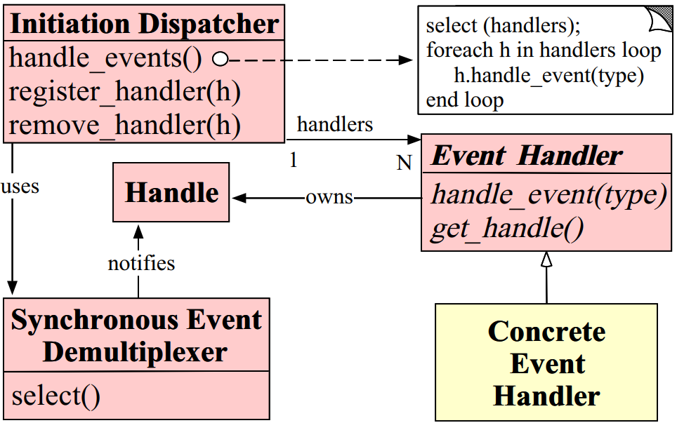
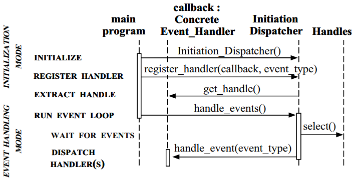
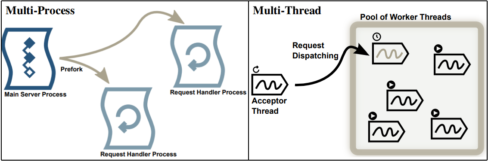
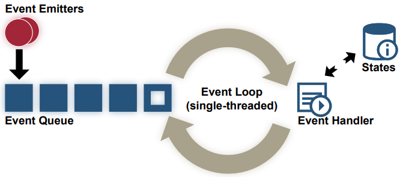
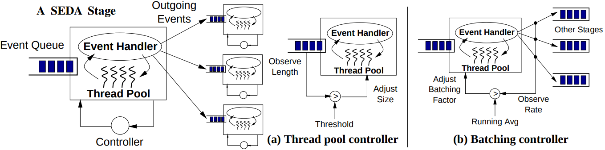
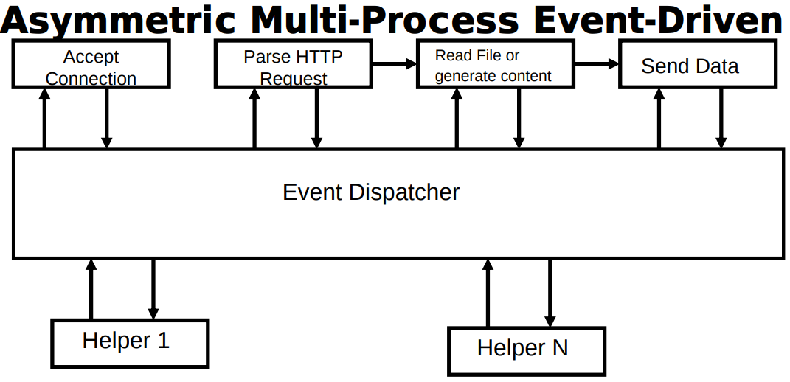
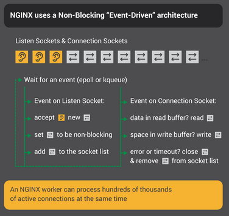

# 计算机网络问题
## 基础
### 简单介绍一下reactor设计模式
#### Reactor模型组成

- `Handle`：操作系统的句柄，是操作系统所管理资源的抽象。在网络编程中，一般指套接字描述符。这个`Handle`被注册到`Synchronous Event Demultiplexer`中以监听`Handle`发生的事件。
- `Synchronous Event Demultiplexer`：阻塞等待直到`Handle`集合上的某些事件发生。当返回时，表示在返回的`Handle`上可以不阻塞地执行返回的事件。这个模块借助于`select`、`poll`、`epoll`或`kqueue`实现。
- `Initiation Dispatcher`：管理`Event Handler`的注册、移除以及分派。`Synchronous Event Demultiplexer`负责等待新事件的产生，当检测到新事件时，他会通知`Initiation Dispatcher`回调特定的`Event Handler`进行处理。通常的事件包括连接请求、数据输入和输出以及超时。
- `Event Handler`：指定由hook方法组成的接口，该方法抽象地表示特定事件的调度操作，具体的处理操作必须由特定的应用实现。
- `Concreate Event Handler`：定义hook方法，以及面向特定应用的事件处理方法。应用程序使用`Initiation Dispatcher`将处理特定事件的`Concrete Event Handler`方法进行注册。当这些事件发生了，`Initiation Dispatcher`就回调相应`Concrete Event Handler`的hook方法。

#### 业务逻辑

- 当应用程序使用`Initiation Dispatcher`注册`Concrete Event Handler`时，表示`Event Handler`希望`Initiation Dispatcher`在相应`Handle`上发生事件时需要通知它的事件类型。
- `Initiation Dispatcher`请求每个`Event Handler`传回自己的内部`Handle`。这个`Handle`向操作系统表明对应的`Event Handler`。
- 在所有`Event Handler`都被注册后，应用调用`handle_events`方法开启`Initiation Dispatcher`的事件循环（event loop）。此时，`Initation Dispatcher`集结了所有已注册`Event Handler`的`Handle`，并且使用`Synchronous Event Demultiplexer`等待相应事件发生。
- `Synchronous Event Demultiplexer`在发生事件使对应的`Handle`变成就绪时，通知`Initation Dispatcher`。
- `Initiation Dispatcher`触发`Event Handler`的hook方法以响应处于就绪`Handle`的事件。当事件产生，`Initiation Dispatcher`利用这些就绪的`Handle`当成“键值”取定位和分派相应的`Event Handler`的hook方法。
- `Initiation Dispatcher`回调面向特定应用的`Event Handler`的`handle_event`hook方法进行处理以响应事件。

#### 优缺点
- 优点
  - 响应快，不必为单个同步时间所阻塞，虽然Reactor本身依然是同步的； 
  - 编程相对简单，可以最大程度的避免复杂的多线程及同步问题，并且避免了多线程/进程的切换开销； 
  - 可扩展性，可以方便的通过增加Reactor实例个数来充分利用CPU资源；
  - 可复用性，reactor框架本身与具体事件处理逻辑无关，具有很高的复用性；

- 缺点
  - 相比传统的简单模型，Reactor增加了一定的复杂性，因而有一定的门槛，并且不易于调试。 
  - Reactor模式需要底层的Synchronous Event Demultiplexer支持，比如Java中的Selector支持，操作系统的select系统调用支持，如果要自己实现Synchronous Event Demultiplexer可能不会有那么高效。 
  - Reactor模式在IO读写数据时还是在同一个线程中实现的，即使使用多个Reactor机制的情况下，那些共享一个Reactor的Channel如果出现一个长时间的数据读写，会影响这个Reactor中其他Channel的相应时间，比如在大文件传输时，IO操作就会影响其他Client的相应时间，因而对这种操作，使用传统的Thread-Per-Connection或许是一个更好的选择，或则此时使用Proactor模式。

### TCP/UDP区别
#### UDP
- 简单的、不可靠的数据报协议
- 不保证UDP数据包会到达其最终目的地
- 不保证各个数据报的先后顺序跨网络后保持不变
- 不保证每个数据报只到达一次
- 数据有边界

#### TCP
- 复杂的、可靠的字节流协议
- 提供客户与服务器之间的连接
- 提供了可靠性（确认与重传）
- 提供流量控制
  - 通告窗口：TCP总是告知对端在任何时刻它一次能够从对端接收多少字节的数据。在任何时候、该窗口指出接受缓冲区中当前可用的空间量，从而确保发送端发送的数据不会使接收缓冲区溢出
- TCP连接是全双工
  - 在一个给定的连接上应用可以在任何时刻在进出两个方向上既发送数据又接受数据

### 计算机网络模型有哪些，分别介绍
- OSI模型（7层）：物理层、数据链路层、网络层、传输层、会话层、表示层、应用层。
- TCP/IP模型（4层）：网络接口层、网际层、运输层、应用层。

每一层的作用如下：
- 物理层：通过媒介传输比特,确定机械及电气规范（比特Bit）
- 数据链路层：将比特组装成帧和点到点的传递（帧Frame）
- 网络层：负责数据包从源到宿的传递和网际互连（包PackeT）
- 传输层：提供端到端的可靠报文传递和错误恢复（段Segment）
- 会话层：建立、管理和终止会话（会话协议数据单元SPDU）
- 表示层：对数据进行翻译、加密和压缩（表示协议数据单元PPDU）
- 应用层：允许访问OSI环境的手段（应用协议数据单元APDU

### TCP三次握手和四次挥手，为什么是3次和4次

### 第三次挥手客户端收到服务端发来的FIN后处于什么状态（time_wait），为什么要time wait？
- 第一为了保证最后一个`ACK`能够到达。最后一个`ACK`分节可能丢失，如果客户端不等待2MSL，可能的结果是服务器超时重传`FIN`分节，而此时客户端已经关闭，不能发送`ACK`确认，服务器不能正常释放连接。若客户端等待了2MSL，客户端收到FIN后发送`ACK`，并且重启计时器，再次等待2MSL。
- 第二，防止类似“已经失效的连接请求报文段”出现在本连接中。客户端发送完最后一个确认报文后，在这个2MSL时间中，就可以使本连接持续的时间内所产生的所有报文段都从网络中消失。这样新的连接中不会出现旧连接的请求报文。

### ARP协议和相关操作

### HTTP的常见方法，post与get差别，常见的请求头key-val对儿
### 在Chrome浏览器的地址栏中输入`www.google.com`，然后回车，到底发生了什么
1. 浏览器分析URL
2. 浏览器向DNS请求解析`www.google.com`的IP地址
3. DNS返回`www.google.com`对应服务器的IP地址
4. 浏览器与该服务器建立TCP连接（默认端口号80）
5. 浏览器发出HTTP请求
6. 服务器通过响应请求，把响应文件html发送给浏览器
7. TCP连接释放
8. 浏览器对页面进行渲染呈现给用户

### 主机向下载文件`ftp://ftp.abc.edu.cn/file`，描述交互过程
1. 建立一个TCP连接到服务器的21号端口，然后发送登录帐号和密码
2. 服务器返回登录成功信息后，客户端打开一个随机端口PORT，并将该端口号发送给服务器
3. 客户端发送读取文件命令，内容为get file，服务器使用20号端口号建立一个TCP连接到客户端的PORT
4. 服务器把文件内容通过第二个连接发送给客户端，传输完毕连接关闭
### TCP流量控制、滑动窗口
### TCP数据传输过程中如何确认数据包未发送成功？有什么机制
### IP包头中的TTL是什么意思
### 客户端和服务器端创建socket链接流程
### DNS协议的类型？

## 细节
### 数据包从网卡到网卡要经历那些内存拷贝
### HTTP和RPC的区别
### 后台报504错误，分析原因如何解决
### TCP数据包传到IP层会不会发生分包？
### 三次握手里的序列号是从什么起？滑动窗口为什么是字节为单位滑动的？
### 长连接和短连接？
### 网络除FIN以外的异常中断还有那些？
服务器进程崩溃或重启后，当客户端向服务器写数据的时候，由于服务器进程终止，所以响应了RST

### TCP里多大的数据量传输要进行封装
### HTTP协议连接过程，HTTPS连接过程
### HTTP2和HTTP1区别，websocket建立连接过程
### 对epoll的理解

### 网络服务器模型
#### 多进程模型（The Multi-Process Model, MP）

在多进程模型中，有一个负责建立网络连接的主进程（任务1）。一旦连接建立，主进程创建一个子进程并且将已连接的套接字传给子进程。然后子进程处理客户端请求：从套接字中读取数据（任务2）、进行计算（任务3），然后将应答通过套接字传回客户端（任务2）。通常，一个连接对应一个进程。

优点
- 易于实现、低并发下可以很好工作

缺点
- 进程数量过多，增加系统负担，性能下降
  
#### 单进程事件驱动模型（The Single-Process Event-Driven Model, SPED）

通常，通过多路复用的方式，在同一个进程中执行任务1、任务2和任务3。为了提到效率，它需要依赖内核提供的功能，例如`select`、`poll`、`epoll`或`kqueue`。本模型中，进程由新的连接和数据“事件”驱动，并实现为一个“事件循环”，如下所示：
- 询问操作系统是否有新的事件产生（新的连接请求或者数据）
- 如果有新的连接请求到达，与之建立连接（任务1）
- 如果有新的数据，读取（任务2）并对其进程处理（任务3）
- 循环直到服务器退出

所有的这些工作都是在一个进程完成，并且可以非常高效地完成，因为SPED避免类进程的上下文切换。这里唯一的进程上下文切换是系统调用，并且通过仅对有事件产生的特定连接进行操作来最小化来这些切换。只要有效负载（任务3）不是过于复杂或资源密集，SPED可以同时处理数万个连接。

优点
- 可以很高效且易于操作
- 只需要一个CPU核

缺点
- 三个任务在单个循环迭代中数序完成，如果某个任务处理时间太长，服务器对客户的响应需要很长时间
- 如果有效载荷工作不均匀，会导致响应的非均匀延迟
- 仅仅使用了单个CPU核，虽然限制类进程切换的开销，提高类性能。但是对可用计算资源未充分利用

#### 阶段事件驱动模型（The Staged Event-Driven Architecture Model, SEDA）

SEDA将一个复杂的、事件驱动的应用分解为由队列连接起来的一组阶段。但是，如果不仔细实施，其性能可能会遇到与MP相同的问题。SEDA的工作原理如下：
- 有效负载工作（任务3）被分成尽可能多的阶段或模块。每个模块实现一个特定的功能，他们驻留在自己独立的进程中，这些模块通过消息队列相互通信。该体系结构可以用图表示，其中每个结点都是一个进程，边是消息队列。
- 单个进程执行任务1，然后将新连接传递给特定入口结点。这些结点可以是网络结点（任务2，将数据传递给其他结点进行计算），也可以是有效负载工作（任务3）。通常没有主进程，因为每个结点都可以自己响应。

理论上，该模型可以是任意复杂度的，比如图可能具有循环，可以和其他类似的应用相连，或者结点实际在远程系统上执行。然而，在实践中，即使有明确定义的消息和有效的队列，它也可能变得难以理解。如果在每个结点上完成的工作很短，则与SPED模型相比，消息传递开销可能会破坏此模型的性能。因此，通常用于有效载荷工作复杂且耗时的情况

优点
- 模块化处理

缺点
- 模块太多会导致复杂度剧增，消息队列仍然比直接内存共享慢

#### 非对称多进程事件驱动模型（The Asymmetric Multi-Process Event-Driven Model, AMPED）

AMPED模型是SEDA的简化版。没有那么多不同的模块和进程，也没有那么多的消息队列，以下是它的工作原理：
- 像SPED一样在主进程（master）中进行任务1和任务2，这是进程IO的唯一进程
- 任务3在单独的工作进程（worker，可能在多个实例中启动）被处理，使用消息队列（每个工作进程一个队列）连接到主进程
- 当主进程接收到数据，找到未充分利用（或空闲）的工作进程并将数据传递到其消息队列。当响应准备就绪时，工作进程会向进程发送消息，此时主进程将响应传递给客户

优点
- 将网络IO和有效负载工作很清晰地分离
- 有效载荷工作在固定（通常是可配置的）数量的工程中执行，这与连接的数量无关。好处是有效载荷可以是任意复杂的，并且它不会影响到网络IO。
- 可以提到安全性，因为只有一个进程在进行网络IO

缺点
- 利用消息队列在进程间来回传递数据，这取决与协议的性质，可能称为性能瓶颈

#### 对称多进程事件驱动模型（The SYmmetric Multi-Process Event-Driven Model, SYMPED）
SYMPED模型在很多方面都是网络服务器模型的“圣杯”，因为它就像拥有多个独立的SPED工作进程实例。它通过让一个进程在循环中接受连接请求，然后将连接传递给工作进程，每个工作进程都有一个类似SPED的事件循环。

事实上，这时Nginx的新版本的做法。通过产生少量工作进程，每个进程都运行一个事件循环。大多数操作系统都提供多个进程可以独立地侦听TCP端口的传入连接的功能，从而无需专门用于处理网络连接的特定进程。

优点
- 工作进程要么在进行网络IO，要么在做有效负载处理，CPU得到充分利用
- 如果连接是独立的（例如使用HTTP），则工作进程之间不存在进程通信

缺点
- 由于每个工作进程有类似SPED的循环，如果有效负载工作不均匀，延迟可能不均匀

### IO模型有哪些
### select,epoll区别
### write和read操作中涉及的用户态的缓冲机制？