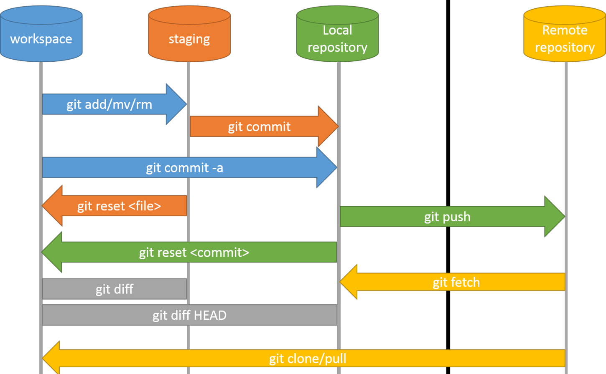

# 开发工具问题
## GDB
### gdb调试的一些指令
### 介绍GDB和常用调试命令；
### 调试手段和流程？
### 用过的调试工具有哪些？（GDB等）
### 程序挂掉了，怎么调试？有什么工具？怎么做？
## Git

### Git 配置
- git config --global/local user.name "your name"
- git config --global/local user.email "your@example.com"
- git config --global/local --unser

global 的配置保存在 ~/.gitconfig 中，而 local 的文件保存在 $project/.git/config 中

### Git 常用基本操作命令
- git init：初始化仓库
- git status：显式工作区和暂存区的当前状态
- git add file1, file2, ...：将工作区文件保存到暂存区
- git commit [file1, file2, ...] -m "commits"：提交暂存区的文件到仓库
- git commit [file1, file2, ...] -amend [-m "new commits"]：修改（添加文件或修改注释）最后一次提交
- git commit [file1, file2, ...] -a "commits"：将工作区的文件添加到仓库
- git rm file1, file2, ...：删除暂存区的文件
- git mv old new：移动（重命名）暂存区的文件
- git rm --cached file1, file2, ...：停止跟踪指定文件，但该文件保留在工作区
- git diff：显式暂存区的文件和工作区的文件的不同
- git diff #id1 #id2：两个提交之间的不同

### Git 版本回退
- git log：显示提交日志
- git reflog：查看命令历史
- git reset --hard #id：撤销提交，返回到 #id 版本
- git reset --hard HEAD^：撤销提交，回退到上一个版本，HEAD^^ 表示上上个版本，HEAD~100 上 100 个版本
- git reset HEAD [file1, file2, ...]：撤销暂存区的修改，重新放回工作区
- git checkout [file1, file2, ...]：恢复暂存区的文件到工作区
- git checkout #id file1, file2, ...：恢复 #id 的文件到工作区

### Git 分支版本控制
### Git中fetch和pull的区别

### Git中rebase和merge的区别？

## linux命令
### 知道哪些Linux命令
### Linux了解不，df dh区别，如何格式化磁盘，磁盘挂载过程，tcp丢包如何排查，docker是用什么实现的
### tcpdump抓包
### 说出LINUX命令：磁盘存储查询、内存使用查询、CPU信息查询
### 解释TOP命令中各个数据的属性；
### 内存泄漏如何查询？
### 内存泄漏怎么查找？怎么处理？
### 内存泄漏排查手段和可能的实现？
### 内存泄漏？
### 如何查看进程负载和内存泄漏？
### top中的相关属性？load average？
### vim开发的相关工具？
### shell脚本中0,1,2的意思