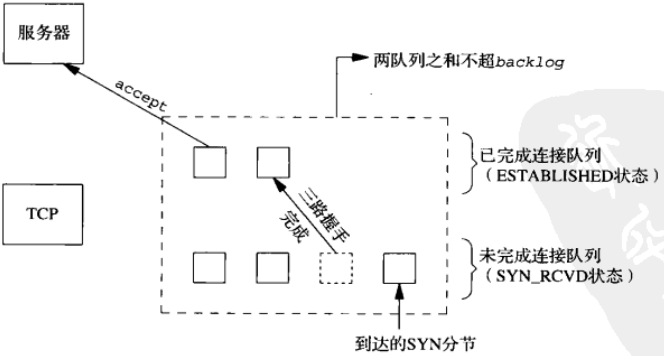
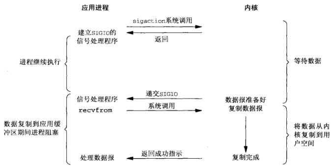
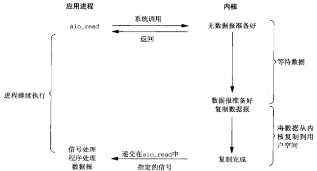
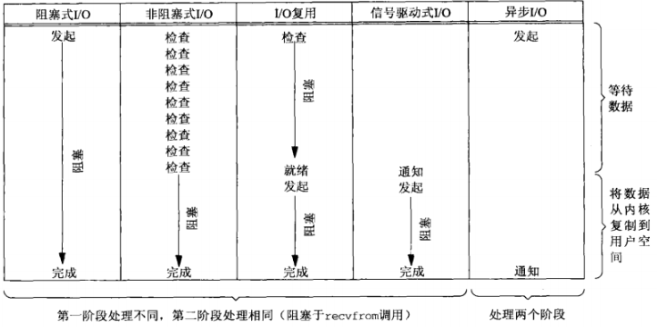

# UNIX网络编程--套接字联网

## 传输层 TCP&UDP
### UDP
- 简单的、不可靠的数据报协议
- 不保证UDP数据包会到达其最终目的地
- 不保证各个数据报的先后顺序跨网络后保持不变
- 不保证每个数据报只到达一次
- 数据有边界

### TCP
- 复杂的、可靠的字节流协议
- 提供客户与服务器之间的连接
- 提供了可靠性（确认与重传）
- 提供流量控制
  - 通告窗口：TCP总是告知对端在任何时刻它一次能够从对端接收多少字节的数据。在任何时候、该窗口指出接受缓冲区中当前可用的空间量，从而确保发送端发送的数据不会使接收缓冲区溢出
- TCP连接是全双工
  - 在一个给定的连接上应用可以在任何时刻在进出两个方向上既发送数据又接受数据

### TCP连接的建立
1. 服务器必须准备好接受外来的连接。这通常通过依次调用`socket`、`bind`、`listen`函数来完成，称之为被动打开
2. 客户通过调用`connect`发起主动打开。这导致客户TCP发送一个`SYN`（同步）分节，它告诉服务器客户将在（待建立的）连接中发送的数据的初始序列号。通常`SYN`分节不携带数据，其所在IP数据报只有一个IP首部，一个TCP首部以及可能有的TCP选项
3. 服务器必须确认（`ACK`）客户的`SYN`，同时自己也得发送一个`SYN`分节，它含有服务器将在同一连接中发送的数据的初始序列号。服务器在单个分节中发送`SYN`和对客户`SYN`的`ACK`
4. 客户必须确认服务器的`SYN`


### TCP连接终止
1. 某个引用进程首先调用`close`，称该端执行主动关闭。该端的TCP于是发送一个`FIN`分节，表示数据发送完毕
2. 接受到这个`FIN`的一端（接收端）执行被动关闭。TCP对`FIN`进行确认。`FIN`接收也作为一个文件结束符（`EOF`）传递给接收端应用进程（放在已排队等候应用进程接收的任何数据之后）
3. 一段时间后，被动关闭这端的应用进程将调用`close`关闭它的套接字--发送`FIN`（打开的套接字被关闭都会发送`FIN`，比如调用`exit`或从`main`函数返回）
4. 执行主动关闭的一端对这个`FIN`进行确认


### TCP状态转换图


### TIME_WAIT状态
- 持续时长：最长分节生命期的两倍，2MSL（Maximum segment lifetime）
- 可靠地实现TCP全双工连接的终止
  - 正确处理连接终止序列4个分节中最后一个分节丢失的情况
  - 主动关闭的一端可能不得不重传最终那个`ACK`
- 让老的重复分节在网络中消失
  - TCP必须防止来自某个连接的老的重复分组在该连接终止后出现，从而被误解成属于同一连接的某个新的化身（老的连接关闭后，在相同的IP和端口之间建立的另一个连接）
- 存在例外：如果到达的`SYN`的序列号大于前一化身的结束序列号，源自Berkeley的实现将给当前处于TIME_WAIT状态的连接启动新的化身。

### TCP输出
当某个应用进程调用`write`时，内核从该应用进程的缓冲区中赋值所有数据到所有写套接字的发送缓冲区。如果该套接字的发送缓冲区容不下该应用进程的所有数据（或是应用进程的缓冲区大于套接字的发送缓冲区，或是套接字的发送缓冲区已有其他数据），该应用将被投入睡眠（假设该套接字是阻塞的）。内核将不从`write`系统调用返回，直到应用进程缓冲区中的所有数据都复制到套接字的发送缓冲区。因此，从写一个TCP套接字的`write`调用成功返回仅仅表示我可可以重新使用原来的引用进程缓冲区，并不表明对端的TCP或应用进程已接受到数据。

### UDP输出
没有发送缓冲区，但有发送缓冲区大小，仅仅表示可写到该套接字的UDP数据报的大小上限（写入数据大于该值，内核返回`EMSGSIZE`错误）。UDP简单地给来自用户的数据报按上它的8字节的首部以构成UDP数据报，然后传递给IP。从写一个UDP套接字的`write`（？`sento`）调用成功返回表示所写的数据报或其所有片段已被加入数据链路层的输出队列。如果该队列没有足够空间该数据报或它的某个片段，内核返回`ENOBUFS`错误。

## 3、套接字编程简介
### IPv4套接字地址结构 (linux)
```
typedef unsigned short __kernel_sa_family_t;
typedef __kernel_sa_family_t	sa_family_t;
#define __SOCKADDR_COMMON(sa_prefix) \
sa_family_t sa_prefix##family /* 16-bit address family */

typedef uint32_t in_addr_t;
struct in_addr {
  in_addr_t      s_addr;      /* 32-bit IPv4 address */
};

typedef uint16_t in_port_t;
struct sockaddr_in {
  __SOCKADDR_COMMON(sin_);   /* 16-bit IPv4 address */
  int_port_t     sin_port;   /* 16-bit TCP or UDP port number */
  struct in_addr sin_addr;   /* network byte ordered */
  unsigned char  sin_zero[sizeof (struct sockaddr) -
                          __SOCKADDR_COMMON_SIZE -
                          sizeof (in_port_t) - 
                          sizeof (struct in_addr)];  /* sin_zero[8]*/
};
```
### 通用套接字地址结构（linux）
```
struct sockaddr {
  sa_family sa_family;   /* address family AF_*/
  char      sa_data[14]; /* 14 bytes of protocol address */
};
```
### IPv6套接字地址结构
```
struct in6_addr {
  union {
    unit8_t __u6_addr8[16];
  }__in6_u;
};

struct sockaddr_in6 {
  __SOCKADDR_COMMON(sin6_);       /* address family AF_ */
  in_port_t       sin6_port;      /* Transport layer port */
  uint32_t        sin6_flowinfo;  /* IPv6 flow information */
  struct in6_addr sin6_addr;      /* IPv6 address */
  uint32_t        sin6_scope_id;  /* IPv6 scope-id */
};
```
### 值-结果参数
- 从进程到内核传递套接字地址结构的函数有3个：`bind`、`connect`和`sendto`。这些函数一个参数是指向套接字的指针，一个是套接字结构的大小。
- 从内核到进程传递套接字地址结构的函数有4个：`accept`、`recvfrom`、`getsockname`、`getpeername`。这些函数一个参数是指向套接字的指针，一个是指向表示套接字结构大小的变量的指针。
  

### 字节排序函数
```
#include <netinet/in.h>
uint16_t htons(uint16_t host16bitvalue); // 返回网络字节序
uint32_t htonl(uint32_t host32bitvalue); // 返回网络字节序
uint16_t ntohs(uint16_t net16bitvalue);  // 返回主机字节序
uint32_t ntohl(uint32_t net16bitvalue);  // 返回主机字节序
```
### 字节操纵函数
```
#include <string.h>
void bzero(void *dest, size_t nbytes);
void bcopy(const void *src, void &dest, size_t nbytes);
int bcmp(cont void *ptr1, const void *ptr2, size_t nbytes);

void *memset(void *dest, int c, size_len);
void *memcpy(void *dest, const void *src, size_t nbytes);
int memcmp(void *ptrl, const void *ptr2, size_t nbytes);
```
### 地址转换函数
```
#include <arpa/inet.h>
// 点分十进制字符串转换为二进制值IPv4地址
int inet_aton(const char *strptr, struct in_addr *addrptr);  // 成功返回1,失败返回0
int_addr_t inet_addr(const char *strptr);  // 失败返回INADDR_NONE

// 二进制值IPv4地址转换为点分十进制字符串
char *inet_ntoa(struct in_add inaddr); // 指向点分十进制字符串

// IPv4地址和IPv6地址都适用
int inet_pton(int family, const char *strptr, void *addrptr); // 成功1，无效0，失败-1
const char *inet_ntop(int family, const void *addrptr, const *strptr, size_t len); // 出错NUL
```


## 4、基本TCP套接字编程


### `socket`函数
```
#include <sys/socket.h>
int socket(int family, int type, int protocol); // 成功返回文件描述符，失败返回-1
```

### `connect`函数
```
#include <sys/socket.h>
int connect(int sockfd, const struct sockadrr *addr, socklen_t addrlen); // 成功返回-1，失败返回-1
```
- 客户在调用函数`connect`前不必非得调用`bind`函数
- 如果是TCP套接字，调用`connect`函数将激发TCP的三路握手，而且仅在建立成功或出错时才返回，错误的情况：
  - （几次发送仍然）没有收到`SYN`分节的响应，返回`ETIMEDOUT`错误
  - 收到的相应是`RST`（表示复位），马上返回`ECONNREFUSED`错误。产生`RST`三个条件：
    - 目的地为某端口的`SYN`到达，然而该端口上没有正在监听的服务器
    - TCP想取消一个已有的连接
    - TCP接收到一个根本不存在的连接上的分节
  - 若客户发出的`SYN`在中间的某个路由器引发`destination unreachable`ICMP错误，客户主机内核保存该消息，（几次尝试后）仍未收到相应，则把保存的ICMP错误作为`EHOSTUNREACH`或`ENETUNREACH`返回给进程

### `bind`函数
```
#include <sys/socket.h>
int bind(int sockfd, const struct sockaddr *addr, socklen_t addlen);
```
- 可以指定一个端口，或指定一个IP地址，可以两者都指定，也可以两者都不指定
- 指定端口号为0，内核在`bind`被调用时选择一个临时端口
- 若没有绑定一个端口，当调用`connect`或`listen`时，内核为相应的套接字选择一个临时端口号

### `listen`函数
```
#include <sys/socket.h>
int listen(int sockfd, int backlog); // 成功返回-1，失败返回-1
```
`listen`函数仅由TCP服务器调用，它做两件事：
- 当`socket`函数创建一个套接字是，他被假设为一个主动套接字（调用connect发起连接的客户套接字）。`listen`函数把一个未连接的套接字转换成一个被动套接字，只是内核应接受指向该套接字的连接请求。调用`listen`导致套接字从`CLOSED`状态转换到`LISTEN`状态
- 第二个参数规定类内核应该为相应的套接字排队的最大连接个数

未完成连接队列和已完成连接队列
- 未完成连接队列，每个这样的`SYN`分节对应其中的一项：已有某个客户发出并到达服务器，而服务器正在等待完成相应的TCP三路握手过程。这些套接字处于`SYN_RCVD`状态
- 已完成连接队列，每个已完成TCP三路握手过程的客户对应其中一项。这些套接字处于`ESTABLISHED`状态
- 

连接建立过程
- 当来自客户的`SYN`到达时，TCP在未完成连接队列中创建一个新项（来自监听套接字的参数就复制到即将建立的连接中），然后响应三路握手的第二个分节：服务器的`SYN`响应，其中捎带对客户`SYN`的`ACK`。这一项一直保留在未完成连接队列中，知道三路握手的第三个分节（客户对服务器的`SYN`的`ACK`）到达或该项超时为止。
- 三路握手正常完成，该项就从未完成连接队列移到已完成队列的队尾
- 当进程调用`accept`时，已完成连接队列中的队头项将返回给进程，或者如果该队列为空，那么进程将被投入睡眠，知道TCP在该队列中放入一项才唤醒它
- 

### `accept`函数
```
#include <sys/socket.h>
int accept(int sockfd, struct sockaddr *addr, socklen_t *addrlen); // 成功返回文件描述符，失败返回-1
```
如果`accept`成功，那么其返回值是由内核自动生成的一个全新描述符，代表与所返回客户的TCP连接

### `fork`函数
```
#include <sys/unistd>
pid_t fork(void);
```
- 返回两次
  - 在调用进程（称为父进程）中返回一次，返回值是子进程ID号
    - 可以有多个子进程，必须用进程ID区分
  - 在子进程返回一次，返回值是0
    - 只有一个父进程，可以用`getppid`获取父进程ID
- 父进程中调用`fork`之前打开的所有描述符在fork返回之后与子进程共享
- 两个典型用法
  - 一个进程创建自身的副本，多个副本可以并发执行处理各自的操作
  - 一个进程创建自身的副本，然后在其中的一个副本（通常是自己那成）调用`exec`把自身替换成新的程序

### `exec`函数
```
#include <unistd.h>
int execl(const char *pathname, const char *arg0, ...);
int execv(const char *pathname, char *const *argv[]);
int execle(const char *pathname, const char *arg0, ...);
int execve(const char *pathname, char *const argv[], char *const envp[]);
int execlp(const char *filename, cosnt char *arg0, ...);
int execvp(const char *filename, char *const argv[]);
```


### 并发服务器（`fork`实现）


### `close`函数
```
#include <unistd.h>
int close(int sockfd);
```
描述符引用计数减1，若为0，清理和释放相应的资源

### `getsockname`和`getpeername`函数
或者返回与某个套接字关联的本地协议地址（`getsockname`），或者返回与某个套接字关联的外地协议地址（`getpeername`）
```
#include <sys/socket.h>
int getsockname(int sockfd, struct sockaddr *localaddr, socklen_t *addrlen);
int getpeername(int sockfd, struct sockaddr *peeraddr, socklen_t *addrlen);
```

## 5、TCP客户/服务器程序示例
### POSIX信号处理
- 信号就是告知某个进程发生了某个事件的通知，有时也称为软件中断。信号通常是异步发生的
  - 由一个进程发送给另一个进程（或自身）
  - 由内核发送给某个进程
- 信号处理选择
  - 提供一个函数，只要有特定信号发生它就被调用
  - 把某个信号的设置为`SIG_IGN`来忽略它。`SIGKILL`和`SIGSTOP`不能忽略
  - 默认处置`SIG_DFL`
- 注册函数
  ```
  #include <signal.h>
  void (*signal(int signo, void(*func)(int)))(int);

  struct sigaction {
    void (*sa_handler)(int);
    sigset_t sa_mask;
    int      sa_flags;
  };
  int sigaction(int signo, const struct sigaction *act, struct sigaction *oldact);
  ```

### POSIX信号语义
- 一旦注册了信号处理函数，它变一直注册
- 在一个信号处理函数运行期间，正被递交的信号是阻塞的
- 如果一个吸纳好哦在被簇赛期间产生类一次或多次，那么该信号被解阻塞之后只递交一次，也就是Unix信号默认是不排队的

### 处理僵尸进程
`signal(SIG_CHLD, sig_child);`

### `wait`和`waitpid`函数
```
#include <sys/wait.h>
pid_t wait(int *statloc);
pid_t waitpid(pid_t pid, int *statloc, int options);
```
- 两者区别：
  - 如果调用`wait`的进程没有已终止的进程，不过有一个或多个子进程仍在执行，那么`wait`将阻塞到现有子进程第一个终止为止
  - `waitpid`就等待哪个进程以及是否阻塞给了我们更多的控制。pid参数运行我们指定像等待的进程ID（-1表示等待第一个终止的进程）;传递`WNOHNAG`给options可以告知内核在没有已终止子进程时不要阻塞

### `SIGPIPE`信号
当一个进程向某个已收到`RST`的套接字执行写操作时，内核向该进程发送一个`SIGPIPE`信号。该信号的默认行为是终止进程，因此进程必须捕获它以免不情愿地被终止。

### `accept`返回前连接中止
三路握手完成从而连接建立之后，客户TCP却发送了一个`RST`。在服务器端看来，就在该连接已由TCP排队，等着服务进程调用`accept`的时候`RST`到达。稍后，服务进程调用`accept`。

如何处理这种中止的连接依赖于不同的实现：
- POSIX实现，返回`ECONNABORTED`错误（errno）
- SVR4实现，返回`EPROTO`错误（errno）
- 源自Berkeley的实现完全在内核中处理中止的连接，服务进程看不到。同时完成三次握手的连接会从已完成队列中移除。在这种情况下，如果我们用`select`监听到有新的连接完成，但之后又被从完成队列中删除，此时如果调用阻塞`accept`就会产生阻塞。解决办法：
  - 使用`select`监听套接字是否有完成连接的时候，总是把这个监听套接字设置为非阻塞
  - 在后续的`accept`调用中忽略以下错误，`EWOULDBLOCK`(Berkeley实现，客户中止连接), `ECONNABORTED`(posix实现，客户中止连接), `EPROTO`(serv4实现，客户中止连接)和EINTR(如果有信号被捕获)；

### 服务器进程终止（崩溃）
在客户端和服务器端建立连接之后，使用kill命令杀死服务器进程，进程终止会关闭所有打开的描述符，这导致了其向客户端发送一个`FIN`，而客户端不知道服务器端已经终止了，当客户端向服务器写数据的时候，由于服务器进程终止，所以响应了`RST`，如果我们使用`select`等方式，能够立即知道当前连接状态；如下：
- 如果对端TCP发送数据，那么套接字可读，并且`read`返回一个大于0的值
- 如果对端TCP发送了`FIN`（对端终止），那么套接字变为可读，并且`read`返回0（`EOF`）
- 如果对端TCP发送`RST`（对端主机崩溃并重启），那么套接字变为可读，并且`read`返回-1，errno中含有确切错误码

### 服务器主机崩溃
建立连接后，服务器主机崩溃，此时如果客户端发送数据，会发现客户端会在一定时间内持续重传，视图从服务器端收到数据的`ACK`，当重传时间超过指定时间后，服务器仍然没有响应，那么返回`ETIMEDOUT`错误。

### 服务器主机崩溃后重启
当服务器主机崩溃后重启时，它的TCP丢失了崩溃前的所有连接信息，因此服务器TCP对于收到来自客户端的数据分节响应一个`RST`。客户端套接字变为可读，并且`read`返回-1，errno中含有确切错误码

### 服务器主机关机
UNIX系统关机时，init进程给所有进程发送`SIGTERM`信号（默认处置是终止进程），等待一端固定的时间（5～20sec，清除和终止所有运行的进程），然后给所有仍在运行的进程发送`SIGKILL`信号（该信号不能被捕获）。当服务器子进程终止时，它的所有打开着的描述符都被关闭，随后发生的是和[服务器进程终止](###服务器进程终止（崩溃）)一样

## 6、IO复用：`select`和`poll`函数

### 概述
在客户阻塞与（标准输入上的）`fgets`调用期间，服务器进程被杀死。服务器TCP虽然正确地给客户TCP发送了一个`FIN`，但是客户进程正阻塞与从标准输入读入的过程，将看不到这个`EOF`，直到从套接字读时为止。这样的进程需要一种预先告知内核的能力，使得内核一旦发现进程的一个或多个IO条件就绪（输入已准备好被读取，或者描述符已能承接更多的输出），它就通知进程，这个能力称为IO复用。

### IO模型
在默认条件下，所有的套接字都是阻塞的。以UDP为例（比较简单），将`recvfrom`函数视为系统调用（在源自Berkeley的内核上是作为系统调用，在System V内核上是作为系统调用`getmsg`的实现函数）

#### 阻塞式IO模型
进程调用`recvfrom`，其系统调用知道数据报到达且被复制到应用进程的缓冲区中或者发生错误才返回。进程在从调用`recvfrom`开始到它返回的整段时间内是被阻塞的。`recvfrom`成功返回后，应用进程开始处理数据报


#### 非阻塞式IO模型
前三此调用`recvfrom`时没有数据可返回，因此内核转而立即返回一个`EWOULDBLOCK`错误。第四此调用`recvfrom`时已有一个数据报准备好，它被复制到应用进程缓冲区，于是`recvfrom`成功返回，应用进程开始处理数据


#### IO复用模型
有了IO复用，就可以调用`select`、`poll`或`epoll`，阻塞在这三个系统调用的某个之上（可以设置不阻塞），而不是阻塞在真正的IO系统调用上。

等待阻塞于`select`调用，等待数据报套接字变为可读。当`select`返回套接字可读这一条件时，调用`recvfrom`把所读数据报复制到应用进程缓冲区。


#### 信号驱动式IO模型
利用信号，让内核在描述符就绪时发送`SIGIO`信号通知应用进程。首先开启套接字的信号驱动式IO功能，并通过`signal`或`sigaction`系统调用安装一个信号处理函数，该系统调用立即返回，应用进程继续工作。当数据报准备好读取时，内核就为该进程产生一个`SIGIO`吸纳好哦。应用进程随后可以在信号处理函数（先前通过通过`signal`或`sigaction`系统调用注册）中调用`recvfrom`读取数据报，并通知主循环数据已准备好，也可以通知主讯号，让他读取数据报。



#### 异步IO模型
告知内核启动某个操作，并让内核在整个操作（包括将数据从内核复制到我们自己的缓冲区）完成后通知应用进程。

这种模型与前一节介绍的信号驱动模型的主要区别在于：信号驱动式IO是内核通知应用进程何时可以启动一个IO操作，而异步IO模型是内核通知应用进程IO操作何时完成

应用进程调用`aio_read`函数给内核传递描述符、缓冲区指针、缓冲区大小和文件偏移，并告诉内核当整个操作完成时如何通知应用进程（产生某个吸纳好哦，该信号直到数据已复制到应用进程缓冲区才产生）。该系统调用立即返回，而且等待IO完成期间，应用进程不被阻塞



### 同步IO和异步IO对比
- 同步IO操作导致请求进程阻塞，直到IO操作完成
  - [阻塞式IO模型](####阻塞式IO模型)
  - [非阻塞式IO模型](####非阻塞式IO模型)
  - [IO复用模型](####IO复用模型)
  - [信号驱动式IO模型](####信号驱动式IO模型)
- 异步IO操作不导致请求进程阻塞
  - [异步IO模型](####异步IO模型)



### `select`函数
```
#include <sys/select.h>
#include <sys/time.h>
/* @param
 * maxfd：监视对象文件描述符的范围，即所有文件描述符的最大值加1
 * readset：是否存在待读取数据
 * writeset：是否可传输无阻赛数据
 * exceptset：是否发生异常
 * timeout：调用select函数后，为防止陷入无限阻塞的状态，传递超时信息
 * return：成功返回0,失败返回-1。因发生关注的事件返回时，返回大于0的值
 */
 int select(int maxfd, fd_set *readset, fd_set *writeset, fd_set *exceptset, const struct timeval *timeout);

 struct tiemval {
   long tv_sec;  // seconds
   long tv_usec; // microseconds
 };
```
timeout参数的三种可能：
- 永远等待下去：仅在有一个描述符准备好IO时才返回。为此，我们把该参数设置为空指针
- 等待一段固定时间：在有一个描述符准备好IO时返回，但是不超过由该参数所指向的`timaval`结构中指定的秒数和微妙数
- 根本不等待：检查描述符后立即返回，这称为轮询。为此，该参数必须指向一个`timeval`机构体，而且其中的定时器必须为0

前两种情形的等待通常会被进程在等待期间捕获的信号中断，并从信号处理函数返回。

### 描述符就绪条件
1. 满足下列四个条件中的任何一个时，一个套接字准备好读
   - 该套接字接收缓冲区中的数据字节数大于等于套接字接收缓冲区低水位标记的当前大小。对这样的套接字执行读操作不会阻塞并将返回一个大于0的值。可以用`SO_RCVLOWAT`套接字选项设置该套接字的低水位标记。对于TCP和UDP套接字而言，其默认值为1
   - 该连接的读半部关闭（也就是接收了FIN的TCP连接），对这样的套接字的读操作不会阻塞并返回0（EOF）
   - 该套接字是一个监听套接字且以完成的连接数不为0。对这样的套接字的`accept`通常不会阻塞
   - 其上有一个套接字错误待处理。对这样的套接字的读操作将不阻塞并返回-1，同时把`errno`设置成确切的错误条件。这些待处理错误也可以通过指定`SO_ERROR`套接字选项调用`getsockopt`获取并清除
2. 下面四个条件中的任何一个满足时，一个套接字准备好写：
   - 该套接字发送缓冲区中的可用空间字节数大于等于套接字发送缓冲区低水位标记的当前大小，并且或者该套接字已连接，或者该套接字不需要连接（如UDP套接字）。这意味着如果把这样的套接字设置成非阻塞，写操作将不阻塞并返回一个正值。可以使用`SO_SNDLOWAT`套接字选项来设置该套接字的低水位标记。对TCP和UDP套接字而言，其默认值通常为2048
   - 该连接的写半部关闭。对这样的套接字的写操作将产生`SIGPIPE`信号
   - 使用非阻塞式`connect`的套接字已建立连接，或者`connect`已经以失败告终
   - 其上有一个套接字错误待处理。对这样的套接字的写操作将不阻塞并返回-1，同时把`errno`设置成确切的错误条件。这些待处理错误也可以通过指定`SO_ERROR`套接字选项调用`getsockopt`获取并清除
3. 如果一个套接字存在带外数据或者仍处于带外标记，那么它有异常条件待处理。

`select`返回某个套接字就绪的条件


### `shutdown`函数
```
#include <sys/socket.h>
/* @param
 * sock：需要断开的套接字文件描述符
 * howto：传递断开方式信息
 *        SHUT_RD：断开输入流
 *        SHUT_WR：断开输出流
 *        SHUT_RDWR：同时断开输入输出流
 */
int shudown(int sock, int howto);
```
`close`和`shutdown`比较
- `close`把描述符的引用计数减1,仅在该计数变为0时才关闭套接字。使用`shutdown`可以不管引用计数就激发TCP的正常连接终止序列
- `close`终止读和写两个方向的数据传送。`shutdown`关闭一半TCP连接

### `poll`函数
```
#include <poll.h>
/* @param
 * fdvec：指向结构体数组的首个元素的指针
 * nfds：第一个参数所指结构体的长度
 * timeout：超时时间，单位是毫秒
 *    INFTIM：永远等待
 *    0：立即返回，不阻塞进程
 *    >0：等待指定数目的毫秒
 * return：若有就绪描述符则为其数目，若超时则为0，若出错则为-1
 */
int poll(struct pollfd *fdvec, unsigned long nfds, int timeout);

struct pollfd {
  int   fd;      /* descriptor to check */
  short events;  /* events of interest on fd */
  short revents; /* events that occurred on fd */
};
```
