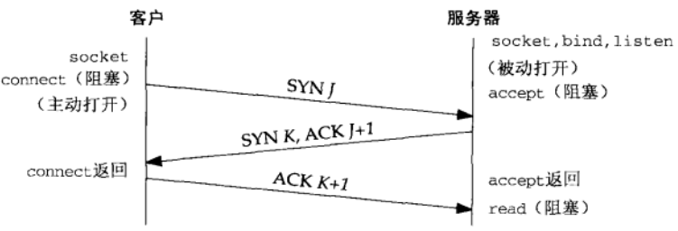
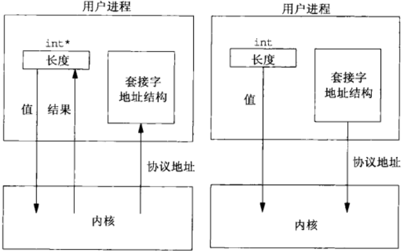
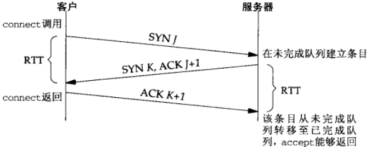

# UNIX网络编程--套接字联网

## 传输层 TCP&UDP
### UDP
- 简单的、不可靠的数据报协议
- 不保证UDP数据包会到达其最终目的地
- 不保证各个数据报的先后顺序跨网络后保持不变
- 不保证每个数据报只到达一次
- 数据有边界

### TCP
- 复杂的、可靠的字节流协议
- 提供客户与服务器之间的连接
- 提供了可靠性（确认与重传）
- 提供流量控制
  - 通告窗口：TCP总是告知对端在任何时刻它一次能够从对端接收多少字节的数据。在任何时候、该窗口指出接受缓冲区中当前可用的空间量，从而确保发送端发送的数据不会使接收缓冲区溢出
- TCP连接是全双工
  - 在一个给定的连接上应用可以在任何时刻在进出两个方向上既发送数据又接受数据

### TCP连接的建立
1. 服务器必须准备好接受外来的连接。这通常通过依次调用`socket`、`bind`、`listen`函数来完成，称之为被动打开
2. 客户通过调用`connect`发起主动打开。这导致客户TCP发送一个`SYN`（同步）分节，它告诉服务器客户将在（待建立的）连接中发送的数据的初始序列号。通常`SYN`分节不携带数据，其所在IP数据报只有一个IP首部，一个TCP首部以及可能有的TCP选项
3. 服务器必须确认（`ACK`）客户的`SYN`，同时自己也得发送一个`SYN`分节，它含有服务器将在同一连接中发送的数据的初始序列号。服务器在单个分节中发送`SYN`和对客户`SYN`的`ACK`
4. 客户必须确认服务器的`SYN`



### TCP连接终止
1. 某个引用进程首先调用`close`，称该端执行主动关闭。该端的TCP于是发送一个`FIN`分节，表示数据发送完毕
2. 接受到这个`FIN`的一端（接收端）执行被动关闭。TCP对`FIN`进行确认。`FIN`接收也作为一个文件结束符（`EOF`）传递给接收端应用进程（放在已排队等候应用进程接收的任何数据之后）
3. 一段时间后，被动关闭这端的应用进程将调用`close`关闭它的套接字--发送`FIN`（打开的套接字被关闭都会发送`FIN`，比如调用`exit`或从`main`函数返回）
4. 执行主动关闭的一端对这个`FIN`进行确认


### TCP状态转换图


### TIME_WAIT状态
- 持续时长：最长分节生命期的两倍，2MSL（Maximum segment lifetime）
- 可靠地实现TCP全双工连接的终止
  - 正确处理连接终止序列4个分节中最后一个分节丢失的情况
  - 主动关闭的一端可能不得不重传最终那个`ACK`
- 让老的重复分节在网络中消失
  - TCP必须防止来自某个连接的老的重复分组在该连接终止后出现，从而被误解成属于同一连接的某个新的化身（老的连接关闭后，在相同的IP和端口之间建立的另一个连接）
- 存在例外：如果到达的`SYN`的序列号大于前一化身的结束序列号，源自Berkeley的实现将给当前处于TIME_WAIT状态的连接启动新的化身。

### TCP输出
当某个应用进程调用`write`时，内核从该应用进程的缓冲区中赋值所有数据到所有写套接字的发送缓冲区。如果该套接字的发送缓冲区容不下该应用进程的所有数据（或是应用进程的缓冲区大于套接字的发送缓冲区，或是套接字的发送缓冲区已有其他数据），该应用将被投入睡眠（假设该套接字是阻塞的）。内核将不从`write`系统调用返回，直到应用进程缓冲区中的所有数据都复制到套接字的发送缓冲区。因此，从写一个TCP套接字的`write`调用成功返回仅仅表示我可可以重新使用原来的引用进程缓冲区，并不表明对端的TCP或应用进程已接受到数据。

### UDP输出
没有发送缓冲区，但有发送缓冲区大小，仅仅表示可写到该套接字的UDP数据报的大小上限（写入数据大于该值，内核返回`EMSGSIZE`错误）。UDP简单地给来自用户的数据报按上它的8字节的首部以构成UDP数据报，然后传递给IP。从写一个UDP套接字的`write`（？`sento`）调用成功返回表示所写的数据报或其所有片段已被加入数据链路层的输出队列。如果该队列没有足够空间该数据报或它的某个片段，内核返回`ENOBUFS`错误。

## 3、套接字编程简介
### IPv4套接字地址结构 (linux)
```
typedef unsigned short __kernel_sa_family_t;
typedef __kernel_sa_family_t	sa_family_t;
#define __SOCKADDR_COMMON(sa_prefix) \
sa_family_t sa_prefix##family /* 16-bit address family */

typedef uint32_t in_addr_t;
struct in_addr {
  in_addr_t      s_addr;      /* 32-bit IPv4 address */
};

typedef uint16_t in_port_t;
struct sockaddr_in {
  __SOCKADDR_COMMON(sin_);   /* 16-bit IPv4 address */
  int_port_t     sin_port;   /* 16-bit TCP or UDP port number */
  struct in_addr sin_addr;   /* network byte ordered */
  unsigned char  sin_zero[sizeof (struct sockaddr) -
                          __SOCKADDR_COMMON_SIZE -
                          sizeof (in_port_t) - 
                          sizeof (struct in_addr)];  /* sin_zero[8]*/
};
```
### 通用套接字地址结构（linux）
```
struct sockaddr {
  sa_family sa_family;   /* address family AF_*/
  char      sa_data[14]; /* 14 bytes of protocol address */
};
```
### IPv6套接字地址结构
```
struct in6_addr {
  union {
    unit8_t __u6_addr8[16];
  }__in6_u;
};

struct sockaddr_in6 {
  __SOCKADDR_COMMON(sin6_);       /* address family AF_ */
  in_port_t       sin6_port;      /* Transport layer port */
  uint32_t        sin6_flowinfo;  /* IPv6 flow information */
  struct in6_addr sin6_addr;      /* IPv6 address */
  uint32_t        sin6_scope_id;  /* IPv6 scope-id */
};
```
### 值-结果参数
- 从进程到内核传递套接字地址结构的函数有3个：`bind`、`connect`和`sendto`。这些函数一个参数是指向套接字的指针，一个是套接字结构的大小。
- 从内核到进程传递套接字地址结构的函数有4个：`accept`、`recvfrom`、`getsockname`、`getpeername`。这些函数一个参数是指向套接字的指针，一个是指向表示套接字结构大小的变量的指针。
  

### 字节排序函数
```
#include <netinet/in.h>
uint16_t htons(uint16_t host16bitvalue); // 返回网络字节序
uint32_t htonl(uint32_t host32bitvalue); // 返回网络字节序
uint16_t ntohs(uint16_t net16bitvalue);  // 返回主机字节序
uint32_t ntohl(uint32_t net16bitvalue);  // 返回主机字节序
```
### 字节操纵函数
```
#include <string.h>
void bzero(void *dest, size_t nbytes);
void bcopy(const void *src, void &dest, size_t nbytes);
int bcmp(cont void *ptr1, const void *ptr2, size_t nbytes);

void *memset(void *dest, int c, size_len);
void *memcpy(void *dest, const void *src, size_t nbytes);
int memcmp(void *ptrl, const void *ptr2, size_t nbytes);
```
### 地址转换函数
```
#include <arpa/inet.h>
// 点分十进制字符串转换为二进制值IPv4地址
int inet_aton(const char *strptr, struct in_addr *addrptr);  // 成功返回1,失败返回0
int_addr_t inet_addr(const char *strptr);  // 失败返回INADDR_NONE

// 二进制值IPv4地址转换为点分十进制字符串
char *inet_ntoa(struct in_add inaddr); // 指向点分十进制字符串

// IPv4地址和IPv6地址都适用
int inet_pton(int family, const char *strptr, void *addrptr); // 成功1，无效0，失败-1
const char *inet_ntop(int family, const void *addrptr, const *strptr, size_t len); // 出错NUL
```


## 基本TCP套接字编程


### `socket`函数
```
#include <sys/socket.h>
int socket(int family, int type, int protocol); // 成功返回文件描述符，失败返回-1
```

### `connect`函数
```
#include <sys/socket.h>
int connect(int sockfd, const struct sockadrr *addr, socklen_t addrlen); // 成功返回-1，失败返回-1
```
- 客户在调用函数`connect`前不必非得调用`bind`函数
- 如果是TCP套接字，调用`connect`函数将激发TCP的三路握手，而且仅在建立成功或出错时才返回，错误的情况：
  - （几次发送仍然）没有收到`SYN`分节的响应，返回`ETIMEDOUT`错误
  - 收到的相应是`RST`（表示复位），马上返回`ECONNREFUSED`错误。产生`RST`三个条件：
    - 目的地为某端口的`SYN`到达，然而该端口上没有正在监听的服务器
    - TCP想取消一个已有的连接
    - TCP接收到一个根本不存在的连接上的分节
  - 若客户发出的`SYN`在中间的某个路由器引发`destination unreachable`ICMP错误，客户主机内核保存该消息，（几次尝试后）仍未收到相应，则把保存的ICMP错误作为`EHOSTUNREACH`或`ENETUNREACH`返回给进程

### `bind`函数
```
#include <sys/socket.h>
int bind(int sockfd, const struct sockaddr *addr, socklen_t addlen);
```
- 可以指定一个端口，或指定一个IP地址，可以两者都指定，也可以两者都不指定
- 指定端口号为0，内核在`bind`被调用时选择一个临时端口
- 若没有绑定一个端口，当调用`connect`或`listen`时，内核为相应的套接字选择一个临时端口号

### `listen`函数
```
#include <sys/socket.h>
int listen(int sockfd, int backlog); // 成功返回-1，失败返回-1
```
`listen`函数仅由TCP服务器调用，它做两件事：
- 当`socket`函数创建一个套接字是，他被假设为一个主动套接字（调用connect发起连接的客户套接字）。`listen`函数把一个未连接的套接字转换成一个被动套接字，只是内核应接受指向该套接字的连接请求。调用`listen`导致套接字从`CLOSED`状态转换到`LISTEN`状态
- 第二个参数规定类内核应该为相应的套接字排队的最大连接个数

未完成连接队列和已完成连接队列
- 未完成连接队列，每个这样的`SYN`分节对应其中的一项：已有某个客户发出并到达服务器，而服务器正在等待完成相应的TCP三路握手过程。这些套接字处于`SYN_RCVD`状态
- 已完成连接队列，每个已完成TCP三路握手过程的客户对应其中一项。这些套接字处于`ESTABLISHED`状态
- 

连接建立过程
- 当来自客户的`SYN`到达时，TCP在未完成连接队列中创建一个新项（来自监听套接字的参数就复制到即将建立的连接中），然后响应三路握手的第二个分节：服务器的`SYN`响应，其中捎带对客户`SYN`的`ACK`。这一项一直保留在未完成连接队列中，知道三路握手的第三个分节（客户对服务器的`SYN`的`ACK`）到达或该项超时为止。
- 三路握手正常完成，该项就从未完成连接队列移到已完成队列的队尾
- 当进程调用`accept`时，已完成连接队列中的队头项将返回给进程，或者如果该队列为空，那么进程将被投入睡眠，知道TCP在该队列中放入一项才唤醒它
- 

### `accept`函数
```
#include <sys/socket.h>
int accept(int sockfd, struct sockaddr *addr, socklen_t *addrlen); // 成功返回文件描述符，失败返回-1
```
如果`accept`成功，那么其返回值是由内核自动生成的一个全新描述符，代表与所返回客户的TCP连接

### `fork`函数
```
#include <sys/unistd>
pid_t fork(void);
```
- 返回两次
  - 在调用进程（称为父进程）中返回一次，返回值是子进程ID号
    - 可以有多个子进程，必须用进程ID区分
  - 在子进程返回一次，返回值是0
    - 只有一个父进程，可以用`getppid`获取父进程ID
- 父进程中调用`fork`之前打开的所有描述符在fork返回之后与子进程共享
- 两个典型用法
  - 一个进程创建自身的副本，多个副本可以并发执行处理各自的操作
  - 一个进程创建自身的副本，然后在其中的一个副本（通常是自己那成）调用`exec`把自身替换成新的程序

### `exec`函数
```
#include <unistd.h>
int execl(const char *pathname, const char *arg0, ...);
int execv(const char *pathname, char *const *argv[]);
int execle(const char *pathname, const char *arg0, ...);
int execve(const char *pathname, char *const argv[], char *const envp[]);
int execlp(const char *filename, cosnt char *arg0, ...);
int execvp(const char *filename, char *const argv[]);
```


### 并发服务器（`fork`实现）


### `close`函数
```
#include <unistd.h>
int close(int sockfd);
```
描述符引用计数减1，若为0，清理和释放相应的资源

### `getsockname`和`getpeername`函数
或者返回与某个套接字关联的本地协议地址（`getsockname`），或者返回与某个套接字关联的外地协议地址（`getpeername`）
```
#include <sys/socket.h>
int getsockname(int sockfd, struct sockaddr *localaddr, socklen_t *addrlen);
int getpeername(int sockfd, struct sockaddr *peeraddr, socklen_t *addrlen);
```

## TCP客户/服务器程序示例
### POSIX信号处理