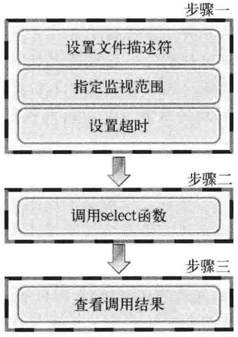
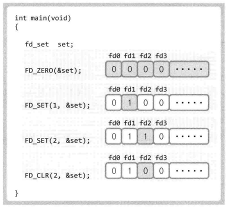

# TCP/IP网络编程（尹圣雨）

## 1、理解网络编程和套接字
### 函数原型
```
#inlcude <sys/socket.h>
int socket(int domain, int type, int protocol);                        // 成功返回文件描述符，失败返回-1
int bind(int sockfd, struct sockaddr *myaddr, socklen_t addrlen);      // 成功返回0，失败返回-1
int listen(int socktd, int backlog);                                   // 成功返回0，失败返回-1
int accept(int sockfd, struct sockaddr *addr, socklen_t *addrlen);     // 成功返回文件描述符，失败返回-1
int connect(int sockfd, struct sockadd *serv_addr, socklen_t addrlen); // 成功返回文件描述符，失败返回-1
```
### 基于Linux的文件操作
- 打开文件
  ```
  #inlcude <sys/types.h>
  #include <sys/stat.h>
  #include <fcntl.h>
  int open(const char *path, int flag);  // 成功时返回文件描述符，失败时返回-1
  ```
  |打开模式|含义|
  |:-:|:-:|
  |O_CREAT|必要时创建文件|
  |O_TRUNC|删除全部现有数据|
  |O_APPEND|维持现有数据、末尾添加|
  |O_RDONLY|只读打开|
  |O_WRONLY|只写打开|
  |O_RDWR|读写打开|
- 关闭文件
  ```
  #include <unistd.h>
  int close(int fd);    // 成功返回0,失败返回-1
  ```
- 将数据写入文件
  ```
  #include <unistd.h>
  ssize_t write(int fd, const void *buf, size_t nbytes); // 成功时返回写入的字节数，失败时返回-1
  ```
- 读取文件中的数据
  ```
  #include <unistd.h>
  ssize_t read(int fd, void *buf, size_t nbytes); // 成功时返回读取的字节数（但是遇到文件结尾则返回0），失败返回-1
  ```
## 2、套接字类型与协议设置
### 套接字协议及其数据传输特性
```
#include <sys/socket.h>
/* @param
 * domain：套接字使用的协议族（Protocol Family）信息
 * type：套接字数据传输类型
 * protocol：计算机间通信中使用的协议信息
 * return：成功时返回文件描述符，失败时返回-1
 */
int socket(int domain, int type, int protocol);
```
- 协议族（Protocol Family）

  |名称|协议族|
  |:-|:-|
  |PF_INET|IPv4互联网协议族|
  |PF_INET6|IPv6互联网协议族|
  |PF_LOCAL|本地通信的UNIX协议族
  |PF_PACKET|底层套接字的协议族|
  |PF_IPX|IPX Novel协议族|
- 套接字类型
  - 面向连接的套接字（SOCK_STREAM）
    - 可靠传输
    - 按序传输
    - 传输的数据没有边界（发送端多次发送，接受端可以一次接收）
  - 面向消息的套接字（SOCK_DGRAM）
    - 强调快速传输而非传输顺序
    - 不可靠
    - 传输的数据有边界（发送端N发送，接受端N次接收）
    - 限制每次传输的数据大小
## 3、地址族与数据序列
### 地址信息的表示
```
struct sockaddr_in {          // IPv4地址信息
  sa_family_t    sin_family;  // Protocol Family
  uint16_t       sin_prot;    // 端口号
  struct in_addr sin_addr;    // 32位IP地址
  char           sin_zero[8]; // 不使用
};
struct in_addr {
  In_addr_t      s_addr;      // 32为IPv4地址
};

struct sockaddr {
  sa_family      sin_family;  // Protocol Family
  char           sa_data[14]; // IP+port，剩余部分填充0
};
```
### 网络字节序与地址转换
- 字节序
  - 大端序：高位字节存放在低位地址
  - 小端序：高位字节存放在高位地址（intel默认）
- 网络字节序
  - 大端序排列方式
- 字节序转换
  ```
  unsigned short htons(unsigned short); // host-to-network
  unsigned short ntohs(unsigned short); // network-to-host
  unsigned long htonl(unsigned long);
  unsigned long ntohl(unsigned long);
  ```
### 网络地址的初始化与分配
```
#include <arpa/inet.h>
// 成功时返回32位大端序整数型值，失败时返回INADDR_NONE
in_addr_t inet_addr(const char *string);  // 127.0.0.1 ==> 0x100007f (大端序)

// 成功时返回1,识别示返回0
int inet_aton(const char *string, struct in_addr *addr);
```
## 4、基于TCP的服务端/客户端
### TCP套接字的IO缓冲
调用`write`函数时，将数据移至输出缓冲，在适当的时候（不管是分别传送还是一次性传送）传向对发的输入缓冲。调用`read`函数时，从输入缓冲读取数据

- IO缓冲在每个TCP套接字中单独存在
- IO缓冲在创建套接字时自动生成
- 即使关闭套接字也会继续传递输出缓冲中遗留的数据
- 关闭套接字将丢失输入缓冲中的数据

## 5、基于UDP的服务端/客户端
### UDP中的服务端和客户端没有连接
### UDP服务端和客户端均只需1个套接字
### 基于UDP的数据IO函数
  ```
  #include <sys/socket.h>
  /* @param
   * sockfd：用于传输数据的UDP套接字文件描述符
   * buff：待传输数据的缓冲地址
   * nbytes：待传输数据的字节数
   * flags：可选参数，没有则传递0
   * to：目的地址
   * addrlen：长度
   * return：成功时返回传输的字节数，失败时返回-1
   */
  ssize_t sendto(int             sockfd, 
                 void            *buff, 
                 size_t          nbytes, 
                 int             flags, 
                 struct sockaddr *to, 
                 socklen_t       addrlen);
  
  /* @param
   * sockfd：用于接收数据的UDP套接字文件描述符
   * buff：保持接收数据的缓冲地址
   * nbytes：可接收的最大字节数
   * flags：可选参数，没有则传递0
   * from：保存源地址
   * addrlen：保存长度
   * return：成功时返回接受的字节数，失败时返回-1
   */
  ssize_t recvfrom(int             sockfd, 
                   void            *buff, 
                   size_t          nbytes, 
                   int             flags, 
                   struct sockaddr *to, 
                   socklen_t       addrlen);
  ```
### UDP客户端套接字的地址分配
可以调用`bind`函数显式绑定，如果没有显式分配，调用`sendto`函数时自动分配IP和端口号
### 存在数据边界的UDP套接字
UDP是具有数据边界的协议，传输中调用IO函数的次数非常重要，输入函数的调用次数应和输出函数的调用次数完全一致
### 已连接（connected）UDP套接字与未连接（unconnected）UDP套接字
- `sendto`函数传输数据的过程
  - S1：向UDP套接字注册目标IP和端口号
  - S2：传输数据
  - S3：删除UDP套接字中注册的目标地址信息
- 创建已连接UDP套接字
  ```
  sock = socket(PF_INET, SOCK_DGRAM, 0);
  memset(&addr, 0, sizeof(addr));
  addr.sin_family = AF_INET;
  addr.sin_addr.s_addr = ...
  addr.sin_port = ...
  connect(sock, (struct sockaddr*)&addr, sizeof(addr));
  ```
  UDP套接字调用connect函数并不是要与对方建立连接，只是向UDP套接字注册目标IP和端口信息。之后每次调用`sendto`函数只需要传输数据。也可以用`write`和`read`处理数据。

## 6、优雅地断开套接字连接
### 单方面断开连接带来的问题
Linux的`close`函数意味着完全端口连接。完全断开连接不仅无法传输数据，而且也不能接收数据
### 半关闭`shutdown`函数
```
#include <sys/socket.h>
/* @param
 * sock：需要断开的套接字文件描述符
 * howto：传递断开方式信息
 *        SHUT_RD：断开输入流
 *        SHUT_WR：断开输出流
 *        SHUT_RDWR：同时断开输入输出流
 */
int shudown(int sock, int howto);
```
### 为何需要半关闭
发送`EOF`表示一方传输数据完毕
### 实例
file_server.c file_client.c

## 7、域名及网络地址
### DNS服务器
对IP地址和域名进行相互转换
### 域名的必要性
系统运行时，保持IP地址不变并不容易
### 利用域名获取IP地址
```
#include <netdb.h>
struct hosten *gethostbyname(const char *hostname); // 成功时返回hosten结构体地址，失败时返回NULL指针

struct hostent {
  char *h_name;      // official name
  char **h_aliases;  // alias list
  int  h_addrtype;   // host address type
  int  h_length;     // address length
  char **h_addr_list // address list
};
```


- h_name：官方域名
- h_aliases：绑定到同一地址的多个域名
- h_addrtype：IP地址类型IPv4还是IPv6（AF_INEThuoAF_INET6）
- h_length：IP地址长度
- h_addr_list：以整数形式保持域名对应的IP地址
  ```
  #include <arpa/inet.h>
  // 将整数形式IP转换为点分十进制格式的字符串
  char *inet_ntoa(struct in_addr addr) // 成功时返回转换的字符串地址值，失败时返回-1
  ```
### 利用IP地址获取域名
```
#include <netdb.h>
/*@param
 * addr：含有IP地址信息的in_addr结构体指针
 * len：指向第一个参数传递的地址信息的字节数，IPv4时为4，IPv6时为16
 * family：传递地址族信息，IPv4时为AF_INET，IPv6时为AF_INET6
 * return：成功时返回hostent结构体变量地址值，失败时返回NULL指针
 */
struct hostent *gethostbyaddr(const char *addr, socklen_t len, int family);
```

## 8、套接字的多种可选项
### 套接字多种可选项
`sock_type.c`
```
#include <sys/socket.h>
/*@ param
 * sock：用于查看选项套接字文件描述符
 * level：要查看的可选项的协议层
 * optname：要查看的可选名
 * optval：保存查看结果的缓冲地址值
 * optlen：缓冲字节数
 * return：成功时返回0,失败时返回-1
 */
int getsockopt(int sock, int level, int optname, void *optval, socklen_t *optlen);

/*@ param
 * sock：用于更改选项套接字文件描述符
 * level：要更改的可选项的协议层
 * optname：要更改的可选名
 * optval：保存要更改结果的缓冲地址值
 * optlen：缓冲字节数
 * return：成功时返回0,失败时返回-1
 */
int setsockopt(int sock, int level, int optname, const void *optval, socklen_t optlen);
```
### SO_SNDBUF & SO_RCVBUF
SO_SNDBUF是输入缓冲大小相关可选项，SO_RCVBUF是输出缓冲大小相关可选项。用这两个可选项既可以读取当前IO缓冲大小，也可以进行更改（`get_buf.c, set_buf.c`）。
### SO_REUSEADDR
- Time-wait状态
  - 先断开连接的（先发送FIN消息的）主机要经过Time-wait状态，确保TCP连接正常关闭。此时相应的端口是正在使用的状态，调用bind函数会发生错误。
- 地址再分配
  - `ACK`丢失，再次收到`FIN`包会重启Time-wait计时器
  - 更改套接字的SO_REUSEADDR状态，可将Time-wait状态下的套接字端口号重新分配给新的套接字
### TCP_NODELAY
- Nagle算法
  - 只有收到前一数据的`ACK`消息时，Nagle算法才发送下一数据
  - TCP默认使用Nagle算法交换数据，因此最大限度地进行缓冲，直到收到`ACK`
  - 减少小数据包，提高网络传输效率
  - 网络流量未受太大影响时，不使用Nagle算法要比使用它时传输速度快。最典型的是“大文件传输”应禁用Nagle算法
- 禁用Nagle算法
  ```
  int option = 1;
  setsockopt(sock, INPROTO_TCP, TCP_NODELAY, (void*)&option, sizeof(option));
  ```

## 9、多进程服务端
### 并发服务器端的实现方法
- 多进程服务器：通过创建多个进程提供服务
- 多路复用服务器：通过捆绑并统一管理IO对象提供服务
- 多线程服务器：通过生成与客户端等量的线程提供服务
### 理解进程
- “占用内存空间的正在运行的程序”
- 通过调用`fork`函数创建进程
  ```
  #include <unistd.h>
  pid_t fork(void); // 成功时返回进程ID，失败时返回-1
  ```
  - `fork`函数将创建调用的进程的副本--复制正在运行的、调用`fork`函数的进程。另外，两个进程都将执行`fork`函数调用后的语句（准确地说是在`fork`函数返回后）。之后的程序流要根据`fork`函数的返回值加以区分。
    - 父进程：`fork`函数返回子进程ID
    - 子进程：`fork`函数返回0
### 僵尸进程
- 僵尸进程就是父进程fork之后并没有wait子进程。在子进程退出的时候，内核释放该进程所有的资源，比如文件描述符，内存，等等，但是依然为该进程保留一定的信息（如PCB，允许父进程读取子进程exit status），只有该进程的父进程wait之后才会释放掉这些保留的信息。如果父进程没有wait，那么子进程就变成了僵尸进程。
- 销毁僵尸进程
  - 利用`wait`函数
    ```
    #include <sys/wait.h>
    pid_t wait(int *statloc);  // 成功时返回终止的子进程ID，失败时返回-1
    ```
    调用此函数时如果已经有子进程终止，那么子进程终止时传递的返回值（`exit`函数的参数值、`main`函数的`retrun`返回值）将保存到参数`stateloc`中。但是函数采纳数所指的单元中还包含其他信息，因此需要通过下列宏进行分离：
    - WIFEXITED：子进程正常终止时返回真
    - WEXITSATUS：返回子进程的返回值
    ```
    if(WIFEXITED(status))) {
      puts("normal termination");
      printf("child pass num: %d", WEXITSTATUS(status));
    }
    ```
  - 使用`waitpid`函数
    ```
    #include <sys/wait.h>
    /* @param
     * pid：等待终止的目标子进程的ID，若传递-1，则与wait函数相同，可以等待任意子进程终止
     * statloc：与wait函数statloc参数含义相同
     * options：传递头文件sys/wait.h中声明的常量WNOHANG，即使别有终止的子进程也不会进入阻塞状态，而是返回0并退出函数
     */
    pid_t waitpid(pid_t pid, int *statloc, int options); // 成功时返回终止的子进程ID（或0），失败返回-1
    ```
### 信号处理
- 信号与`signal`函数
  ```
  #include <signal.h>
  void (*signal(int signo, void(*func)(int)))(int);
  ```
  调用上述函数时，第一个参数为特殊情况信息，第二个参数为特殊情况下将要调用的函数的指针。发生第一个参数代表的情况时，（操作系统）调用第二个参数所指的函数。signo部分值：
  - SIGALRM：已到通过调用alarm函数注册的时间
  - SIGINT：输入CTRL+C
  - SIGCHLD：子进程终止
  
  ```
  #include <unistd.h>
  unsigned int alarm(unsigned int seconds); // 返回0或以秒为单位的据SIGALRM信号发生所剩时间
  ```
  如果调用该函数的同时向它传递一个正整型参数，相应时间后（以秒为单位）将产生SIGALRM信号。若向该函数传递0，则之前对SIGALRM信号的预约将取消。如果通过该函数预约信号后未指定该信号对应的处理函数，则（通过调用signal函数）终止进程，不做任何处理。
- 利用`sigaction`函数进行信号处理
  类似`signal`函数，而且完全可以替代后者，（接口）也更稳定
  ```
  #include <signal.h>

  /* @param
   * signo：传递信号信息
   * act：信号处理动作
   * oldact：获取之前注册的信号处理的指针，若不需要则传递0
   * return：成功时返回0，失败时返回-1
   */
  int sigaction(int signo, const struct sigaction *act, struct sigaction *oldact);

  struct sigaction {
    void (*sa_hanlder)(int);
    sigset_t sa_mask;  // 暂时初始化为0
    int sa_flags;      // 暂时初始化为0
  };
  ```
- 利用信号处理技术消灭僵尸进程`remove_zombie.c`
  - 子进程终止时将产生`SIGCHLD`信号
### 基于多任务的并发服务器
- 第一阶段：回声服务器（父进程）通过调用`accept`函数受理连接请求
- 第二阶段：此时获得的套接字文件描述符创建并传递给予子进程
- 第三阶段：子进程利用传递来的文件描述符提供服务
- 实现`echo_mpserver.c`
### 分割TCP的IO程序`echo_mpclient.c`

## 10、进程间通信
### 对进程间通信的基本理解
只要有两个进程可以同时访问的内存空间，就可以通过此空间交换数据
### 通过管道实现进程间通信
```
#include <unistd.h>
/*@param
 * filedes[0]：通过管道接受数据时使用的文件描述符，即管道出口
 * filedes[1]：通过管道传输数据时使用的文件描述符，即管道入口
 * return：成功时返回0, 失败时返回-1
 */
int pipe(int filedes[2]);
```
数据进入管道后称为无主数据，通过`read`函数先读取数据的进程将得到数据，即使该进程将数据传到了管道。

## 11、IO复用
### 多进程服务器端的缺点
- 创建进程时付出极大代价
- 进程通信相对复杂
### 理解`select`函数并实现服务器端
#### `select`函数的功能和调用顺序
- 使用`select`函数时可以将多个文件描述符集中到一起统一监视，项目如下：
  - 是否存在套接字接受数据
  - 无需阻塞传输数据的套接字有那些
  - 那些套接字发生类异常
- 调用顺序  
  
### 设置文件描述符
- 首先需要将要监视的文件描述符集中到一起。集中时也要要找监视项（接受、传输、异常）进行区分，即按照上述3种监视项分成3类
- `fd_set`数组将要监视的文件描述符集中到一起，某位设置1表示监视
  - `FD_ZERO(fd_set *fdset)`：将`fdset`所指变量的所有位初始化为0
  - `FD_SET(int fd, fd_set *fdset)`：在参数`fdset`所指的变量中注册文件描述符`fd`的信息
  - `FD_CLR(int fd, fd_set *fdset)`：在参数`fdset`所指的变量中清除文件描述符`fd`的信息
  - `FD_ISSET(int fd, fd_set *fdset)`：若参数`fdset`所指的变量中包含文件描述符`fd`的信息，则返回真
  
#### 设置监视范围及超时
```
#include <sys/select.h>
#include <sys/time.h>
/* @param
 * maxfd：监视对象文件描述符的范围，即所有文件描述符的最大值加1
 * readset：是否存在待读取数据
 * writeset：是否可传输无阻赛数据
 * exceptset：是否发生异常
 * timeout：调用select函数后，为防止陷入无限阻塞的状态，传递超时信息
 * return：成功返回0,失败返回-1。因发生关注的事件返回时，返回大于0的值
 */
 int select(int maxfd, fd_set *readset, fd_set *writeset, fd_set *exceptset, const struct timeval *timeout);

 struct tiemval {
   long tv_sec;  // seconds
   long tv_usec; // microseconds
 };
```

## 12、多种IO函数
### `send` & `recv`函数
```
#include <sys/socket.h>
/* @param
 * sockfd：表示与数据传输对象连接的套接字文件描述符
 * buf：保存待传输数据的缓冲地址
 * nbytes：待传输的字节数
 * flags：传输数据时指定的可选项信息
 * return：成功时返回发送的字节数，失败时返回-1
 */
ssize_t send(int sockfd, const void *buf, size_t nbytes, int flags);

/* @param
 * sockfd：表示数据接收对象的连接的套接字文件描述符
 * buf：保持接收数据的缓冲地址
 * nbytes：可接收的最大字节数
 * flags：接受数据时指定的可选项信息
 * return：成功时返回接受的字节数（收到EOF时返回0），失败时返回-1
 */
ssize_t recv(int sockfd, void *buf, size_t nbytes, int flags);
```
- 可选项值
  
  |可选项|含义|send|recv|
  |:----|:--|:--:|:--:|
  |MSG_OOB|用于传输带外数据（Out-of-band data）|.|.|
  |MSG_PEEK|验证输入缓冲中是否存在接受的数据||.|
  |MSG_DONTROUTE|传输过程和总不参照路由表，在本地网络中寻找目的地|.||
  |MDG_DONTWAIT|调用IO函数时不阻塞，用于使用非阻塞（Non-blocking）IO|.|.|
  |MSG_WAITALL|防止函数返回，知道接收全部请求的字节数||.|

- `MSG_OOB`：发送紧急消息
  - 