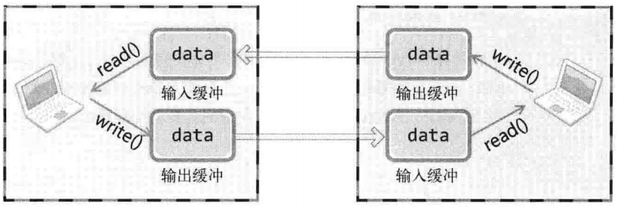
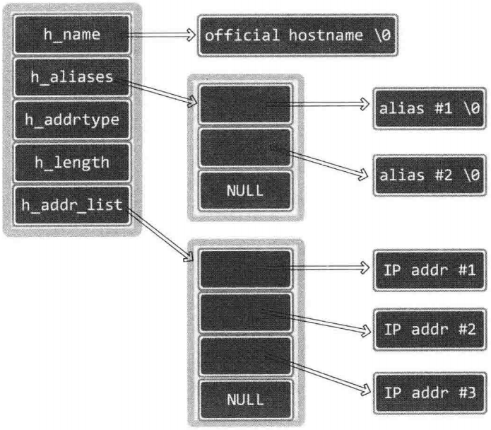

# TCP/IP网络编程（尹圣雨）

## 1、理解网络编程和套接字
### 函数原型
```
#inlcude <sys/socket.h>
int socket(int domain, int type, int protocol);                        // 成功返回文件描述符，失败返回-1
int bind(int sockfd, struct sockaddr *myaddr, socklen_t addrlen);      // 成功返回0，失败返回-1
int listen(int socktd, int backlog);                                   // 成功返回0，失败返回-1
int accept(int sockfd, struct sockaddr *addr, socklen_t *addrlen);     // 成功返回文件描述符，失败返回-1
int connect(int sockfd, struct sockadd *serv_addr, socklen_t addrlen); // 成功返回文件描述符，失败返回-1
```
### 基于Linux的文件操作
- 打开文件
  ```
  #inlcude <sys/types.h>
  #include <sys/stat.h>
  #include <fcntl.h>
  int open(const char *path, int flag);  // 成功时返回文件描述符，失败时返回-1
  ```
  |打开模式|含义|
  |:-:|:-:|
  |O_CREAT|必要时创建文件|
  |O_TRUNC|删除全部现有数据|
  |O_APPEND|维持现有数据、末尾添加|
  |O_RDONLY|只读打开|
  |O_WRONLY|只写打开|
  |O_RDWR|读写打开|
- 关闭文件
  ```
  #include <unistd.h>
  int close(int fd);    // 成功返回0,失败返回-1
  ```
- 将数据写入文件
  ```
  #include <unistd.h>
  ssize_t write(int fd, const void *buf, size_t nbytes); // 成功时返回写入的字节数，失败时返回-1
  ```
- 读取文件中的数据
  ```
  #include <unistd.h>
  ssize_t read(int fd, void *buf, size_t nbytes); // 成功时返回读取的字节数（但是遇到文件结尾则返回0），失败返回-1
  ```
## 2、套接字类型与协议设置
### 套接字协议及其数据传输特性
```
#include <sys/socket.h>
/* @param
 * domain：套接字使用的协议族（Protocol Family）信息
 * type：套接字数据传输类型
 * protocol：计算机间通信中使用的协议信息
 * return：成功时返回文件描述符，失败时返回-1
 */
int socket(int domain, int type, int protocol);
```
- 协议族（Protocol Family）

  |名称|协议族|
  |:-|:-|
  |PF_INET|IPv4互联网协议族|
  |PF_INET6|IPv6互联网协议族|
  |PF_LOCAL|本地通信的UNIX协议族
  |PF_PACKET|底层套接字的协议族|
  |PF_IPX|IPX Novel协议族|
- 套接字类型
  - 面向连接的套接字（SOCK_STREAM）
    - 可靠传输
    - 按序传输
    - 传输的数据没有边界（发送端多次发送，接受端可以一次接收）
  - 面向消息的套接字（SOCK_DGRAM）
    - 强调快速传输而非传输顺序
    - 不可靠
    - 传输的数据有边界（发送端N发送，接受端N次接收）
    - 限制每次传输的数据大小
## 3、地址族与数据序列
### 地址信息的表示
```
struct sockaddr_in {          // IPv4地址信息
  sa_family_t    sin_family;  // Protocol Family
  uint16_t       sin_prot;    // 端口号
  struct in_addr sin_addr;    // 32位IP地址
  char           sin_zero[8]; // 不使用
};
struct in_addr {
  In_addr_t      s_addr;      // 32为IPv4地址
};

struct sockaddr {
  sa_family      sin_family;  // Protocol Family
  char           sa_data[14]; // IP+port，剩余部分填充0
};
```
### 网络字节序与地址转换
- 字节序
  - 大端序：高位字节存放在低位地址
  - 小端序：高位字节存放在高位地址（intel默认）
- 网络字节序
  - 大端序排列方式
- 字节序转换
  ```
  unsigned short htons(unsigned short); // host-to-network
  unsigned short ntohs(unsigned short); // network-to-host
  unsigned long htonl(unsigned long);
  unsigned long ntohl(unsigned long);
  ```
### 网络地址的初始化与分配
```
#include <arpa/inet.h>
// 成功时返回32位大端序整数型值，失败时返回INADDR_NONE
in_addr_t inet_addr(const char *string);  // 127.0.0.1 ==> 0x100007f (大端序)

// 成功时返回1,识别示返回0
int inet_aton(const char *string, struct in_addr *addr);
```
## 4、基于TCP的服务端/客户端
### TCP套接字的IO缓冲
调用`write`函数时，将数据移至输出缓冲，在适当的时候（不管是分别传送还是一次性传送）传向对发的输入缓冲。调用`read`函数时，从输入缓冲读取数据

- IO缓冲在每个TCP套接字中单独存在
- IO缓冲在创建套接字时自动生成
- 即使关闭套接字也会继续传递输出缓冲中遗留的数据
- 关闭套接字将丢失输入缓冲中的数据

## 5、基于UDP的服务端/客户端
### UDP中的服务端和客户端没有连接
### UDP服务端和客户端均只需1个套接字
### 基于UDP的数据IO函数
  ```
  #include <sys/socket.h>
  /* @param
   * sockfd：用于传输数据的UDP套接字文件描述符
   * buff：待传输数据的缓冲地址
   * nbytes：待传输数据的字节数
   * flags：可选参数，没有则传递0
   * to：目的地址
   * addrlen：长度
   * return：成功时返回传输的字节数，失败时返回-1
   */
  ssize_t sendto(int             sockfd, 
                 void            *buff, 
                 size_t          nbytes, 
                 int             flags, 
                 struct sockaddr *to, 
                 socklen_t       addrlen);
  
  /* @param
   * sockfd：用于接收数据的UDP套接字文件描述符
   * buff：保持接收数据的缓冲地址
   * nbytes：可接收的最大字节数
   * flags：可选参数，没有则传递0
   * from：保存源地址
   * addrlen：保存长度
   * return：成功时返回接受的字节数，失败时返回-1
   */
  ssize_t recvfrom(int             sockfd, 
                   void            *buff, 
                   size_t          nbytes, 
                   int             flags, 
                   struct sockaddr *to, 
                   socklen_t       addrlen);
  ```
### UDP客户端套接字的地址分配
可以调用`bind`函数显式绑定，如果没有显式分配，调用`sendto`函数时自动分配IP和端口号
### 存在数据边界的UDP套接字
UDP是具有数据边界的协议，传输中调用IO函数的次数非常重要，输入函数的调用次数应和输出函数的调用次数完全一致
### 已连接（connected）UDP套接字与未连接（unconnected）UDP套接字
- `sendto`函数传输数据的过程
  - S1：向UDP套接字注册目标IP和端口号
  - S2：传输数据
  - S3：删除UDP套接字中注册的目标地址信息
- 创建已连接UDP套接字
  ```
  sock = socket(PF_INET, SOCK_DGRAM, 0);
  memset(&addr, 0, sizeof(addr));
  addr.sin_family = AF_INET;
  addr.sin_addr.s_addr = ...
  addr.sin_port = ...
  connect(sock, (struct sockaddr*)&addr, sizeof(addr));
  ```
  UDP套接字调用connect函数并不是要与对方建立连接，只是向UDP套接字注册目标IP和端口信息。之后每次调用`sendto`函数只需要传输数据。也可以用`write`和`read`处理数据。

## 6、优雅地断开套接字连接
### 单方面断开连接带来的问题
Linux的`close`函数意味着完全端口连接。完全断开连接不仅无法传输数据，而且也不能接收数据
### 半关闭`shutdown`函数
```
#include <sys/socket.h>
/* @param
 * sock：需要断开的套接字文件描述符
 * howto：传递断开方式信息
 *        SHUT_RD：断开输入流
 *        SHUT_WR：断开输出流
 *        SHUT_RDWR：同时断开输入输出流
 */
int shudown(int sock, int howto);
```
### 为何需要半关闭
发送`EOF`表示一方传输数据完毕
### 实例
file_server.c file_client.c

## 7、域名及网络地址
### DNS服务器
对IP地址和域名进行相互转换
### 域名的必要性
系统运行时，保持IP地址不变并不容易
### 利用域名获取IP地址
```
#include <netdb.h>
struct hosten *gethostbyname(const char *hostname); // 成功时返回hosten结构体地址，失败时返回NULL指针

struct hostent {
  char *h_name;      // official name
  char **h_aliases;  // alias list
  int  h_addrtype;   // host address type
  int  h_length;     // address length
  char **h_addr_list // address list
};
```


- h_name：官方域名
- h_aliases：绑定到同一地址的多个域名
- h_addrtype：IP地址类型IPv4还是IPv6（AF_INEThuoAF_INET6）
- h_length：IP地址长度
- h_addr_list：以整数形式保持域名对应的IP地址
  ```
  #include <arpa/inet.h>
  // 将整数形式IP转换为点分十进制格式的字符串
  char *inet_ntoa(struct in_addr addr) // 成功时返回转换的字符串地址值，失败时返回-1
  ```
### 利用IP地址获取域名
```
#include <netdb.h>
/*@param
 * addr：含有IP地址信息的in_addr结构体指针
 * len：指向第一个参数传递的地址信息的字节数，IPv4时为4，IPv6时为16
 * family：传递地址族信息，IPv4时为AF_INET，IPv6时为AF_INET6
 * return：成功时返回hostent结构体变量地址值，失败时返回NULL指针
 */
struct hostent *gethostbyaddr(const char *addr, socklen_t len, int family);
```

## 8、套接字的多种可选项
### 套接字多种可选项
`sock_type.c`
```
#include <sys/socket.h>
/*@ param
 * sock：用于查看选项套接字文件描述符
 * level：要查看的可选项的协议层
 * optname：要查看的可选名
 * optval：保存查看结果的缓冲地址值
 * optlen：缓冲字节数
 * return：成功时返回0,失败时返回-1
 */
int getsockopt(int sock, int level, int optname, void *optval, socklen_t *optlen);

/*@ param
 * sock：用于更改选项套接字文件描述符
 * level：要更改的可选项的协议层
 * optname：要更改的可选名
 * optval：保存要更改结果的缓冲地址值
 * optlen：缓冲字节数
 * return：成功时返回0,失败时返回-1
 */
int setsockopt(int sock, int level, int optname, const void *optval, socklen_t optlen);
```
### SO_SNDBUF & SO_RCVBUF
SO_SNDBUF是输入缓冲大小相关可选项，SO_RCVBUF是输出缓冲大小相关可选项。用这两个可选项既可以读取当前IO缓冲大小，也可以进行更改（`get_buf.c, set_buf.c`）。
### SO_REUSEADDR
