# TCP/IP协议

## 以太网帧
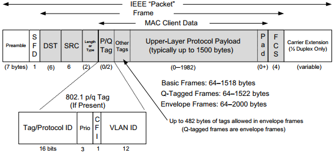

以太网基本的帧格式包括48位（6字节）的目的地址（DST）和源地址（SRC）字段。以太网的目的地址也允许寻址到多个站点（称为广播或组播），广播功能用于ARP协议，组播功能用于ICMPv6协议，以实现网络层地址和链路层地址之间的转换。

源地址后面紧跟着一个16位类型字段或长度字段。在多数情况下，它用于确定头部后面的数据类型，以及选择处理它的网络层协议。TCP/IP网络使用的常见值包括IPv4（0x0800）、IPv6（0x86DD）和ARP（0x0806）。以太网帧的数据或有效载荷部分，存放高层PDU。

以太网帧有最小和最大尺寸。最小的帧是64字节，要求数据区长度（无标签）最小为48字节（64-18），当有效载荷较小时，填充字节（值为零）被添加到有效载荷尾部，以确保达到最小长度。以太网最大帧长度是1518字节（包括4字节CRC个14字节头部）。

## IP协议
IP协议提供了一种尽力而为、无连接的数据报交付服务，不保证IP数据报能成功到达目的地，每个数据报独立于其他数据报来处理，不保证按顺序交付。

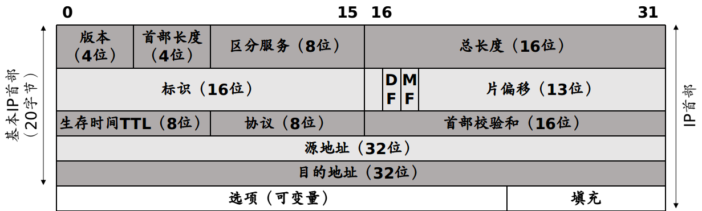

Inetnet首部长度（IHL）保存IPv4首部（包括选项）中32位字的数量。头部校验和仅计算TPv4首部，IP协议不检查IPv4数据报有效载荷（TCP或UDP数据）的正确性。为了确保IP数据报的有效载荷部分已正确传输，其他协议必须通过自己的数据完整性检验机制检查重要的数据。我们看到封装在IP中的几乎所有协议（ICMP、IGMP、UDP和TCP）在自己首部都有一个涵盖其头部和数据的校验和。8位IPv4协议字段，以决定接下来调用那个协议来处理。常见的值包括1（ICMP）、2（IGMP）、4（IPv4）、6（TCP）和17（UDP）。

## 地址解析协议（Address Resolution Protocol, ARP）
ARP提供从IP地址到MAC地址的映射，是为了解决同一个局域网上的主机或路由器的IP地址和MAC地址的映射问题。ARP协议工作在网络层。

如果要找的目的主机和源主机不在同一个局域网，那么就要通过ARP协议找到一个位于本局域网上的某个路由器的MAC地址，然后把分组发送给这个路由器，让这个路由器把分组转发到下一个网络，剩下的工作就由下一个网络来做。

如果目的主机B和源主机A在同一个局域网上，主机A欲向主机B发送IP数据报，主机A就在其ARP高速缓存中查看有无主机B的IP地址，如果有，就查出其对应的MAC地址，将其填入MAC帧的目的地址中，然后通过局域网将该MAC帧发往此硬件地址。如果没有，就通过使用目的MAC地址为0xFF-FF-FF-FF-FF-FF的帧来封装并广播ARP请求分组，可以使同一个局域网里的所有主机收到ARP请求。但只有主机B在收到ARP请求后会发出响应，响应中包含主机B的IP地址与MAC地址的映射。主机A在收到响应后将映射写入ARP缓冲中，然后按查询到的硬件地址发送MAC帧。

## UDP
UDP是一种保留消息边界的简单的面向数据报的传输层协议。它不提供差错纠正、队列管理、重复消除、流量控制和拥塞控制。但提供差错检测（首部和数据的校验和）。

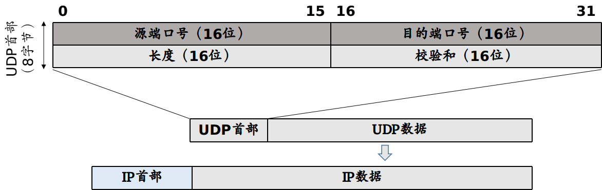

## 广播和本地组播
广播和组播为应用程序提供了两种服务：数据分组交付至多个目的地，通过客户端请求/发现服务器。使用广播或组播，应用程序可以将信息交付至多个收件方，或可以向一个服务器发送一个请求，而不用知道任何特定服务器的IP地址（例如DHCP）。

广播是指将报文发送到网络中所有的可能接受者。在原理上，路由器简单地将它接收到的任意报文副本转离除报文到达的接口以外的每个接口。当有多个主机连接到同一个本地局域网，使用链路层广播将分组送达每个主机。IP广播地址是除了网络地址外，其余主机地址全部为1。例如希望向网络地址192.12.34中的主机传输数据时，广播地址为192.12.34.255。另外本地广播使用的IP地址限定为255.255.255.255，表示向本地网络的所有主机发送数据。MAC广播地址0xFF-FF-FF-FF-FF-FF。一般来说，使用广播的应用程序使用UDP协议（或ICMP协议），打开套接字的`SO_BROADCAST`选项。

组播（多播）技术有效地解决了单点发送、多点接收的问题。组播源只发送一份数据，被传递的信息在距组播源尽可能远的网络节点才开始被复制和分发，并且只发送给需要该信息的接收者。组播只向那些对它感兴趣的接收方发送流量。实现组播比广播更具挑战性，因为组播状态必须由主机和路由器来保持，以说明那些接收方对哪类流量有兴趣。在组播TCP/IP模型中，接收方通过指明组播地址（通过设置套接字选项加入`IP_ADD_MEMBERSHIP`或离开`IP_DROP_MEMBERSHIP`）和可选源列表来表明它们希望接收的流量。这个信息作为主机和路由器的软状态来维持，它必须定期更新或超时删除。

为了在链路层网络中有效地承载IP组播，IP层的分组和链路层的帧应该有一个一对一的映射。IANA拥有的以太网组播地址的范围是从0x01-00-5E-00-00-00到0x01-00-5E-7F-FF-FF，每个地址中只有23位可用于组播。这只能和D类IP地址中的23位有一一对应关系。由于组播IP地址与以太网硬件地址的映射关系不是唯一的，因此收到组播数据报的主机，还要在IP层利用软件进行过滤（在网络接口卡NIC上发生，只接收发往本网卡的帧、广播的帧和本主机加入的多播组的帧），把不是本主机要接受的数据报丢弃。

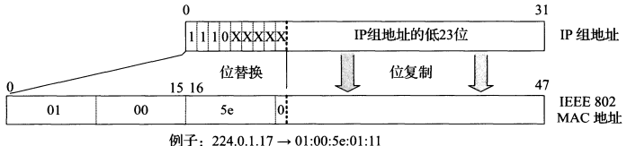

为了使路由器知道组播组成员的信息，需要利用IGMP（Inernet Group Management Protocol），让连接在本地局域网上的组播路由器知道本局域网上是否有主机参加或退出了某个组播组。主机每加入或离开一个多播组，就发送一个IGMP报文。

## TCP协议
TCP提供一种面向连接的、可靠的字节流服务。使用TCP的两个应用程序必须在他们可交换数据之前，通过相互联系建立一个TCP连接。此外，TCP的字节流服务，表示没有由TCP自动插入的记录标签或消息边界。

### TCP头部

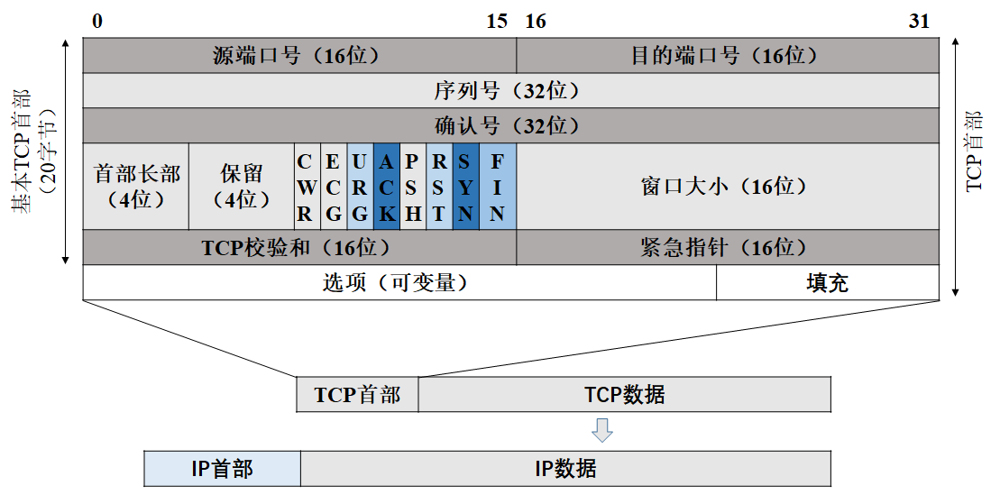

### TCP连接建立（三次握手）

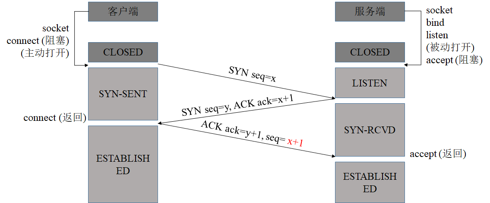

1. `CLOSED`：起始点，在超时或者连接关闭进入此状态。这并不是一个真正的状态，而是一个假想起点和终点
2. `LISTEN`：服务器端等待连接的状态。服务器依次调用`socket`、`bind`、`listen`函数之后进入此状态，开始监听客户端发过来的连接请求。此称为被动打开（等待客户端的连接请求）
3. `SYN-SENT`：第一次握手发生阶段，客户端主动打开，发起连接。客户端调用`connet`函数，发送`SYN`分节给服务器，指明对方端口号和自己的初始序列号和最大段大小，然后进入`SYN_SENT`状态，等待服务器端确认（三次握手的第二个报文）。如果服务器不能连接，则进入`CLOSED`状态。TCP规定，`SYN`报文段不能携带数据，但需要消耗掉一个序号。
4. `SYN-RCVD`：第二次握手发送阶段，服务器接收到了客户端的`SYN`分节，此时服务器进入`SYN_RCVD`状态。服务器发送一个`ACK`对收到客户端的`SYN`分节进行确认，同时发送一个`SYN`分节，告诉客户端自己的初始序列号和最大段大小。这个报文也不能携带数据，但是同样要消耗一个序号。
5. `ESTABLISHED`：第三次握手发生阶段，客户端发送一个`ACK`分节对收到服务器的`SYN`进行确认，客户端进入`ESTABLISHED`状态，表明客户端这边以准备好。服务器收到客户端的`ACK`之后进入`ESTABLISHED`状态，表明服务端也准备好，双方可以通信。TCP规定，`ACK`报文段可以携带数据，但是如果不携带数据则不消耗序号。

### TCP连接释放（四次挥手）

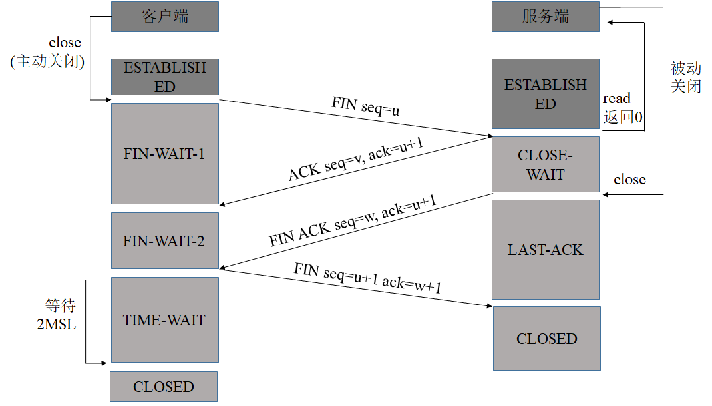

1. `FIN_WAIT_1`：第一次挥手。客户端应用进程首先调用`close`，称该端执行主动关闭。发送`FIN`分节，表示数据发送完毕，终止连接，然后等待对方确认，进入`FIN_WAIT_1`状态。TCP规定，`FIN`分节即使不携带数据，也要消耗一个序号。
2. `CLOSE_WAIT`：第二次挥手。收到这个`FIN`的服务器执行被动关闭，发送`ACK`对收到`FIN`进行确认。`FIN`接收也作为一个文件结束符`EOF`传递给高层的应用进程，表示客户端到服务器的连接释放了。此时进入`CLOSE_WAIT`状态。
3. `FIN_WAIT_2`：执行主动关闭的客户端收到服务端的`ACK`分节，进入此状态，等待服务器发送`FIN`，释放连接。
4. `LAST_ACK`：第三次握手，被动方（服务器端）发送`FIN`分节，释放连接，等待客户端确认，服务器端进入`LAST_ACK`状态。
5. `TIME_WAIT`：第四次握手，客户端发送`ACK`对收到`FIN`进行确认，进入`TIME_WAIT`状态。此时`TCP`连接还没有释放，必须经过2*`MSL`（最长报文寿命）的时间后，才进入`CLOSED`状态。
6. `CLOSED`：服务器端收到`ACK`后进入`CLOSED`状态，客户端再等待2*`MSL`时间后（期间没有收到服务器的超时重传报文）进入`CLOSED`状态

### TCP连接建立和释放疑难点

1. 初始序列号有什么特殊的要求
   - 初始序列号可被视为一个32位的计数器，该计数器的数值每4微秒加1，此举的目的在于为不同连接分配不同初始序列号，尤其是为同一个连接的两个不同实例分配不同的初始序列号。因为一个TCP连接是被一对套接字所唯一表示，其中包括由两个IP地址和两个端口号构成的4元组，因此即使是同一个连接也会出现不同的实例。
2. `SYN`分节是否消耗序列号，`FIN`和ACK分节呢，为什么？
   - `FIN`和`SYN`消耗一个序列号，为了保证可靠传输。`ACK`不消耗序列号
3. 为什么会有最后一次确认？两次握手不行吗？
   - 最后一次握手是为了防止前两次握手已失效的连接请求突然又传到服务端，而产生错误。考虑两次握手下面这种情况：客户端向服务器发出TCP连接请求，第一个`SYN`分节在网络的某个结点长时间滞留，客户端超时后认为报文丢失，于是再重传`SYN`分节，服务器收到后建立连接。数据传输完毕后双方断开连接。而此时前一个滞留在网络中的`SYN`到达服务器，服务器认为客户端又发送连接请求，服务端向客户端返回确认报文，服务器和客户端再次建立连接。服务器一直等待客户端传输数据，而此时客户端并没有连接请求，这导致不必要的错误和资源浪费。若采用三次握手，客户端不理会服务端的确认，服务器收不到客户端的确认，建立连接失败。
4. 为什么不采用三次挥手释放连接，且最后发送最后一次挥手后要等待2MSL的时间呢？
   - 第一为了保证最后一个`ACK`能够到达B。最后一个`ACK`分节可能丢失，如果客户端不等待2MSL，可能的结果是服务器超时重传`FIN`分节，而此时客户端已经关闭，不能发送`ACK`确认，服务器不能正常释放连接。若客户端等待了2MSL，客户端收到FIN后发送`ACK`，并且重启计时器，再次等待2MSL。
   - 第二，防止类似“已经失效的连接请求报文段”出现在本连接中。客户端发送完最后一个确认报文后，在这个2MSL时间中，就可以使本连接持续的时间内所产生的所有报文段都从网络中消失。这样新的连接中不会出现旧连接的请求报文。
5. 为什么建立连接是三次握手，关闭连接确是四次挥手呢？
   - 建立连接的时候， 服务器在`LISTEN`状态下，收到建立连接请求的`SYN`报文后，把`ACK`和`SYN`放在一个报文里发送给客户端。而关闭连接时，服务器收到对方的`FIN`报文时，仅仅表示对方不再发送数据了但是还能接收数据，而自己也未必全部数据都发送给对方了，所以己方可以立即关闭，也可以发送一些数据给对方后，再发送FIN报文给对方来表示同意现在关闭连接，因此，己方`ACK`和`FIN`一般都会分开发送，从而导致多了一次
6. 如果已经建立了连接，但是客户端突然出现故障了怎么办？
   - TCP还设有一个保活计时器，显然，客户端如果出现故障，服务器不能一直等下去，白白浪费资源。服务器每收到一次客户端的请求后都会重新复位这个计时器，时间通常是设置为2小时，若两小时还没有收到客户端的任何数据，服务器就会发送一个探测报文段，以后每隔75秒发送一次。若一连发送10个探测报文仍然没反应，服务器就认为客户端出了故障，接着就关闭连接。

### TCP可靠传输

TCP使用了校验和、序号、确认和重传等机制实现可靠传输

#### 校验和
TCP首部的校验和是首部和数据的校验和

#### 序号

TCP首部的序号字段用来保证数据能有序地提交给应用进程，TCP把数据看成一个无结构但是有序的字节流，而序号是建立在传送的字节流之上的。TCP连接中传送的数据流中的每个字节都编上一个序号。序号字段的值则指本分节所发送的数据的第一个字节的序号。

#### 确认

TCP首部的确认号是期望收到对方的下一个分节的数据的第一个字节的序号。发送方缓存会继续存储那些已经发送但未收到确认的数据，以便在需要的时候（超时）重传。TCP默认使用累计确认，累积确认可以允许TCP延迟一段时间发送`ACK`，以便将`ACK`和相同方向上需要传的数据结合发送。

#### 重传

TCP拥有两套独立机制来完成重传，一是基于时间，而是基于冗余`ACK`。TCP在发送数据时会设置一个计时器，若计时器超时仍未收到数据确认，则会引发超时重传。另一种方式的重传成为快速重传，若累计确认无法返回新的`ACK`，快速重传会推断出现丢包。当TCP超时重传，它并不需要完全重传相同的分节，TCP允许执行重新组包，发送一个更大的分节来提高性能。

##### 超时重传

TCP每发送一组报文段时，它通常设置一个重传计时器，等待对方的确认接收。TCP不会为每个报文段设置一个不同的重传计时器，相反，发送一个窗口的数据，它只设置一个计时器。标准方法通过记录往返时间(Round-Trip Time, RTT)测量值的变化情况以及均值来得到较为准确的估计值，基于均值和估计值的变化来设置超时重传时间(Retransmission Time-Out, RTO)。考虑到效率等问题，用过平均偏差近似标准差。对每个RTT测量值M，进行如下运算：
```
srtt = (1 - g) * srtt + g * M
rttvar := (1 - h) * rttvar + h * |M - srtt|
RTO = srtt + 4 * rttvar
```
其中g取为1/8，h取为1/4。RTO的初始值为1s，而初始SYN分节采用的超时间隔为3s。当接收到收割RTT测量结果M，估计值按如下方法进行初始化：
```
srtt = M
rttvar = M / 2;
```
一旦TCP发送端得到了基于时间变化的RTT测量值，就能根据此设置RTO，发送分节时应确保重传计时器设置合理。在设定计时器前，需记录被即使的分节的序号，若及时收到了该分节的`ACK`，那么计时器被取消。若在设定的RTO内，TCP没有收到被计时分节的`ACK`，将会触发超时重传。当发生这种情况时，TCP通过降低当前数据发送速率来对此进行快速响应。它有两种方法：一是基于拥塞控制机制减小发送窗口大小；另一种是每当一个重传分节被再次重传时，则增大RTO的退避因子。特别地当同一个分节出现多次重传时，RTO暂时乘上y来形成新的超时退避值：`RTO = y * RTO`。在通常情况下，y值为1。随着多次重传，y加倍增长：2，4，8等等。

##### 快速重传（冗余`ACK`）

快速重传机制基于接收端的反馈信息来引发重传，能更加及时有效地修复丢包情况。TCP规定每当收到失序分节时（收到比期望序号大的分节）时，立即生成确认信息（重复`ACK`），不能延时发送，及时告知发送端有失序分节并告诉其空缺在哪。失序现象表明在后续数据到达前出现了丢包，发送端应尽快地、高效地填补该空缺。TCP标准规定当发送方收到同一个报文的3个冗余`ACK`时触发快速重传，而不必等到重传计时器超时。当然也可以同时发送新的数据。

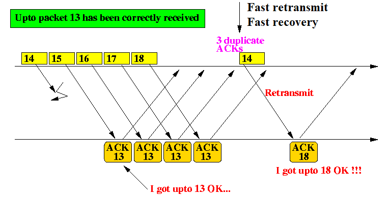

### TCP流量控制

#### 延迟`ACK`

TCP并不对每个到来的分节都返回`ACK`。累计确认可以允许TCP延迟一段时间发送`ACK`，如果这段时间内有数据发送到对端，则捎带发送`ACK`，如果在`ACK`定时器触发时候，发现`ACK`尚未发送，则立即单独发送；

延迟`ACK`好处：

- 避免糊涂窗口综合症；
- 发送数据的时候将`ACK`捎带发送，不必单独发送`ACK`；
- 如果延迟时间内有多个数据段到达，那么允许协议栈发送一个`ACK`确认多个报文段；

#### Nagle算法

该算法要求，当一个TCP连接中有带确认数据，小的分节（长度小于MSS）就不能发送，直到所有的待确认数据都收到`ACK`。并且在收到`ACK`后，TCP需要收集这些小分节，将其整合到一个分节发送。该算法的优越之处在于它是自适应的，`ACK`返回越快，数据也就发送的越快；在相对高时延的广域网中，更需要减少微小分节的数目，该算使得单位时间内发送的分节数目更少。也就是说，RTT控制着发送速率。

#### 滑动窗口

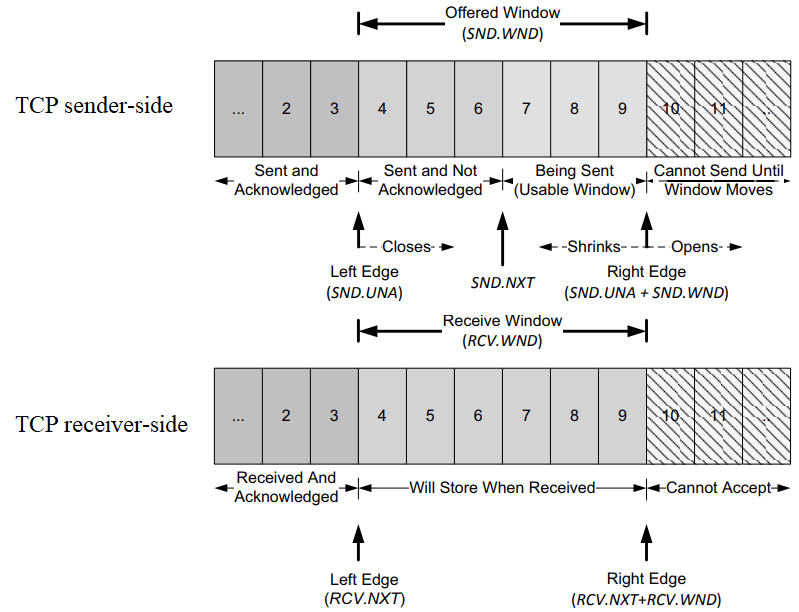

TCP以字节为单位维护其窗口结构。由接收端通告的窗口成为提供窗口。窗口大小字段是相对于`ACK`号的字节偏移量。发送端计算其可用窗口，即它可以立即发送的数据量。可用窗口计算值为提供窗口大小减去在传（已发送但未得到确认）的数值。窗口左边界不能左移，因为它控制的是已确认的`ACK`号，具有累计性，不能返回。在通信的过程中，接收方根据自己接受缓存的大小，动态地调整发送方的提供窗口大小，同时发送方根据其对当前网络拥塞程度的估计确认拥塞窗口大小，最后发送端的是提供窗口大小和拥塞窗口大小的最小值。当提供窗口大小为零，成为零窗口，此时发送端不能再发送新数据。这种情况下，TCP发送端开始探测对方窗口大小。

### TCP拥塞控制

#### 流量控制和拥塞控制

流量控制的目的是消除发送方使接收方缓冲区发生溢出的可能性，是点对点的控制。接收方会根据自己接收缓冲区的大小，动态地调整发送方的发送窗口的大小。它是基于ACK分节中的窗口大小字段来实现的。拥塞控制目的是防止过多的数据注入网络中，造成路由器无法处理高速到达的流量而被迫丢弃数据信息（拥塞），是一个全局性的过程，涉及所有主机、路由器等。两者也有相似的地方，都是通过控制发送方发送数据的速率来达到效果的。

#### 慢启动算法

当一个新的TCP连接建立或发生超时重传的丢包，需要启动慢启动，或者发送端长时间处于空闲状态，也可能启动慢启动。慢启动的目的是：在TCP用拥塞避免算法探寻更多可用带宽之前，得到拥塞窗口（congeston window）大小。以帮助TCP建立`ACK`时钟。通常，TCP在建立新连接时执行慢启动，直至有丢包时，执行拥塞避免算法，进入稳定状态。

在TCP刚刚建立好，开始发送TCP分节时，先令拥塞窗口cwnd=1，即一个最大段大小MSS。而在每收到一个对新的分节的确认后，将cwnd加1，即增大一个MSS。用这样的方法逐步增大发送方的拥塞窗口，可使分节注入网络的速率更加合理。一般情况下，如果成功收到相应的新的`ACK`，cwnd呈指数增长。

#### 拥塞避免

在慢启动阶段，cwnd会快速增长，一旦达到阈值（慢启动阈值，ssthresh），就意味着可能有更多可用的传输资源。但是如果立即全部占用这些资源，将会使共享路由器队列的其他连接出现严重的丢包和重传情况，从而导致整个网络性能不稳定。为了得到更多的传输资源且不至于影响其他连接的传输，改用拥塞避免算法。

拥塞避免算法的做法是：发送端的拥塞窗口cwnd每经过一个往返时延RTT就增加一个MSS的大小，而不是加倍，使cwnd按线性规律缓慢增长（即加法增大），而当出现一次超时（网络拥塞）时，令慢启动门限ssthresh等于当前cwnd的一半（即乘法减小）但不能小于2。

#### 网络拥塞的处理

无论在慢启动阶段还是拥塞避免阶段，只要发送方检测到超时事件的发生，就表明网络出现拥塞，就要把慢启动门限ssthresh设置为当前cwnd的一半（但不能小于2），然后就把拥塞窗口cwnd重新设置为1，执行慢启动算法。这样做的目的是：快速减少主机发送到网络中的数据，使得发生拥塞的路由器有足够时间把队列积压的分组处理完毕。

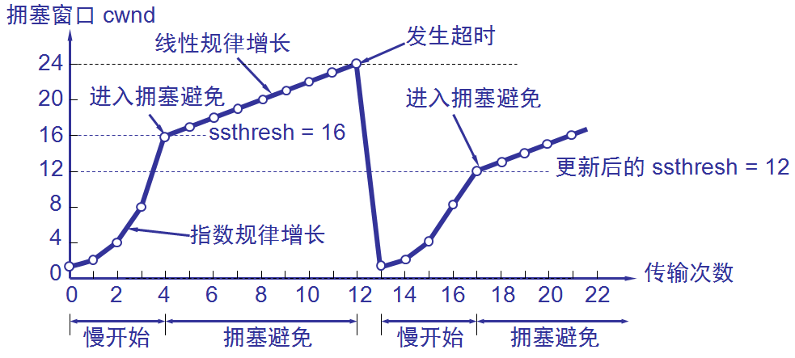

#### 快重传和快恢复

快重传和快恢复算法是对慢启动和拥塞避免算法的改进

##### 快重传

冗余`ACK`也用于网络拥塞的检测（丢包意味着网络可能出现了拥塞），快重传并非取消重传计时器，而是当发送方连续收到三个重复的`ACK`报文时，直接重传对方尚未收到的分节，而不必等待那个分节设置的重传计时器超时。

##### 快恢复（Reno版本）

快恢复算法原理：当发送端收到连续三个冗余`ACK`时，就执行“乘法减小”算法，把慢启动门限ssthresh设置为出现拥塞时发送方cwnd的一半，并且将cwnd设置为新的ssthresh值，然后开始执行拥塞避免算法（“加法增大”），使拥塞窗口缓慢地线性增大。

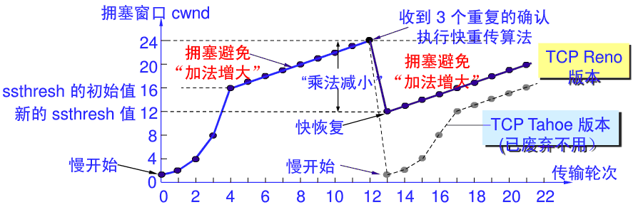

## 动态主机配置协议（Dynamic Host Configuration Protocol, DHCP）
为了使用TCP/IP协议族，每台主机和路由器需要一定的配置信息，比如本地IP地址、子网掩码、路由器的IP地址、DNS服务器的IP地址等。DHCP是一种流行的客户机/服务器协议，用于为主机（有时也为路由器）指定配置信息。

DHCP由两个主要部分组成：地址管理和配置数据交付。地址管理用于IP地址的动态分配，并为客户机提供地址租用；配置数据交付包括DHCP协议的消息格式和状态机。DHCP服务器可配置为提供三种地址分配：自动分配、动态分配和手动分配。

当一台新的客户机连接到网络时，它首先发现可用的DHCP服务器地址，以及它们能提供的地址。然后，它决定使用哪台服务器和哪个地址，并向提供该地址的服务器发送请求（同时将其选择通知所有服务器）。除非服务器在此期间将地址分配出去，否则它通过确认将地址分配给请求的客户机。

一次典型的DHCP交换过程如下：
1. 客户机首先（用UDP）广播一个`DHCPDISCOVER`消息，试图找到网络中的DHCP服务器。
2. 对于接受到请求的每台服务器，无论直接接受还是通过中继代理，他们都会响应一个`DHCPOFFER`消息，并在“你的”IP地址字段中填入提供的IP地址。其他配置选项（例如DNS服务器的IP地址、子网掩码）也经常包括在内。
3. 客户机接收到来自一台或多台服务器的`DHCPOFFER`消息后，客户机确定自己想接受哪个`DHCPOFFER`，并（UDP）广播一个播服务器标识（服务器IP地址）选项的`DHCPREQUEST`消息。请求的IP地址选项设置为由选中的`DHCPOFFER`消息提供的地址。
4. 多台服务器可能接收到（UDP）广播的`DHCPREQUEST`消息，但只有`DHCPREQUEST`消息中表示的服务器同一将该地址进行绑定；其他服务器清除与该请求相关的状态。在完成绑定后，选中的服务器响应一个`DHCPACK`消息，通知客户机现在可使用该地址。如果无法分配，该服务器将会响应一个`DHCPNAK`消息。
5. 当客户机接收到`DHCPACK`消息和其他相关的配置信息时，它可以探测网络以确保获得的地址未被使用。如果客户机确定该地址已被使用，就不使用该地址，并向服务器发送一个`SHCPDECLINE`消息，通知该地址不能使用。在经过默认10秒后，客户机可重试。

## 网际控制报文协议（Internet Control Message Protocol, ICMP）
IP协议本身并没有为终端系统提供直接的方法来发现那些发往目的地址失败的IP数据分组，也没有提供直接的方式来获取诊断的信息。为了解决这些不足之处，将一个特殊的ICMP与IP结合使用，以便提供与IP协议层配置和IP数据分组相关的诊断和控制信息。ICMP通常被认为是IP层本身的一部分，并且它必须与IP实现结合，使用IP协议进行传递。因此，它确实既不是网络也不是传输协议，而是位于两者之间。在IPv4中，协议字段为1表示该分组携带类ICMPv4。

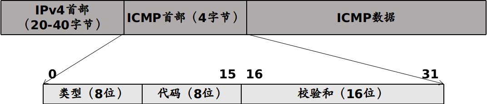

常用ICMP报文类型（E表示差错报文，I表示信息或查询报文）

| 类型 | 正式名称   |  E/I  | 用途/注释                        |
| :--- | :--------- | :---: | :------------------------------- |
| 0    | 回显应答   |   I   | 回显ping应答，返回数据           |
| 3    | 目的不可达 |   E   | 不可达的主机/协议                |
| 4    | 源端抑制   |   E   | 表示拥塞（启用）                 |
| 5    | 重定向     |   E   | 表示下次应该将数据发送另外的路由 |
| 8    | 回显       |   I   | 回显ping请求（数据可选）         |
| 9    | 路由器通告 |   I   | 指示路由器地址/优先级            |
| 10   | 路由器请求 |   I   | 请求路由器通告                   |
| 11   | 超时       |   E   | 资源耗尽（例如IPv4 TTL为零）     |
| 12   | 参数问题   |   E   | 有问题的数据包或者头部           |

ICMP两个常用的应用
1. ping
   - 用来测试两个主机之间的连通性，工作在应用层，直接使用ICMP（回显请求和回显应答），没有使用传输层的协议。
   - 当一个新的ping程序实例运行时，序列号字段从0开始，并且每发送一个回显请求报文，序号加1。ping打印出每个返回的数据报的序号，方便用户查看数据包是否丢失、重排或者重复。
   - ping程序也在传出的回显请求中的可选数据区域中包含了一份本地时间拷贝，这个时间包含在返回的回显应答报文中。当应答收到时，ping程序用当前时间它减去它，便得到一个RTT值
2. traceroute
   - 用来确定从发送者到目的路径经过的路由器，工作在网络层。
   - 该方法首先发送IPv4 TTL字段为1的报文，到期的数据报文促使沿途路由器发送ICMP超时报文。没一轮，发送的TTL加1，导致数据报在更远一跳的路由器处超时。

不应发送ICMP差错报告报文的几种情况
1. 对ICMP差错报文不再发送ICMP差错报告报文
2. 对一个分组的所有后续分组都不发送ICMP差错报告报文
3. 对具有组播地址的数据都不发送ICMP差错报告报文
4. 对具有特殊地址（如127.0.0.0或0.0.0.0）的数据报不发送ICMP差错报告报文

## 域名系统（Domain Name System）
DNS是一个分布式的客户机/服务器网络数据库，TCP/IP应用程序使用它来完成主机名称和IP地址之间的映射（反之依然）。当客户需要域名解析时，通过本机的DNS客户端构造一个DNS请求报文，以UDP数据报方式发往本地域名服务器。域名解析有两种方式：递归查询和递归与迭代相结合的查询，最后将结果返回给客户机。

## 文件传输协议（File Transfer Protocol, FTP）
FTP提供交互式的访问，允许勘误胡指明文件的类型与格式，并允许文件具有存取权限。它屏蔽了各计算机系统的细节，因而适用于异构网络中任意计算机之间传送文件。FTP提供以下功能：
1. 提供不同种类主机系统（硬、软件体系等都可以不同）之间的文件传输能力
2. 以用户权限管理的方式提供用户对远程FTP服务器上的文件管理能力
3. 以匿名FTP的方式提供公有文件共享的能力

FTP采用客户/服务器的工作方式，使用两个并行的TCP连接，一个是控制连接（21），一个是数据连接（20）。其工作步骤如下：
1. 服务器打开熟知端口21（控制端口），使客户进程能够连上
2. 等待客户进程发连接请求
3. 启动从属进程处理请求（建立数据连接，传送数据），主进程和从属进程并发执行。
4. 关闭连接，从属进程结束。

## 超文本传输协议（HyperText Markup Language, HTML）
HTTP规定了在浏览器和服务器之间的请求和响应的格式和规则，定义了浏览器怎么向万维网服务器请求万维网文档，以及服务器怎样把文档传送给浏览器。

HTTP的主要特点：
1. 无状态。无状态是指协议对于事务处理没有记忆能力，服务器不知道客户端是什么状态。即客户端发送HTTP请求后，服务器根据请求，会给我们发送数据，发送完后，不会记录信息。(使用 cookie 机制可以保持 session，解决无状态的问题)
2. 无连接。无连接的含义是限制每次连接只处理一个请求。服务器处理完客户的请求，并收到客户的应答后，即断开连接，采用这种方式可以节省传输时间。(当今多数服务器支持Keep-Alive功能，使用服务器支持长连接，解决无连接的问题)
3. 灵活。 HTTP 协议允许客户端和服务器端传输任意类型任意格式的数据对象
4. 简单快速。当客户端向服务器端发送请求时，只是简单的填写请求路径和请求方法即可，然后就可以通过浏览器或其他方式将该请求发送就行了

HTTP1.1的主要特点
1. 长连接。HTTP1.1增加了一个`Connection`字段，通过设置`Keep-Alive`可以保持HTTP连接不断开，避免了每次客户端与服务器请求都要重复建立释放建立TCP连接，提高了网络的利用率。如果客户端想关闭HTTP连接，可以在请求头中携带`Connection: false`来告知服务器关闭请求。
2. 支持请求管道化（pipelining）。基于HTTP1.1的长连接，使得请求管线化成为可能。管线化使得请求能够“并行”传输。HTTP管道化可以让我们把先进先出队列从客户端（请求队列）迁移到服务端（响应队列）。
3. 支持缓存处理（强缓存和协商缓存）新的字段如cache-control，支持断点传输，以及增加了Host字段（使得一个服务器能够用来创建多个Web站点）。

HTTP请求报文与响应报文格式
- 请求报文包含三部分：
  - 请求行：包含请求方法、URI、HTTP版本信息
  - 请求首部字段
  - 请求内容实体
- 响应报文包含三部分：
  - 状态行：包含HTTP版本、状态码、状态码的原因短语
  - 响应首部字段
  - 响应内容实体

HTTP请求报文中常用的方法

|  方法   | 意义                          |
| :-----: | :---------------------------- |
|   GET   | 请求读取有URL标识的信息       |
|  HEAD   | 请求读取由URL标识的信息的首部 |
|  POST   | 给服务器添加信息              |
| CONNECT | 用于代理服务器                |

GET和POST的区别

1. GET重点在从服务器上获取资源，POST重点在向服务器发送数据；
2. GET传输数据是通过URL请求，以field（字段）= value的形式，置于URL后，并用"?"连接，多个请求数据间用"&"连接，如`http://127.0.0.1/Test/login.action?name=admin&password=admin`，这个过程用户是可见的；post传输数据通过Http的post机制，将字段与对应值封存在请求实体中发送给服务器，这个过程对用户是不可见的；
3. GET传输的数据量小，因为受URL长度限制，但效率较高；POST可以传输大量数据，所以上传文件时只能用POST方式；
4. GET是不安全的，因为URL是可见的，可能会泄露私密信息，如密码等；POST较GET安全性较高；
5. GET方式只能支持ASCII字符，向服务器传的中文字符可能会乱码。POST支持标准字符集，可以正确传递中文字符。

HTTP常用状态码

|状态码|含义|
|:-:|:-|
|200|请求被正常处理|
|204|请求被受理但没有资源可以返回|
|206|客户端只是请求资源的一部分，服务器只对请求的部分资源执行GET方法，相应报文中通过Content-Range指定范围的资源|
|301|永久性重定向|
|302|临时重定向|
|303|与302状态码有相似功能，只是它希望客户端在请求一个URI的时候，能通过GET方法重定向到另一个URI上|
|304|发送附带条件的请求时，条件不满足时返回，与重定向无关|
|307|临时重定向，与302类似，只是强制要求使用POST方法|
|400|请求报文语法有误，服务器无法识别|
|401|请求需要认证|
|403|请求的对应资源禁止被访问|
|404|服务器无法找到对应资源|
|500|服务器内部错误|
|503|服务器正忙|


## 其他

常见熟知端口号

|       应用       | 应用层协议 | 端口号  | 传输层协议 |           备注           |
| :--------------: | :--------: | :-----: | :--------: | :----------------------: |
|   文件传输协议   |    FTP     |  20/21  |    TCP     |  控制连接21,数据连接20   |
|   安全外壳协议   |    SSH     |   22    |    TCP     |
|   远程终端协议   |   TELNET   |   23    |    TCP     |
| 简单邮件传送协议 |    SMTP    |   25    |    TCP     |
|     域名解析     |    DNS     |   53    |  UDP/TCP   | 长度超过512字节时使用TCP |
| 动态主机配置协议 |    DHCP    |  67/68  |    UDP     | 客户用68端口，服务器用67 |
|  超文本传送协议  |    HTTP    |   80    |    TCP     |
|   邮件读取协议   |    POP3    |   110   |    TCP     |
| 网际报网存取协议 |    IMAP    |   143   |    TCP     |
| 简单网络管理协议 |    SNMP    | 161/162 |    UDP     |


常见网络设备

|  设备  |   网络层   | 能否隔离冲突域 | 能否隔离广播域 |
| :----: | :--------: | :------------: | :------------: |
| 集线器 |   物理层   |      不能      |      不能      |
| 中继器 |   物理层   |      不能      |      不能      |
| 交换机 | 数据链路层 |       能       |      不能      |
|  网桥  | 数据链路层 |       能       |      不能      |
| 路由器 |   网络层   |       能       |       能       |