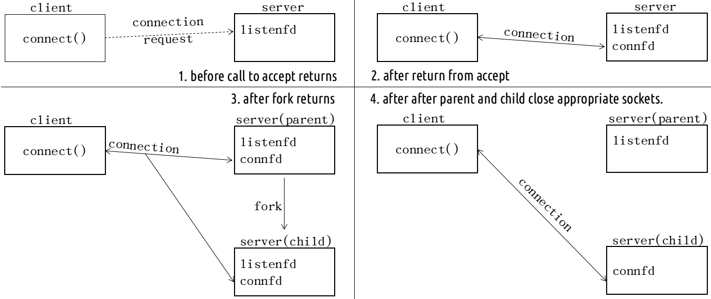
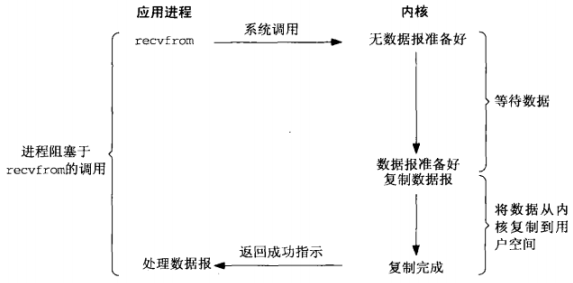
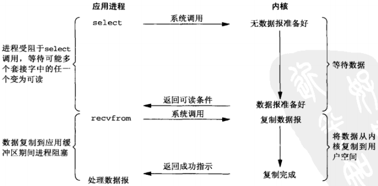
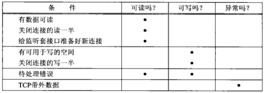

# UNIX网络编程--套接字联网

## 传输层 TCP & UDP
### UDP
- 简单的、不可靠的数据报协议
- 不保证 UDP 数据包会到达其最终目的地
- 不保证各个数据报的先后顺序跨网络后保持不变
- 不保证每个数据报只到达一次
- 数据有边界

### TCP
- 复杂的、可靠的字节流协议
- 提供客户与服务器之间的连接
- 提供了可靠性（确认与重传）
- 提供流量控制
  - 通告窗口：TCP 总是告知对端在任何时刻它一次能够从对端接收多少字节的数据。在任何时候、该窗口指出接受缓冲区中当前可用的空间量，从而确保发送端发送的数据不会使接收缓冲区溢出
- TCP 连接是全双工
  - 在一个给定的连接上应用可以在任何时刻在进出两个方向上既发送数据又接受数据

### TCP 连接的建立
1. 服务器必须准备好接受外来的连接。这通常通过依次调用 socket()、bind()、listen() 函数来完成，称之为被动打开
2. 客户通过调用 connect() 发起主动连接。这导致客户端 TCP 发送一个 SYN（同步）分节，它告诉服务器客户将在（待建立的）连接中发送的数据的初始序列号和自己最大段大小。通常 SYN 分节不携带数据，其所在 IP 数据报只有一个 IP 首部、一个 TCP 首部以及可能有的 TCP 选项
3. 服务器必须确认（ACK）客户的 SYN，同时自己也得发送一个 SYN 分节，它含有服务器将在同一连接中发送的数据的初始序列号和自己最大段大小。服务器在单个分节中发送 SYN 和对客户 SYN 的 ACK
4. 客户必须确认服务器的 SYN 分节


### TCP 连接终止
1. 某个应用进程（通常是客户端）首先调用 close()，称该端执行主动关闭。该端的 TCP 于是发送一个 FIN 分节，表示数据发送完毕
2. 接受到这个 FIN 的一端（接收端，通常是服务端）执行被动关闭。TCP 对 FIN 进行确认。FIN 的接收也作为一个文件结束符 EOF 传递给接收端应用进程（放在已排队等候应用进程接收的任何数据之后）
3. 一段时间后，被动关闭这端的应用进程将调用 close() 关闭它的套接字--发送 FIN（打开的套接字被关闭都会发送 FIN，比如调用 exit() 或从 main() 函数返回）
4. 执行主动关闭的一端对这个 FIN 进行确认


### TCP 状态转换图


### TIME_WAIT 状态
- 持续时长：最长分节生命期的两倍，2 MSL（Maximum Segment Lifetime）
- 可靠地实现 TCP 全双工连接的终止
  - 正确处理连接终止序列 4 个分节中最后一个分节丢失的情况
  - 主动关闭的一端可能不得不重传最终那个 ACK
- 让老的重复分节在网络中消失
  - TCP 必须防止来自某个连接的老的重复分节在该连接终止后出现，从而被误解成属于同一连接的某个新的化身（老的连接关闭后，在相同的 IP 和端口之间建立的另一个连接）
- 存在例外：如果到达的 SYN 的序列号大于前一化身的结束序列号，源自 Berkeley 的实现将给当前处于 TIME_WAIT 状态的连接启动新的化身。

### TCP 输出
当某个应用进程调用 write() 时，内核从该应用进程的缓冲区中复制所有数据到其套接字的发送缓冲区（位于内核中）。如果该套接字的发送缓冲区容不下该应用进程的所有数据（或是应用进程的缓冲区大于套接字的发送缓冲区，或是套接字的发送缓冲区已有其他数据），该应用进程将被投入睡眠（假设该套接字是阻塞的）。内核将不从 write() 系统调用返回，直到应用进程缓冲区中的所有数据都复制到套接字的发送缓冲区。因此，从写一个 TCP 套接字的 write() 调用成功返回仅仅表示应用可以重新使用原来的缓冲区，并不表明对端的 TCP 或应用进程已接受到数据。

### UDP 输出
没有发送缓冲区，但有发送缓冲区大小，仅仅表示可写到该套接字的 UDP 数据报的大小上限（写入数据大于该值，内核返回 EMSGSIZE 错误）。UDP 简单地给来自用户的数据报按上它的 8 字节的首部以构成 UDP 数据报，然后传递给IP。从写一个 UDP 套接字的 sendto() 或 write() 调用成功返回表示所写的数据报或其所有片段已被加入数据链路层的输出队列。如果该队列没有足够空间容纳该数据报或它的某个片段，内核返回 ENOBUFS 错误。

## 3、套接字编程简介
### IPv4 套接字地址结构 (Linux)
```
typedef unsigned short __kernel_sa_family_t;
typedef __kernel_sa_family_t	sa_family_t;
#define __SOCKADDR_COMMON(sa_prefix) \
sa_family_t sa_prefix##family /* 16-bit address family */

typedef uint32_t in_addr_t;
struct in_addr {
  in_addr_t      s_addr;      /* 32-bit IPv4 address */
};

typedef uint16_t in_port_t;
struct sockaddr_in {
  __SOCKADDR_COMMON(sin_);   /* 16-bit IPv4 address */
  int_port_t     sin_port;   /* 16-bit TCP or UDP port number */
  struct in_addr sin_addr;   /* network byte ordered */
  unsigned char  sin_zero[sizeof (struct sockaddr) -
                          __SOCKADDR_COMMON_SIZE -
                          sizeof (in_port_t) - 
                          sizeof (struct in_addr)];  /* sin_zero[8]*/
};
```
### 通用套接字地址结构（Linux）
```
struct sockaddr {
  sa_family sa_family;   /* address family AF_*/
  char      sa_data[14]; /* 14 bytes of protocol address */
};
```
### IPv6 套接字地址结构
```
struct in6_addr {
  union {
    unit8_t __u6_addr8[16];
  }__in6_u;
};

struct sockaddr_in6 {
  __SOCKADDR_COMMON(sin6_);       /* address family AF_ */
  in_port_t       sin6_port;      /* Transport layer port */
  uint32_t        sin6_flowinfo;  /* IPv6 flow information */
  struct in6_addr sin6_addr;      /* IPv6 address */
  uint32_t        sin6_scope_id;  /* IPv6 scope-id */
};
```
### 值-结果参数
- 从进程到内核传递套接字地址结构的函数有3个： bind()、connect() 和 sendto()。这些函数一个参数是指向套接字地址结构的指针，一个是套接字地址结构的大小。
- 从内核到进程传递套接字地址结构的函数有4个：accept()、recvfrom()、getsockname()、getpeername()。这些函数一个参数是指向套接字地址结构的指针，一个是指向表示套接字结构大小的变量的指针。


### 字节排序函数
```
#include <netinet/in.h>
uint16_t htons(uint16_t host16bitvalue); // 返回网络字节序
uint32_t htonl(uint32_t host32bitvalue); // 返回网络字节序
uint16_t ntohs(uint16_t net16bitvalue);  // 返回主机字节序
uint32_t ntohl(uint32_t net16bitvalue);  // 返回主机字节序
```
### 字节操纵函数
```
#include <string.h>
void bzero(void *dest, size_t nbytes);
void bcopy(const void *src, void &dest, size_t nbytes);
int bcmp(cont void *ptr1, const void *ptr2, size_t nbytes);

void *memset(void *dest, int c, size_t nbytes);
void *memcpy(void *dest, const void *src, size_t nbytes);
int memcmp(void *ptrl, const void *ptr2, size_t nbytes);
```
需要补充的是，memset() 的作用是：用常量字节c填充s指向的存储区的前n个字节，并且是逐个字节填充。看下面的例子
```
int main(int argc, char *argv[]) {
  int dst = 0, c = 0x55FF;
  memset(&dst, c, sizeof(dst));
  unsigned char *base = (unsigned char*)&dst;
  for(int i = 0; i < sizeof(dst); ++i) {
    printf("%x ", *(base+ i));
  }
  return 0;
}
```
程序输出的是 ff ff ff ff。c 的高位字节被舍弃

### 地址转换函数
```
#include <arpa/inet.h>
// 点分十进制字符串转换为二进制值 IPv4 地址
int inet_aton(const char *strptr, struct in_addr *addrptr);  // 成功返回 1，失败返回 0
int_addr_t inet_addr(const char *strptr);  // 失败返回 INADDR_NONE

// 二进制值 IPv4 地址转换为点分十进制字符串
char *inet_ntoa(struct in_add inaddr); // 指向点分十进制字符串

// IPv4 地址和 IPv6 地址都适用
int inet_pton(int family, const char *strptr, void *addrptr); // 成功 1，无效 0，失败 -1
const char *inet_ntop(int family, const void *addrptr, const *strptr, size_t len); // 出错 NULL
```


## 4、基本 TCP 套接字编程


### socket() 函数
```
#include <sys/socket.h>
int socket(int family, int type, int protocol); // 成功返回文件描述符，失败返回 -1
```

### connect() 函数
```
#include <sys/socket.h>
int connect(int sockfd, const struct sockadrr *addr, socklen_t addrlen); // 成功返回 -1，失败返回 -1
```
- 客户在调用函数 connect() 前不必非得调用 bind() 函数
- 如果是 TCP 套接字，调用 connect() 函数将激发 TCP 的三路握手，而且仅在建立成功或出错时才返回，错误的情况：
  - （几次发送仍然）没有收到 SYN 分节的响应，返回 ETIMEDOUT 错误
  - 收到的相应是 RST（表示复位），马上返回 ECONNREFUSED 错误。产生 RST 三个条件：
    - 目的地为某端口的 SYN 到达，然而该端口上没有正在监听的服务器
    - TCP 想取消一个已有的连接
    - TCP 接收到一个根本不存在的连接上的分节
  - 若客户发出的 SYN 在中间的某个路由器引发 Destination Unreachable 的 ICMP 错误，客户主机内核保存该消息，（几次尝试后）仍未收到相应，则把保存的 ICMP 错误作为 EHOSTUNREACH 或 ENETUNREACH 返回给进程

### bind() 函数
```
#include <sys/socket.h>
int bind(int sockfd, const struct sockaddr *addr, socklen_t addlen);
```
- 可以指定一个端口，或指定一个IP地址，可以两者都指定，也可以两者都不指定
- 指定端口号为 0，内核在 bind() 被调用时选择一个临时端口
- 若没有绑定一个端口，当调用 connect() 或 listen() 时，内核为相应的套接字选择一个临时端口号

### listen() 函数
```
#include <sys/socket.h>
int listen(int sockfd, int backlog); // 成功返回-1，失败返回-1
```
listen() 函数仅由 TCP 服务端调用，它做两件事：
- 当 socket() 函数创建一个套接字时，他被假设为一个主动套接字（调用 connect() 发起连接的客户套接字）。listen() 函数把一个未连接的套接字转换成一个被动套接字，指示内核应接受指向该套接字的连接请求。调用 listen() 导致套接字从 CLOSED 状态转换到 LISTEN 状态
- 第二个参数规定类内核应该为相应的套接字排队的最大连接个数（Linux 的实现表示已完成连接队列的最大数目）

未完成连接队列和已完成连接队列
- 未完成连接队列，每个这样的 SYN 分节对应其中的一项：已有某个客户发出并到达服务器，而服务器正在等待完成相应的 TCP 三路握手过程。这些套接字处于 SYN_RCVD 状态
- 已完成连接队列，每个已完成 TCP 三路握手过程的客户对应其中一项。这些套接字处于 ESTABLISHED 状态


连接建立过程
- 当来自客户的 SYN 到达时，TCP 在未完成连接队列中创建一个新项（来自监听套接字的参数就复制到即将建立的连接中），然后响应三路握手的第二个分节：服务器的 SYN 响应，其中捎带对客户 SYN 的 ACK 。这一项一直保留在未完成连接队列中，直到三路握手的第三个分节（客户对服务器的 SYN 的 ACK）到达或该项超时为止。
- 三路握手正常完成，该项就从未完成连接队列移到已完成队列的队尾
- 当进程调用 accept() 时，已完成连接队列中的队头项将返回给进程，或者如果该队列为空，那么进程将被投入睡眠，直到 TCP 在该队列中放入一项才返回


### accept() 函数
```
#include <sys/socket.h>
int accept(int sockfd, struct sockaddr *addr, socklen_t *addrlen); // 成功返回文件描述符，失败返回-1
```
如果 accept() 成功，那么其返回值是由内核自动生成的一个全新描述符，代表与所返回客户的 TCP 连接

### fork() 函数
```
#include <sys/unistd>
pid_t fork(void);
```
- 返回两次
  - 在调用进程（称为父进程）中返回一次，返回值是子进程 ID 号
    - 可以有多个子进程，必须用进程ID区分
  - 在子进程返回一次，返回值是 0
    - 只有一个父进程，可以用 getppid() 获取父进程 ID
- 父进程中调用 fork() 之前打开的所有描述符在 fork() 返回之后与子进程共享
- 两个典型用法
  - 一个进程创建自身的副本，多个副本可以并发执行处理各自的操作
  - 一个进程创建自身的副本，然后在其中的一个副本（通常是自己那成）调用 exec() 把自身替换成新的程序

### exec() 函数
```
#include <unistd.h>
int execl(const char *pathname, const char *arg0, ...);
int execv(const char *pathname, char *const *argv[]);
int execle(const char *pathname, const char *arg0, ...);
int execve(const char *pathname, char *const argv[], char *const envp[]);
int execlp(const char *filename, cosnt char *arg0, ...);
int execvp(const char *filename, char *const argv[]);
```


### 并发服务器（fork() 实现）


### close() 函数
```
#include <unistd.h>
int close(int sockfd);
```
描述符引用计数减 1，若为 0，清理和释放相应的资源

### getsockname() 和 getpeername() 函数
或者返回与某个套接字关联的本地协议地址 getsockname()，或者返回与某个套接字关联的远端协议地址 getpeername()
```
#include <sys/socket.h>
int getsockname(int sockfd, struct sockaddr *localaddr, socklen_t *addrlen);
int getpeername(int sockfd, struct sockaddr *peeraddr, socklen_t *addrlen);
```

## 5、TCP 客户/服务器程序示例
### POSIX 信号处理
- 信号就是告知某个进程发生了某个事件的通知，有时也称为软件中断。信号通常是异步发生的
  - 由一个进程发送给另一个进程（或自身）
  - 由内核发送给某个进程
- 信号处理选择
  - 提供一个函数，只要有特定信号发生它就被调用
  - 把某个信号的设置为 SIG_IGN 来忽略它。 SIGKILL 和 SIGSTOP 不能忽略
  - 默认处置 SIG_DFL 
- 注册函数
  ```
  #include <signal.h>
  void (*signal(int signo, void(*func)(int)))(int);

  struct sigaction {
    void (*sa_handler)(int);
    sigset_t sa_mask;
    int      sa_flags;
  };
  int sigaction(int signo, const struct sigaction *act, struct sigaction *oldact);
  ```

### POSIX 信号语义
- 一旦注册了信号处理函数，它便一直注册
- 在一个信号处理函数运行期间，正被递交的信号是阻塞的
- 如果一个信号在被阻塞期间产生了一次或多次，那么该信号被解阻塞之后只递交一次，也就是 UNIX 信号默认是不排队的

### 处理僵尸进程
```
signal(SIG_CHLD, sig_child);
```

### wait() 和 waitpid() 函数
```
#include <sys/wait.h>
pid_t wait(int *statloc);
pid_t waitpid(pid_t pid, int *statloc, int options);
```
- 两者区别：
  - 如果调用 wait() 的进程没有已终止的进程，不过有一个或多个子进程仍在执行，那么 wait() 将阻塞到现有子进程第一个终止为止
  - waitpid() 就等待哪个进程以及是否阻塞给了我们更多的控制。pid 参数运行我们指定像等待的进程 ID（-1 表示等待第一个终止的进程）；传递 WNOHNAG 给 options 可以告知内核在没有已终止子进程时不要阻塞

### SIGPIPE 信号
当一个进程向某个已收到 RST 的套接字执行写操作时，内核向该进程发送一个 SIGPIPE 信号。该信号的默认行为是终止进程，因此进程必须捕获它以免不情愿地被终止。

### accept() 返回前连接中止
三路握手完成从而连接建立之后，客户 TCP 却发送了一个 RST。在服务器端看来，就在该连接已由 TCP 排队、等着服务进程调用 accept() 的时候 RST 到达。稍后，服务进程调用 accept()。

如何处理这种中止的连接依赖于不同的实现：
- POSIX 实现，返回 ECONNABORTED 错误（errno）
- SVR4 实现，返回 EPROTO 错误（errno）
- 源自 Berkeley 的实现完全在内核中处理中止的连接，服务进程看不到。同时完成三次握手的连接会从已完成队列中移除。在这种情况下，如果我们用 select() 监听到有新的连接完成，但之后又被从完成队列中删除，此时如果调用阻塞 accept() 就会产生阻塞。解决办法：
  - 使用 select() 监听套接字是否有完成连接的时候，总是把这个监听套接字设置为非阻塞
  - 在后续的 accept() 调用中忽略以下错误，EWOULDBLOCK（Berkeley 实现，客户中止连接），ECONNABORTED（Posix 实现，客户中止连接），EPROTO (SVR4 实现，客户中止连接)和 EINTR（如果有信号被捕获）

### 服务器进程终止（崩溃）
在客户端和服务器端建立连接之后，使用 kill 命令杀死服务器进程，进程终止会关闭所有打开的描述符，这导致了其向客户端发送一个 FIN，而客户端不知道服务器端已经终止了，当客户端向服务器写数据的时候，由于服务器进程终止，所以响应了 RST，如果我们使用 select() 等方式，能够立即知道当前连接状态；如下：
- 如果对端 TCP 发送数据，那么套接字可读，并且 read() 返回一个大于 0 的值
- 如果对端 TCP 发送了 FIN（对端终止），那么套接字变为可读，并且 read() 返回0（读到 EOF）
- 如果对端 TCP 发送 RST（对端主机崩溃并重启），那么套接字变为可读，并且 read() 返回 -1，errno 中含有确切错误码

### 服务器主机崩溃
建立连接后，服务器主机崩溃，此时如果客户端发送数据，会发现客户端会在一定时间内持续重传，视图从服务器端收到数据的 ACK，当重传时间超过指定时间后，服务器仍然没有响应，那么返回 ETIMEDOUT 错误。

### 服务器主机崩溃后重启
当服务器主机崩溃后重启时，它的 TCP 丢失了崩溃前的所有连接信息，因此服务端 TCP 对于收到来自客户端的数据分节响应一个 RST。客户端套接字变为可读，并且 read() 返回 -1，errno 中含有确切错误码

### 服务器主机关机
UNIX 系统关机时，init 进程给所有进程发送 SIGTERM 信号（默认处置是终止进程），等待一端固定的时间（5～20 sec，清除和终止所有运行的进程），然后给所有仍在运行的进程发送 SIGKILL 信号（该信号不能被捕获）。当服务器子进程终止时，它的所有打开着的描述符都被关闭，随后发生的是和[服务器进程终止](###服务器进程终止（崩溃）)一样

## 6、IO复用：select() 和 poll() 函数

### 概述
在客户阻塞于（标准输入）fgets() 调用期间，服务器进程被杀死。服务器TCP 虽然正确地给客户TCP发送了一个 FIN，但是客户进程正阻塞于从标准输入读入数据的过程，将看不到这个 EOF，直到从套接字读时为止。这样的进程需要一种预先告知内核的能力，使得内核一旦发现进程的一个或多个 IO 条件就绪（输入已准备好被读取，或者描述符已能承接更多的输出），它就通知进程，这个能力称为 IO 复用。

### IO 模型
在默认条件下，所有的套接字都是阻塞的。以 UDP 为例（比较简单），将 recvfrom() 函数视为系统调用（在源自 Berkeley 的内核上是作为系统调用，在 System V 内核上是作为系统调用 getmsg() 的实现函数）

#### 阻塞式 IO 模型
进程调用 recvfrom()，其系统调用直到数据报到达且被复制到应用进程的缓冲区中或者发生错误才返回。进程在从调用 recvfrom() 开始到它返回的整段时间内是被阻塞的。recvfrom() 成功返回后，应用进程开始处理数据报



#### 非阻塞式 IO 模型
前三次调用 recvfrom() 时没有数据可返回，因此内核转而立即返回一个 EWOULDBLOCK 错误。第四次调用 recvfrom() 时已有一个数据报准备好，开始将数据复制到应用进程缓冲区。数据复制完成（数据复制完或缓冲区满），recvfrom() 成功返回，应用进程开始处理数据


#### IO 复用模型
有了 IO 复用，就可以调用 select()、poll() 或 epoll()，阻塞在这三个系统调用的某个之上（可以设置不阻塞），而不是阻塞在真正的 IO 系统调用上。

等待阻塞于 select() 调用，等待数据报套接字变为可读。当 select() 返回套接字可读这一条件时，调用 recvfrom() 把所读数据报复制到应用进程缓冲区。



#### 信号驱动式 IO 模型
利用信号，让内核在描述符就绪时发送 SIGIO 信号通知应用进程。首先开启套接字的信号驱动式 IO 功能，并通过 signal() 或 sigaction() 系统调用安装一个信号处理函数，该系统调用立即返回，应用进程继续工作。当数据报准备好读取时，内核就为该进程产生一个 SIGIO 信号。应用进程随后可以在信号处理函数（先前通过通过 signal() 或 sigaction() 系统调用注册）中调用 recvfrom() 读取数据报，并通知主循环数据已准备好，也可以通知主讯号，让他读取数据报。


#### 异步 IO 模型
告知内核启动某个操作，并让内核在整个操作（包括将数据从内核复制到应用进程的缓冲区）完成后通知应用进程。

这种模型与前一节介绍的信号驱动模型的主要区别在于：信号驱动式 IO 模型是内核通知应用进程何时可以启动一个 IO 操作，而异步 IO 模型是内核通知应用进程 IO 操作何时完成

应用进程调用 aio_read() 函数给内核传递描述符、缓冲区指针、缓冲区大小和文件偏移，并告诉内核当整个操作完成时如何通知应用进程（产生某个信号，该信号直到数据已复制到应用进程缓冲区才产生）。该系统调用立即返回，而且在等待 IO 完成期间，应用进程不被阻塞


### 同步 IO 和异步 IO 对比
- 同步 IO 操作导致请求进程阻塞，直到 IO 操作完成
  - [阻塞式IO模型](####阻塞式-IO-模型)
  - [非阻塞式IO模型](####非阻塞式-IO-模型)
  - [IO复用模型](####IO-复用模型)
  - [信号驱动式IO模型](####信号驱动式-IO-模型)
- 异步 IO 操作不导致请求进程阻塞
  - [异步IO模型](####异步-IO-模型)


###  select() 函数
```
#include <sys/select.h>
#include <sys/time.h>
/* @param
 * maxfd：监视对象文件描述符的范围，即所有文件描述符的最大值加 1
 * readset：是否存在待读取数据
 * writeset：是否可传输无阻赛数据
 * exceptset：是否发生异常
 * timeout：调用 select() 函数后，为防止陷入无限阻塞的状态，传递超时信息
 * return：成功返回 0，失败返回 -1。因发生关注的事件返回时，返回大于 0 的值
 */
 int select(int maxfd, fd_set *readset, fd_set *writeset, fd_set *exceptset, const struct timeval *timeout);

 struct tiemval {
   long tv_sec;  // seconds
   long tv_usec; // microseconds
 };
```
timeout 参数的三种可能：
- 永远等待下去：仅在有一个描述符准备好 IO 时才返回。为此，我们把该参数设置为空指针
- 等待一段固定时间：在有一个描述符准备好 IO 时返回，但是不超过由该参数所指向的 timaval 对象中指定的秒数和微妙数
- 根本不等待：检查描述符后立即返回，这称为轮询。为此，该参数必须指向一个 timeval 对象，而且其中的定时器必须为 0

前两种情形的等待通常会被进程在等待期间捕获的信号中断，并从信号处理函数返回。

### 描述符就绪条件
1. 满足下列四个条件中的任何一个时，一个套接字准备好读
   - 该套接字接收缓冲区中的数据字节数大于等于套接字接收缓冲区低水位标记的当前大小。对这样的套接字执行读操作不会阻塞并将返回一个大于 0 的值。可以用 SO_RCVLOWAT 套接字选项设置该套接字的低水位标记。对于 TCP 和 UDP 套接字而言，其默认值为 1
   - 该连接的读半部关闭（也就是接收了 FIN 的 TCP 连接），对这样的套接字的读操作不会阻塞并返回 0（EOF）
   - 该套接字是一个监听套接字且已完成的连接数不为 0。对这样的套接字的accept() 通常不会阻塞
   - 其上有一个套接字错误待处理。对这样的套接字的读操作将不阻塞并返回 -1，同时把 errno 设置成确切的错误条件。这些待处理错误也可以通过指定 SO_ERROR 套接字选项调用 getsockopt() 获取并清除
2. 下面四个条件中的任何一个满足时，一个套接字准备好写：
   - 该套接字发送缓冲区中的可用空间字节数大于等于套接字发送缓冲区低水位标记的当前大小，并且或者该套接字已连接，或者该套接字不需要连接（如 UDP 套接字）。这意味着如果把这样的套接字设置成非阻塞，写操作将不阻塞并返回一个正值。可以使用 SO_SNDLOWAT 套接字选项来设置该套接字的低水位标记。对 TCP 和 UDP 套接字而言，其默认值通常为2048
   - 该连接的写半部关闭。对这样的套接字的写操作将产生 SIGPIPE 信号
   - 使用非阻塞式 connect() 的套接字已建立连接，或者 connect() 已经以失败告终
   - 其上有一个套接字错误待处理。对这样的套接字的写操作将不阻塞并返回 -1，同时把 errno 设置成确切的错误条件。这些待处理错误也可以通过指定 SO_ERROR 套接字选项调用 getsockopt() 获取并清除
3. 如果一个套接字存在带外数据或者仍处于带外标记，那么它有异常条件待处理。

 select() 返回某个套接字就绪的条件



### shutdown() 函数
```
#include <sys/socket.h>
/* @param
 * sock：需要断开的套接字文件描述符
 * howto：传递断开方式信息
 *        SHUT_RD：断开输入流
 *        SHUT_WR：断开输出流
 *        SHUT_RDWR：同时断开输入输出流
 */
int shudown(int sock, int howto);
```
close() 和 shutdown() 比较
- close() 把描述符的引用计数减 1，仅在该计数变为 0 时才关闭套接字。使用 shutdown() 可以不管引用计数就激发 TCP 的正常连接终止序列
- close() 终止读和写两个方向的数据传送。shutdown() 指定读、写或全部连接关闭

### poll() 函数
```
#include <poll.h>
/* @param
 * fdvec：指向结构体数组的首个元素的指针
 * nfds：第一个参数所指结构体的长度
 * timeout：超时时间，单位是毫秒
 *    INFTIM：永远等待
 *    0：立即返回，不阻塞进程
 *    >0：等待指定数目的毫秒
 * return：若有就绪描述符则为其数目，若超时则为0，若出错则为-1
 */
int poll(struct pollfd *fdvec, unsigned long nfds, int timeout);

struct pollfd {
  int   fd;      /* descriptor to check */
  short events;  /* events of interest on fd */
  short revents; /* events that occurred on fd */
};
```


## 7、套接字选项

### getsockopt() 和 setsockopt() 函数
```
#include <sys/socket.h>
int getsockopt(int socdfdm, int level, int optname, void *optval, socklet_t *optlen);

int setsockopt(int sockfd, int level, int optname, const void *optval, socklen_t optlen);
```

### SO_KEEPALIVE 套接字选项
给一个 TCP 套接字设置保持存活（keep-alive）选项后，如果 2 小时内在该套接字的任一方向上都没有数据交换，TCP 就自动给对端发送一个保持存活探测分节（keep-alive probe）。这是一个对端必须响应的 TCP 分节，它会导致以下三种情况之一：
- 对端以期望的 ACK 响应。应用进程得不到通知（因为一切正常）。在又经过仍无动静的 2 小时后，TCP 将发出另一个探测分节
- 对端以 RST 响应，它告知本端 TCP：对端已崩溃且已重新启动。该套接字的待处理错误被设置为 ECONNRESET，套接字本身则被关闭
- 对端对保持存活探测没有任何响应。该套接字的待处理错误被设置为 ETIMEOUT，套接字本身则被关闭。然而如果该套接字收到一个 ICMP 错误作为某个探测分节的响应，那就返回响应的错误，套接字本身也被关闭。

### fcntl() 函数
```
#include <fcntl.h>
int fcntl(int fd, int cmd, ... /*int arg */);
```
与代表“file control”的名字相符，fcntl() 函数可执行各种描述符控制操作
- 非阻塞 IO。通过使用 F_SETFL 命令设置 O_NONBLOCK 文件状态标志，可以把一个套接字设置为非阻塞型
- 信号驱动式 IO。通过使用 F_SETFL 命令设置 O_ASYNC 文件状态标志，可以把一个套接字设置成一旦其状态发生变化，内核就产生一个 SIGIO 信号
- F_SETOWN 命令允许我们指定用于接收 SIGIO 和 SIGURG 信号的套接字属主（进程 ID 或进程组 ID）。其中 SIGIO 信号是套接字被设置为信号驱动式 IO 型后产生的， SIGURG 信号是在新的带外数据到达套接字产生的。 F_GETOWN 命令返回套接字的当前属主


## 8、基本 UDP 套接字编程


###  recvfrom() 和 sendto() 函数
```
#include <sys/socket.h>
ssize_t recvfrom(int sockfd, void *buff, size_t nbytes, int flags, struct sockaddr *from, socklen_t *addrlen);

ssize_t sendto(int sockfd, void *buf, size_t nbytes, int flags, const struct sockaddr *to, socklen_t *addrlen);
```

### UDP 的 connect() 函数
没有三路握手，内核只是检查是否存在可知的错误，记录对端的 IP 地址和端口号（取自传递给 connect() 的套接字地址结构），然后立即返回到调用进程。

与默认的未连接 UDP 套接字相比，已连接 UDP 套接字（调用 connect() 的结果）
- 不能给输出操作指定目的 IP 地址和端口号，可以不使用（若使用，地址参数为 NULL，地址长度为 0）而改用 write() 或 send()
- 不必使用 recvfrom() 以获悉数据报的发送者，而改用 read()、recv() 或 recvmsg()
- 由已连接 UDP 套接字引发的异步错误会返回给它们所在的进程，而未连接 UDP 套接字不接受任何异步错误

### 给一个 UDP 套接字多次调用 connect()
拥有一个已连接 UDP 套接字的进程可出于下列两个目的之一再次调用 connect()
- 指定新的 IP 地址和端口号
- 断开套接字

## 11、名字与地址转换

### 域名系统


### gethostbyname() 函数
```
#include <netdb.h>
/* @param
 * hostname：主机名
 * return：成功返回非空指针，失败返回 NULL 且设置 h_errno，可以用hstreero(h_error)解析错误
 *    HOST_NOT_FOUND
 *    TRY_AGAIN
 *    NO_RECOVERY
 *    NO_DATA
 */
struct hostent *gethostbyname(const char *hostname);

struct hostent {      /* 只能含有所查找主机的所有 IPv4 地址 */
  char  *h_name;      /* official name of host */
  char **h_aliases;   /* pointer to array of pointers to alias names */
  int    h_addrtype;  /* host address type: AF_INET */
  int    h_length;    /* length of address: 4 */
  char **h_addr_list; /* pointer to array of pointers with Ipv4 address */
};
```


### gethostbyaddr() 函数
```
#include <netdb.h>
struct hostent *gethostbyaddr(const char *addr, socklen_t len, int family);
```

### getservbyname() 和 getservbyport() 函数
```
#include <netdb.h>
struct servent *getservbyname(const char *servname, const char *protoname);
struct servent *getservbyport(int port, const char *protoname); // port 为网络字节

struct servent {
  char  *s_name;    /* oficial service name */
  char **s_aliases; /* alias list */
  int    s_port;    /* port number, network byte order */
  char  *s_proto;   /* protocol to use */
};
```

### getaddrinfo() 函数
```
#include <netdb.h>
int getaddrinfo(const char *hostname, const char *service, const struct addrinfo *hints, struct addrinfo **result);

struct addrinfo {
  int              ai_flags;
  int              ai_family;
  int              ai_socktype;
  int              ai_protocol;
  socklen_t        ai_addrlen;
  char            *ai_canonname;
  struct sockaddr *ai_addr;
  struct addrinfo *ai_next;
};

void freeaddrinfo(struct addrinfo *ai); // 释放 getaddrinfo() 返回的储存空间
```

### getnameinfo() 函数
以一个套接字地址为参数，返回描述其中的主机的一个字符串和描述其中的服务的另一个字符串
```
#include <netdb.h>
int getnameinfo(const struct sockaddr *sockaddr, socklen_t addrlen, 
                char *host, socklen_t hostlen, 
                char *serv, socklen_t servlen, int flag);
```

## 13、守护进程和 inetd 超级服务器

### 守护进程
在后台运行且不与任何控制终端关联的进程（关闭标准输入、输出、出错文件描述符）

### syslog() 函数
```
// 从守护进程中登记消息
#include <syslog.h>
void syslog(int priority, const char *message, ...)
```

## 14、高级 IO 函数

### 套接字超时
- 调用 alarm()，在指定超时器满时产生 SIGALRM 信号
- 在 select() 中阻塞等待 IO，以此代替直接阻塞在 read() 或 write() 调用上
- 使用较新的 SO_RCVTIMEO 和 SO_SNDTIMEO 套接字选项（但是并非所有实现支持这两个套接字选项）。

### recv() 和 send() 函数
```
#include <sys/socket.h>
ssize_t recv(int sockfd, void *buff, size_t nbytes, int flags);
ssize_t send(int sockfd, void *buff, size_t nbytes, int flags);
```


### readv() 和 write() 函数
```
#include <sys/uio.h>
ssize_t readv(int filedes, const struct iovec *iov, int iovcnt);
ssize_t writev(int filedes, const struct iovec *iov, int iovcnt);

struct iovec {
  void *iov_base;  /* starting address of buffer */
  size_t iov_len;  /* size of buffer */
};
```

### recvmsg() 和 sendmsg() 函数
```
#include <sys/socket.h>
ssize_t recvmsg(int sockfd, struct msghdr *msg, int flags);
ssize_t sendmsg(int sockfd, struct msghdr *msg, int flags);

struct msghdr {
  void         *msg_name;
  socklen_t     msg_namelen;
  struct iovec *msg_iov;
  int           msg_iovlen;
  void         *msg_control;
  socklen_t     msg_controllen;
  int           msg_flags;
};
```

### 排队的数据量
不真正读取数据的前提下知道一个套接字上已有多少数据排队等着读取
- 如果获悉已排队数据量的目的在于避免读取操作阻塞，可以使用非阻塞 IO
- 既想查看数据，又像数据仍然留在接收队列中供本进程其他部分稍后读取，可以使用 MSG_PEEK 标志
- 一些实现支持 ioctl 的 FIONREAD 命令

## 15、UNIX 域协议
在单个主机上执行客户/服务器通信的一种方法

### UNIX 域套接字地址结构
```
#include <sys/un.h>
struct sockaddr_un {
  __SOCKADDR_COMMON (sun_);
  char sun_path[108];		/* Path name.  */
};
```
### socketpair() 函数
```
#include <sys/socket.h>
/* @param
 * family：必须为 AF_LOCAL
 * type：SOCK_STREAM 或 SOCK_DGRAM
 * protocol：必须为 0
 * sockfd：套接字描述符数组
 * return：成功返回非 0，失败返回 -1
 */
int socketpair(int family, int type, int protocol, int sockfd[2]);
```

## 16、非阻塞式 IO

### 概述
套接字的默认状态是阻塞的，当发出一个不能立即完成的套接字调用时，其进程将被投入睡眠，等待相应操作完成

1. 输入操作，包括 read()、readv()、recv()、 recvfrom()、recvmsg()
2. 输出操作，包括 write() 、writev()、send()、sendmsg()
3. 接受外来连接，即 accept() 函数
4. 发起外出连接，及用于 TCP 的 connect() 函数

### 非阻塞 connect() 
当一个非阻塞的 TCP 套接字调用 connect() 时，connect() 将立即返回一个 EINPROGRESS 错误，不过已经发起的 TCP 三路握手继续进行。接着使用 select() 检测这个连接或成功或失败的已建立条件。非阻塞 connect() 有三个用途：
- 把三路握手叠加在其他处理上
- 同时建立多个连接
- 既然使用 select() 等待连接的建立，可以给 select() 指定一个时间限制，使得能够缩短 connect() 的超时

### 非阻塞 accept()
服务器繁忙时，它无法在 select() 返回监听套接字的可读条件后马上调用accept()。通常情况下服务器的这种迟钝不成问题，但是结合上连接建立之后到达的来自客户的 RST （这个已完成连接被服务器 TCP 驱除已完成队列），问题就出现了。

服务器会一直阻塞在 accept() 调用上，直到其他某个客户建立一个连接为止。但是在此期间，服务器单纯阻塞在 accept() 调用上，无法处理任何其他已就绪的描述符（可读或可写）

解决办法如下：
- 当使用 select() 获悉某个监听套接字上何时有已完成连接准备好被 accept() 时，总是把这个监听套接字设置为非阻塞。
- 在后续的 accept() 调用中忽略以下错误： EWOULDBLOCK（源自Kerkeley 的实现，客户中止连接时）、ECONNABORTED（POSIX 实现，客户中止连接时）、 EPROTO SVR4 实现，客户中止连接时）和 EINTR（如果有信号被捕获）

## 20、广播
广播地址标识某个子网的所有 IP 接口

### 使用广播的应用
- ARP（地址解析协议），是 IPv4 的基本组成部分之一，使用链路层广播，“IP 地址为 a.b.c.d 的系统亮明身份，告诉我你的硬件地址”。
- DHCP（动态主机配置协议）
- NTP（网络时间协议）
- 路由守护进程

## 21、多播
多播地址标识一组 IP 接口

## 26、线程

### 概述
同一进程内的所有线程除了共享全局变量外还共享
- 进程指令
- 大多数数据
- 打开的文件（即描述符）
- 当前工作目录
- 用户 ID 和组 ID

不过每个线程有各自的
- 线程 ID
- 寄存器集合，包括程序计数器和栈指针
- 栈（用于存放局部变量和返回地址）
- errno
- 信号掩码
- 优先级

### 基本线程函数：创建和终止
```
#include <pthread>
// 进程创建
int pthread_create(pthread *tid, const pthread_attr_t *attr, void *(*func)(void*), void *arg);

// 等待一个给定线程终止
int pthread_join(pthread_t *tid, void **status);

// 返回线程自身的 ID
pthread_t pthread_self(void);

// 不会阻塞，tid线程终止时，所有相关资源都被释放
int pthread_detach(pthread_t tid);

// 线程终止
void pthread_exit(void **status);
```

### 互斥锁
```
#include <pthread.h>
int pthread_mutex_lock(pthread_mutex_t *mptr);
int pthread_mutex_unlock(pthread_mutex_t *mptr);
```

### 条件变量
```
#include <pthread.h>
int pthread_cond_wait(pthread_cond_t *cptr, pthread_mutex_t *mptr);
int pthread_cond_signal(pthread_cond_t *cptr);
```