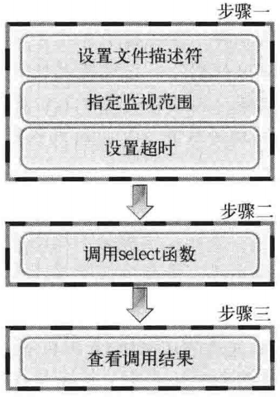

# TCP/IP 网络编程（尹圣雨）

## 1、理解网络编程和套接字
### 函数原型
```
#inlcude <sys/socket.h>
int socket(int domain, int type, int protocol);                        // 成功返回文件描述符，失败返回-1
int bind(int sockfd, struct sockaddr *myaddr, socklen_t addrlen);      // 成功返回 0，失败返回 -1
int listen(int socktd, int backlog);                                   // 成功返回 0，失败返回 -1
int accept(int sockfd, struct sockaddr *addr, socklen_t *addrlen);     // 成功返回文件描述符，失败返回 -1
int connect(int sockfd, struct sockadd *serv_addr, socklen_t addrlen); // 成功返回文件描述符，失败返回 -1
```
### 基于 Linux 的文件操作
- 打开文件
  ```
  #inlcude <sys/types.h>
  #include <sys/stat.h>
  #include <fcntl.h>
  int open(const char *path, int flag);  // 成功时返回文件描述符，失败时返回 -1
  ```
  |打开模式|含义|
  |:-|:-|
  |O_CREAT|必要时创建文件|
  |O_TRUNC|删除全部现有数据|
  |O_APPEND|维持现有数据、末尾添加|
  |O_RDONLY|只读打开|
  |O_WRONLY|只写打开|
  |O_RDWR|读写打开|
- 关闭文件
  ```
  #include <unistd.h>
  int close(int fd);    // 成功返回 0,失败返回 -1
  ```
- 将数据写入文件
  ```
  #include <unistd.h>
  ssize_t write(int fd, const void *buf, size_t nbytes); // 成功时返回写入的字节数，失败时返回 -1
  ```
- 读取文件中的数据
  ```
  #include <unistd.h>
  // 成功时返回读取的字节数（但是遇到文件结尾则返回 0），失败返回 -1
  ssize_t read(int fd, void *buf, size_t nbytes); 
  ```
## 2、套接字类型与协议设置
### 套接字协议及其数据传输特性
```
#include <sys/socket.h>
/* @param
 * domain：套接字使用的协议族（Protocol Family）信息
 * type：套接字数据传输类型
 * protocol：计算机间通信中使用的协议信息
 * return：成功时返回文件描述符，失败时返回-1
 */
int socket(int domain, int type, int protocol);
```
- 协议族（Protocol Family）

  |名称|协议族|
  |:-|:-|
  |PF_INET|IPv4 互联网协议族|
  |PF_INET6|IPv6 互联网协议族|
  |PF_LOCAL|本地通信的 UNIX 协议族
  |PF_PACKET|底层套接字的协议族|
  |PF_IPX|IPX Novel 协议族|
- 套接字类型
  - 面向连接的套接字（SOCK_STREAM）
    - 可靠传输
    - 按序传输
    - 传输的数据没有边界（发送端多次发送，接受端可以一次接收）
  - 面向消息的套接字（SOCK_DGRAM）
    - 强调快速传输而非传输顺序
    - 不可靠
    - 传输的数据有边界（发送端 N 发送，接受端 N 次接收）
    - 限制每次传输的数据大小

## 3、地址族与数据序列
### 地址信息的表示
```
struct sockaddr_in {          // IPv4 地址信息
  sa_family_t    sin_family;  // Protocol Family
  uint16_t       sin_prot;    // 端口号（网络序）
  struct in_addr sin_addr;    // IP 地址
  char           sin_zero[8]; // 不使用
};
struct in_addr {
  In_addr_t      s_addr;      // 32 位 IPv4 地址（网络序）
};

struct sockaddr {
  sa_family      sin_family;  // Protocol Family
  char           sa_data[14]; // IP + port，剩余部分填充 0
};
```

### 网络字节序与地址转换
- 字节序
  - 大端序：高位字节存放在低位地址
  - 小端序：高位字节存放在高位地址（intel 默认）
- 网络字节序
  - 大端序排列方式
- 字节序转换
  ```
  unsigned short htons(unsigned short); // host-to-network
  unsigned short ntohs(unsigned short); // network-to-host
  unsigned long htonl(unsigned long);
  unsigned long ntohl(unsigned long);
  ```

### 网络地址的初始化与分配
```
#include <arpa/inet.h>
// 成功时返回 32 位网络序整数型值，失败时返回 INADDR_NONE
in_addr_t inet_addr(const char *string);  // 127.0.0.1 ==> 0x100007f (网络序)

// 成功时返回 1,识别示返回 0
int inet_aton(const char *string, struct in_addr *addr);
```

## 4、基于 TCP 的服务端/客户端
### TCP 套接字的 IO 缓冲
调用 write() 函数时，将数据移至输出缓冲，在适当的时候（不管是分别传送还是一次性传送）传向对发的输入缓冲。调用 read() 函数时，从输入缓冲读取数据

- IO 缓冲在每个 TCP 套接字中单独存在
- IO 缓冲在创建套接字时自动生成
- 即使关闭套接字也会继续传递输出缓冲中遗留的数据
- 关闭套接字将丢失输入缓冲中的数据

## 5、基于 UDP 的服务端/客户端
### UDP 中的服务端和客户端没有连接
### UDP 服务端和客户端均只需 1 个套接字
### 基于 UDP 的数据 IO 函数
```
#include <sys/socket.h>
/* @param
 * sockfd：用于传输数据的 UDP 套接字文件描述符
 * buff：待传输数据的缓冲地址
 * nbytes：待传输数据的字节数
 * flags：可选参数，没有则传递 0
 * to：目的地址
 * addrlen：长度
 * return：成功时返回传输的字节数，失败时返回 -1
 */
ssize_t sendto(int              sockfd, 
               void            *buff, 
               size_t           nbytes, 
               int              flags, 
               struct sockaddr *to, 
               socklen_t        addrlen);

/* @param
 * sockfd：用于接收数据的 UDP 套接字文件描述符
 * buff：保持接收数据的缓冲地址
 * nbytes：可接收的最大字节数
 * flags：可选参数，没有则传递 0
 * from：保存源地址
 * addrlen：保存长度
 * return：成功时返回接受的字节数，失败时返回-1
 */
ssize_t recvfrom(int              sockfd, 
                 void            *buff, 
                 size_t           nbytes, 
                 int              flags, 
                 struct sockaddr *from, 
                 socklen_t        addrlen);
```
### UDP 客户端套接字的地址分配
可以调用 bind() 函数显式绑定，如果没有显式分配，调用 sendto() 函数时自动分配 IP 和端口号
### 存在数据边界的 UDP 套接字
UDP 是具有数据边界的协议，传输中调用 IO 函数的次数非常重要，输入函数的调用次数应和输出函数的调用次数完全一致
### 已连接（connected）UDP 套接字与未连接（unconnected）UDP 套接字
- sendto() 函数传输数据的过程
  - S1：向 UDP 套接字注册远端 IP 地址和端口号
  - S2：传输数据
  - S3：删除 UDP 套接字中注册的目标地址信息
- 创建已连接 UDP 套接字
  ```
  sock = socket(PF_INET, SOCK_DGRAM, 0);
  memset(&addr, 0, sizeof(addr));
  addr.sin_family = AF_INET;
  addr.sin_addr.s_addr = ...
  addr.sin_port = ...
  connect(sock, (struct sockaddr*)&addr, sizeof(addr)); // 绑定远端地址
  ```
  UDP 套接字调用 connect() 函数并不是要与对方建立连接，只是向 UDP 套接字注册对端 IP 地址和端口信息。之后每次调用 sendto() 函数只需要传输数据。也可以用 write() 和 read() 处理数据。

## 6、优雅地断开套接字连接
### 单方面断开连接带来的问题
Linux 的 close() 函数意味着完全断开连接。完全断开连接不仅无法传输数据，而且也不能接收数据
### 半关闭 shutdown() 函数
```
#include <sys/socket.h>
/* @param
 * sock：需要断开的套接字文件描述符
 * howto：传递断开方式信息
 *        SHUT_RD：断开输入流
 *        SHUT_WR：断开输出流
 *        SHUT_RDWR：同时断开输入输出流
 */
int shudown(int sock, int howto);
```
### 为何需要半关闭
表示一方传输数据完毕（接收方接收到 FIN 后向输入缓冲区写入 EOF），但是仍然可以接受数据
### 实例
file_server.c file_client.c

## 7、域名及网络地址
### DNS 服务器
对 IP 地址和域名进行相互转换
### 域名的必要性
系统运行时，保持 IP 地址不变并不容易
### 利用域名获取 IP 地址
```
#include <netdb.h>
// 成功时返回 hosten 结构体地址，失败时返回 NULL 指针
struct hostent *gethostbyname(const char *hostname);

struct hostent {
  char  *h_name;       // official name
  char **h_aliases;    // alias list
  int    h_addrtype;   // host address type
  int    h_length;     // address length
  char **h_addr_list   // address list
};
```
- h_name：官方域名
- h_aliases：绑定到同一地址的多个域名
- h_addrtype：IP 地址类型 IPv4 还是 IPv6（AF_INET 或者 AF_INET6）
- h_length：IP 地址长度，字节数
- h_addr_list：以整数形式保持域名对应的 IP 地址


  
```
#include <arpa/inet.h>
// 将整数形式 IP 转换为点分十进制格式的字符串
char *inet_ntoa(struct in_addr addr) // 成功时返回转换的字符串地址值，失败时返回 -1
```
### 利用 IP 地址获取域名
```
#include <netdb.h>
/*@param
 * addr：含有 IP 地址信息的 in_addr 结构体指针
 * len：指向第一个参数传递的地址信息的字节数，IPv4 时为 4，IPv6 时为 16
 * family：传递地址族信息，IPv4 时为 AF_INET，IPv6 时为 AF_INET6
 * return：成功时返回 hostent 结构体变量地址值，失败时返回 NULL 指针
 */
struct hostent *gethostbyaddr(const char *addr, socklen_t len, int family);
```

## 8、套接字的多种可选项
### 套接字多种可选项 `sock_type.c`


```
#include <sys/socket.h>
/*@ param
 * sock：用于查看选项套接字文件描述符
 * level：要查看的可选项的协议层
 * optname：要查看的可选名
 * optval：保存查看结果的缓冲地址值
 * optlen：缓冲字节数
 * return：成功时返回 0,失败时返回 -1
 */
int getsockopt(int sock, int level, int optname, void *optval, socklen_t *optlen);

/*@ param
 * sock：用于更改选项套接字文件描述符
 * level：要更改的可选项的协议层
 * optname：要更改的可选名
 * optval：保存要更改结果的缓冲地址值
 * optlen：缓冲字节数
 * return：成功时返回 0,失败时返回 -1
 */
int setsockopt(int sock, int level, int optname, const void *optval, socklen_t optlen);
```
### SO_SNDBUF & SO_RCVBUF
SO_SNDBUF 是输入缓冲大小相关可选项，SO_RCVBUF 是输出缓冲大小相关可选项。用这两个可选项既可以读取当前 IO 缓冲大小，也可以进行更改（`get_buf.c, set_buf.c`）。

### SO_REUSEADDR
- Time-wait 状态
  - 先断开连接的（先发送 FIN 消息的）主机要经过 TIME_WAIT 状态，确保 TCP 连接正常关闭。此时相应的端口是正在使用的状态，调用 bind() 函数会发生错误。
- 地址再分配
  - ACK 丢失，再次收到 FIN 包会重启 TIME_WAIT 计时器
  - 更改套接字的 SO_REUSEADDR 状态，可将 TIME_WAIT 状态下的套接字端口号重新分配给新的套接字

### SO_LINGER
SO_LINGER 选项用于控制 close() 系统调用在关闭 TCP 连接时的行为。默认情况下，当使用 close() 系统调用来关闭一个套接字时，close() 将立即返回，TCP 模板负责把该套接字对应的 TCP 发送缓冲区中残留的数据发送给对方。设置或获取 SO_LINGER 选项的值时，使用 linger 类型的结构体
```
#include <sys/socket.h>
struct linger {
  int l_onoff;  // 开启（非 0）或关闭（0）该选项
  int l_linger; // 滞留时间
};
```
根据 linger 结构体中两个成员变量的不同值，close() 系统调用可能产生如下 3 种行为之一：
1. l_onoff 为 0。此时 SO_LINGER 选项不起作用
2. l_onoff 不为 0，l_linger 为 0。此时 close() 系统调用立即返回，TCP 模块将丢弃被关闭的套接字对应的 TCP 发送缓冲区中残留的数据，同时给对方发送一个 RST 分节。这种情况给服务器提供了异常终止一个连接的方法
3. l_onoff 不为 0，l_linger 大于 0。此时 close() 的行为取决于两个条件：一是被关闭的套接字对应的 TCP 发送缓冲区中是否还有残留的数据；二是该套接字是阻塞的，还是非阻塞。对于阻塞的套接字，close() 将等待一段长为 l_linger 的时间，直到 TCP 模块发送完所有残留数据并得到对方的确认。如果这段时间内 TCP 模块没有发送完残留数据并得到对方的确认，那么 close() 将发挥 -1 并设置 errno 为 EWOULDBLOCK。如果套接字是非阻塞的，close() 将立即返回，此时我们需要根据其返回值和 errno 来判断残留数据是否已经发送完毕。

### TCP_NODELAY
- Nagle 算法
  - 只有收到前一数据的 ACK 消息时，Nagle 算法才发送下一数据
  - TCP 默认使用 Nagle 算法交换数据，因此最大限度地进行缓冲，直到收到 ACK
  - 减少小数据包，提高网络传输效率
  - 网络流量未受太大影响时，不使用 Nagle 算法要比使用它时传输速度快。最典型的是“大文件传输”应禁用 Nagle 算法
- 禁用 Nagle 算法
  ```
  int option = 1;
  setsockopt(sock, INPROTO_TCP, TCP_NODELAY, (void*)&option, sizeof(option));
  ```

## 9、多进程服务端
### 并发服务器端的实现方法
- 多进程服务器：通过创建多个进程提供服务
- 多路复用服务器：通过捆绑并统一管理 IO 对象提供服务
- 多线程服务器：通过生成与客户端等量的线程提供服务

### 理解进程
- “占用内存空间的正在运行的程序”
- 通过调用 fork() 函数创建进程
  ```
  #include <unistd.h>
  pid_t fork(void); // 成功时返回进程ID，失败时返回-1
  ```
  - fork() 函数将创建调用的进程的副本--复制正在运行的、调用 fork() 函数的进程。另外，两个进程都将执行 fork() 函数调用后的语句（准确地说是在 fork() 函数返回后）。之后的程序流要根据 fork() 函数的返回值加以区分。
    - 父进程： fork() 函数返回子进程 ID
    - 子进程： fork() 函数返回 0

### 僵尸进程
- 僵尸进程就是父进程 fork() 之后并没有调用 wait() 处理子进程。在子进程退出的时候，内核释放该进程所有的资源，比如文件描述符，内存，等等，但是依然为该进程保留一定的信息（如PCB，允许父进程读取子进程exit status），只有该进程的父进程调用 wait() 之后才会释放掉这些保留的信息。如果父进程没有 wait() ，那么子进程就变成了僵尸进程。
- 销毁僵尸进程
  - 利用 wait() 函数
    ```
    #include <sys/wait.h>
    pid_t wait(int *statloc);  // 成功时返回终止的子进程 ID，失败时返回 -1
    ```
    调用此函数时如果已经有子进程终止，那么子进程终止时传递的返回值（exit 函数的参数值、main() 函数的 retrun 返回值）将保存到参数 stateloc 中。但是函数采纳数所指的单元中还包含其他信息，因此需要通过下列宏进行分离：
    - WIFEXITED：子进程正常终止时返回真
    - WEXITSATUS：返回子进程的返回值
    ```
    if(WIFEXITED(status))) {
      puts("normal termination");
      printf("child pass num: %d", WEXITSTATUS(status));
    }
    ```
  - 使用 waitpid() 函数
    ```
    #include <sys/wait.h>
    /* @param
     * pid：等待终止的目标子进程的 ID，若传递 -1，则与 wait() 函数相同，可以等待任意子进程终止
     * statloc：与 wait() 函数 statloc 参数含义相同
     * options：传递头文件sys/wait.h中声明的常量 WNOHANG，即没有终止的子进程也不会进入阻塞状态，而是返回 0 并退出函数
     */
    pid_t waitpid(pid_t pid, int *statloc, int options); // 成功时返回终止的子进程 ID（或0），失败返回 -1
    ```

### 信号处理
- 信号与 signal() 函数
  ```
  #include <signal.h>
  void (*signal(int signo, void(*func)(int)))(int);
  ```
  调用上述函数时，第一个参数为特殊情况信息，第二个参数为特殊情况下将要调用的函数的指针。发生第一个参数代表的情况时，（操作系统）调用第二个参数所指的函数。signo 部分值：
  - SIGALRM：已到通过调用 alarm() 函数注册的时间
  - SIGINT：输入 CTRL+C
  - SIGCHLD：子进程终止
  
  ```
  #include <unistd.h>
  unsigned int alarm(unsigned int seconds); // 返回0或以秒为单位的据 SIGALRM 信号发生所剩时间
  ```
  如果调用该函数的同时向它传递一个正整型参数，相应时间后（以秒为单位）将产生 SIGALRM 信号。若向该函数传递 0，则之前对 SIGALRM 信号的预约将取消。如果通过该函数预约信号后未指定该信号对应的处理函数，则（通过调用 signal() 函数）终止进程，不做任何处理。
- 利用 sigaction() 函数进行信号处理
  类似 signal() 函数，而且完全可以替代后者，（接口）也更稳定
  ```
  #include <signal.h>

  /* @param
   * signo：传递信号信息
   * act：信号处理动作
   * oldact：获取之前注册的信号处理的指针，若不需要则传递 0
   * return：成功时返回0，失败时返回 -1
   */
  int sigaction(int signo, const struct sigaction *act, struct sigaction *oldact);

  struct sigaction {
    void (*sa_hanlder)(int);
    void (*sa_sigaction)(int, siginfo_t *, void *);
    sigset_t sa_mask;  // 暂时初始化为0
    int sa_flags;      // 暂时初始化为0
    void (*sa_restorer)(void);
  };
  ```
- 利用信号处理技术消灭僵尸进程`remove_zombie.c`
  - 子进程终止时将产生 SIGCHLD 信号

### 基于多任务的并发服务器
- 第一阶段：回声服务器（父进程）通过调用 accept() 函数受理连接请求
- 第二阶段：此时获得的套接字文件描述符创建并传递给予子进程
- 第三阶段：子进程利用传递来的文件描述符提供服务
- 实现`echo_mpserver.c`

### 分割TCP的IO程序`echo_mpclient.c`

## 10、进程间通信
### 对进程间通信的基本理解
只要有两个进程可以同时访问的内存空间，就可以通过此空间交换数据

### 通过管道实现进程间通信
```
#include <unistd.h>
/*@param
 * filedes[0]：通过管道接受数据时使用的文件描述符，即管道出口
 * filedes[1]：通过管道传输数据时使用的文件描述符，即管道入口
 * return：成功时返回0, 失败时返回 -1
 */
int pipe(int filedes[2]);
```
数据进入管道后称为无主数据，通过 read() 函数先读取数据的进程将得到数据，即使该进程将数据传到了管道。

## 11、IO复用
### 多进程服务器端的缺点
- 创建进程时付出极大代价
- 进程通信相对复杂

### 理解 select() 函数并实现服务器端
#### select() 函数的功能和调用顺序
- 使用 select() 函数时可以将多个文件描述符集中到一起统一监视，项目如下：
  - 是否存在套接字接受数据
  - 无需阻塞传输数据的套接字有那些
  - 那些套接字发生类异常
- 调用顺序  



### 设置文件描述符
- 首先需要将要监视的文件描述符集中到一起。集中时也要要找监视项（接受、传输、异常）进行区分，即按照上述3种监视项分成3类
- fd_set 数组将要监视的文件描述符集中到一起，某位设置 1 表示监视
  - `FD_ZERO(fd_set *fdset)`：将 fdset 所指变量的所有位初始化为0
  - `FD_SET(int fd, fd_set *fdset)`：在参数 fdset() 所指的变量中注册文件描述符 fd 的信息
  - `FD_CLR(int fd, fd_set *fdset)`：在参数 fdset() 所指的变量中清除文件描述符 fd 的信息
  - `FD_ISSET(int fd, fd_set *fdset)`：若参数 fdset() 所指的变量中包含文件描述符 fd 的信息，则返回真


#### 设置监视范围及超时
```
#include <sys/select.h>
#include <sys/time.h>
/* @param
 * maxfd：监视对象文件描述符的范围，即所有文件描述符的最大值加1
 * readset：是否存在待读取数据
 * writeset：是否可传输无阻赛数据
 * exceptset：是否发生异常
 * timeout：调用 select() 函数后，为防止陷入无限阻塞的状态，传递超时信息
 * return：成功返回 0,失败返回 -1。因发生关注的事件返回时，返回大于 0 的值
 */
int select(int maxfd, fd_set *readset, fd_set *writeset, fd_set *exceptset, const struct timeval *timeout);

struct tiemval {
  long tv_sec;  // seconds
  long tv_usec; // microseconds
};
```

## 12、多种 IO 函数
### send() & recv() 函数
```
#include <sys/socket.h>
/* @param
 * sockfd：表示与数据传输对象连接的套接字文件描述符
 * buf：保存待传输数据的缓冲地址
 * nbytes：待传输的字节数
 * flags：传输数据时指定的可选项信息
 * return：成功时返回发送的字节数，失败时返回 -1
 */
ssize_t send(int sockfd, const void *buf, size_t nbytes, int flags);

/* @param
 * sockfd：表示数据接收对象的连接的套接字文件描述符
 * buf：保持接收数据的缓冲地址
 * nbytes：可接收的最大字节数
 * flags：接受数据时指定的可选项信息
 * return：成功时返回接受的字节数（收到 EOF 时返回0），失败时返回-1
 */
ssize_t recv(int sockfd, void *buf, size_t nbytes, int flags);
```
- 可选项值
  
  |可选项|含义|send|recv|
  |:----|:--|:--:|:--:|
  |MSG_OOB|用于传输带外数据（Out-of-band data）|.|.|
  |MSG_PEEK|验证输入缓冲中是否存在接受的数据||.|
  |MSG_DONTROUTE|传输过程和总不参照路由表，在本地网络中寻找目的地|.||
  |MSG_DONTWAIT|调用IO函数时不阻塞，用于使用非阻塞（Non-blocking）IO|.|.|
  |MSG_WAITALL|防止函数返回，直到接收全部请求的字节数||.|

- MSG_OOB：发送紧急消息
  - 督促数据接受对象尽快处理数据
  - TCP“保持传输顺序”的传输特性依然成立
- MSG_PEEK 和 MSG_DONTWAIT：检查输入缓冲中是否存在接收的数据
  - 设置 MSG_PEEK 选项并调用 recv() 函数时，即使读取了输入缓冲的数据也不会删除。
  - 常与 MSG_DONTWAIT 合作，用于调用以非阻塞方式验证待读数据存在与否

### readv() & writev() 函数
- 对数据进行整合传输及发送的函数
- 通过 writev() 函数可以将分散保存在多个缓冲中的数据一并发送
- 通过 readv() 可以由多个缓冲分别接受

```
#include <sys/uio.h>
/* @param
 * filedes：表示数据传输对象的套接字文件描述符，但不仅限于套接字，也可以是文件或标准输出描述符
 * iov：iovec结构体数组的地址
 * iovcnt：向第二个参数传递的数组长度
 * return：成功时返回发送的字节数，失败时返回 -1
 */
ssize_t writev(int filedes, const struct iovec *iov, int iovcnt);

struct iovec {
  void  *iov_base; // 缓冲地址
  size_t iov_len;  // 缓冲大小
};

/***比如****************************
 * writev(1, ptr, 2);
 *         --------
 * ptr--->|iov_base|--->|A|B|C|.|.|
 *        |iov_len |--->|3|
 *         --------
 *        |iov_base|--->|1|2|3|4|.|
 *        |iov_len |--->|4|
 *         --------
 **********************************/

 /* @param
  * filedes：接收数据的文件（或套接字）描述符
  * iov：iovec结构体数组的地址
  * iovcnt：数组长度
  * return：成功时返回接收的字节数，失败时返回-1
  */
ssize_t readv(int filedes, const struct iovec *iov, int iovcnt);
```

## 13、多播与广播
### 多播 --- 数据传输基于 UDP 完成
- 多播数据传输特点
  - 多播服务端针对特定多播组，只发送一次数据
  - 即使只发送一次数据，但该组内的所有客户端都会接受数据
  - 多播组数可以在 IP 地址范围内任意增加
  - 加入特定组即可接受发往该多播组的数据
- 多播组是 D 类 IP 地址（224.0.0.0～239.255.255.255），向网络传递 1 个数据包时，路由器将复制该数据包并传递到多个主机

### TTL（Time to Live）
- 决定“数据包传递距离”的主要因素。
- TTL 用整数表示，每经过一个路由器就减 1
- TTL 变为 0 时，该数据包无法再被传递，只能销毁
- 通过套接字可选项 IP_MULTICAST_TTL 可以改变 TTL 的值
  ```
  int send_sock;
  int time_to_live = 64;
  ...
  send_sock = socket(PF_INET, SOCK_DGRAM, 0);
  setsockopt(send_sock, IPPROTO_IP, IP_MULTICAST_TTL, (void*)&time_to_live, sizeof(time_to_live));
  ...
  ```
- 加入多播组也是通过设置套接字选项 IP_ADD_MEMBERSHIP 完成
  ```
  int recv_sock;
  struct ip_mreq join_addr;
  ...
  recv_sock = socket(PF_INET, SOCK_DGRAM, 0);
  ...
  join_addr.imr_multiaddr.s_addr = "inet_addr("224.0.0.14")";
  join_addr.imr_interface.s_addr = htonl(INADDR_ANY);
  setsockopt(recv_sock, IPPROTO_IP, IP_ADD_MEMBERSHIP, (void*)&join_addr, sizeof(join_addr));
  ...

  struct ip_mreq {
    struct in_addr imr_multiaddr; // 加入的多播组 IP 地址
    struct in_addr imr_interface; // 加入该组的套接字所属主机的 IP 地址
  };
  ```

### 广播
- 基于 UDP 完成
- 只能向同一网络中的主机传输数据
- 类别（主要差别是 IP 地址）
  - 直接广播
    - IP 地址除了网络地址外，其余主机地址全部为1
  - 本地广播
    - IP 地址限定为 255.255.255.255 
- 通过更改套接字可选项 SO_BROADCAST 实现广播（默认生成的套接字会阻止广播）
  ```
  int send_sock;
  int bcast = 1;
  ...
  send_sock = socket(PF_INET, SOCK_DGRAM, 0);
  ...
  setsockopt(send_sock, SOL_SOCKET, SO_BORADCASE, (void*)&bcast, sizeof(bcast));
  ...
  ```

## 14、套接字和标准IO
### 标准IO函数
```
/* @param
 * path：文件路径
 * mode：打开方式（r, r+, w, w+, a, a+）
 * return：成功返回 FILE 指针，失败返回 NULL，并且修改 errno 值*/
#include <stdio.h>
FILE *fopen(const char *path, const char *mode);

/* @param
 * fp：打开的文件指针
 * return：成功返回 0，失败返回 EOF，并且设置 errno
 */
int fclose(FILE *fp);

/* @param
 * stream：打开的文件指针（可以是 stdout，stdin，stderr）
 * return：成功返回字符对应的 ASCII 值,失败返回 EOF
 */
int fgetc(FILE *stream);

/* @param
 * c: 要输出的字符的 ASCII 值
 * stream：打开的文件指针
 * return：成功返回字符对应的 ASCII 值,失败返回 EOF
 */
int fputc(int c, FILE *stream);

/* @param
 * s:目的地址
 * size：读取 size 个字节（最多读取 size-1 个，最后一个字符 '\0'）
 * stream：打开的文件指针（可以是stdout，stdin，stderr）
 * return：成功返回 s,失败返回 NULL，设置 errno
 */
char *fgets(char *s, int size, FILE *stream);

/* @param
 * s: 要输出字符
 * stream：打开的文件指针
 * return：成功返回非负整数,失败返回 EOF，设置 errno
 */
int fputs(const char *s, FILE *stream);

/* @param
 * buffer: 保存读取数据的地址
 * size：每个对象的大小（字节数）
 * count：读取多少个对象
 * return：成功返回读取的对象个数, 如果返回值比 count 小，必须用 feof 或 ferror 来决定发生什么情况
 */
size_t fread(void *buffer, size_t size, size_t count, FILE *stream)

/* @param
 * buffer: 保存输出数据的地址
 * size：每个对象的大小（字节数）
 * count：输出多少个对象
 * return：成功返回读取的对象个数, 如果返回值比 count 小，必须用 feof 或 ferror 来决定发生什么情况
 */
size_t fwrite( const void *buffer, size_t size, size_t count, FILE *stream );

int printf(const char *format, ...);

int fprintf(FIFL *stream, const char *format, ...);

int scanf(const char *format, ...);

int fseek(FILE *stream, long offset, int whence);

long ftell(FILE *stream);

void rewind(FILE *stream);

int fflush(FILE *stream);
```

### 标准 IO 函数的两个优点
- 具有良好的移植性
- 可以利用缓冲提高性能

### 标准 IO 函数的几个缺点
- 不容易进行双向通信
- 有时可能频繁调用fflush函数
- 需要以FILE结构体指针的形式返回文件描述符

### 利用 fdopen() 函数转换为 FILE 结构体指针
```
#include <stdio.h>
/* @param
 * fildes：需要转换的文件描述符
 * mode：将要创建的 FILE 结构体指针的模式信息
 * return：成功返回 FILE 结构体指针，失败返回 NULL
 */
FILE *fdopen(int fildes, cont char *mode);
```

### 利用 fileno() 将函数转换为文件描述符
```
#include <stdio.h>
int fileno(FILE *stream); // 成功时返回转换后的文件描述符，失败时返回-1
```

## 15、关于IO流分离的其他内容
### IO分离
-  fork() 一个进程负责读或写数据
- fdopen() 函数，创建读模式 FILE 指针和写模式 FILE 指针

### 流分离带来的`EOF`问题
- 调用 fclose() 函数完全终止的套接字，而不是半关闭

### 文件描述符的复制
#### 终止流时无法半关闭的原因
读模式 FILE 指针和写模式 FILE 指针都是基于同一文件描述符创建的，针对任意一个 FILE 指针调用 fclose() 函数是都会关闭文件描述符，终止套接字。

 


#### 复制文件描述符后穿件 FILE
可以复制后另外创建1个文件描述符，然后利用各自的文件描述符生成读模式 FILE 指针和写模式 FILE 指针（不是半关闭，不但没有发送 EOF，而且仍然可以利用文件描述符进行双工通信）


#### 同一进程内文件描述符复制（两个不同的文件描述符）

表示“为了访问同一文件或套接字，创建另一个文件描述符”

  


### dup() & dup2()
```
#include <unistd.h>
int dup(int fildes);               // 成功时返回复制的文件描述符，失败时返回 -1
int dup2(int fildes, int fildes2); // fildes2 是明确指定目的文件描述符的值。成功时返回复制的文件描述符，失败时返回 -1
```
### 无论复制出多少文件描述符，均应调用 shutdown() 函数发送 EOF 并进入半关闭状态

## 16、优于 select() 的 epoll()
### 基于 select() 的 IO 复用技术速度慢的原因
- 调用 select() 函数后常见的针对所有文件描述符的循环语句
  - 调用 select() 函数后，并不是把发生变化的文件描述符单独集中到一起，而是通过棺材作为监视对象的 fd_set 变量的变化，找出发生变化的文件描述符，因此无法避免针对所有监视所有监视对象的循环语句
- 每次调用 select() 函数时都要向该函数传递监视对象信息
  - 作为监视对象的 fd_set 变量会发生变化，所以调用 select() 函数前应复制并保存原有信息，并在每次调用 select() 函数时传递新的监视对象信息

### 实现 epoll() 时必要的函数和结构体
```
#include <sys/epoll.h>
typedef union epoll_data {
  void       *ptr;
  int        fd;
  __uint32_t u32;
  __uint64_t u64
} epoll_data_t;
struct epoll_even {
  __uint32_t events;
  epoll_data data;
};

/* @param
 * size：epoll 实例的大小，只是建议值，仅供操作系统参看
 * return：成功时返回 epoll 文件描述符（调用 close() 关闭），失败时返回 -1*/
int epoll_create(int size);

/* @param
 * epfd：用于注册监视对象的 epoll 例程的文件描述符
 * op：用于指定监视对象的添加、删除或更改操作
 *     EPOLL_CTL_ADD：将文件描述服注册到 epoll 例程
 *     EPOLL_CTL_DEL：从 epoll 例程中删除文件描述符
 *     EPOLL_CTL_MOD：更改注册的文件描述符的关注事件发生情况
 * fd：需要注册的监视对象文件描述符
 * event：监视对象的事件类型
 *     EPOLLIN：需要读取数据的情况
 *     EPOLLOUT：输出缓冲为空，可以立即发送数据的情况
 *     EPOLLPRI：收到 OOB 数据的情况
 *     EPOLLRDHUP：断开连接或半关闭的情况，在边缘触发方式下非常有用
 *     EPOLLERR：发生错误的情况
 *     EPOLLET：以边缘触发的方式得到事件通知
 *     EPOLLONESHOT：发生一次事件后，相应文件描述符不再收到事件通知。
 *                   因此需要向 epoll_ctl() 函数的第二个参数传递 EPOLL_CTL_MOD，再次设置事件
 * return：成功时返回0，失败返回-1
 */
int epoll_ctl(int epfd, int op, int fd, struct epoll *event);

/* @param
 * epfd：表示事件发生监视范围的 epoll 例程的文件描述符
 * events：保存发生事件的文件描述符集合的结构体地址
 * maxevents：第二个参数中可以保存的最大事件数
 * timeout：以1/1000 秒为单位的等待时间，传递 -1 时，一直等待直到发生事件
 * return：成功返回发生事件的文件描述符，失败返回 -1
 */
int epoll_wait(int epfd, struct epoll_event *events, int maxevents, int timout);
```
### 条件触发（Level Trigger）和边缘触发（Edge Trigger）
#### 条件触发和边缘触发的区别在于发生事件的时间点
- 条件触发方式中，只要输入缓冲有数据就会一直通知该事件
- 边缘触发中输入缓冲收到数据时仅注册 1 次该事件。即使输入缓冲中还留有数据，也不会再进行注册
- epoll() **默认以条件触发方式工作**

#### 边缘触发的服务器端实现中必知的两点
- 通过 errno 变量验证错误原因
  -  read() 函数返回 -1， errno 的值为 EAGAIN 时，说明没有数据可读
- 为了完成非阻塞（Non-blocking）IO，更改套接字特性
  ```
  // linux提供更改或读取文件属性的方法
  #include <fcntl.h>
  /* @param
   * filedes：属性更改目标的文件描述符
   * cmd：表示函数调用的目的
   *    F_GETFL：获得第一个参数所指文件描述符属性（int型）
   *    F_SETFL：更改文件描述符属性
   * return：成功返回cmd参数相关值，失败返回-1
   */
  int fcntl(int filedes, int cmd, ...);

  // 将文件（套接字）改为非阻塞模式
  int flag = fcntl(sockfd, F_GETFL, 0);
  fcntl(sockfd, F_SETFL, flag|O_NONBLOCK)
  ```

## 17、多线程服务器端的实现
### 线程和进程的差异


- 每个进程拥有独立的内存
  - 在操作系统构成单独执行流的单位
- 同一进程的线程共享数据、堆区域，只需分离栈区域
  - 上下文切换时不需要切换数据区和堆
  - 可以利用数据区和堆交换数据
  - 在进程构成单独执行流的单位

### 线程创建及运行
线程具有单独的执行流，需要单独定义线程的 main() 函数，还需要请求操作系统在单独的执行流中执行该函数
```
#include <pthread.h>
/* @param
 * thread：保存新创建线程 ID
 * attr：传递线程属性的参数，传入 NULL，创建默认属性的线程
 * start_routine：相当于线程 main() 函数的、在单独执行流中执行的函数指针
 * arg：通过第三个参数传递调用函数时包含传递参数的变量地址
 * return：成功返回 0，失败返回其他值
 */
int pthread_create(
  pthread_t *restrict thread, const pthread_arrt_t *restrict attr,
  void *(*start_routine)(void *), void *restrict arg);
// 用 restrict 修饰一个指针，表示指针独享这片内存，所有修改都得通过这个指针进行

/* @param
 * thread：此 ID 的线程终止后才会从该函数返回
 * status：保存线程返回值
 * return：成功返回 0，失败返回其他值
 */
int pthread_join(pthread_t thread, void **status);
```

### 线程安全函数
- 多个线程同时调用时也不会发生问题
- 大多数标准函数都是线程安全函数
- 非线程安全函数对应的线程安全函数加`_r`后缀
  ```
  struct hostent *gethostbyname(const char *hostname);
  struct hostent *gethostbyname_r(const char *name, struct hostent *result, char *buffer, int buflen, int *h_errnop);
  ```

### 工作（Worker）线程模型 `thread4.c`


### 线程存在的问题和临界区
- 多个线程访问同一变量的问题
  - 并发执行引发逻辑错误
- 临界区位置
  - 函数内同时运行多个线程时引起问题的多条语句构成的代码块

### 线程同步
- 互斥量
  ```
  #include <pthread.h>
  /* @param
   * mutex：保存互斥量的变量地址值
   * attr：传递即将创建的互斥量属性，没有特别需要的属性传递 NULL
   *    第二个参数为 NULL，等同于宏 PTHREAD_MUTEX_INITIALIZER
   * return：成功返回0，失败返回其他值
   */
  int pthread_mutex_init(pthread_mutex_t *mutex, const pthread_mutexattr_t *attr);
  
  /* @param
   * mutex：销毁互斥量的变量地址值
   * return：成功返回 0，失败返回其他值
   */
  int pthead_mutex_destroy(pthread_mutex_t *mutex);

  int pthread_mutex_lock(pthread_mutex_t *mutex);  // 成功返回 0，失败返回其他值
  int pthread_mutex_unlock(pthread_mutex_t *mutex); // 成功返回 0，失败返回其他值
  ```
- 信号量
  ```
  #include <semaphore.h>
  /* @param
   * sem：创建信号量的变量地址值
   * pshared：创建可由多少个进程共享的信号量，传递 0 表示只允许 1个 进程内部使用
   * value：指定初始值
   * return：成功返回0，失败返回其他值
   */
  int sem_init(sem_t *sem, int pshared, unsigned int value);
  
  /* @param
   * sem：销毁信号量的变量地址值
   * return：成功返回0，失败返回其他值
   */
  int sem_destroy(sem_t *sem);

  int sem_post(sem_t *sem);  // +1 成功返回0，失败返回其他值
  int sem_wait(sem_t *sem);  // -1 成功返回0，失败返回其他值
  ```

### 销毁线程的 2 种方法
- 调用 pthread_join() 函数
  - 调用者阻塞
- 调用 pthread_detach() 函数
  ```
  #include <pthread.h>
  int pthread_detach(pthread_t thread); // 成功返回 0，失败返回其他值
  ```
  - 不会阻塞