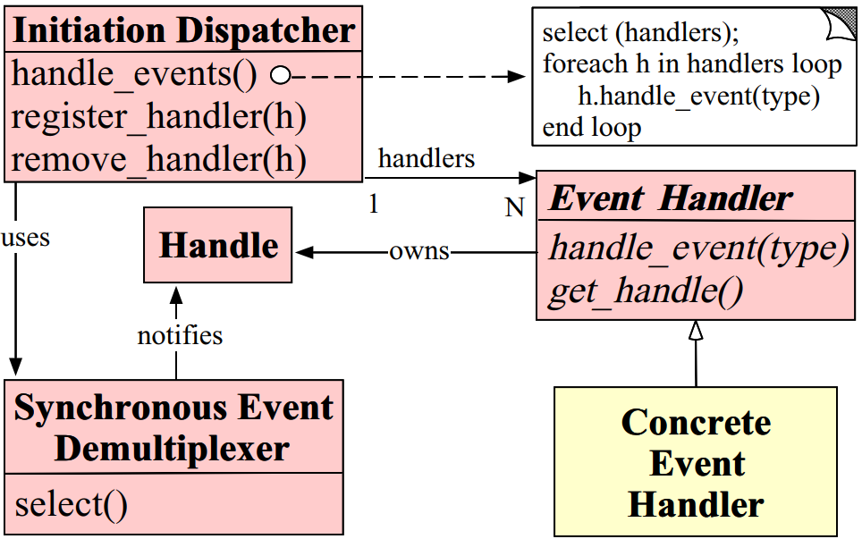
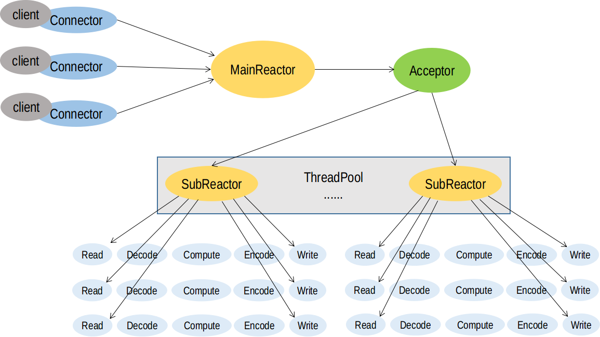

# 活体检测 TCP 网络服务器

## 项目目的
这个项目是我参与的一项国家重点研发计划纵向课题的一部分。这个纵向课题的目的解决网络空间中身份管理的问题，我参与的部分是人脸、指纹识别技术的防伪研究。人脸识别防伪通俗的叫法叫做活体检测，目的是识别出成像设备（摄像头、手机）现场采集的人脸照片是来自真实的人脸，还是某种形式的攻击或伪装，比如照片攻击、视频回放攻击或者面具攻击。我们采用的活体检测算法是基于深度学习的，对硬件设备有一定的要求，所以我希望成像设备充当客户端，采集到图像后，把活体检测的工作布置到服务端进行，服务端处理完后将识别结果返回给客户端。另外，动手搭建一个 TCP 服务器能够很好的贯穿之前学习到的知识，是一个很好的实践机会。

## 项目基础
程序使用 Reactor 多线程模型。为避免频繁创建和销毁线程带来的开销，使用线程池，在程序的开始预先创建固定数量的线程。

### Reactor 模式


- Handle：是操作系统所管理资源的抽象，一般指文件描述符。
- Event Handler：拥有一个 Handle 和一组虚函数接口。这组事件处理方法用于处理 Handle 上就绪的事件。
- Concreate Event Handler：继承 Event Handler，实现具体的事件处理方法。
- Synchronous Event Demultiplexer：进行 IO 复用，本项目采用的是 Linux 系统的 epoll。通过调用 epoll_ctl() 函数将 Handle 和需要监视的事件添加到 epoll 中，通常的事件包括连接请求、数据输入和输出，以及超时。系统调用 epoll_wait() 会返回处于就绪的 Handle。
- Initiation Dispatcher：事件分发中心，管理 Event Handler 的注册、移除以及处理就绪事件。拥有一个 Synchronous Event Demultiplexer 负责 IO 复用。当有就绪事件，分配相应的 Event Handler 负责处理就绪事件。

### Reactor 多线程模型


本项目是基于多 Reactor 模型，有一个 MainReactor 和多个 SubReactor。MainReactor 负责处理客户端的连接请求并建立连接，然后通过轮流算法（Round Robin）选择一个 SubReactor，最后将请求转交给这个 SubReactor。这里涉及到跨线程操作，需要加锁。每个 SubReactor 都在一个独立的线程中运行，并且维护一个独立的 IO 复用器。如果此时 SubReactor 所在的线程正阻塞在 epoll_wait() 系统调用中，使用 eventfd 进行异步唤醒。

这样的方式的好处
- 线程数目基本固定，可以在程序启动的时候设置，不会频繁创建与销毁
- IO 事件发生的线程是固定的，同一个 TCP 连接不必考虑事件并发

### epoll 工作方式
epoll 有两种工作方式，分别是边沿触发（Edge Trigger）和水平触发（Level Trigger），默认工作方式是水平触发。考虑如下情况：
1. 服务端进程将一个套接字文件描述符 fd 在 epoll 实例上注册，关注可读事件，然后调用 epoll_wait()
2. 客户端通过套接字连接写入 2 KB 的数据
3. 服务器进程从 epoll_wait() 系统调用返回，返回就绪的文件描述符 fd
4. 服务端进程从 fd 读取 1 KB 数组
5. 开始处理

如果已使用 EPOLLET 标志将 fd 文件描述符注册到 epoll，尽管套接字输入缓冲区中仍存在可用数据，但在步骤 5 之后再次调用 epoll_wait() 可能会阻塞。同时，客户端期望服务端对其发送的数据进行相应。原因是边缘触发模式仅在监视文件描述符状态发生改变时才传递事件。在上面的示例中，步骤 2 将生成一个事件，然后事件在步骤 3 中被消耗。由于在步骤 4 中的读取操作不读取整个缓冲区数据，因此再次调用 epoll_wait() 会无期限地阻塞或最终超时。在使用边沿触发工作方式，通常使用如下方式
1. 使用非阻塞文件描述符
2. 仅在 read() 或 write() 返回 EAGAIN 之后停止读取或写操作

如果使用水平触发（默认情况，未设置 EPOLLET 标志），epoll 相当于一个更快的 poll。但在步骤 5 之后再次调用 epoll_wait() 会返回 fd 上有可读事件。

本项目使用的是 epoll 的水平触发方式，因为实现相对简单。

### 定时器
网络程序需要处理一些定时事件，比如周期性地检测一个连接是否正常。本项目采用 Linux 系统的 timerfd 接口来处理超时管理。

#### timerfd
当我们调用 timerfd_create() 创建一个定时器时，操作系统会将这个定时器绑定到一个文件上，定时器通过文件描述符传递定时器超时通知，当定时器有超时发生，对应的文件可读。read() 的读取内容是一个 8 字节的无符号整数，表示从上一次成功调用 read() 或者 调用 timerfd_settime() 设置时间后到现在为止发生超时的次数。timerfd 提供了另外一种使用定时器的方式，将监视定时器超时事件转换为文件可读事件。该文件在定时器超时后变为可读，这样就能很方便地融入到 epoll 框架中，用同一的方式来处理 IO 事件和超时事件。

传统的 gettimer() 和 timer_create() 是使用信号来传递超时，在多线程程序中，信号处理要复杂一些。首先信号的是异步产生的，信号的产生不是因为程序出错，而是程序逻辑需要，信号在被处理后应用程序需要正常执行，所以信号处理函数需要是异步信号安全的。编写安全的信号安全函数主要有以下一些规则：
- 信号处理函数尽量只执行简单的操作，譬如只是设置一个外部变量，其他复杂的操作留在信号处理函数之外执行
- errno 是线程安全的，即每个线程有自己的 errno，但不是异步信号安全。如果信号处理函数比较复杂，且调用了可能会改变 errno 值的库函数，必须考虑在信号处理函数开始时保存，结束时恢复被中断的线程的 errno 值
- 信号处理函数只调用可重入的 C 库函数。譬如不能调用 malloc()、free() 以及标准 IO 库函数等
- 信号处理函数如果需要访问全局变量，在定义此全局变量时必须将其声明为 volatile，以避免编译器不恰当的优化

本项目采用最小堆的方式管理定时器，时间堆是组织定时器的一种高效方案，它将所有定时器中距超时时间剩余时间最少的一个定时器的超时值作为心博间隔。这样，一旦搏函数 tick 被调用，超时时间最小的定时器必然到期，我们就可以在 tick 函数中处理该定时器。然后，再次从剩余的定时器中找出超时时间最小的一个，并将这个超时值设置为下一次心搏间隔，如此反复。

#### 时间戳的表示
Linux 中获取当前时间的函数

|函数|数据结构|精度|
|:-|:-|:-:|
|time(2)|time_t|秒|
|ftime(3)|struct timeb|毫秒|
|gettimeofday(2)|struct timeval|微秒|
|clock_gettime(2)|struct timespec|纳秒|

参考 muduo 网络库，选择 gettimeofday(2) 作为获取当前时间的函数，理由如下：
- 在 x86-64 平台上，gettimeofday(2) 不是系统调用，而是在用户态实现的。调用时不会陷入内核而引起上下文切换
- gettimeofday(2) 的精度为 1 微秒，足以满足日常使用的需求

Timestamp 类用一个 uint64_t 类型的变量来记录从 UNIX Epoch 到现在的微秒数

#### 定时器的标识
当新建一个定时器，如何标识呢？特别是需要取消一个定时器的时候，如何找到一个定时器？

TimerHeap::TimerID 就是为标识一个定时器。每个定时器都附加一个唯一的 uint64_t 类型的序号值。除此之外，还有一个 weak_ptr 类型的智能指针指向其标识的定时器。

#### 定时器在堆中的位置
当插入或者取消一个定时器时，需要通过堆的上滤或下滤操作。也就是定时器在堆中的位置不是固定的。所以定时器中需要有一个成员保存当前位于堆的哪个位置，在上滤或下滤时跟着改变。当需要取消一个定时器的时候，就可以通过 TimerHeap::TimerID 的指针直接找到其表示的定时器位于堆的位置

### 异步唤醒
当 MainReactor 线程处理完连接请求将新连接分配给某个 SubReactor 后，该 SubReactor 线程可能正阻塞在 epoll_wait() 函数上，这时候 MainReactor 线程需要将 SubReactor 线程唤醒。本项目采用 eventfd 来处理异步唤醒。

#### eventfd
Linux 提供 eventfd 来处理事件通知。调用 eventfd() 创建一个 eventfd_ctx 对象，可以被应用程序用作事件等待和通知机制。该对象包含有内核维护的一个 8 字节无符号整数的计数器，在创建时可以通过 initval 指定初始值。此外，操作系统会将一个文件同 eventfd_ctx 对象绑定。该接口将定时器抽象为文件，将事件的通知和接受转换为文件的读和写。关于 eventfd 文件描述符的一个关键点是它可以像使用 select，poll 或 epoll 一样监视任何其他文件描述符。 这意味着应用程序可以同时监视“传统”文件的准备情况以及支持 eventfd 接口的其他内核机制的准备情况。

#### read()
对 eventfd 调用 read() 成功返回后，read() 读取的内容是 8 字节无符号整数（uint64_t），这个无符号整数是宿主字节序。如果缓冲区小于 8 字节，read() 出错，设置 EINVAL 错误码。read() 的语义取决于 eventfd 计数器当前是否具有非零值以及在创建 eventfd 文件描述符时是否指定了 EFD_SEMAPHORE 标志
- 如果没有设置 EFD_SEMAPHORE，并且 eventfd 的计数器不为 0，read() 读取  8 字节无符号整数，该整数的值就是计数器现在的值，计时器重新置 0。
- 如果设置了 EFD_SEMAPHORE，并且 eventfd 的计数器不为 0，read() 读取  8 字节无符号整数，该整数的值是 1，计时器递减 1。
- 如果 eventfd 计数器的值为 0，read() 会阻塞直到计数器的值变为非 0。如果在非阻塞模式下，read() 返回 0，并将 errno 设置 EAGAIN

#### write()
write() 将其缓冲区中提供的 8 字节整数累加到 eventfd 的计数器上。如果累加的结果会溢出，write() 调用将阻塞直到 read() 调用执行，或者在非阻塞模式下会失败，设置 errno 为 EAGAIN。如果提供的缓冲区小于 8 字节，或者尝试写 (uint64_t)-1，write（） 失败，设置 errno 为 EINVAL。

#### select()、poll() 和 epoll_wait()
eventfd 文件描述符支持 IO 复用。
- 当 eventfd 的计数器大于 0，文件描述符可读
- 如果 eventfd 的计数器至少可以再加 1 时，文件描述符可写
- 如果检测到 eventfd 的计数器发生溢出，select() 会返回文件描述符既可读，也可写；poll() 会返回文件描述符 POLLERR 事件；可以知道，write() 调用永远不会使 eventfd 的计数器发生溢出。如果溢出已经发生，read() 读取的 8 字节无符号整数的值为 (uint64_t)-1。

### 图像 TCP 传输
在客户端进行人脸检测与对齐，将裁剪好的图像通过 TCP 传输到服务端。然后将 cv::Mat 的数据编码成 JPEG 图片格式用于网络传输，服务端在成功收到图片后解码成 cv::Mat 数据用于图像处理。在传输图片之前，首先传送 8 字节的无符号整数，表示本次传输数据的字节数，即图片压缩后的大小。然后在传送经压缩后的图片数据。

#### cv::imencode()
```
#include <opencv2/highgui/highgui.hpp>
bool imencode(const string& ext, InputArray img, vector<uchar>& buf, 
              const vector<int>& params = vector<int>());
```
参数的含义如下：
- ext：编码输出格式
- img：图像输入
- buf：编码输出缓冲区
- params：编码参数，格式是 paramId_1, paramValue_1, paramId_2, paramValue_2, ...。
  - 对于 JPEG 格式，可以指定画质：CV_IMWRITE_JPEG_QUALITY, quality。quality 数值为 0 到 100，越高损失越小，默认是 95
  - 对于 PNG 格式，可以指定压缩等级：CV_IMWRITE_PNG_COMPRESSION, level。level 数值为 0 到 9，越高表示压缩后越小，默认是 3

例如下面表示压缩和传输的部分代码
```
#define ENCODE_QUALITY 80
std::vector<uchar> encoded;
cv::resize(frame, send, cv::Size(FRAME_WIDTH, FRAME_HEIGHT), 0, 0, INTER_LINEAR);
vector<int> encode_param;
encode_param.push_back(CV_IMWRITE_JPEG_QUALITY);
encode_param.push_back(ENCODE_QUALITY);
cv::imencode(".jpg", send, encoded, encode_param);

std::size_t size = ::htobe64(encoded.size()); // include <endian.h>
if(::write(serv_sockfd, &size, sizeof(size)) != sizeof(size)) {
  handle_error("write error");
}
if(::write(serv_sockfd, encoded.data(), encoded.size()) != encoded.size()) {
  handle_error("write error);
}
```

#### cv::imdecode()
```
#include <opencv2/highgui/highgui.hpp>
Mat imdecode(InputArray buf, int flags);
```
flags 和 cv::imread() 的 flags 含义相同，可以是如下值：
- IMREAD_UNCHANGED //  = -1
- IMREAD_GRAYSCALE //  = 0,
- IMREAD_COLOR     //  = 1,
- IMREAD_ANYDEPTH  //  = 2,
- IMREAD_ANYCOLOR  //  = 4

```
std::size_t size;
::read(clnt_sockfd, &size, sizeof(size));
size = ::be64toh(size);
vector<uchar> encoded(size);
int recv_len = 0, recv_cnt = 0;
while(recv_len < size) {
  while((recv_cnt = ::read(clnt_sockfd, &encode[recv_len], size - recv_len)) > 0) {
    recv_len += recv_cnt;
  }
  if(recv_cnt < 0 && errno == EAGAIN) {
    continue;
  }
  if(recv_cnt < 0) {
    handle_error("read error");
  }
}
cv::Mat raw_data = cv::Mat(1, size, CV_8UC1, encoded.data());
cv::Mat frame = cv::imdecode(raw_data, IMREAD_COLOR);
```

### 零拷贝

## 服务端核心结构