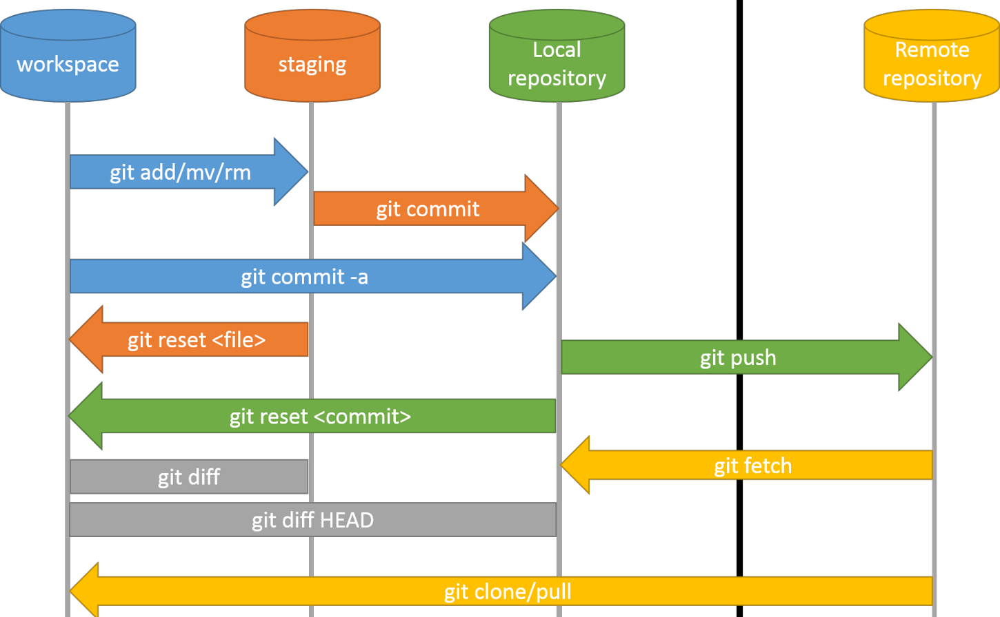

# Git


## Git 配置
- git config --global/local user.name "your name"
- git config --global/local user.email "your@example.com"
- git config --global/local --unser

global 的配置保存在 ~/.gitconfig 中，而 local 的文件保存在 $project/.git/config 中

## Git 常用基本操作命令
- git init：初始化仓库
- git status：显式工作区和暂存区的当前状态
- git add file1 file2 ...：将工作区文件保存到暂存区
- git commit [file1 file2 ...] -m "commits"：提交暂存区的文件到仓库
- git commit [file1 file2 ...] -amend [-m "new commits"]：修改（添加文件或修改注释）最后一次提交
- git commit [file1 file2 ...] -a "commits"：将工作区的文件添加到仓库
- git rm file1 file2 ...：删除暂存区的文件
- git mv old new：移动（重命名）暂存区的文件
- git rm --cached file1 file2 ...：停止跟踪指定文件，但该文件保留在工作区
- git diff：显式暂存区的文件和工作区的文件的不同
- git diff #id1 #id2：两个提交之间的不同

## Git 远程仓库
- git remote add #name #url：添加远程仓库 #name（远端默认名字为 origin，可以指定为其他名字）
- git remote rename #old #name：远程仓库重命名
- git remote remove #name：删除远程仓库
- git clone #url：克隆一个远端仓库到本地
- git push #remote #local：初次把本地仓库 #local 推送到远端仓库 #remote（初次推送添加 -u 选项）
- git fetch #remote：拉取远端仓库到本地
- git pull #remote #local：拉取远端仓库到本地并合并到 HEAD

## Git 版本回退
- git log：显示提交日志
- git reflog：查看命令历史
- git reset --hard #id：撤销提交，返回到 #id 版本
- git reset --hard HEAD^：撤销提交，回退到上一个版本，HEAD^^ 表示上上个版本，HEAD~100 上 100 个版本
- git reset HEAD [file1 file2 ...]：撤销暂存区的修改，重新放回工作区
- git checkout -- [file1 file2 ...]：撤销工作区的修改（撤销后和暂存区的文件一致）
- git checkout #id/branch -- [file1 file2 ...]：恢复 #id 的文件到工作区

## Git 分支版本控制
- git branch：查看当前分支，列出所有分支，当前分支前加 *
- git branch #name：创建 #name 分支
- git branch -m #oldname #newname：分支重命名
- git branch -d #name：删除分支
- git checkout #name：切换到 #name 分支
- git checkout -b #name：创建并切换到 #name 分支
- git merge #name：合并指定分支到当前分支
- git rebase #name：（换基）将但前分支接到 #name 后面

## Git 中 fetch 和 pull 的区别
git fetch 就是把远程仓库的代码下载过来，但是不会自动将远程 origin 分支合并到本地 master 分支。而 git pull 就是把远程仓库的代码下载过来，同时自动将远程 origin 分支合并到本地 master 分支

## Git中 rebase 和 merge 的区别？
git merge 自动根据两个分支的最近共同祖先提交和这两个分支的最新提交进行三方合并，合并后并生成一个新的提交，新的提交表示本次合并修改的内容，两个分支的所有提交历史都会保留。
```
git checkout mywork
git merge orgin
```


git rebase 将两个分支的提交历史进行合并，它的原理是首先找到这两个分支的最近共同祖先，然后对比当前分支相对于该祖先的历次提交，依次提取相应的修改并存为临时文件，然后将当前分支指向目标基底最新提交，最后将之前另存为临时文件的修改添加到基底后面生成新的提交
```
git checkout mywork
git rebase origin
```
